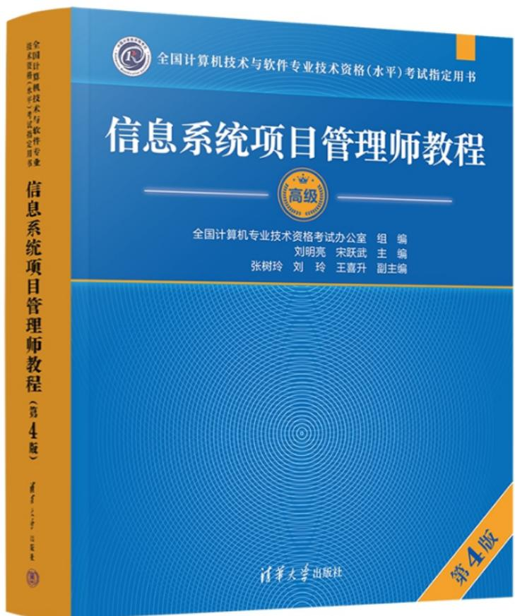
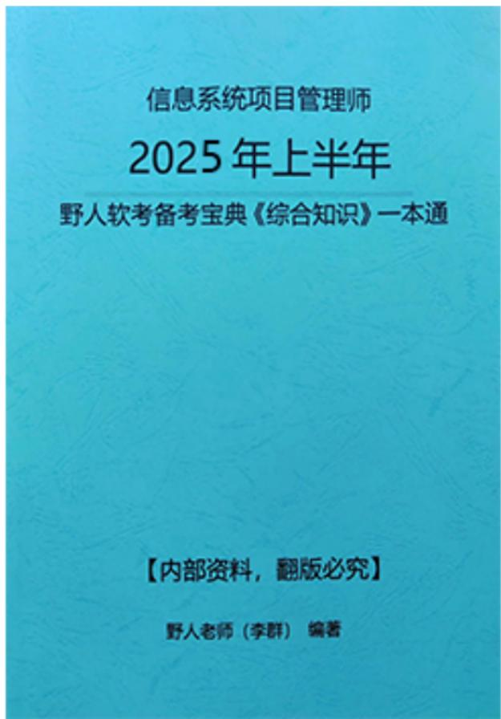
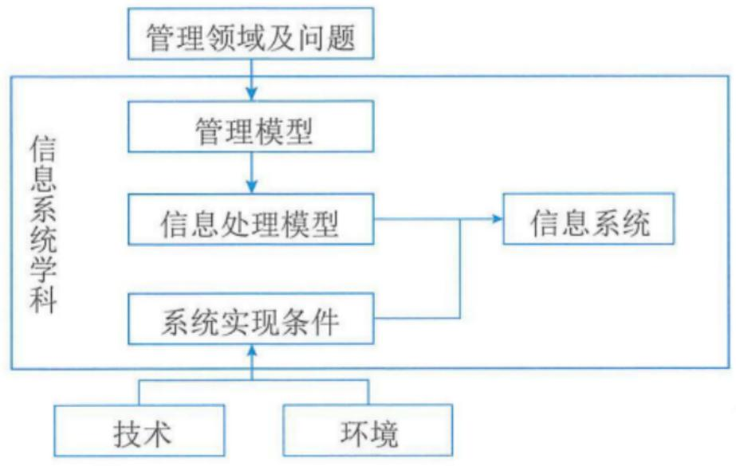
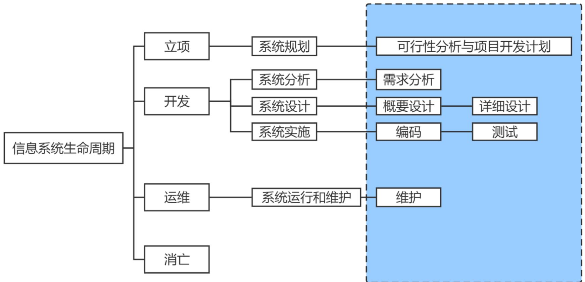
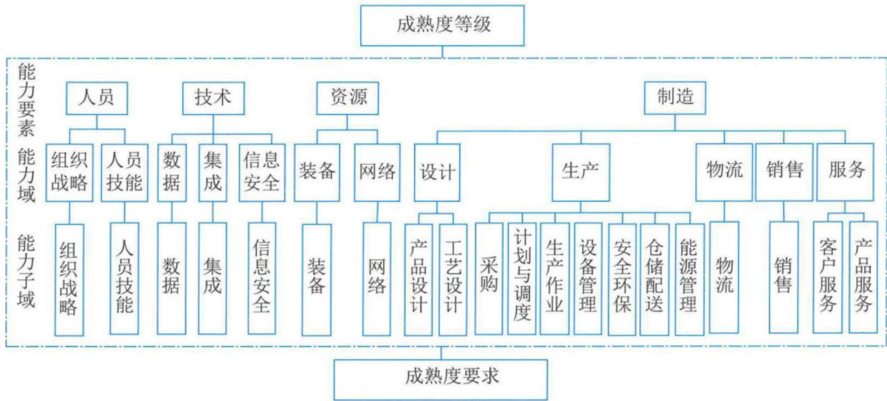
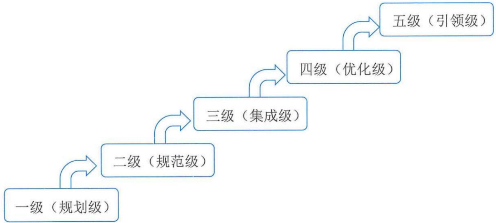
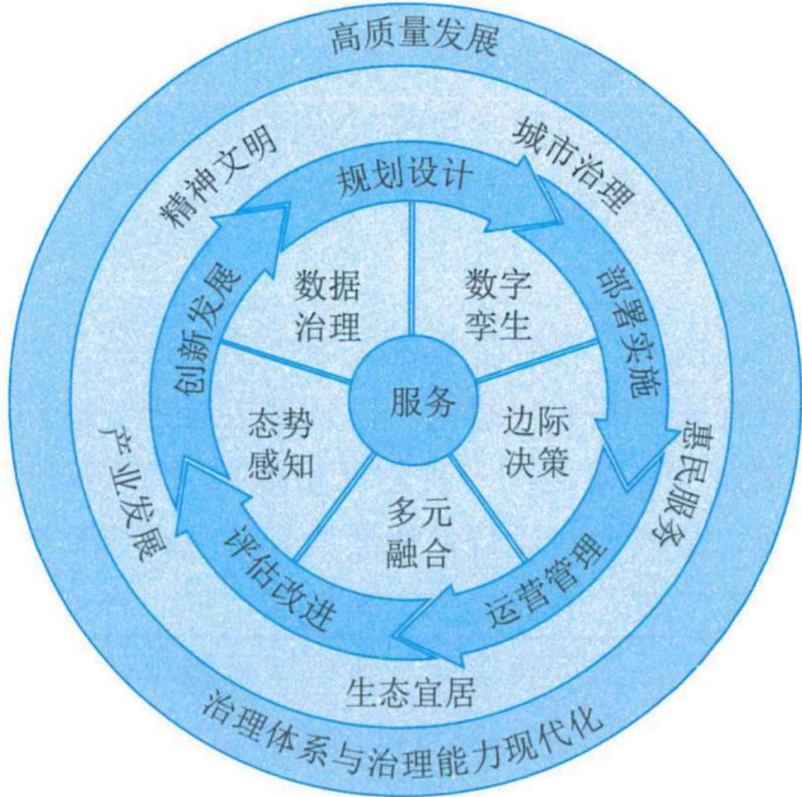
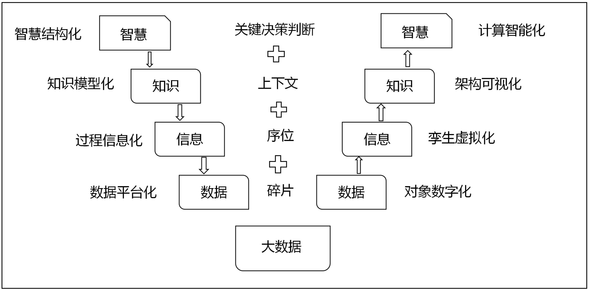

# 野人软考学院

# 信息化发展

# 信息系统项目管理师

官方教材：信息系统项目管理师教程 第4版

野人备考宝典《综合知识》一本通

# 配套书籍

信息系统项目管理师

2025年上半年

野人钦考备考宝典《章节分类练习与解析》

【内部资料，翻版必究】

野人老师（李群） 编著

# 试题16-【2024年上半年-第1批次】-新型基础设施建设

新型基础设施建设是以新发展理念为引领，以（）为驱动，以信息网络为基础，面向高质量发展需要的基础设施体系。

A. 工业互联网

B.技术创新

C. 人工智能

D. 区块链

【答案】B

【解析】P7，新型基础设施是以新发展理念为引领，以技术创新为驱动，以信息网络为基础，面向高质量发展需要，提供数字转型、智能升级、融合创新等服务的基础设施体系。目前，新型基础设施主要包括如下三个方面：信息基础设施、融合基础设施、创新基础设施。

# 高项备考宝典《章节分类练习与解析》

信息系统项目管理师

2025年上半年

野人软考备考宝典《章节分类练习无答案版》

【内部资料，翻版必究】

野人老师（李群）编著

# 试题16-【2024年上半年-第1批次】

新型基础设施建设是以新发展理念为引领，以（）为驱动，以信息网络为基础，面向高质量发展需要的基础设施体系。

A. 工业互联网

B.技术创新

C. 人工智能

D. 区块链

# 高项备考宝典《章节分类练习无答案版》

# 各章节总体考分分布

<table><tr><td>章节</td><td>上午选择</td><td>案例分析</td><td>论文</td><td>说明</td></tr><tr><td>第1-5章 - 是IT计算机基础知识</td><td>20分左右</td><td>可能考</td><td>不考</td><td>课要听一下，教材认真看，做课后题补充知识</td></tr><tr><td>第6章、第8-17章（十大管理）、第18章（项目绩效域）、第19章（变更部分）、第20章（高级项目管理）</td><td>40分左右</td><td>案例必考</td><td>论文必考</td><td>全书核心、重点学习、全面理解与掌握</td></tr><tr><td>第7章（立项）、第19章（配置、文档部分）、第22-24章（组织治理、组织管理、法律标准）</td><td>10分左右</td><td>可能考立项、配置</td><td>可能考立项、配置等</td><td>看《综合知识》一本通、多刷题</td></tr><tr><td>第21章 - 管理科学基础</td><td>5分左右</td><td>不考</td><td>不考</td><td>看视频和《计算案例背诵》一本通结合学习</td></tr><tr><td>英语</td><td>固定5分</td><td>不考</td><td>不考</td><td>多背《综合知识》一本通附录部分词汇表</td></tr><tr><td>合计</td><td>75分</td><td>75分</td><td>75分</td><td></td></tr></table>

# 第1-5章 计算机知识学习策略

1.【多数考选择题】第1-5章一般常在上午选择题里考。95%以上都是考最新第四版教材书上的原话，所以你只需要熟悉第四版官方教材，对重要知识点有个印象，会做选择题就可以了。  
2.【广而不深】这个考试对计算机知识要求有广度，但不要求深度，第1-5章教材上其实是把大学里很多计算机科目融在一起，罗列介绍性的知识点给大家看一下，扩展一下知识面，大家有个了解就可以了，这个也是考试的要求。并不需要你深入掌握每一个术语和知识，这些在大学里可能是十几个科目的知识，不可能在短期内全部搞通学透的。  
3.【死盯教材】所以学习第1-5章，不需要很深入把每个知识点、每个术语都搞通搞透，这样会累死人、而且太花时间，完全没有必要。学习要有效果，还要有效率！学习方法就是，死盯教材，教材可以多看几遍。  
4.【基础无所谓】不管你是不是计算机专业，学习第1-5章，方法都差不多的。没基础的学员也不用担心，学几遍下来，不管有没有基础，对于考试来说，大家都差不了太多，主要还是看教材的熟悉程度。很多0基础的学员，认真看视频看教材，上午分数都不低。  
5.【速战速决】第1-5章学习一定要速战速决，第一遍请在15天内学完，最多不要超过20天。学一遍下来做了题后题，心里就比较有底了。这些知识点学完很快就会忘的，后面冲刺和总复习时再反复看一下《综合知识》一本通和自己看过的教材知识点，经常去温故一下，考前用短期记忆应付选择题问题就不大了。不然你第1-5章就学了两个月甚至三个月，后面真正重要的项目管理知识没时间认真学，这就得不偿失了。

# 教材其他各章节学习策略

<table><tr><td>章节</td><td>学习说明</td></tr><tr><td>教材第6章，第8-17章，第18章（项目绩效域）第19章（变更）是项目 管理知识</td><td>必须认真看视频+做题。这部分是重中之重，是上午考试（上午大概40分）和下午案例分析（几乎全部）、论文考试的重点，这部分我们视频课程会讲得很详细，有不少扩展知识和延伸讲解，因为除了选择题，还有案例和论文啊！大家重点可以以听课为主、看教材为辅，视频不懂的部分可以多听几遍。</td></tr><tr><td>第7章 项目立项管理</td><td>一般只是上午选择题考，大概考2分左右。下午可能考，但是考的比较少。《综合知识》一本通+视频，有时间再看看教材；</td></tr><tr><td>第16章 合同管理部分</td><td>上午考1分左右，下午案例也可能会考（概率极小）。《综合知识》一本通+视频，有时间再看看教材；</td></tr><tr><td>第19章 配置与变更管理</td><td>上午考2-3分左右，配置下午案例也可能会考（概率较小），配置管理部分视频一定要看，方便你理解，有时间再看看教材。</td></tr><tr><td>第20章 高级项目管理</td><td>上午考3分左右，下午案例也可能考（概率小一些）。《综合知识》一本通+视频，有时间再看看教材；</td></tr><tr><td>第21章 管理科学基础知识</td><td>上午考4-5分，看视频为主，视频相对容易看懂，视频已包含教材的全部问题。把计算一本通中的题都做了就可以了。这块要全面复习太花时间，没必要。把视频中的问题搞懂练会，考试拿3分左右一般是可以的。</td></tr></table>

# 教材其他各章节学习策略

<table><tr><td>章节</td><td>学习说明</td></tr><tr><td>第22章 组织通用治理</td><td>上午考2分左右，案例基本不考，论文不考。《综合知识》一本通+视频，有时间再看看教材；</td></tr><tr><td>第23章 组织通用管理</td><td>上午考2分左右，案例基本不考，论文不考，《综合知识》一本通+视频，有时间再看看教材；</td></tr><tr><td>第24章 法律法规与标准规范</td><td>上午考3分左右，《综合知识》一本通+视频，有时间再看看教材；</td></tr></table>

# 本章学习建议

根据历年的考试情况来看，这一章的内容主要在上午进行考查。案例考的概率不大，论文一般不考，我们学习要以教材为准，本章一般会考3分左右，请大家认真学习下面的考点。

# 本章考情分析

<table><tr><td>年份</td><td>上午选择题</td><td>案例分析题</td><td>论文写作</td><td>合计</td></tr><tr><td>2023年05月</td><td>3</td><td>5</td><td>0</td><td>8</td></tr><tr><td>2023年11月</td><td>机考3分左右</td><td>0</td><td>0</td><td>3</td></tr><tr><td>2024年05月</td><td>机考3分左右</td><td>0</td><td>0</td><td>3</td></tr></table>

# 1.1信息与信息化(了解)

信息（Information）是物质、能量及其属性的标示的集合，是确定性的增加。它以物质介质为载体，传递和反映世界各种事物存在方式、运动状态等的表征。信息不是物质，也不是能量，它以一种普遍形式，表达物质运动规律，在客观世界中大量存在、产生和传递。

数学家香农指出：“信息是用来消除随机不定性的东西”。

# 信息的特征与质量(了解)

信息的特征，主要包括客观性、普遍性、无限性、动态性、相对性、依附性、变换性、传递性、层次性、系统性和转化性等。

获取信息可以满足人们消除不确定性的需求，因此信息具有价值，而价值的大小决定于信息的质量，这就要求信息满足一定的质量属性，主要包括精确性、完整性、可靠性、及时性、经济性、可验证性和安全性等。应用的场合不同，信息的侧重面也不一样。例如，对于金融信息而言，其最重要的特性是安全性；而对于经济与社会信息而言，其最重要的特性是及时性。

# 信息系统及其特征(了解)

以计算机为基础的信息系统可以定义为：结合管理理论和方法，应用信息技术解决管理问题，提高生产效率，为生产或信息化过程以及管理和决策提供支撑的系统。信息系统是管理模型、信息处理模型和系统实现条件的结

合。

  
图1-1 信息系统抽象模型

信息系统的组成部件包括硬件、软件、数据库、网络、存储设备、感知设备、外设、人员以及把数据处理成信息的规程等。从用途类型来划分，信息系统一般包括电子商务系统、事务处理系统、管理信息系统、生产制造系统、电子政务系统、决策支持系统等。

# 信息系统生命周期(掌握)

软件的生命周期通常包括：可行性分析与项目开发计划、需求分析、概要设计、详细设计、编码、测试、维护等阶段。

信息系统的生命周期可以简化为：系统规划(可行性分析与项目开发计划)，系统分析(需求分析)，系统设计(概要设计、详细设计)，系统实施(编码、测试)，系统运行和维护等阶段。

  
软件生命周期

# 信息系统生命周期(补充了解)

4大：立项、开发、运维、消亡  
5小：系统规划、系统分析、系统设计、系统实施、运行维护

1、立项(系统规划)：确定信息系统的发展战略，对建设新系统的要求做出分析和预测，写成可行性报告。  
2、开发

一系统分析：确定新系统的基本目标和逻辑功能要求，即提出新系统的逻辑模型  
一系统设计：具体设计实现逻辑模型的技术方案，也就是设计新系统的物理模型（系统分析阶段的任务是回答系统“做什么”的问题，而系统设计阶段要回答的问题是“怎么做”）

- 系统实施：将设计的系统付诸实施的阶段

3、系统运行和维护阶段：需要经常进行维护和评价，记录系统运行的情况  
4、消亡阶段

# 信息化内涵(掌握)

信息化的核心是要通过全体社会成员的共同努力，在经济和社会各个领域充分应用基于信息技术的先进社会生产工具，提高信息时代的社会生产力，并推动生产关系和上层建筑的改革，使国家的综合实力、社会的文明程度和人民的生活质量全面提升。信息化内涵主要包括：

- 信息网络体系：包括信息资源、各种信息系统、公用通信网络平台等。  
- 信息产业基础：包括信息科学技术研究与开发、信息装备制造、信息咨询服务等。  
- 社会运行环境：包括现代工农业、管理体制、政策法律、规章制度、文化教育、道德观念等生产关系与上层建筑。  
- 效用积累过程：包括劳动者素质、国家现代化水平和人民生活质量的不断提高，精神文明和物质文明建设不断进步等。

# 信息化体系六要素(掌握)

国家信息化体系包括信息技术应用、信息资源、信息网络、信息技术和产业、信息化人才、信息化政策法规和标准规范6个要素，这6个要素的关系构成了一个有机的整体，如图所示。

(以下1-6条为补充了解)

1、信息资源，信息资源的开发和利用是国家信息化的核心任务  
2、信息网络，信息网络是信息资源开发和利用的基础设施  
3、信息技术应用，是指把信息技术广泛应用于经济和社会各个领域，他直接反应了效率、效果、效益。信息技术应用是信息化体系六要素中的龙头，是国家信息化建设的主阵地  
4、信息技术与产业，是信息化的物质基础  
5、信息化人才，人才是信息化的成功之本  
6、信息化政策法规和标准规范，信息化政策和法规、标准、规范用于规范和协调信息化体系要素之间的关系，是国家信息化快速，有序，健康和持续发展的保障。

# 信息化体系六要素(掌握)

# 上鹰（应用）

左人（人才）

信息化人才

信息技术应用

信息资源

核心任务

基础设施

信息网络

信息技术和产业

信息化政策法规和标准规范

右龟（规范）

下鸡（技术）

# 信息化趋势(了解)

# (1) 组织信息化趋势

组织信息化除驱动和加速组织转型升级和生产力建设外，还呈现出产品信息化、产业信息化、社会生活信息化和国民经济信息化等趋势和方向。

产品信息化包含两层含义：①产品中各类信息比重日益增大、物质比重日益降低，其物质产品的特征向信息产品的特征迈进；②越来越多的产品中嵌入了智能化元器件，使产品具有越来越强的信息处理功能。

产业信息化指农业、工业、服务业等传统产业广泛利用信息技术，大力开发和利用信息资源，建立各种类型的产业互联网平台和网络，实现产业内各种资源、要素的优化与重组，从而实现产业的升级。

社会生活信息化指包括市场、科技、教育、军事、政务、日常生活等在内的整个社会体系采用先进的信息技术，建立各种互联网平台和网络，大力拓展人们日常生活的信息内容，丰富人们的精神生活，拓展人们的活动时空等。

国民经济信息化指在经济大系统内实现统一的信息大流动，使金融、贸易、投资、计划、营销等组成一个信息大系统，生产、流通、分配、消费等经济的四个环节通过信息进一步连成一个整体。国民经济信息化是世界各国急需实现的目标。

# 信息化趋势(了解)

# (2) 国家信息化趋势

《国家信息化发展战略纲要》强调国家信息化发展战略总目标是建设网络强国，分“三步走”：第一步到2020年，核心关键技术部分领域达到国际先进水平，信息产业国际竞争力大幅提升，信息化成为驱动现代化建设的先导力量；第二步到2025年，建成国际领先的移动通信网络，根本改变核心关键技术受制于人的局面，实现技术先进、产业发达、应用领先、网络安全坚不可摧的战略目标，涌现一批具有强大国际竞争力的大型跨国网信企业；第三步到21世纪中叶，信息化全面支撑富强民主文明和谐的社会主义现代化国家建设，网络强国地位日益巩固，在引领全球信息化发展方面有更大作为。当前，我国全面部署了“构建产业数字化转型发展体系”重大任务，明确我国信息化进入加快数字化发展、建设数字中国的新阶段。

《“十四五”国家信息化规划》明确了：建设泛在智联的数字基础设施体系，建立高效利用的数据要素资源体系，构建释放数字生产力的创新发展体系，培育先进安全的数字产业体系，构建产业数字化转型发展体系，构筑共建共治共享的数字社会治理体系，打造协同高效的数字政府服务体系，构建普惠便捷的数字民生保障体系，拓展互利共赢的数字领域国际合作体系和建立健全规范有序的数字化发展治理体系等重大任务。

# 1.2 现代化基础设施(掌握)

基础设施包括交通、能源、水利、物流等传统基础设施和以信息网络为核心的新型基础设施，在国家发展全局中具有战略性、基础性、先导性作用。

# 新型基础设施建设(掌握)

2018年召开的中央经济工作会议，首次提出“加快5G商用步伐，加强人工智能、工业互联网、物联网等新型基础设施建设”，简称“新基建”。“新型基础设施建设”的提法由此产生，其主要包括5G基建、特高压、城际高速铁路和城际轨道交通、新能源汽车充电桩、大数据中心、人工智能、工业互联网等七大领域。

新型基础设施是以新发展理念为引领，以技术创新为驱动，以信息网络为基础，面向高质量发展需要，提供数字转型、智能升级、融合创新等服务的基础设施体系。

# 新型基础设施建设(掌握)

新型基础设施主要包括如下三个方面。

(1) 信息基础设施。信息基础设施主要指基于新一代信息技术演化生成的基础设施。信息基础设施包括：①以5G、物联网、工业互联网、卫星互联网为代表的通信网络基础设施；②以人工智能、云计算、区块链等为代表的新技术基础设施；③以数据中心、智能计算中心为代表的算力基础设施等。信息基础设施凸显“技术新”。  
(2) 融合基础设施。融合基础设施主要指深度应用互联网、大数据、人工智能等技术，支撑传统基础设施转型升级，进而形成的融合基础设施。融合基础设施包括智能交通基础设施、智慧能源基础设施等。融合基础设施重在“应用新”，  
(3) 创新基础设施。创新基础设施主要指支撑科学研究、技术开发、产品研制的具有公益属性的基础设施。创新基础设施包括重大科技基础设施、科教基础设施、产业技术创新基础设施等。创新基础设施强调“平台新”。

# 工业互联网(掌握)

工业互联网（Industrial Internet）是新一代信息通信技术与工业经济深度融合的新型基础设施、应用模式和工业生态，通过对人、机、物、系统等的全面连接，构建起覆盖全产业链、全价值链的全新制造和服务体系，为工业乃至产业数字化、网络化、智能化发展提供了实现途径，是第四次工业革命的重要基石。

# 工业互联网(掌握)

工业互联网平台体系具有四大层级：它以网络为基础，平台为中枢，数据为要素，安全为保障。

# (1) 网络是基础

工业互联网网络体系包括网络互联、数据互通和标识解析三部分。

网络互联实现要素之间的数据传输，包括企业外网和企业内网。典型技术包括传统的工业总线、工业以太网以及创新的时间敏感网络(TSN)、确定性网络、5G等技术。

数据互通是通过对数据进行标准化描述和统一建模，实现要素之间传输信息的相互理解，数据互通涉及数据传输、数据语义语法等不同层面。

标识解析体系实现要素的标记、管理和定位，由标识编码、标识解析系统和标识数据服务组成，通过为物料、机器、产品等物理资源和工序、软件、模型、数据等虚拟资源分配标识编码，实现物理实体和虚拟对象的逻辑定位和信息查询，支撑跨企业、跨地区、跨行业的数据共享共用。

# (2) 平台是中枢

工业互联网平台体系包括边缘层、IaaS、PaaS和SaaS四个层级，相当于工业互联网的“操作系统”，它有四个主要作用：

(1)数据汇聚。网络层面采集的多源、异构、海量数据，传输至工业互联网平台，为深度分析和应用提供基础。  
(2)建模分析。提供大数据、人工智能分析的算法模型和物理、化学等各类仿真工具, 结合数字孪生、工业智能等技术, 对海量数据挖掘分析, 实现数据驱动的科学决策和智能应用。  
③知识复用。将工业经验知识转化为平台上的模型库、知识库，并通过工业微服务组件方式，方便二次开发和重复调用，加速共性能力沉淀和普及。  
(4)应用创新。面向研发设计、设备管理、企业运营、资源调度等场景，提供各类工业App、云化软件，帮助企业提质增效。

# (3) 数据是要素

工业互联网数据有三个特性:

(1)重要性。数据是实现数字化、网络化、智能化的基础，没有数据的采集、流通、汇聚、计算、分析，各类新模式就是无源之水，数字化转型也就成为无本之木。  
②专业性。工业互联网数据的价值在于分析利用，分析利用的途径必须依赖行业知识和工业机理。制造业千行百业、千差万别，每个模型、算法背后都需要长期积累和专业队伍，只有深耕细作才能发挥数据价值。  
(3)复杂性。工业互联网运用的数据来源于“研产供销服”各环节，“人机料法环”各要素，ERP、MES、PLC等各系统，维度和复杂度远超消费互联网，面临采集困难、格式各异、分析复杂等挑战。

# (4) 安全是保障

工业互联网安全体系涉及设备、控制、网络、平台、工业App、数据等多方面网络安全问题，其核心任务就是要通过监测预警、应急响应、检测评估、功能测试等手段确保工业互联网健康有序发展。与传统互联网安全相比，工业互联网安全具有三大特点：

(1) 涉及范围广。工业互联网打破了传统工业相对封闭可信的环境，网络攻击可直达生产一线。联网设备的爆发式增长和工业互联网平台的广泛应用，使网络攻击面持续扩大。  
②造成影响大。工业互联网涵盖制造业、能源等实体经济领域，一旦发生网络攻击、破坏行为，安全事件影响严重。  
③企业防护基础弱。目前我国广大工业企业安全意识、防护能力仍然薄弱，整体安全保障能力有待进一步提升。

# 工业互联网(掌握)

工业互联网融合应用推动了一批新模式、新业态孕育兴起，提质、增效、降本、绿色、安全发展成效显著，初步形成了六大类典型应用模式。

(1) 平台化设计。平台化设计是依托工业互联网平台，汇聚人员、算法、模型、任务等设计资源，实现高水平高效率的轻量化设计、并行设计、敏捷设计、交互设计和基于模型的设计，变革传统设计方式，提升研发质量和效率。  
(2) 智能化制造。智能化制造是互联网、大数据、人工智能等新一代信息技术在制造业领域加速创新应用，实现材料、设备、产品等生产要素与用户之间的在线连接和实时交互，逐步实现机器代替人工生产，智能化代表制造业未来发展的趋势。  
(3) 网络化协同。网络化协同是通过跨部门、跨层级、跨企业的数据互通和业务互联，推动供应链上的企业和合作伙伴共享客户、订单、设计、生产、经营等各类信息资源，实现网络化的协同设计、协同生产、协同服务，进而促进资源共享、能力交易以及业务优化配置等。

# 工业互联网(掌握)

(4) 个性化定制。个性化定制是面向消费者个性化需求，通过客户需求准确获取和分析、敏捷产品开发设计、柔性智能生产、精准交付服务等，实现用户在产品全生命周期中的深度参与，是以低成本、高质量和高效率的大批量生产实现产品个性化设计、生产、销售及服务的一种制造服务模式。  
(5) 服务化延伸。服务化延伸是制造与服务融合发展的新型产业形态，指的是企业从原有制造业务向价值链两端高附加值环节延伸，从以加工组装为主向“制造+服务”转型，从单纯出售产品向出售“产品+服务”转变，具体包括设备健康管理、产品远程运维、设备融资租赁、分享制造、互联网金融等。  
(6)数字化管理。数字化管理是企业通过打通核心数据链，贯通制造全场景、全过程，基于数据的广泛汇聚、集成优化和价值挖掘，优化、创新乃至重塑企业战略决策、产品研发、生产制造、经营管理、市场服务等业务活动，构建数据驱动的高效运营管理新模式。

# 车联网(掌握)

车联网是新一代网络通信技术与汽车、电子、道路交通运输等领域深度融合的新兴产业形态。智能网联汽车是搭载先进的车载传感器、控制器、执行器等装置，并融合现代通信与网络技术，实现车与车、路、人、云端等智能信息交换、共享，具备复杂环境感知、智能决策、协同控制等功能，可实现“安全、高效、舒适、节能”行驶的新一代汽车。

# 1. 体系框架

车联网（Internet of Vehicles, IoV）系统是一个“端、管、云”三层体系。

(1) 端系统。端系统是汽车的智能传感器负责采集与获取车辆的智能信息，感知行车状态与环境；是具有车内通信、车间通信、车网通信的泛在通信终端；同时还是让汽车具备IoV寻址和网络可信标识等能力的设备。  
(2) 管系统。管系统解决车与车、车与路、车与网、车与人等的互联互通，实现车辆自组网及多种异构网络之间的通信与漫游，在功能和性能上保障实时性、可服务性与网络泛在性，同时它是公网与专网的统一体。  
(3) 云系统。车联网是一个云架构的车辆运行信息平台，它的生态链包含了ITS、物流、客货运、危特车辆、汽修汽配、汽车租赁、企事业车辆管理、汽车制造商、4S店、车管、保险、紧急救援、移动互联网等，是多源海量信息的汇聚，因此需要虚拟化、安全认证、实时交互、海量存储等云计算功能，其应用系统也是围绕车辆的数据汇聚、计算、调度、监控、管理与应用的复合体系。

# 2.链接方式

车联网分别是车与云平台、车与车、车与路、车与人、车内设备之间等全方位网络链接。

(1) 车与云平台间的通信是指车辆通过卫星无线通信或移动蜂窝等无线通信技术实现与车联网服务平台的信息传输，接收平台下达的控制指令，实时共享车辆数据。  
(2) 车与车间的通信是指车辆与车辆之间实现信息交流与信息共享，包括车辆位置、行驶速度等车辆状态信息，可用于判断道路车流状况。  
(3) 车与路间的通信是指借助地面道路固定通信设施实现车辆与道路间的信息交流，用于监测道路路面状况，引导车辆选择最佳行驶路径。  
(4) 车与人间的通信是指用户可以通过Wi-Fi、蓝牙、蜂窝等无线通信手段与车辆进行信息沟通，使用户能通过对应的移动终端设备监测并控制车辆。  
(5) 车内设备间的通信是指车辆内部各设备间的信息数据传输，用于对设备状态的实时检测与运行控制，建立数字化的车内控制系统。

# 3.场景应用

(1) 实用类场景应用

例如自动碰撞通知、被盗车辆跟踪、道路救援等。

(2) 便捷类场景应用

例如信息娱乐类服务，人们通过内置的移动热点转换技术，在车上可购买和下载歌曲、有声读物、地图等；与商家之间的互联，未来人们可以通过语音或者手势控制，利用车联网技术预定餐厅，商超购物等。

(3) 效率类场景应用

此类应用首先是车辆系统的更新，车联网实现之后，人们无须再前往车辆服务中心，便可将车辆自动更新到最新的固件和软件。

# 1.3 现代化创新发展-农业农村现代化(掌握)

农业现代化是用现代工业装备农业，用现代科学技术改造农业，用现代管理方法管理农业，用现代科学文化知识提高农民素质的过程。

农业信息化是农业现代化的重要技术手段。

# 乡村振兴战略(掌握)

聚焦数字赋能农业农村现代化建设，重点建设基础设施、发展智慧农业和建设数字乡村等方面。

（1）建设基础设施。一手抓新建、一手抓改造，提出推动农村千兆光网、5G、移动物联网与城市同步规划建设，提升农村宽带网络水平，推动农业生产加工和农村基础设施数字化、智能化升级。  
(2) 发展智慧农业。建立和推广应用农业农村大数据体系，推动物联网、大数据、人工智能、区块链等新一代信息技术与农业生产经营深度融合，建设一批数字田园、数字灌区和智慧农牧渔场，不断提高农业发展数字化水平，让农业资源利用更加合理、农业经营管理更加高效。  
(3) 建设数字乡村。构建线上线下相结合的乡村数字惠民便民服务体系，推进“互联网+”政务服务向农村基层延伸，深化乡村智慧社区建设，促进农村教育、医疗、文化与数字化结合，提升乡村治理和服务的智能化、精准化水平。

# 两化融合与智能制造(掌握)

“深入实施智能制造和绿色制造工程，发展服务型制造新模式，推动制造业高端化、智能化、绿色化”是我国推动制造业优化升级的重点方向。

# 两化融合(掌握)

两化融合是信息化和工业化的高层次的深度结合，是指以信息化带动工业化、以工业化促进信息化，走新型工业化道路；两化融合的核心就是信息化支撑，追求可持续发展模式。

信息化与工业化主要在技术、产品、业务、产业四个方面进行融合。

(1) 技术融合。技术融合是指工业技术与信息技术的融合，产生新的技术，推动技术创新。例如，汽车制造技术和电子技术融合产生的汽车电子技术；工业和计算机控制技术融合产生的工业控制技术。  
(2) 产品融合。产品融合是指电子信息技术或产品渗透到产品中，增加产品的技术含量。例如，普通机床加上数控系统之后就变成了数控机床；传统家电采用了智能化技术之后就变成了智能家电；普通飞机模型增加控制芯片之后就成了遥控飞机。信息技术含量的提高使产品的附加值大大提高。  
(3) 业务融合。业务融合是指信息技术应用到企业研发设计、生产制造、经营管理、市场营销等各个环节，推动企业业务创新和管理升级。例如，计算机管理方式改变了传统手工台账，极大地提高了管理效率；信息技术应用提高了生产自动化、智能化程度，生产效率大大提高；网络营销成为一种新的市场营销方式，受众大量增加，营销成本大大降低。  
(4) 产业衍生。产业衍生是指两化融合可以催生出的新产业，形成一些新兴业态，如工业电子、工业软件、工业信息服务业。工业电子包括机械电子、汽车电子、船舶电子、航空电子等；工业软件包括工业设计软件、工业控制软件等；工业信息服务业包括工业企业B2B电子商务、工业原材料或产成品大宗交易、工业企业信息化咨询等。

# 智能制造(掌握)

智能制造（Intelligent Manufacturing, IM）是基于新一代信息通信技术与先进制造技术深度融合，贯穿于设计、生产、管理、服务等制造活动的各个环节，具有自感知、自学习、自决策、自执行、自适应等功能的新型生产方式。智能制造是一项重要的国家战略，也是各个国家推动新一代工业革命的关注焦点。

智能制造是一种由智能机器和人类专家共同组成的人机一体化智能系统，它在制造过程中能进行智能活动，诸如分析、推理、判断、构思和决策等。

GB/T 39116《智能制造能力成熟度模型》明确了智能制造能力建设服务覆盖的能力要素、能力域和能力子域。

# 智能制造(掌握)

GB/T 39116《智能制造能力成熟度模型》还规定了企业智能制造能力在不同阶段应达到的水平。成熟度等级分为五个等级，自低向高分别是一级（规划级）、二级（规范级）、三级（集成级）、四级（优化级）和五级（引领级）。较高的成熟度等级涵盖了低成熟度等级的要求。

  
图1-5 智能制造能力成熟度等级

# 智能制造(掌握)

<table><tr><td>级别</td><td>说明</td></tr><tr><td>·一级（规划级）</td><td>企业应开始对实施智能制造的基础和条件进行规划，能够对核心业务活动（设计、生产、物流、销售、服务）进行流程化管理。</td></tr><tr><td>·二级（规范级）</td><td>企业应采用自动化技术、信息技术手段对核心装备和业务活动等进改造和规范，实现单一业务活动的数据共享。</td></tr><tr><td>·三级（集成级）</td><td>企业应对装备、系统等开展集成，实现跨业务活动间的数据共享。</td></tr><tr><td>·四级（优化级）</td><td>企业应对人员、资源、制造等进行数据挖掘，形成知识、模型等，实现对核心业务活动的精准预测和优化。</td></tr><tr><td>·五级（引领级）</td><td>企业应基于模型持续驱动业务活动的优化和创新，实现产业链协同并衍生新的制造模式和商业模式。</td></tr></table>

# 消费互联网(掌握)

消费互联网是以个人为用户，以日常生活为应用场景的应用形式，满足消费者在互联网中的消费需求而生的互联网类型。消费互联网以消费者为服务中心，针对个人用户提升消费过程的体验，在人们的阅读、出行、娱乐、生活等诸多方面进行改善，让生活变得更方便、更快捷。消费互联网本质是个人虚拟化，增强个人生活消费体验。

# 1. 基本属性

消费互联网具有的属性包括：

- 媒体属性：由自媒体、社会媒体以及资讯为主的门户网站。  
- 产业属性：由在线旅行和为消费者提供生活服务的电子商务等其他组成。

# 2.应用新格局

社交圈会因特定的因素而聚集，从而带来了新型网络经济，如网络商城、快递、餐饮外卖、网红带货等，成就了社交网络的消费互联网的核心地位。

消费互联网不仅仅给人们带来了生活方式的变化和生活质量的提高，而且推动了社会生活的深层变革，那就是“无身份社会”的建立。

# 1.4 数字中国(掌握)

数字中国是新时代国家信息化发展的新战略，是满足人民日益增长的美好生活需要的新举措，是驱动引领经济高质量发展的新动力，涵盖经济、政治、文化、社会、生态等各领域信息化建设，主要包括宽带中国、互联网+、大数据、云计算、人工智能、数字经济、电子政务、新型智慧城市、数字乡村等内容。”迎接数字时代，激活数据要素潜能，推进网络强国建设，加快建设数字经济、数字社会、数字政府，以数字化转型整体驱动生产方式、生活方式和治理方式变革”成为了新时代我国信息化发展的主旋律。

# 1.4 数字中国(掌握)

# 数字经济(掌握)

数字经济是继农业经济、工业经济之后的更高级经济形态。从本质上看，数字经济是一种新的技术经济范式，它建立在信息与通信技术的重大突破的基础上，以数字技术与实体经济融合驱动的产业梯次转型和经济创新发展的主引擎，在基础设施、生产要素、产业结构和治理结构上表现出与农业经济、工业经济显著不同的新特点。

# 主要内容构成

从产业构成来看，数字经济包括数字产业化和产业数字化两大部分。《数字经济及其核心产业统计分类(2021)》给出了数字经济具体分类，分别是：数字产品制造业、数字产品服务业、数字技术应用业、数字要素驱动业和数字化效率提升业，其中，前4类为数字产业化部分，第5类为产业数字化部分。从整体构成上看，数字经济包括数字产业化、产业数字化、数字化治理和数据价值化四个部分。

# 数字经济(掌握)

# (1) 数字产业化

数字产业化是指为产业数字化发展提供数字技术、产品、服务、基础设施和解决方案，以及完全依赖于数字技术、数据要素的各类经济活动，包括电子信息制造业、电信业、软件、信息技术、互联网行业等。

数字产业化发展重点包括：云计算、大数据、物联网、工业互联网、区块链、人工智能、虚拟现实和增强现实。

# 数字经济(掌握)

# (2) 产业数字化

产业数字化是指在新一代数字科技支撑和引领下，以数据为关键要素，以价值释放为核心，以数据赋能为主线，对产业链上下游的全要素数字化升级、转型和再造的过程。产业数字化作为实现数字经济和传统经济深度融合发展的重要途径，是新时代背景下使用数字经济发展的必由之路和战略抉择。《中华人民共和国国民经济和社会发展第十四个五年规划和2035年远景目标纲要》明确提出了推进产业数字化转型，实施“上云用数赋智”行动，推动数据赋能全产业链协同转型。

# 数字经济(掌握)

产业数字化具有的典型特征包括：

- 以数字科技变革生产工具；  
- 以数据资源为关键生产要素；  
- 以数字内容重构产品结构；  
- 以信息网络为市场配置纽带；  
- 以服务平台为产业生态载体；  
- 以数字善治为发展机制条件。

# 数字经济(掌握)

# (3) 数字化治理

数字化治理通常指依托互联网、大数据、人工智能等技术和应用，创新社会治理方法与手段，优化社会治理模式，推进社会治理的科学化、精细化、高效化，助力社会治理现代化。

数字化治理的核心特征是全社会的数据互通、数字化全面协同与跨部门的流程再造，形成“用数据说话、用数据决策、用数据管理、用数据创新”的治理机制。

数字化治理的内涵包含：对数据的治理、运用数据进行治理、对数字融合空间进行治理。

# 数字经济(掌握)

# (4) 数据价值化

价值化的数据是数字经济发展的关键生产要素，加快推进数据价值化进程是发展数字经济的本质要求。近年来，数据可存储、可重用、呈现爆发增长、海量集聚的特点，是实体经济数字化、网络化、智能化发展的基础性战略资源。数据价值化包括但不限于数据采集、数据标准、数据确权、数据标注、数据定价、数据交易、数据流转、数据保护等。

数据价值化是指以数据资源化为起点，经历数据资产化、数据资本化阶段，实现数据价值化的经济过程。上述三个要素构成数据价值化的“三化”框架，即数据资源化、数据资产化、数据资本化。

# 数字经济(掌握)

# 细化描述为：

- 数据资源化：是使无序、混乱的原始数据成为有序、有使用价值的数据资源。数据资源化阶段包括通过数据采集、整理、聚合、分析等，形成可采、可见、标准、互通、可信的高质量数据资源。数据资源化是激发数据价值的基础，其本质是提升数据质量，形成数据使用价值的过程。  
- 数据资产化：是数据通过流通交易给使用者或者所有者带来的经济利益的过程。数据资产化是实现数据价值的核心，其本质是形成数据交换价值，初步实现数据价值的过程。  
- 数据资本化：主要包括两种方式，数据信贷融资与数据证券化。数据资本化是拓展数据价值的途径，其本质是实现数据要素社会化配置。

# 数字政府(掌握)

数字政府通常是指以新一代信息技术为支撑，以“业务数据化、数据业务化”为着力点，通过数据驱动重塑政务信息化管理架构、业务架构和组织架构，形成“用数据决策、数据服务、数据创新”的现代化治理模式。

# 1.数字新特征

数字政府既是“互联网+政务”深度发展的结果，也是大数据时代政府自觉转型升级的必然，其核心目的是以人为本，实施路径是共创、共享、共建、共赢的生态体系。

# 数字政府(掌握)

同时数字政府也被赋予了新的特征：

·协同化：主要强调组织的互联互通，业务协同方面能实现一个跨层级、跨地域、跨部门、跨系统、跨业务的高效协同管理和服务。  
·云端化：云平台是政府数字化最基本的技术要求，政务上云是促成各地各部门由分散建设向集群集约式规划与建设的演化过程，是政府整体转型的必要条件。  
- 智能化：智能化治理是政府应对社会治理多元参与、治理环境越发复杂、治理内容多样化趋势的关键手段。  
- 数据化：数据化也是现阶段数字政府建设的重点，是建立在政务数据整合共享基础上的数字化的转型。  
- 动态化：指数字政府是在数据驱动下动态发展不断演进的过程。

# 数字政府(掌握)

数字政府建设关键词主要包括：

- 共享：推动政务数据共享，推进政务服务事项集成化办理。数字政府，数据先行。数据共享是提升政务服务效能的重要抓手。  
- 互通：国家政务服务平台持续推动与各地区、各部门政务服务业务办理系统的全面对接融合，打破地域阻隔与部门壁垒，实现更大范围内的系统互联互通，有力推动了政务服务线上线下融合互通和跨地区、跨部门、跨层级协同办理。  
·便利：数字政府，利企便民。加强数字政府建设的根本目标是更好地服务企业和群众，满足人民日益增长的美好生活需要。

# 数字政府(掌握)

# 2. 主要内容

《“十四五”国家信息化规划》中提出了打造协同高效的数字政府体系，深入推进“放管服”改革，加快政府职能转变，打造市场化、法治化、国际化营商环境，坚持整体集约建设数字政府，推动条块政务服务协同，加快政务数据开放共享和开发利用，深化推进，“一网通办”“跨省通办”“一网统管”，畅通参与政策制定的渠道，推动国家行政体系更加完善、政府作用更好发挥、行政效率和公信力显著提升，推动有效市场和有为政府更好结合，打造服务型政府。

# 数字政府(掌握)

# 2. 主要内容

数字政府从面向社会大众政务服务服务视角来看，主要内容重点体现在“一网通办”“跨省通办”“一网统管”。

(1) 一网通办

企业群众办事线上只登录一次即可全网通办。

(2) 跨省通办

申请人在办理地之外的省市提出事项申请或在本地提出办理其他省市事项申请，办理模式通常可分为全程网办、代收代办和多地联办等。

(3) 一网统管

“一网统管”通常从城市治理突出问题出发，以城市事件为牵引，统筹管理网格，统一城市运行事项清单，构建多级城市运行“一网统管”应用体系。

“一网统管”建设通常强调：一网、一屏、联动、预警、创新。

# 数字政府(掌握)

(1) 一网：主要包括政务云、政务网和政务大数据中心等。  
(2) 一屏：通过对多个部门的数据进行整合，将城市运行情况充分反映出来。  
(3) 联动：畅通各级指挥体系，为跨部门、跨区域、跨层级联勤联动、高效处置提供快速响应能力。  
(4) 预警：基于多维、海量、全息数据汇集，实现城市运行体征的全量、实时掌握和智能预警。  
⑤ 创新：以管理需求带动智能化建设，以信息流、数据流推动业务流程全面优化和管理创新。

# 1. 数字民生

将“人”与“公共服务”通过数字化的方式全面连接，将大幅提升社会整体服务效率和水平，实现数字民生。

数字民生建设重点通常强调：

- 普惠：充分开发利用信息技术体系，扩大民生保障覆盖范围，助力普惠型民生建设，解决民生资源配置不均衡等问题。  
- 赋能：信息技术体系与民生的深度融合赋予了民生建设新动能，促进民生保障实效指数式增长，如“互联网+教育”“互联网+医疗”“互联网+养老”“互联网+交通”等。  
·利民：信息技术体系创新拓展了公共服务场景，推动数字技术全面融入社会交往和日常生活新趋势，使民生服务日趋智慧化、便利化和人性化。

# 数字社会(掌握)

# 2. 智慧城市

智慧城市是运用信息通信技术，有效整合各类城市管理系统，实现城市各系统间信息资源共享和业务协同，推动城市管理和服务智慧化，提升城市运行管理和公共服务水平，提高城市居民幸福感和满意度，实现可持续发展的一种创新型城市。

# (1) 基本原理

智慧城市基本原理表现为：

(1)强调“人民城市为人民”，以面向政府、企业、市民等主体提供智慧化的服务为主要模式；  
(2)重点强化数据治理、数字孪生、边际决策、多元融合和态势感知五个核心能力要素建设；  
③更加注重规划设计、部署实施、运营管理、评估改进和创新发展在内的智慧城市全生命周期管理；  
④目标旨在推动城市治理、民生服务、生态宜居、产业经济、精神文明五位一体的高质量发展；  
(5)持续推动城市治理体系与治理能力现代化水平提升。

# 数字社会(掌握)

  
图1-7 智慧城市参考基本原理图

# 数字社会(掌握)

该原理确立的智慧城市核心能力要素，揭示了当前及未来一段时期智慧城市发展的重心在于信息技术与社会发展的深度融合。智慧城市的五个核心能力要素密切关联且相互影响，但不可互为替代，均是开展新一阶段智慧城市整体、局部乃至具体项目建设、运行需要关注的核心能力要素。对核心能力要素解释为：

- 数据治理：围绕数据这一新的生产要素进行能力构建，包括数据责权利管控、全生命周期管理及其开发利用等。  
- 数字孪生：围绕现实世界与信息世界的互动融合进行能力构建，包括社会孪生、城市孪生和设备孪生等，将推动城市空间摆脱物理约束，进入数字空间。  
- 边际决策：基于决策算法和信息应用等进行能力构建，强化执行端的决策能力，从而达到快速反应、高效决策的效果，满足对社会发展的敏捷需求。  
- 多元融合：强调社会关系和社会活动的动态性及其融合的高效性等，实现服务可编排和快速集成，从而满足各项社会发展的创新需求。  
- 态势感知：围绕对社会状态的本质反映及模拟预测等进行能力构建，洞察可变因素与不可见因素对社会发展的影响，从而提升生活质量。

# 数字社会(掌握)

# (2) 成熟度等级

可将智慧城市发展成熟度划分为规划级、管理级、协同级、优化级、引领级5个等级。

<table><tr><td>级别</td><td>说明</td></tr><tr><td>·一级（规划级）</td><td>应围绕智慧城市的发展进行策划，明确相关职责分工和工作机制等，初步开展数据采集和应用，确保相关活动有序开展。</td></tr><tr><td>·二级（管理级）</td><td>应明确智慧城市发展战略、原则、目标和实施计划等，推进城市基础设施智能化改造，多领域实现信息系统单项应用，对智慧城市全生命周期实施管理。</td></tr><tr><td>·三级（协同级）</td><td>应管控智慧城市各项发展目标，实施多业务、多层级、跨领域应用系统的集成，持续推进信息资源的共享与交换，推动惠民服务、城市治理、生态宜居、产业发展等的融合创新，实现跨领域的协同改进。</td></tr><tr><td>·四级（优化级）</td><td>应聚焦智慧城市与城市经济社会发展深度融合，基于数据与知识模型实施城市经济、社会精准化治理，推动数据要素的价值挖掘和开发利用，推进城市竞争力持续提升。</td></tr><tr><td>·五级（引领级）</td><td>应构建智慧城市敏捷发展能力，实现城市物理空间、社会空间、信息空间的融合演进和共生共治，引领城市集群治理联动，形成高质量发展共同体。</td></tr></table>

# 数字社会(掌握)

# 3. 数字乡村

数字乡村是伴随网络化、信息化和数字化在农业农村经济社会发展中的应用，以及农民现代信息技能的提高而内生的农业农村现代化发展和转型进程，既是乡村振兴的战略方向，也是建设数字中国的重要内容。

# 数字社会(掌握)

# 4. 数字生活

数字生活是依托互联网和一系列数字科技技术应用为基础的一种生活方式，可以方便快捷地带给人们更好的生活体验和工作便利。数字生活主要体现在如下方面。

(1) 生活工具数字化。数字化生活时代, 信息技术和产品成为极其重要的生活工具, 人们将像享受空气、阳光、水一样享受数字化生活工具带来的舒适和便捷。根据摩尔定律和梅特卡夫定律, 随着技术的不断创新与广泛扩散, 其应用成本将显著下降, 而其价值则显著增加。  
（2）生活方式数字化。在数字社会中，借助于数字化技术，每个人的工作、学习、消费、交往、娱乐等各种活动方式都将具有典型的数字化特征，数字家庭成为未来家庭的发展趋势。体现在工作更加弹性化和自主化；终身学习与随时随地学习成为可能；网络购物跻身主流消费方式；人际交往的范围与空间无限扩大等。  
(3) 生活内容数字化。数字生活时代, 人们工作、学习、消费和娱乐的内容具有典型的数字化特征。生活内容数字化体现在工作内容以创造、处理和分配信息为主; 学习内容个性化; 信息成为重要消费内容; 娱乐内容数字化等。

# 数字生态(掌握)

# 1. 数据要素市场

随着数字经济的快速发展，数据作为数字经济的关键要素，对我国经济高质量发展的重要作用日益凸显。

# 2. 数字营商环境

良好的营商环境是一个国家或地区经济软实力和综合竞争力的重要体现。

# 3.网络安全保护

强大的网络安全产业实力是保障网络空间安全的根本和基石。

# 1.5 数字化转型与元宇宙-数字化转型 (掌握)

数字化转型 (Digital Transformation) 是建立在数字化转换 (Digitization)、数字化升级 (Digitalization) 基础上，进一步触及组织核心业务，以新建一种业务模式为目标的高层次转型。

# 1.驱动因素

(1) 生产力飞升：第四次科技革命  
(2) 生产要素变化：数据要素的诞生  
(3) 信息传播效率突破：社会互联网新格局  
(4) 社会 “智慧主体” 规模: 快速复制与 “智能+”

# 2.基本原理

数字经济时代，经济与社会竞争的进一步加剧，传统发展视角下的竞争力与竞争优势的保持和增强等方法，越来越难以支撑组织的发展需求，主要体现在：决策瓶颈、变革制约、知识资产流失、需求响应延迟。

# 3.智慧转移

数字化转型基本原理揭示了个体智慧（知识、技能和经验等）由“自然人”个体，转移到组织智慧（计算机、信息系统等掌握的）的必要性和重要性。这种“智慧转移”也称“智慧移植”，需要经历系列的过程才能完成，每个组织开展此类活动的模式与方法存在差异。也可以参考下图所示的“智慧转移”模型。

(1) “智慧-数据”过程：信息化过程（脑力替代）  
(2) “数据-智慧”过程: 智慧化过程(第四次科技革命的触发逻辑)

# 数字化转型 (掌握)

“数据-智慧”过程该过程通常指数据的开发利用和资源管理的过程，即人们常说的“智慧化过程”，重点解决基于各类组织组成对象“数字关系”的“脑力替代”。该过程在大数据“筑底”后，多元化数据能够被开发利用：

(1) 通过对象数字化实现对各类对象的数字化表达；  
(2) 通过孪生虚拟化完成物理对象到信息空间的映射；  
(3) 通过架构可视化实现业务知识模型与经验沉淀的复用和创新；  
(4) 通过计算智能化实现多元条件下的调度和决策。

  
图1-10 智慧转移的S8D模型

# 4.持续迭代

组织数字化转型需要在能力因子不断细化的基础上，针对能力因子的数字化转型实施迭代，可类比为整体数字化转型与局部数字转型的关系。组织每个能力因子数字化“封装”的持续迭代主要包含四项活动，即：信息物理世界（也称数字孪生CPS）建设、决策能力边际化（PtoE）部署、科学社会物理赛博机制构筑（CPSS）、数字框架与信息调制（DFIM）。

# 元宇宙(掌握)

元宇宙(Metaverse)是一个新兴概念，是一大批技术的集成。

- 北京大学陈刚教授对元宇宙的定义是：元宇宙是利用科技手段进行链接与创造的，与现实世界映射与交互的虚拟世界，具备新型社会体系的数字生活空间。  
- 清华大学沈阳教授对元宇宙的定义是：元宇宙是整合多种新技术而产生的新型虚实相融的互联网应用和社会形态，它基于扩展现实技术提供沉浸式体验，以及数字孪生技术生成现实世界的镜像，通过区块链技术搭建经济体系，将虚拟世界与现实世界在经济系统、社交系统、身份系统上密切融合，并且允许每个用户进行内容生产和编辑。  
- 中国社会科学院学者左鹏飞从时空性、真实性、独立性、连接性四个方面去交叉定义元宇宙。  
- 从时空性来看，元宇宙是一个空间维度上虚拟而时间维度上真实的数字世界；  
- 从真实性来看，元宇宙中既有现实世界的数字化复制物，也有虚拟世界的创造物；  
- 从独立性来看，元宇宙是一个与外部真实世界既紧密相连，又高度独立的平行空间；  
- 从连接性来看，元宇宙是一个把网络、硬件终端和用户囊括进来的一个永续的、广覆盖的虚拟现实系统。

# 1. 主要特征

元宇宙的主要特征包括：

<table><tr><td>主要特征</td><td>说明</td></tr><tr><td>·沉浸式体验</td><td>元宇宙的发展主要基于人们对互联网体验的需求，这种体验就是即时信息基础上的沉浸式体验。</td></tr><tr><td>·虚拟身份</td><td>人们已经拥有大量的互联网账号，未来人们在元宇宙中，随着账号内涵和外延的进一步丰富，将会发展成为一个或若干个数字身份，这种身份就是数字世界的一个或一组角色。</td></tr><tr><td>·虚拟经济</td><td>虚拟身份的存在就促使元宇宙具备了开展虚拟社会活动的能力，而这些活动需要一定的经济模式展开，即虚拟经济。</td></tr><tr><td>·虚拟社会治理</td><td>元宇宙中的经济与社会活动也需要一定的法律法规和规则的约束，就像现实世界一样，元宇宙也需要社区化的社会治理。</td></tr></table>

# 元宇宙(掌握)

# 2. 发展演进

从互联网发展的基本规律和数字化转型进程来看，元宇宙首先会在社交、娱乐和文化领域发展，形成虚拟“数字人”，逐步再向虚拟身份方向演进，形成“数字人生”，此时的元宇宙偏向个体用户需求。

元宇宙的虚拟世界形态持续迭代，形成“数字社会治理”，实现物理空间、社会空间和信息空间三元空间的协同发展新格局。

# 本章练习

(1) 下列说法正确的是 ( )。

A.信息只存在家庭中  
B.信息只存在图书馆中  
c.信息只存在校园里  
D.信息无处不在

参考答案：D

# 本章练习

(2) 信息的基础是 ( )。

A.数据

B.知识

C.事实

D.概念

参考答案：A

(3) 工业互联网的体系不包括 ( )。

A.网络

B. 平台

C.技术

D.安全

参考答案：C

# 本章练习

(4) 支撑科学研究、技术开发、产品研制的具有公益属性的基础设施属于 ( )。

A.信息基础设施

B.融合基础设施

C. 创新基础设施

D.网络基础设施

参考答案 : C

(5) GB/T39116《智能制造能力成熟度模型》规定了企业智能制造能力在不同阶段应达到的水平。若企业应对装备、系统等开展集成，实现跨业务活动间的数据共享，则该企业属于（）水平。

A.一级(规划级)

B.二级(规范级)

C.三级(集成级)

D.四级(优化级)

参考答案 : C

# 本章练习

(6)《中华人民共和国国民经济和社会发展第十四个五年规划和2035年远景目标》中从数字经济、数字政府、数字社会、（）四个维度出发勾勒了建设数字中国的宏伟蓝图。

A.数字生态

B.数字技术

C.数字服务

D.数字人才

参考答案 : A

(7) ( )不属于智慧城市核心要素。

A.数据治理、边际决策、多元融合  
B.数据治理、数字孪生、边际决策  
C.数据管理、数字孪生、态势感知  
D.数字孪生、多元融合、态势感知

参考答案 : C

# 本章练习

(8) 智慧城市发展过程中，能够明确智慧城市发展战略、原则、目标和实施计划等，推进城市基础设施的智能化改造，多领域实现信息系统单项应用，对智慧城市全生命周期实施管理，则该智慧城市成熟度处于（）水平。

A.规划级

B.管理级

C.协同级

D.优化级

参考答案：B

# 历年真题练习

# 【2023年上半年-第1题】

“新型基础设施”主要包括信息技术设施，融合基础设施和创新基础设施三个方面，其中信息基础设施包括（）。

①通信基础设施 ②智能交通基础设施 ③新技术基础设施 ④科研基础设施 ⑤算力基础设施

A.①③⑤

B.①④⑤

C.②③④

D.②③⑤

【答案】A

# 历年真题练习

# 【2023年下半年-第4批次】

车联网系统是一个“端、管、云”三层体系。其中（）解决互联互通问题，（）是多源海量信息的汇聚。

A.云系统、端系统 B.端系统、云系统 C.端系统、管系统 D.管系统、云系统

【答案】D

# 历年真题练习

# 【2024年上半年-第2批次】

《“十四五”国家信息化规划》中提出了打造协同高效的数字政府体系，深入推进“放管服”改革，加快政府职能转变，打造市场化、法治化、国际化营商环境，坚持整体集约建设数字政府，推动条块政务服务协同，（）深化推进，“一网通办”“跨省通办”“一网统管”，畅通参与政策制定的渠道，推动国家行政体系更加完善、政府作用更好发挥、行政效率和公信力显著提升，推动有效市场和有为政府更好结合，打造服务型政府。

A.加快政务数据资产使用便捷性  
B.加快政务数据开放共享和开发利用  
c.加快推动政务数据的价值提升和变现  
D.严格管控政务数据的质量和使用范围

# Thank You!

微信公众号：野人老师 淘宝店铺：yeren.taobao.com