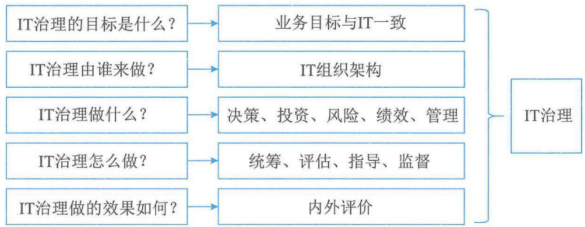
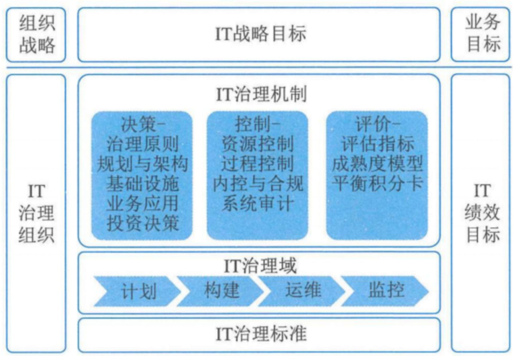
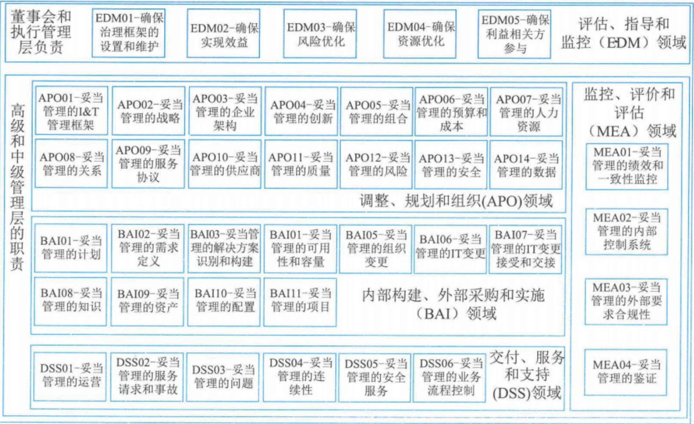

# 信息系统治理

# 信息系统项目管理师

# 本章学习建议

根据历年的考试情况来看，这一章的内容主要在上午进行考查。案例和论文一般不会涉及，我们学习要以教材为准，本章预计会考2分左右，请大家认真学习下面的考点。

# 本章考情分析

<table><tr><td>年份</td><td>上午选择题</td><td>案例分析题</td><td>论文写作</td><td>合计</td></tr><tr><td>2023年05月</td><td>2</td><td>0</td><td>0</td><td>2</td></tr><tr><td>2023年11月</td><td>机考2分左右</td><td>0</td><td>0</td><td>2</td></tr><tr><td>2024年05月</td><td>机考3分左右</td><td>0</td><td>0</td><td>3</td></tr></table>

# 3.1 IT治理(掌握)

信息系统治理（IT治理）是组织开展信息技术及其应用活动的重要管控手段，也是组织治理的重要组成部分，尤其在以数字化发展为重要关注点的新时代，组织的数字化转型和组织建设过程中，IT治理起到重要的统筹、评估、指导和监督作用。信息技术审计（IT审计）作为与IT治理配套的组织管控手段，是IT治理不可或缺的评估和监督工具，重点承担着组织信息系统发展的合规性检测以及信息技术风险的管控等职能。

# 3.1.1 IT治理基础(掌握)

IT治理是描述组织采用有效的机制对信息技术和数据资源开发利用，平衡信息化发展和数字化转型过程中的风险，确保实现组织的战略目标的过程。

# 1. IT治理的驱动因素

组织信息系统建设和运行需要制订总体规划，但制订IT资源统一规划存在很多问题：①分散开发或引进的信息系统，形成了许多“信息孤岛”，缺乏共享的、网络化的信息资源，系统集成难题一直无法解决；②信息资源整合目标空泛，没有整合“信息孤岛”的措施，数据中心建设和数据集中管理等规划缺乏可操作性，尤其是缺少数据标准化建设方面的建设规划。

IT治理是指组织在开发利用信息技术过程中，为鼓励组织所期望的组织行为而明确决策权归属和责任担当的框架，其目标是通过IT治理的决策权和责任影响组织所期望的组织行为。

# 3.1.1 IT治理基础(掌握)

# 2. IT治理的目标价值

IT治理主要目标包括：与业务目标一致、有效利用信息与数据资源、风险管理。

(1) 与业务目标一致。IT治理要从组织目标和数字战略中抽取信息与数据需求和功能需求，形成总体的IT治理框架和系统整体模型，为进一步系统设计和实施奠定基础，保证信息技术开发利用跟上持续变化的业务目标。  
(2) 有效利用信息与数据资源。目前信息系统工程超期、IT 客户的需求没有满足、IT 平台不支持业务应用、数据开发利用效能与价值不高、信息技术与业务发展融合深度不够等问题突出，通过 IT 治理对信息与数据资源的管理职责进行有效管理，保证投资的回收，并支持决策。  
(3) 风险管理。由于组织越来越依赖于信息网络、信息系统和数据资源等，新的风险不断涌现，例如，新出现的技术没有管理，不符合现有法律和规章制度，没有识别对IT服务的威胁等。IT治理重视风险管理，通过制定信息与数据资源的保护级别，强调对关键的信息与数据资源，实施有效监控和事件处理。

# 3.1.1 IT治理基础(掌握)

# 3. IT治理的管理层次

IT治理要保证总体战略目标能够从上而下贯彻执行，治理层主要集中在最高管理层（如董事会）和管理执行层。

管理层次大致可分为三层：最高管理层、执行管理层、业务与服务执行层。

最高管理层的主要职责包括：证实IT战略与业务战略是否一致；证实通过明确的期望和衡量手段交付IT价值；指导IT战略、平衡支持组织当前和未来发展的投资；指导信息和数据资源的分配。

执行管理层的主要职责包括：制定IT的目标；分析新技术的机遇和风险；建设关键过程与核心竞争力；分配责任、定义规程、衡量业绩；管理风险和获得可靠保证等。

业务及服务执行层的主要职责包括：信息和数据服务的提供和支持；IT基础设施的建设和维护；IT需求的提出和响应。

# 3.1.2 IT治理体系(了解)

IT治理的核心是关注IT定位和信息化建设与数字化转型的责权利划分，如图。

IT 治理体系的具体构成包括：

(2) IT 治理架构：业务和IT在治理委员会中的构成、组织IT与各分支机构的IT权责边界等；

(1) IT定位：IT应用的期望行为与业务目标一致；  
(3) IT 治理内容：投资、风险、绩效、标准和规范等；  
(4) IT 治理流程：统筹、评估、指导、监督；  
(5) IT 治理效果 (内外评价) 等。

  
图3-1 IT治理体系的构成

# 3.1.2 IT治理体系(了解)

# 1. IT治理关键决策

有效的IT治理必须关注五项关键决策，如图，包括IT原则、IT架构、IT基础设施、业务应用需求、IT投资和优先顺序。IT原则驱动着IT整体架构的形成，而IT整体架构又决定了基础设施，这种基础设施所确定的能力又决定着基于业务需求应用的构建，最后，IT投资和优先顺序必须为IT原则、整体架构、基础设施和应用需求所驱动。然而，这些决策中又有独特问题，即IT治理需要确定每个决策由谁来负责输入，以及由谁来负责做出决策。

<table><tr><td>IT原则的决策</td><td colspan="2">组织高层关于如何使用IT的陈述</td></tr><tr><td>IT架构的决策</td><td>业务应用需求决策</td><td>IT投资和优先顺序决策</td></tr><tr><td rowspan="2">组织从一系列政策、关系以及技术选择中捕获的数据、应用和基础设施的逻辑,以达到预期和商业、技术的标准化和一体化</td><td>为购买或内部开发IT应用确定业务需求</td><td rowspan="2">关于应该在IT的哪些方面投资以及投资多少的决策,包括项目的审批和论证技术</td></tr><tr><td>IT基础设施决策集中协调、共享IT服务可以给组织的IT能力提供基础</td></tr></table>

图3-2 关键的IT治理决策

# 3.1.2 IT治理体系(了解)

# 2. IT治理体系框架

IT治理体系框架是实现组织IT治理的有效保障，缺乏良好的IT治理体系框架，IT治理的过程将会变得盲目和无序。IT治理体系框架以组织的战略目标为导向，架起了组织战略与IT的桥梁，实现了IT风险的全面管理以及IT资源的合理利用。IT治理体系框架具体包括：IT战略目标、IT治理组织、IT治理机制、IT治理域、IT治理标准和IT绩效目标等部分，形成一整套IT治理运行闭环，如图所示。

# 3.1.2 IT治理体系(了解)

  
图3-3 IT治理体系框架

# 3.1.2 IT治理体系(了解)

# 3. IT治理核心内容

IT治理本质上关心：①实现IT的业务价值；②IT风险的规避。前者是通过IT与业务战略匹配来实现的，后者通过在组织内部建立相关职责来实现。两者都需要相关资源的支持，并对其绩效进行有效度量。IT治理的核心内容包括六个方面：组织职责、战略匹配、资源管理、价值交付、风险管理和绩效管理。

风险管理。风险管理是IT治理中非常重要的内容。风险管理是确保IT资产的安全和灾难的恢复、组织信息资源的安全以及人员的隐私安全。风险管理即是保护业务价值。

# 3.1.2 IT治理体系(了解)

# 4. IT 治理机制经验

建立IT治理机制的原则包括：

(1) 简单。机制应该明确地定义特定个人和团体所承担的责任和目标。  
(2) 透明。有效的机制依赖于正式的程序。对于那些被治理决策所影响或是想要挑战治理决策的人来说，机制如何工作是需要非常清晰的。  
(3) 适合。机制鼓励那些处于最佳位置的个人去制定特定的决策。

# 3.1.3 IT治理任务(了解)

组织的IT治理活动定义为统筹、指导、监督和改进。

组织开展IT治理活动的主要任务聚焦在如下五个方面。

(1) 全局统筹。(2) 价值导向。(3)机制保障。(4)创新发展。(5)文化助推。

# 3.1.3 IT治理任务(了解)

<table><tr><td>序号</td><td>IT治理活动的主要任务</td><td>重点包括</td></tr><tr><td>(1)</td><td>全局统筹</td><td>①制订满足可持续发展的IT蓝图;②实施科学决策、集约管理的策略,实现横向的业务集成和纵向的业务管控;通过内外部的监督,确保IT与业务的一致性和适用性;③建立适应内外部信息环境变化的持续改进和创新机制。</td></tr><tr><td>(2)</td><td>价值导向</td><td>①认可信息技术、信息系统和数据在组织中的价值;②识别投资目录,并以相应的方式进行评估和管理;③对关键指标进行设定和监督,并对变化和偏差做出及时回应;④权衡实施成本与预期效益,并随组织内外部环境的变化及时调整。</td></tr><tr><td>(3)</td><td>机制保障</td><td>①指导建立规范过程管理和痕迹管理,并向利益相关者公开质量设定举措;②评审IT管理体系的适宜性、充分性和有效性;③审计IT完整性、有效性和合规性;④监督由审计和管理评审,提出改进内容的实施。</td></tr><tr><td>(4)</td><td>创新发展</td><td>①创造基于业务团队与IT团队的深度沟通以及对内外部环境感知和学习的技术创新环境;②确保技术发展、管理创新、模式革新的协调联动;③对组织创新能力进行评估,并对关键创新要素进行分析和评价;④通过促进和创新有效抵御风险,并确保创新是组织文化的组成部分。</td></tr><tr><td>(5)</td><td>文化助推</td><td>①建立与IT发展相适应的组织文化发展策略;②营造包括知识、技术、管理、情操在内的积极向上的文化氛围;③根据组织内部环境的变化,评估并改进组织文化的管理。</td></tr></table>

# 3.1.4 IT治理方法与标准(掌握)

IT治理相关的最佳实践方法、定义相关标准，这里面比较典型的是

(1)我国信息技术服务标准库（ITSS）中IT治理系列标准  
(2)信息和技术治理框架 (COBIT)  
(3)IT治理国际标准 (ISO/IEC38500)

# 3.1.4 IT治理方法与标准(掌握)

# 1. ITSS中IT服务治理

# 1) IT治理通用要求

GB/T34960.1《信息技术服务治理第1部分：通用要求》规定了IT治理的模型和框架、实施IT治理的原则，以及开展IT顶层设计、管理体系和资源的治理要求。该标准可用于：

(1)建立组织的IT治理体系，并实施自我评价；  
(2)开展信息技术审计;  
(3)研发、选择和评价IT治理相关的软件或解决方案；  
(4)第三方对组织的IT治理能力进行评价。

该标准定义的IT治理框架包含信息技术顶层设计、管理体系和资源三大治理域。

# 3.1.4 IT治理方法与标准(掌握)

每个治理域由如下若干治理要素组成。

顶层设计治理域包含信息技术的战略，以及支撑战略的组织和架构；

管理体系治理域包含信息技术相关的质量管理、项目管理、投资管理、服务管理、业务连续性管理、信息安全管理、风险管理、供方管理、资产管理和其他管理；

资源治理域包含信息技术相关的基础设施、应用系统和数据。

# 3.1.4 IT治理方法与标准(掌握)

# 2) IT治理实施指南

GB/T 34960.2《信息技术服务治理第2部分：实施指南》提出了IT治理通用要求的实施指南，分析了实施IT治理的环境因素，规定了IT治理的实施框架、实施环境和实施过程，并明确顶层设计治理、管理体系治理和资源治理的实施要求。该标准适用于：

(1) 建立组织的 IT 治理实施框架，明确实施方法和过程；  
(2) 组织内部开展 IT 治理的实施;  
(3) IT治理相关软件或解决方案实施落地的指导;  
(4) 第三方开展 IT 治理评价的指导。

IT 治理实施框架包括治理的实施环境、实施过程和治理域。

# 3.1.4 IT治理方法与标准(掌握)

# 2. 信息和技术治理框架

COBIT 是面向整个组织的信息和技术治理及管理框架，由美国信息系统审计与控制协会（ISACA）组织设计并编制的。

# 1）治理和管理目标

COBIT 框架介绍了 40 项核心治理和管理目标，以及其中包含的流程和其他相关组件。治理流程通常由董事会和执行管理层负责，而管理流程则在高级和中级管理层的职责范围内。

董事会和执行管理层负责评估、指导和监控（EDM）领域。

高级和中级管理层的职责

(1) 调整、规划和组织（APO）领域  
(2) 内部构建、外部采购和实施 (BAI)  
(3) 交付、服务和支持 (DSS)  
(4) 监控、评价和评估（MEA）领域。

# 3.1.4 IT治理方法与标准(掌握)

  
图3-9 COBIT核心模型

# 3.1.4 IT治理方法与标准(掌握)

# 2. 信息和技术治理框架

# 2）信息和技术治理解决方案的设计

COBIT给出了建议设计流程：①了解组织环境和战略；②确定治理系统的初步范围；③优化治理系统的范围；④最终确定治理系统的设计。

# 3.1.4 IT治理方法与标准(掌握)

# 3. IT治理国际标准

ISO/IEC 38500，它的出台不仅标志着IT治理从概念模糊的探讨阶段进入了一个正确认识的发展阶段，而且也标志着信息化正式进入IT治理时代。

该标准规定治理机构应通过评估、指导和监督三个主要任务来治理IT。

# 3.2 IT审计(掌握)

为了有效控制IT风险，有必要对组织的信息系统治理及IT内控与管理等开展IT审计，充分发挥IT审计监督的作用，提高组织的信息系统治理水平，促进组织信息系统治理目标的实现。

# 3.2.1 IT审计基础(掌握)

IT审计重要性是指IT审计风险（固有风险、控制风险、检查风险）对组织影响的严重程度，如：财务损失、业务中断、失去客户信任、经济制裁等。

# 1. IT审计定义

IT审计经过多年的发展，国内外机构对IT审计从不同角度进行了描述，目前主流的IT审计定义如表所示。表3-3 主流的IT审计定义

<table><tr><td>机构/标准名称</td><td>定义</td></tr><tr><td>国际信息系统审计协会(Information Systems Audit and Control Association, ISACA)</td><td>IT审计是一个获取并评价证据，以判断计算机系统是否能够保证资产的安全、数据的完整以及有效利用组织的资源并有效实现组织目标的过程</td></tr><tr><td>国际货币基金组织(International Monetary Fund, IMF)</td><td>IT审计是对计算机化的系统进行审计，不仅是对现有信息系统的控制，还包括对系统建立过程、计算机设备和网络管理等方面的控制</td></tr><tr><td>最高审计机关国际组织(International Organization of Supreme Audit Institutions, INTOSAI)</td><td>IT审计是一个通过获取并评估证据，以判断IT系统是否保护组织的资产，有效地利用组织的资源，保障数据的安全性和一致性，以及有效地达到组织业务目标的过程</td></tr><tr><td>GB/T 34690.4《信息技术服务治理第4部分：审计原则》</td><td>IT审计是根据IT审计标准的要求，对信息系统及相关的IT内部控制和流程进行检查、评价，并发表审计意见</td></tr></table>

# 3.2.1 IT审计基础(了解)

# 2.IT审计目的

IT审计的目的是指通过开展IT审计工作，了解组织IT系统与IT活动的总体状况，对组织是否实现IT目标进行审查和评价，充分识别与评估相关IT风险，提出评价意见及改进建议，促进组织实现IT目标。

组织的IT目标主要包括：①组织的IT战略应与业务战略保持一致；②保护信息资产的安全及数据的完整、可靠、有效；③提高信息系统的安全性、可靠性及有效性；④合理保证信息系统及其运用符合有关法律、法规及标准等的要求。

# 3.2.1 IT审计基础(掌握)

# 3. IT审计范围

一般来说，IT审计范围需要根据审计目的和投入的审计成本来确定。在确定审计范围时，除了考虑前面提及的审计内容外，还需要明确审计的组织范围、物理位置以及信息系统相关逻辑边界。IT审计范围的确定如表所示。

表3-4 IT审计范围的确定  

<table><tr><td>IT审计范围</td><td>说明</td></tr><tr><td>总体范围</td><td>需要根据审计目的和投入的审计成本来确定</td></tr><tr><td>组织范围</td><td>明确审计涉及的组织机构、主要流程、活动及人员等</td></tr><tr><td>物理范围</td><td>具体的物理地点与边界</td></tr><tr><td>逻辑范围</td><td>涉及的信息系统和逻辑边界</td></tr><tr><td>其他相关内容</td><td>......</td></tr></table>

# 3.2.1 IT审计基础(了解)

# 4. IT审计人员

根据GB/T34690.4《信息技术服务治理第4部分：审计导则》，对IT审计人员的要求包括职业道德、知识、技能、资格与经验、专业胜任能力及利用外部专家服务等方面。

# 3.2.1 IT审计基础(掌握)

# 5. IT审计风险

IT审计风险主要包括固有风险、控制风险、检查风险和总体审计风险。固有风险、控制风险、检查风险的内容，如表所示。总体审计风险是指针对单个控制目标所产生的各类审计风险总和。

表3-6 固有风险、控制风险和检查风险的内容  

<table><tr><td>类别</td><td>描述</td></tr><tr><td>固有风险</td><td>·含义：是指IT活动不存在相关控制的情况下，易于导致重大错误的风险
·分类：可从IT组织层面控制、一般控制及应用控制三个方面分析固有风险
·特点：固有风险是IT活动本身所具有的，审计人员只能评估，却无法控制或影响它；固有风险的衡量是主观的，复杂的，不同的IT活动其固有风险水平不同</td></tr><tr><td>控制风险</td><td>·含义：是指与IT相关的内部控制体系不能及时预防或检查出存在的重大错误的风险
·分类：可从IT组织层面控制、一般控制及应用控制三个方面分析控制风险
·特点：与内部控制制度执行的有效性有关，与审计无关，属于内部控制的范畴，审计人员只能评估其风险水平而不能对其实施控制和影响。其风险水平的衡量由于需要兼顾传统内部控制的思想和计算机系统管理的知识，因而较为复杂且难以准确计量</td></tr><tr><td>检查风险</td><td>·含义：检查风险是指通过预定的审计程序未能发现重大、单个或与其他错误相结合的风险
·影响检查风险的因素：由于IT审计规范不完善、审计人员自身或者技术原因等造成影响审计测试正确性的各种因素</td></tr></table>

# 3.2.2审计方法与技术(掌握)

# 1. IT审计依据与准则

IT审计活动的开展需要结合相关法律法规、准则与标准。

# 2. IT审计常用方法

常用审计方法包括：访谈法、调查法、检查法、观察法、测试法和程序代码检查法等，如表所示。

# IT审计常用方法表(掌握)

<table><tr><td>分类</td><td>说明</td></tr><tr><td>访谈法</td><td>·含义：是指通过访谈人和受访人面对面地交谈来了解被审计对象的信息。依据不同研究问题的性质、目的或对象，访谈法具有不同的形式
·分类：根据访谈进程的结构化程度，可将它分为结构型访谈和非结构型访谈</td></tr><tr><td>调查法</td><td>·含义：是指为了达到预期目的，在制定调研计划的基础上，通过书面或口头回答问题的方式收集研究对象的相关资料，并做分析、综合，得到某一结论的研究方法
·目的：可能是全面把握当前状况，也可能是为了揭示存在的问题，弄清前因后果，以便为进一步的研究或决策提供观点和结论</td></tr><tr><td>检查法</td><td>·含义：是指审计人员对被审计单位内部或外部生成的记录和文件（如纸质、电子或其他介质形式存在的资料）进行审计，或对资产进行实物审查
·分类：从技术层面上可分为审阅法、核对法、复算法和分析法</td></tr><tr><td>观察法</td><td>·含义：是审计人员到被审计单位的经营场所及其他有关场所实地察看，来证实审计事项的一种方法
·应用：观察程序具有方向性，即从书面记录观察到实物或过程，反之，从实物或过程观察到书面记录。观察法既可以用于对通过其他方法获得的审计证据进行补充，证实审计证据，也可以用于直接收集相关证据。观察法可以比较准确地获得审计项目如何运行的信息，适用于正在进行中的审计事项</td></tr></table>

# IT审计常用方法表(掌握)

<table><tr><td>分类</td><td>说明</td></tr><tr><td>测试法</td><td>·含义：通过测试来评估程序的质量是一项常用的审计技术，其基本原理是从计算机输入开始，跟踪某项业务直至计算机输出，以检验计算机应用程序、控制程序和系统可靠性。执行此类方法使用的是用于测试目的的业务数据，称之为测试数据
·分类：主要包括黑盒法和白盒法。黑盒法测试是把程序看成黑盒子，完全不考虑其内部结构和处理过程，只检查程序的功能是否符合它的需求规格说明。白盒法是通过测试来检测产品内部动作是否按照规格说明书的规定正常进行，按照程序内部的结构测试程序，检验程序中的每条通路是否都能按预定要求正确工作，主要用于软件验证</td></tr><tr><td>程序代码检查法</td><td>·含义：是指对被审程序的指令逐条加以审查，以验证程序的合法性、完整性和程序逻辑的正确性
·应用：审计人员可使用代码静态扫描工具进行程序代码的检查</td></tr></table>

# 3.2.2审计方法与技术(掌握)

# 3. IT审计技术

常用的IT审计技术包括风险评估技术、审计抽样技术、计算机辅助审计技术及大数据审计技术。

1）风险评估技术包括：

- 风险识别技术：包括德尔菲法、头脑风暴法、检查表法、SWOT技术及图解技术等。  
- 风险分析技术：是对风险影响和后果进行评价和估量，包括定性分析和定量分析。  
·风险评价技术：揭示影响成败的关键风险因素，包括单因素风险评价和总体风险评价。  
·风险应对技术：IT技术体系中为特定风险制定的应对技术方案，包括云计算、冗余链路、冗余资源、系统弹性伸缩、两地三中心灾备、业务熔断限流等。

2）审计抽样技术

选取一定数量的样本进行测试，并根据测试结果，推断审计对象总体特征的一种方法。

# 3.2.2审计方法与技术(掌握)

审计抽样方法分类表  

<table><tr><td>类别</td><td>说明</td></tr><tr><td>统计抽样</td><td>·采用客观的方法来确定样本量和样本抽取标准。统计抽样采用概率学原理,涉及计算样本量、抽取样本
·评价样本结果并做出推断。利用统计抽样,审计人员可以量化描述样本与总体的接近程度(评价抽样精度)以及用百分比表示的样本能够代表总体的概念(可靠性或置信水平)。有效的统计抽样结果是量化的
·常用的统计抽样方法有:
①属性抽样。固定样本量属性抽样或频率估计抽样——用于估计总体中某种特性(属性)的发生比率(百分率)的抽样方法,属性抽样回答“有多少?”的问题。可被测试的属性的一个例子是计算机访问申请表上的批准签字。
②变量抽样。变量抽样也称为金额估计抽样或平均值估计抽样,是一种由样本估计总体的货币金额或其他度量单位(如重量)的抽样技术。变量抽样的一个例子是检查组织重要交易的余额表及对生成余额表的程序实施的应用系统审计</td></tr><tr><td>非统计抽样</td><td>常指判断抽样——采用审计人员判断来确定抽样方法、样本量(从总体中抽取的一定数量的事项以执行测试)及抽样标准(选择哪一些事项用于测试)。抽样结果是基于审计人员对抽样事项或交易的重要性及风险的主观判断</td></tr></table>

# 3.2.2审计方法与技术(掌握)

# 3）计算机辅助审计技术

以计算机为工具来执行和完成某些审计程序和任务的一种新兴审计技术。它并非电算化系统审计特有的一种方法，对手工系统的审计也可应用这些技术。包括多种工具和技术，如通用审计软件（GAS）、测试数据、实用工具软件、专家系统等。

# 4）大数据审计技术

大数据审计技术包括大数据智能分析技术、大数据可视化分析技术及大数据多数据源综合分析技术等。

# 3.2.2审计方法与技术(掌握)

# 4. IT审计证据

审计证据是指由审计机构和审计人员获取，用于确定所审计实体或数据是否遵循既定标准或目标，形成审计结论的证明材料。审计证据的特性如表所示。

<table><tr><td>分类</td><td>说明</td></tr><tr><td>充分性</td><td>指要求审计人员根据所获得证据足以对被审计对象提出一定程度保证的结论，是对审计证据数量的要求，主要与审计人员确定的样本量有关</td></tr><tr><td>客观性</td><td>指审计证据必须是客观存在的事实材料。客观的审计证据比需要判断或解释的证据可靠</td></tr><tr><td>相关性</td><td>指审计证据与审计事项之间必须有实质性联系</td></tr><tr><td>可靠性</td><td>指审计证据能够反映和证实客观经济活动特征的程度。审计证据的可靠性受到审计证据的类型、取证的渠道和方法等因素的影响</td></tr><tr><td>合法性</td><td>指审计证据必须符合法定种类，并依照法定程序取得</td></tr></table>

# 3.2.2审计方法与技术(了解)

# 5. IT审计底稿

审计工作底稿是指审计人员对制订的审计计划、实施的审计程序、获取的相关审计证据，以及得出的审计结论做出的记录。审计工作底稿是审计证据的载体，是审计人员在审计过程中形成的审计工作记录和获取的资料。它形成于审计过程，也反映整个审计过程。

审计底稿的作用表现在:

- 是形成审计结论、发表审计意见的直接依据；  
- 是评价考核审计人员的主要依据；  
- 是审计质量控制与监督的基础；  
- 对未来审计业务具有参考备查作用。

# 3.2.2审计方法与技术(掌握)

审计工作底稿一般分为综合类工作底稿、业务类工作底稿和备查类工作底稿，具体如表所示。

<table><tr><td>底稿类型</td><td>说明</td></tr><tr><td>综合类工作底稿</td><td>指审计人员在审计计划阶段和审计报告阶段，为规划、控制和总结整个审计工作并发表审计意见所形成的审计工作底稿，主要包括：审计业务约定书、审计计划、审计总结、审计报告、管理建议书、被审计单位管理当局声明书以及审计人员对整个审计工作进行组织管理的所有记录和资料</td></tr><tr><td>业务类工作底稿</td><td>指审计人员在审计实施阶段为执行具体审计程序所形成的审计工作底稿，包括：符合性测试中形成的内部控制问题调查表和流程图、实质性测试中形成的项目明细表等</td></tr><tr><td>备查类工作底稿</td><td>指审计人员在审计过程中形成对审计工作仅具有备查作用的审计工作底稿。备查类工作底稿应随被审计单位有关情况的变化而不断更新；应详细列明目录清单，并将更新的文件资料随时归档；应根据需要，将其中与具体审计项目有关的内容复印、摘录、综合后归入业务类审计工作底稿的具体审计项目之后。通常，备查类审计工作底稿是由被审计单位或第三者根据实际情况提供或代为编制，审计人员应认真审核，并对所取得的有关文件、资料标明其具体来源</td></tr></table>

# 3.2.3 审计流程(了解)

审计流程是指审计人员在具体审计过程中采取的行动和步骤。

广义的审计流程是指审计机构和审计人员对审计项目从开始到结束的整个过程采取的系统性工作步骤，一般分为审计准备、审计实施、审计终结及后续审计（跟踪审计）四个阶段，每个阶段又包含若干具体内容。

# 3.2.3 审计流程(了解)

<table><tr><td>序号</td><td>阶段</td><td>内容</td></tr><tr><td>(1)</td><td>审计准备</td><td>IT审计准备阶段是指IT审计项目从计划开始，到发出审计通知书为止的期间。准备阶段是整个审计过程的起点和基础，准备阶段的工作是否充分、合理、细致，对提高审计工作效率，保证审计工作质量至关重要。准备阶段工作一般包括：①明确审计目的及任务；②组建审计项目组；③搜集相关信息；④编制审计计划等。</td></tr><tr><td>(2)</td><td>审计实施</td><td>IT审计实施阶段是审计人员将项目审计计划付诸实施的期间。此阶段的工作是审计全过程的中心环节，是整个审计流程的关键阶段，关系到整个审计工作的成败。实施阶段主要完成工作包括：①深入调查并调整审计计划；②了解并初步评估IT内部控制；③进行符合性测试；④进行实质性测试等。</td></tr><tr><td>(3)</td><td>审计终结</td><td>IT审计终结阶段是整理审计工作底稿、总结审计工作、编写审计报告、做出审计结论的期间。审计人员应运用专业判断，综合分析所收集到的相关证据，以经过核实的审计证据为依据，形成审计意见、出具审计报告。终结阶段的工作一般包括：①整理与复核审计工作底稿；②整理审计证据；③评价相关IT控制目标的实现；④判断并报告审计发现；⑤沟通审计结果；⑥出具审计报告；⑦归档管理等。</td></tr><tr><td>(4)</td><td>后续审计</td><td>后续审计是在审计报告发出后的一定时间内，审计人员为检查被审计单位对审计问题和建议是否已经采取了适当的纠正措施，并取得预期效果的跟踪审计。后续审计并不是一次新的审计，而是前一次审计的有机组成部分。实施后续审计，可不必遵守审计流程的每一过程和要求，但必须依法依规进行检查、调查，收集审计证据，写出后续审计报告。</td></tr></table>

# 3.2.4审计内容(了解)

IT审计业务和服务通常分为IT内部控制审计和IT专项审计。

IT内部控制审计主要包括组织层面IT控制审计、IT一般控制审计及应用控制审计；

IT专项审计主要是指根据当前面临的特殊风险或者需求开展的IT审计，审计范围为IT综合审计的某一个或几个部分。

# 本章练习

(1) “计算机硬件故障或软件不足，易造成信息的损坏和丢失，导致数据处理过程中发生偶发错误”，描述的风险类型是（）。

A. 固有风险

B. 控制风险

C. 检查风险

D. 审计风险

# 参考答案: A

(2) (1) 指审计人员在审计实施阶段为执行具体审计程序所形成的审计工作底稿。

A. 综合类工作底稿

B.业务类工作底稿

C.备查类工作底稿

D.技术类工作底稿

参考答案: B

# 本章练习

(3) 关于IT审计范围的描述，不正确的是（）。

A.总体范围需要根据审计目的和投入的审计成本来确定  
B.组织范围需明确审计涉及的组织机构、主要的流程、活动及人员等  
C.逻辑范围需明确涉及的信息系统  
D.物理范围需明确具体的物理地点与边界

参考答案: C

(4) 组织外包其软件开发，（）是该组织IT管理的责任。

A.作为开发人员参加系统设计

B.支付服务提供商

C.与服务提供商谈判合同

D.控制服务提供商遵守服务合同

参考答案: D

# 本章练习

(5) ( ) 不属于IT治理的三大主要目标。

A.与业务目标一致

B.质量控制

C.有效利用信息与数据资源

D.风险管理

# 参考答案: B

(6) 《信息技术服务治理第1部分：通用要求》标准不适用于（）。

A.建立组织的IT治理体系并实施自我评价  
B.组织的IT治理能力进行自我评价  
C.研发、选择和评价IT治理相关的软件或解决方案  
D.开展信息技术审计

# 参考答案: B

# 本章练习

(7) COBIT®2019核心模型中的治理和管理目标分为五个领域，（）领域是由董事会和执行管理层负责。

A.评估、指导和监控(EDM)  
B.调整、规划和组织(APO)  
C. 内部构建、外部采购和实施 (BAI)  
D.交付、服务和支持(DSS)

参考答案: A

# 历年真题练习

【2023年上半年-第5题】

GB/T34960.1中定义了IT治理框架（）不属于IT治理框架的三大治理域。

A.管理体系

B.技术体系

c.顶层设计

D.资源

【答案】B

# 历年真题练习

# 【2023年上半年-第6题】

（）不属于IT审计的目标。

A.对IT目标的实现进行审查和评价  
c.保护信息资产的安全

B.识别和评估IT风险  
D.提出评价意见及改进

【答案】C

# 历年真题练习

# 【2023年上半年-第6题】

（）不属于IT审计的目标。

A.对IT目标的实现进行审查和评价  
c.保护信息资产的安全

B.识别和评估IT风险  
D.提出评价意见及改进

【答案】C

# 历年真题练习

【2023年下半年-第3批次自编】

在常用的统计抽样方法中，下列哪种（）方法主要用于估计总体中某种特性的发生比率。

A.属性抽样

B.变量抽样

C.判断抽样

D.平均抽样

【答案】A

# 历年真题练习

# 【2024年上半年-第2批次】

在IT审计流程中，“深入调查并调整审计计划”，属于（）的工作内容之一。

A.审计准备阶段

B.审计终结阶段

C.后续审计阶段

D.审计实施阶段

【答案】D

# Thank You!

微信公众号：野人老师 淘宝店铺：yeren.taobao.com