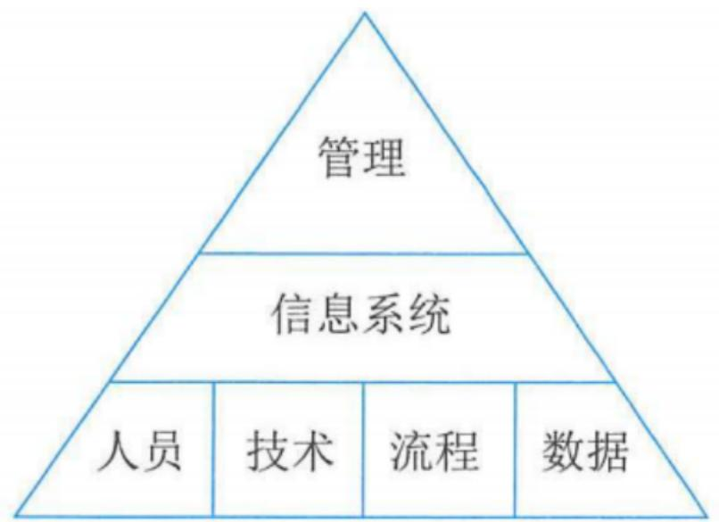
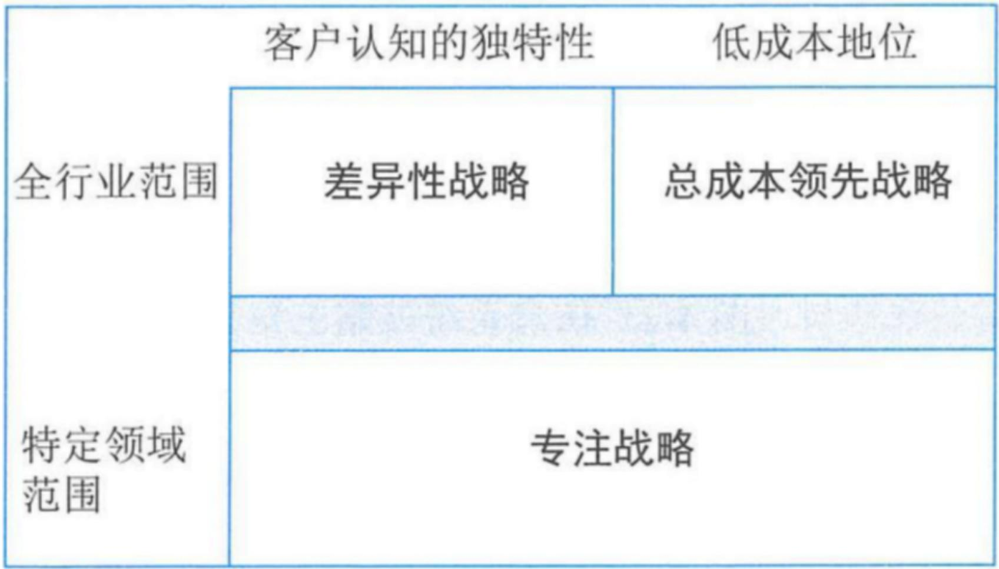
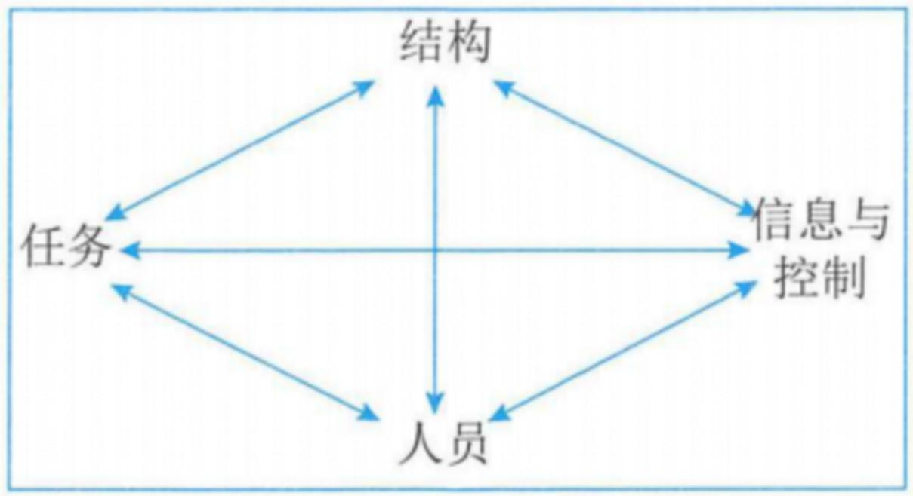
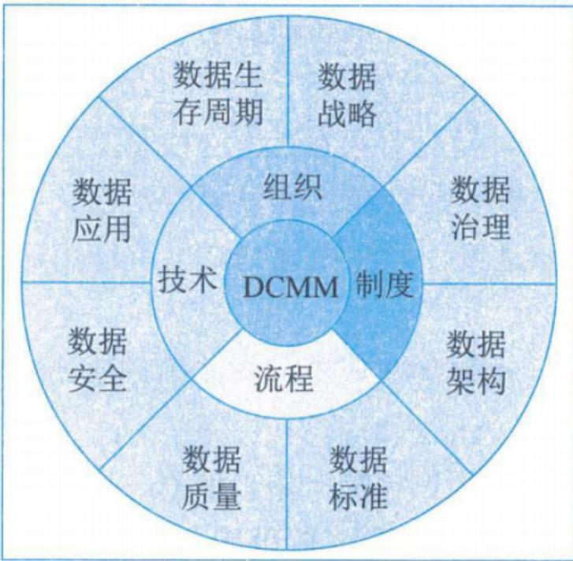
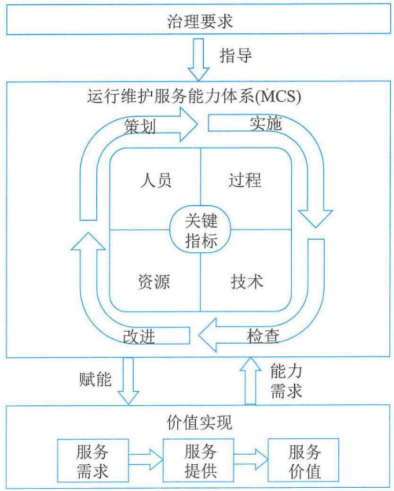
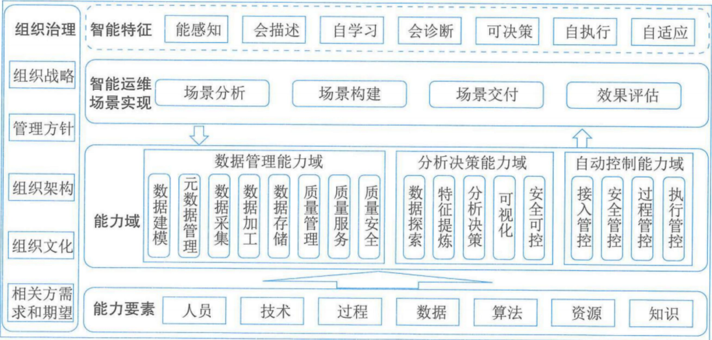

# 信息系统管理

# 信息系统项目管理师

# 本章学习建议

根据历年的考试情况来看，这一章的内容主要在上午进行考查。案例和论文一般不会涉及，我们学习要以教材为准，本章预计会考3分左右，请大家认真学习下面的考点。

# 本章考情分析

<table><tr><td>年份</td><td>上午选择题</td><td>案例分析题</td><td>论文写作</td><td>合计</td></tr><tr><td>2023年05月</td><td>3</td><td>0</td><td>0</td><td>3</td></tr><tr><td>2023年11月</td><td>机考3分左右</td><td>0</td><td>0</td><td>3</td></tr><tr><td>2024年05月</td><td>机考2分左右</td><td>0</td><td>0</td><td>2</td></tr></table>

# 4.1 管理方法-4.1.1 管理基础(掌握)

# 1.层次结构

信息系统包括四个要素：人员、技术、流程和数据。

在信息系统层次架构中，信息系统之上是管理，它监督系统的设计和结构，并监控其整体性能。同时，组织管理层制定信息系统层应满足的业务需求和业务战略。信息系统层次架构提供了一个蓝图，可以将业务和系统策略转换为组件或基础架构，并以恰当的人员、技术、流程和数据组合加以实现。

  
图4-1 信息系统层次架构

# 2.系统管理

信息系统管理覆盖四大领域：

- 规划和组织：针对信息系统的整体组织、战略和支持活动。  
- 设计和实施：针对信息系统解决方案的定义、采购和实施，以及他们与业务流程的整合。  
- 运维和服务：针对信息系统服务的运行交付和支持，包括安全。  
- 优化和持续改进：针对信息系统的性能监控及其于内部性能目标、内部控制目标和外部要求的一致性管理。

# 4.1.2 规划和组织(掌握)

# 1.规划模型

成功的组织有一个压倒一切的业务战略，可以推动组织机制和信息系统的有机融合。信息系统战略三角突出了业务战略、信息系统和组织机制之间的必要一致性。成功的组织会仔细平衡信息系统战略三角，对自己的组织和信息系统战略进行细致规划，以补充其业务战略。

例如部署一个新的信息系统，但没有组织机制和业务战略配套调整，可能较难成功或达不到效果。

  
图4-2 信息系统战略三角

# 4.1.2 规划和组织(掌握)

# 2.组织模型

描述业务战略的经典框架是迈克尔·波特提出的竞争力优势模型，如下图所示。

  
图4-3 获得竞争力优势的三种战略

# 4.1.2 规划和组织(掌握)

# 2.组织模型

# 1）业务战略

当组织的目标是成为市场上成本最低的生产者时，总成本领先战略就会产生。采用该战略的组织通过最大限度地降低成本，从而获得高于平均水平的绩效。

采用差异性战略时，组织通过差异化，以一种在市场上显得独特的方式，定义其产品或服务。

采用专注化战略时，专注化允许组织将其范围限制在更狭窄的细分市场，并为该组客户对象量身定制其产品。该策略有两种变体：①专注成本，在其细分市场内寻求成本优势；②专注差异化，寻求细分市场内的产品或服务的差异化。这种策略使组织能够实现区域竞争优势，即使它没有在整个经济与社会中实现竞争优势，也可以通过专注于某些细分市场的方式获得局部的竞争优势。

# 4.1.2 规划和组织(掌握)

# 2）组织机制战略

钻石模型将组织计划的关键组成部分标识为其信息与控制、人员、结构和任务，所有组件都是相互关联的。

  
图4-4 莱维特钻石模型

# 4.1.2 规划和组织(掌握)

# 3）信息系统战略

信息系统战略矩阵基础结构包括：① 硬件、②软件、③网络、④数据。

# 4.1.3 设计和实施(掌握)

开展信息系统设计和实施，首先需要将业务需求转换为信息系统架构，信息系统架构为将组织业务战略转换为信息系统的计划提供了蓝图。

# 1.设计方法

需要组织首先将业务战略转化为信息系统架构，然后将该架构转化为信息系统设计。

# 4.1.3 设计和实施(掌握)

# 2. 架构模式

传统上，信息系统体系架构有三种常见模式：

(1)集中式架构。集中式架构下所有内容采用集中建设、支持和管理的模式，其主体系统通常部署于数据中心，以消除管理物理分离的基础设施带来的困难。  
(2)分布式架构。硬件、软件、网络和数据的部署方式是在多台小型计算机、服务器和设备之间分配处理能力和应用功能，这些设施严重依赖于网络将它们连接在一起。  
③面向服务的系统架构（Service-Oriented Architecture, SOA）。SOA 架构中使用的软件通常被引向软件即服务（Software-as-a-Service, SaaS）的相关架构，同时，这些应用程序在通过互联网交付时也被称为Web服务。

# 4.1.3 设计和实施(掌握)

<table><tr><td>系统架构</td><td>描述</td><td>别称术语</td><td>什么时候使用</td></tr><tr><td>集中式架构</td><td>大型中央计算机系统处理系统的所有功能。通常,计算机位于数据中心,并由IT部门直接管理。存储的数据和应用程序都运行于中央计算机上。网络连接允许用户从远程位置访问大型机</td><td>主机架构</td><td>当需要系统易于管理时:所有功能都在同一个地方;当业务本身高度集中的时候</td></tr><tr><td>分布式架构</td><td>运行业务所需的计算能力分散在许多设备中,包括不同位置的服务器、PC和笔记本电脑、智能手机和平板电脑。设备(有时也被称为客户端)具有足够的处理能力来执行所需的许多服务,并根据数据和专用服务的需要连接中央服务器</td><td>基于服务器的架构</td><td>当担心可伸缩性时,模块化在这里会有所帮助;当业务主要是非集中化的时候</td></tr><tr><td>面向服务的架构</td><td>在被称为编排的过程中,将较大的软件程序分解为相互连接的服务。基于此,它们共同构成一个应用来运行整个业务流程。通常,这些服务可从互联网上的一系列供应商处获得,而应用程序则是这些服务链接在一起形成的组合</td><td>基于Web的架构</td><td>当希望系统成为敏捷架构:可重用性和组件化利于创造新应用;当业务对新应用和快速设计迭代要求较高时</td></tr></table>

表4-3 常见信息系统架构模式

# 4.1.4 运维和服务(了解)

信息系统的运维和服务由各类管理活动组成，主要包括：运行管理和控制、IT服务管理、运行与监控、终端侧管理、程序库管理、安全管理、介质控制和数据管理等。

# 1. 运行管理和控制

管理信息系统运行的管理控制主要活动包括：过程开发、标准制定、资源分配、过程管理。

# 4.1.4 运维和服务(了解)

# 2. IT服务管理

IT服务管理是通过主动管理和流程的持续改进来确保IT服务交付有效且高效的一组活动。IT服务管理由若干不同的活动组成：服务台、事件管理、问题管理、变更管理、配置管理、发布管理、服务级别管理、财务管理、容量管理、服务连续性管理和可用性管理。  
(1) 服务台。服务台(Service Desk)是组织体现IT服务的重要环节，也是服务干系人体验的重要感知窗口。服务台是服务中与服务干系人沟通和交互的重要界面，负责对服务干系人遇到的问题和需求进行响应和处理；服务台是IT服务干系人的“官方”接口和信息发布点，组织内部各个团队之间相互协作的纽带和协调者；服务台对IT服务质量及服务干系人体验的管理至关重要，是组织IT服务能力持续提升的战略单元。  
(2）事件管理。事件是IT服务管理遭遇计划外中断或服务质量出现下降，以及尚未影响服务的配置项故障。  
(3) 问题管理。当发生了几个看起来具有相同或相似根本原因的事件时, 就会启动问题管理活动。

# 4.1.4 运维和服务(了解)

(4) 变更管理。变更是使一个或更多信息系统配置项的状态发生改变的行动。  
(5) 配置管理。配置管理是通过技术或者行政的手段对信息系统的信息进行管理的一系列活动，这些信息不仅包括信息系统具体配置项信息，还包括这些配置项之间的相互关系。  
(6) 发布管理。发布管理负责计划和实施信息系统的变更，并且记录该变更的各方面信息。  
(7) 服务级别管理。服务级别管理就是对IT服务的级别进行定义、记录和管理，并在可接受的成本之下与干系人达成一致的管理过程。  
(8) 财务管理。IT服务财务管理是负责对IT服务运作过程中所有资源进行财务管理的流程。  
(9) 容量管理。容量管理用于确认信息系统中有足够的容量满足服务需求。  
(10) 服务连续性管理。服务连续性管理是一组与组织持续提供服务的能力相关的活动。  
(11) 可用性管理。可用性管理是有关设计、实施、监控、评价和报告IT服务的可用性以确保持续地满足服务干系人的可用性需求的服务管理流程。

# 4.1.4 运维和服务(了解)

# 3. 运行与监控

有效的IT运行要求IT人员按照既定流程和过程理解并正确执行任务。同时，IT运行还强调对人员进行培训，以有效识别异常和错误，并做出正确反应。

# 4. 终端侧管理

IT团队职能的一个关键环节是它向组织人员提供的服务，以改善他们对IT访问和使用的情况。

# 5.程序库管理

程序库是组织用来存储和管理应用程序源代码和目标代码的工具。

# 6.安全管理

信息安全管理可确保组织的信息安全计划充分识别和解决风险，并在整个运维和服务过程中正常运行。

# 7.介质控制

组织需要采取一系列活动，以确保数字介质得到适当管理，包括对其保护以及销毁不再需要的数据。

# 8. 数据管理

数据管理是与数据的获取、处理、存储、使用和处置相关的一组活动。

# 4.1.5 优化和持续改进(掌握)

优化和持续改进常用的方法为戴明环，即PDCA循环。PDCA循环是将持续改进分为四个阶段，即Plan（计划）、Do（执行）、Check（检查）和Act（处理）。

优化和持续改进基于有效的变更管理，使用六西格玛倡导的五阶段方法DMAIC/DMADV,是对戴明环四阶段周期的延伸，包括：定义（Define）、度量（Measure）、分析（Analysis）、改进/设计（Improve/Design）、控制/验证（Control/Verify）。当第四阶段的“改进”替换为“设计”，“控制”替换为“验证”时，五阶段法就从DMAIC转变为DMADV。

# 4.1.5 优化和持续改进(掌握)

<table><tr><td>序号</td><td>阶段</td><td>目标</td></tr><tr><td>1</td><td>定义阶段</td><td>目标包括待优化信息系统定义、核心流程定义和团队组建。</td></tr><tr><td>2</td><td>度量阶段</td><td>目标包括流程定义、指标定义、流程基线和度量系统分析。</td></tr><tr><td>3</td><td>分析阶段</td><td>目标包括价值流分析、信息系统异常的源头分析和确定优化改进的驱动因素。</td></tr><tr><td>4</td><td>改进/设计阶段</td><td>目标包括：1.向发起人提出一个或多个解决方案；量化每种方法的收益；就解决方案达成共识并实施。2.定义新的操作／设计条件。3.为新工艺／设计提供定义和缓解故障模式。</td></tr><tr><td>5</td><td>控制／验证阶段</td><td>目标包括标准化新程序／新系统功能的操作控制要素、持续验证优化的信息系统的可交付成果、记录经验教训。</td></tr></table>

# 4.2 管理要点-4.2.1 数据管理(掌握)

数据管理是指通过规划、控制与提供数据和信息资产的职能，包括开发、执行和监督有关数据的计划、策略、方案、项目、流程、方法和程序，以获取、控制、保护、交付和提高数据和信息资产价值。

数据管理能力成熟度评估模型（DCMM）是国家标准GB/T36073《数据管理能力成熟度评估模型》中提出的，旨在帮助组织利用先进的数据管理理念和方法，建立和评价自身数据管理能力，持续完善数据管理组织、程序和制度，充分发挥数据在促进组织向信息化、数字化、智能化发展方面的价值。

  
图4-6 数据管理能力模型

# 4.2.1 数据管理(掌握)

DCMM定义了数据战略、数据治理、数据架构、数据应用、数据安全、数据质量、数据标准和数据生存周期8个核心能力域。

<table><tr><td>序号</td><td>核心能力域</td><td>能力项</td></tr><tr><td>1</td><td>数据战略</td><td>通常包括数据战略规划、数据战略实施和数据战略评估三个能力项。</td></tr><tr><td>2</td><td>数据治理</td><td>通常包括数据治理组织、数据制度建设和数据治理沟通三个能力项。</td></tr><tr><td>3</td><td>数据架构</td><td>通常包括数据模型、数据分布、数据集成与共享和元数据管理四个能力项。</td></tr><tr><td>4</td><td>数据应用</td><td>通常包括数据分析、数据开放共享和数据服务三个能力项。</td></tr><tr><td>5</td><td>数据安全</td><td>通常包括数据安全策略、数据安全管理和数据安全审计三个能力项。</td></tr><tr><td>6</td><td>数据质量</td><td>通常包括数据质量需求、数据质量检查、数据质量分析和数据质量提升四个能力项。</td></tr><tr><td>7</td><td>数据标准</td><td>通常包括业务术语、参考数据和主数据、数据元和指标数据四个能力项。</td></tr><tr><td>8</td><td>数据生存周期</td><td>通常包括数据需求、数据设计和开发、数据运维和数据退役四个能力项。</td></tr></table>

# 4.2.1 数据管理(掌握)

数据管理能力成熟度模型。DCMM将组织的管理成熟度划分为5个等级，分别是：初始级、受管理级、稳健级、量化管理级和优化级。

<table><tr><td>级别</td><td>要求</td></tr><tr><td>初始级</td><td>数据需求的管理主要是在项目级体现，没有统一的管理流程，主要是被动式管理。</td></tr><tr><td>受管理级</td><td>组织意识到数据是资产，根据管理策略的要求制定了管理流程，指定了相关人员进行初步管理。</td></tr><tr><td>稳健级</td><td>数据已被当做实现组织绩效目标的重要资产，在组织层面制定了系列的标准化管理流程，促进数据管理的规范化。</td></tr><tr><td>量化管理级</td><td>数据被认为是获取竞争优势的重要资源，数据管理的效率能量化分析和监控。</td></tr><tr><td>优化级</td><td>数据被认为是组织生存和发展的基础，相关管理流程能实时优化，能在行业内进行最佳实践分享。</td></tr></table>

# 4.2.2 运维管理(掌握)

# 1.能力模型

国家标准GB/T28827.1《信息技术服务运行维护第1部分通用要求》定义了IT运维能力模型，该模型包含治理要求、运行维护服务能力体系和价值实现，如图所示。

# 4.2.2 运维管理(掌握)

  
图4-8 IT运维能力模型图

# 4.2.2 运维管理(掌握)

1）能力建设：组织需要考虑环境的内外部因素，在治理要求的指导下，根据服务场景，识别服务能力需求，围绕人员、过程、技术、资源能力四要素，策划、实施、检查和改进运行维护能力体系，向各种服务场景赋能，通过服务提供实现服务价值。

2）人员能力：指导IT运维团队根据岗位职责和管理要求“选人做事”。  
3）资源能力：资源能力确保IT运维能“保障做事”。  
4）技术能力：技术要素确保IT运维能“高效做事”。  
5）过程：确保IT运维能“正确做事”。

# 4.2.2 运维管理(掌握)

# 2.智能运维

中国电子工业标准化技术协会发布的团体标准T/CESA1172《信息技术服务智能运维通用要求》，给出了智能运维能力框架，包括组织治理、智能特征、智能运维场景实现、能力域和能力要素，其中能力要素是构建智能运维能力的基础。组织需在组织治理的指导下，对智能运维场景实现提出能力建设要求，开展智能运维能力规划和建设。组织通过场景分析、场景构建、场景交付和效果评估四个过程，基于数据管理能力域提供的高质量数据，结合分析决策能力域做出合理判断或结论，并根据需要驱动自动控制能力域执行运维操作，使运维场景具备智能特征，提升智能运维水平，实现质量可靠、安全可控、效率提升、成本降低。智能运维能力框架如图所示。

# 4.2.2 运维管理(掌握)

  
图4-9 智能运维能力框架

# 4.2.2 运维管理(掌握)

(1) 能力要素。智能运维的能力要素主要包括: 人员、技术、过程、数据、算法、资源、知识。  
(2) 能力平台。智能运维能力平台通常具备数据管理、分析决策、自动控制等能力。  
(3) 能力应用。以运维场景为中心，通过场景分析、能力构建、服务交付、迭代调优四个关键环节，可以使运维场景具备智能特征。根据复杂程度，运维场景分为单一场景、复合场景和全局场景。  
(4) 智能运维需具备若干智能特征，智能特征包括：能感知、会描述、自学习、会诊断、可决策、自执行、自适应。

# 4.2.2 运维管理(掌握)

智能运维需具备若干智能特征，智能特征包括：

<table><tr><td>智能特征</td><td>特点</td></tr><tr><td>能感知</td><td>指具备灵敏、准确地识别人、活动和对象的状态的特点。</td></tr><tr><td>会描述</td><td>指具备直观友好地展现和表达运维场景中各类信息的特点。</td></tr><tr><td>自学习</td><td>指具备积累数据、完善模型、总结规律等主动获取知识的特点。</td></tr><tr><td>会诊断</td><td>指具备对人、活动和对象进行分析、定位、判断的特点。</td></tr><tr><td>可决策</td><td>指具备综合分析，给出后续处置依据或解决方案的特点。</td></tr><tr><td>自执行</td><td>指具备对已知运维场景做出自动化处置的特点。</td></tr><tr><td>自适应</td><td>指具备自动适应环境变化，动态优化处理的特点。</td></tr></table>

# 4.2.3 信息安全管理(掌握)

# 1. CIA三要素

CIA三要素是保密性（Confidentiality）、完整性（Integrity）和可用性（Availability）三个词的缩写。CIA是信息安全最为关注的三个属性，也经常被称为信息安全三元组，这也是信息安全通常所强调的目标。

# 2.信息安全管理体系

信息系统安全管理是对一个组织机构中信息系统的生存周期全过程实施符合安全等级责任要求的管理。

在组织机构中应建立安全管理机构，参考步骤包括：

(1)配备安全管理人员。  
(2)建立安全职能部门。  
(3)成立安全领导小组。  
(4)主要负责人出任领导。  
(5)建立信息安全保密管理部门。

# 4.2.3 信息安全管理(掌握)

# 3.网络安全等级保护

# 1）安全保护等级划分

GB/T22240《信息安全技术网络安全等级保护定级指南》定义了等级保护对象。等级保护对象的安全保护等级分为以下五级：

第一级，等级保护对象受到破坏后，会对相关公民、法人和其他组织的合法权益造成损害，但不危害国家安全、社会秩序和公共利益；

第二级，等级保护对象受到破坏后，会对相关公民、法入和其他组织的合法权益产生严重损害或特别严重损害，或者对社会秩序和公共利益造成危害，但不危害国家安全；

第三级，等级保护对象受到破坏后，会对社会秩序和公共利益造成严重危害，或者对国家安全造成危害；

第四级，等级保护对象受到破坏后，会对社会秩序和公共利益造成特别严重危害，或者对国家安全造成严重危害；

第五级，等级保护对象受到破坏后，会对国家安全造成特别严重危害。

<table><tr><td>等级</td><td>公民、法人和其他组织权益</td><td>社会秩序和公共利益</td><td>国家安全</td></tr><tr><td>第一级</td><td>损害</td><td></td><td></td></tr><tr><td>第二级</td><td>严重损害</td><td>危害</td><td></td></tr><tr><td>第三级</td><td></td><td>严重危害</td><td>危害</td></tr><tr><td>第四级</td><td></td><td>特别严重危害</td><td>严重危害</td></tr><tr><td>第五级</td><td></td><td></td><td>特别严重危害</td></tr></table>

# 4.2.3 信息安全管理(了解)

# 2）安全保护能力等级划分

GB/T22239《信息安全技术网络安全等级保护基本要求》规定了不同级别的等级保护对象应具备的基本安全保护能力。

<table><tr><td>级别</td><td>要求</td></tr><tr><td>第一级</td><td>应能够防护免受来自个人的、拥有很少资源的威胁源发起的恶意攻击、一般的自然灾害，以及其他相当危害程度的威胁所造成的关键资源损害，在自身遭到损害后，能够恢复部分功能。</td></tr><tr><td>第二级</td><td>应能够防护免受来自外部小型组织的、拥有少量资源的威胁源发起的恶意攻击、一般的自然灾害，以及其他相当危害程度的威胁所造成的重要资源损害，能够发现重要的安全漏洞和处置安全事件，在自身遭到损害后，能够在一段时间内恢复部分功能。</td></tr><tr><td>第三级</td><td>应能够在统一安全策略下防护免受来自外部有组织的团体、拥有较为丰富资源的威胁源发起的恶意攻击、较为严重的自然灾害，以及其他相当程度的威胁所造成的主要资源损害，能够及时发现、监测攻击行为和处置安全事件，在自身遭到损害后，能够较快恢复绝大部分功能。</td></tr><tr><td>第四级</td><td>应能够在统一安全策略下防护免受来自国家级别的、敌对组织的、拥有丰富资源的威胁源发起的恶意攻击、严重的自然灾害，以及其他相当危害程度的威胁所造成的资源损害，能够及时发现、监测发现攻击行为和安全事件，在自身遭到损害后，能够迅速恢复所有功能。</td></tr><tr><td>第五级</td><td>略。(GB/T22239标准中未写)</td></tr></table>

# 本章练习

(1) （）不属于信息系统架构模式。

A.集中式架构

B.分布式架构

c.企业信息化架构

D.面向服务的架构

# 参考答案: C

(2) ( ) 不属于IT运维能力的关键指标。

A.人员

B.技术

C.过程

D.问题

# 参考答案: D

# 本章练习

(3) (   ) 不属于信息系统咨询设计的范畴。

A.战略咨询

B.技术咨询

C.管理咨询

D.财务咨询

参考答案: D

(4) 智能运维场景实现的关键审核要点应围绕（）。

A.质量可靠、安全可控、效率提升、成本降低的四个运维目标  
B.场景分析、场景构建、场景交付、效果评估四个关键过程  
C.数据管理、分析决策、自动控制三个能力域  
D.能感知、会描述、自学习、会诊断、可决策、自执行、自适应七个特

征

参考答案: B

# 本章练习

(5) ( ) 就是确保所传输的数据只被其预定的接收者读取。

A. 保密性

B. 可靠性

C.可用性

D.完整性

参考答案: A

# 历年真题练习

【2023年上半年-第7题】

信息系统战略三角不包括（）。

A.安全技术

B.业务战略

C.组织机制

D. 信息系统

【答案】A

# 历年真题练习

# 【2023年上半年-第8题】

数据管理能力成熟度模型（DCMM）将组织的管理成熟度划分为5个等级，每个级别中数据的重要程度会有所不同，从（）开始强调数据管理的规范化，数据被当做实现组织绩效目标的重要资产。

A.量化管理级

B. 稳健级

c.优化级

D.受管理级

【答案】B

# 历年真题练习

# 【2023年上半年-第15题】

根据数据在经济社会发展中的重要程度以及一旦遭到篡改，破坏，泄露或者非法获取、非法利用，对国家安全、公共利益或者个人、组织合法权益造成的危害程度，进行数据保护，这是实行的数据（）保护制度。

A.分类分级

B.安全审查

C.风险评估

D.应急处置

【答案】A

# 历年真题练习

【2023年下半年-第2批次自编】

以下（）不是迈克尔·波特提出的战略框架。

A.差异性战略

B.总成本领先战略

C. 专注战略

D.增长型战略

【答案】D

# 历年真题练习

【2023年下半年-第2批次自编】

( ) 是高效做事。

A. 技术

B.资源

C.人员

D.过程

【答案】A

# 历年真题练习

# 【2024年上半年-第1批次】

信息安全管理的CIA三要素指的是（）。

A.保密性、完整性、可用性

B.一致性、可用性、完整性

c. 保密性、有效性、可用性

D.一致性、可用性、有效性

【答案】A

