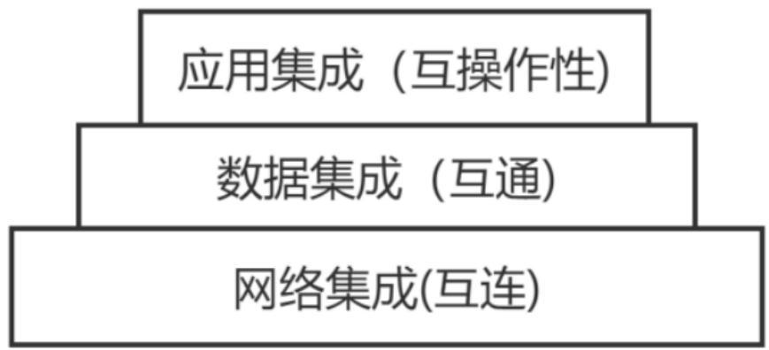
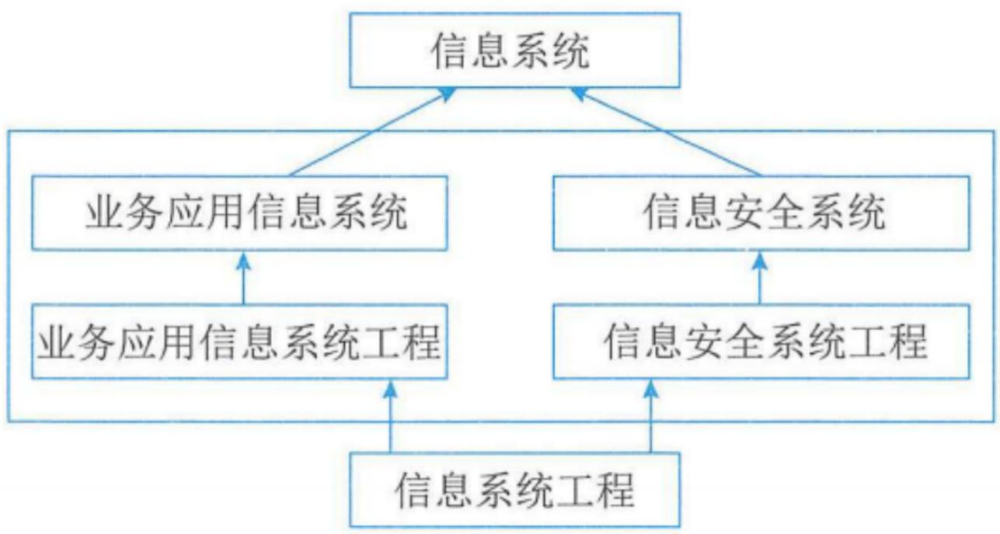
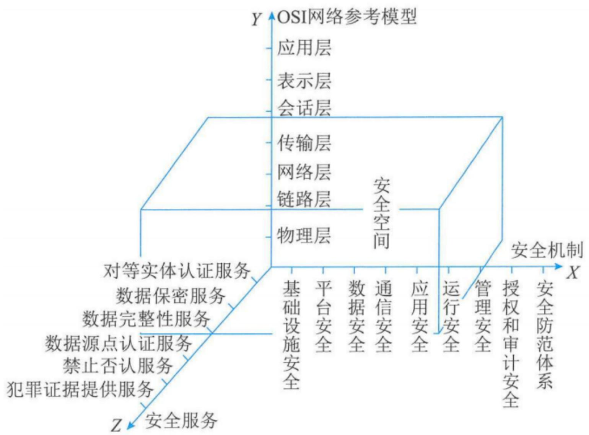

# 信息系统工程

# 信息系统项目管理师


# 本章学习建议

根据历年的考试情况来看，这一章的内容主要在上午进行考查。案例可能会考，但概率不大，论文一般不考，我们学习要以教材为准，本章一般会考4分左右，请大家认真学习下面的考点。


# 本章考情分析

<table><tr><td>年份</td><td>上午选择题</td><td>案例分析题</td><td>论文写作</td><td>合计</td></tr><tr><td>2023年05月</td><td>4</td><td>10</td><td>0</td><td>14</td></tr><tr><td>2023年11月</td><td>机考4分左右</td><td>0</td><td>0</td><td>4</td></tr><tr><td>2024年05月</td><td>机考4分左右</td><td>0</td><td>0</td><td>4</td></tr></table>


# 5.1 软件工程(掌握)

软件工程是指应用计算机科学、数学及管理科学等原理，以工程化的原则和方法来解决软件问题的工程，其目的是提高软件生产率、提高软件质量、降低软件成本。


# 5.1.1 架构设计(掌握)

软件架构为软件系统提供了一个结构、行为和属性的高级抽象，由构件的描述、构件的相互作用（连接件）、指导构件集成的模式以及这些模式的约束组成。

软件架构研究的主要内容涉及软件架构描述、软件架构风格、软件架构评估和软件架构的形式化方法等。

解决好软件的复用、质量和维护问题，是研究软件架构的根本目的。

# 5.1.1 架构设计(掌握)

# 1.软件架构风格

软件架构设计的一个核心问题是能否达到架构级的软件复用，也就是说，能否在不同的系统中使用同一个软件架构。软件架构风格是描述某一个特定应用领域中系统组织方式的惯用模式。

<table><tr><td>序号</td><td>架构风格</td><td>包括</td></tr><tr><td>1</td><td>数据流风格</td><td>包括批处理序列（顺序执行）和管道/过滤器（输入输出数据流）两种风格。【批管】</td></tr><tr><td>2</td><td>调用/返回风格</td><td>包括主程序/子程序（过程调用）、数据抽象和面向对象（对象及封装），以及层次结构（分层调用）。【主子抽象层面】</td></tr><tr><td>3</td><td>独立构件风格</td><td>包括进程通信(消息传递、远程调用)和事件驱动（事件触发调用）的系统。【进程办事】</td></tr><tr><td>4</td><td>虚拟机风格</td><td>包括解释器（解释引擎）和基于规则（规则集）的系统。【解释规则】</td></tr><tr><td>5</td><td>仓库风格</td><td>包括数据库系统（中央共享数据源）、黑板系统（知识源、黑板及共享数据和控制）和超文本系统（非线性交叉引用）。【库超黑】</td></tr></table>

# 5.1.1 架构设计(了解)

# 2.软件架构评估

在架构评估过程中，评估人员所关注的是系统的质量属性。

敏感点是一个或多个构件的特性，权衡点是影响多个质量属性的特性，是多个质量属性的敏感点。

从目前已有的软件架构评估技术来看，可以归纳为三类主要的评估方式，分别是基于调查问卷（或检查表）的方式，基于场景的方式和基于度量的方式。这三种评估方式中，基于场景的评估方式最为常用。

基于场景的方式主要包括：架构权衡分析法（ATAM）、软件架构分析法（SAAM）和成本效益分析法（CBAM）。

基于场景的方式分析软件架构对场景的支持程度，从而判断该架构对这一场景所代表的质量需求的满足程度。例如，用一系列对软件的修改来反映易修改性方面的需求，用一系列攻击性操作来代表安全性方面的需求等。

# 5.1.2 需求分析(掌握)

# 1.需求的层次

软件需求就是系统必须完成的事以及必须具备的品质。需求是多层次的，包括业务需求、用户需求和系统需求，这三个不同层次从目标到具体，从整体到局部，从概念到细节。

以下为补充了解即可

业务需求：指反应企业或客户对系统高层次的一个目标追求，通常来自项目投资人、购买产品的客户、客户单位的管理人员、市场营销部门或产品策划部门等。

用户需求：描述的是用户的具体的目标，或者用户要求系统必须能完成的任务，用户需求描述了用户能让系统来做什么。

系统需求：是指从系统的角度来说明软件的需求，包括功能需求，非功能需求和设计约束。


# 5.1.2 需求分析(掌握)

质量功能部署（Quality Function Deployment, QFD）是一种将用户要求转化成软件需求的技术，其目的是最大限度地提升软件工程过程中用户的满意度。为了达到这个目标，QFD将软件需求分为三类，分别是常规需求、期望需求和意外需求。

以下1-3为补充了解即可

(1) 常规需求，用户认为系统应该实现的功能或性能，实现越多用户会越满意。  
②期望需求，用户想当然以为系统应用具备的功能或性能，但并不能正确描述自己想要得到的这些功能或性能需求。如果期望需求没有得到实现，会让用户感动不满意。  
(3) 意外需求，也称为兴奋需求，是用户要求范围外的功能或性能。

# 2.需求过程

需求过程主要包括需求获取、需求分析、需求规格说明书编制、需求验证与确认等。

# 1）需求获取

需求获取是一个确定和理解不同的项目干系人的需求和约束的过程。常见的需求获取方法包括用户访谈、问卷调查、采样、情节串联板、联合需求计划等。

# 5.1.2 需求分析(掌握)

# 2）需求分析

一个好的需求应该具有无二义性、完整性、一致性、可测试性、确定性、可跟踪性、正确性、必要性等特性，因此，需要分析人员把杂乱无章的用户要求和期望转化为用户需求，这就是需求分析的工作。

使用结构化分析（SA）方法进行需求分析，其建立的模型的核心是数据字典。围绕这个核心，有三个层次的模型，分别是数据模型、功能模型和行为模型（也称为状态模型）。在实际工作中，一般使用。

<table><tr><td>图形</td><td>表示模型</td><td>说明</td></tr><tr><td>实体关系图(E-R图)</td><td>数据模型</td><td>描述实体、属性、以及实体之间的关系。</td></tr><tr><td>数据流图(DFD)</td><td>功能模型</td><td>从数据传递和加工的角度，利用图形符号通过逐层细分描述系统内各个部件的功能和数据在它们之间传递的情况，来说明系统所完成的功能；</td></tr><tr><td>状态转换图</td><td>行为模型(STD)</td><td>通过描述系统的状态和引起系统状态转换的事件，来表示系统的行为，指出作为特定事件的结果将执行哪些动作（例如，处理数据等）。</td></tr></table>


# 5.1.2 需求分析(掌握)

面向对象的分析（OOA）模型包括用例模型和分析模型，用例是一种描述系统需求的方法，使用用例的方法来描述系统需求的过程就是用例建模；分析模型描述系统的基本逻辑结构，展示对象和类如何组成系统（静态模型），以及它们如何保持通信，实现系统行为（动态模型）。

# 3）需求规格说明书编制

软件需求规格说明书 (SRS) 是需求开发活动的产物，SRS 是软件开发过程中最重要的文档之一，对于任何规模和性质的软件项目都不应该缺少。

SRS 应该包括范围、引用文件、需求、合格性规定、需求可追踪性、尚未解决的问题、注解和附录。

# 4）需求验证与确认

在实际工作中，一般通过需求评审和需求测试工作来对需求进行验证。需求评审就是对SRS进行技术评审。


# 5.1.2 需求分析(掌握)

# 3. UML

统一建模语言（UML）是一种定义良好，易于表达、功能强大且普遍适用的建模语言。（不是编程语言）

# 5.1.2 需求分析(掌握)

# UML中的事物

UML中的事物也称为建模元素，包括结构事物、行为事物、分组事物和注释事物。

<table><tr><td>建模元素</td><td>说明</td></tr><tr><td>结构事物</td><td>结构事物在模型中属于最静态的部分，代表概念上或物理上的元素。UML有七种结构事物，分别是类、接口、协作、用例、活动类、构件和节点。</td></tr><tr><td>行为事物</td><td>行为事物是UML模型中的动态部分，代表时间和空间上的动作。UML有两种主要的行为事物。第一种是交互（内部活动），交互是由一组对象之间在特定上下文中，为达到特定目的而进行的一系列消息交换而形成的动作。交互中组成动作的对象的每个操作都要详细列出，包括消息、动作次序（消息产生的动作）、连接（对象之间的连接）；第二种是状态机，状态机由一系列对象的状态组成。</td></tr><tr><td>分组事物</td><td>分组事物是UML模型中组织的部分，可以把它们看成是个盒子，模型可以在其中进行分解。UML只有一种分组事物，称为包。包是一种将有组织的元素分组的机制。与构件不同的是，包纯粹是一种概念上的事物，只存在于开发阶段，而构件可以存在于系统运行阶段。</td></tr><tr><td>注释事物</td><td>注释事物是UML模型的解释部分。</td></tr></table>

# 5.1.2 需求分析(掌握)

UML用关系把事物集合在一起，主要有四个关系：  

<table><tr><td>序号</td><td>关系</td><td>说明</td></tr><tr><td>①</td><td>依赖</td><td>一个事物发生改变会影响到另外一个事物的语义。</td></tr><tr><td>②</td><td>关联</td><td>关联描述一组对象之间连接的结构关系。</td></tr><tr><td>③</td><td>泛化</td><td>泛化是一般化和特殊化的关系，描述特殊元素的对象可替换的一般元素的对象。</td></tr><tr><td>④</td><td>实现</td><td>实现是类与类之间的语义定义关系，其中一个类指定了由另外一个类保证执行的契约。</td></tr></table>

# 5.1.2 需求分析(掌握)

UML2.0-14种图  

<table><tr><td>序号</td><td>图</td><td>说明</td></tr><tr><td>1</td><td>类图</td><td>类图描述一组类、接口、协作、和它们之间的关系，类图给出系统静态设计视图，活动类的类图给出了系统的静态进程视图。</td></tr><tr><td>2</td><td>对象图</td><td>对象图描述一组对象及他们之间的关系。</td></tr><tr><td>3</td><td>构件图</td><td>构件图描述一个封装的类和它的接口、端口、以及由内嵌的构件和连接件构成的内部结构。</td></tr><tr><td>4</td><td>组合结构图</td><td>组合结构图描述结构化类(例如,构件或类)的内部结构,包括结构化类与系统其余部分的交互点。</td></tr><tr><td>5</td><td>用例图</td><td>用例图描述一组用例、参与者及它们之间的关系。</td></tr><tr><td>6</td><td>顺序图(也称序列图)</td><td>顺序图是一种交互图，交互图展示了一种交互，它由一组对象或参与者以及它们之间可能发送的消息构成。交互图关注于系统的动态视图。顺序图是强调消息的时间次序的交互图。</td></tr><tr><td>7</td><td>通信图</td><td>通信图也是一种交互图，它强调收发消息的对象或参与者的结构组织。顺序图强调的时序，通信图强调的对象之间的组织机构关系。</td></tr></table>

# 5.1.2 需求分析(掌握)

<table><tr><td>序号</td><td>图</td><td>说明</td></tr><tr><td>8</td><td>定时图(也称计时图)</td><td>定时图也是一种交互图，他强调消息跨越不同对象或参与者的实际时间，而不仅仅只是关心消息的相对顺序。</td></tr><tr><td>9</td><td>状态图</td><td>状态图描述一个状态机，它由状态、转移、事件和活动组成，状态图给出了对象的动态视图。</td></tr><tr><td>10</td><td>活动图</td><td>活动图将进程或其他计算机结构展示为计算内部一步步的控制流和数据流。活动图专注于系统的动态视图，它强调对象间的控制流程。</td></tr><tr><td>11</td><td>部署图</td><td>部署图描述对运行时的处理节点及在其中生存的构件配置。部署图给出了架构的静态部署视图，通常一个节点包含一个或多个部署图。</td></tr><tr><td>12</td><td>制品图</td><td>制品图描述计算机中一个系统的物理结构，制品包括文件、数据库和类似的物理比特集合。制品图通常与部署图在一起使用。制品也给出了他们的实现的类和构件。</td></tr><tr><td>13</td><td>包图</td><td>包图描述由模型本身分解而成的组织单元，以及它们之间的依赖关系。</td></tr><tr><td>14</td><td>交互概览图</td><td>交互概览图是活动图和顺序图的混合物。</td></tr></table>

# 5.1.2 需求分析(掌握)

UML视图  

<table><tr><td>视图</td><td>说明</td></tr><tr><td>逻辑视图</td><td>逻辑视图也称为设计视图，它表示设计模型中在架构方面具有重要意义的部分，即类、子系统、包和用例实现的子集。</td></tr><tr><td>进程视图</td><td>进程视图是可执行线程与进程作为活动类的建模，它是逻辑视图的一次执行实例，描述了并发与同步结构。</td></tr><tr><td>实现视图</td><td>实现视图对组成基于系统的物理代码的文件和构件进行建模。</td></tr><tr><td>部署视图</td><td>部署视图把构件部署到一组物理节点上，表示软件到硬件的映射和分布结构。</td></tr><tr><td>用例视图</td><td>用例视图是最基本上的需求分析模型。</td></tr></table>


# 5.1.2 需求分析(掌握)

# 4. 面向对象分析

面向对象分析阶段的核心工作是建立系统的用例模型与分析模型。

# 5.1.2 需求分析(掌握)

类之间的关系  

<table><tr><td>关系</td><td>说明</td></tr><tr><td>关联</td><td>提供了不同类的对象之间的结构关系，它在一段时间内将多个类的实例连接在一起。体现的是对象实例之间的关系，而不表示两个类之间的关系。</td></tr><tr><td>依赖</td><td>两个类A和B,如果B的变化可能会引起A的变化，则称类A依赖于类B</td></tr><tr><td>泛化</td><td>描述了一般事物与该事物中的特殊种类之间的关系，也就是父类与子类之间的关系。继承关系是泛化关系的反关系，子类继承了父类，而父类则是子类的泛化</td></tr><tr><td>共享聚集</td><td>简称为聚合关系，它表示类之间的整体与部分的关系，其含义是“部分”可能同时属于多个“整体”部分”与“整体”的生命周期可以不相同。例如，汽车和车轮就是聚合关系，车子坏了，车轮还可以用;车轮坏了，可以再换一个新的。</td></tr><tr><td>组合聚集</td><td>简称为组合关系，它也是表示类之间的整体与部分的关系。与聚合关系的区别在于，组合关系中的“部分”只能属于一个“整体”，“部分”与“整体”的生命周期相同，“部分”随着“整体”的创建而创建，也随着“整体”的消亡而消亡。例:一个公司包含多个部门它们之间的关系就是组合关系。公司一旦倒闭，也就没有部门了。</td></tr><tr><td>实现关系</td><td>将说明和实现联系起来。接口是对行为而非实现的说明，而类中则包含了实现的结构一个或多个类可以实现一个接口，而每个类分别实现接口中的操作。</td></tr></table>

# 类之间的关系

# 5.1.2 需求分析(掌握)

  
类的关系理解示例


# 5.1.3 软件设计 (掌握)

需求分析阶段解决“做什么”的问题，而软件设计阶段解决“怎么做”的问题。软件设计分为结构化设计与面向对象设计。

# 1.结构化设计

结构化设计（SD）是一种面向数据流的方法，它以SRS和SA阶段所产生的DFD和数据字典等文档为基础，是一个自顶向下、逐步求精和模块化的过程。

在SD中，需要遵循一个基本的原则：高内聚，低耦合。内聚表示模块内部各成分之间的联系程度，是从功能角度来度量模块内的联系，一个好的内聚模块应当恰好做目标单一的一件事情；耦合表示模块之间联系的程度。紧密耦合表示模块之间联系非常强，松散耦合表示模块之间联系比较弱，非耦合则表示模块之间无任何联系，是完全独立的。

# 5.1.3 软件设计 (掌握)

# 2.面向对象设计

面向对象设计OOD其基本思想包括抽象、封装、可扩展性，其中可扩展性主要是通过继承和多态来实现，三大特征是封装，继承、多态。

OOD的主要任务是对类和对象进行设计，包括类的属性、方法以及类与类之间的关系。

常用的面向对象设计原则包括：

<table><tr><td>视图</td><td>说明</td></tr><tr><td>单职原则</td><td>设计功能单一的类。本原则与结构化方法的高内聚原则是一致的。</td></tr><tr><td>开闭原则</td><td>对扩展开放，对修改封闭。</td></tr><tr><td>李氏替换原则</td><td>子类可以替换父类。(也称里氏替换原则，子类可以扩展父类的功能，但不改变父类原有的功能，子类继承父类时，除添加新方法外，尽量不重写父类的方法)。</td></tr><tr><td>依赖倒置原则</td><td>要依赖于抽象，而不是具体实现;要针对接口编程，不要针对实现编程。</td></tr><tr><td>接口隔离原则</td><td>使用多个专门的接口比使用单一的总接口要好。</td></tr><tr><td>组合重用原则</td><td>要尽量使用组合，而不是继承关系达到重用目的。</td></tr><tr><td>迪米特原则(最少知识法则)</td><td>一个对象应当对其他对象有尽可能少的了解。本原则与结构化方法的低耦合原则是一致的。</td></tr></table>

# 5.1.3 软件设计 (掌握)

# 3.设计模式

设计模式是前人经验的总结，它使人们可以方便地复用成功的软件设计。

根据处理范围不同，设计模式可分为类模式和对象模式。

根据目的和用途不同，设计模式可分为创建型模式、结构型模式和行为型模式三种。

(1)创建型模式主要用于创建对象  
(2)结构型模式主要用于处理类或对象的组合  
(3)行为型模式主要用于描述类或对象的交互以及职责的分配。

# 5.1.4 软件实现(掌握)

# 1.软件配置管理

无重点

# 2.软件编码

无重点

# 3.软件测试

- 桌前检查(Desk Checking)：对程序执行情况进行人工模拟，用逐步检查源代码中有无逻辑或语法错误的办法来检测故障。  
- 代码走查：在代码走查的过程中，开发人员向其他人来阐述他们的代码。  
- 代码审查：对计算机源代码系统化地审查，常用软件同行评审的方式进行，找出及修正在软件开发初期未发现的错误。

软件测试方法可分为静态测试和动态测试。

静态测试是指被测试程序不在机器上运行，而是采用人工检测和计算机辅助静态分析的手段对程序进行检测。静态测试包括对文档的静态测试和对代码的静态测试，对文档的静态测试主要是以检查单的形式进行，而对代码的静态测试一般采用桌前检查、代码走查和代码审查。

动态测试是指在计算机上实际运行程序进行软件测试。一般采用白盒测试和黑盒测试方法。

# 5.1.4 软件实现(掌握)

白盒测试也称为结构测试，主要用于软件单元测试中。它的主要思想是，将程序看作成一个透明的白盒，测试人员完全清楚程序的结构和算法，按照程序内部逻辑结构设计测试用例。白盒测试方法主要有控制流测试、数据流测试和程序变异测试等。另外，使用静态测试的方法也可以实现白盒测试。例如，使用人工检查代码的方法来检查代码的逻辑问题，也属于白盒测试。白盒测试方法中，最常用的技术是逻辑覆盖，即使用测试数据运行被测试程序，考察对程序逻辑的覆盖程度。主要的覆盖标准有语句覆盖、判定覆盖、条件覆盖、条件/判定覆盖、条件组合覆盖、修正的条件/判定覆盖和路径覆盖等。

黑盒测试也称为功能测试，主要用于集成测试、确认测试和系统测试中。黑盒测试将测试看作是一个不透明的黑盒，完全不考虑(或不了解)程序的内部结构和处理算法。一般包括等价类划分、边界值分析、判定表、因果图、状态图、随机测试、猜错法和正交验证法等。


# 5.1.5 部署交付(了解)

软件开发完成后，必须部署在最终用户的正式运行环境，交付给最终用户使用。这些活动包括软件打包、安装、配置、测试、集成和更新等。是一个持续不断的过程。

# 5.1.5 部署交付(了解)

<table><tr><td>过程</td><td>说明</td></tr><tr><td>软件部署与交付</td><td>软件部署与交付是软件生命周期中的一个重要环节，属于软件开发的后期活动，即通过配置、安装和激活等活动来保障软件制品的后续运行。其中软件配置过程极大地影响着软件部署结果的正确性，应用系统的配置是整个部署过程中的主要错误来源。</td></tr><tr><td>持续交付</td><td>持续交付是一系列开发实践方法,用来确保让代码能够快速、安全地部署到生产环境中。持续交付是一个完全自动化的过程，当业务开发完成的时候，可以做到一键部署。国内外的主流互联网组织的部署周期都以分钟为单位，互联网巨头组织单日的部署频率都在8000次以上，部分组织达20000次以上。高频率的部署代表着能够更好地响应客户需求。</td></tr><tr><td>持续部署</td><td>(1)持续部署方案容器技术目前是部署中最流行的技术，常用的持续部署方案有Kubernetes+Docker 和Matrix系统两种。(2)部署原则(3)部署层次</td></tr></table>

# 5.1.5 部署交付(了解)

<table><tr><td>过程</td><td>说明</td></tr><tr><td>持续部署</td><td>首先要明确部署的目的并不是部署一个可工作的软件，而是部署一套可正常运行的环境。完整的镜像部署包括三个环节：Build-Ship-Run。Build：跟传统的编译类似，将软件编译形成RPM包或者Jar包；Ship：则是将所需的第三方依赖和第三方插件安装到环境中；Run：就是在不同的地方启动整套环境。(4)不可变服务器指除了更新和安装补丁程序以外，不对服务器进行任何更改。主要通过容器解决原虚拟机第三方依赖库的重构问题。(5)蓝绿部署和金丝雀部署①蓝绿部署是指在部署的时候准备新旧两个部署版本，通过域名解析切换的方式将用户使用环境切换到新版本中，当出现问题的时候，可以快速地将用户环境切回旧版本，并对新版本进行修复和调整。②金丝雀部署是指当有新版本发布的时候，先让少量用户使用新版本，并且观察新版本是否存在问题。如果出现问题，就及时处理并重新发布；如果一切正常，就稳步地将新版本适配给所有的用户。</td></tr></table>

# 5.1.5 部署交付(了解)

<table><tr><td>过程</td><td>说明</td></tr><tr><td>部署与交付的新趋势</td><td>持续集成、持续交付和持续部署的出现及流行反映了新的软件开发模式与发展趋势。</td></tr></table>


# 5.1.6 过程管理(掌握)

软件过程能力是组织基于软件过程、技术、资源和人员能力达成业务目标的综合能力。包括治理能力、开发与交付能力、管理与支持能力、组织管理能力等方面。《软件过程能力成熟度模型》团体标准，简称CSMM。

# 1.成熟度模型

CSMM定义的软件过程能力成熟度模型旨在通过提升组织的软件开发能力帮助顾客提升软件的业务价值。

按照软件过程能力的成熟度水平由低到高演进发展的形势，CSMM定义了5个等级。


# 5.1.6 过程管理(掌握)

<table><tr><td>等级</td><td>结果特征</td><td>行为特征</td></tr><tr><td>1级：初始级</td><td>软件过程和结果具有不确定性</td><td>●能实现初步的软件交付和项目管理活动
●项目没有完整的管理规范，依赖于个人的主动性和能力</td></tr><tr><td>2级：项目规范级</td><td>项目基本可按计划实现预期的结果</td><td>●组织依据选择和定义管理规范，执行软件开发和管理的基础过程
●组织按照一定的规范，为项目活动提供了支持保障工作</td></tr><tr><td>3级：组织改进级</td><td>在组织范围内能够稳定地实现预期的项目目标</td><td>●在2级充分实施的基础上进行持续改进
●依据组织的业务目标、管理要求以及外部监管需求，建立并持续改进组织标准过程和过程资产
●项目根据自身特征，依据组织标准过程和过程资产，实现项目目标，并贡献过程资产</td></tr><tr><td>4级：量化提升级</td><td>在组织范围内能够量化地管理和实现预期的组织和项目目标</td><td>●在3级充分实施的基础上使用统计分析技术进行管理
●组织层面认识到能力改进的重要性，了解软件能力在业务目标实现、绩效提升等方面的重要作用，在制定业务战略时可获得项目数据的支持
●组织和项目使用统计分析技术建立了量化的质量与过程绩效目标，支持组织业务目标的实现
●建立了过程绩效基线与过程绩效模型
●采用有效地数据分析技术，分析关键软件过程的能力，预测结果，识别和解决目标实现的问题以达成目标
●应用先进实践，提升软件过程效率或质量</td></tr></table>

# 5.1.6 过程管理(掌握)

<table><tr><td>等级</td><td>结果特征</td><td>行为特征</td></tr><tr><td>5级：创新引领级</td><td>通过技术和管理的创新，实现组织业务目标的持续提升，引领行业发展</td><td>·在4级充分实施的基础上进行优化革新
·通过软件过程的创新提升组织竞争力
·能够使用创新的手段实现软件过程能力的持续提升，支持组织业务目标的达成
·能将组织自身软件能力建设的经验作为行业最佳案例进行推广</td></tr></table>


# 5.2 数据工程(掌握)

数据工程是信息系统的基础工程。数据工程的主要研究内容包括数据建模、数据标准化、数据运维、数据开发利用和数据安全等理论和技术。

# 5.2.1 数据建模(掌握)

# 1.数据模型

根据模型应用目的不同，可以将数据模型划分为三类：概念模型、逻辑模型和物理模型。

<table><tr><td>数据模型</td><td>说明</td></tr><tr><td>概念模型</td><td>概念模型也称信息模型，它是按用户的观点来对数据和信息建模，也就是说，把现实世界中的客观对象抽象为某一种信息结构，这种信息结构不依赖于具体的计算机系统也不对应某个具体的DBMS，它是概念级别的模型。
基本元素：实体、属性、域、键、关联</td></tr><tr><td>逻辑模型</td><td>逻辑模型是在概念模型的基础上确定模型的数据结构，目前主要的数据结构有层次模型、网状模型、关系模型、面向对象模型和对象关系模型。其中，关系模型成为目前最重要的一种逻辑数据模型。
如:概念转成关系模型结构中关系模式(数据表)</td></tr><tr><td>物理模型</td><td>物理数据模型是在逻辑数据模型的基础上，考虑各种具体的技术实现因素，进行数据库体系结构设计,真正实现数据在数据库中的存放。</td></tr></table>

# 2.数据建模过程

通常来说，数据建模过程包括数据需求分析、概念模型设计、逻辑模型设计和物理模型设计等过程。


# 5.2.2 数据标准化(掌握)

数据标准化是实现数据共享的基础。数据标准化的主要内容包括元数据标准化、数据元标准化、数据模式标准化、数据分类与编码标准化和数据标准化管理。

<table><tr><td>过程</td><td>说明</td></tr><tr><td>元数据标准化</td><td>元数据最简单的定义是：元数据是关于数据的数据(Data About Data)。实质是用于描述信息资源或数据的内容、覆盖范围、质量、管理方式、数据的所有者数据的提供方式等有关的信息。例如；数据库表名称、字段类型等</td></tr><tr><td>数据元标准化</td><td>数据元是数据库、文件和数据交换的基本数据单元。数据库或文件由记录或元组等组成，而记录或元组则由数据元组成。数据元一般来说由三部分组成：①对象。②特性。③表示。【例如：描述学生年龄的大小：对象是学生，特性是年龄 age，表示是数值 18。以一个学生基本信息表为例，姓名、学号、班级、课程、学分都是数据元，这些数据元有自己的元数据，即描述数据，分别是长度、数据类型、值域等等。数据元是元数据的一个子项，数据元是一个最小粒度的单元。】</td></tr></table>

# 5.2.2 数据标准化(掌握)

<table><tr><td>过程</td><td>说明</td></tr><tr><td>数据模式标准化</td><td>数据模式是数据的概念、组成、结构和相互关系的总称。本质上，数据模式反映的是人类对客观世界的主观认知。数据模式的描述方式主要有图描述方法和数据字典方法。图描述方法常用的有IDEF1X方法(在E-R法的基础上，增加了一些规则)和UML图，主要用来描述数据集中的实体和实体之间的相互关系；数据字典形式用来描述模型中的数据集、单个实体、属性的摘要信息。</td></tr><tr><td>数据分类和编码标准化</td><td>数据分类与编码标准化是简化信息交换、实现信息处理和信息资源共享的重要前提，是建立各种信息管理系统的重要技术基础和信息保障依据。数据分类与编码的作用主要包括用于信息系统的共享和互操作，统一数据的表示法和提高信息处理效率。通过分类与编码标准化，可以最大限度地消除对信息命名、描述、分类和编码的不一致造成的混乱、误解等现象，可以减少信息重复采集、加工、存储等操作，使事物的名称和代码的含义统一化、规范化，确立代码与事物或概念之间的一一对应关系，以保证数据的准确性和相容性，为信息集成与资源共享提供良好的基础。</td></tr><tr><td>数据标准化管理</td><td>数据标准化阶段的具体过程包括确定数据需求、制定数据标准、批准数据标准和实施数据标准四个阶段。</td></tr></table>

# 5.2.2 数据标准化(掌握)

# 数据字典举例

例：学生学籍管理子系统的数据字典。

数据项，以“学号”为例：

数据项： 学号

含义说明：唯一标识每个学生

别名： 学生编号

类型： 字符型

长度： 8

取值范围：00000000至99999999

取值含义：前两位标别该学生所在年级，后六位按顺序编号

# 常用数据字典格式

表名：STUDENT（学生基本信息表）  

<table><tr><td>字段名称</td><td>字段含义</td><td>数据类型</td><td>宽度</td><td>NULL</td><td>注</td></tr><tr><td>XSXH</td><td>学号</td><td>CHAR</td><td>8</td><td>NO</td><td>主关键字</td></tr><tr><td>XSXM</td><td>姓名</td><td>CHAR</td><td>8</td><td>NO</td><td></td></tr><tr><td>XSXB</td><td>性别</td><td>CHAR</td><td>1</td><td>Y</td><td></td></tr><tr><td>XSNL</td><td>年龄</td><td>INTEGER</td><td></td><td>Y</td><td></td></tr><tr><td>XSRQ</td><td>出生日期</td><td>CHAR</td><td>8</td><td>Y</td><td></td></tr><tr><td>XSJG</td><td>籍贯</td><td>CHAR</td><td>2</td><td>Y</td><td></td></tr><tr><td>XSSFZ</td><td>身份证</td><td>CHAR</td><td>18</td><td>Y</td><td></td></tr><tr><td>XSRX</td><td>入学日期</td><td>CHAR</td><td>8</td><td>Y</td><td></td></tr><tr><td>FYBH</td><td>分院编号</td><td>CHAR</td><td>2</td><td>Y</td><td></td></tr><tr><td>ZYBH</td><td>专业编号</td><td>CHAR</td><td>2</td><td>Y</td><td></td></tr><tr><td>XSBJ</td><td>班级名称</td><td>CHAR</td><td>10</td><td>Y</td><td></td></tr><tr><td>XSZZ</td><td>住址</td><td>VARCHAR</td><td>20</td><td>Y</td><td></td></tr></table>

# 5.2.2 数据标准化(掌握)

# 数据元制定的基本过程：

(1) 描述  
(2) 界定业务范围  
(3) 开展业务流程分析与信息建模  
(4) 借助于信息模型，提取数据元，并按照一定的规则规范其属性  
(5) 对于代码型的数据元，编制其值域，即代码表  
(6) 与现有的国家标准或行业标准进行协调  
(7) 发布实施数据元标准并建立相应的动态维护管理机制

# 5.2.3 数据运维(掌握)

<table><tr><td>过程</td><td>说明</td></tr><tr><td>数据存储</td><td>(1) 数据存储介质。数据存储首先要解决的是存储介质的问题。存储介质是数据存储的载体，是数据存储的基础。存储介质并不是越贵越好、越先进越好。存储介质的类型主要有磁带、光盘和磁盘三种。
(2) 存储管理。如何提高存储系统的访问性能，如何满足数据量不断增长的需要，如何有效的保护数据、提高数据的可用性，如何满足存储空间的共享等。</td></tr><tr><td>数据备份</td><td>当前最常见的数据备份结构可以分为四种：DAS备份结构、基于LAN的备份结构、LAN-FREE备份结构【针对SAN架构，不占用以太网络的带宽】和SERVER-FREE备份结构【针对SAN架构，不占用备份主机的CPU资源】
常见的备份策略主要有三种：完全备份、差分备份【相对上一次全备份之后新增的和修改过的数据】和增量备份【上一次备份(注意不是全备份)后增加的和修改过的数据，恢复时需要全部增量都恢复】</td></tr></table>

# 5.2.3 数据运维(掌握)

<table><tr><td>过程</td><td>说明</td></tr><tr><td>数据容灾</td><td>根据容灾系统保护对象的不同，容灾系统分为应用容灾和数据容灾两类。
·应用容灾用于克服灾难对系统的影响，保证应用服务的完整、可靠和安全等一系列要求，使得用户在任何情况下都能得到正常的服务；
·数据容灾则关注于保证用户数据的高可用性，在灾难发生时能够保证应用系统中的数据尽量少丢失或不丢失，使得应用系统能不间断地运行或尽快地恢复正常运行。
数据备份是数据容灾的基础。数据备份是数据高可用的最后一道防线，其目的是为了在系统数据崩溃时能够快速恢复数据。
从技术上看，衡量容灾系统有两个主要指标：RPO(Recovery Point Object)和RTO(Recovery Time Object)，其中RPO代表了当灾难发生时允许丢失的数据量；而RTO则代表了系统恢复的时间。</td></tr><tr><td>数据质量与评价控制</td><td>1.数据质量描述
2.数据质量评价过程
3.数据质量评价方法：直接评价法和间接评价法。
4.数据质量控制：前期控制和后期控制
5.数据清洗：使数据实现准确性、完整性、一致性、唯一性、适时性、有效性以适应后续操作的过程。</td></tr></table>


# 5.2.4 数据开发利用(了解)

数据开发利用包括数据集成、数据挖掘和数据服务（目录服务、查询服务、浏览和下载服务、数据分发服务）、数据可视化、信息检索等。


# 5.2.4 数据开发利用(了解)

<table><tr><td>过程</td><td>说明</td></tr><tr><td>数据集成</td><td>数据集就是将驻留在不同数据源中的数据进行整合，向用户提供统一的数据视图，使得用户能以透明的方式访问数据。</td></tr><tr><td>数据挖掘</td><td>数据挖掘是指从大量数据中提取或“挖掘”知识，。它把人们对数据的从低层次的简单查询，提升到从数据库挖掘知识，提供决策支持层面。数据挖掘的目标是发现隐藏于数据之后的规律或数据间的关系，从而服务于决策。</td></tr><tr><td>数据服务</td><td>数据服务主要包括数据目录服务、数据查询与浏览及下载服务、数据分发服务。
1.数据目录服务：建立目录方便检索服务。
2.数据查询与浏览及下载服务：是网上数据共享服务的重要方式，用户使用数据的方式。有查询数据和下载数据两种。
3.数据分发服务：是指数据的生产者通过各种方式将数据传送到用户的过程。</td></tr><tr><td>数据可视化</td><td>指将抽象的事物或过程变成图形图像的表示方法。
可视化的表现方式分为七类：一维数据可视化、二维数据可视化、三维数据可视化、多维数据可视化、时态数据可视化、层次数据可视化和网络数据可视化。</td></tr><tr><td>信息检索</td><td>1.信息检索的方法：全文检索、字段检索、基于内容的多媒体检索、数据挖掘。
2.信息检索的常用技术包括布尔逻辑检索技术、截词检索技术、临近检索技术、限定字段检索技术、限制检索技术等。</td></tr></table>


# 5.2.4 数据开发利用(了解)

由于所要展现数据的内容和角度不同，可视化的表现方式也多种多样，主要可分为七类：一维数据可视化、二维数据可视化、三维数据可视化、多维数据可视化、时态数据可视化、层次数据可视化和网络数据可视化，如表所示。

<table><tr><td>表现方式</td><td>说明</td></tr><tr><td>一维数据可视化</td><td>一维数据就是简单的线性数据，如文本或数字表格、程序源代码都基于一维数据。一维数据可视化取决于数据大小和用户想用数据来处理什么任务</td></tr><tr><td>二维数据可视化</td><td>在数据可视化中，二维数据是指由两种主要描述属性构成的数据，如一个物体的宽度和高度、一个城市的平面地图、建筑物的楼层平面图等都是二维数据可视化的实例。最常见的二维数据可视化就是地理信息系统（Geographic Information System, GIS）</td></tr><tr><td>三维数据可视化</td><td>三维数据比二维数据更进了一层，它可以描述立体信息。三维数据可以表示实际的三维物体，因此可视化的许多应用是三维可视化。物体通过三维可视化构成计算机模型，供操作及试验，因此预测真实物体的实际行为</td></tr><tr><td>多维数据可视化</td><td>在可视化环境中，多维数据所描述事物的属性超过三维，为了实现可视化，往往需要降维</td></tr></table>

# 5.2.4 数据开发利用(了解)

<table><tr><td>过程</td><td>说明</td></tr><tr><td>时态数据可视化</td><td>时态数据可视化实际上二维数据的一种特例，即二维中有一维是时间轴。它以图形方式显示随着时间变化的数据，是可视化信息最常见、最有用的方式之一</td></tr><tr><td>层次数据可视化</td><td>层次数据即树形数据，其数据内在结构特征为：每个节点都有一个父节点（根节点除外）。节点分兄弟节点（拥有同一个父节点）和子节点（从属该节点的节点）。拥有这种结构的数据很常见，如商业组织、计算机文件系统和家谱图都是按树形结构排列的层次数据</td></tr><tr><td>网络数据可视化</td><td>网络数据指与任意数量的其他节点有关系的节点的数据。网络数据中节点不受与它有关系的其他节点数量的约束（不同于层次节点有且只有一个父节点），网络数据没有固有的层次结构，两个节点之间可以有多条连接路径，也就是说节点间关系的属性和数量是可变的</td></tr></table>


# 5.2.5 数据库安全(了解)

<table><tr><td>安全对策</td><td>说明</td></tr><tr><td>防止非法的数据访问</td><td>数据库管理系统必须根据用户或应用的授权来检查访问请求，以保证仅允许授权的用户访问数据库。</td></tr><tr><td>防止推导</td><td>指的是用户通过授权访问的数据，经过推导得出机密信息，而按照安全策略，该用户是无权访问此机密信息的。</td></tr><tr><td>保证数据库的完整性</td><td>是保护数据库不受非授权的修改，以及不会因为病毒、系统中的错误等导致的存储数据破坏。这种保护通过访问控制、备份/恢复以及一些专用的安全机制共同实现。</td></tr><tr><td>保证数据的操作完整性</td><td>定位于在并发事务中保证数据库中数据的逻辑一致性。由并发管理器子系统负责。</td></tr><tr><td>保证数据的语义完整性</td><td>在修改数据时，保证新值在一定范围内符合逻辑上的完整性。对数据值的约束通过完整性约束来描述。</td></tr><tr><td>审计和日志</td><td>审计和日志是有效的威慑和事后追查、分析工具。</td></tr><tr><td>标识和认证</td><td>标识和认证是授权、审计等的前提条件是第一道安全防线。</td></tr><tr><td>机密数据管理</td><td>对于同时保存机密和公开数据的数据库而言，访问控制主要保证机密数据的保密性，仅允许授权用户的访问。这些用户被赋予对机密数据进行一系列操作的权限，并且禁止传播这些权限。</td></tr><tr><td>多级保护</td><td>将数据划分不同保密级别，用户只能访问拥有的权限所对应级别的数据</td></tr><tr><td>限界</td><td>限界的意义在于防止程序之间出现非授权的信息传递</td></tr></table>


# 5.2.5 数据库安全(了解)

数据库安全机制包括用户的身份认证、存取控制、数据库加密、数据审计、推理控制等内容。


# 5.3 系统集成-5.3.1 集成基础(掌握)

系统集成的内容包括技术环境的集成、数据环境的集成和应用程序的集成。在技术上需要遵循的基本原则包括：开放性、结构化、先进性和主流化。

(1) 开放性。系统硬软件平台、通信接口、软件开发工具、网络结构的选择要遵循工业开放标准，这是关系到系统生命周期长短的重要问题。  
(2) 结构化。复杂系统设计的最基本方法依然是结构化系统分析设计方法。  
(3) 先进性。先进性有两层意义：目前先进性和未来先进性。  
(4) 主流化。系统构成的每一个产品应属于该产品发展的主流，有可靠的技术支持，有成熟的使用环境，并具有良好的升级发展势头。


# 5.3.2 网络集成(了解)

下面针对其中比较重要的几个方面进行说明。

(1) 传输子系统。传输是网络的核心，是网络信息的“公路”和“血管”。常用的无线传输介质主要包括无线电波、微波、红外线等，常用的有线传输介质主要包括双绞线、同轴电缆、光纤等。  
(2) 交换子系统。网络交换可以分为局域网交换技术、城域网交换技术和广域网交换技术。  
(3) 安全子系统。网络安全主要关注的内容包括: 使用防火墙技术, 防止外部的侵犯; 使用数据加密技术, 防止任何人从通信信道窃取信息; 访问控制, 主要是通过设置口令、密码和访问权限保护网络资源。  
(4) 网管子系统。关键的任务便是保证网络的良好运行。由于网络规模的扩大, 通常会出现网络“瓶颈”问题, 使系统的速度变慢。网管的职责便是找出瓶颈并解决它。  
（5）服务器子系统。服务器是网络中的关键设备。服务器的作用就是向工作站提供处理器内存、磁盘、打印机、软件数据等资源和服务，并负责协调管理这些资源。  
(6) 网络操作系统。网络操作系统的主要任务是调度和管理网络资源，并为网络用户提供统一、透明使用网络资源的手段。  
（7）服务子系统。网络服务是网络应用最核心的问题。网络服务主要包括互联网服务、多媒体信息检索、信息点播、信息广播、远程计算和事务处理以及其他信息服务等。


# 5.3.3 数据集成(了解)

数据集成处理的主要对象是系统中各种异构数据库中的数据。数据仓库技术是数据集成的关键。

# 1. 数据集成层次

数据集成可以分为基本数据集成、多级视图集成、模式集成和多粒度数据集成四个层次。

# 2.异构数据集成

数据集成的目的是为应用提供统一的访问支持，因此集成后的数据必须保证一定的完整性，包括数据完整性和约束完整性。

(1) 异构数据集成的方法: 异构数据集成方法归纳起来主要有两种, 分别是过程式方法 (点对点)和声明式方法(通过合适的语言对数据建模)。还有一种是中间件集成异构数据库，提供统一的数据模式和数据访问通用接口。  
(2) 开放数据库互联标准：实现异构数据源的数据集成，首先要解决的问题是原始数据的提取。从异构数据库中提取数据大多采用开放式数据库互联(ODBC),ODBC是一种用来在数据库系统之间存取数据的标准应用程序接口，目前流行的数据库管理系统都提供了相应的ODBC驱动程序，它使数据库系统具有很好的开放性，数据格式转换也很方便。  
(3) 基于 XML 的数据交换标准, XML是可扩展标记语言：统一异构数据源的数据模式。  
(4) 基于 JSON 的数据交换格式: JSON JavaScript Object Notation)作为一种轻量级的数据交换格式, 以其易于阅读和编写的优点, 被越来越多地应用到各个项目中。


# XML格式示例

```xml
<?xml version="1.0" encoding="UTF-8"?>   
<student>   
<person> <id>001</id> <age>10</age> <name>张三</name> </person>   
<person> <id>002</id> <age>20</age> <name>李四</name> </person>   
</student>
```

# 5.3.3 数据集成(了解)

JSON格式示例  
```jsonl
{"student": {"person": [ {"id": "001", "age": "10", "name": "张三" }, { {"id": "002", "age": "20", "name": "李四" } ]}
```


# 5.3.4 软件集成(了解)

软件构件标准：公共对象请求代理结构（CORBA）、COM、DCOM与  $\mathrm{COM + }$  、.NET、J2EE应用架构等标准。

(1) CORBA : CORBA是OMG(对象管理组织)进行标准化分布式对象计算的基础。  
(2) COM : COM技术要达到的基本目标是：即使对象是由不同的开发人员用不同的编程语言实现的，在开发软件系统时，仍能够有效地利用已经存在于其他已有软件系统中的对象。COM具备了软件集成所需要的许多特征，包括面向对象、客户机/服务器、语言无关性、进程透明性和可重复性。  
(3) DCOM与COM+：DCOM作为COM的扩展，不仅继承了COM优点，而且针对分布环境还提供了一些新的特性，如位置透明性、网络安全性、跨平台调用等。  
(4) .NET : .NET开发框架在通用语言运行环境基础上，给开发人员提供了完善的基础类库、数据库访问技术及网络开发技术，开发者可以使用多种语言快速构建网络应用。  
(5) J2EE : J2EE的体系结构可以分为客户端、服务器端组件层、EJB层和信息系统层。在J2EE规范中，J2EE平台包括一整套的服务、应用编程接口和协议，可用于开发一般的多层应用和基于Web的多层应用，是J2EE的核心和基础。

它还提供了EJB、Java Servlets API、JSP和XML技术的全面支持等。


# 5.3.5 应用集成(掌握)

如果一个系统支持位于同一层次上的各种构件之间的信息交换，那么称该系统支持互操作性。应用集成（互操作性）

  
系统集成栈

应用集成或组织应用集成（EAI）是指将独立的软件应用连接起来，实现协同工作。

对应用集成的技术要求大致有：

- 具有应用间的互操作性：系统间信息的有意义交换。  
- 具有分布式环境中应用的可移植性：迁移的潜力。  
- 具有系统中应用分布的透明性：分布的透明性屏蔽了由系统的分布所带来的复杂性。它使应用编程者不必关心系统是分布的还是集中的，从而可以集中精力设计具体的应用系统，这就大大减少了应用集成编程的复杂性。


# 5.3.5 应用集成(掌握)

可以帮助协调连接各种应用的组件有：

- 应用编程接口（API）：API是定义不同软件交互方式的程序和规则，可以支持应用之间相互通信。API利用特定的数据结构，帮助开发人员快速访问其他应用的功能。  
事件驱动型操作：当触发器（即事件）启动一个程序或一组操作时，系统就会执行事件驱动型操作。例如：在订单提交后，进行计费并向客户开具发票；管理从ERP系统到CRM系统的“业务机会到订单”工作流。  
- 数据映射：将数据从一个系统映射到另一个系统，可以定义数据的交换方式，从而简化后续的数据导出、分组或分析工作。例如，用户在一个应用中填写联系信息表，那么这些信息将被映射到相邻应用的相应字段。


# 5.4 安全工程-5.4.1 工程概述(了解)

为了进一步论述信息安全系统工程，我们需要区分几个术语，并了解它们之间的关系，包括：信息系统、业务应用信息系统、信息安全系统、信息系统工程、业务应用信息系统工程和信息安全系统工程等，它们之间的关系如图所示。

  
图5-11 术语之间的关系


# 5.4.2 安全系统(掌握)

信息系统三维模型：

- X轴是：安全机制  
Y轴是：OSI网络参考模型  
Z轴是：安全服务

安全空间的五大属性：

认证、权限、完整、加密、不可否认

  
图5-12 信息安全空间

# 5.4.2 安全系统(掌握)

安全服务：  

<table><tr><td>序号</td><td>安全服务</td><td>说明</td></tr><tr><td>1</td><td>对等实体认证服务</td><td>对等实体认证服务用于两个开放系统同等层中的实体建立链接或数据传输时，对对方实体的合法性、真实性进行确认，以防假冒。</td></tr><tr><td>2</td><td>数据保密服务</td><td>数据保密服务包括多种保密服务，为了防止网络中各系统之间的数据被截获或被非法存取而泄密，提供密码加密保护。数据保密服务可提供链接方式和无链接方式两种数据保密，同时也可对用户可选字段的数据进行保护。</td></tr><tr><td>3</td><td>数据完整性服务</td><td>数据完整性服务用以防止非法实体对交换数据的修改、插入、删除以及在数据交换过程中的数据丢失。</td></tr><tr><td>4</td><td>数据源点认证服务</td><td>数据源点认证服务用于确保数据发自真正的源点，防止假冒。</td></tr><tr><td>5</td><td>禁止否认服务</td><td>禁止否认服务用以防止发送方在发送数据后否认自己发送过此数据，接收方在收到数据后否认自己收到过此数据或伪造接收数据，由两种服务组成：不得否认发送和不得否认接收。</td></tr><tr><td>6</td><td>犯罪证据提供服务</td><td>指为违反国内外法律法规的行为或活动，提供各类数字证据、信息线索等。</td></tr></table>

安全技术：主要涉及加密、数字签名技术、访问控制、数据完整性、认证、数据挖掘等。


# 5.4.3 工程基础(了解)

信息安全系统的建设是在OSI网络参考模型的各个层面进行的，因此信息安全系统工程活动离不开其他相关工程，主要包括：硬件工程、软件工程、通信及网络工程、数据存储与灾备工程、系统工程、测试工程、密码工程和组织信息化工程等。

# 5.4.4 工程体系架构(了解)

# 1.ISSE-CMM基础

信息安全系统工程能力成熟度模型（ISSE-CMM）是一种衡量信息安全系统工程实施能力的方法，是使用面向工程过程的一种方法。ISSE-CMM是建立在统计过程控制理论基础上的。

# 2.ISSE-CMM过程

ISSE将信息安全系统工程实施过程分解为：工程过程、风险过程和保证过程三个基本的部分。一个有害事件由威胁、脆弱性和影响三个部分组成。

# 5.4.4 工程体系架构(了解)

# 3.ISSE-CMM体系结构

通用实施，被称之为公共特性的逻辑域组成，公共特性分为5个级别，依次表示增强的组织能力。

<table><tr><td>级别</td><td>公共特性</td><td>通用实施</td></tr><tr><td>Level1:非正规
实施级</td><td>执行基本实施</td><td>1.1.1执行过程</td></tr><tr><td rowspan="4">Level2:规划和
跟踪级</td><td>规划执行</td><td>2.1.1为执行过程分配足够资源
2.1.2为开发工作产品和(或)提供过程域服务指定责任人
2.1.3将过程域执行的方法形成标准化和(或)程序化文档
2.1.4提供支持执行过程域的有关工具
2.1.5保证过程域执行人员获得适当的过程执行方面的培训
2.1.6对过程域的实施进行规划</td></tr><tr><td>规范化执行</td><td>2.2.1在执行过程域中,使用文档化的规划、标准和(或)程序
2.2.2在需要的地方将过程域的工作产品置于版本控制和配置管理之下</td></tr><tr><td>验证执行</td><td>2.3.1验证过程与可用标准和(或)程序的一致性
2.3.2审计工作产品(验证工作产品遵从可适用标准和(或)需求的情况)</td></tr><tr><td>跟踪执行</td><td>2.4.1用测量跟踪过程域相对于规划的态势
2.4.2当进程严重偏离规划时采取必要修正措施</td></tr></table>

# 5.4.4 工程体系架构(了解)

<table><tr><td>级别</td><td>公共特性</td><td>通用实施</td></tr><tr><td rowspan="3">Level3:充分定义级</td><td>定义标准化过程</td><td>3.1.1对过程进行标准化3.1.2对组织的标准化过程族进行裁剪</td></tr><tr><td>执行已定义的过程</td><td>3.2.1在过程域的实施中使用充分定义的过程3.2.2对过程域的适当工作产品进行缺陷评审3.2.3通过使用已定义过程的数据管理该过程</td></tr><tr><td>协调安全实施</td><td>3.3.1协调工程科目内部的沟通3.3.2协调组织内不同组间的沟通3.3.3协调与外部组间的沟通</td></tr><tr><td rowspan="2">Level4:量化控制级</td><td>建立可测度的质量目标</td><td>4.1.1为组织标准过程族的工作产品建立可测度的质量目标</td></tr><tr><td>对执行情况实施客观管理</td><td>4.2.1量化地确定已定义过程的过程能力4.2.2当过程未按过程能力执行时,适当地采取修正行动</td></tr><tr><td rowspan="2">Level5:持续改进级</td><td>改进组织能力</td><td>5.1.1为改进过程效能,根据组织的业务目标和当前过程能力建立量化目标5.1.2通过改变组织的标准化过程,从而提高过程效能</td></tr><tr><td>改进过程的效能</td><td>5.2.1执行缺陷的因果分析5.2.2有选择地消除已定义过程中缺陷产生的原因5.2.3通过改变已定义过程来连续地改进实施</td></tr></table>


# 本章练习

(1) ( ) 使系统的描述及信息模型的表示与客观实体相对应, 符合人们的思维习惯, 有利于系统开发过程中用户与开发人员的交流和沟通。

A.原型化方法

B.面向对象方法

C.结构化方法

D.面向服务方法

# 参考答案：B

(2) 关于UML (统一建模语言) 描述中, 不正确的是 ( )。

A.UML适用于各种软件开发方法  
B.UML适用于软件生命周期的各个阶段  
C.行为事物是UML模型中的静态部分  
D. UML不是编程语言

# 参考答案：C

# 本章练习

(3) 面向对象软件开发方法的主要优点包括 ( )。

(1)符合人类思维习惯  
(2)普适于各类信息系统的开发  
(3)构造的系统复用性好  
(4)适用于任何信息系统开发的全生命周期

A.①③④

B.①②③

C.②③④

D.①②④

参考答案 : B

(4) 关于面向对象方法的描述，不正确的是 ( )。

A.相比于面向过程设计方法，面向对象方法更符合人类思维习惯  
B.封装性、继承性、模块性是面向对象的三大特征  
C.面向对象设计中，应把握高内聚、低耦合的原则  
D.使用面向对象方法构造的系统具有更好的复用性

参考答案：B


# 本章练习

(5) 某行业协会计划开发一个信息管理系统, 现阶段用户无法明确该系统的全部功能要求, 希望在试用后再逐渐改进并最终实现用户需求。则该信息系统应采用的开发方法是 ( )。

A. 结构化方法

B. 面向对象方法

C. 原型化方法

D. 面向服务方法

# 参考答案：C

(6) 软件测试是发现软件错误 (缺陷) 的主要手段, 软件测试方法可分为静态测试和动态测试, 其中 ( ) 属于静态测试。

A.代码走查

B.功能测试

C.黑盒测试

D.白盒测试

# 参考答案：A


# 历年真题练习

# 【2023年上半年-第9题】

在常用的OOD原则中，（）原则是一个对象应当对其他对象有尽可能少的了解，该原则与结构优化方法的（）原则是一致的。

A. 单职 高内聚

B.组合重用 低耦合

C.迪米特 低耦合

D.开闭高内聚

【答案】C


# 历年真题练习

# 【2023年上半年-第10题】

( ) 是 ( ) 的基础, 二者的目的都是为了在系统崩溃或灾难发生时能够恢复数据或系统。

A.数据容灾 数据备份

B.数据存储 数据安全

C.数据安全 数据存储

D.数据备份 数据容灾

【答案】D


# 历年真题练习

# 【2023年上半年-第11题】

从信息系统集成技术角度来看，（）在最上层，主要解决（）问题。

A.数据集成、互通

B.网络集成、互连

c.软件集成、互适应

D.应用集成、互操作性

【答案】D


# 历年真题练习

# 【2023年上半年-第12题】

（）是防止非法实体对交换数据的修改、插入、删除以及在数据交换过程中的数据丢失。

A.对等实体认证服务认证服务

B.数据保密服务

C.数据完整性服务

D.数据源点

【答案】C

# 历年真题练习

# 【2023年下半年-第4批次】

（）是指当有新版本发布的时候，先少量用户使用新版本，并且观察新版本是否存在问题。如果出现问题，就及时处理并重新发布；如果一切正常，就稳步地将新版本适配给所有的用户。

A.蓝绿部署

B.金丝雀部署

C.虚拟机部署

D.持续部署

【答案】B

# 历年真题练习

【2024年上半年-第2批次】

（）不属于白盒测试方法。

A.功能测试

B. 静态测试

c.人工检查代码逻辑

D.语句覆盖

【答案】A

# Thank You!

微信公众号：野人老师 淘宝店铺：yeren.taobao.com