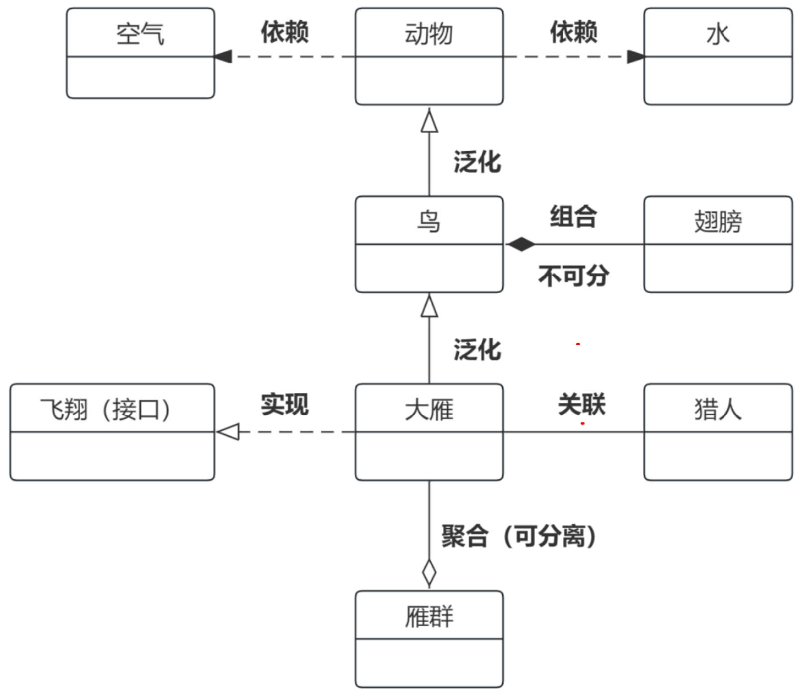

# 第5章 信息系统工程

## 本章考情分析与学习建议

**学习建议：**
本章内容主要在上午选择题中考查，案例分析考查概率较小，论文一般不涉及。建议考生以教材知识点为主，重点掌握软件工程、数据工程及系统集成的核心概念。

**历年考情：**

| 年份 | 上午选择题 | 案例分析题 | 论文写作 | 合计 |
| :--- | :--- | :--- | :--- | :--- |
| 2023年05月 | 4 | 10 | 0 | 14 |
| 2023年11月 | 约4分 | 0 | 0 | 4 |
| 2024年05月 | 约4分 | 0 | 0 | 4 |

---

## 5.1 软件工程

**定义**：应用计算机科学、数学及管理科学等原理，以工程化的原则和方法来解决软件问题的工程。
**目的**：提高软件生产率、提高软件质量、降低软件成本。

### 5.1.1 架构设计

**软件架构**：为软件系统提供了一个结构、行为和属性的高级抽象。
**根本目的**：解决软件的**复用、质量和维护**问题。

#### 1. 软件架构风格

| 序号 | 架构风格 | 包括内容 | 记忆口诀 |
| :--- | :--- | :--- | :--- |
| 1 | **数据流风格** | 批处理序列（顺序执行）、管道/过滤器（输入输出数据流）。 | 批管 |
| 2 | **调用/返回风格** | 主程序/子程序（过程调用）、数据抽象和面向对象（对象及封装）、层次结构（分层调用）。 | 主子抽象层面 |
| 3 | **独立构件风格** | 进程通信（消息传递、远程调用）、事件驱动（事件触发调用）。 | 进程办事 |
| 4 | **虚拟机风格** | 解释器（解释引擎）、基于规则（规则集）。 | 解释规则 |
| 5 | **仓库风格** | 数据库系统（中央共享数据源）、黑板系统（知识源、黑板及共享数据和控制）、超文本系统（非线性交叉引用）。 | 库超黑 |

#### 2. 软件架构评估 (基于场景)
*   **敏感点**：一个或多个构件的特性。
*   **权衡点**：影响多个质量属性的特性，是多个质量属性的敏感点。
*   **常用方法**：
    *   架构权衡分析法 (ATAM)
    *   软件架构分析法 (SAAM)
    *   成本效益分析法 (CBAM)

### 5.1.2 需求分析

#### 1. 需求的层次
1.  **业务需求**：企业或客户高层次的目标追求（目标）。
2.  **用户需求**：用户要求系统必须完成的具体任务（任务）。
3.  **系统需求**：从系统角度说明的需求，包括功能需求、非功能需求和设计约束（细节）。

**质量功能部署 (QFD) 的需求分类：**
*   **常规需求**：用户认为应该实现的功能，实现越多越满意。
*   **期望需求**：用户认为理应具备，若未实现会不满意。
*   **意外需求 (兴奋需求)**：用户要求范围外的功能，实现会带来惊喜。

#### 2. 需求过程
包括需求获取、需求分析、需求规格说明书 (SRS) 编制、需求验证与确认。

**(1) 需求获取方法**
用户访谈、问卷调查、采样、情节串联板、联合需求计划等。

**(2) 需求分析方法**
*   **结构化分析 (SA)**：核心是数据字典。
    *   **E-R图** (实体关系图)：数据模型，描述实体、属性及关系。
    *   **DFD** (数据流图)：功能模型，描述数据传递和加工。
    *   **STD** (状态转换图)：行为模型，描述系统状态转换。

*   **面向对象分析 (OOA)**：
    *   **用例模型**：描述系统需求。
    *   **分析模型**：描述逻辑结构（静态模型）和系统行为（动态模型）。

**(3) 需求验证**
需求评审（技术评审）、需求测试。

#### 3. UML (统一建模语言)
UML 是一种可视化的建模语言，不是编程语言。

**UML 事物 (建模元素)：**
*   **结构事物**：类、接口、协作、用例、活动类、构件、节点。
*   **行为事物**：交互、状态机。
*   **分组事物**：包。
*   **注释事物**：注解。

**UML 关系：**
*   **依赖**：一个事物改变影响另一个。
*   **关联**：对象连接的结构关系。
*   **泛化**：继承关系（一般与特殊）。
*   **实现**：类对接口的实现。

**UML 2.0 图 (14种)：**

| 分类 | 图名称 | 关键点 |
| :--- | :--- | :--- |
| **结构图** (静态) | **类图** | 描述类、接口及关系。 |
| | **对象图** | 描述对象及关系。 |
| | **构件图** | 描述封装的类和接口、端口。 |
| | **组合结构图** | 描述结构化类的内部结构。 |
| | **部署图** | 描述软硬件映射和分布。 |
| | **制品图** | 描述物理结构（文件、数据库）。 |
| | **包图** | 描述组织单元及依赖。 |
| **行为图** (动态) | **用例图** | 描述用例、参与者及关系。 |
| | **顺序图** (序列图) | 强调消息的时间次序。 |
| | **通信图** | 强调收发消息的对象的结构组织。 |
| | **定时图** | 强调实际时间。 |
| | **状态图** | 描述状态机（状态、转移、事件）。 |
| | **活动图** | 描述控制流和数据流（类似流程图）。 |
| | **交互概览图** | 活动图和顺序图的混合。 |

**类之间的关系 (OOA)：**
*   **关联**：结构关系。
*   **依赖**：使用关系。
*   **泛化**：继承关系 (is-a)。
*   **聚合 (共享聚集)**：整体与部分，生命周期不同 (has-a)。
*   **组合 (组合聚集)**：整体与部分，生命周期相同 (contains-a)。
*   **实现**：类与接口。

### 5.1.3 软件设计

#### 1. 结构化设计 (SD)
*   **原则**：高内聚，低耦合。
*   **内聚**：模块内部联系程度（越高越好）。
*   **耦合**：模块之间联系程度（越低越好）。

#### 2. 面向对象设计 (OOD)
*   **三大特征**：封装、继承、多态。
*   **设计原则**：
    *   **单职原则**：功能单一 (高内聚)。
    *   **开闭原则**：对扩展开放，对修改封闭。
    *   **里氏替换原则**：子类可以替换父类。
    *   **依赖倒置原则**：依赖于抽象 (接口)，不依赖于具体实现。
    *   **接口隔离原则**：使用多个专门接口比单一总接口好。
    *   **组合重用原则**：尽量使用组合，而非继承。
    *   **迪米特原则** (最少知识法则)：对象间了解越少越好 (低耦合)。

#### 3. 设计模式
*   **创建型模式**：创建对象。
*   **结构型模式**：处理类或对象的组合。
*   **行为型模式**：描述交互及职责分配。

### 5.1.4 软件实现

#### 软件测试
*   **静态测试**：不运行程序。
    *   文档测试：检查单。
    *   代码测试：桌前检查、代码走查、代码审查。
*   **动态测试**：运行程序。
    *   **白盒测试** (结构测试)：了解内部结构。
        *   方法：控制流测试、数据流测试。
        *   覆盖标准：语句、判定、条件、路径覆盖等。
    *   **黑盒测试** (功能测试)：不考虑内部结构。
        *   方法：等价类划分、边界值分析、判定表、因果图、错误猜测。

### 5.1.5 部署交付

*   **持续交付**：自动化过程，确保代码快速安全部署。
*   **持续部署方案**：
    *   容器技术：Kubernetes + Docker。
    *   **蓝绿部署**：新旧两个版本环境切换，快速回滚。
    *   **金丝雀部署** (灰度发布)：先让少量用户使用新版本，观察无误后全量推广。

### 5.1.6 过程管理

**CSMM (软件过程能力成熟度模型)**：
1.  **初始级**：过程无序，依赖个人能力。
2.  **项目规范级**：项目级管理规范。
3.  **组织改进级**：组织级标准过程，持续改进。
4.  **量化提升级**：量化管理，统计分析，预测结果。
5.  **创新引领级**：技术和管理创新，引领行业。

---

## 5.2 数据工程

### 5.2.1 数据建模
1.  **概念模型**：E-R图 (实体-联系)。
2.  **逻辑模型**：关系模型 (最重要)。
3.  **物理模型**：考虑技术实现，数据库存储。

### 5.2.2 数据标准化
*   **元数据**：关于数据的数据。
*   **数据元**：数据的基本单元 (对象+特性+表示)。

### 5.2.3 数据运维
*   **数据备份**：
    *   **完全备份**：备份所有数据。
    *   **差分备份**：备份上一次**全备份**之后变化的数据。
    *   **增量备份**：备份上一次**备份** (无论何种类型) 之后变化的数据。
*   **数据容灾**：
    *   **RPO** (恢复点目标)：允许丢失的数据量。
    *   **RTO** (恢复时间目标)：系统恢复所需时间。

### 5.2.4 数据开发利用
*   **数据挖掘**：从大量数据中提取知识，服务决策。
*   **数据可视化**：一维、二维 (GIS)、三维、多维、时态、层次、网络数据可视化。

### 5.2.5 数据库安全
*   **主要机制**：身份认证、存取控制、加密、审计、推理控制等。
*   **完整性**：实体完整性、参照完整性、用户定义完整性。

---

## 5.3 系统集成

### 5.3.1 集成基础
原则：开放性、结构化、先进性、主流化。

### 5.3.3 数据集成
*   **异构数据集成**：中间件、ODBC、XML、JSON。
    *   **XML**：可扩展标记语言。
    *   **JSON**：轻量级数据交换格式，易读写。

### 5.3.5 应用集成 (EAI)
*   **定义**：将独立软件应用连接起来，实现协同。
*   **技术要求**：互操作性、可移植性、分布透明性。
*   **关键组件**：API (应用编程接口)、事件驱动型操作、数据映射。

---

## 5.4 安全工程

### 5.4.2 安全系统 (ISSE)
**安全空间五大属性**：认证、权限、完整、加密、不可否认。

**安全服务 (OSI 安全架构)：**
1.  **鉴别服务 (认证)**：对等实体认证、数据源点认证。
2.  **访问控制**：防止未授权使用。
3.  **数据机密性**：加密保护。
4.  **数据完整性**：防止篡改、插入、删除。
5.  **抗抵赖性 (不可否认)**：禁止否认发送/接收。

### 5.4.4 ISSE-CMM (信息安全系统工程能力成熟度模型)
*   **三个基本过程**：工程过程、风险过程、保证过程。
*   **5个级别**：非正规实施级、规划和跟踪级、充分定义级、量化控制级、持续改进级。

---

## 本章练习与真题

**练习题：**

(1) ( ) 使系统的描述及信息模型的表示与客观实体相对应，符合人们的思维习惯，有利于系统开发过程中用户与开发人员的交流和沟通。
A. 原型化方法
B. 面向对象方法
C. 结构化方法
D. 面向服务方法
**【答案】B**

(2) 关于 UML (统一建模语言) 描述中，不正确的是 ( )。
A. UML 适用于各种软件开发方法
B. UML 适用于软件生命周期的各个阶段
C. 行为事物是 UML 模型中的静态部分
D. UML 不是编程语言
**【答案】C** (行为事物是动态部分，结构事物是静态部分)

(3) 面向对象软件开发方法的主要优点包括 ( )。
①符合人类思维习惯 ②普适于各类信息系统的开发 ③构造的系统复用性好 ④适用于任何信息系统开发的全生命周期
A. ①③④
B. ①②③
C. ②③④
D. ①②④
**【答案】B**

(4) 关于面向对象方法的描述，不正确的是 ( )。
A. 相比于面向过程设计方法，面向对象方法更符合人类思维习惯
B. 封装性、继承性、模块性是面向对象的三大特征
C. 面向对象设计中，应把握高内聚、低耦合的原则
D. 使用面向对象方法构造的系统具有更好的复用性
**【答案】B** (三大特征是：封装、继承、多态)

(5) 某行业协会计划开发一个信息管理系统，现阶段用户无法明确该系统的全部功能要求，希望在试用后再逐渐改进并最终实现用户需求。则该信息系统应采用的开发方法是 ( )。
A. 结构化方法
B. 面向对象方法
C. 原型化方法
D. 面向服务方法
**【答案】C**

(6) 软件测试是发现软件错误 (缺陷) 的主要手段，软件测试方法可分为静态测试和动态测试，其中 ( ) 属于静态测试。
A. 代码走查
B. 功能测试
C. 黑盒测试
D. 白盒测试
**【答案】A**

**历年真题：**

**【2023年上半年-第9题】**
在常用的OOD原则中，（ ）原则是一个对象应当对其他对象有尽可能少的了解，该原则与结构优化方法的（ ）原则是一致的。
A. 单职 高内聚
B. 组合重用 低耦合
C. 迪米特 低耦合
D. 开闭 高内聚
**【答案】C**

**【2023年上半年-第10题】**
( ) 是 ( ) 的基础，二者的目的都是为了在系统崩溃或灾难发生时能够恢复数据或系统。
A. 数据容灾 数据备份
B. 数据存储 数据安全
C. 数据安全 数据存储
D. 数据备份 数据容灾
**【答案】D**

**【2023年上半年-第11题】**
从信息系统集成技术角度来看，（ ）在最上层，主要解决（ ）问题。
A. 数据集成、互通
B. 网络集成、互连
C. 软件集成、互适应
D. 应用集成、互操作性
**【答案】D**

**【2023年上半年-第12题】**
（ ）是防止非法实体对交换数据的修改、插入、删除以及在数据交换过程中的数据丢失。
A. 对等实体认证服务
B. 数据保密服务
C. 数据完整性服务
D. 数据源点认证服务
**【答案】C**

**【2023年下半年-第4批次】**
（ ）是指当有新版本发布的时候，先少量用户使用新版本，并且观察新版本是否存在问题。如果出现问题，就及时处理并重新发布；如果一切正常，就稳步地将新版本适配给所有的用户。
A. 蓝绿部署
B. 金丝雀部署
C. 虚拟机部署
D. 持续部署
**【答案】B**

**【2024年上半年-第2批次】**
（ ）不属于白盒测试方法。
A. 功能测试
B. 静态测试
C. 人工检查代码逻辑
D. 语句覆盖
**【答案】A** (功能测试即黑盒测试)
