# 项目管理概述

# 信息系统项目管理师

# 本章学习建议

根据历年的考试情况来看，这一章的内容主要在上午进行考查。案例和论文一般不会涉及，我们学习要以教材为准，本章预计会考4分左右，请大家认真学习下面的考点。

# 本章考情分析

<table><tr><td>年份</td><td>上午选择题</td><td>案例分析题</td><td>论文写作</td><td>合计</td></tr><tr><td>2023年05月</td><td>4</td><td>0</td><td>0</td><td>4</td></tr><tr><td>2023年11月</td><td>机考4分左右</td><td>0</td><td>0</td><td>4</td></tr><tr><td>2024年05月</td><td>机考2分左右</td><td>6分（第2批）</td><td>0</td><td>8</td></tr></table>

# 6.1 PMBOK的发展(了解)

PMBOK项目管理知识体系（Project Management Body Of Knowledge，PMBOK）是由美国项目管理协会（Project Management Institute, PMI）开发的一套描述项目管理专业范围的知识体系，包含了对项目管理所需的知识、技能和工具的描述。

# 6.2.1 项目基础(掌握)

项目是为创造独特的产品、服务或成果而进行的临时性工作。

# 1.独特的产品、服务或成果

可交付成果是指在某一过程、阶段或项目完成时，形成的独特并可验证的产品、成果或服务。（可能是有形的，也可能是无形的）。

# 2.临时性工作

项目的“临时性”是指项目有明确的起点和终点。“临时性”并不一定意味着项目的持续时间短。虽然项目是临时性工作，但其可交付成果可能会在项目终止后依然存在。（项目临时，结果持久）

# 3.项目驱动变更

项目驱动组织进行变更。从业务价值角度看，项目旨在推动组织从一个状态（当前状态）转到另一个状态（将来状态），从而达成特定目标，获得更高的业务价值。

# 4.项目创造业务价值

业务价值是从组织运营中获得的可量化的净效益。项目的业务价值指特定项目的成果能够为干系人带来的效益。项目带来的效益可以是有形的、无形的或两者兼而有之。

# 6.2.1 项目基础(掌握)

# 5.项目启动背景

促进项目创建的因素多种多样。组织领导者启动项目是为了应对影响该组织持续运营和业务战略的因素。这些因素说明了项目的启动背景，它们最终应与组织的战略目标以及各个项目的业务价值相关联。

促进项目创建的因素大致可以四个基本类别。

(1) 符合法律法规或社会需求  
(2) 满足干系人要求或需求  
③ 创造、改进或修复产品、过程或服务  
(4) 执行、变更业务或技术战略

# 6.2.2 项目管理的重要性(了解)

项目管理就是将知识、技能、工具与技术应用于项目活动，以满足项目的要求。通过合理地应用并整合特定的项目管理过程，项目管理使组织能够有效并高效地开展项目。

# 6.2.3 项目成功的标准(掌握)

时间、成本、范围和质量等项目管理测量指标，历来被视为确定项目是否成功的最重要的因素。确定项目是否成功还应考虑项目目标的实现情况。

# 1.概述

一个项目可以采用三种不同的模式进行管理：独立项目（不包括在项目集或项目组合中）、在项目集内、在项目组合内。

为达成组织的一系列目的和目标，可能需要实施多个项目。在这种情况下，项目可能被归入项目集中。

# 什么是项目集(补充)

举一个例子，比如要去建造一个购物广场，要包含电影院，美食广场，超市三个基本活动场所。那么这个任务就是一个项目集，其项目集结构如下图所示：

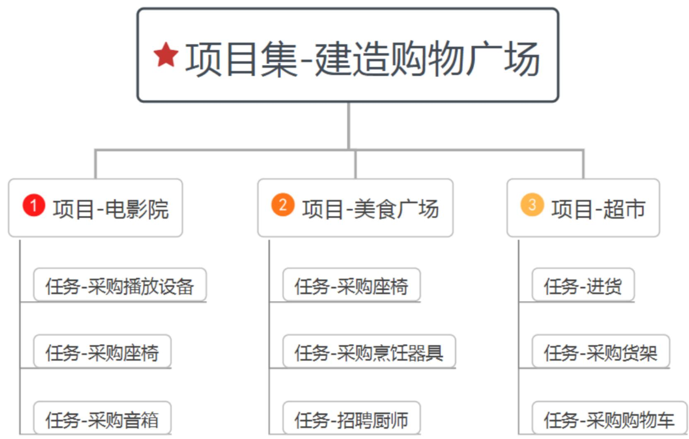

大家可以发现建造电影院、美食广场、超市三个场地，都可以看做独立的项目，这三个项目如果分开进行，不是说不行，但是统一进行，会更有利于管理，更有利于资源的调解分配。所以将这三个项目整合成一个项目集会更加合理。

# 什么是项目组合(补充)

再举一个例子，又接到一个任务，这个任务是要经营一家购物广场，战略目标当然是多多赚钱，很显然，这个任务就不再仅仅只是一个项目集了，而是一个项目组合，因为这个任务是下面这个样子的：

经营购物广场过程中，建造购物广场与开业宣传，这是两个相关性不大的活动，可以先后进行，也可以同时开展。但目的都是为了一个多赚钱。建造购物广场从硬件上保证了赚钱的前提，开业宣传从客源上保证了赚钱的基础。这就叫做为了实现战略目标，而将项目组合，项目集及项目整合在一起。

# 项目集和项目组合(补充)

项目集是一组相互关联且被协调管理的项目、子项目集和项目集活动，目的是为了获得分别管理无法获得的利益。（1+1>2的效果），项目集不是大项目，大项目是指规模、影响等特别大的项目。

项目组合是指为实现战略目标而组合在一起管理的项目、项目集、子项目组合和运营工作。它们不一定彼此依赖或者相关。

项目，可以单独存在，也可以存在于项目组合和项目集中。

项目组合、项目集、项目和运营在特定情况下是相互关联的。

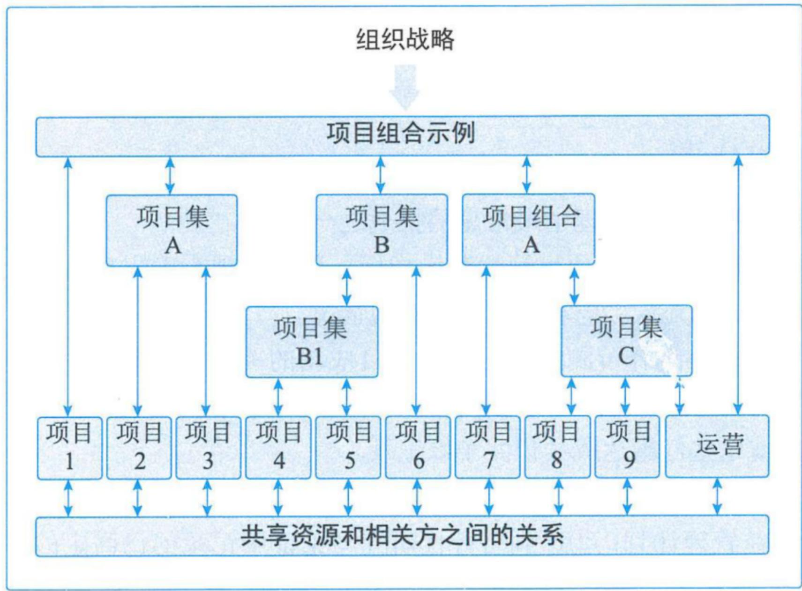  
图6-2 项目组合、项目集、项目和运营

# 6.2.4项目、项目集、项目组合和运营管理之间的关系(掌握)

# 从组织的角度看：

(1)项目和项目集管理的重点在于以“正确”的方式开展项目集和项目，即“正确地做事”；  
(2)项目组合管理则注重于开展“正确”的项目集和项目，即“做正确的事”。

# 6.2.4项目、项目集、项目组合和运营管理之间的关系(掌握)

<table><tr><td></td><td>项目</td><td>项目集</td><td>项目组合</td></tr><tr><td>定义</td><td>项目是为创造独特的产品、服务或成果而进行的临时性工作</td><td>项目集是一组相互关联且被协调管理的项目、子项目集和项目集活动，以便获得分别管理所无法获得的效益</td><td>项目组合是为实现战略目标而组合在一起管理的项目、项目集、子项目组合和运营工作的集合</td></tr><tr><td>范围</td><td>项目具有明确的目标，范围在整个项目生命周期中是渐进明晰的</td><td>项目集的范围包括其项目集组件的范围。项目集通过确保各项目集组件的输出和成果协调互补，为组织带来效益</td><td>项目组合的组织范围随着项目战略目标的变化而变化</td></tr><tr><td>变更</td><td>项目经理对变更和实施过程做出预期，实现对变更的管理和控制</td><td>项目集的管理方法是随着项目集各组件成果和输出的交付，在必要时接受和适应变更，优化效益实现</td><td>项目组合经理持续监督更广泛的内外部环境的变更</td></tr><tr><td>规划</td><td>在整个项目周期中，项目经理渐进明晰高层级信息，将其转化为详细的计划</td><td>项目集的管理利用高层级计划，跟踪项目集组件的依赖关系和进展。项目集计划也用于在组件层级指导规划</td><td>项目组合项目经理建立并维护与项目组合整体有关的必要过程和沟通</td></tr><tr><td>管理</td><td>项目经理为实现项目目标而管理项目团队</td><td>项目集由项目集经理管理，其通过协调项目集组件的活动，确保项目集效益按预期实现</td><td>项目组合经理可管理或协调项目组合管理人员或对项目组合整体负有报告职责的项目集和项目人员</td></tr><tr><td>监督</td><td>项目经理监控项目开展中生产产品、提供服务或成果的工作</td><td>项目集经理监督项目集组件的进展，确保整体目标、进度计划、预算和项目集效益的实现</td><td>项目组合经理监督战略变更以及总体资源分配、绩效成果和项目组合风险</td></tr><tr><td>成果</td><td>项目的成功通过产品和项目的质量、时间表、预期的依从性以及客户满意度水平进行衡量</td><td>项目集的成功通过项目集向组织交付预期效益的能力以及项目集交付所述效益的效率和效果进行衡量</td><td>项目组合的成功通过项目组合的总体投资效果和实现的效益进行衡量</td></tr></table>

# 2.项目集管理

项目集管理指在项目集中应用知识、技能与原则来实现项目集的目标，获得分别管理项目集组成部分所无法实现的利益和控制。项目集组成部分指项目集中的项目和其他项目集。项目管理注重项目内部的依赖关系，以确定管理项目的最佳方法。

# 3.项目组合管理

项目组合是指为实现战略目标而组合在一起管理的项目、项目集、子项目组合和运营工作。项目组合管理是指为了实现战略目标而对一个或多个项目组合进行的集中管理。项目组合中的项目集或项目不一定存在彼此依赖或直接相关的关联关系。

# 4. 运营管理

运营管理是另外一个领域，不属于项目管理范围。运营管理关注产品的持续生产、服务的持续提供。运营管理使用最优资源满足客户要求，以保证组织或业务持续高效地运行。

# 5. 运营与项目管理

持续运营不属于项目的范畴，但是项目与运营会在产品生命周期的不同时间点存在交叉。

# 6.组织级项目管理和战略

项目组合、项目集和项目都需要符合组织战略，由组织战略驱动，并以不同的方式服务于战略目标的实现：①项目组合管理通过选择适当的项目集或项目，对工作进行优先级排序，并提供所需资源，与组织战略保持一致；②项目集管理通过对其组成部分进行协调，对它们之间的依赖关系进行控制，从而实现既定收益；③项目管理使组织的目标得以实现。

# 6.2.5 项目内外部运行环境(掌握)

# 1. 组织过程资产

- 过程资产：包括工具、方法论、方法、模板、框架、模式或PMO资源。  
- 治理文件：包括政策和流程。  
- 数据资产：包括以前项目的数据库、文件库、度量指标、数据和工件。  
- 知识资产：包括项目团队成员、主题专家和其他员工的隐性知识。  
- 安保和安全：包括对设施访问、数据保护、保密级别和专有秘密的程序和实践等。

# 6.2.5 项目内外部运行环境(掌握)

# 2. 组织内部的事业环境因素

- 组织文化、结构和治理：包括愿景、使命、价值观、信念、文化规范、领导力风格、等级制度和职权关系、组织风格、道德和行为规范。  
- 设施和资源的物理分布：包括工作地点、虚拟项目团队和共享系统。  
- 基础设施：包括现有设施、设备、组织和电信通道IT硬件、可用性和功能。  
- 信息技术软件：包括进度计划软件、配置管理系统、信息系统的网络接口、协作工具和工作授权系统。  
·资源可用性：包括签订合同和采购制约因素、获得批准的供应商和分包商以及合作协议。与人员和材料相关的可用性包括签订合同和采购制约因素、获得批准的供应商和分包商以及时间线。  
·员工能力：包括通用和特定的专业知识、技能、能力、技术和知识等。

# 6.2.5 项目内外部运行环境(掌握)

# 3. 组织外部的事业环境因素

·市场条件：包括竞争对手、市场份额、品牌认知度、技术趋势和商标。  
- 社会和文化影响因素：包括政策导向、地域风俗和传统、公共假日和事件、行为规范、道德和观念。  
- 监管环境：包括与安全性、数据保护、商业行为、雇佣、许可和采购相关的全国性和地区性法律和法规。  
- 商业数据库：包括标准化的成本估算数据和行业风险研究信息。  
- 学术研究：包括行业研究、出版物和标杆对照结果。  
- 行业标准：包括与产品、生产、环境、质量和工艺相关的标准。  
·财务考虑因素：包括汇率、利率、通货膨胀、税收和关税。  
- 物理环境因素：包括工作条件和天气相关因素等。

# 6.2.6 组织系统(掌握)

项目运行时会受到项目所在的组织结构和治理框架的影响与制约。为有效且高效地开展项目，项目经理需要了解组织内的组织机构及职责分配情况，帮助自己有效地利用其权力、影响力、能力、领导力等，以便成功完成项目。

1.治理框架  
无重要考点  
2.管理要素  
无重要考点  
3.组织结构类型

# 职能型组织(补充了解)

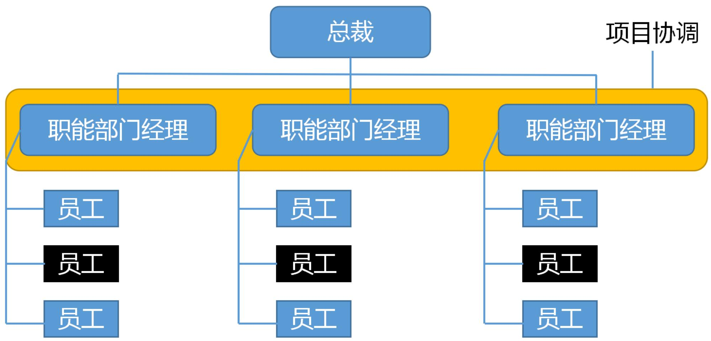

(黑框代表了参与项目活动的员工)

项目经理权利 < 职能经理

# 职能型组织的优点：

(1) 强大的技术支持，便于知识、技能和经验的交流  
(2) 清晰的职业生涯晋升路线  
(3) 直线沟通、交流简单、责任和权限很清晰  
(4) 有利于重复性工作为主的过程管理。

# 职能型组织的缺点：

(1) 职能利益优先于项目，具有狭隘性；  
(2) 组织横向之间的联系薄弱、部门间沟通、协调难度大  
(3) 项目经理极小或缺少权利、权威  
(4) 项目管理发展方向不明，缺少项目基准等

# 项目型组织(补充了解)

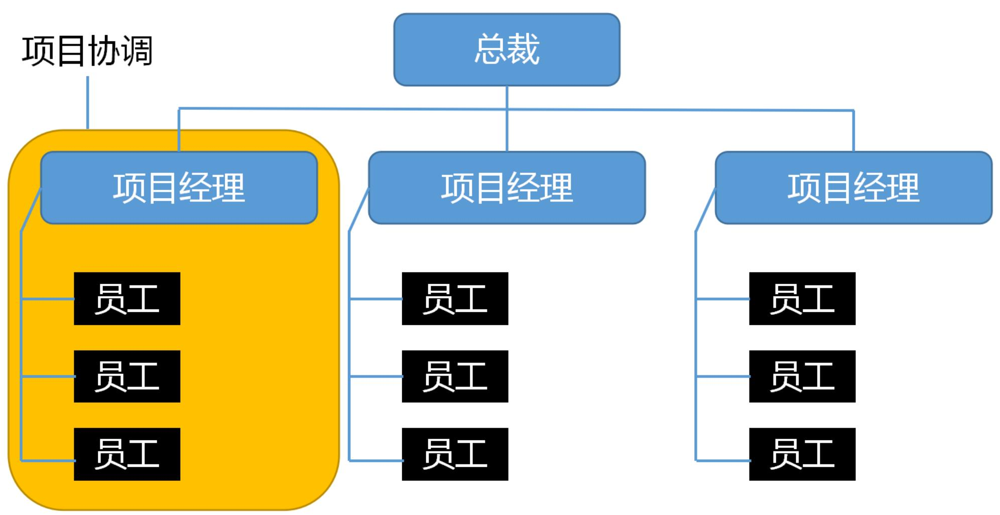  
(黑框代表了参与项目活动的员工)

项目经理权利  $>$  职能经理

# 项目型组织的优点：

(1) 结构单一、责权分明，利于统一指挥  
(2) 目标明确单一  
(3) 沟通简洁、方便  
(4) 决策快

# 项目型组织的缺点：

(1) 管理成本高，如项目的工作量不足则资源配置效率低。  
(2) 项目环境比较封闭，不利于沟通、技术知识等共享。  
(3) 员工缺乏事业上的连续性和保障等。

# 弱矩阵型组织(补充了解)

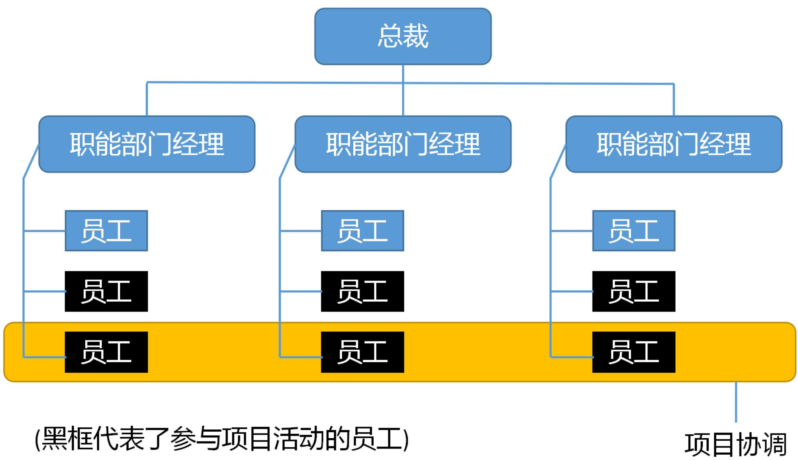  
项目经理权利 < 职能经理

# 平衡矩阵型组织(补充了解)

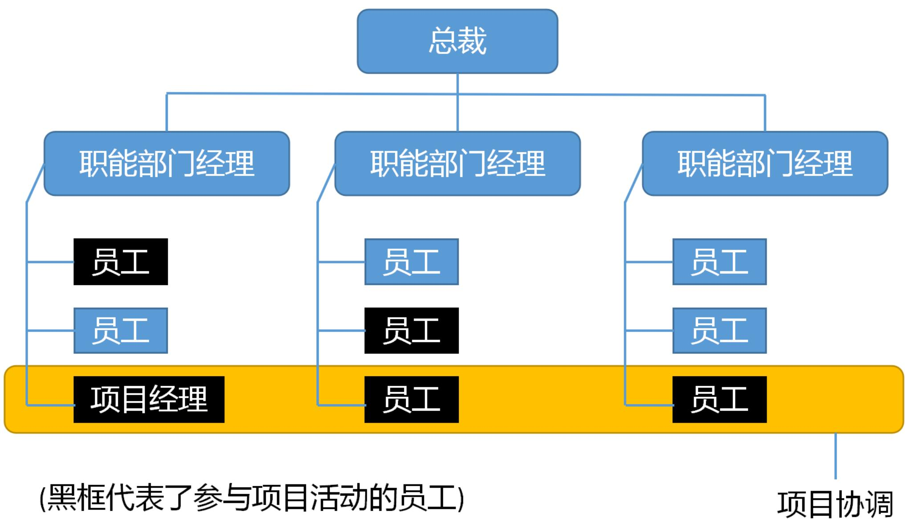  
项目经理权利 = 职能经理

# 强矩阵型组织(补充了解)

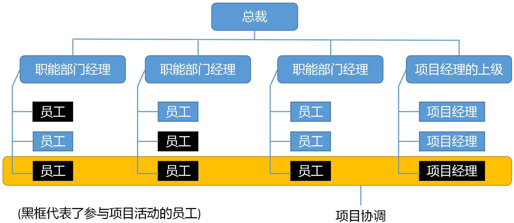  
项目经理权利  $>$  职能经理

# 矩阵型组织的优点：

(1) 项目经理负责制，有明确的项目目标  
(2) 改善了项目经理对整体资源的控制  
(3) 及时响应  
(4) 获取职能组织更多支持  
(5) 最大限度地利用公司的稀缺资源  
(6) 降低了跨职能部门间的协调合作难度  
(7) 使质量、成本、时间等制约因素得到更好的平衡  
(8) 团队成员有归属感，士气高，问题少  
(9) 冲突较少，且易处理解决

# 矩阵型组织的缺点：

(1) 管理成本增加  
(2) 多头领导  
(3) 难以监控和控制  
(4) 资源分配与项目优先的问题产生冲突；  
(5) 权力难以保持平衡

# 6.2.6组织系统(掌握)

<table><tr><td rowspan="2">组织结构类型</td><td colspan="6">项目特征</td></tr><tr><td>工作安排人</td><td>项目经理批准</td><td>项目经理的角色</td><td>资源可用性</td><td>项目预算管理人</td><td>项目管理人员</td></tr><tr><td>系统型或简单型</td><td>灵活：人员并肩工作</td><td>极少或无</td><td>兼职：工作角色（如协调员）指定与否不限</td><td>极少或无</td><td>负责人或操作员</td><td>极少或无</td></tr><tr><td>职能（集中式）</td><td>正在进行的工作（例如，设计、制造）</td><td>极少或无</td><td>兼职：工作角色（如协调员）指定与否不限</td><td>极少或无</td><td>职能经理</td><td>兼职</td></tr><tr><td>多部门（职能可复制，各部门几乎不会集中）</td><td>其中之一：产品、生产过程、项目组合、项目集、地理区域、客户类型</td><td>极少或无</td><td>兼职：工作角色（如协调员）指定与否不限</td><td>极少或无</td><td>职能经理</td><td>兼职</td></tr><tr><td>矩阵-强</td><td>按工作职能、项目经理作为一个职能</td><td>中到高</td><td>全职指定工作角色</td><td>中到高</td><td>项目经理</td><td>全职</td></tr><tr><td>矩阵-弱</td><td>工作职能</td><td>低</td><td>兼职：作为另一项工作的组成部分，并非指定工作角色，如协调员</td><td>低</td><td>职能经理</td><td>兼职</td></tr></table>

# 6.2.6组织系统(掌握)

<table><tr><td rowspan="2">组织结构类型</td><td colspan="6">项目特征</td></tr><tr><td>工作安排人</td><td>项目经理批准</td><td>项目经理的角色</td><td>资源可用性</td><td>项目预算管理人</td><td>项目管理人员</td></tr><tr><td>矩阵-均衡</td><td>工作职能</td><td>低到中</td><td>兼职:作为一种技能的嵌入职能,不可以是指定工作角色(如协调员)</td><td>低到中</td><td>混合</td><td>兼职</td></tr><tr><td>项目导向(复合、混合)</td><td>项目</td><td>高到几乎全部</td><td>全职指定工作角色</td><td>高到几乎全部</td><td>项目经理</td><td>全职</td></tr><tr><td>虚拟</td><td>网络架构,带有与他人联系的节点</td><td>低到中</td><td>全职或兼职</td><td>低到中</td><td>混合</td><td>全职或兼职</td></tr><tr><td>混合型</td><td>其他类型的混合</td><td>混合</td><td>混合</td><td>混合</td><td>混合</td><td>混合</td></tr><tr><td>PMO</td><td>其他类型的混合</td><td>高到几乎全部</td><td>全职指定工作</td><td>高到几乎全部</td><td>项目经理</td><td>全职</td></tr></table>

# 6.2.6 组织系统(掌握)

项目管理办公室（PMO）是项目管理中常见的一种组织结构，PMO对与项目相关的治理过程进行标准化，并促进资源、方法论、工具和技术共享。PMO有如下几种不同类型：

<table><tr><td>类型</td><td>说明</td><td>控制程度</td></tr><tr><td>支持型</td><td>支持型PMO担当顾问的角色，向项目提供模板、最佳实践、培训，以及来自其他项目的信息和经验教训。这种类型的PMO其实就是一个项目资源库，对项目的控制程度很低。</td><td>低</td></tr><tr><td>控制型</td><td>控制型PMO不仅给项目提供支持，而且通过各种手段要求项目服从，这种类型的PMO对项目的控制程度属于中等。他可能要求项目：一是采用项目管理框架或方法论；二是使用特定的模板、格式和工具；三是遵从治理框架。</td><td>中等</td></tr><tr><td>指令型</td><td>指令型PMO直接管理和控制项目。项目经理由PMO指定并向其报告。这种类型的PMO对项目的控制程度很高。</td><td>高</td></tr></table>

# 6.2.6 组织系统(掌握)

PMO 的一个主要职能是通过各种方式向项目经理提供支持，包括：

(1)对 PMO 所辖全部项目的共享资源进行管理；  
(2)识别和制定项目管理方法、最佳实践和标准；  
(3)指导、辅导、培训和监督；  
(4)通过项目审计，监督项目对项目管理标准、政策、程序和模板的合规性；  
(5)制定和管理项目政策、程序、模板及其他共享的文件（组织过程资产）；  
(6)对跨项目的沟通进行协调等。

# 6.2.7 项目管理和产品管理(了解)

产品是指可量化生产的工件（包括服务及其组件）。产品既可以是最终制品，也可以是组件制品。产品管理涉及将人员、数据、过程和业务系统整合，以便在整个产品生命周期中创建、维护和开发产品（或服务）。产品生命周期是指一个产品从引入、成长、成熟到衰退的整个演变过程的一系列阶段。

产品管理可以表现为如下三种不同的形式。

(1) 产品生命周期中包含项目集管理。  
(2) 产品生命周期中包含单个项目管理。  
(3) 项目集内的产品管理。

# 6.3 项目经理的角色-6.3.1定义(了解)

项目经理则由执行组织委派，负责领导团队实现项目目标。

# 6.3.2 项目经理的影响力范围(了解)

<table><tr><td>范围</td><td>影响</td></tr><tr><td>项目</td><td>领导项目团队实现项目目标和干系人的期望；利用可用资源，以平衡相互竞争的制约因素；充当项目发起人、团队成员与其他干系人之间的沟通者，包括提供指导和展示项目成功的愿景</td></tr><tr><td>组织</td><td>积极地与其他项目经理互动；扮演强有力的倡导者角色，与项目发起人合作处理内部的政治和战略问题；提高自己在组织内的总体项目管理能力和技能。项目经理还需与其他角色紧密协作，如组织经理、专家以及可行性研究分析人员。在某些情况下，项目经理可以是临时被委任的外部顾问。</td></tr><tr><td>行业</td><td>项目经理时刻关注行业的最新发展趋势，获取并判断这些信息对当前项目的影响。</td></tr><tr><td>专业学科</td><td>对项目经理而言，持续的知识传递和整合</td></tr><tr><td>跨领域</td><td>专业的项目经理可以指导和教育其他专业人员项目管理方法；担任非正式的宣传大使</td></tr></table>

# 6.3.3 项目经理的能力(了解)

# 1. 概述

项目经理需要平衡这三种技能。

- 项目管理：与项目、项目集和项目组合管理特定领域相关的知识、技能和行为，可以帮助达成项目目标。  
- 战略和商务：关于行业和组织的知识和专业技能，有助于提高绩效并取得更好的业务成果。  
·领导力：指导、激励和带领团队所需的知识、技能和行为，可以帮助组织达成业务目标。

# 2.项目管理技能

项目管理技能指有效运用项目管理知识实现项目集或项目的预期成果的能力。

# 6.3.3 项目经理的能力(了解)

# 3.战略和商务管理技能

战略和商务管理技能包括了解组织概况、有效协商，以及执行有利于战略调整和创新的决策及行动的能力。

# 4.领导力技能

领导力对组织项目是否成功至关重要，领导力技能指导、激励和带领团的能力。这些技能包括协商、抗压、沟通、解决问题、批判性思考和人际关系技能等。

# 6.3.3 项目经理的能力(掌握)

5.领导力与管理  

<table><tr><td>管理</td><td>领导力</td></tr><tr><td>直接利用职位权力</td><td>利用关系的力量指导、影响与合作</td></tr><tr><td>维护</td><td>建设</td></tr><tr><td>管理</td><td>创新</td></tr><tr><td>关注系统和架构</td><td>关注人际关系</td></tr><tr><td>依赖控制</td><td>激发信任</td></tr><tr><td>关注近期目标</td><td>关注长期愿景</td></tr><tr><td>了解方式和时间</td><td>了解情况和原因</td></tr><tr><td>关注赢利</td><td>关注范围</td></tr><tr><td>接受现状</td><td>挑战现状</td></tr><tr><td>正确地做事</td><td>做正确的事</td></tr><tr><td>关注可操作性的问题和问题的解决</td><td>关注愿景、一致性、动力和激励</td></tr></table>

# 6.3.3 项目经理的能力(掌握)

项目经理可以采用多种领导力风格，包括：  

<table><tr><td>序</td><td>领导力风格</td><td>说明</td></tr><tr><td>1</td><td>放任型</td><td>允许团队自主决策和设定目标，又被称为“无为而治型”</td></tr><tr><td>2</td><td>交易型</td><td>根据目标、反馈和成就给予奖励</td></tr><tr><td>3</td><td>服务型</td><td>做出服务承诺，处处先为他人着想；关注他人的成长、学习、发展、自主性和福利；关注人际关系、团体与合作；服务优先于领导</td></tr><tr><td>4</td><td>变革型</td><td>通过理想化特质和行为、鼓舞性激励、促进创新和创造，以及个人关怀提高追随者的能力</td></tr><tr><td>5</td><td>魅力型</td><td>能够激励他人；精神饱满、热情洋溢、充满自信；说服力强</td></tr><tr><td>6</td><td>交互型</td><td>结合了交易型、变革型和魅力型领导的特点</td></tr></table>

# 6.4 价值驱动的项目管理知识体系(掌握)

价值驱动的项目管理知识体系关注价值的实现，包含了项目管理原则、绩效域、项目生命周期、过程组、10大知识领域和价值交付系统，它们之间的关联关系如图6-5所示。项目管理原则是基础，是所有项目干系人在整个项目生命周期过程中各项活动的行动指南；项目在整个生命周期过程中，始终要坚持项目管理原则，通过涵盖10大知识领域的项目管理过程组对项目进行管理，同时密切关注干系人、团队、开发方法和生命周期、规划、项目工作、交付、测量和不确定性因素，这些因素与绩效密切相关，通过这8个绩效域帮助项目在系统内运作，实现价值交付系统的功能，为组织及其干系人创造价值，从而实现组织的战略和目标。

# 6.4 价值驱动的项目管理知识体系(掌握)

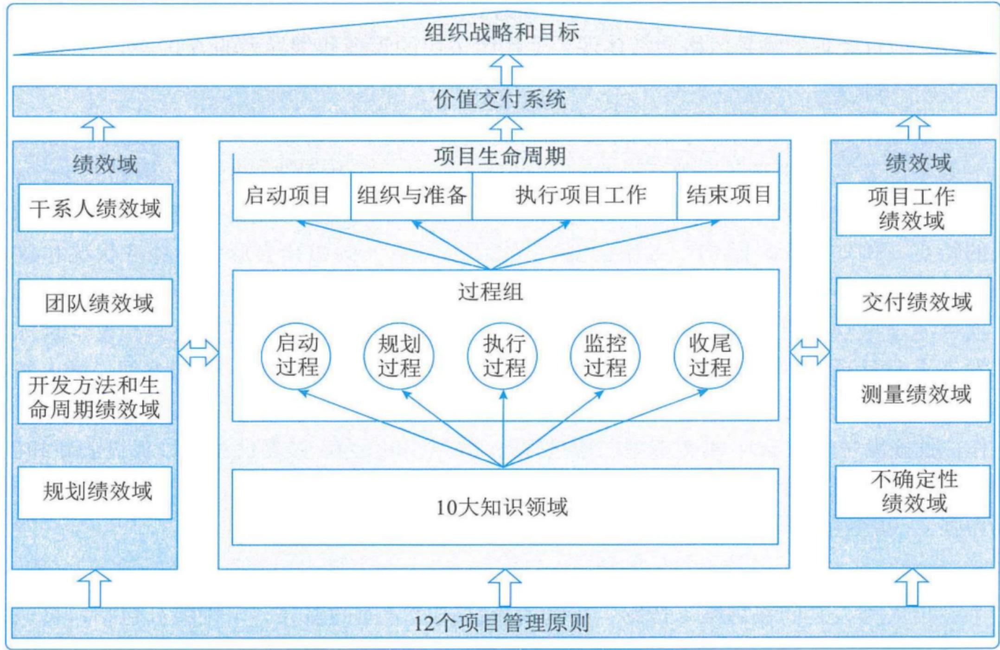  
图6-5 价值驱动的项目管理知识体系

# 6.4.1 项目管理原则(掌握)

# 1. 原则一：勤勉、尊重和关心他人

项目管理者在遵守内部和外部准则的同时，应该以负责任的方式行事，以正直、关心和可信的态度开展活动，同时对其所负责的项目的财务、社会和环境影响做出承诺。

(1) 关键点

(1) 关注组织内部和外部的职责；  
(2)坚持诚信、关心、可信、合规原则；  
(3)秉持整体观，综合考虑财务、社会、技术和可持续的发展环境等因素。

# 2. 原则二：营造协作的项目管理团队环境

项目团队由具有多样的技能、知识和经验的成员组成。协同工作的项目团队可以更有效率、有效果地实现共同的目标。

(1) 关键点

(1)项目是由项目团队交付的；  
②项目团队在组织文化和准则范围内开展工作，通常会建立自己的“本地”文化；  
③协作的项目团队环境有助于与其他组织文化和指南保持一致；个人和团队的学习和发展；为交付期望成果做出最佳贡献。

# 6.4.1 项目管理原则(掌握)

# 3. 原则三：促进干系人有效参与

积极主动地让干系人参与进来，最大限度促使项目成功和客户满意。

# (1) 关键点

(1)干系人会影响项目、绩效和成果;  
(2)项目团队通过与干系人互动来为干系人服务;  
(3)干系人的参与可主动地推进价值交付。

# 4. 原则四：聚焦于价值

针对项目是否符合商业目标以及预期收益和价值，进行持续评估并作出调整。

# (1) 关键点

(1)价值是项目成功的最终指标；  
②价值可以在整个项目进行期间、项目结束或完成后实现；  
(3)价值可以从定性和/或定量的角度进行定义和衡量;  
(4)以成果为导向，可帮助项目团队获得预期收益，从而创造价值；  
⑤评估项目进展并做出调整，使期望的价值最大化。

# 6.4.1 项目管理原则(掌握)

# 5. 原则五：识别、评估和响应系统交互

从整体角度识别、评估和响应项目的内外部环境，积极地推进项目绩效。

(1) 关键点

(1)项目是由多个相互依赖且相互作用的活动域组成的一个系统；  
②需要从系统角度进行思考，整体了解项目的各个部分如何相互作用，以及如何与外部系统进行交互；  
(3)系统不断变化，需要始终关注内外部环境；  
(4)对系统交互作出响应，可以使项目团队充分利用积极的成果。

# 6. 原则六：展现领导力行为

展现并调整领导力行为，为项目团队和成员提供支持。

(1) 关键点

①有效的领导力有助于项目成功，并有助于取得积极的成果；  
(2)任何项目团队成员都可以表现出领导力行为；  
③领导力与职权不同；  
④有效的领导者会根据情境调整自己的风格；  
⑤有效的领导者会认识到项目团队成员之间动机的差异性；  
⑥领导者应该在诚实、正直和道德行为规范方面展现出期望的行为。

# 6.4.1 项目管理原则(掌握)

# 7. 原则七：根据环境进行裁剪

根据项目的背景及其目标、干系人、治理和环境的不同应用合适的项目开发方法，使用“合适”的过程来实现预期成果，同时最大化价值、管理成本并提高速度。

(1) 关键点

(1)每个项目都具有独特性；  
(2)项目成功取决于适合项目的独特环境和方法；  
(3)裁剪应该在整个项目进展过程中持续进行。

# 8. 原则八：将质量融入到过程和成果中

保持关注过程和成果的质量，过程和成果要符合项目目标，并与干系人提出的需求、用途和验收标准保持一致。

(1) 关键点

(1)项目成果的质量要求:达到干系人期望并满足项目和产品需求;  
(2)质量通过成果的验收标准来衡量；  
(3)项目过程的质量要求是确保项目过程尽可能适当有效。

# 6.4.1 项目管理原则(掌握)

# 9. 原则九：驾驭复杂性

不断评估和确定项目的复杂性，使项目团队能够在整个生命周期中，成功找到正确的方法应对复杂情况。

(1) 关键点

(1)复杂性是由人类行为、系统交互、不确定性和模糊性造成的；  
(2)复杂性可能在项目生命周期的任何时间出现；  
③影响价值、范围、沟通、干系人、风险和技术创新的因素都可能造成复杂性；  
(4)在识别复杂性时，项目团队需要保持警惕，应用各种方法来降低复杂性的数量及其对项目的影响。

# 6.4.1 项目管理原则(掌握)

# (2) 复杂性的来源。

项目团队通常无法预见复杂性的出现，因为复杂性是风险、依赖性、事件或相互关系等许多因素交互形成的。很难分离出造成复杂性的特定原因。常见的复杂性来源包括：

- 人类行为：人类行为包括人的行为、举止、态度和经验，以及它们之间的相互作用。主观因素的引入也会使人类行为的复杂性加深。位于偏远地区的干系人可能地处不同的时区，讲不同的语言，遵守不同的文化规范。  
- 系统行为：系统行为是项目要素内部和项目要素之间动态地相互依赖与交互的结果。例如，不同技术系统的集成可能会增加复杂性，项目系统各组件之间的交互也可能导致相互关联的风险，造成新的不可预见的问题。  
- 不确定性和模糊性：不确定性是缺乏对问题、事件、目标路径和解决方案的理解和认识而导致的一种状态，是超出了现有的知识或经验的新因素引起的。模糊性是一种不清晰、不知道会发生什么情况或无法理解某种情况的状态。选项众多或不清楚哪个是最佳选项都会导致模糊性。不清晰或误导性事件、新出现的问题或主观情况也会导致模糊性。在复杂的环境中，不确定性和模糊性往往混合在一起，导致其对项目影响概率和可能性难以确定。  
- 技术创新：技术创新包括产品、服务、工作方式、流程、工具、技术、程序等的颠覆性创新。创新有助于项目产生新的解决方案，但新技术带来的不确定性也可能导致项目混乱，从而增加复杂性。

# 6.4.1 项目管理原则(掌握)

# 10. 原则十：优化风险应对

持续评估风险（包括机会和威胁），并采取应对措施，控制其对项目及其成果的影响（机会最大化，威胁最小化）。

(1) 关键点

(1)单个和整体的风险都会对项目造成影响；  
(2)风险可能是积极的(机会)，也可能是消极的(威胁)；  
(3)项目团队需要在整个项目生命周期中不断应对风险；  
(4)组织的风险态度、偏好和临界值会影响风险的应对方式；  
⑤项目团队持续反复地识别风险并积极应对，需要关注的要点包括:明确风险的重要性；考虑成本效益；切合项目实际；与干系人达成共识；明确风险责任人。

# 6.4.1 项目管理原则(掌握)

# 11. 原则十一：拥抱适应性和韧性

将适应性和韧性融入组织和项目团队的方法之中，可以帮助项目适应变革。

(1) 关键点

(1)适应性是应对不断变化的能力；  
(2)韧性是接受冲击的能力和从挫折或失败中快速恢复的能力;  
(3)聚焦于成果而非某项输出，有助于增强适应性。

# 12. 原则十二：为实现目标而驱动变革

驱动变革，使受影响者做好准备，采用新的过程并执行新的方法，完成从当前状态过渡到项目成果所带来的预期的未来状态。

(1) 关键点

(1)采用结构化变革方法，帮助个人、群体和组织从当前状态过渡到未来的期望状态；  
(2)变革源于内部和外部的影响；  
(3)变革具有挑战性，并非所有干系人都接受变革；  
(4)在短时间内尝试过多的变革会导致变革疲劳，使变革易受抵制；  
(5)干系人参与、激励，有助于变革顺利进行。

# 6.4.2 项目生命周期和项目阶段(掌握)

# 1.项目生命周期和项目阶段

项目生命周期指项目从启动到完成所经历的一系列阶段，这些阶段之间的关系可以顺序、迭代或交叠进行。项目生命周期适用于任何类型的项目。项目的规模和复杂性各不相同但不论其大小繁简，所有项目都呈现包含启动项目、组织与准备、执行项目工作和结束项目4个项目阶段的通用的生命周期结构。

# 6.4.2 项目生命周期和项目阶段(掌握)

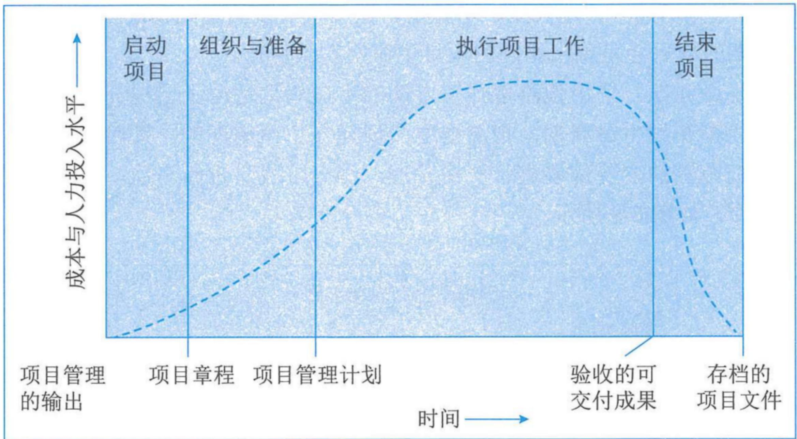  
图6-6通用项目生命周期结构中典型的成本与人力投入水平

# 6.4.2 项目生命周期和项目阶段(掌握)

通用的生命周期结构具有的特征：

(1)成本与人力投入在开始时较低，在工作执行期间达到最高，并在项目快要结束时迅速回落。这种典型的走势，如图所示。  
(2)风险与不确定性在项目开始时最大，并在项目的整个生命周期中随着决策的制定与可交付成果的验收而逐步降低；做出变更和纠正错误的成本，随着项目越来越接近完成而显著增高。  
③干系人影响力一开始最大，产品最初只有雏形干系人很轻易的可以改变它，随着项目进展产品逐步有了明确特性，干系人如果要改变它是很困难的，变更的代价非常高，因此干系人的影响力是减小的。

# 6.4.2 项目生命周期和项目阶段(掌握)

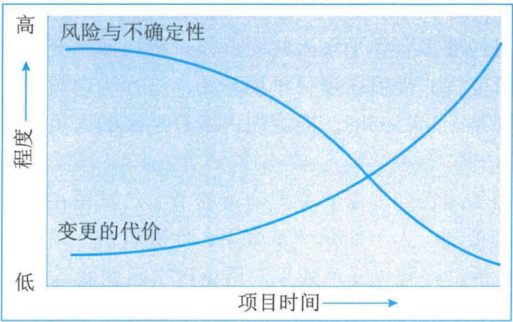  
图6-7 项目风险与不确定性随时间的变化趋势

# 6.4.2 项目生命周期和项目阶段(掌握)

# 2.项目生命周期类型

在项目生命周期内的一个或多个阶段通常会对产品、服务或成果进行开发，开发生命周期可分为预测型（计划驱动型）、迭代型、增量型、适应型（敏捷型）和混合型多种类型，采用不同的开发生命周期的项目会呈现出不同的项目生命周期的特点。

(1) 预测型生命周期（瀑布型、计划驱动型）。采用预测型开发方法的生命周期适用于已经充分了解并明确确定需求的项目。预测型生命周期在生命周期的早期阶段确定项目范围、时间和成本，对任何范围的变更都要进行严格管理，每个阶段只进行一次，每个阶段都侧重于某一特定类型的工作，如图所示。

# 6.4.2 项目生命周期和项目阶段(掌握)

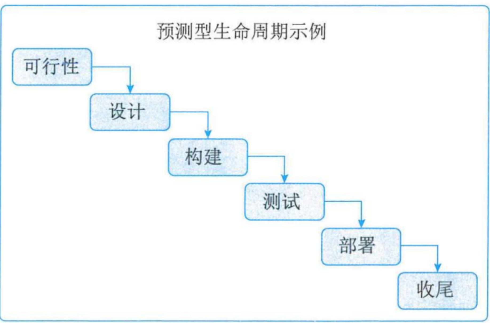  
图6-8 预测型生命周期

# 6.4.2 项目生命周期和项目阶段(掌握)

(2) 迭代型生命周期。采用迭代型生命周期的项目范围通常在项目生命周期的早期确定, 但时间及成本会随着项目团队对产品理解的不断深入而定期修改, 如图所示。(重复的循环)

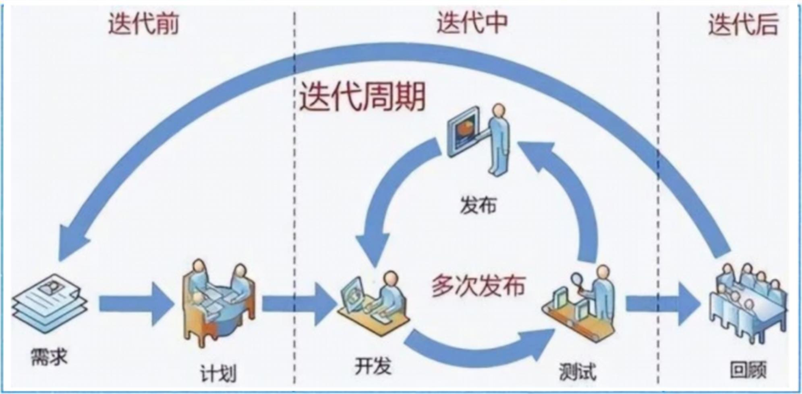  
图6-9 迭代型生命周期

# 6.4.2 项目生命周期和项目阶段(掌握)

(3) 增量型生命周期。采用增量型生命周期的项目通过在预定的时间区间内渐进增加产品功能的一系列迭代来产出可交付成果。只有在最后一次迭代之后，可交付成果具有了必要和足够的能力，才能被视为完整的，如图所示。

(渐进的增加)

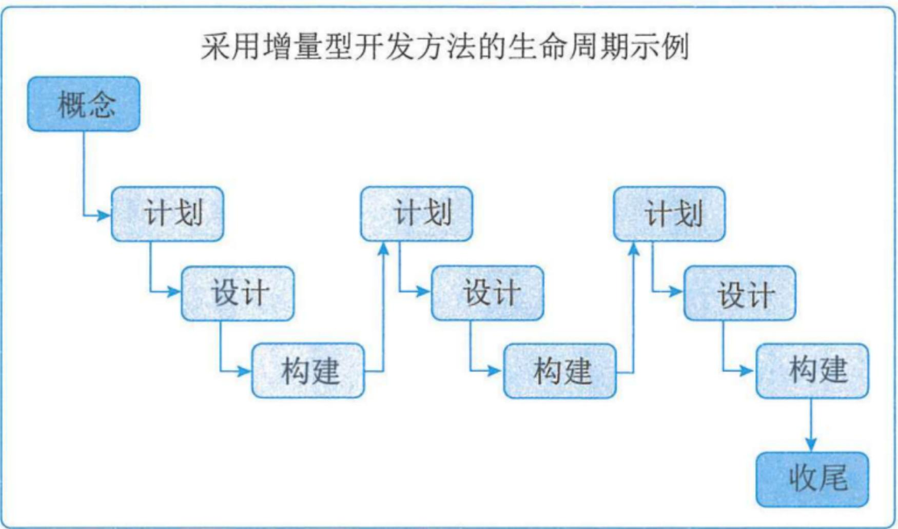  
图6-10 增量型生命周期

# 6.4.2 项目生命周期和项目阶段(掌握)

迭代方法和增量方法的区别：迭代方法是通过一系列重复的循环活动来开发产品，而增量方法是渐进地增加产品的功能。

  
Incremental 增量模型

  
Iterative 迭代模型

# 6.4.2 项目生命周期和项目阶段(掌握)

(4) 适应型生命周期。采用适应型开发方法的项目又称敏捷型或变更驱动型项目, 适合于需求不确定, 不断发展变化的项目。在每次迭代前, 项目和产品愿景的范围被明确定义和批准, 每次迭代 (又称 “冲刺”) 结束时, 客户会对具有功能性的可交付物进行审查。审查时关键干系人会提供反馈, 项目团队会更新项目待办事项列表, 以确定下一次迭代中特性和功能的优先级, 如图所示。适应型项目生命周期的特点是先基于初始需求制定一套高层级计划, 再逐渐把需求细化到适合特定规划周期所需的详细程度。

(较小的增量、快速迭代、每次交付最有价值的东西。频繁交付、干系人持续参与。适用：需应对快速变化的环境;需求和范围难以事先确定;)

# 6.4.2 项目生命周期和项目阶段(掌握)

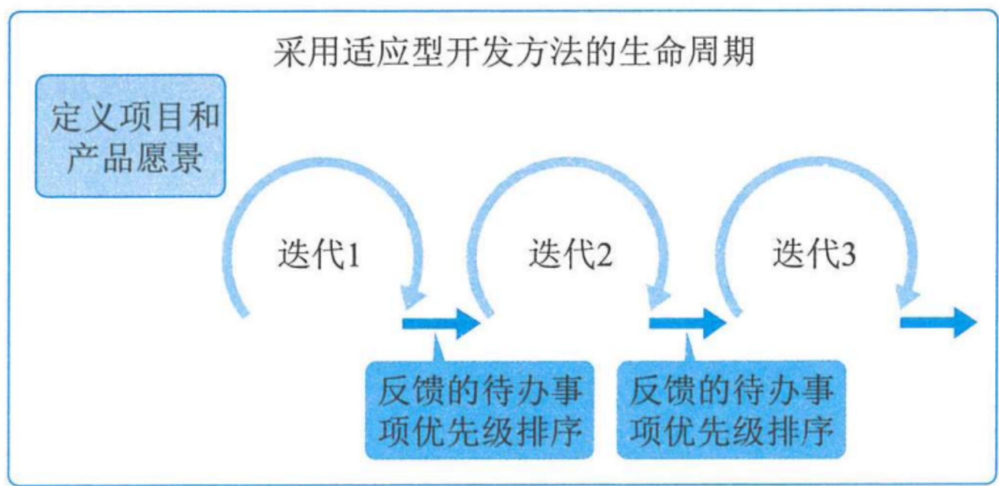  
图6-11 适应型生命周期

# 6.4.2 项目生命周期和项目阶段(掌握)

(5) 混合型生命周期。混合型生命周期是预测型生命周期和适应型生命周期的组合。

各生命周期之间的联系与区别  

<table><tr><td>预测型</td><td>迭代型与增量型</td><td>适应型</td></tr><tr><td>需求在开发前预先确定</td><td>需求在交付期间定期细化</td><td>需求在交付期间频繁细化</td></tr><tr><td>针对最终可交付成果制订交付计划，然后在项目结束时一次交付最终产品</td><td>分次交付整体项目或产品的各个子集</td><td>频繁交付对客户有价值的各个子集</td></tr><tr><td>尽量限制变更</td><td>定期把变更融入项目</td><td>在交付期间实时把变更融入项目</td></tr><tr><td>关键干系人在特定里程碑点参与</td><td>关键干系人定期参与</td><td>关键干系人持续参与</td></tr><tr><td>通过对基本已知的情况编制详细计划来控制风险和成本</td><td>通过用新信息逐渐细化计划来控制风险和成本</td><td>随着需求和制约因素的显现而控制风险和成本</td></tr></table>

# 6.4.3 项目管理过程组(掌握)

项目管理过程组是为了达成项目的特定目标，对项目管理过程进行的逻辑上的分组。项目管理过程组不同于项目阶段：①项目管理过程组是为了管理项目，针对项目管理过程进行逻辑上的划分；②项目阶段是项目从开始到结束所经历的一系列阶段，是一组具有逻辑关系的项目活动的集合，通常以一个或多个可交付成果的完成为结束标志。

项目管理过程可分为以下五个项目管理过程组：

<table><tr><td>过程组</td><td>描述</td></tr><tr><td>启动过程组</td><td>定义了新项目或现有项目的新阶段，启动过程组授权一个项目或阶段的开始。</td></tr><tr><td>规划过程组</td><td>明确项目范围、优化目标，并为实现目标制订行动计划。</td></tr><tr><td>执行过程组</td><td>完成项目管理计划中确定的工作，以满足项目要求。</td></tr><tr><td>监控过程组</td><td>跟踪、审查和调整项目进展与绩效，识别变更并启动相应的变更。</td></tr><tr><td>收尾过程组</td><td>正式完成或结束项目、阶段或合同。</td></tr></table>

# 6.4.3 项目管理过程组(掌握)

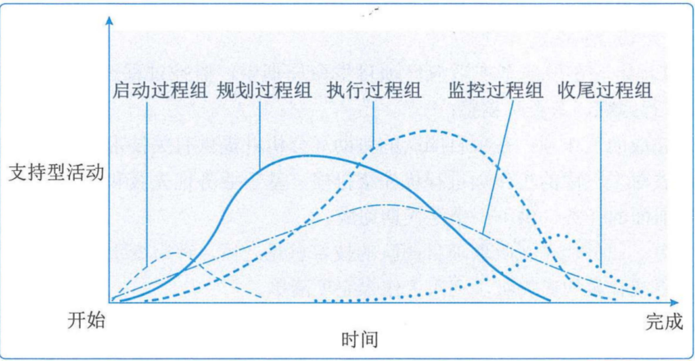  
图6-12 项目阶段中过程组的相互作用

# 6.4.3 项目管理过程组(掌握)

# 1. 适应型项目中的过程组

(1) 启动过程组。在采用适应型生命周期的项目上，启动过程通常要在每个迭代期开展。需要定期开展启动过程，频繁回顾和重新确认项目章程，以确保项目在最新的制约因素内朝最新的目标推进。  
(2) 规划过程组。在高度复杂和不确定的项目中，在采用适应型生命周期的项目上，应该让尽可能多的团队成员和干系人参与到规划过程，以便依据广泛的信息开展规划，降低不确定性。高度预测型项目范围变更很少，干系人之间有高度共识，这类项目会受益于前期的详细规划。适应型项目生命周期的特点是先基于初始需求制订一套高层级的计划，再逐渐把需求细化到适合特定规划周期所须的详细程度。预测型和适应型生命周期在规划阶段的主要区别在于做多少规划工作，以及什么时间做。

# 6.4.3 项目管理过程组(掌握)

(3) 执行过程组。每次迭代都是在一个很短的固定时间段内开展工作, 然后演示所完成的工作成果, 有关的干系人和团队基于演示来进行回顾性审查。

高度适应型项目中，项目经理聚焦于高层级的目标，并授权团队成员作为一个小组用最能实现目标的方式自行安排具体工作，有助于团队成员高度投入，制订出切合实际的计划。

(4) 监控过程组。在敏捷型或适应型项目生命周期中，监控过程通过维护未完项的清单，对进展和绩效进行跟踪、审查和调整：

- 针对未完成的工作项：在项目团队的协助（分析并提供有关技术依赖关系的信息）下，业务代表对未完成的工作项进行优先级排序，基于业务优先级和团队能力，提取未完项清单最前面的任务，供下一个迭代期完成。  
- 针对变更：业务代表在听取项目团队的技术意见之后，评审变更请求和缺陷报告，排列所需变更或补救的优先级，列入工作未完项清单。

# 6.4.3项目管理过程组(掌握)

(5) 收尾过程组。在敏捷型或适应型项目生命周期中, 收尾过程对工作进行优先级排序, 以便首先完成最具业务价值的工作。这样, 即便不得不提前关闭项目或阶段, 也很可能已经创造出一些有用的业务价值。这就使得提前关闭不太像是一种归因于沉没成本的失败, 而更像是一种提前实现收益、快速取得成功或验证某种业务概念。

# 6.4.3 项目管理过程组(掌握)

# 2.适应型项目中过程组之间的关系

(1) 以迭代方式顺序开展的项目。适应型项目往往可分解为一系列先后顺序进行的，被称为“迭代期”的阶段。  
(2) 持续反复开展的项目。高度适应型项目往往在整个项目生命周期内持续实施所有的项目管理过程组。

# 6.4.4 项目管理知识领域(掌握)

<table><tr><td rowspan="2">知识领域</td><td colspan="5">项目管理过程组</td></tr><tr><td>启动过程组</td><td>规划过程组</td><td>执行过程组</td><td>监控过程组</td><td>收尾过程组</td></tr><tr><td>项目整合管理</td><td>1.制定项目章程</td><td>2.制订项目管理计划</td><td>3.指导与管理项目工作4.管理项目知识</td><td>5.监控项目工作6.实施整体变更控制</td><td>7.结束项目或阶段</td></tr><tr><td>项目范围管理</td><td></td><td>1.规划范围管理2.收集需求3.定义范围4.创建WBS</td><td></td><td>5.确认范围6.控制范围</td><td></td></tr><tr><td>项目进度管理</td><td></td><td>1.规划进度管理2.定义活动3.排列活动顺序4.估算活动持续时间5.制定进度计划</td><td></td><td>6.控制进度</td><td></td></tr><tr><td>项目成本管理</td><td></td><td>1.规划成本管理2.估算成本3.制定预算</td><td></td><td>4.控制成本</td><td></td></tr><tr><td>项目质量管理</td><td></td><td>1.规划质量管理</td><td>2.管理质量</td><td>3.控制质量</td><td></td></tr><tr><td>项目资源管理</td><td></td><td>1.规划资源管理2.估算活动资源</td><td>3.获取资源4.建设团队5.管理团队</td><td>6.控制资源</td><td></td></tr><tr><td>项目沟通管理</td><td></td><td>1.规划沟通管理</td><td>2.管理沟通</td><td>3.监督沟通</td><td></td></tr><tr><td>项目风险管理</td><td></td><td>1.规划风险管理2.识别风险3.实施定性风险管理4.实施定量风险管理5.规划风险应对</td><td>6.实施风险应对</td><td>7.监督风险</td><td></td></tr><tr><td>项目采购管理</td><td></td><td>1.规划采购管理</td><td>2.实施采购</td><td>3.控制采购</td><td></td></tr><tr><td>项目干系人管理</td><td>1.识别干系人</td><td>2.规划干系人管理</td><td>3.管理干系人参与</td><td>4.监督干系人参与</td><td></td></tr></table>

# 6.4.5 项目绩效域(掌握)

项目绩效域是一组对有效地交付项目成果至关重要的活动。项目绩效域是项目执行过程中需要密切关注的相互作用、相互关联和相互依赖的领域，它们可以协调一致地实现预期的项目成果，共有干系人、团队、开发方法和生命周期、规划、项目工作、交付、测量、不确定性八个项目绩效域。这些绩效域共同构成了一个统一的整体。这样，绩效域就可以作为一个整合系统运作，每个绩效域都与其他绩效域相互依赖，从而促使成功交付项目及其预期成果。

# 6.4.6 价值交付系统(了解)

价值交付系统描述了项目如何在系统内运作，为组织及其干系人创造价值。  
价值交付系统包括项目如何创造价值、价值交付组件和信息流。

# 1. 创造价值

项目存在于组织中，包括政府机构、科研院所、企事业单位和其他组织，为干系人创造价值。

# 2.价值交付组件

可以单独或共同使用多种组件（例如项目组合、项目集、项目、产品和运营）以创造价值。这些组件共同组成了一个符合组织战略的价值交付系统。

# 3.信息流

当信息和信息反馈在所有价值交付组件之间以一致的方式共享时，价值交付系统最为有效，能够使系统与战略保持一致。

# 本章练习

(1) 项目有明确的起点和终点，体现了项目的（）特性。

A.独特性

B.临时性

C.渐进明细

D.及时性

# 【参考答案】B

(2) 项目管理不善，可能会导致的后果不包括（）。

A.项目范围失控

B.组织声誉受损

C. 管理制约因素

D.干系人不满意

# 【参考答案】C

# 本章练习

(3)从项目、项目集、项目组合管理的目标来看，（）注重于开展“正确”的工作，即“做正确的事”。

A.项目组合管理

B. 单个项目管理

C.大项目管理

D.项目集管理

# 【参考答案】A

(4) 在 ( ) 组织结构中, 项目经理全职指定工作角色。

A.职能型

B.平衡矩阵型

C.强矩阵型

D.弱矩阵型

# 【参考答案】C

# 本章练习

(5) ( ) PMO直接管理和控制项目。项目经理由PMO指定并向其报告。这种类型的PMO对项目的控制程度很高。

A. 指令型

B.支持型

C.控制型

D.组合型

# 【参考答案】A

(6) 针对领导力和管理二者的区别，属于领导力的特征的是（）。

A.直接利用职位

B.关注系统和架构

C.关注可操作性的问题和问题的解决

D.激发信任

# 【参考答案】D

# 本章练习

(7) ( ) 的特点是先基于初始需求制订一套高层级的计划, 再逐渐把需求细化到适合特定的规划周期所需的详细程度。

A.预测型项目生命周期

B.混合型项目生命周期

C.适应型项目生命周期

D.瀑布型项目生命周期

# 【参考答案】C

(8) 价值驱动的项目管理知识体系关注价值的实现，包含了项目管理原则、绩效域、项目生命周期、过程组、十大知识领域和价值交付系统，其中（）是基础，是所有项目干系人在整个项目生命周期过程中各项活动的行动指南。

A.项目生命周期

B.项目管理原则

C.绩效域

D.价值交付系统

# 【参考答案】B

# 本章练习

判断下列表述正误，正确的选√错误的选×。

(1) 规划过程组是为了完成项目管理计划中确定的工作，以满足项目要求。  
(2) 项目管理者在遵守内部和外部准则的同时, 应该以负责任的方式行事,以正直、关心和可信的态度开展活动, 同时对其所负责项目的财务、社会和环境影响做出承诺。这体现了展现领导力行为的原则。  
(3) 项目绩效域是项目执行过程中需要密切关注的相互作用、相互关联和相互依赖的领域，它们可以协调一致地实现预期的项目成果。  
(4) 项目可通过提高效率、生产力、效果或响应能力创造价值。  
(5) 放任型领导关注他人的成长、学习、发展、自主性和福利。

【参考答案】  $(1) \times (2) \times (3) \vee (4) \vee (5) \times$

# 历年真题练习

# 【2023年上半年-第17题】

( ) 重在对项目进行优先级排序，并提供所需资源，与组织战略保持一致；  
(1) 通过对其组成部分进行协调，对它们之间的依赖关系进行控制，从而实现既定收益。

A.项目集管理、组织级项目管理  
B.项目组合管理、组织级项目管理  
C.项目集管理、项目组合管理  
D.项目组合管理、项目集管理

【答案】D

# 历年真题练习

# 【2023年上半年-第18题】

关于项目经理相关能力的描述，不正确的是（）。

A.项目管理、战略和商务、领导力是项目经理需关注的技能  
B. 人际交往占据项目经理的绝大部分工作内容  
c.领导力关注近期目标，关注可操作性的问题和问题解决  
D.战略和商务技能有助于项目经理了解与项目相关的商业因素

【答案】C

# 历年真题练习

# 【2023年上半年-第19题】

关于项目管理原则中“驾驭复杂性原则”的描述，不正确的是（）。

A.复杂性可能在项目生命周期的任何时间出现  
B.影响价值、沟通、技术、风险的因素都可能造成复杂性  
c.项目团队能够实时预测未来复杂性的出现并分析其原因  
D.复杂性是由系统交互、不确定性和模糊性等造成的

【答案】C

# 历年真题练习

# 【2023年上半年-第20题】

关于项目价值的描述，不正确的是（）

A.项目存在于组织中，为干系人创造价值  
B.价值以过程为导向并定量定义，以获得预期的经济收益为目标  
c.项目可通过提高效率、生产力、效果或响应能力来创造价值  
D.价值是项目成功的最终指标，可创造满足需要的新产品、服务或结果

【答案】B

# 历年真题练习

# 【2023年下半年-第4批次】

关于项目的描述，不正确的是：（）。

A.项目的需求不复存在，是项目宣告结束的情况之一  
B.实现项目目标可能会产生一个或多个可交付成果  
c.可交付成果可能会在项目终止后依然存在  
D.项目是为创造独特的产品、服务或成果而进行的周期性工作

【答案】D

# 历年真题练习

# 【2024年上半年-第1批次】

关于项目经理的描述，不正确的是（）。

A.项目经理应该时刻关注行业的最新发展趋势  
B.项目经理是发起人、团队成员与其他干系人之间的沟通者  
c.项目经理不可以是临时被委任的外部顾问  
D.项目经理领导项目团队实现项目目标

【答案】C

