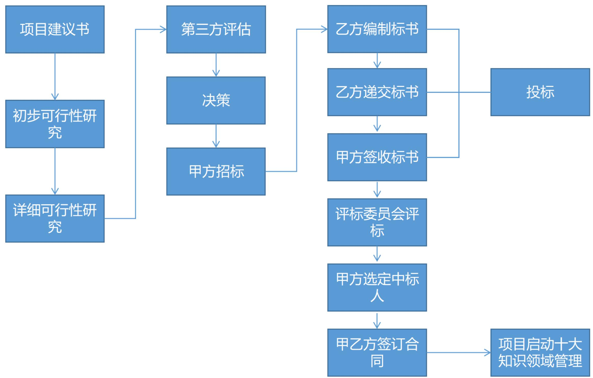

# 立项流程(补充了解)

# 立项管理(掌握)

项目立项管理是对拟规划和实施的项目技术上的先进性、适用性，经济上的合理性、效益性，实施上的可能性、风险性以及社会价值的有效性、可持续性等进行全面科学的综合分析，为项目决策提供客观依据的一种技术经济研究活动。一般包括项目建议与立项申请、项目可行性研究、项目评估与决策。

项目建议与立项申请、初步可行性研究、详细可行性研究、评估与决策是项目投资前时期的四个阶段。在实际工作中，初步可行性研究和详细可行性研究可以依据项目的规模和繁简程度合二为一，但详细可行性研究是不可缺少的。升级改造项目只做初步和详细研究，小项目一般只进行详细可行性研究。

# 7.1 项目建议与立项申请(掌握)

# 1. 立项申请概念

立项申请又称为项目建议书，是项目建设单位向上级主管部门提交项目申请时所必须的文件，是该项目建设筹建单位根据国民经济的发展、国家和地方中长期规划、产业政策、生产力布局、国内外市场、所在地的内外部条件、组织发展战略等，提出的某一具体项目的建议文件，是对拟建项目提出的框架性总体设想。项目建议书是项目发展周期的初始阶段，是国家或上级主管部门选择项目的依据，也是可行性研究的依据。涉及利用外资的项目，在项目建议书获得批准后，方可开展后续工作。

# 2. 项目建议书内容

项目建议书应该包括的核心内容有:①项目的必要性;②项目的市场预测;③项目预期成果（如产品方案或服务）的市场预测;④项目建设必需的条件。

# 7.2 项目可行性研究(掌握)

可行性研究是在项目建议书被批准后，从技术、经济、社会和人员等方面的条件和情况进行调查研究，对可能的技术方案进行论证，以最终确定整个项目是否可行。

# 7.2.1可行性研究的内容(掌握)

信息系统项目进行可行性研究包括：技术可行性分析、经济可行性分析、社会效益可行性分析、运行环境可行性分析以及其他方面的可行性分析等。

# 1.技术可能性分析

是指在当前的技术、产品条件限制下，能否利用现在拥有的以及可能拥有的技术能力、产品功能、人力资源来实现项目的目标、功能、性能，能否在规定的时间期限内完成整个项目。

技术可行性分析一般应当考虑的因素包括：

(1)进行项目开发的风险;  
(2)人力资源的有效性;  
(3) 技术能力的可能性;  
(4) 物资（产品）的可用性；

技术可行性分析往往决定了项目的方向，一旦开发人员在评估技术可行性分析时估计错误，将会出现严重的后果，造成项目根本上的失败。

# 7.2.1可行性研究的内容(掌握)

# 2.经济可行性分析

是对整个项目的投资及所产生的经济效益进行分析，具体包括支出分析、收益分析、投资回报分析以及敏感性分析。

(1) 支出分析。信息系统项目的支出可分为一次性支出和非一次性支出两类。

一次性支出：包括开发费、培训费、差旅费、初始数据录入、设备购置费等费用。

非一次性支出：包括软、硬件租金、人员工资及福利、水电等公用设施使用费，以及其他消耗品支出等。

(2) 收益分析。信息系统项目收益包括直接收益、间接收益以及其他方面的收益等。

- 直接收益：指通过项目实施获得的直接经济效益，如销售项目产品的收入。  
- 间接收益：指通过项目实施，通过间接方式获得的收益，如成本的降低。  
- 其他收益：如知识产权、软件著作权等。

(3) 收益投资比、投资回收期分析。对投入产出进行对比分析，以确定项目的收益率和投资回收期等经济指标。  
(4) 敏感性分析。当诸如设备和软件配置、处理速度要求、系统的工作负荷类型和负荷量等关键性因素变化时，对支出和收益产生影响的估计。

# 7.2.1可行性研究的内容(掌握)

# 3.社会可行性分析

(1) 组织内部。品牌效益、竞争力效益、技术创新效益、人员提升收益、管理提升效益。  
(2) 组织外部。公共效益、文化效益、环境效益、社会责任感效益、其他收益。

# 4. 运行可行性分析

运行环境是制约信息系统在用户单位发挥效益的关键。因此，在进行运行环境可行性分析时，可以重点评估是否可以建立系统顺利运行所需要的环境以及建立这个环境所需要进行的工作，以便可以将这些工作纳入项目计划之中。

# 5.其他方面的可行性分析

诸如法律可行性、政策可行性等方面的可行性分析。也会涉及到合同责任、知识产权等法律方面的可行性问题。

# 7.2.2 初步可行性研究(掌握)

初步可行性研究一般是在对市场或者客户情况进行调查后，对项目进行的初步评估。详细可行性研究需要对项目在技术、经济、社会、运行环境、法律等方面进行深入的调查研究和分析，是一项费时、费力的工作。经过初步可行性研究，可以形成初步可行性研究报告。

初步可行性研究的结果及研究的主要内容基本与详细可行性研究相同。所不同的是占有的资源、研究细节方面有较大差异。

辅助（功能）研究包括项目的一个或几个方面，但不是所有方面，并且只能作为初步可行性研究、详细可行性研究和大规模投资建议的前提或辅助。辅助研究的内容视研究的性质和打算研究的项目各有不同，但由于其关系到项目的关键方面，因此其结论应为随后的项目阶段指明方向。辅助研究的费用必须和项目可行性研究的费用一并考虑，因为这种研究的目的之一就是要在项目可行性研究阶段节省费用。

# 7.2.3 详细可行性研究(掌握)

详细可行性研究是在项目决策前对与项目有关的技术、经济、法律、社会环境等方面的条件和情况，进行详尽的、系统的、全面地调查、研究和分析，对各种可能的技术方案进行详细的论证、比较，并对项目建设完成后所可能产生的经济、社会效益进行预测和评价，最终提交的可行性研究报告将成为进行项目评估和决策的依据。

详细可行性研究的原则：科学性原则、客观性原则、公正性原则。

详细可行性研究的方法如经济评价法、市场预测法、投资估算法和增量净效益法等。

# 7.2.3 详细可行性研究(掌握)

初步可研和详细可研的主要内容：  

<table><tr><td>初步可行性研究内容</td><td>详细可行性研究的内容</td></tr><tr><td>(1)需求与市场预测</td><td>(1)市场需求预测</td></tr><tr><td>(2)设备与资源投入分析</td><td>(2)部件和投入的选择供应</td></tr><tr><td>(3)空间布局</td><td>(3)信息系统架构及技术方案的确定</td></tr><tr><td>(4)项目设计</td><td>(4)技术与设备选择</td></tr><tr><td>(5)项目进度安排</td><td>(5)网络物理布局设计</td></tr><tr><td>(6)项目投资与成本估算</td><td>(6)投资、成本估算与资金筹措</td></tr><tr><td></td><td>(7)经济评价及综合分析</td></tr></table>

项目总成本一般划分为四大类：研发成本、行政管理费、销售与分销费用、财务费用和折旧。前三类成本的总和称为经营成本。

# 7.3 项目评估与决策(掌握)

项目评估指在项目可行性研究的基础上，由第三方（国家、银行或有关机构），对拟建项目建设的必要性、建设条件、生产条件、市场需求、工程技术、经济效益和社会效益等进行评价、分析和论证，进而判断其是否可行的一个评估过程。项目评估是项目投资前期进行决策管理的重要环节，其目的是审查项目可行性研究的可靠性、真实性和客观性，为银行的贷款决策或行政主管部门的审批决策提供科学依据。

项目评估的最终成果是项目评估报告。

项目评估的依据包括:

(1) 项目建议书及其批准文件;  
(2)项目可行性研究报告;  
(3)报送组织的申请报告及主管部门的初审意见;  
(4)项目关键建设条件和工程等的协议文件;  
(5)必需的其他文件和资料等。

# 7.3 项目评估与决策(掌握)

项目评估的工作程序:

(1) 成立评估小组  
(2) 开展调查研究  
(3) 分析与评估  
(4) 编写、讨论、修改评估报告  
(5) 召开专家论证会  
(6) 评估报告定稿并发布。

# 本章练习

(1) 立项申请、初步可行性研究、详细可行性研究、评估与决策是投资前时期的四个阶段，其中（）是不可缺少的。

A. 立项申请

B. 初步可行性研究

C.详细可行性研究

D.评估与决策

# 【参考答案】C

(2) ( ) 是项目发展周期的初始阶段，是国家或上级主管部门选择项目的依据，也是可行性研究的依据。

A.项目建议书

B.项目评估

C.项目决策

D.项目规划

# 【参考答案】A

# 本章练习

(3) ( ) 是指在当前市场的技术、产品条件限制下, 能否利用现在拥有的以及可能拥有的技术能力、产品功能、人力资源来实现项目的目标、功能、性能, 能否在规定的时间期限内完成整个项目。

A.技术可行性研究

B.经济可行性分析

C. 运行环境可行性分析

D.投资可行性研究

# 【参考答案】A

(4) 软、硬件租金、人员工资及福利、水电等公用设施使用费属于 ( )。

A.直接支出

B.支持型

c.非一次性支出

D.项目支出

# 【参考答案】C

# 历年真题练习

# 【2023年上半年-第21题】

在可行性报告中，“是否存在人力资源不足的问题，是否可以通过社会招聘或培训获得所需人员”属于（）的内容。

A.技术可行性分析

B.经济可行性分析

C.社会效益可行性分析

D. 运行环境可行性分析

【答案】A

# 历年真题练习

【2023年上半年-第22题】

不可作为项目评估依据的是（）。

A.建议书及其批准文件

B.可行性研究报告

C.协议文件

D. 项目章程

【答案】D

# 历年真题练习

# 【2023年下半年-第4批次】

（）不属于项目建议书的核心内容

A.项目的必要性

B. 初步可行性研究

C.项目的市场预测

D.项目建设必需的条件

【答案】B

# 历年真题练习

# 【2024年上半年-第1批次】

项目评估指在（）的基础上，由（）根据国家颁布的政策、法规、方法、参数和条例等条件下，进行评价、分析和论证。

A.项目立项申请、第三方  
B.项目立项申请、项目承建方  
C.项目可行性研究、第三方  
D.项目可行性研究、项目建设方

【答案】C

# Thank You!

微信公众号：野人老师 淘宝店铺：yeren.taobao.com

# 项目立项管理

# 信息系统项目管理师

# 本章学习建议

根据历年的考试情况来看，项目可行性研究和评估一般上午大概考2分左右。上午、案例分析、论文写作都可能进行考查。此章节内容需要记忆的比较多，理论性比较强，对大家来说应该算是个难点，因为很多人没有接触过本块的工作，比如可研、评估的等。此部分论文比较难，不需要大家去准备，案例分析可以稍微去想想，可能会考哪些点。

# 本章考情分析

<table><tr><td>年份</td><td>上午选择题</td><td>案例分析题</td><td>论文写作</td><td>合计</td></tr><tr><td>2023年05月</td><td>2</td><td>0</td><td>0</td><td>2</td></tr><tr><td>2023年11月</td><td>机考2分左右</td><td>0</td><td>0</td><td>2</td></tr><tr><td>2024年05月</td><td>机考2分左右</td><td>14分（第2批）</td><td>0</td><td>16</td></tr></table>