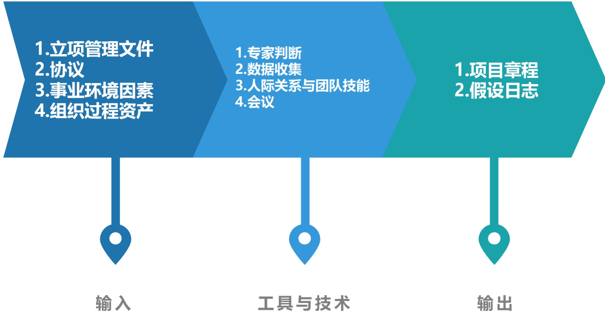
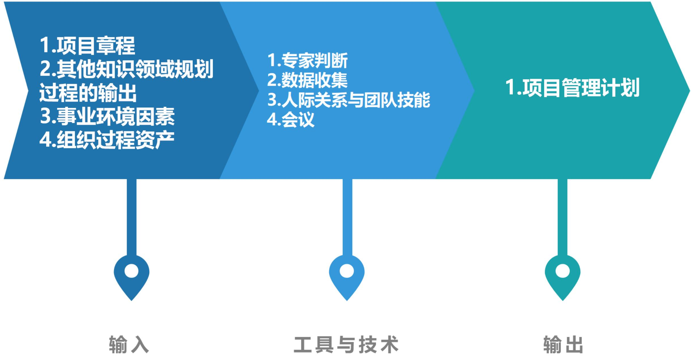
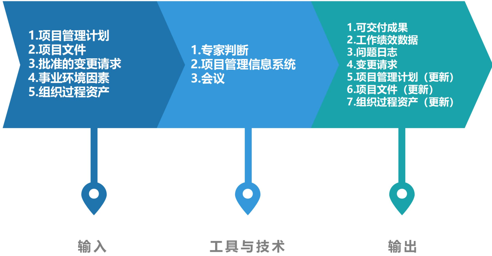
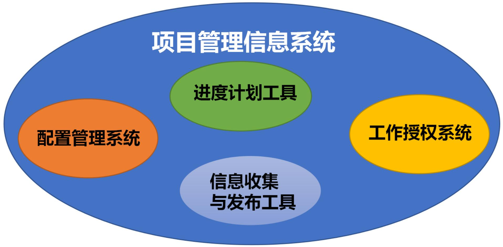
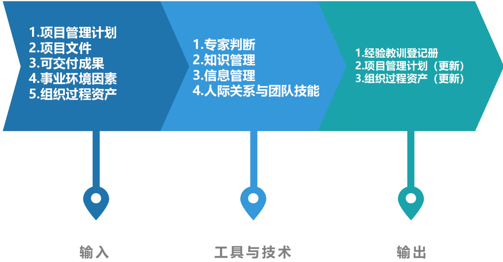
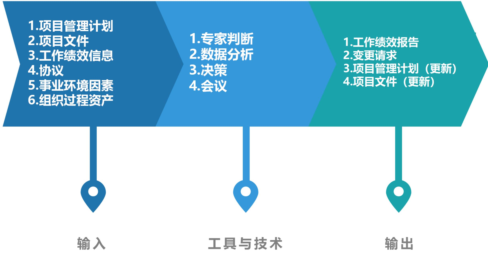
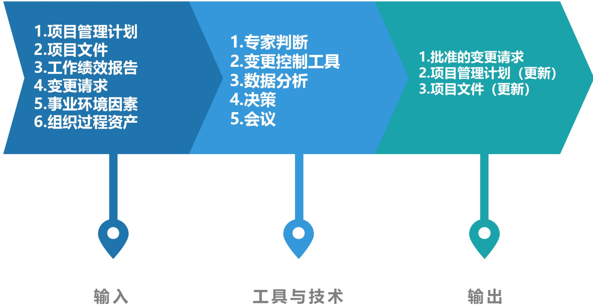
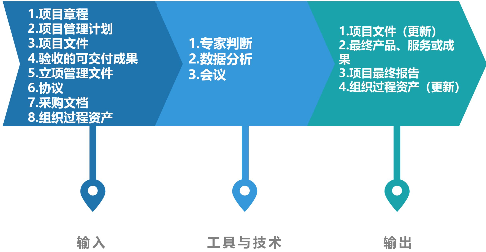
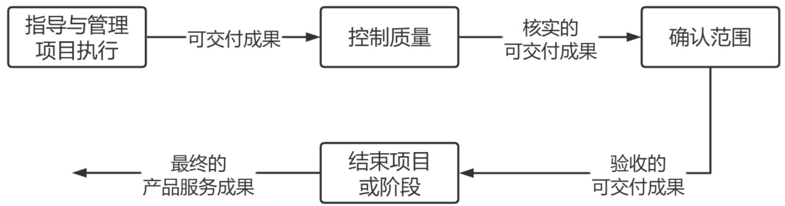
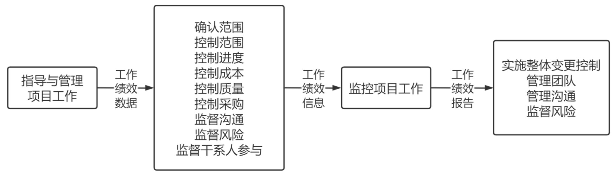

# 项目整合管理

# 信息系统项目管理师

# 本章学习建议

根据历年的考试情况来看，由于本章内容属于10大管理的内容，项目整合管理在项目管理的10大知识领域中处于核心位置，其功效是整合项目资源。整合管理是一个全局性、综合性的管理过程，起着总体的协调和把关的作用。上午选择、案例分析、论文写作都会进行考查。项目整合管理一般上午考察3-4分左右。

# 本章考情分析

<table><tr><td>年份</td><td>上午选择题</td><td>案例分析题</td><td>论文写作</td><td>合计</td></tr><tr><td>2023年05月</td><td>4</td><td>0</td><td>0</td><td>4</td></tr><tr><td>2023年11月</td><td>机考4分左右</td><td>5分(第4批)</td><td>0</td><td>9</td></tr><tr><td>2024年05月</td><td>机考3分左右</td><td>12分(第2批)</td><td>0</td><td>15</td></tr></table>

# 十大知识领域(背诵)

# 学习路线(掌握)

1、每个管理领域有哪些过程，要求熟练记忆  
2、每个过程有哪些输入、输出、工具与技术、最少掌握一个输入、输出、工具与技术（上午选择题、下午案例分析、论文写作）  
3、每个管理领域有什么问题，该如何解决（下午案例分析）  
4、每一个管理领域和其它管理领域的关系

# 整合管理ITO(掌握)

<table><tr><td colspan="5">整合管理</td></tr><tr><td>组</td><td>过程</td><td>输入</td><td>工具和技术</td><td>输出</td></tr><tr><td>启动</td><td>1.制定项目章程</td><td>1.立项管理文件
•商业需求
•成本效益分析
2.协议
3.事业环境因素
4.组织过程资产</td><td>1.专家判断
2.数据收集
•头脑风暴
•焦点小组
•访谈
3.人际关系与团队技能
•冲突管理
•引导
•会议管理
4.会议</td><td>1.项目章程
2.假设日志</td></tr></table>

# 整合管理ITO(掌握)

<table><tr><td>组</td><td>过程</td><td>输入</td><td>工具和技术</td><td>输出</td></tr><tr><td>计划</td><td>2.制订项目管理计划</td><td>1.项目章程2.其他知识领域规划过程的输出3.事业环境因素4.组织过程资产</td><td>1.专家判断2.数据收集·头脑风暴·核对单·焦点小组·访谈3.人际关系与团队技能·冲突管理·引导·会议管理4.会议</td><td>1.项目管理计划</td></tr></table>

# 整合管理ITO(掌握)

<table><tr><td>组</td><td>过程</td><td>输入</td><td>工具和技术</td><td>输出</td></tr><tr><td>执行</td><td>3.指导与管理项目工作</td><td>1.项目管理计划
·任何组件
2.项目文件
·需求跟踪矩阵
·风险登记册
·风险报告
·里程碑清单
·项目进度计划
·项目沟通记录
·经验教训登记册
·变更日志
3.批准的变更请求
4.事业环境因素
5.组织过程资产</td><td>1.专家判断
2.项目管理信息系统
3.会议</td><td>1.可交付成果
2.工作绩效数据
3.问题日志
4.变更请求
5.项目管理计划(更新)
·任何组件
6.项目文件(更新)
·活动清单
·假设日志
·经验教训登记册
·需求文件
·风险登记册
·干系人登记册
7.组织过程资产(更新)</td></tr></table>

# 整合管理ITO(掌握)

<table><tr><td>组</td><td>过程</td><td>输入</td><td>工具和技术</td><td>输出</td></tr><tr><td>执行</td><td>4.管理项目知识</td><td>1.项目管理计划
•所有组件
2.项目文件
•资源分解结构
•项目团队派工单
•供方选择标准
•干系人登记册
3.可交付成果
4.事业环境因素
5.组织过程资产</td><td>1.专家判断
2.知识管理
3.信息管理
4.人际关系与团队技能
•积极倾听
•引导
•领导力
•人际交往
•大局观</td><td>1.经验教训登记册
2.项目管理计划(更新)
•任何组件
3.组织过程资产(更新)</td></tr></table>

# 整合管理ITO(掌握)

<table><tr><td>组</td><td>过程</td><td>输入</td><td>工具和技术</td><td>输出</td></tr><tr><td>监控</td><td>5.监控项目工作</td><td>1.项目管理计划
·任何组件
2.项目文件
·假设日志
·风险登记册
·风险报告
·里程碑清单
·估算依据
·问题日志
·经验教训登记册
·成本预测
·进度预测
·质量报告
3.工作绩效信息
4.协议
5.事业环境因素
6.组织过程资产</td><td>1.专家判断
2.数据分析
·备选方案分析
·成本效益分析
·挣值分析
·根本原因分析
·趋势分析
·偏差分析
3.决策
4.会议</td><td>1.工作绩效报告
2.变更请求
3.项目管理计划(更新)
·任何组件
4.项目文件(更新)
·成本预测
·进度预测
·问题日志
·经验教训登记册
·风险登记册</td></tr></table>

# 整合管理ITO(掌握)

<table><tr><td>组</td><td>过程</td><td>输入</td><td>工具和技术</td><td>输出</td></tr><tr><td>监控</td><td>6.实施整体变更控制</td><td>1.项目管理计划
·变更管理计划
·配置管理计划
·范围基准
·进度基准
·成本基准
2.项目文件
·需求跟踪矩阵
·风险报告
·估算依据
3.工作绩效报告
4.变更请求
5.事业环境因素
6.组织过程资产</td><td>1.专家判断
2.变更控制工具
3.数据分析
·备选方案分析
·成本效益分析
4.决策
·投票
·独裁型决策制定
·多标准决策分析
5.会议</td><td>1.批准的变更请求
2.项目管理计划
(更新)
·任何组件
3.项目文件(更新)
·变更日志</td></tr></table>

# 整合管理ITO(掌握)

<table><tr><td>组</td><td>过程</td><td>输入</td><td>工具和技术</td><td>输出</td></tr><tr><td>收尾</td><td>7.结束项目或阶段</td><td>1.项目章程2.项目管理计划·所有组件3.项目文件·假设日志·需求文件·里程碑清单·风险登记册·风险报告·估算依据·变更日志·问题日志·经验教训登记册·项目沟通记录·质量控制测量结果·质量报告4.验收的可交付成果5.立项管理文件·可行性研究报告·项目评估报告6.协议7.采购文档8.组织过程资产</td><td>1.专家判断2.数据分析·文件分析·回归分析·趋势分析·偏差分析3.会议</td><td>1.项目文件(更新)·经验教训登记册2.最终产品、服务或成果移交3.项目最终报告4.组织过程资产(更新)</td></tr></table>

# 8.1 管理基础-8.1.1 执行整合(掌握)

项目整合管理由项目经理负责，项目经理负责整合所有其他知识领域的成果，并掌握项目总体情况。项目整合管理的责任不能被授权或转移，项目经理必须对整个项目承担最终责任。整合是项目经理的一项关键技能。执行项目整合时项目经理承担双重角色：

- 组织层面上，项目经理扮演重要角色，与项目发起人携手合作，了解战略目标并确保项目目标和成果与项目组合、项目集以及业务领域保持一致。  
- 项目层面上，项目经理负责指导团队关注真正重要的事务并协同工作。为此，项目经理需要整合过程、知识和人员。

整合的三个层面包括:

1. 过程层面执行整合（变更等整合）等；  
2. 认知层面执行整合（整合经验、见解、领导力、技术及商业管理技能等）；  
3.背景层面执行整合（考虑社交网络、多元文化、虚拟团队等新技术新环境）。

# 8.1.2 整合管理的复杂性(掌握)

项目的复杂性来源于组织的系统行为、人类行为以及组织或环境中的不确定性。在项目整合之前，项目经理需要考虑项目面临的内外部环境因素，检查项目的特征或属性。作为项目的一种特征或属性，复杂性的含义：①包含多个部分；②不同部分之间存在一系列关联；③不同部分之间的动态交互作用；④这些交互作用所产生的行为远远大于各部分简单的相加(例如突发性行为)。

项目经理可以通过检查项目的这些复杂性特征，帮助其在规划、管理和控制项目时识别关键领域，确保完成整合。

# 8.1.3 管理新实践(了解)

与整合管理过程相关的新趋势和新兴实践包括:

- 使用信息化工具：用来收集、分析和使用信息（如项目管理信息系统）  
- 使用可视化管理工具（帮助团队直观看到项目的实时状态，促进知识转移）  
- 项目知识管理（将积累的知识传达给目标受众，防止知识流失）  
- 项目经理在项目以外的职责（需要参与管理层和PMO负责的立项前、结项后的可行性研究与评估和效益管理，全面地识别干系人，引导他们参与项目）  
- 混合型方法（采用敏捷或其他迭代的适应型方法）

# 8.1.4 项目管理计划和项目文件(掌握)

<table><tr><td>项目管理计划</td><td colspan="2">项目文件</td></tr><tr><td>1.范围管理计划</td><td>1.活动属性</td><td>17.项目团队派工单</td></tr><tr><td>2.需求管理计划</td><td>2.活动清单</td><td>18.质量控制测量结果</td></tr><tr><td>3.进度管理计划</td><td>3.假设日志</td><td>19.质量测量指标</td></tr><tr><td>4.成本管理计划</td><td>4.估算依据</td><td>20.质量报告</td></tr><tr><td>5.质量管理计划</td><td>5.变更日志</td><td>21.需求文件</td></tr><tr><td>6.资源管理计划</td><td>6.成本估算</td><td>22.需求跟踪矩阵</td></tr><tr><td>7.沟通管理计划</td><td>7.持续时间估算</td><td>23.资源分解结构</td></tr><tr><td>8.风险管理计划</td><td>8.问题日志</td><td>24.资源日历</td></tr><tr><td>9.采购管理计划</td><td>9.经验教训登记册</td><td>25.资源需求</td></tr><tr><td>10.干系人参与计划</td><td>10.里程碑清单</td><td>26.风险登记册</td></tr><tr><td>11.变更管理计划</td><td>11.物质资源分配单</td><td>27.风险报告</td></tr><tr><td>12.配置管理计划</td><td>12.项目日历</td><td>28.进度数据</td></tr><tr><td>13.范围基准</td><td>13.项目沟通记录</td><td>29.进度预测</td></tr><tr><td>14.进度基准</td><td>14.项目进度计划</td><td>30.干系人登记册</td></tr><tr><td>15.成本基准</td><td>15.项目进度网络图</td><td>31.团队章程</td></tr><tr><td>16.绩效测量基准</td><td>16.项目范围说明书</td><td>32.测试与评估文件</td></tr><tr><td>17.项目生命周期描述</td><td></td><td></td></tr><tr><td>18.开发方法</td><td></td><td></td></tr></table>

# 8.2.1 过程概述(背诵)

<table><tr><td>过程</td><td>过程定义</td><td>主要作用</td></tr><tr><td>1.制定项目章程</td><td>编写一份正式批准项目并授权项目经理在项目活动中使用组织资源的文件的过程</td><td>①明确项目与组织战略目标之间的直接联系；②确立项目的正式地位；③展示组织对项目的承诺【仅开展一次或仅在项目的预定义时开展】</td></tr><tr><td>2.制订项目管理计划</td><td>定义、准备和协调项目计划的所有组成部分，并把它们整合为一份综合项目管理计划的过程</td><td>生成一份综合文件，用于确定所有项目工作的基础及其执行方式【仅开展一次或仅在项目的预定义时开展】</td></tr><tr><td>3.指导与管理项目工作</td><td>为实现项目目标而领导和执行项目管理计划中所确定的工作，并实施已批准变更的过程</td><td>对项目工作和可交付成果开展综合管理，以提高项目成功的可能性【整个项目期间开展】</td></tr><tr><td>4.管理项目知识</td><td>使用现有知识并生成新知识，以实现项目目标并且帮助组织学习的过程</td><td>①利用已有的组织知识来创造或改进项目成果；②使当前项目创造的知识可用于支持组织运营和未来的项目或阶段【在整个项目期间开展】</td></tr><tr><td>5.监控项目工作</td><td>跟踪、审查和报告整体项目进展，以实现项目管理计划中确定的绩效目标的过程</td><td>①让干系人了解项目的当前状态并认可为处理绩效问题而采取的行动；②通过成本和进度预测，让干系人了解项目的未来状态【整个项目期间开展】</td></tr><tr><td>6.实施整体变更控制</td><td>审查所有变更请求、批准变更，管理对可交付成果、项目文件和项目管理计划的变更，并对变更处理结果进行沟通的过程</td><td>确保对项目中已记录在案的变更做出综合评审。如果不考虑变更对整体项目目标或计划的影响就开展变更，往往会加剧整体项目风险【整个项目期间开展。】</td></tr><tr><td>7.结束项目或阶段</td><td>终结项目、阶段或合同的所有活动的过程</td><td>①存档项目或阶段信息，完成计划的工作；②释放组织团队资源以展开新的工作【仅开展一次或仅在项目或阶段的结束点开展】</td></tr></table>

# 5大过程组与整合管理(掌握)

<table><tr><td>10大管理</td><td>启动过程组</td><td>规划过程组</td><td>执行过程组</td><td>监控过程组</td><td>收尾过程组</td></tr><tr><td rowspan="2">项目整合管理</td><td rowspan="2">①制定项目章程</td><td rowspan="2">②制订项目管理计划</td><td>③指导与管理项目工作</td><td>⑤监控项目工作</td><td rowspan="2">⑥结束项目或阶段</td></tr><tr><td>④管理项目知识</td><td>⑥实施整体变更控制</td></tr></table>

# 8.2.2 裁剪考虑因素(了解)

# 裁剪考虑:

项目生命周期  
- 开发生命周期  
- 管理方法  
知识管理  
- 变更  
$\bullet$  治理  
- 经验教训  
$\bullet$  效益

# 8.2.3 敏捷与适应方法(了解)

- 在敏捷或适应型环境中，采用敏捷或适应型方法能够帮助项目经理将决策权下放，团队成员可以自行决定并控制具体产品的规划和交付，  
- 项目经理则重点关注营造合作型的决策氛围，并确保团队有能力应对变更，  
- 促进团队成员以相关领域专家的身份参与整合管理。  
- 如果团队成员具备广泛的技能基础而不局限于某个狭窄的专业领域,那么这种合作型方法就会更加有效。

# 8.3 制定项目章程(掌握)

- 项目章程在项目执行和项目需求之间建立了联系。通过编制项目章程，来确认项目是否符合组织战略和日常运营的需要。  
- 项目章程用于建立组织内部的合作关系，确保正确交付合同内容。  
- 章程授权项目经理在项目活动中使用组织资源，因此，应在规划开始之前任命项目经理，项目经理越早确认并任命越好，最好在制定项目章程时就任命。  
- 项目章程可由发起人编制，也可由项目经理与发起机构合作编制。  
- 项目章程一旦被批准，就标志着项目的正式启动。

【注意】章程只能由发起人签发、修订。项目经理可以参与或代为编制但无权签发和修订章程。

- 项目由项目以外的机构来启动，例如发起人、项目集或项目管理办公室（PMO）、项目组合治理委员会主席或其授权代表。项目启动者或发起人应该具有一定的职权，能为项目获取资金并提供资源。

# 制定项目章程的ITO(掌握)

# 1. 立项管理文件

立项管理阶段经批准的结果或相关的立项管理文件是用于制定项目章程的依据。一般情况下立项管理包含商业需求和成本效益分析，论证项目的合理性并确定项目边界。

由于立项管理文件不是项目文件，项目经理不可以对它们进行更新或修改， 只可以提出相关建议。虽然立项管理文件是在项目之前制定的，但需要定期审核。

# 2.协议

协议有多种形式，包括合同、谅解备忘录、服务水平协议（SLA）、协议书、意向书、口头协议或其他书面协议。为外部客户做项目时，通常需要签订合同。

# 3. 事业环境因素

# 4.组织过程资产

# 8.3.2 工具与技术(掌握)

1. 专家判断：专家判断是指基于某应用领域、知识领域、学科和行业等的专业知识而做出的、关于当前活动的合理判断，这些专业知识可来自具有专业学历、知识、技能、经验或培训经历的任何小组或个人。

# 2.数据收集

- 头脑风暴：用于在短时间内获得大量创意，适用于团队环境，需要引导者进行引导。头脑风暴由两个部分构成：创意产生和创意分析。制定项目章程时可通过头脑风暴向干系人、主题专家和团队成员收集数据、解决方案或创意。【大量创意、畅所欲言，追求数量，缺点：容易受权威影响】  
- 焦点小组：召集干系人和主题专家讨论项目风险、成功标准和其他议题，比一对一访谈更有利于互动交流。【同职能、同一领域专家、主持人引导互动式讨论】  
- 访谈：通过与干系人直接交谈，了解高层级需求、假设条件、制约因素、审批标准以及其他信息。【直接交谈、预设和即兴问题、一对一、多对多、获取机密信息】

# 8.3.2 工具与技术(掌握)

# 3.人际关系与团队技能

- 冲突管理：有助于干系人就目标、成功标准、高层级需求、项目描述、总体里程碑和其他内容达成一致意见。  
- 引导：有效引导团队活动成功达成决定、解决方案或结论。  
- 会议管理：包括准备议程，确保邀请每个关键干系人代表，以及准备和发送后续的会议纪要和行动计划。

# 4.会议

与关键干系人举行会议

# 1. 项目章程 (背诵)

项目章程记录了关于项目和项目预期交付的产品、服务或成果的高层级信息：

(1)项目目的;  
(2)可测量的项目目标和相关的成功标准;  
(3)高层级需求、高层级项目描述、边界定义以及主要可交付成果;  
(4)整体项目风险;  
(5)总体里程碑进度计划;  
(6)预先批准的财务资源;  
(7) 关键干系人名单;  
(8)项目审批要求（例如，评价项目成功的标准，由谁对项目成功下结论，由谁签署项目结束）;  
(9)项目退出标准（例如，在何种条件下才能关闭或取消项目或阶段）；  
(10)委派的项目经理及其职责和职权;  
(1)发起人或其他批准项目章程的人员的姓名和职权等。

# 8.3.3 输出(掌握)

# 2.假设日志

假设日志用于记录整个项目生命周期中的所有假设条件和制约因素。

# 8.4 制订项目管理计划(掌握)

- 项目管理计划确定项目的执行、监控和收尾方式，其内容会根据项目所在的应用领域和复杂程度的不同而不同。  
- 项目管理计划可以是概括或详细的，每个组成部分的详细程度取决于具体项目的要求。  
- 项目管理计划应基准化，即至少应规定项目的范围、时间和成本方面的基准，以便据此考核项目执行情况和管理项目绩效。  
- 在确定基准之前，可能要对项目管理计划进行多次更新，且这些更新无需遵循正式的流程。但是一旦确定了基准，就只能通过提出变更请求、实施整体变更控制过程进行更新。  
- 在项目收尾之前，项目管理计划需要通过不断更新来渐进明细，并且这些更新需要得到控制和批准。

# 8.4.1 输入(掌握)

# 1. 项目章程

2. 其他知识领域规划过程的输出：创建项目管理计划需要整合诸多过程的输出。其他知识领域规划过程所输出的子计划和基准都是本过程的输入。此外，对这些子计划和基准的变更都可能导致对项目管理计划的相应更新。  
3. 事业环境因素  
4.组织过程资产

# 8.4.2 工具与技术(掌握)

1. 专家判断  
2.数据收集

- 头脑风暴：制订项目管理计划时，经常以头脑风暴的形式来收集关于项目方法的创意和解决方案。参会者包括项目团队成员，其他主题专家和干系人也可参与。  
- 核对单：核对单可以指导项目经理制订计划或帮助检查项目管理计划是否包含所需的全部信息。【核对单就是Checklist，检查清单】  
- 焦点小组：召集干系人讨论项目管理方法以及项目管理计划各个组成部分的整合方式。  
- 访谈：用于从干系人获取特定信息，制订项目管理计划、任何子计划或项目文件。

# 8.4.2 工具和技术(掌握)

# 3.人际关系与团队技能

- 冲突管理：必要时可以通过冲突管理让具有差异性的干系人就项目管理计划的所有方面达成共识。  
- 引导：引导者确保参与者有效参与、互相理解，并考虑所有意见，按既定决策流程全力支持得到的结论或结果。  
- 会议管理：有必要采用会议管理来确保有效召开多次会议，以便制订、统一和商定项目管理计划。

# 4.会议

通常利用项目开工会议来明确项目规划阶段工作的完成并宣布开始项目执行阶段，目的是传达项目目标、获得团队对项目的承诺，以及阐明每个干系人的角色和职责。

# 1.项目管理计划

项目管理计划是说明项目执行、监控和收尾方式的一份文件，它整合并综合了所有知识领域子管理计划和基准，以及管理项目所需的其他组件信息，项目管理计划的组件取决于项目的具体需求。

项目管理计划组件主要包括：（背诵）

- 子管理计划：范围管理计划、需求管理计划、进度管理计划、成本管理计划、质量管理计划、资源管理计划、沟通管理计划、风险管理计划、采购管理计划、干系人参与计划。  
- 基准：范围基准、进度基准和成本基准。  
- 其他组件：变更管理计划、配置管理计划、绩效测量基准、项目生命周期、开发方法、管理审查。

# 8.5 指导与管理项目工作(掌握)

指导与管理项目工作是为实现项目目标而领导和执行项目管理计划中所确定的工作，并实施已批准变更的过程。本过程的主要作用是对项目工作和可交付成果开展综合管理，以提高项目成功的可能性。本过程需要在整个项目期间开展。指导与管理项目工作过程的数据流向。

1.项目管理计划  
2.项目文件  
3. 批准的变更请求

批准的变更请求是实施整体变更控制过程的输出，包括经项目经理审查和批准的变更请求，必要时需要经变更控制委员会(CCB)审查和批准。

CCB是项目的所有者权益代表，负责对变更进行决策。CCB由项目所涉及的主要干系人共同组成，通常包括用户和项目所在组织管理层的决策人员。CCB是决策机构，不是作业机构；通常CCB的工作是通过评审手段来决定项目基准是否需要变更，但不提出变更方案。

经CCB批准的变更请求可能是纠正措施、预防措施和缺陷补救措施，并由项目团队纳入项目进度计划付诸实施，批准的变更请求可能对项目或项目管理计划的相关领域产生影响，还可能导致修改正式受控的项目管理计划组件或项目文件。

4.事业环境因素  
5.组织过程资产

# 8.5.2 工具与技术(掌握)

1. 专家判断  
2.项目管理信息系统

项目管理信息系统给项目提供了IT软件工具，例如进度计划软件工具、工作授权系统、配置管理系统、信息收集与发布系统，以及进入其他在线信息系统（如知识库）的登录界面，支持自动收集和报告关键绩效指标（KPI）。

# 8.5.2 工具与技术(掌握)

# 3.会议

参会者可包括项目经理、项目团队成员，以及与所讨论事项相关或会受该事项影响的干系人。

会议类型一般包括：开工会议、技术会议、敏捷或迭代规划会议、每日站会、指导小组会议、问题解决会议、进展跟进会议以及回顾会议。

# 1.可交付成果

可交付成果是在某一过程、阶段或项目完成时，必须产出的任何独特并可核实的产品、成果或服务能力。它通常是项目的结果，包括项目管理计划的组成部分。

# 2. 工作绩效数据

工作绩效数据是在执行项目工作的过程中从每个正在执行的活动中收集到的原始观察结果和测量值。

例如：工作绩效数据包括已完成的工作、关键绩效指标(KPI)、技术绩效测量结果、进度活动的实际开始日期和完成日期、已完成的故事点、可交付成果状态、进度进展情况、变更请求的数量、缺陷的数量、实际发生的成本、实际持续时间等。

# 8.5.3 输出(掌握)

# 3.问题日志

在整个项目生命周期中，项目经理通常会遇到问题、差距、不一致或意外冲突。项目经理需要采取某些行动加以处理，以免影响项目绩效。问题日志是一种记录和跟进所有问题的项目文件，所需记录和跟进的内容主要包括：①问题类型；②问题提出者和提出时间；③问题描述；④问题优先级；⑤解决问题负责人；⑥目标解决日期；⑦问题状态；⑧最终解决情况等。整个项目生命周期应该随时监控活动更新问题日志。

# 4.变更请求

- 变更请求是关于修改任何文件、可交付成果或基准的正式提议。任何项目干系人都可以提出变更请求，应该通过实施整体变更控制过程对变更请求进行审查和处理。  
- 变更请求一般包括:

纠正措施：为使项目工作绩效重新与项目管理计划一致，而进行的有目的的活动。

预防措施：为确保项目工作未来绩效符合项目管理计划，而进行的有目的的活动。

缺陷补救：为了修正不一致产品或产品组件，而进行的有目的的活动。

更新：对正式受控的项目文件或计划进行变更，以反映修改、增加的意见或内容。

6.项目文件 (更新)

7.组织过程资产 (更新)

5.项目管理计划 (更新)

# 8.6 管理项目知识(掌握)

管理项目知识是使用现有知识并生成新知识，以实现项目目标并且帮助组织学习的过程。

# 管理项目知识的ITO(掌握)

# 8.6.1 输入(掌握)

1.项目管理计划  
2.项目文件  
3.可交付成果  
4. 事业环境因素  
5.组织过程资产

# 8.6.2 工具与技术(掌握)

# 1. 专家判断

# 2.知识管理

知识管理工具和技术主要包括：①人际交往 ②实践社区和特别兴趣小组 ③会议 ④工作跟随和跟随指导 ⑤讨论论坛 ⑥知识分享活动 ⑦研讨会 ⑧讲故事 ⑨创造力和创意管理技术 ⑩知识展会和茶座 ⑪交互式培训等。

# 3.信息管理

信息管理用于创建人们与知识之间的联系，可以有效促进简单、明确的显性知识的分享。

# 8.6.2 工具与技术(掌握)

# 4.人际关系与团队技能。

<table><tr><td>●积极倾听：有助于减少误解并促进沟通和知识分享。</td></tr><tr><td>●引导：有助于有效指引团队成功地达成决定、解决方案或结论。</td></tr><tr><td>●领导力：可帮助沟通愿景并鼓舞项目团队关注合适的知识和知识目标。</td></tr><tr><td>●人际交往：可促进项目干系人之间建立非正式的联系和关系，为显性和隐性知识的分享创造条件。</td></tr><tr><td>●大局观：有助于项目经理根据组织政策与职权结构等进行规划与沟通。</td></tr></table>

# 1.经验教训登记册

经验教训登记册可以包含执行情况的类别和详细的描述，还可包括与执行情况相关的影响、建议和行动方案。可以记录遇到的挑战、问题、意识到的风险和机会以及其他适用的内容。

在项目早期创建，作为管理项目知识过程的输出。因此，在整个项目期间，它可以作为很多过程的输入，也可以作为输出而不断更新。参与工作的个人和团队也参与记录经验教训。可通过视频、图片、音频或其他合适的方式记录知识，确保有效吸取经验教训。在项目或阶段结束时，把相关信息归入经验教训知识库，作为组织过程资产一部分。

2.项目管理计划 (更新)  
3.组织过程资产 (更新)

# 8.7 监控项目工作(掌握)

监督是贯穿于整个项目的项目管理活动之一，包括收集、测量和分析测量结果，以及预测趋势，以便推动过程改进。

监控项目工作过程主要关注：

(1)把项目的实际绩效与项目管理计划进行比较;  
(2)定期评估项目绩效，决定是否需要采取纠正或预防措施，并推荐必要的措施；  
(3)检查单个项目风险的状态;  
(4)在整个项目期间, 维护一个准确且及时更新的信息库, 以反映产品及文件的情况;  
(5)为状态报告、进展测量和预测提供信息;  
(6)做出预测，以更新当前的成本与进度信息;  
⑦监督已批准变更的实施情况;  
(8)如果项目是项目集的一部分，还应向项目集管理层报告项目进展和状态;  
⑨确保项目与商业需求保持一致等。

# 8.7.1 输入(掌握)

1.项目管理计划  
2.项目文件  
3.工作绩效信息  
4.协议  
5.事业环境因素  
6.组织过程资产

# 8.7.2 工具与技术(掌握)

# 1. 专家判断

# 2.数据分析

<table><tr><td>●备选方案分析：用于在出现偏差时选择要执行的纠正措施或纠正措施和预防措施的组合</td></tr><tr><td>●成本效益分析：有助于出现偏差时确定最节约成本的纠正措施</td></tr><tr><td>●挣值分析：对范围、进度和成本绩效进行了综合分析</td></tr><tr><td>●根本原因分析：关注识别问题的主要原因，它可用于识别出现偏差的原因以及项目经理为达成项目目标应重点关注的领域</td></tr><tr><td>●趋势分析：根据以往结果预测未来绩效，它可以预测项目的进度延误，提前让项目经理意识到，按照既定趋势发展，后期进度可能出现的问题。应该在足够早的项目时间进行趋势分析，使项目团队有时间分析和纠正任何异常。可以根据趋势分析的结果，提出必要的预防措施建议</td></tr><tr><td>●偏差分析：审查目标绩效与实际绩效之间的差异（或偏差），可涉及持续时间估算，可以在每个知识领域，针对特定变量开展偏差分析</td></tr></table>

# 8.7.2 工具与技术(掌握)

3.决策：投票可以包括用下列方法进行决策：一致同意、大多数同意或相对多数原则。  
4.会议

# 8.7.3 输出(掌握)

1. 工作绩效报告：基于工作绩效信息，以实体或电子形式编制形成工作绩效报告，以制定决策、采取行动或引起关注。根据项目沟通管理计划，通过沟通过程向项目干系人发送工作绩效报告。  
2.变更请求  
3.项目管理计划 (更新)  
4.项目文件 (更新)

# 8.8 实施整体变更控制(掌握)

实施整体变更控制过程贯穿项目始终，项目经理对此承担最终责任。变更请求可能影响项目范围、产品范围以及任一项目管理计划组件或任一项目文件。在整个项目生命周期的任何时间，参与项目的任何干系人都可以提出变更请求。

在基准确定之前，变更无须正式受控、实施整体变更控制过程。一旦确定了项目基准，就必须通过实施整体变更控制过程来处理变更请求。尽管变更可以口头提出，但所有变更请求都必须以书面形式记录，并纳入变更管理和（或）配置管理系统中。

在批准变更之前，可能需要了解变更对进度的影响和对成本的影响。在变更请求可能影响任一项目基准的情况下，都需要开展正式的整体变更控制过程。每项记录在案的变更请求都必须由一位责任人批准、推迟或否决，这个责任人通常是项目发起人或项目经理。应该在项目管理计划或组织程序中指定这位责任人，必要时应该由CCB来开展实施整体变更控制过程。变更请求得到批准后，可能需要新编(或修订）成本估算、活动排序、进度日期、资源需求和（或）风险应对方案分析，这些变更可能会对项目管理计划和其他项目文件进行调整。

# 实施整体变更控制ITO(掌握)

# 8.8.1 输入(掌握)

1.项目管理计划  
2.项目文件  
3.工作绩效报告  
4.变更请求

变更请求可能包含纠正措施、预防措施、缺陷补救，以及针对正式受控的项目文件或可交付成果的更新。变更可能影响项目基准，也可能不影响项目基准，变更决定通常由项目经理做决策。

对于会影响项目基准的变更，通常应该在变更请求中说明执行变更的成本、所需的计划日期修改、资源需求以及相关的风险。这种变更应由CCB（如有）和客户或发起人审批，除非他们本身就是CCB的成员。只有经批准的变更才能纳入修改后的基准。

5.事业环境因素  
6.组织过程资产

# 8.8.2 工具与技术(掌握)

# 1. 专家判断

# 2.变更控制工具

为了便于开展配置和变更管理，可以使用一些手动或信息化的工具。

配置控制和变更控制关注点不同：配置控制重点关注可交付成果及各个过程的技术规范；变更控制则重点关注识别、记录、批准或否决对项目文件、可交付成果或基准的变更。

变更控制工具需要支持的配置管理活动包括：

- 识别配置项：识别与选择配置项，为定义与核实产品配置、标记产品和文件、管理变更和明确责任提供基础。  
- 记录并报告配置项状态：对各个配置项的信息进行记录和报告。  
- 进行配置项核实与审计：通过配置核实与审计，确保项目的配置项组成的正确性，以及相应的变更都被登记、评估、批准、跟踪和正确实施，确保配置文件所规定的功能要求都已实现。

# 8.8.2 工具与技术(掌握)

变更控制工具还需要支持的变更管理活动包括：

- 识别变更：识别并选择过程或项目文件的变更项。  
- 记录变更：将变更记录为合适的变更请求。  
- 做出变更决定：审查变更，批准、否决、推迟对项目文件、可交付成果或基准的变更或做出其他决定。  
- 跟踪变更：确认变更被登记、评估、批准和跟踪，并向干系人传达最终结果。

# 8.8.2 工具与技术(掌握)

# 变更程序：（背诵）

(1) 变更申请  
(2) 对变更的初审  
(3) 变更方案论证  
(4) 变更审查  
(5) 发出通知并实施  
(6) 实施监控  
(7) 效果评估  
(8) 变更收尾

# 8.8.2 工具与技术(掌握)

# 3.数据分析

- 备选方案分析：用于评估变更请求，并决定哪些请求可接受、应否决或需修改。  
成本效益分析：有助于确定变更请求是否值得投入相关的成本。

# 4.决策

<table><tr><td>●投票：可以采取一致同意、大多数同意或相对多数原则的方式</td></tr><tr><td>●独裁型决策制定：将由一个人负责为整个集体制定决策。</td></tr><tr><td>●多标准决策分析：该技术借助决策矩阵，根据一系列预定义的准则，用系统分析方法评估变更请求。</td></tr></table>

# 5.会议

# 8.8.3 输出(掌握)

1. 批准的变更请求：由项目经理、CCB或指定的团队成员，根据变更管理计划处理变更请求，做出批准、推迟或否决的决定。

# 2.项目管理计划 (更新)

# 3.项目文件（更新）：

- 变更日志：将项目期间发生的变更全部记录在变更日志中。包括拒绝的变更的情况，也应记录在变更日志。

# 8.9 结束项目或阶段(了解)

结束项目或阶段过程所需执行的活动包括：

- 为达到阶段或项目的完工或退出标准所必须的行动和活动；  
- 为关闭项目合同协议或项目阶段合同协议所必须开展的活动；  
- 为完成收集项目或阶段记录、审计项目成败、管理知识分享和传递、总结经验教训、存档项目信息以供组织未来使用等工作所必须开展的活动；  
- 为向下一个阶段，或者向生产和（或）运营部门移交项目的产品、服务或成果所必须开展的行动和活动；  
- 收集关于改进或更新组织政策和程序的建议，并将它们发送给相应的组织部门；  
- 测量干系人的满意程度等。

如果项目在完工前提前终止，结束项目或阶段过程还需要制定程序，调查和记录提前终止的原因。为了实现上述目的，项目经理应该引导所有合适的干系人参与结束项目或阶段的工作。

# 结束项目或阶段ITO(掌握)

# 8.9.1 输入(掌握)

1. 项目章程  
2.项目管理计划  
3.项目文件  
4. 验收的可交付成果：可包括批准的产品规范、交货收据和工作绩效文件。  
5.立项管理文件  
6.协议  
7.采购文档  
8.组织过程资产

# 8.9.2 工具与技术(掌握)

# 1. 专家判断

# 2.数据分析

<table><tr><td>●文件分析：评估现有文件有助于总结经验教训和分享知识，以改进未来项目和组织资产。</td></tr><tr><td>●回归分析：作用于项目结果的不同项目变量之间的相互关系，以提高未来项目的绩效。</td></tr><tr><td>●趋势分析：用于确认组织所用模式的有效性，并且为未来项目而进行相应的模式调整</td></tr><tr><td>●偏差分析：可通过比较计划目标与最终结果来改进组织的测量指标。</td></tr></table>

3.会议：用于确认可交付成果已通过验收，已达到退出标准，正式关闭合同，评估干系人满意度，收集经验教训，传递项目知识和信息以及庆祝成功。

- 参会者可包括:项目团队成员,参与项目或受项目影响的其他干系人。  
- 会议类型包括：收尾报告会、客户总结会、经验教训总结会、庆祝会等。

# 8.9.3 输出(掌握)

1.项目文件 (更新)  
2.最终产品、服务或成果  
3.项目最终报告  
4.组织过程资产 (更新)

# 补充-可交付成果的变化过程(掌

<table><tr><td>序号</td><td>成果名称</td><td>内容说明</td><td>来自</td><td>用于</td></tr><tr><td>1</td><td>可交付成果</td><td>项目某阶段、过程、或项目完成时产生,独特、可验证、可有形也可无形。</td><td>指导与管理项目工作</td><td>控制质量</td></tr><tr><td>2</td><td>核实的可交付成果</td><td>核实的可交付成果是指已经完成,并被控制质量过程检查为正确的可交付成果</td><td>控制质量</td><td>确认范围</td></tr><tr><td>3</td><td>验收的可交付成果</td><td>客户或发起人正式签字批准的符合验收标准和可交付成果</td><td>确认范围</td><td>结束项目或阶段</td></tr><tr><td>4</td><td>最终产品、服务或成果</td><td>移交项目所产出的最终产品、服务或成果</td><td>结束项目或阶段</td><td>移交给客户</td></tr></table>

# 补充-变更请求的变化过程(掌握)

指导和管理项目执行过程得到（可交付成果），然后通过质量控制过程检查下质量符合质量标准否，如果符合（核实的可交付成果），再通过与需求文件对比（核实的可交付成果）是否符合产品范围，如果符合就验收（验收的可交付成果）。如不符合质量标准分析原因和解决方案，提交（变更请求），通过变更控制（批准的变更请求），然后又是指导和管理项目执行（批准的变更请求）得到（可交付成果），再通过质量控制确认（批准的变更请求）执行后（可交付成果）符合标准得到（确认的变更）

  
注意：监督风险的输入同时有绩效数据和绩效报告

# 补充-三种绩效的变化过程(掌握)

<table><tr><td>比较项</td><td>工作绩效数据</td><td>工作绩效信息</td><td>工作绩效报告</td></tr><tr><td>产生于</td><td>指导与管理项目 工作过程</td><td>确认范围、控制范围、控制进度、控 制成本、控制质量、监督沟通、控制 资源、监督风险、控制采购、 监督干系人参与过程</td><td>监控项目工作过程</td></tr><tr><td>产生时间</td><td>随时</td><td>间隔一定时间,经常</td><td>间隔较长时间,定期或在特殊需要时</td></tr><tr><td>主要用途</td><td>记录项目执行情 况</td><td>实际执行情况与计划要求之间的偏差, 对偏差程度和原因的分析,以及据此做出未来情况预测</td><td>整个项目层面的,更深入或更综合的 执行与计划的比较,以便决定是否须 变更或采取其他行动</td></tr><tr><td>回答的主要问 题</td><td>是什么</td><td>为什么会如此</td><td>准备怎么解决和预防问题</td></tr><tr><td>使用者</td><td>项目团队</td><td>项目团队</td><td>项目团队、发起人、高级管理层、客 户及其他主要干系人</td></tr><tr><td>实例</td><td>截至本月底完成 了价值1000万元 的工作</td><td>截至本月底,与计划相比,进度落 后了100万元,超出了控制临界值, 主要原因是人员的技能水平低下</td><td>截至本月底,进度偏差为-100万元, 超出控制临界值。应加强人员培训, 提高技能水平,赶上进度,并预防再次 进度落后</td></tr></table>

# 本章练习

# 试题1 - 【教材章节练习】

对于项目整合管理，在整个项目期间开展的过程不包括（）。

A.制定项目管理计划 B.指导与管理项目工作 C.管理项目知识 D.实施整体变更管理

【答案】A

# 试题2 - 【教材章节练习】

关于项目管理计划的理解，不正确的是（）。

A.项目管理计划确定项目的执行、监控和收尾方式，其内容会因项目所在的应用领域和复杂程度而异  
B.项目管理计划需详细制订，每个组成部分的详细程度取决于具体项目要求  
C.项目管理计划应基准化，至少应规定项目的范围、时间和成本方面的基准  
D.在确定基准之前，可能要对项目管理计划进行多次更新

【答案】B

# 本章练习

试题3 - 【教材章节练习】

项目整合管理由（）负责，整合所有其他知识领域成果，掌握项目总体情况。

A.项目团队

B.项目经理

C.项目启动者

D.项目发起人

【答案】B

试题4 - 【教材章节练习】

关于项目章程的描述，不正确的是（）。

A.项目章程在项目执行组织与需求组织之间建立起伙伴关系  
B.通过编制项目章程，来确认项目符合组织战略和日常运营的需要  
C.项目章程可替代合同  
D.项目章程授权项目经理规划、执行和控制项目

【答案】C

# 本章练习

# 试题5 - 【教材章节练习】

关于实施整体变更控制过程，不正确的是（）。

A.在基准确定之前，变更无须正式受控于实施整体变更控制过程  
B.变更请求可能影响项目范围、产品范围以及任一项目管理计划组件或任一项目文件  
C.整个项目生命周期的任何时间，并不是所有参与项目的干系人都可以提出变更请求  
D.尽管也可以口头提出，但所有变更请求都必须以书面形式记录，并纳入变更管理和（或）配置管理系统中

【答案】C

# 本章练习

# 试题6 - 【教材章节练习】

监控项目工作过程的主要作用是（）。

A.生成一份综合文件，用于确定所有项目工作的基础及其执行方式  
B.对项目工作和可交付成果开展综合管理，以提高项目成功的可能性  
C.让干系人了解项目的当前状态并认可为处理绩效问题而采取的行动，以及通过成本和进度预测，让干系人了解未来项目状态  
D.利用已有的组织知识来创造或改进项目成果，并且使当前项目创造的知识可用于支持组织运营和未来的项目或阶段

【答案】C

# 本章练习

# 试题7 - 【教材章节练习】

监控项目工作过程中的控制，不包括（）。

A.制定纠正或预防措施或重新规划  
B. 预测趋势， 以便推动过程改进  
C.重新规划  
D.跟踪行动计划的实施过程，以确保它们能有效解决问题

【答案】B

# 试题8 - 【教材章节练习】

经验教训登记册通常在（）时创建，可以包含情况的类别和描述，还可包括与情况相关的影响、建议和行动方案。

A.项目测试

B.项目验收

C.项目开始

D.项目结束

【答案】C

# 本章练习

# 试题9 - 【教材章节练习】

判断下列表述正误，正确的选√错误的选×。

(1) 管理项目知识过程中的人际关系与团队技能，领导力可帮助沟通愿景并鼓舞项目团队关注合适的知识和知识目标。（）  
(2) 在项目进行过程中, 项目经理通常会遇到问题、差距、不一致或意外冲突。问题日志是一种记录和跟进所有问题的项目文件, 其属于制定章程过程的输出。( )  
(3) 项目管理计划整合并综合了所有子管理计划和基准，以及管理项目所需的其他信息。（）

【答案】 (1) √ (2) × (3) √

# 历年真题练习

# 【2023年上半年-第23题】

作为项目的一种特征或属性，复杂性是指（）。

(1)包含多个部分 (2)不同部分之间存在差异性 (3)不同部分之间的动态交互作用  
(4)交互作用产生的行为远远大于各部分简单的相加

A.①②③

B.②③④

C.①③④

D.①②③④

【答案】C

# 历年真题练习

# 【2023年上半年-第24题】

在制定项目章程需要的人际关系与团队技能中，（）有助于干系人就目标、成功标准、高层级需求、项目描述、总体里程碑和其他内容达成一致意见。

A.冲突管理

B.访谈

C.会议管理

D.头脑风暴

【答案】A

# 历年真题练习

# 【2023年上半年-第25题】

(1) 属于工作绩效数据。

①关键绩效指标（KPI） ②挣值分析 ③进度活动的实际开始日期 ④可交付成果状态 ⑤合同绩效信息 ⑥缺陷的数量

A.①②③④

B.①③④⑥

C.②③⑤⑥

D.③④⑤⑥

【答案】B

# 历年真题练习

# 【2023年上半年-第26题】

结束项目或阶段过程的主要作用包括（）。

(1)存档项目或阶段信息  
(2)利用已有的组织知识，改进项目成果  
(3)对项目工作的可交付成果进行综合管理  
(4)确定项目工作的基础  
(5)释放组织团队资源

A.①②⑤

B.①⑤

C.①③⑤

D.①④

【答案】B

# 历年真题练习

# 【2023年下半年-第4批次】

关于项目整合管理的描述，不正确的是（）

A.项目整合管理由项目经理负责，项目经理负责整合所有其他知识领域的成果，并掌握项目总体情况  
B.项目整合管理的责任可由项目经理授权或转移  
C.执行项目整合时项目经理承担双重角色  
D.项目整合是项目经理的一项关键技能

【答案】B

# 历年真题练习

# 【2024年上半年-第2批次】

关于项目实施整体变更控制的描述不正确的是（）

A.项目经理对实施变更控制过程承担最终责任  
B.影响项目基准的变更应由CCB和客户审批  
C.批准的变更请求都是可用于实施整体变更控制过程的输入文件  
D.CCB也可以审查配置管理活动，应明确规定CCB的角色和职责

【答案】C

