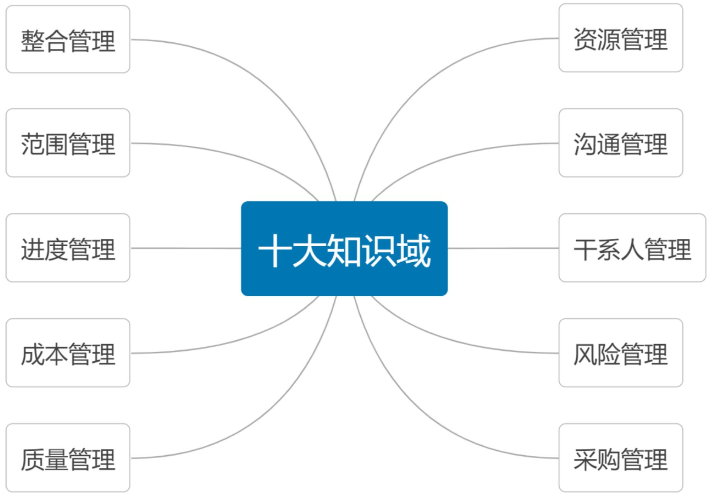
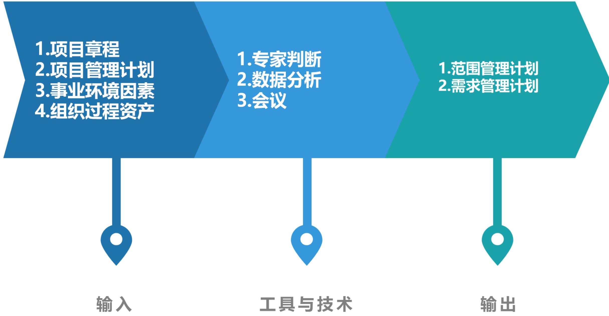
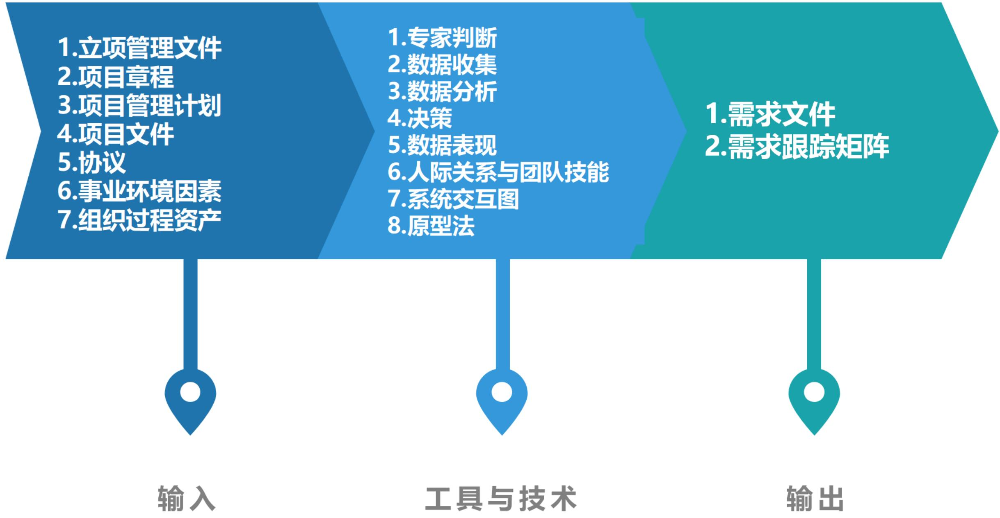
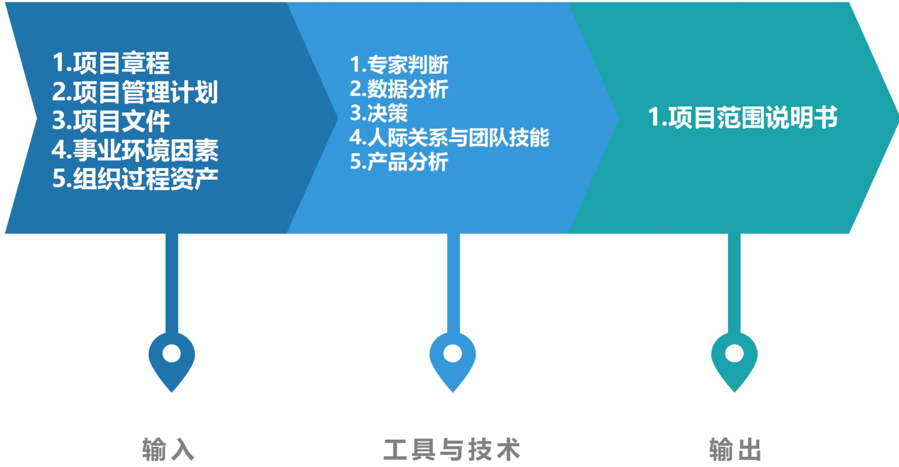
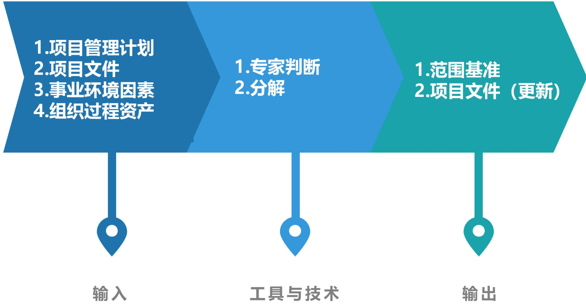
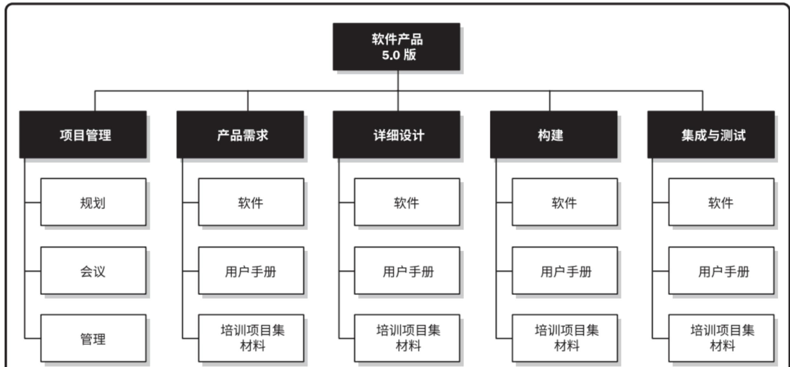
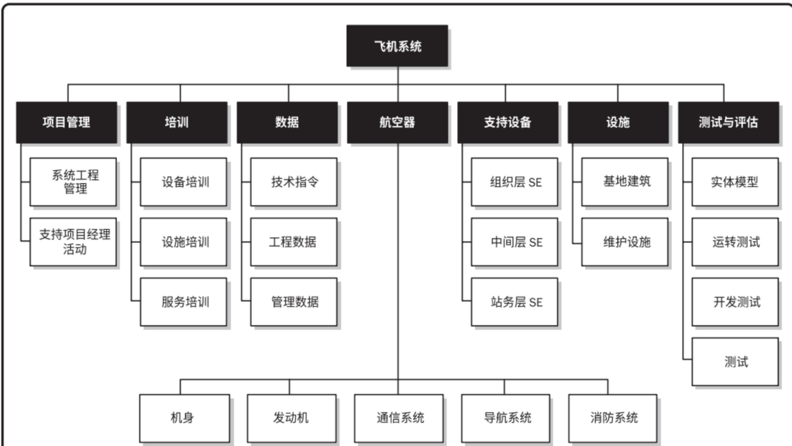
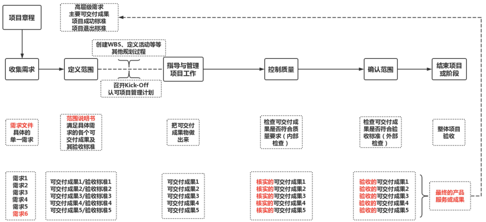
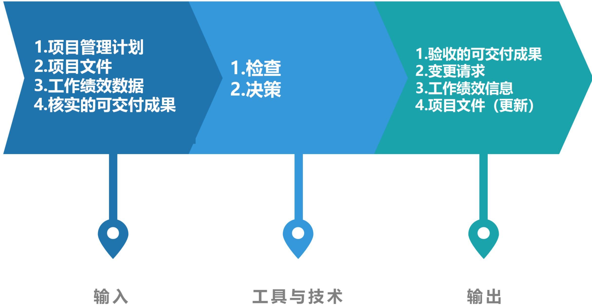
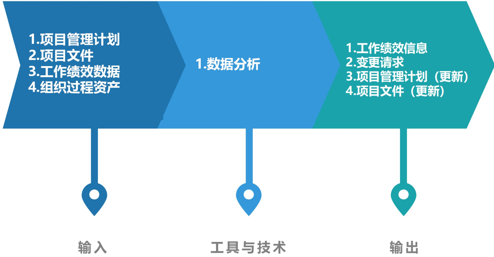

# 项目范围管理

# 信息系统项目管理师

# 本章学习建议

根据历年的考试情况来看，由于本章内容属于10大管理的内容，需求是龙头，是做项目管理的基础，没有需求就不能确定项目的范围，没有范围，项目就无从谈起，由此范围就显的由为重要。上午、案例分析、论文写作都会进行考查。项目范围管理一般上午考察3分。

# 本章考情分析

<table><tr><td>年份</td><td>上午选择题</td><td>案例分析题</td><td>论文写作</td><td>合计</td></tr><tr><td>2023年05月</td><td>3</td><td>0</td><td>0</td><td>3</td></tr><tr><td>2023年11月</td><td>机考3-4分左右</td><td>0</td><td>0</td><td>3-4</td></tr><tr><td>2024年05月</td><td>机考3分左右</td><td>11分(第2批)</td><td>0</td><td>3</td></tr></table>

# 十大知识领域(背诵)

# 范围管理ITO(掌握)

<table><tr><td colspan="5">范围管理</td></tr><tr><td>组</td><td>过程</td><td>输入</td><td>工具和技术</td><td>输出</td></tr><tr><td>规划</td><td>1.规划范围管理</td><td>1.项目章程2.项目管理计划 ·质量管理计划 ·项目生命周期描述 ·开发方法3.事业环境因素4.组织过程资产</td><td>1.专家判断2.数据分析 ·备选方案分析3.会议</td><td>1.范围管理计划2.需求管理计划</td></tr></table>

# 范围管理ITO(掌握)

<table><tr><td>组</td><td>过程</td><td>输入</td><td>工具和技术</td><td>输出</td></tr><tr><td>规划</td><td>2.收集需求</td><td>1.立项管理文件
•商业论证
2.项目章程
3.项目管理计划
•范围管理计划
•需求管理计划
•干系人参与计划
4.项目文件
•假设日志
•干系人登记册
•经验教训登记册
5.协议
6.事业环境因素
7.组织过程资产</td><td>1.专家判断
2.数据收集
•头脑风暴
•访谈
•焦点小组
•问卷调查
•标杆对照
3.数据分析
•文件分析
4.决策
•投票
•独裁型决策制定
•多标准决策分析
5.数据表现
•亲和图
•思维导图
6.人际关系与团队技能
•名义小组技术
•观察/交谈
•引导
7.系统交互图
8.原型法</td><td>1.需求文件
2.需求跟踪矩阵</td></tr></table>

# 范围管理ITO(掌握)

<table><tr><td>组</td><td>过程</td><td>输入</td><td>工具和技术</td><td>输出</td></tr><tr><td>规划</td><td>3.定义范围</td><td>1.项目章程2.项目管理计划·范围管理计划3.项目文件·假设日志·需求文件·风险登记册4.事业环境因素5.组织过程资产</td><td>1.专家判断2.数据分析·备选方案分析3.决策·多标准决策分析4.人际关系与团队技能·引导5.产品分析</td><td>1.项目范围说明书2.项目文件(更新)·假设日志·需求文件·需求跟踪矩阵·干系人登记册</td></tr></table>

# 范围管理ITO(掌握)

<table><tr><td>组</td><td>过程</td><td>输入</td><td>工具和技术</td><td>输出</td></tr><tr><td>规划</td><td>4.创建WBS</td><td>1.项目管理计划
·范围管理计划
2.项目文件
·需求文件
·项目范围说明书
3.事业环境因素
4.组织过程资产</td><td>1.专家判断
2.分解</td><td>1.范围基准
2.项目文件(更新)
·假设日志
·需求文件</td></tr></table>

# 范围管理ITO(掌握)

<table><tr><td>组</td><td>过程</td><td>输入</td><td>工具和技术</td><td>输出</td></tr><tr><td>监控</td><td>5.确认范围</td><td>1.项目管理计划·范围管理计划·需求管理计划·范围基准2.项目文件·需求文件·需求跟踪矩阵·质量报告·经验教训登记册3.工作绩效数据4.核实的可交付成果</td><td>1.检查2.决策·投票</td><td>1.验收的可交付成果2.变更请求3.工作绩效信息4.项目文件(更新)·需求文件·需求跟踪矩阵·经验教训登记册</td></tr></table>

# 范围管理ITO(掌握)

<table><tr><td>组</td><td>过程</td><td>输入</td><td>工具和技术</td><td>输出</td></tr><tr><td>监控</td><td>6.控制范围</td><td>1.项目管理计划
·范围管理计划
·需求管理计划
·变更管理计划
·配置管理计划
·范围基准
·绩效测量基准
2.项目文件
·需求文件
·需求跟踪矩阵
·经验教训登记册
3.工作绩效数据
4.组织过程资产</td><td>1.数据分析
·偏差分析
·趋势分析</td><td>1.工作绩效信息
2.变更请求
3.项目管理计划(更新)
·范围管理计划
·范围基准
·进度基准
·成本基准
·绩效测量基准
4.项目文件(更新)
·需求文件
·需求跟踪矩阵
·经验教训登记册</td></tr></table>

# 9.1 管理基础-9.1.1 产品范围与项目范围(掌握)

在项目环境中，“范围”这一术语有两种含义:

- 产品范围：指某项产品、服务或成果所具有的特征和功能。产品范围的完成情况是根据产品需求来衡量的。  
- 项目范围：包括产品范围，是为交付具有规定特性与功能的产品服务或成果而必须完成的工作。项目范围的完成情况是根据项目管理计划来衡量的。

项目范围

产品范围

# 9.1.2 管理新实践(了解)

需求一直是项目管理的关注重点，需求管理过程结束于需求关闭，即把产品、服务或成果移交给接收方，以便长期测量、监控、实现并维持收益。

商业分析师，该角色的职责还应包括需求管理相关的活动，项目经理则负责确保这些活动列入项目管理计划，并且在预算内按时完成，同时能够创造价值。

项目经理与商业分析师之间应该是伙伴式合作关系。

# 9.2.1 过程概述(背诵)

<table><tr><td>过程</td><td>过程定义</td><td>主要作用</td></tr><tr><td>1.规划范围管理</td><td>为了记录如何定义、确认和控制项目范围及产品范围，而创建范围管理计划的过程</td><td>在整个项目期间对如何管理范围提供指南和方向。
【仅开展一次或仅在项目的预定义点开展】</td></tr><tr><td>2.收集需求</td><td>为实现目标而确定，记录并管理干系人的需要和需求的过程</td><td>为定义产品范围和项目范围奠定基础。
【仅开展一次或仅在项目的预定义点开展】</td></tr><tr><td>3.定义范围</td><td>制定项目和产品详细描述的过程</td><td>描述产品、服务或成果的边界和验收标准
【整个项目期间多次反复开展】</td></tr><tr><td>4.创建WBS</td><td>把项目可交付成果和项目工作分解成较小、更易于管理的组件的过程</td><td>为所要交付的内容提供架构
【仅开展一次或仅在项目的预定义点开展】</td></tr><tr><td>5.确认范围</td><td>正式验收已完成的项目可交付成果的过程</td><td>①使验收过程具有客观性；②通过确认每个可交付成果来提高最终产品、服务或成果获得验收的可能性【整个项目期间定期开展】</td></tr><tr><td>6.控制范围</td><td>监督项目和产品的范围状态，管理范围基准变更的过程</td><td>在整个项目期间保持对范围基准的维护
【在整个项目期间开展】</td></tr></table>

# 5大过程组与范围管理(掌握)

<table><tr><td>10大管理</td><td>启动过程组</td><td>规划过程组</td><td>执行过程组</td><td>监控过程组</td><td>收尾过程组</td></tr><tr><td rowspan="4">项目范围管理</td><td></td><td>①规划范围管理</td><td></td><td rowspan="2">⑤确认范围</td><td></td></tr><tr><td></td><td>②收集需求</td><td></td><td></td></tr><tr><td></td><td>③定义范围</td><td></td><td rowspan="2">⑥控制范围</td><td></td></tr><tr><td></td><td>④创建WBS</td><td></td><td></td></tr></table>

# 9.2.2 裁剪考虑因素(了解)

# 裁剪考虑:

知识和需求管理  
$\bullet$  确认和控制  
$\bullet$  开发方法  
$\bullet$  需求的稳定性  
$\bullet$  治理

# 9.2.3 敏捷与适应方法(了解)

敏捷或适应型方法特意在项目早期缩短定义和协商范围的时间，为后续细化范围、明确范围争取更多的时间。在许多情况下，不断涌现的需求往往导致真实的业务需求与最初所述的业务需求之间存在差异。因此，敏捷方法有目的地构建和审查原型，并通过多次发布版本来明确需求，范围会在整个项目期间被定义和再定义。

采用敏捷或适应型生命周期，旨在应对大量变更，需要干系人持续参与项目。因此，应将适应型项目的整体范围分解为一系列拟实现的需求和拟执行的工作(有时称为产品未完成项)，通过多次迭代来并发可交付成果，并在每次迭代开始时定义和批准详细的范围。在一个迭代开始时，团队将努力确定产品未完成项中，哪些优先级高的未完成项需要在下一次迭代中交付。在每次迭代中，都会重复开展三个过程:①收集需求;②定义范围;③创建WBS。

在适应型或敏捷型生命周期中，发起人和客户代表应该持续参与项目，并对迭代交付的可交付成果提供反馈意见，确保产品未完成项真实地反映了他们的当前需求。在每次迭代中，都会重复开展两个过程：①确认范围；②控制范围。

# 9.3 规划范围管理(掌握)

规划范围管理是为了记录如何定义、确认和控制项目范围及产品范围，而创建范围管理计划的过程。本过程的主要作用是在整个项目期间对如何管理范围提供指南和方向。本过程仅开展一次或仅在项目的预定义点开展。

# 规划范围管理的ITO(掌握)

# 9.3.1 输入(了解)

1. 项目章程  
2.项目管理计划  
3. 事业环境因素  
4.组织过程资产

# 9.3.2 工具与技术(掌握)

# 1. 专家判断

# 3.会议

2. 数据分析：适用于本过程的数据分析技术是备选方案分析。备选方案分析技术用于评估、收集需求，详述项目和产品范围，创造产品，确认范围和控制范围的各种方法。

# 9.3.3 输出(掌握)

# 1.范围管理计划

范围管理计划是项目管理计划的组成部分，描述将如何定义、制定、监督、控制和确认项目范围。包括：①制定项目范围说明书；②根据详细项目范围说明书创建WBS；③确定如何审批和维护范围基准；④正式验收已完成的项目可交付成果。【可以是正式或非正式的，非常详细或高度概括的】

# 2.需求管理计划

需求管理计划是项目管理计划的组成部分，描述如何分析、记录和管理需求。包括：①如何规划、跟踪和报告各种需求活动；②配置管理活动，例如，如何启动变更，如何分析其影响，如何进行追溯、跟踪和报告，以及变更审批权限；③需求优先级排序过程；④测量指标及使用这些指标的理由；⑤反映哪些需求属性将被列入跟踪矩阵等。

# 9.4 收集需求(掌握)

收集需求是为实现目标而确定，记录并管理干系人的需要和需求的过程。本过程的主要作用是为定义产品范围和项目范围奠定基础。本过程仅开展一次或仅在项目的预定义点开展。

# 收集需求的ITO(掌握)

# 9.4.1 输入(了解)

1.立项管理文件  
2. 项目章程  
3.项目管理计划  
4.项目文件  
5.协议  
6.事业环境因素  
7.组织过程资产

# 9.4.2 工具与技术(掌握)

# 1. 专家判断

# 2.数据收集

<table><tr><td>●头脑风暴：一种用来产生和收集对项目需求与产品需求的多种创意的技术。</td></tr><tr><td>●访谈：获取信息的正式或非正式的方法；可以“一对一”或“多对多”。访谈有经验的项目参与者、发起人和其他高管及主题专家，有助于识别和定义所需产品可交付成果的特征和功能。访谈也可用于获取机密信息。</td></tr><tr><td>●焦点小组：召集预定的干系人和主题专家，了解他们对所讨论的产品、服务或成果的期望和态度。由一位受过训练的主持人引导大家进行互动式讨论。焦点小组往往比“一对一”的访谈更热烈。</td></tr><tr><td>●问卷调查：设计一系列书面问题，向众多受访者快速收集信息。非常适用于受众多样化，需要快速完成调查，受访者地理位置分散并且适合开展统计分析的情况。</td></tr><tr><td>●标杆对照：将实际或计划的产品、过程和实践，与其他可比组织的实践进行比较，以便识别最佳实践，形成改进意见，并为绩效考核提供依据。标杆对照所采用的可比组织可以是内部的，也可以是外部的</td></tr></table>

# 9.4.2 工具与技术(掌握)

3.数据分析：文件分析指审核和评估任何相关的文件信息。  
4.决策

- 投票：一种为达成某种期望结果，而对未来多个行动方案进行评估的决策技术和过程。用于生成、归类和排序产品需求。  
- 独裁型决策制定：由一个人负责为整个集体制定决策。  
- 多标准决策分析：借助决策矩阵，用系统分析方法建立诸如风险水平、不确定性和价值收益等多种标准，以对众多创意进行评估和排序。

# 9.4.2 工具与技术(掌握)

# 5.数据表现

- 亲和图：用来对大量创意进行分组的技术，以便进一步审查和分析  
- 思维导图：把从头脑风暴中获得的创意整合成一张图，用以反映创意之间的共性与差异，激发新创意。

# 9.4.2 工具与技术(掌握)

# 6.人际关系与团队技能

- 名义小组技术：用于促进头脑风暴的一种技术，通过投票排列最有用的创意，以便进一步开展头脑风暴或优先排序。  
- 观察和交谈：直接察看个人在各自的环境中如何执行工作（或任务）和实施流程，当产品使用者难以或不愿清晰说明他们的需求时，特别需要通过观察来了解他们的工作细节。观察也称为“工作跟随”，通常由旁站观察者观察业务专家如何执行工作，但也可以由“参与观察者”来观察，通过实际执行一个流程或程序，来体验该流程或程序是如何实施的，以便挖掘隐藏的需求。  
- 引导：引导与主题研讨会结合使用，把主要干系人召集在一起定义产品需求。研讨会可用于快速定义跨职能需求并协调干系人的需求差异。

# 9.4.2 工具与技术(掌握)

7. 系统交互图：是对产品范围的可视化描绘可以直观显示业务系统（过程、设备、计算机系统等）及其与人和其他系统（行动者）之间的交互方式。  
8. 原型法：原型法是指在实际制造预期产品之前，先造出该产品的模型，并据此征求对需求的早期反馈。原型包括微缩产品、计算机生成的二维和三维模型、实体模型或模拟。原型法支持渐进明细的理念。故事板是一种原型技术，通过一系列的图像或图示来展示顺序或导航路径。

# 1.需求文件

需求文件描述各种单一需求将如何满足项目相关的业务需求。一开始可能只有高层级的需求，然后随着有关需求信息的增加而逐步细化。

只有明确的（可测量和可测试的）、可跟踪的、完整的、相互协调的，且主要干系人愿意认可的需求，才能作为基准。

需求文件的格式多种多样，既可以是一份按干系人和优先级分类列出全部需求的简单文件，也可以是一份包括内容提要、细节描述和附件等的详细文件。

# 9.4.3 输出(掌握)

需求的类别一般包括:

(1) 业务需求：整个组织的高层级需要，例如，解决业务问题或抓住业务机会，以及实施项目的原因。  
(2) 干系人需求: 干系人的需要。  
(3) 解决方案需求：为满足业务需求和干系人需求，产品、服务或成果必须具备的特性、功能和特征。解决方案需求又进一步分为功能需求和非功能需求：①功能需求：描述产品应具备的功能，例如，产品应该执行的行动、流程、数据和交互；②非功能需求：是对功能需求的补充，是产品正常运行所需的环境条件或质量要求，例如，可靠性、保密性、性能、安全性、服务水平、可支持性、保留或清除等。  
(4) 过渡和就绪需求：如数据转换和培训需求。这些需求描述了从“当前状态”过渡到“将来状态”所需的临时能力。  
(5) 项目需求：项目需要满足的行动、过程或其他条件，例如里程碑日期、合同责任、制约因素等。  
(6) 质量需求：用于确认项目可交付成果的成功完成或其他项目需求的实现的任何条件或标准，例如，测试、认证、确认等。

# 2.需求跟踪矩阵

需求跟踪矩阵是把产品需求从其来源连接到能满足需求的可交付成果的一种表格。使用需求跟踪矩阵，把每个需求与业务目标或项目目标联系起来，有助于确保每个需求都具有业务价值。需求跟踪矩阵提供了在整个项目生命周期中跟踪需求的一种方法，有助于确保需求文件中被批准的每项需求在项目结束的时候都能实现并交付。

跟踪需求的内容包括:

(1)业务需要、机会、目的和目标;  
(2)项目目标;  
(3)项目范围和WBS可交付成果;  
(4)产品设计;  
(5)产品开发;  
(6)测试策略和测试场景;  
(7) 高层级需求到详细需求等。

# 需求跟踪矩阵(掌握)

<table><tr><td colspan="9">需求跟踪矩阵</td></tr><tr><td colspan="2">项目名称:</td><td colspan="7"></td></tr><tr><td colspan="2">成本中心:</td><td colspan="7"></td></tr><tr><td colspan="2">项目描述:</td><td colspan="7"></td></tr><tr><td>标识</td><td>关联标识</td><td>需求描述</td><td>业务需要、机会、目的和目标</td><td>项目目标</td><td>WBS可交付成果</td><td>产品设计</td><td>产品开发</td><td>测试案例</td></tr><tr><td rowspan="4">001</td><td>1.0</td><td></td><td></td><td></td><td></td><td></td><td></td><td></td></tr><tr><td>1.1</td><td></td><td></td><td></td><td></td><td></td><td></td><td></td></tr><tr><td>1.2</td><td></td><td></td><td></td><td></td><td></td><td></td><td></td></tr><tr><td>1.2.1</td><td></td><td></td><td></td><td></td><td></td><td></td><td></td></tr><tr><td rowspan="3">002</td><td>2.0</td><td></td><td></td><td></td><td></td><td></td><td></td><td></td></tr><tr><td>2.1</td><td></td><td></td><td></td><td></td><td></td><td></td><td></td></tr><tr><td>2.1.1</td><td></td><td></td><td></td><td></td><td></td><td></td><td></td></tr><tr><td rowspan="3">003</td><td>3.0</td><td></td><td></td><td></td><td></td><td></td><td></td><td></td></tr><tr><td>3.1</td><td></td><td></td><td></td><td></td><td></td><td></td><td></td></tr><tr><td>3.2</td><td></td><td></td><td></td><td></td><td></td><td></td><td></td></tr><tr><td>004</td><td>4.0</td><td></td><td></td><td></td><td></td><td></td><td></td><td></td></tr><tr><td>005</td><td>5.0</td><td></td><td></td><td></td><td></td><td></td><td></td><td></td></tr></table>

# 需求跟踪矩阵(掌握)

<table><tr><td colspan="9">需求跟踪矩阵</td></tr><tr><td colspan="2">项目名称:</td><td colspan="7">娱乐健康内联网项目</td></tr><tr><td colspan="2">成本中心:</td><td colspan="7">娱乐健康内联网的维护运营</td></tr><tr><td colspan="2">项目描述:</td><td colspan="7">在现有的网络上再提供一个帮助公司员工改善其健康状况的应用程序</td></tr><tr><td>标识</td><td>关联标识</td><td>需求描述</td><td>业务需要、机会、目的和目标</td><td>项目目标</td><td>WBS可交付成果</td><td>产品设计</td><td>产品开发</td><td>测试案例</td></tr><tr><td rowspan="2">001</td><td>1.0</td><td>公司员工可以参加公司举办的娱乐健康项目</td><td>让公司员工能够参与娱乐健康项目改善健康</td><td>提高公司员工健康状况</td><td>员工参加娱乐健康项目选项</td><td>公司员工可以选择参加健康娱乐项目</td><td>前端和后端开发</td><td>公司员工点击参加健康娱乐项目</td></tr><tr><td>1.1</td><td>公司能发布娱乐健康项目</td><td>让公司员工能够参与娱乐健康项目改善健康</td><td>提高公司员工健康状况</td><td>公司举办娱乐健康项目列表</td><td>公司员工可以查询健康娱乐项目列表</td><td>前端和后端开发</td><td>使用足球、垒球、保龄球、慢跑、行走及其他运动作为文娱节目列表进行测试</td></tr><tr><td rowspan="2">002</td><td>2.0</td><td>公司员工可以参加公司举办的训练班和项目</td><td>帮助公司员工控制体重、释放压力和处理其他健康问题</td><td>提高公司员工健康状况</td><td>员工参加训练班项目选项</td><td>公司员工可以选择参加训练班项目</td><td>前端和后端开发</td><td>公司员工点击参加训练班项目</td></tr><tr><td>2.1</td><td>公司能发布训练班和项目</td><td>帮助公司员工控制体重、释放压力和处理其他健康问题</td><td>提高公司员工健康状况</td><td>公司举办训练班项目列表</td><td>公司员工可以查询训练班项目列表</td><td>前端和后端开发</td><td>使用瑜伽班、减脂班、增肌班、拳击班作为训练班列表进行测试</td></tr></table>

# 9.5 定义范围(掌握)

应根据项目启动过程中记载的主要可交付成果、假设条件和制约因素来编制详细的项目范围说明书。在项目规划过程中，随着对项目信息了解的逐渐深入，应该更加详细、具体地定义和描述项目范围。

# 9.5.1 输入(了解)

1. 项目章程  
2.项目管理计划  
3.项目文件  
4.事业环境因素  
5.组织过程资产

# 9.5.2 工具与技术(掌握)

1. 专家判断  
2.数据分析：备选方案分析  
3.决策：多标准决策分析  
4.人际关系与团队技能：典型示例是引导  
5.产品分析：可用于定义产品和服务，包括针对产品或服务提问并回答，以描述要交付产品的用途、特征及其他方面。用以把高层级的产品或服务描述转变为有意义的可交付成果。产品分析技术主要包括：产品分解、需求分析、系统分析、系统工程、价值分析、价值工程等。

# 1.项目范围说明书

项目范围说明书是对项目范围、主要可交付成果、假设条件和制约因素的描述。它记录了整个范围，包括：项目和产品范围；详细描述了项目的可交付成果；代表项目干系人之间就项目范围所达成的共识。为便于管理干系人的期望，项目范围说明书可明确指出哪些工作不属于本项目范围。

详细的项目范围说明书内容有:

- 产品范围描述：逐步细化在项目章程和需求文件中所述的产品、服务或成果特征。  
- 可交付成果：为完成某一过程、阶段或项目而必须产出的任何独特并可核实的产品、成果或服务能力，可交付成果也包括各种辅助成果，如项目管理报告和文件。  
- 验收标准：可交付成果通过验收前必须满足的一系列条件。  
- 项目的除外责任：识别排除在项目之外的内容。明确说明哪些内容不属于项目范围，有助于管理干系人的期望及减少范围蔓延。

# 9.6 创建WBS(掌握)

WBS组织并定义了项目的总范围，代表着经批准的当前项目范围说明书中所规定的工作。

WBS最低层的组成部分称为工作包，其中包括计划的工作。工作包对相关活动进行归类，以便对工作安排进度，进行估算，开展监督与控制。在“工作分解结构”这个词语中，“工作”是指作为活动结果的工作产品或可交付成果，而不是活动本身。

# 9.6.1 输入(了解)

1.项目管理计划  
2.项目文件  
3.事业环境因素  
4.组织过程资产

# 9.6.2 工具与技术(掌握)

# 1. 专家判断

# 2.分解

分解是一种把项目范围和项目可交付成果逐步划分为更小、更便于管理的组成部分的技术。工作包是WBS最低层的工作，可对其成本和持续时间进行估算和管理。

创建WBS的常用的方法包括自上而下的方法、使用组织特定的指南和使用WBS模板。

项目工作分解为工作包，通常需要开展如下活动：

(1)识别和分析可交付成果及相关工作;  
(2) 确定WBS的结构和编排方法;  
(3)自上而下逐层细化分解;  
(4)为WBS组成部分制定和分配标识编码;  
(5)核实可交付成果分解的程度是否恰当。

# 9.6.2 工具与技术(掌握)

WBS的结构可以采用多种形式:

- 以项目生命周期的各阶段作为分解的第二层，把产品和项目可交付成果放在第三层。  
- 以主要可交付成果作为分解的第二层。  
- 纳入由项目团队以外的组织开发的各种较低层次组件（如外包工作）。随后，作为外包工作的一部分，卖方须制定相应的合同WBS。

  
WBS仅为了说明之用。它无意代表任何特定项目的整体项目范围，也不意味着这是对此类项目组织工作分解结构的唯一方法。

  
WBS仅为了说明之用。它无意代表任何特定项目的整体项目范围，也不意味着这是对此类项目组织工作分解结构的唯一方法。

# WBS的结构(掌握)

WBS可以采用提纲式、组织结构图或能说明层级结构的其他形式。【表格方式：提纲式，树型方式：组织结构图】

要在未来远期才完成的可交付成果或组件，当前可能无法分解。项目管理团队因而通常需要等待对该可交付成果或组成部分达成一致意见，才能够制定出WBS中的相应细节。这种技术又称为滚动式规划。

# WBS注意事项(掌握)

在分解的过程中，应该注意以下8个方面：

(1) WBS必须是面向可交付成果的。  
(2) WBS必须符合项目的范围: WBS必须包括也仅包括为了完成项目的可交付成果的活动。100%原则（包含原则）认为，在WBS中，所有下一级的元素之和必须100%代表上一级的元素。  
(3) WBS的底层应该支持计划和控制: WBS是项目管理计划和项目范围之间的桥梁, WBS的底层不但要支持项目管理计划, 而且要让管理层能够监视和控制项目的进度和预算。  
(4) WBS中的元素必须有人负责, 而且只有一个人负责。  
(5) WBS应控制在  $4 \sim 6$  层: 如果项目规模比较大, 以至于WBS要超过6层, 此时, 可以使用项目分解结构将大项目分解成子项目。一个工作单元只能从属于某个上层单元, 避免交叉从属。  
(6) WBS应包括项目管理工作，也要包括分包出去的工作。  
(7) WBS的编制需要所有（主要）项目干系人的参与。  
(8) WBS并非是一成不变的: 完成了WBS之后的工作中, 仍然有可能需要WBS进行修改。

# 9.6.3 输出(掌握)

1. 范围基准：是经过批准的范围说明书、WBS和相应的WBS词典，只有通过正式的变更控制程序才能进行变更，它被用作比较的基础。范围基准是项目管理计划的组成部分。

(1) 项目范围说明书  
(2) WBS: 全部工作范围的层级分解。工作分解结构每向下分解一层, 代表对项目工作更详细的定义。  
(3) 工作包: WBS的最低层是带有独特标识号的工作包。这些标识号为成本、进度和资源信息的逐层汇总提供了层级结构, 即账户编码。  
(4) 规划包: 规划包是一种低于控制账户而高于工作包的工作分解结构组件, 工作内容已知, 但详细的进度活动未知, 一个控制账户可以包含一个或多个规划包。  
(5) WBS字典: WBS字典是针对WBS中的每个组件, 详细描述可交付成果、活动和进度信息的文件。

WBS字典中的内容一般包括：账户编码标识、工作描述、假设条件和制约因素、负责的组织、进度里程碑、相关的进度活动、所需资源、成本估算、质量要求、验收标准、技术参考文献、协议信息等。

# 2.项目文件（更新）

# 9.7 确认范围(掌握)

确认范围应该贯穿项目的始终。

确认范围的步骤包括:

(1) 确定需要进行范围确认的时间;  
(2)识别范围确认需要哪些投入;  
(3) 确定范围正式被接受的标准和要素;  
(4)确定范围确认会议的组织步骤;  
(5)组织范围确认会议。

确认范围过程与控制质量过程的不同之处在于，前者关注可交付成果的验收，而后者关注可交付成果的正确性及是否满足质量要求。控制质量过程通常先于确认范围过程，但二者也可同时进行。

# 9.7 确认范围(掌握)

项目干系人进行范围确认时，一般需要检查以下6个方面的问题：

(1) 可交付成果是否是确定的、可确认的。  
(2) 每个可交付成果是否有明确的里程碑，里程碑是否有明确的、可辨别的事件，例如，客户的书面认可等。  
(3) 是否有明确的质量标准  
(4) 审核和承诺是否有清晰的表达  
(5) 项目范围是否覆盖了需要完成的产品或服务的所有活动，有没有遗漏或错误。  
(6) 项目范围的风险是否太高：管理层是否能够降低风险发生时对项目的影响。

# 9.7 确认范围(掌握)

# 干系人关注点的不同

- 管理层关注项目范围：是指范围对项目的进度、资金和资源的影响，这些因素是否超过了组织承受范围，是否在投入产出上具有合理性  
- 客户关注产品范围：关心项目的可交付成果是否足够完成产品或服务；在项目中，客户往往有在当前版本中加入所有功能和特征的意愿，这对于项目来说是一种潜在的风险，会给组织和客户带来危害和损失。  
- 项目管理人员主要关注项目制约因素：关心项目可交付成果是否足够和必须完成，时间、资金和资源是否足够，主要的潜在风险和预备解决的方法。  
- 项目团队人员主要关注项目范围中自己参与的元素和负责的元素：通过定义范围中的时间检查自己的工作时间是否足够，自己在项目范围中是否有多项工作。

# 9.7 确认范围(掌握)

# 确认范围的ITO(掌握)

# 1.项目管理计划

# 2.项目文件

- 需求文件：将需求与实际结果比较，以决定是否有必要进行变更，采取纠正措施或预防措施。  
- 需求跟踪矩阵：含有与需求相关的信息，包括如何确认需求。  
- 质量报告：该报告内容可包括由团队管理或需上报的全部质量保证事项、改进建议，以及在控制质量过程中发现的情况的概述。在验收产品之前，需要查看所有这些内容。  
- 经验教训登记册：在项目早期获得的经验教训可以运用到后期阶段，以提高验收可交付成果的效率与效果。

# 3.工作绩效数据

# 4.核实的可交付成果

# 9.7.2 工具与技术(掌握)

1. 检查：指开展测量、审查与确认等活动，来判断工作和可交付成果是否符合需求和产品验收标准。

检查有时也被称为审查、产品审查和巡检等。

2.决策：投票，当由项目团队和其他干系人进行验收时，使用投票来形成结论。

# 9.7.3 输出(掌握)

1. 验收的可交付成果：符合验收标准的可交付成果应该由客户或发起人正式签字批准。应该从客户或发起人那里获得正式文件，证明干系人对项目可交付成果的正式验收。  
2. 变更请求  
3.工作绩效信息  
4.项目文件 (更新)

# 9.8 控制范围(掌握)

确保所有变更请求、推荐的纠正措施或预防措施都通过实施整体变更控制过程进行处理。在变更实际发生时，也需要采用控制范围过程来管理这些变更。控制范围过程应该与其他项目管理知识领域的控制过程协调开展。未经控制的产品或项目范围的扩大（未对时间、成本和资源做相应调整）被称为范围蔓延。

# 控制范围的ITO(掌握)

# 9.8.1 输入(了解)

1.项目管理计划  
2.项目文件  
3.工作绩效数据  
4.组织过程资产

# 9.8.2 工具与技术(掌握)

# 1.数据分析

- 偏差分析：用于将基准与实际结果进行比较，以确定偏差是否处于临界值区间内或是否有必要采取纠正或预防措施。  
趋势分析：旨在审查项目绩效随时间的变化情况，以判断绩效是正在改善还是正在恶化。

# 9.8.3 输出(了解)

1. 工作绩效信息  
2.变更请求  
3.项目管理计划 (更新)  
4.项目文件 (更新)

# 本章练习

(1) 在（）生命周期中，项目开始时就对项目可交付成果进行定义，对任何范围变化都要进行变更管理。

A.预测型

B.适应型

C. 敏捷型

D. 迭代型

【答案】A

(2) (1) 不是规划范围管理过程的输入。

A. 项目章程

B.项目管理计划

C.质量管理计划

D.需求管理计划

【答案】D

# 本章练习

(3) 关于需求的理解, 不正确的是 ( )。

A.让干系人积极参与需求的探索和分解工作，并仔细确定、记录和管理对产品、服务或成果的需求，能直接促进项目成功  
B.为更好地对项目进行了解，收集需求的过程应在整个项目期间定期开展  
C.需求是指根据特定协议或其他强制性规范，产品、服务或成果必须具备的条件或能力  
D.需求包括发起人、客户和其他干系人的已量化且书面记录的需要和期望

【答案】B

(4) 数据收集技术中, ( ) 将实际或计划的产品、过程和实践, 与其他可比组织的实践进行比较, 以便识别最佳实践, 形成改进意见, 并为绩效考核提供依据。

A.头脑风暴

B.焦点小组

C.亲和图

D.标杆对照

【答案】D

# 本章练习

(5) ( ) 是把产品需求从其来源连接到能满足需求的可交付成果的一种表格。

A.系统交互图 B.决策矩阵 C.需求跟踪矩阵 D.UC矩阵【答案】C  
(6) 应根据 ( ) 来编制详细的项目范围说明书。①可交付成果 ②假设条件 ③制约因素 ④WBS A.①②③ B.①②④ C.①③④ D.②③④ 【答案】A

# 本章练习

(7) 关于项目范围说明书的理解, 不正确的是 ( )。

A.项目范围说明书可明确指出哪些工作不属于本项目范围  
B.项目范围说明书使项目团队能进行更详细的规划，并为评价变更请求或额外工作是否超过项目边界提供基准  
C.项目范围说明书描述要做和不要做的工作的详细程度，决定着项目管理团队控制整个项目范围的有效程度  
D.项目范围说明书不能代表项目干系人之间就项目范围所达成的共识

【答案】D

(8) 范围基准包括 ( )。

(1)经过批准的范围说明书 (2)项目章程 (3)WBS词典 (4)WBS (5)项目管理计划

A.①②⑤

B.①②④

C.①③④

D.①④⑤

【答案】C

# 历年真题练习

【2023年上半年-第27题】

(1) 用于确认项目可交付成果的成功完成。

A.业务需求

B.解决方案需求

C.质量需求

D. 过渡与就绪需求

【答案】C

# 历年真题练习

# 【2023年上半年-第28题】

关于确认范围的描述，不正确的是：（）。

A.确认范围的作用之一是确保验收过程具有客观性  
B.确认范围过程通常先于控制质量过程，二者也可同时进行  
C.在确认范围时，要检查可交付成果是否有明确的质量标准  
D.管理层、客户、项目经理人员在确认范围时的关注点有所不同

【答案】B

# 历年真题练习

# 【2023年上半年-第29题】

关于WBS的描述，正确的是：（）。

A.WBS中的各项工作为可交付成果提供服务  
B.WBS的内容一般会超出完成可交付成果的活动范围  
C.WBS中的元素可以由一人或多人负责  
D.WBS应包括分包的工作，但不包括管理工作

【答案】A

# 历年真题练习

【2023年下半年-第1批次自编】

(1) 不属于范围管理的过程。

A.规划范围管理

B.收集需求

C.定义范围

D.控制资源

【答案】D

# 历年真题练习

# 【2024年上半年-第1批次】

关于范围管理的描述，正确的是（）。

A.规划范围管理的作用是在整个项目期间对如何管理范围提供指南和方向  
B.定义范围管理是为了记录如何定义、确认和控制项目范围及产品范围，而创建范围管理计划的过程  
C.范围管理计划包含配置管理活动和需求优先级排序过程  
D.范围管理计划是非常详细的正式的计划

【答案】A

# Thank You!

微信公众号：野人老师 淘宝店铺：yeren.taobao.com