# 项目进度管理

# 信息系统项目管理师

# 本章学习建议

根据历年的考试情况来看，上午、案例分析、论文写作都会进行考查。项目进度管理一般上午考察3分，非常重要，上午必考网络图之类的，下午必考计算题的，必须熟练掌握；此部分需要记忆的不是很多，重在理解，这部分题目应该是送分题。

# 本章考情分析

<table><tr><td>年份</td><td>上午选择题</td><td>案例分析题</td><td>论文写作</td><td>合计</td></tr><tr><td>2023年05月</td><td>4</td><td>15</td><td>0</td><td>19</td></tr><tr><td>2023年11月</td><td>机考3-4分左右</td><td>15分(第1批)10分(第2批)10分(第3批)</td><td>0</td><td>每个批次15分左右</td></tr><tr><td>2024年05月</td><td>机考3-4分左右</td><td>25分(第1批)</td><td>75(第1批)</td><td>103</td></tr></table>

# 十大知识领域(背诵)

# 进度管理ITO(掌握)

<table><tr><td colspan="5">进度管理</td></tr><tr><td>组</td><td>过程</td><td>输入</td><td>工具和技术</td><td>输出</td></tr><tr><td>规划</td><td>1.规划进度管理</td><td>1.项目章程2.项目管理计划·范围管理计划·开发方法3.事业环境因素4.组织过程资产</td><td>1.专家判断2.数据分析·备选方案分析3.会议</td><td>1.进度管理计划</td></tr></table>

# 进度管理ITO(掌握)

<table><tr><td>组</td><td>过程</td><td>输入</td><td>工具和技术</td><td>输出</td></tr><tr><td>规划</td><td>2.定义活动</td><td>1.项目管理计划
•进度管理计划
•范围基准
2.事业环境因素
3.组织过程资产</td><td>1.专家判断
2.分解
3.滚动式规划
4.会议</td><td>1.活动清单
2.活动属性
3.里程碑清单
4.变更请求
5.项目管理计划
(更新)
•进度基准
•成本基准</td></tr></table>

# 进度管理ITO(掌握)

<table><tr><td>组</td><td>过程</td><td>输入</td><td>工具和技术</td><td>输出</td></tr><tr><td>规划</td><td>3.排列活动顺序</td><td>1.项目管理计划
·进度管理计划
·范围基准
2.项目文件
·假设日志
·活动属性
·活动清单
·里程碑清单
3.事业环境因素
4.组织过程资产</td><td>1.紧前关系绘图法
2.箭线图法
3.确定和整合依赖关系
4.提前量和滞后量
5.项目管理信息系统</td><td>1.项目进度网络图
2.项目文件(更新)
·活动属性
·活动清单
·假设日志
·里程碑清单</td></tr></table>

# 进度管理ITO(掌握)

<table><tr><td>组</td><td>过程</td><td>输入</td><td>工具和技术</td><td>输出</td></tr><tr><td>规划</td><td>4.估算活动持续时间</td><td>1.项目管理计划
•进度管理计划
•范围基准
2.项目文件
•假设日志
•风险登记册
•活动属性
•活动清单
•里程碑清单
•经验教训登记册
•资源需求
•资源分解结构
•资源日历
•项目团队派工单
3.事业环境因素
4.组织过程资产</td><td>1.专家判断
2.类比估算
3.参数估算
4.三点估算
5.自下而上估算
6.数据分析
•备选方案分析
•储备分析
7.决策
8.会议</td><td>1.持续时间估算
2.估算依据
3.项目文件(更新)
•活动属性
•假设日志
•经验教训登记册</td></tr></table>

# 进度管理ITO(掌握)

<table><tr><td>组</td><td>过程</td><td>输入</td><td>工具和技术</td><td>输出</td></tr><tr><td>规划</td><td>5.制定进度计划</td><td>1.项目管理计划
·进度管理计划
·范围基准
2.项目文件
·假设日志
·风险登记册
·活动属性
·活动清单
·里程碑清单
·项目进度网络图
·估算依据
·持续时间估算
·经验教训
·资源需求
·项目团队派工单
·资源日历
3.协议
4.事业环境因素
5.组织过程资产</td><td>1.进度网络分析
2.关键路径法
3.资源优化
4.数据分析
·假设情景分析
·模拟
5.提前量和滞后量
6.进度压缩
7.计划评审技术
8.项目管理信息系统
9.敏捷或适应型发布规划</td><td>1.进度基准
2项目进度计划
3.进度数据
4.项目日历
5.变更请求
6.项目管理计划(更新)
·进度管理计划
·成本基准
7.项目文件(更新)
·活动属性
·假设日志
·持续时间估算
·经验教训登记册
·资源需求
·风险登记册</td></tr></table>

# 进度管理ITO(掌握)

<table><tr><td>组</td><td>过程</td><td>输入</td><td>工具和技术</td><td>输出</td></tr><tr><td>监控</td><td>6.控制进度</td><td>1.项目管理计划
•进度管理计划
•进度基准
•范围基准
•绩效测量基准
2.项目文件
•资源日历
•项目进度计划
•项目日历
•进度数据
•经验教训登记册
3.工作绩效数据
4.组织过程资产</td><td>1.数据分析
•挣值分析
•迭代燃尽图
•绩效审查
•趋势分析
•偏差分析
•假设情景分析
2.关键路径法
3.项目管理信息系统
4.资源优化
5.提前量和滞后量
6.进度压缩</td><td>1.工作绩效信息
2.进度预测
3.变更请求
4.项目管理计划(更新)
•进度管理计划
•进度基准
•成本基准
•绩效测量基准
5.项目文件(更新)
•假设日志
•估算依据
•经验教训登记册
•项目进度计划
•资源日历
•进度数据
•风险登记册</td></tr></table>

# 10.1 管理基础(掌握)

小型项目中，定义活动、排列活动顺序、估算活动持续时间及制定进度模型形成进度计划等过程的联系非常密切，可以视为一个过程，可以由一个人在较短时间内完成。

# 10.1.1 项目进度计划的定义和总要求(了解)

项目进度计划是一种用于沟通和管理干系人期望的工具，为绩效报告提供依据。

编制进度计划一般步骤：首先选择进度计划方法，例如关键路径法；然后将项目特定数据，如活动、计划日期、持续时间、资源、依赖关系和制约因素等输入进度计划编制工具，创建项目进度模型；最后根据进度模型形成项目进度计划。

应在整个项目期间保持项目进度计划的灵活性，并根据知识、风险理解程度和增值活动等情况的改变对其进行调整。

# 10.1.2 管理新实践(了解)

有关项目进度计划方法的新趋势和新兴实践主要包括：

- 具有未完成项的迭代型进度计划：适应型生命周期的滚动式规划进度计划的方法，它允许在整个开发生命周期期间进行变更。这种方法将需求记录在用户故事中，然后在建造之前按优先级排序并优化用户故事，最后在规定的时间内开发产品功能。通常用于向客户交付增量价值，或多个团队并行开发大量的、内部关联的、较小的功能。

- 按需进行的进度计划：不依赖于预先定义好的进度计划，而是在资源可用时立即从未完成项和工作序列中提取工作任务，该方法适用于具有如下特征的项目：

(1)在运营或持续环境中以增量方式研发产品的项目;  
(2) 工作任务的规模或范围相对类似的项目;  
(3)可以按照规模或范围对任务进行组合的项目。

# 用户故事(补充了解)

在软件开发和产品管理中，一个用户故事是一个非正式的，自然语言描述的一个或多个软件系统功能。

用户故事在软件开发过程中被作为描述需求的一种表达形式，并着重描述角色（谁要用这个功能）、功能（需要完成什么样子的功能）和价值（为什么需要这个功能，这个功能带来什么样的价值）。

用户故事是敏捷开发模式中需求敏捷化的重要手段。具有六个特征：独立的、可讨论的、有价值的、可估计的、小的（Small）、可测试的。

# 用户故事(补充了解)

<table><tr><td>编号</td><td>用户故事</td><td>分析</td></tr><tr><td>1</td><td>如果用户在15分钟内没有保存在线文档，系统将自动进行保存。</td><td>这是一个好故事</td></tr><tr><td>2</td><td>作为在线文档所有者，我希望可以增加、修改和删除多个文档。</td><td>这是一个复合故事，应该拆分成多个故事</td></tr><tr><td>3</td><td>作为特定工作用户，我希望可以搜索历史信息，以便快速找到想要的信息。</td><td>这个故事需要进行拆分，可以按照搜索参数，结果等进行拆分。</td></tr><tr><td>4</td><td>作为网站内容系统审核员，我希望系统可以自动进行敏感词过滤，以避免发布的内容违反法律法规。</td><td>这个故事对用户是有价值的，但是故事太大了，不符合Samll原则。</td></tr></table>

# 10.2.1 过程概述(背诵)

<table><tr><td>过程</td><td>过程定义</td><td>主要作用</td></tr><tr><td>1.规划进度管理</td><td>为规划、编制、管理、执行和控制项目进度而制定政策、程序和文档的过程</td><td>为如何在整个项目期间管理项目进度提供 指南和方向【本过程仅开展一次或仅在项目的预定义点开展】</td></tr><tr><td>2.定义活动</td><td>识别和记录为完成项目可交付成果而须采取的具体行动的过程</td><td>将工作包分解为进度活动，作为对项目工作进行进度估算、规划、执行、监督和控制的基础【在整个项目期间开展】</td></tr><tr><td>3.排列活动顺序</td><td>识别和记录项目活动之间关系的过程</td><td>定义工作之间的逻辑顺序，以便在既定的所有项目制约因素下获得最高的效率
【在整个项目期间开展】</td></tr><tr><td>4.估算活动持续时间</td><td>根据资源估算的结果，估算完成单项活动所需工作时段数的过程</td><td>确定完成每个活动所需花费的时间量
【在整个项目期间开展】</td></tr><tr><td>5.制定进度计划</td><td>分析活动顺序、持续时间、资源需求和进度制约因素，创建进度模型，从而落实项目执行和监控的过程</td><td>为完成项目活动而制定具有计划日期的进度模型【在整个项目期间开展】</td></tr><tr><td>6.控制进度</td><td>监督项目状态，以更新项目进度和管理进度基准变更的过程</td><td>在整个项目期间保持对进度基准的维护
【在整个项目期间开展】</td></tr></table>

# 5大过程组与进度管理(掌握)

<table><tr><td>10大管理</td><td>启动过程组</td><td>规划过程组</td><td>执行过程组</td><td>监控过程组</td><td>收尾过程组</td></tr><tr><td rowspan="5">项目进度管理</td><td></td><td>①规划进度管理</td><td></td><td rowspan="5">⑥控制进度</td><td></td></tr><tr><td></td><td>②定义活动</td><td></td><td></td></tr><tr><td></td><td>③排列活动顺序</td><td></td><td></td></tr><tr><td></td><td>④估算活动持续时间</td><td></td><td></td></tr><tr><td></td><td>⑤制订进度计划</td><td></td><td></td></tr></table>

# 10.2.2 裁剪考虑因素(了解)

# 裁剪考虑：

- 生命周期方法  
- 资源可用性  
- 项目维度  
- 技术支持

# 10.2.3 敏捷与适应方法(了解)

在大型组织中，可能同时存在小规模项目和大规模项目的组合，需要制定长期路线图，通过规模参数（如团队规模、物理分布、法规合规性、组织复杂性和技术复杂性）来管理这些项目组合和项目集。为管理大规模的、全组织系统的、完整的交付生命周期，可能需要采用一系列技术，包括预测型方法、适应型方法或两种方法的混合。

# 10.3 规划进度管理(掌握)

规划进度管理是为规划、编制、管理、执行和控制项目进度而制定政策、程序和文档的过程。本过程的主要作用是为如何在整个项目期间管理项目进度提供指南和方向。本过程仅开展一次或仅在项目的预定义点开展。

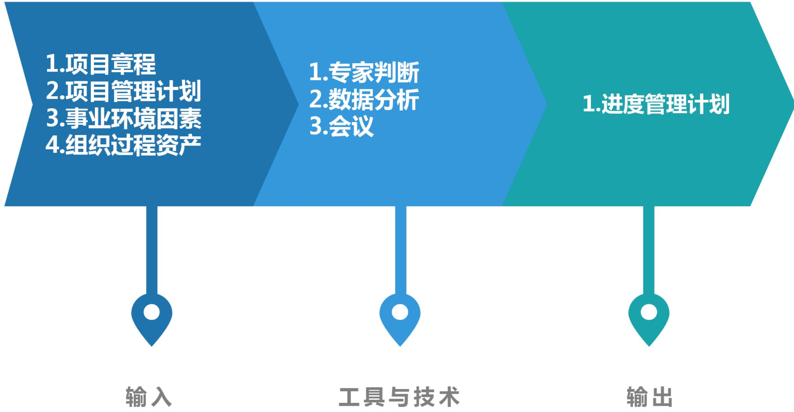

# 10.3.1 输入(了解)

1. 项目章程  
2.项目管理计划  
3. 事业环境因素  
4.组织过程资产

# 10.3.2 工具与技术(掌握)

# 1. 专家判断

# 3.会议

2. 数据分析：备选方案分析可包括确定采用哪些进度计划方法，以及如何将不同方法整合到项目中；还可以包括确定进度计划的详细程度、滚动式规划的持续时间以及审查和更新频率。

# 10.3.3 输出(掌握)

# 1. 进度管理计划

进度管理计划是项目管理计划的组成部分，为编制、监督和控制项目进度建立准则和明确活动要求。

根据项目需要，进度管理计划可以是正式或非正式的，非常详细或高度概括的。

进度管理计划的内容一般包括:

(1)项目进度模型；  
(2) 进度计划的发布和迭代长度；  
(3)准确度；  
(4)计量单位；  
(5) 工作分解结构（WBS）；  
(6)项目进度模型维护;  
(7)控制临界值；  
(8)绩效测量规则EVM；  
(9)报告格式；

# 10.4 定义活动(掌握)

定义活动是识别和记录为完成项目可交付成果而须采取的具体行动的过程。本过程的主要作用是，将工作包分解为进度活动，作为对项目工作进行进度估算、规划、执行、监督和控制的基础。本过程需要在整个项目期间开展。

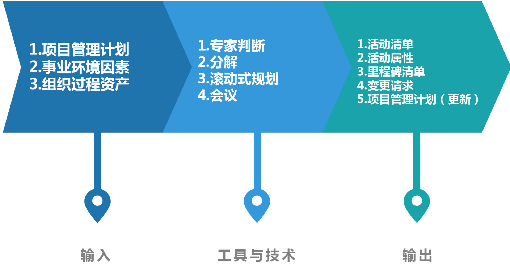

# 10.4.1 输入(了解)

1.项目管理计划  
2. 事业环境因素  
3.组织过程资产

# 10.4.2 工具与技术(掌握)

# 1. 专家判断

# 4.会议

2. 分解：把项目范围和项目可交付成果逐步划分为更小、更便于管理的组成部分的技术。WBS中的每个工作包都需分解成活动，以便通过这些活动来完成相应的可交付成果。让团队成员参与分解过程，有助于得到更好、更准确的结果。  
3. 滚动式规划：是一种迭代式的规划技术，即详细规划近期要完成的工作，同时在较高层级上粗略规划远期工作。它是一种渐进明细的规划方式，适用于工作包、规划包。

# 10.4.3 输出(掌握)

1. 活动清单：活动清单包括每个活动的标识及工作范围详述，使项目团队成员知道需要完成什么工作。

2. 活动属性：每项活动所具有的多重属性，用来扩充对活动的描述，活动属性随着项目进展情况演进并更新。活动属性可能包括活动描述、紧前活动、紧后活动、逻辑关系、提前量和滞后量、资源需求、强制日期、制约因素和假设条件。

# 3.里程碑清单

里程碑是项目中的重要时点或事件，里程碑清单列出了项目所有的里程碑，并指明每个里程碑是强制性的（如合同要求的）还是选择性的（如根据历史信息确定的）。

里程碑的持续时间为零，因为它们代表的只是一个重要时间点或事件。

4.变更请求  
5.项目管理计划（更新）

# 10.5 排列活动顺序(掌握)

除了首尾两项，每项活动都至少有一项紧前活动和一项紧后活动，并且逻辑关系适当。通过设计逻辑关系可以支持创建一个切实的项目进度计划，可能有必要在活动之间使用提前量或滞后量，使项目进度计划更为切实可行；

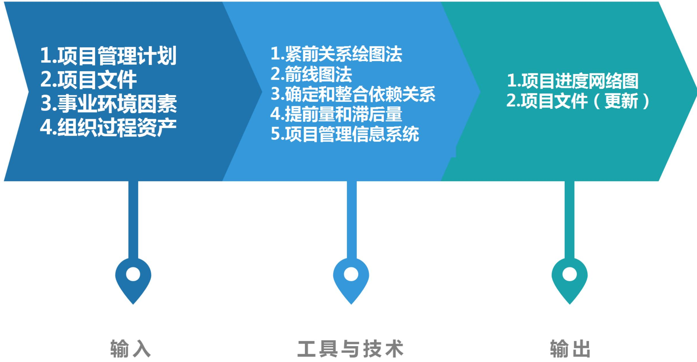

# 10.5.1 输入(了解)

1.项目管理计划  
2.项目文件  
3.事业环境因素  
4.组织过程资产

# 10.5.2 工具与技术(掌握)

# 1. 紧前关系绘图法

紧前关系绘图法（PDM），又称前导图法，使用方框或者长方形（被称作节点）代表活动，节点之间用箭头连接，以显示节点之间的逻辑关系。也称作单代号网络图（或活动节点图）。

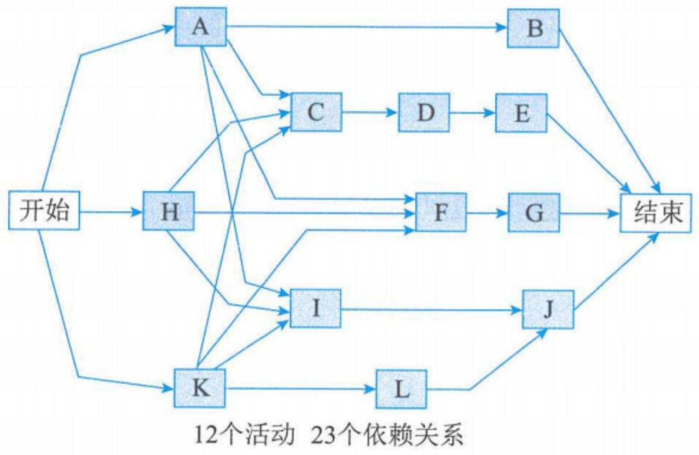  
图10-4 前导图法（单代号网络图）

# PDM包括四种依赖关系(掌握)

PDM包括四种依赖关系或逻辑关系：【FS最常用；SF很少用】。

F是finish，完成/结束。S是start，开始。

(1) FS- 完成到开始：只有紧前活动完成，紧后活动才能开始。

例如：只有完成装配PC硬件（紧前），才能开始在PC上安装操作系统（紧后）

(2) FF- 完成到完成：只有紧前活动完成，紧后活动才能完成。

例如：只有完成文件的编写（紧前），才能完成文件的编辑（紧后）

(3) SS-开始到开始：只有紧前活动开始，紧后活动才能开始。

例如：开始地基浇灌（紧前），才能开始混凝土的找平（紧后）

(4) SF-开始到完成：只有紧前活动开始，紧后活动才能完成。

例如：只有启动新应付账款系统（紧前），才能关闭旧的应付账款系统（紧后）

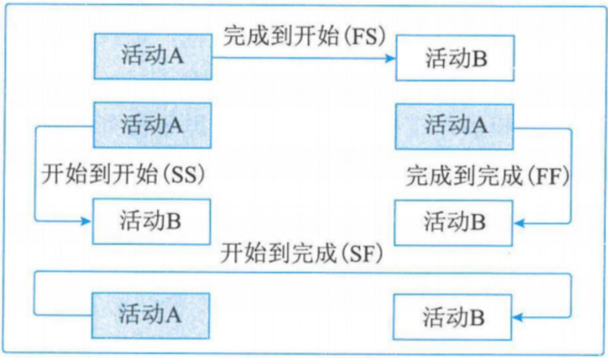  
图10-5 紧前关系绘图法（PDM）中的活动关系类型

  
图10-6 PDM图中的节点表示

# PDM中的节点表示(掌握)

在前导图法中，每个节点的活动会有如下几个时间：

【Earlist Start Latest Finish】

(1) 最早开始时间 (ES): 某项活动能够开始的最早时间。  
(2) 最早完成时间 (EF): 某项活动能够完成的最早时间。  
(3) 最迟完成时间 (LF): 为了使项目按时完成, 某项工作必须完成的最迟时间  
(4) 最迟开始时间 (LS): 为了使项目按时完成, 某项工作必须开始的最迟时间最早开始时间

EF=ES + 工期

LS=LF- 工期

<table><tr><td>最早开始时间</td><td>工期</td><td>最早完成时间</td></tr><tr><td colspan="3">活动名称</td></tr><tr><td>最迟开始时间</td><td>总浮动时间</td><td>最迟完成时间</td></tr><tr><td></td><td></td><td></td></tr></table>

# 10.5.2 工具与技术(掌握)

# 2. 箭线图法

箭线图法（ADM）是用箭线表示活动，节点表示事件的一种网络图绘制方法。也被称作双代号网络图或活动箭线图（AOA）。

在箭线图法中，有如下三个基本原则：

(1)网络图中每一活动和每一事件都必须有唯一的一个代号, 即网络图中不会有相同的代号;  
(2)任两项活动的紧前事件和紧后事件代号至少有一个不相同，节点代号沿箭线方向越来越大；  
(3)流入（流出）同一节点的活动，均有共同的紧后活动（或紧前活动）。

# 箭线图法(掌握)

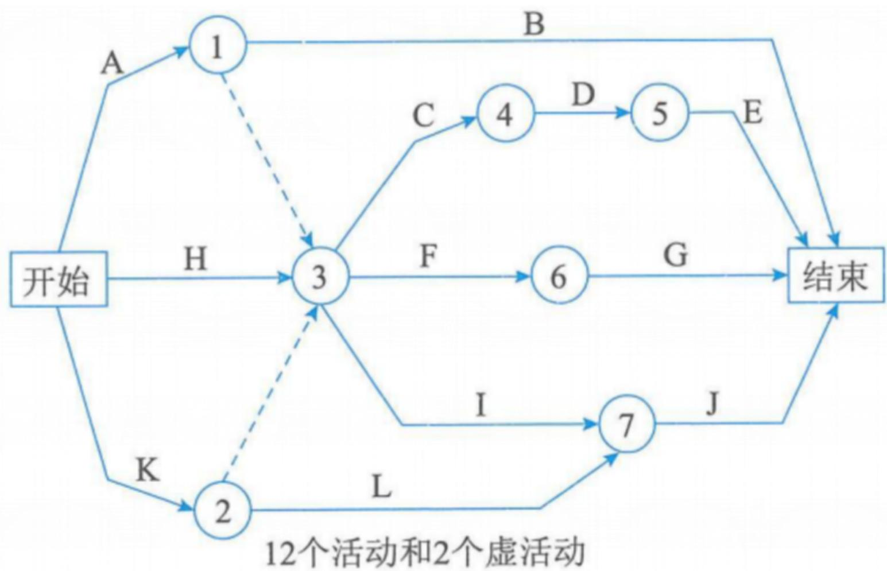  
图10-7 箭线图法（双代号网络图）

# 虚活动(掌握)

为了绘图的方便，在箭线图中又人为引入了一种额外的、特殊的活动，叫作虚活动，在网络图中由一个虚箭线表示。虚活动不消耗时间，也不消耗资源，只是为了弥补箭线图在表达活动依赖关系方面的不足。

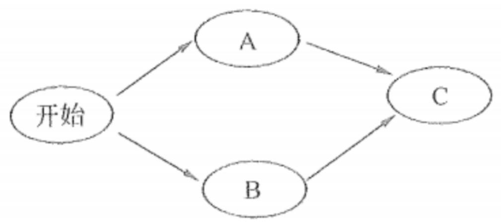  
(a)

  
(b）  
图6-11 虚活动

活动A和B可以同时进行；只有活动A和B都完成后，活动C才能开始。

# 10.5.2 工具与技术(掌握)

3. 确定和整合依赖关系  

<table><tr><td>依赖关系</td><td>释义/关键词</td><td>书中示例</td></tr><tr><td>强制性依赖关系(硬逻辑或硬依赖)</td><td>法律或合同要求的或工作的内在性质决定的依赖关系;(往往与客观限制有关)</td><td>例如,在建筑项目中,只有在地基建成后,才能建立地面结构;在电子项目中,必须先把原型制造出来,然后才能对其进行测试。(项目团队不能违反)</td></tr><tr><td>选择性依赖关系(软逻辑)</td><td>基于最佳实践建立的、或基于项目的某些特殊性质而采用的依赖关系(项目团队可自由选择)如果打算快速跟进,应当审查相应的选择性依赖关系。</td><td>根据普遍公认的最佳实践,在建造期间,应先完成卫生管道工程,才能开始电气工程。这个顺序并不是强制性要求,两个工程可以同时(并行)开展工作,但如按先后顺序进行可以降低整体项目风险。</td></tr><tr><td>外部依赖关系</td><td>项目活动与非项目活动之间的依赖关系,往往不在项目团队的控制范围内。(项目团队不可控)</td><td>例如,软件项目的测试活动取决于外部硬件的到货;建筑项目的现场准备,可能要在政府的环境听证会之后才能开始。</td></tr><tr><td>内部依赖关系</td><td>是项目活动之间的紧前关系,在项目团队的控制之中。(项目团队可控)</td><td>例如,只有机器组装完毕,团队才能对其测试。</td></tr></table>

# 10.5.2 工具与技术(掌握)

# 4. 提前量和滞后量

提前量是相对于紧前活动，紧后活动可提前的时间量，提前量一般用负值表示。

滞后量是相对于紧前活动，紧后活动需要推迟的时间量，滞后量一般用正值表示。

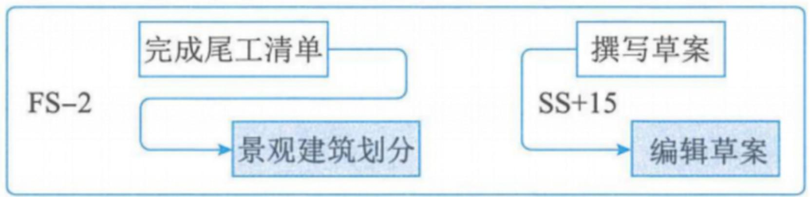  
图10-9 提前量和滞后量示例

# 10.5.3 输出(掌握)

1.项目进度网络图：是表示项目进度活动之间的逻辑关系（也叫依赖关系）的图形。

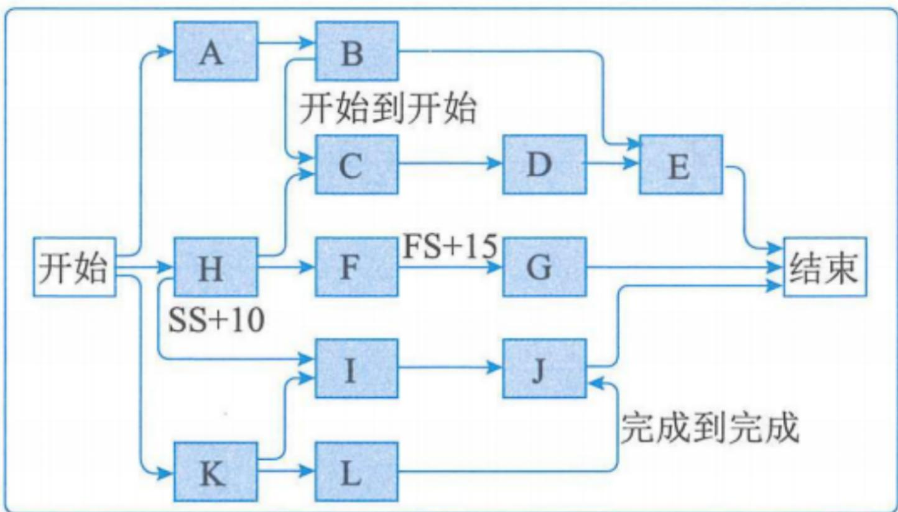  
图10-10 项目进度网络图示例

2.项目文件（更新）

# 10.6 估算活动持续时间(掌握)

在估算活动持续时间过程中，应该首先估算完成活动所需的工作量和计划投入该活动的资源数量，然后结合项目日历和资源日历，据此估算出完成活动所需的工作时段（即活动持续时间）。对应该由项目团队中最熟悉具体活动的个人或小组提供持续时间估算所需的各种输入，对持续时间的估算也应该根据输入数据的数量和质量进行渐进明细。

在许多情况下，预计可用的资源数量以及这些资源尤其是人力资源的技能熟练程度可能会决定活动的持续时间，更改分配到活动的主导性资源通常会影响持续时间，但这不是简单的“直线”或线性关系。有时候，因为工作的特性（即受到持续时间的约束、相关人力投入或资源数量），无论资源分配如何，都需要花预定的时间才能完成工作。

# 10.6 估算活动持续时间(掌握)

估算持续时间时需要考虑的其他因素包括:

(1) 收益递减规律：在保持其他因素不变的情况下，增加一个用于确定单位产出所需投入的因素（如资源）会最终达到一个临界点，在该点之后的产出或输出会随着增加这个因素而递减。  
(2) 资源数量: 增加资源数量, 比如两倍投入资源但完成工作的时间不一定能缩短一半, 因为投入资源可能会增加额外的风险, 比如如果增加太多活动资源, 可能会因知识传递、学习曲线、额外合作等其他相关因素而造成持续时间增加。  
(3) 技术进步: 在确定持续时间估算时, 技术进步因素可能发挥重要作用。例如, 通过采购最新技术, 制造工厂可以提高产量, 而这可能会影响持续时间和资源需求。  
(4) 员工激励: 项目经理还需要了解拖延症和帕金森定律。拖延症：人们只有在最后一刻，才会全力以赴;

帕金森定律：只要还有时间，工作就会不断扩展。

# 估算活动持续时间ITO(掌握)

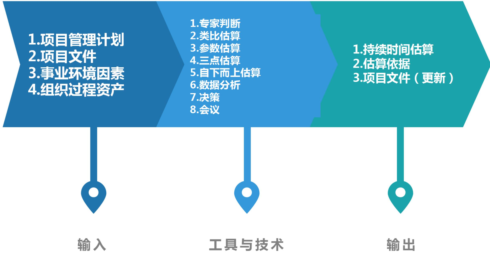

# 10.6.1 输入(了解)

1.项目管理计划  
2.项目文件  
3.事业环境因素  
4.组织过程资产

# 10.6.2 工具与技术(掌握)

# 1. 专家判断

# 2.类比估算

类比估算是一种使用相似活动或项目的历史数据来估算当前活动或项目的持续时间或成本的技术。以过去类似项目的参数值（如持续时间、预算、规模、重量和复杂性等）为基础，来估算当前和未来项目的同类参数或指标。

是一种粗略的估算方法，在项目详细信息不足时，经常使用类比估算来估算项目持续时间。

类比估算通常成本较低、耗时较少，但准确性也较低。

类比估以针对整个项目或项目中的某个部分进行，也可以与其他估算方法联合使用。

# 10.6.2 工具与技术(掌握)

# 3.参数估算

参数估算是一种基于历史数据和项目参数，使用某种算法来计算成本或持续时间的估算技术。它是指利用历史数据之间的统计关系和其他变量（如建筑施工中的平方英尺），来估算诸如成本、预算和持续时间等活动参数。把需要实施的工作量乘以完成单位工作量所需的工时，即可计算出持续时间。

参数估算的准确性取决于参数模型的成熟度和基础数据的可靠性。

参数估算可以针对整个项目或项目中的某个部分，并可以与其他估算方法联合使用。

# 10.6.2 工具与技术(掌握)

# 4.三点估算

当历史数据不充分时，通过考虑估算中的不确定性和风险，可以提高活动持续时间估算的准确性。使用三点估算有助于界定活动持续时间的近似区间：

乐观时间  $\left(T_{0}\right)$  、最可能时间  $\left(T_{M}\right)$  、悲观时间  $\left(T_{p}\right)$  。

如果三个估算值服从三角分布，则:  $T_{E} = \left(T_{0} + T_{M} + T_{p}\right) / 3$

如果三个估算值服从  $\beta$  分布, 则:  $T_{E} = \left(T_{o} + 4 T_{M} + T_{p}\right) / 6$  。

# 10.6.2 工具与技术(掌握)

5.自下而上估算：是一种估算项目持续时间或成本的方法，通过从下到上逐层汇总WBS组成部分的估算而得到项目估算。

# 6.数据分析

<table><tr><td colspan="2">●备选方案分析：用于比较不同的资源，以及关于资源的创建、租赁和购买决策。（有助于团队权衡资源、成本和持续时间变量，以确定完成项目工作的最佳方式）</td></tr><tr><td rowspan="2">●储备分析：</td><td>应急储备：是包含在进度基准中的一段持续时间，应急储备与“已知-未知”风险相关，用来应对已经接受的已识别风险，应急储备可取活动持续时间估算值的某百分比或某一固定的时间段【成本基准中一PM可控—属于“已知-未知”风险】</td></tr><tr><td>管理储备：是为管理控制的目的而特别留出的项目预算，用来应对项目范围中不可预见的工作。用来应对会影响项目的“未知-未知”风险，它不包括在进度基准中，但属于项目总持续时间的一部分。依据合同条款，使用管理储备可能需要变更进度基准。【不在成本基准中一PM无权控制需高层的批准—属于“未知-未知”风险】</td></tr></table>

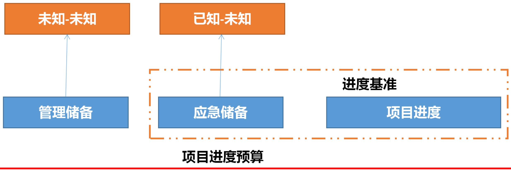

# 应急储备和管理储备(掌握)

“已知一未知”风险：明确可能发生什么风险，但对风险发生的几率和严重性并不了解，例如：机器故障。【由应急储备应对】

“未知一未知”风险：不了解可能发生什么风险，因此也不了解发生的几率和影响的严重性，例如：总统在台上演讲时被扔鞋。【由管理储备应对】

# 10.6.2 工具与技术(掌握)

7.决策：投票。举手表决是从投票方法衍生出来的一种形式，经常用于敏捷项目中。  
8.会议

# 10.6.3 输出(掌握)

1. 持续时间估算：是对完成某项活动、阶段或项目所需的工作时段数的定量评估，其中并不包括任何滞后量，但可指出一定的变动区间。例如:2周±2天，表明活动至少需要8天，最多不超过12天（假定每周工作5天）。  
2. 估算依据：持续时间估算所需的支持信息的数量和种类，因应用领域不同而不同。不论其详细程度如何，支持性文件都应该清晰、完整地说明持续时间估算是如何得出的。  
3.项目文件（更新）

# 10.7 制订进度计划(掌握)

制订可行的项目进度计划是一个反复进行的过程。编制进度计划时，需要审查和修正持续时间估算、资源估算和进度储备，以制订项目进度计划，并在经批准后作为基准用于跟踪项目进度。

# 制订进度计划的关键步骤：

(1) 定义项目里程碑，识别活动并排列活动顺序，估算持续时间，并确定活动的开始和完成日期。  
(2) 由分配至各个活动的项目人员审查其被分配的活动。  
(3) 项目人员确认开始和完成日期与资源日历和其他项目或任务没有冲突,从而确认计划日期的有效性。  
(4) 分析进度计划, 确定是否存在逻辑关系冲突, 以及在批准进度计划并将其作为基准之前是否需要资源平衡, 并同步修订和维护项目进度模型, 确保进度计划在整个项目期间一直切实可行。

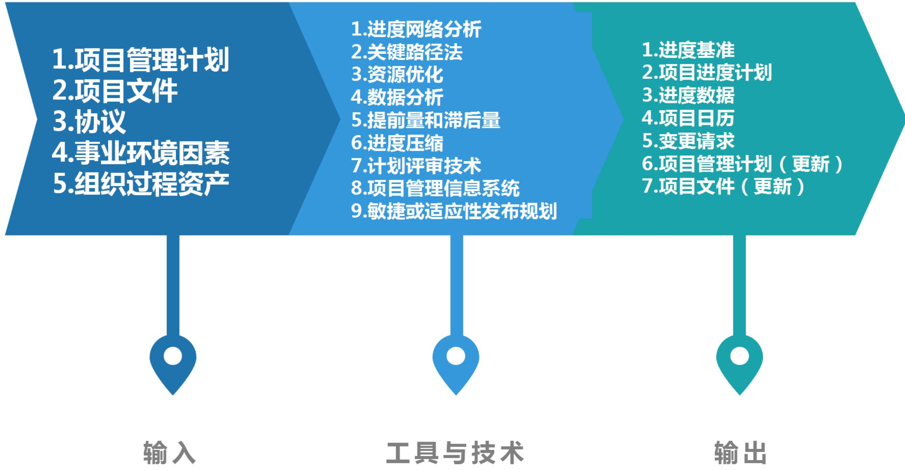

# 10.7.1 输入(了解)

1.项目管理计划  
2.项目文件  
3.协议  
4.事业环境因素  
5.组织过程资产

# 10.7.2 工具与技术(掌握)

# 1.进度网络分析

2.关键路径法：用于在进度模型中估算项目的最短工期，确定逻辑网络路径的进度灵活性；从起点到终点持续时间最长的路径就是关键路径，关键路径可能有多条；

总浮动时间：在任一网络路径上，进度活动可以从最早开始日期推迟或拖延的时间，而不至于延误项目完成日期或违反进度制约因素。总浮动时间=本活动的最迟完成时间减去本活动的最早完成时间，或本活动的最迟开始时间减去本活动的最早开始时间。

自由浮动时间：就是指在不延误任何紧后活动的最早开始日期或不违反进度制约因素的前提下，某进度活动可以推迟的时间量，其计算方法为：紧后活动最早开始时间的最小值减去本活动的最早完成时间。

# 关键路径法(掌握)

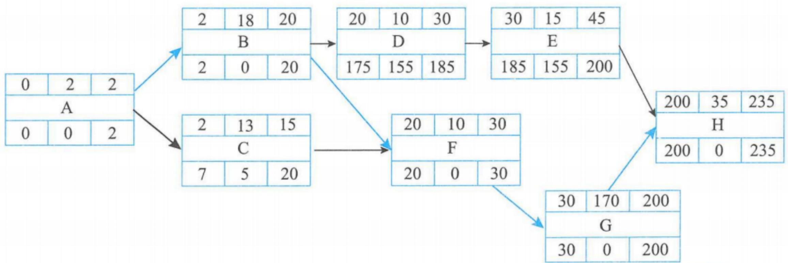

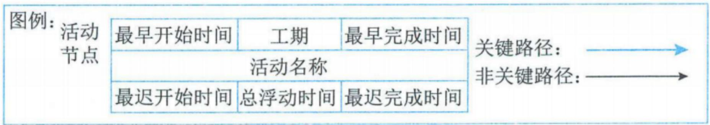  
图10-14 关键路径法示例

# 关键路径法(掌握)

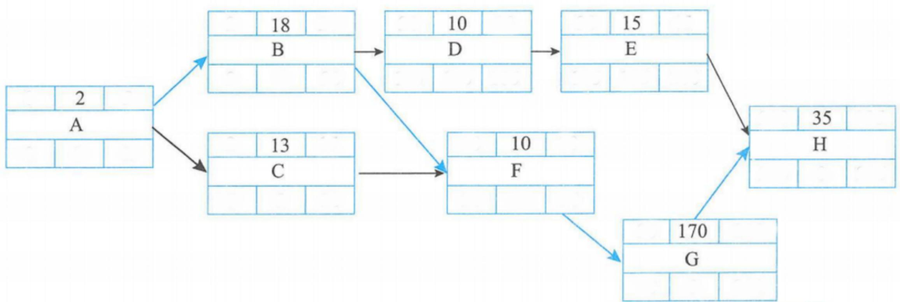

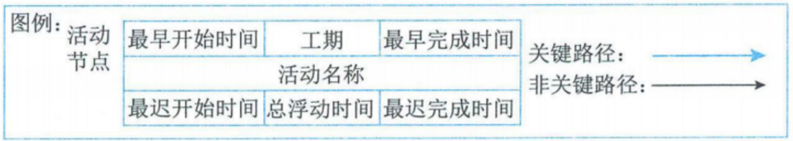  
图10-14 关键路径法示例

# 10.7.2 工具与技术(掌握)

# 3.资源优化【优先做平滑，再做平衡】

资源平衡：是为了在资源需求与资源供给之间取得平衡，根据资源制约因素对开始日期和完成日期进行调整的一种技术。如果共享资源或关键资源只在特定时间可用而且数量有限，如一个资源在同一时段内被分配至两个或多个活动，就需要进行资源平衡。也可以为保持资源使用量处于均衡水平而进行资源平衡。资源平衡往往导致关键路径改变。可以用浮动时间平衡资源。

资源平滑：对进度模型中的活动进行调整，从而使项目资源需求不超过预定的资源限制的一种技术。相对于资源平衡而言，资源平滑不会改变项目的关键路径，完工日期也不会延迟。也就是说，活动只在其自由和总浮动时间内延迟，但资源平滑技术可能无法实现所有资源的优化。

# 资源平衡示例(掌握)

如果活动B和C都只能由工程师小王完成，那么小王在第二天和第三天需要完成B, 而第二天同时还需要完成C, 此时小王的工作会超负荷，需要进行资源平衡，平衡后工作安排如图所示。图中的项目需要4天完成，做了资源平衡之后需要5天完成，所以资源平衡往往导致关键路径改变，而且通常是延长了关键路径。

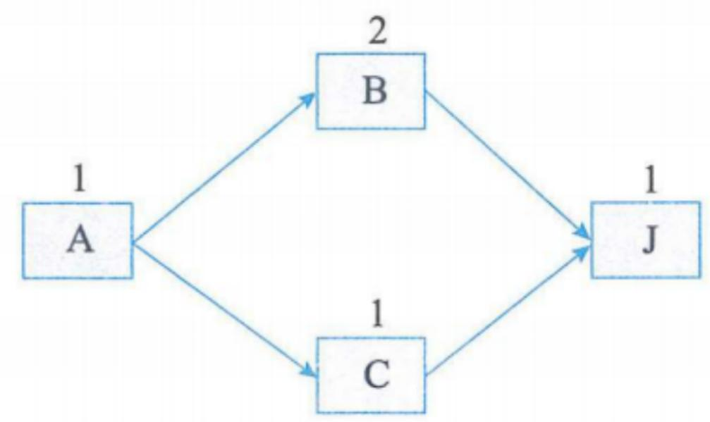  
图10-15 资源平衡示例（平衡前）

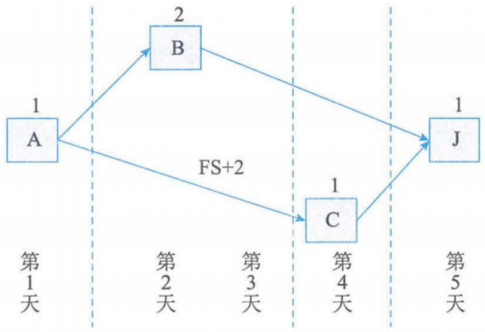  
图10-16 资源平衡示例（平衡后）

# 资源平滑示例(掌握)

例如在图中，如果活动B和D都需要小王完成，此时，第2天小王需要同时完成B和D，工作会超出负荷，由于关键路径为A-B-C-F，D不在关键路径上，可以有一天的总浮动时间，所以针对D可以进行资源平滑技术进行调整，调整后工作安排如图。由于D有一天的总浮动时间，可以通过滞后量，把D活动安排在第3天，避免了小王第二天资源负荷过大的问题，而且不影响整体工期。

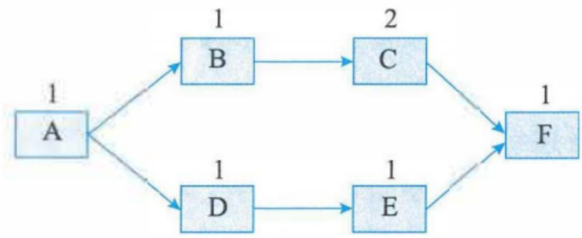  
图10-17 资源平滑示例（调整前）

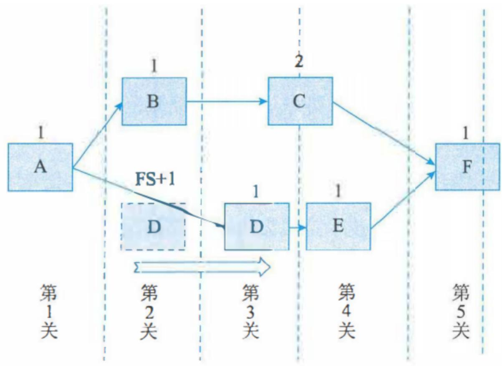  
图10-18 资源平滑示例（调整后）

# 10.7.2 工具与技术(掌握)

# 4.数据分析

假设情景分析：是对各种情景进行评估，预测它们对项目目标的影响（积极或消极的）。对“如果情景X出现，情况会怎样？”这样的问题进行分析，即基于已有的进度计划，考虑各种各样的情景。可以根据假设情景分析的结果，评估项目进度计划在不同条件下的可行性，以及为应对意外情况的影响而编制进度储备和应对计划。

模拟：是把单个项目风险和不确定性的其他来源模型化的方法，以评估它们对项目目标的潜在影响。最常见的模拟技术是蒙特卡罗分析，它利用风险和其他不确定资源计算整个项目可能的进度结果。使用概率分布和不确定性的其他表现形式，来计算出多种可能的工作包持续时间。

# 10.7.2 工具与技术(掌握)

# 5. 提前量和滞后量

提前量用于在条件许可情况下提早开始紧后活动；

滞后量在某些限制条件下，在紧前和紧后活动之间增加一段不需要工作或资源的自然时间。

# 10.7.2 工具与技术(掌握)

# 6.进度压缩

进度压缩技术是指在不缩减项目范围的前提下，缩短或加快进度工期，以满足进度制约因素、强制日期或其他进度目标。进度压缩技术包括：

- 赶工：是通过增加资源，以最小的成本代价来压缩进度工期的一种技术。赶工的例子包括:批准加班、增加额外资源或支付加急费用来加快关键路径上的活动。赶工只适用于那些通过增加资源就能缩短持续时间的且位于关键路径上的活动。但赶工并非总是切实可行的，因它可能导致风险和/或成本的增加。

- 快速跟进：将正常情况下按顺序进行的活动或阶段改为至少是部分并行开展。例如，在大楼的建筑图纸尚未全部完成前就开始建地基。快速跟进可能造成返工和风险增加，所以它只适用于能够通过并行活动来缩短关键路径上的项目工期的情况。若进度加快而使用提前量，通常会增加相关活动之间的协调工作，并增加质量风险。还有可能增加项目成本。

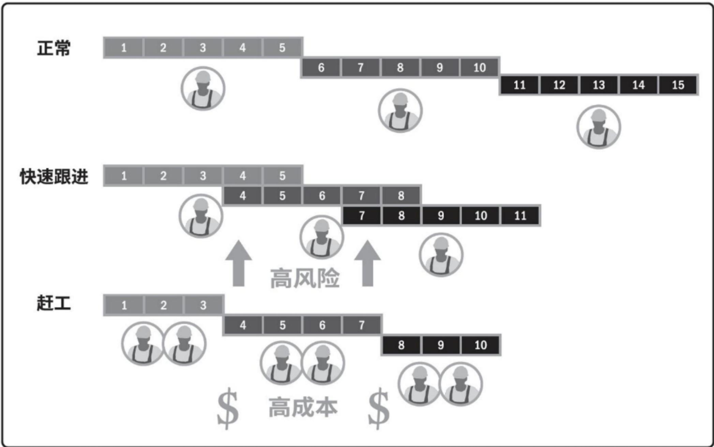

# 10.7.2 工具与技术(掌握)

# 7.计划评审技术

$\diamond$  计划评审技术（PERT），又称为三点估算技术，其理论基础是假设项目持续时间以及整个项目完成时间是随机的，且服从某种概率分布。可以估计整个项目在某个时间内完成的概率。

• 乐观时间  $\left(T_{0}\right)$ ; 最可能时间  $\left(T_{M}\right)$ ; 悲观时间  $\left(T_{p}\right)$  
• 如果三个估算值服从  $\beta$  分布, 则:  $T_{E} = (T_{o} + 4 T_{M} + T_{p}) / 6$  。

8.项目管理信息系统：进度计划软件，自动生成开始和完成日期，从而可加快进度计划的编制过程。

# 9.敏捷或适应性发布规划

敏捷或适应型发布规划基于项目路线图和产品发展愿景，提供了高度概括的发布进度时间轴（通常是  $3 \sim 6$  个月）。同时还确定了发布的迭代或冲刺次数，使产品负责人和团队能够决定需要开发的内容，并基于业务目标、依赖关系和障碍因素确定达到产品放行所需的时间。对客户而言，产品功能就是价值，因此该时间轴定义了每次迭代结束时交付的功能，提供了更易于理解的项目进度计划，而这些就是客户真正需要的信息。

# 10.7.3 输出(掌握)

1. 进度基准：是经过批准的项目进度计划，只有通过正式的变更控制程序才能进行变更，用作与实际结果进行比较的依据。

# 2.项目进度计划

项目进度计划是进度模型的输出，为各个相互关联的活动标注了计划日期、持续时间、里程碑和所需资源等。项目进度计划可以是概括的或详细的。

可以采用的图形方式包括:

- 横道图：也称“甘特图”，是展示进度信息的一种图表方式。纵向列示活动，横向列示日期，用横条表示活动自开始日期至完成日期的持续时间。横道图相对易读，常用。  
- 里程碑图：与横道图类似，但仅标示出主要可交付成果和关键外部接口的计划开始或完成日期。  
- 项目进度网络图：通常用活动节点法绘制，没有时间刻度，纯粹显示活动及其相互关系。项目进度网络图也可以是包含时间刻度的进度网络图，称为“时标图”。

# 10.7.3 输出(掌握)

(1) 里程碑进度计划，也叫里程碑图。  
(2) 概括性进度计划，也叫横道图。  
(3) 详细进度计划，也叫项目进度网络图。

里程碑进度计划  

<table><tr><td rowspan="2">活动标识</td><td rowspan="2">活动描述</td><td rowspan="2">日历单元</td><td colspan="6">项目进度计划时间表</td></tr><tr><td>时段1</td><td>时段2</td><td colspan="2">时段3</td><td>时段4</td><td>时段5</td></tr><tr><td>1.1.MB</td><td>开始新产品Z</td><td>0</td><td></td><td></td><td></td><td></td><td></td><td></td></tr><tr><td>1.1.1.M1</td><td>完成组件1</td><td>0</td><td></td><td></td><td></td><td></td><td></td><td></td></tr><tr><td>1.1.2.M1</td><td>完成组件2</td><td>0</td><td></td><td></td><td></td><td></td><td></td><td></td></tr><tr><td>1.1.3.M1</td><td>完成组件1和组件2的整合</td><td>0</td><td></td><td></td><td></td><td></td><td></td><td></td></tr><tr><td>1.1.3.MF</td><td>完成新产品Z</td><td>0</td><td></td><td></td><td></td><td></td><td></td><td></td></tr></table>

概括性进度计划  

<table><tr><td rowspan="2">活动标识</td><td rowspan="2">活动描述</td><td rowspan="2">日历单元</td><td colspan="6">项目进度计划时间表</td></tr><tr><td>时段1</td><td>时段2</td><td colspan="2">时段3</td><td>时段4</td><td>时段5</td></tr><tr><td>1.1</td><td>开发和交付新产品Z</td><td>120</td><td></td><td></td><td></td><td></td><td></td><td></td></tr><tr><td>1.1.1</td><td>工作包1: 组件1</td><td>67</td><td></td><td></td><td></td><td></td><td></td><td></td></tr><tr><td>1.1.2</td><td>工作包2: 组件2</td><td>53</td><td></td><td></td><td></td><td></td><td></td><td></td></tr><tr><td>1.1.3</td><td>工作包3: 整合组件1和组件2</td><td>53</td><td></td><td></td><td></td><td></td><td></td><td></td></tr></table>

# 10.7.3 输出(掌握)

详细进度计划  

<table><tr><td rowspan="2">活动标识</td><td rowspan="2">活动描述</td><td rowspan="2">日历单元</td><td colspan="5">项目进度计划时间表</td></tr><tr><td>时段1</td><td>时段2</td><td>时段3</td><td>时段4</td><td>时段5</td></tr><tr><td>1.1.MB</td><td>开始新产品Z</td><td>0</td><td></td><td></td><td></td><td></td><td></td></tr><tr><td>1.1</td><td>开发和交付产品Z</td><td>120</td><td></td><td></td><td></td><td></td><td></td></tr><tr><td>1.1.1</td><td>工作包1:组件1</td><td>67</td><td></td><td></td><td></td><td></td><td></td></tr><tr><td>1.1.1.D</td><td>设计组件1</td><td>20</td><td></td><td></td><td></td><td></td><td></td></tr><tr><td>1.1.1.B</td><td>建造组件1</td><td>33</td><td></td><td></td><td></td><td></td><td></td></tr><tr><td>1.1.1.T</td><td>测试组件1</td><td>14</td><td></td><td></td><td></td><td></td><td></td></tr><tr><td>1.1.1.M1</td><td>完成组件1</td><td>0</td><td></td><td></td><td></td><td></td><td></td></tr><tr><td>1.1.2</td><td>工作包2:组件2</td><td>53</td><td></td><td></td><td></td><td></td><td></td></tr><tr><td>1.1.2.D</td><td>设计组件2</td><td>14</td><td></td><td></td><td></td><td></td><td></td></tr><tr><td>1.1.2.B</td><td>建造组件2</td><td>28</td><td></td><td></td><td></td><td></td><td></td></tr><tr><td>1.1.2.T</td><td>测试组件2</td><td>11</td><td></td><td></td><td></td><td></td><td></td></tr><tr><td>1.1.2.M1</td><td>完成组件2</td><td>0</td><td></td><td></td><td></td><td></td><td></td></tr><tr><td>1.1.3</td><td>工作包3:整合组件1和组件2</td><td>53</td><td></td><td></td><td></td><td></td><td></td></tr><tr><td>1.1.3.G</td><td>整合组件1和组件2得到产品Z</td><td>14</td><td></td><td></td><td></td><td></td><td></td></tr><tr><td>1.1.3.T</td><td>完成组件1和组件2的整合</td><td>32</td><td></td><td></td><td></td><td></td><td></td></tr><tr><td>1.1.3.M1</td><td>测试整合组件得到产品Z</td><td>0</td><td></td><td></td><td></td><td></td><td></td></tr><tr><td>1.1.3.P</td><td>交付产品Z</td><td>7</td><td></td><td></td><td></td><td></td><td></td></tr><tr><td>1.1.3.MF</td><td>完成新产品Z</td><td>0</td><td></td><td></td><td></td><td></td><td></td></tr></table>

# 10.7.3 输出(掌握)

# 3.进度数据

# 5.变更请求

4.项目日历：规定可以开展进度活动的可用工作日和工作班次，它把可用于开展进度活动的时间段（按天或更小的时间单位）与不可用的时间段区分开来。  
6.项目管理计划（更新）  
7.项目文件（更新）

# 10.8 控制进度(掌握)

控制进度作为实施整体变更控制过程的一部分，关注内容包括：

(1)判断项目进度的当前状态;  
(2)对引起进度变更的因素施加影响;  
(3)重新考虑必要的进度储备；  
(4)判断项目进度是否已经发生变更;  
(5)在变更实际发生时对其进行管理。

将工作外包时，定期向承包商和供应商了解里程碑的状态更新是确保工作按商定进度进行的一种途径，有助于确保进度受控。同时，应执行进度状态评审和巡检，确保承包商报告准确且完整。

# 控制进度ITO(掌握)

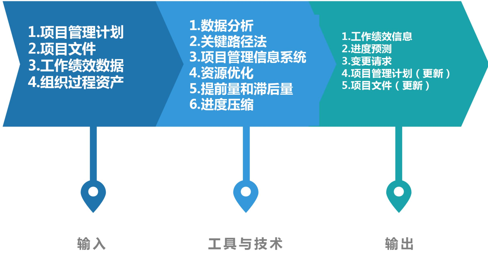

# 10.8.1 输入(了解)

1.项目管理计划  
2.项目文件  
3.工作绩效数据  
4.组织过程资产

# 10.8.2 工具与技术(掌握)

# 1. 数据分析

<table><tr><td>●净值分析：进度绩效测量指标（如进度偏差（SV）和进度绩效指数（SPI））用于评价偏离初始进度基准的程度</td></tr><tr><td>●迭代燃尽图：用于追踪迭代未完项中尚待完成的工作。它分析与理想燃尽图的偏差。可使用预测趋势线来预测迭代结束时可能出现的偏差，以及在迭代期间应采取的合理行动。燃尽图中先用对角线表示理想的燃尽情况，再每天画出实际剩余工作，最后基于剩余工作计算出趋势线以预测完成情况</td></tr><tr><td>●绩效审查：根据进度基准测量、对比和分析进度绩效，如实际开始和完成日期、已完成百分比以及当前工作的剩余持续时间</td></tr><tr><td>●趋势分析：检查项目绩效随时间的变化情况，以确定绩效是在改善还是在恶化</td></tr><tr><td>●偏差分析：关注实际开始和完成日期与计划的偏离，实际持续时间与计划的差异，以及浮动时间的偏差</td></tr><tr><td>●假设情景分析：基于项目风险管理过程的输出，对各种不同的情景进行评估，促使进度模型符合项目管理计划和批准的基准</td></tr></table>

# 迭代燃尽图(掌握)

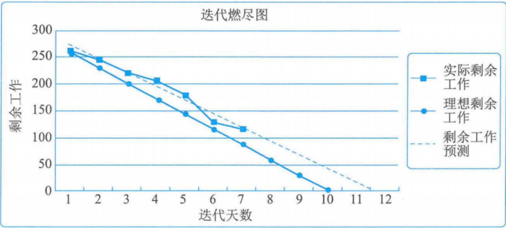  
图10-24 迭代燃尽图

# 10.8.2 工具与技术(掌握)

2. 关键路径法：检查关键路径的进展情况有助于确定项目进度状态。关键路径上的偏差将对项目的结束日期产生直接影响。评估次关键路径上的活动的进展情况，有助于识别进度风险。  
3.项目管理信息系统  
4.资源优化  
5. 提前量和滞后量  
6. 进度压缩

# 10.8.3 输出(了解)

1. 工作绩效信息  
2.进度预测  
3.变更请求  
4.项目管理计划（更新）  
5.项目文件（更新）

# 控制进度(补充背诵)

缩短活动的工期的方法：

(1) 赶工，投入更多的资源或增加工作时间，以缩短关键活动的工期。  
(2)快速跟进，并行施工，以缩短关键路径的长度。  
(3)使用高素质的资源或经验更丰富的人员。  
(4) (在甲方同意的基础上) 减小活动范围或降低活动要求。  
(5)改进方法或技术，以提高生产效率。  
(6)加强质量管理，及时发现问题，减少返工，从而缩短工期。

# 本章练习

(1) ( ) 提供详尽的计划, 说明项目如何以及何时交付项目范围中定义的产品、服务和成果, 是一种用于沟通和管理干系人期望的工具, 为绩效报告提供了依据。

A.项目进度计划

B.进度管理计划

C.项目章程

D.项目管理计划

【答案】A

(2) 关于进度管理计划的理解, 不正确的是 ( )。

A.进度管理计划是项目管理计划的组成部分  
B. 进度管理计划既可以非常详细，也可以高度概括，但必须是正式的  
c.进度管理计划为编制、监督和控制项目进度建立准则和明确活动  
D.进度管理计划会规定用于制定项目进度模型的进度规划方法论和工具

【答案】B

# 本章练习

(3) 在早期的战略规划阶段，信息尚不够明确，工作包只能分解到已知的详细水平，而后，随着了解到更多的信息，近期即将实施的工作包就可以分解到具体的活动，该方法是（）。

A.专家判断

B.分解

C.滚动式规划

D.标杆管理法

【答案】C

(4) 关于活动属性的理解, 不正确的是 ( )。

A.活动属性是指每项活动所具有的多重属性，用来扩充对活动的描述  
B. 活动属性不会随时间而演进  
C.活动属性可用于识别开展工作的地点、编制开展活动的项目日历，以及相关的活动类型  
D.在项目初始阶段，活动属性包括唯一活动标识、WBS标识和活动名称【答案】B

# 本章练习

(5) 只有在验证请求者身份合法后，服务器才开始向客户端传输数据，这是（）关系。

A.FS

B.FF

C.SS

D.SF

【答案】A

(6) 活动B可在活动A完成前5天开始，则关系表示为（）。

A.SS+5

B.SS-5

C.FS+5

D.FS-5

【答案】D

# 本章练习

(7) 监控系统项目中, 甲方要求采用防护等级为IP67的摄像头, 这属于 ( )。

A.强制性依赖关系

B.选择性依赖关系

c.外部依赖关系

D.内部依赖关系

【答案】A

(8) 相对于其他估算技术，（）通常成本较低、耗时较少，但准确性也较低。

A.类比估算

B. 参数估算

C.三点估算

D.自下而上估算

【答案】A

# 本章练习

(9) 某项活动最可能时间8天, 最乐观时间7天, 最悲观时间12天, 则该活动的期望持续时间为 ( )。

A.7天

B.8天

C.9天

D.10天

【答案】C

(10) 快速跟进是一种进度压缩技术，（）属于快速跟进技术。

A. 加班  
B.增加项目组成员  
C.加快关键路径上的活动  
D.将正常情况下按顺序进行的活动或阶段改为至少是部分并行开展

【答案】D

# 历年真题练习

# 【2023年上半年-第30题】

关于活动排序的描述，不正确的是（）。

A.在单代号网络图中，每项活动有唯一的活动号，每项活动都标明了活动的持续时间  
B.双代号网络图中流入同一节点的活动，均有共同点紧后活动  
C.双代号网络图中,任两项活动的紧前事件和紧后事件代号至少有一个不相同  
D.滞后量是紧后活动相对于紧前活动需要推迟的时间量，一般用负值表示

【答案】D

# 历年真题练习

# 【2023年上半年-第32题】

在控制进度过程的数据分析技术中，（）可以通过检查项目绩效随时间的变化情况，确定绩效是在改善还是恶化。

A. 储备分析

B.蒙特卡洛分析

C.趋势分析

D.假设情景分析

【答案】C

# 历年真题练习

# 【2023年下半年-第2批次自编】

在（）规定可以开展进度活动的可用工作日和工作班次，它把可用于开展进度活动的时间段（按天或更小的时间单位）与不可用的时间段区分开来。

A.项目日历

B.资源日历

C.项目团队派工单

D.物质资源分配单

【答案】A

# 历年真题练习

# 【2024年上半年-第2批次】

关于估算活动持续时间过程的工具与技术的描述，不正确的是（）。

A.类比估算是一种精确的估算方法，适用于项目详细信息充分、项目需求明确的情况  
B.专家判断依赖于专家的可用性和经验，可能受到主观判断的影响  
C.三点估算考虑了估算中的不确定性和风险，有助于界定活动持续时间的近似区间  
D.参数估算是一种基于历史数据和项目参数，使用某种算法来计算成本或持续时间的估算技术

【答案】A

