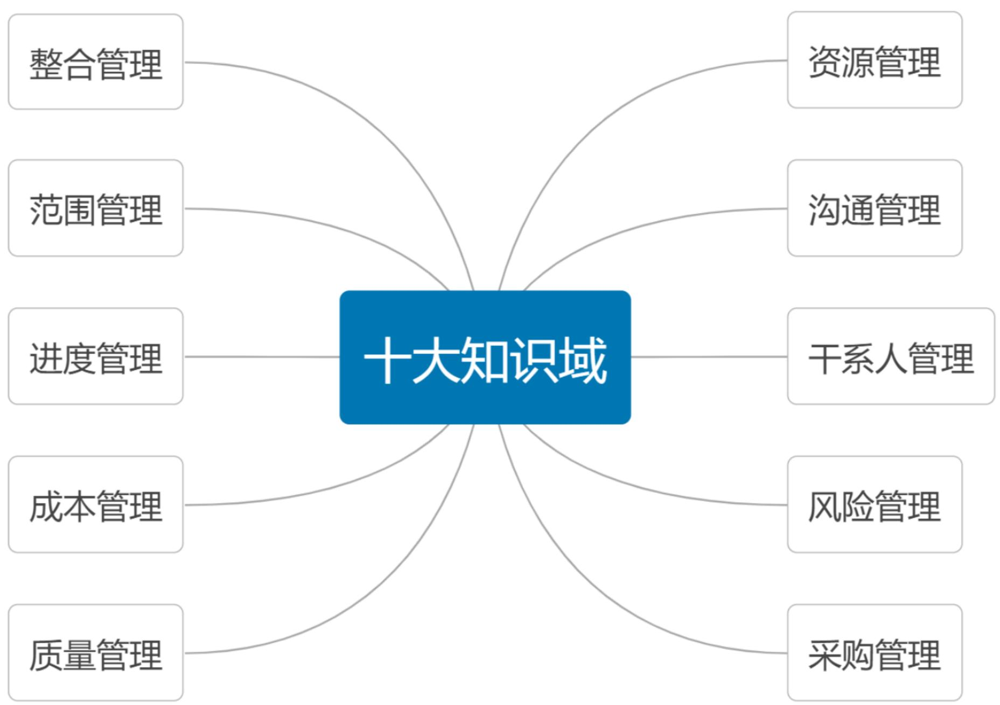
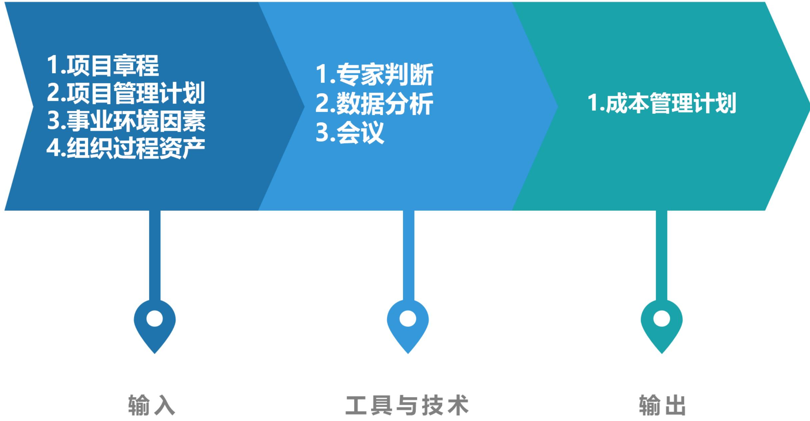
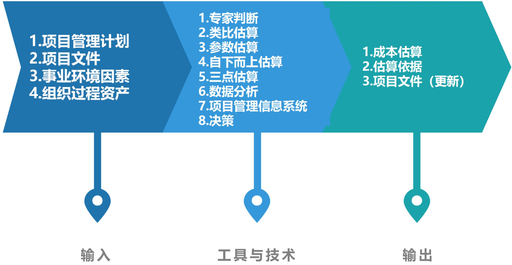
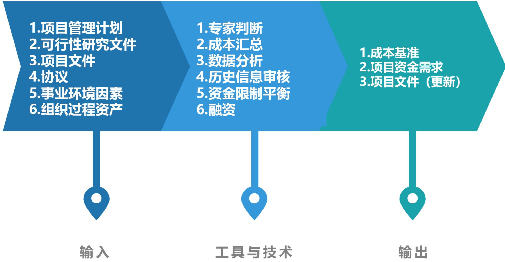
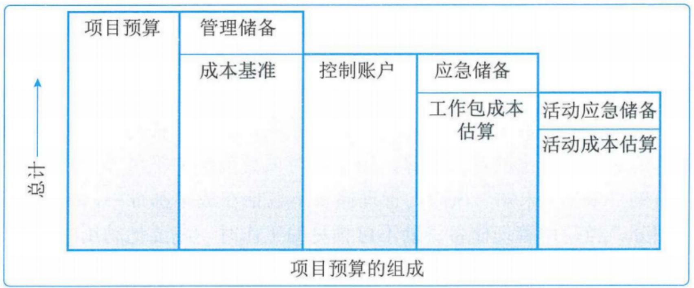
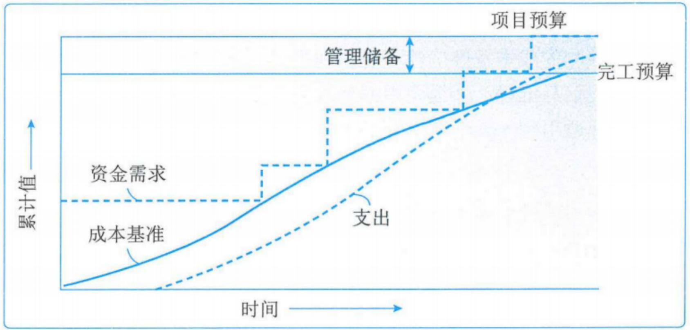
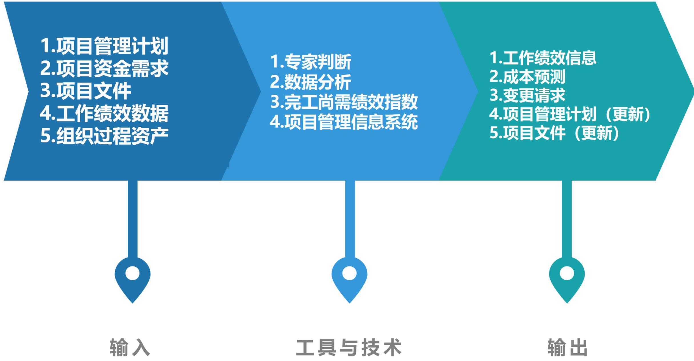

# 项目成本管理

# 信息系统项目管理师

# 本章学习建议

根据历年的考试情况来看，由于本章内容属于10大管理的内容，上午、案例分析、论文写作都会进行考查。项目成本管理一般上午考察3分，非常重要，成本控制的好不好，直接关乎项目的质量，因此成本管理此章节非常重要，案例分析可能会出案例分析计算的，主要集中在挣值、预测技术计算等方面。

本章考情分析  

<table><tr><td>年份</td><td>上午选择题</td><td>案例分析题</td><td>论文写作</td><td>合计</td></tr><tr><td>2023年05月</td><td>4</td><td>10</td><td>0</td><td>14</td></tr><tr><td>2023年11月</td><td>机考3-4分左右</td><td>10分 (第1批)
15分 (第2批)
15分 (第3批)
25分 (第4批)</td><td>0</td><td>每个批次20分左右</td></tr><tr><td>2024年05月</td><td>机考3分左右</td><td>25分 (第2批)</td><td>75分 (第2批)</td><td>78</td></tr></table>

# 十大知识领域(背诵)

# 成本管理ITO(掌握)

<table><tr><td colspan="5">成本管理</td></tr><tr><td>组</td><td>过程</td><td>输入</td><td>工具和技术</td><td>输出</td></tr><tr><td>规划</td><td>1.规划成本管理</td><td>1.项目章程
2.项目管理计划
•进度管理计划
•风险管理计划
3.事业环境因素
4.组织过程资产</td><td>1.专家判断
2.数据分析
•备选方案分析
3.会议</td><td>1.成本管理计划</td></tr></table>

# 成本管理ITO(掌握)

<table><tr><td>组</td><td>过程</td><td>输入</td><td>工具和技术</td><td>输出</td></tr><tr><td>规划</td><td>2.估算成本</td><td>1.项目管理计划
•成本管理计划
•质量管理计划
•范围基准
2.项目文件
•风险登记册
•经验教训登记册
•资源需求
•项目进度计划
3.事业环境因素
4.组织过程资产</td><td>1.专家判断
2.类比估算
3.参数估算
4.自下而上估算
5.三点估算
6.数据分析
•备选方案分析
•储备分析
•质量成本
7.项目管理信息系统
8.决策
•投票</td><td>1.成本估算
2.估算依据
3.项目文件(更新)
•假设日志
•经验教训登记册
•风险登记册</td></tr></table>

# 成本管理ITO(掌握)

<table><tr><td>组</td><td>过程</td><td>输入</td><td>工具和技术</td><td>输出</td></tr><tr><td>规划</td><td>3.制定预算</td><td>1.项目管理计划
•成本管理计划
•资源管理计划
•范围基准
2.可行性研究文件
•可行性研究报告
•项目评估报告
3.项目文件
•估算依据
•成本估算
•项目进度计划
•风险登记册
4.协议
5.事业环境因素
6.组织过程资产</td><td>1.专家判断
2.成本汇总
3.数据分析
•储备分析
4.历史信息审核
5.资金限制平衡
6.融资</td><td>1.成本基准
2.项目资金需求
3.项目文件(更新)
•成本估算
•项目进度计划
•风险登记册</td></tr></table>

# 成本管理ITO(掌握)

<table><tr><td>组</td><td>过程</td><td>输入</td><td>工具和技术</td><td>输出</td></tr><tr><td>监控</td><td>4.控制成本</td><td>1.项目管理计划
•成本管理计划
•成本基准
•绩效测量基准
2.项目资金需求
3.项目文件
•经验教训登记册
4.工作绩效数据
5.组织过程资产</td><td>1.专家判断
2.数据分析
•净值分析
•偏差分析
•趋势分析
•储备分析
3.完工尚需绩效指
数
4.项目管理信息系
统</td><td>1.工作绩效信息
2.成本预测
3.变更请求
4.项目管理计划
(更新)
•成本管理计划
•成本基准
•绩效测量基准
5.项目文件(更新)
•假设日志
•估算依据
•成本估算
•经验教训登记册
•风险登记册</td></tr></table>

# 11.1 管理基础-11.1.1 重要性和意义(了解)

项目成本管理重点关注完成项目活动所需资源的成本，但同时也考虑项目决策对项目产品、服务或成果的使用成本、维护成本和支持成本的影响。项目成本管理应考虑干系人对成本的要求，不同的干系人会在不同的时间，用不同的方法测算项目成本。

对于小项目而言，成本估算和成本预算之间的关系极其密切，以致可以将其视为一个过程，由一个人在较短的时间内完成。

发生成本失控的原因主要包括:

(1)对工程项目认识不足;  
(2)组织制度不健全;  
(3)方法问题;  
(4)技术的制约;  
(5)需求管理不当。

# 11.1.2 相关术语和定义(了解)

项目成本：项目全过程所耗用的各种成本的总和为项目成本。【具体的成本一般包括直接工时、其他直接费用、间接工时、其他间接费用以及采购价格】

产品的全生命周期成本：产品的全生命周期成本就是在产品或系统的整个使用生命期内，在获得阶段（设计、生产、安装和测试等活动）、运营与维护及全生命周期结束时对产品的处置所发生的全部成本。【设计、生产、安装、测试、使用和维护】

# 11.1.2 相关术语和定义(掌握)

# 成本的类型:

(1) 可变成本: 随着生产量、工作量或时间而变的成本为可变成本。又称变动成本。  
比如：原材料、设备折旧  
(2) 固定成本: 不随生产量、工作量或时间的变化而变化的非重复成本为固定成本。  
比如：设备  
(3) 直接成本：直接可以归属于项目工作的成本为直接成本。如项目团队差旅费、工资、项目使用的物料及设备使用费。（本项目内）  
(4) 间接成本: 来自一般管理费用科目或几个项目共同担负的项目成本所分摊给本项目的费用, 就形成了项目的间接成本, 如税金、额外福利和保卫费用。(公司多项目分摊)  
(5) 机会成本: 是利用一定的时间或资源生产一种商品时, 而失去的利用这些资源生产其他最佳替代品的机会就是机会成本, 泛指一切在做出选择后其中一个最大的损失。  
(6) 沉没成本: 是指由于过去的决策已经发生了的, 而不能由现在或将来的任何决策改变的成本。沉没成本是一种历史成本, 对现有决策而言是不可控成本, 会很大程度上影响人们的行为方式与决策, 在投资决策时应排除沉没成本的干扰。

# 11.1.2 相关术语和定义(掌握)

应急储备是包含在成本基准内的一部分预算，用来应对已识别风险。通常是预算的一部分，应对“已知-未知”风险。可以为某个具体活动建立应急储备，也可以为整个项目建立应急储备，还可以同时建立。应急储备确定方式：取成本估算值的某百分比、某个固定值、通过定量分析。【使用时不需要走变更流程】

管理储备是为了管理控制的目的而特别留出的项目预算，用来应对项目范围中不可预见的工作。也就是“未知- 未知”风险。管理储备不包括在成本基准中，但属于项目总预算和资金需求的一部分，使用前需要得到高层管理者审批。管理储备不包含在基准中，项目经理使用前需要提出变更请求。动用的管理储备应该被纳入基准中，从而导致成本基准变更。【如使用需要走变更流程】

应急储备和管理储备都是项目总预算和资金需求的一部分。

# 未知-未知

# 管理储备

# 已知-未知

# 应急储备

# 成本基准

# 工作包成本估算

# 项目成本预算

# 11.1.2 相关术语和定义(掌握)

“已知一未知”风险：明确可能发生什么风险，但对风险发生的几率和严重性并不了解，例如：机器故障。【由应急储备应对】

“未知一未知”风险：不了解可能发生什么风险，因此也不了解发生的几率和影响的严重性，例如：总统在台上演讲时被扔鞋。【由管理储备应对】

成本基准：是经批准的按时间安排的成本支出计划，并随时反映了经批准的项目成本的变更（所增加或减少的资金数目），被用于度量和监督项目的实际执行成本。

# 11.1.3 管理新实践(了解)

在项目成本管理的新实践中，通过对挣值管理(EVM)的扩展，引入挣得进度(ES)这一概念。ES是EVM理论和实践的延伸，挣得进度理论用ES和实际时间(AT)替代了传统EVM所使用的进度偏差测量指标SV（挣值－计划价值）。使用这种替代方法计算进度偏差ES-AT,如果挣得进度大于0,则表示项目进度提前了，即在某个给定的时间点，项目的挣值大于计划价值。使用挣得进度测呈指标的进度绩效指数(SPI)为ES与AT之比，表示完成项目的工作效率。此外，挣得进度理论通过挣得进度、实际时间和估算持续时间，提供了预测项目完成日期的计算公式。

新说法：进度偏差TV=ES-AT、进度绩效指数：SPI=ES/AT

老说法：进度偏差  $\mathrm{SV} = \mathrm{EV} - \mathrm{PV}$  、进度绩效指数： $\mathrm{SPI} = \mathrm{EV} / \mathrm{PV}$

# 11.2.1 过程概述(背诵)

<table><tr><td>过程</td><td>过程定义</td><td>主要作用</td></tr><tr><td>1.规划成本管理</td><td>确定如何估算、预算、管理、监督和控制项目成本的过程</td><td>在整个项目期间为如何管理项目成本提供指南和方向【仅开展一次或仅在项目的预定义点开展】</td></tr><tr><td>2.估算成本</td><td>对完成项目工作所需资源成本进行近似估算的过程</td><td>确定项目所需的资金【整个项目期间定期开展】</td></tr><tr><td>3.制定预算</td><td>汇总所有单个活动或工作包的估算成本，建立一个经批准的成本基准的过程</td><td>确定可以依据其来进行监督和控制项目绩效的成本基准【仅开展一次或仅在项目的预定义点开展】</td></tr><tr><td>4.控制成本</td><td>监督项目状态，以更新项目成本和管理成本基准变更的过程</td><td>在整个项目期间保持对成本基准的维护【整个项目期间开展】</td></tr></table>

# 5大过程组与成本管理(掌握)

<table><tr><td>10大管理</td><td>启动过程组</td><td>规划过程组</td><td>执行过程组</td><td>监控过程组</td><td>收尾过程组</td></tr><tr><td rowspan="3">项目成本管理</td><td></td><td>①规划成本管理</td><td></td><td rowspan="3">④控制成本</td><td></td></tr><tr><td></td><td>②估算成本</td><td></td><td></td></tr><tr><td></td><td>③制定预算</td><td></td><td></td></tr></table>

# 11.2.2 裁剪考虑因素(了解)

# 裁剪考虑:

知识管理  
- 估算和预算  
- 挣值管理  
- 敏捷方法的使用  
$\bullet$  治理

# 11.2.3 敏捷与适应方法(了解)

对易变性高、范围并未完全明确、经常发生变更的项目，详细的成本计算可能没有多大帮助。在这种情况下，可以采用轻量级估算方法快速生成对项目人力成本的高层级预测，这样在出现变更时容易调整预测；而详细的估算适用于采用准时制的短期规划。

如果易变的项目也遵循严格的预算，通常需要更频繁地更改范围和进度计划，确保始终保持在成本制约因素之内。

# 11.3 规划成本管理(掌握)

规划成本管理是确定如何估算、预算、管理、监督和控制项目成本的过程，本过程的主要作用是，在整个项目期间为如何管理项目成本提供指南和方向。【过程仅开展一次或仅在项目的预定义点开展】

# 规划成本管理ITO(掌握)

# 11.3.1 输入(了解)

1. 项目章程  
2.项目管理计划  
3. 事业环境因素  
4.组织过程资产

# 11.3.2 工具与技术(掌握)

# 1. 专家判断

# 3.会议

2. 数据分析：备选方案分析包括审查筹资的战略方法，如自筹资金、股权投资、借贷投资等，还可以包括对筹集项目资源的方法（如自制、采购、租用或租赁）的考量。

# 11.3.3 输出(掌握)

# 1.成本管理计划

成本管理计划是项目管理计划的组成部分，描述将如何规划、安排和控制项目成本。

在成本管理计划中一般需要规定:

(1)计量单位;  
(2)精确度;  
(3)准确度;  
(4)组织程序链接;  
(5)控制临界值;  
(6)绩效测量规则EVM；  
(7)报告格式;  
(8)其他细节。

# 11.4 估算成本(掌握)

估算成本是对完成项目工作所需资源成本进行近似估算的过程。本过程的主要作用是确定项目所需的资金。本过程应根据需要在整个项目期间定期开展。

成本估算是对完成活动所需资源的可能成本进行的量化评估。需要识别和分析备选成本方案;需要权衡备选成本方案并考虑风险，如比较自制成本与外购成本、购买成本与租赁成本及多种资源共享方案，以优化项目成本。

在项目生命周期中，项目估算的准确性亦将随着项目的进展而逐步提高。

进行成本估算，应该考虑针对项目收费的全部资源，一般包括人工、材料、设备、服务、设施，以及一些特殊的成本种类，如通货膨胀补贴、融资成本或应急成本。成本估算可在活动层级呈现，也可以通过汇总形式呈现。

# 估算成本ITO(掌握)

# 11.4.1 输入(了解)

1.项目管理计划  
2.项目文件  
3.事业环境因素  
4.组织过程资产

# 11.4.2 工具与技术(掌握)

1. 专家判断  
2. 类比估算：使用以往类似项目的参数值或属性来估算，如：范围、成本、预算、持续时间和规模指标。  
3. 参数估算：利用历史数据的统计来进行项目工作的成本估算，其准确性取决于参数模型的成熟度和基础数据的可靠性。参数估算可以针对整个项目或项目中的某个部分，并可与其他估算方法联合使用。  
4. 自下而上估算：对工作组成部分进行估算的一种方法，首先对单个工作包或活动的成本进行最具体、细致的估算，然后把这些细节性成本向上汇总或“滚动”到更高层次，用于后续报告和跟踪。准确性及其本身所需的成本，通常取决于单个活动或工作包的规模或其他属性。

# 11.4.2 工具与技术(掌握)

# 5.三点估算

通过考虑估算中的不确定性与风险，使用三种估算值来界定活动成本的近似区间，可以提高单点成本估算的准确性。

- 最可能成本  $\left(C_{M}\right)$  
- 最乐观成本  $\left(C_{0}\right)$  
- 最悲观成本  $(C_p)$

基于活动成本在三种估算值区间内的假定分布情况，使用公式来计算预期成本  $C_{E}$ 。

两种常用的公式是三角分布和贝塔分布，其计算公式分别为：

- 三角分布  $C_{E} = \left(C_{o} + C_{M} + C_{p}\right) / 3$  
- 贝塔分布  $C_{E} = \left(C_{o} + 4 C_{M} + C_{p}\right) / 6$  。

# 11.4.2 工具与技术(掌握)

# 6.数据分析

- 备选方案分析：是一种对已识别的可选方案进行评估的技术，用来决定选择哪种方案或使用何种方法来执行项目工作  
- 储备分析：是包含在成本基准内的一部分预算，用来应对会影响项目的“已知-未知”风险。可以为某个具体活动建立应急储备，也可以为整个项目建立应急储备，还可以同时建立。应急储备可取成本估算值的某百分比、某个固定值，或者通过定量分析来确定。应急储备是成本基准的一部分，也是项目整体资金需求的一部分，随着项目信息越来越明确，可以动用、减少或取消应急储备。  
- 质量成本：包括对不同情况进行评估：是为达到要求而增加投入，还是承担不符合要求而造成的成本；是寻求短期成本的降低，还是承担产品生命周期后期频繁出现问题的后果。

# 11.4.2 工具与技术(掌握)

7.项目管理信息系统：项目管理信息系统可包括电子表单、模拟软件以及统计分析工具，可用来辅助成本估算。这些工具能简化某些成本估算技术的使用，使人们能快速考虑多种成本估算方案。  
8.决策：适用于估算成本过程的决策技术是投票，可以调动团队成员的参与，提高估算的准确性，并提高对估算结果的责任感。

# 11.4.3 输出(掌握)

1. 成本估算：成本估算包括对完成项目工作可能需要的成本、应对已识别风险的应急储备。成本估算可以是汇总的或详细分列的。成本估算应覆盖项目所使用的全部资源，包括直接人工、材料、设备、服务、设施、信息技术以及一些特殊的成本种类，如融资成本（包括利息）、通货膨胀补贴、汇率或成本应急储备。如果间接成本也包含在项目估算中，则可在活动层次或更高层次上计列间接成本。

2.估算依据：成本估算的支持性文件都应该清晰、完整地说明成本估算是如何得出的。

3.项目文件（更新）：

- 假设日志  
- 经验教训登记册  
·风险登记册

# 11.5 制定预算(掌握)

制定预算是汇总所有单个活动或工作包的估算成本，建立一个经批准的成本基准的过程。本过程的主要作用是，确定可以依据其来进行监督和控制项目绩效的成本基准。项目预算包括经批准用于执行项目的全部资金，而成本基准是经过批准且按时间段分配的项目预算，包括应急储备，但不包括管理储备。

# 制定预算ITO(掌握)

# 11.5.1 输入(了解)

1.项目管理计划  
2.可行性研究文件  
3.项目文件  
4.协议  
5.事业环境因素  
6.组织过程资产

# 11.5.2 工具与技术(掌握)

# 1. 专家判断

2. 成本汇总：先把成本估算汇总到WBS中的工作包，再由工作包汇总至WBS的更高层次（如控制账户），最终得出整个项目的总成本。  
3. 数据分析：建立项目管理储备的储备分析，管理储备是为了应对“未知-未知”风险。管理储备不包括在成本基准中，但属于项目总预算和资金需求的一部分。当动用管理储备资助不可预见的工作时，就要把动用的管理储备增加到成本基准中，从而导致成本基准变更。  
4. 历史信息审核：审核历史信息有助于进行参数估算或类比估算；满足以下情况时，模型预测最为可靠：①用来建立模型的历史信息准确；②模型中的参数易于量化；③模型可以调整，以便对大项目、小项目和各项目阶段都适用。

# 11.5.2 工具与技术(掌握)

5.资金限制平衡：应该根据对项目资金的限制来平衡资金支出，如果发现资金限制与计划支出之间存在差异，则可能需要调整工作的进度计划，以平衡资金的支出水平，例如可以通过在项目进度计划中添加强制日期来实现。  
6.融资：是指为项目获取资金。长期的基础设施、工业和公共服务项目通常会寻求外部融资，如果项目使用外部资金，出资实体可能会对项目提出要求。

# 1.成本基准：

成本基准是经过批准的、按时间段分配的项目预算，不包括任何管理储备，只有通过正式的变更控制程序才能变更，用作与实际结果进行比较的依据，成本基准是不同进度活动经批准的预算的总和。

项目预算和成本基准的各个组成部分。

  
图11-4 项目预算的组成

# 11.5.3 输出(掌握)

由于成本基准中的成本估算与进度活动直接关联，因此就可按时间段分配成本基准，得到一条S曲线。对于使用净值管理的项目，成本基准指的是绩效测量基准。

  
图11-5 成本基准、支出与资金需求

# 11.5.3 输出(掌握)

2.项目资金需求：根据成本基准，确定总资金需求和阶段性（如季度或年度）资金需求。包括：预计支出、预计债务。项目资金通常以增量的方式投入，并且可能是非均衡的，呈现阶梯状。【总资金需求=成本基准+管理储备】

3.项目文件 (更新)

成本估算  
- 项目进度计划  
·风险登记册

# 11.6 控制成本(掌握)

控制成本是监督项目状态，以更新项目成本和管理成本基准变更的过程。本过程的主要作用是在整个项目期间保持对成本基准的维护。【在整个项目期间开展】

项目成本控制的目标包括:

(1)对造成成本基准变更的因素施加影响;  
(2)确保所有变更请求都得到及时处理;  
(3)当变更实际发生时，管理变更;  
④确保成本支出不超过批准的资金限额，既不超出按时段、WBS组件和活动分配的限额，也不超出项目总限额；  
⑤监督成本绩效，找出并分析与成本基准间的偏差；  
(6)对照资金支出，监督工作绩效;  
(7)防止在成本或资源使用报告中出现未经批准的变更;  
(8)向干系人报告所有经批准的变更及其相关成本;  
(9)设法把预期的成本超支控制在可接受的范围内等。

# 控制成本ITO(掌握)

# 11.6.1 输入(掌握)

1.项目管理计划  
2.项目资金需求：包括预计支出及预计债务。  
3.项目文件  
4. 工作绩效数据：包含项目状态的数据，例如哪些成本已批准、发生、支付和开具发票。  
5.组织过程资产

# 11.6.2 工具与技术(掌握)

1. 专家判断  
2.数据分析：挣值分析、偏差分析、趋势分析、储备分析  
3.完工尚需绩效指数  
4.项目管理信息系统

# 11.6.3 输出(掌握)

1. 工作绩效信息  
2.成本预测  
3.变更请求  
4.项目管理计划（更新）  
5.项目文件 (更新)

# 本章练习

(1) 过去的决策已经发生了, 不能由现在或将来的任何决策改变的成本 ( )。

A. 沉没成本

B.机会成本

C.间接成本

D.直接成本

【答案】A

(2) 项目成本管理过程不包括 ( )。

A.规划成本管理

B.估算成本

C.结算成本

D.控制成本

【答案】C

(3) 某企业董事会讨论全年重大项目成本管理计划，为控制风险，要求每个项目可接受的成本区间为不超过  $\pm 5\%$  ，这属于管理计划中（）的规定。

A.精确度

B.绩效测量规则

C.绩效测量规划

D.准确度

【答案】D

# 本章练习

(4) 三点估算中贝塔分布的计算公式为 ( )。

A.  $C_{E} = \left(C_{O} + C_{M} + C_{P}\right) / 3$  
B.  $C_{E} = \left(C_{O} + 4 C_{M} + C_{P}\right) / 6$  
C.  $C_{E} = \left(C_{O} + C_{M} + C_{P}\right) / 6$  
D.  $C_{E} = \left(C_{O} + 4 C_{M} + C_{P}\right) / 3$

【答案】B

(5) 在EVM中，偏差分析用以解释成本偏差、进度偏差和完工偏差的原因、影响和纠正措施。其中完工偏差的表达公式是（）。

A.CV=EV-AC

B.VAC=BAC-EAC

C.SV=EV-PV

D.EAC=AC+ (BAC-EV)

【答案】B

# 本章练习

# 2、判断题

判断下列表述正误，正确的选v错误的选×。

(1) 管理储备是包含在成本基准内的一部分预算，用来应对已经接受的已识别风险，以及已经制定应急或减轻措施的已识别风险。  
(2) 对易变性高，范围并未完全明确，经常发生变更的项目，详细的成本计算可能没有多大帮助。  
(3) 自上而下估算的准确性及其本身所需的成本，通常取决于单个活动或工作包的规模或其他属性。

【答案】 (1)  $\times$  (2)  $\vee$  (3)  $\times$

# 历年真题练习

【2023年上半年-第35题】

关于成本的描述，不正确的是：（）。

A.投资决策时应尽量考虑沉没成本  
B. 沉没成本是一种历史成本  
C.管理储备不包括在成本基准中  
D.管理储备是项目总预算的一部分

【答案】A

# 【2023年下半年-第4批次】

在进行成本估算时，（）不是直接成本。

A.项目人员的工资

B.项目所用的材料

C.电费

D.分包商的费用

【答案】C

# 历年真题练习

# 【2024年上半年-第1批次】

关于制定预算的描述，不正确的是（）。

A.制定预算过程的主要作用是确定项目所需资金  
B.成本基准是经过批准且按时间段分配的项目预算  
C.制定预算是汇总所有单个活动或工作包的估算成本，建立一个经批准的成本基准的过程  
D.项目预算包括经批准用于执行项目的全部资金

【答案】A

