# 项目质量管理

# 信息系统项目管理师

# 本章学习建议

根据历年的考试情况来看，由于本章内容属于10大管理的内容，上午、案例分析、论文写作都会进行考查。质量管理非常重要，上午每年一般考3分左右，很喜欢考这一章的工具和技术，另外，官方教材里这一章的知识点比较欠缺，请一定多看下面总结的内容，进行补充。

# 本章考情分析

<table><tr><td>年份</td><td>上午选择题</td><td>案例分析题</td><td>论文写作</td><td>合计</td></tr><tr><td>2023年05月</td><td>3</td><td>0</td><td>0</td><td>3</td></tr><tr><td>2023年11月</td><td>机考3分左右</td><td>10分(第3批)</td><td>0</td><td>13</td></tr><tr><td>2024年05月</td><td>机考3分左右</td><td>10分(第1批)</td><td>0</td><td>13</td></tr></table>

# 十大知识领域(背诵)

<table><tr><td colspan="5">质量管理</td></tr><tr><td>组</td><td>过程</td><td>输入</td><td>工具和技术</td><td>输出</td></tr><tr><td>规划</td><td>1.规划质量管理</td><td>1.项目章程2.项目管理计划·需求管理计划·风险管理计划·干系人参与计划·范围基准3.项目文件·假设日志·需求文件·需求跟踪矩阵·风险登记册·干系人登记册4.事业环境因素5.组织过程资产</td><td>1.专家判断2.数据收集·标杆对照·头脑风暴·访谈3.数据分析·成本效益分析·质量成本4.决策分析·多标准决策分析5.数据表现·流程图·逻辑数据模型·矩阵图·思维导图6.测试与检查的规划7.会议</td><td>1.质量管理计划2.质量测量指标3.项目管理计划(更新)·风险管理计划·范围基准4.项目文件(更新)·经验教训登记册·需求跟踪矩阵·风险登记册·干系人登记册</td></tr></table>

# 质量管理ITO(掌握)

<table><tr><td>组</td><td>过程</td><td>输入</td><td>工具和技术</td><td>输出</td></tr><tr><td>执行</td><td>2.管理质量</td><td>1.项目管理计划
·质量管理计划
2.项目文件
·经验教训登记册
·质量控制测量结果
·质量测量指标
·风险报告
3.组织过程资产</td><td>1.数据收集
·核对单
2.数据分析
·备选方案分析
·文件分析
·过程分析
·根本原因分析
3.决策技术
·多标准决策分析
4.数据表现
·亲和图
·因果图
·流程图
·直方图
·矩阵图
·散点图
5.审计
6.面向X的设计
7.问题解决
8.质量改进方法</td><td>1.质量报告
2.测试与评估文件
3.变更请求
4.项目管理计划(更新)
·质量管理计划
·范围基准
·进度基准
·成本基准
5.项目文件(更新)
·问题日志
·经验教训登记册
·风险登记册</td></tr></table>

# 质量管理ITO(掌握)

<table><tr><td>组</td><td>过程</td><td>输入</td><td>工具和技术</td><td>输出</td></tr><tr><td>监控</td><td>3.控制质量</td><td>1.项目管理计划
·质量管理计划
2.项目文件
·测试与评估文件
·质量测量指标
·经验教训登记册
3.可交付成果
4.工作绩效数据
5.批准的变更请求
6.事业环境因素
7.组织过程资产</td><td>1.数据收集
·核对单
·核查表
·统计抽样
·问卷调查
2.数据分析
·绩效审查
·根本原因分析
3.检查
4.测试/产品评估
5.数据表现
·因果图
·控制图
·直方图
·散点图
6.会议</td><td>1.工作绩效信息
2.质量控制测量结果
3.核实的可交付成果
4.变更请求
5.项目管理计划(更新)
·质量管理计划
6.项目文件(更新)
·问题日志
·经验教训登记册
·风险登记册
·测试与评估文件</td></tr></table>

# 12.1 管理基础-12.1.1 质量与项目质量(掌握)

# 1. 质量

国际标准定义：反映实体满足主体明确和隐含需求的能力的特性总和。

国家标准定义：一组固有特性满足要求的程度。

质量通常是指产品的质量，广义上的质量还包括工作质量。

质量与等级是两个不同的概念。质量作为实现的性能或成果；等级是对用途相同但技术特性不同的可交付成果的级别分类。例如：

(1) 一个低等级（功能有限）、高质量（无明显缺陷，用户手册易读）的软件产品，该产品适合一般使用，可以被认可。  
(2)一个高等级（功能繁多）、低质量（有许多缺陷，用户手册杂乱无章）的软件产品，该产品的功能会因质量低劣而无效和/或低效，不会被使用者接受。

# 12.1 管理基础-12.1.1 质量与项目质量(掌握)

预防胜于检查。最好将质量设计到可交付成果中，而不是在检查时发现质量问题。预防错误的成本通常远低于在检查或使用中发现并纠正错误的成本。

项目管理团队应了解的与统计相关的术语包括:

(1) “预防” - 保证过程中不出现错误; “检查” - 保证错误不落到客户手中;  
(2) “公差” - 结果的可接受范围; “控制界限” - 在统计意义上稳定的过程或过程绩效的普通偏差的边界。

# 2.项目质量

从项目作为一次性的活动来看，项目质量体现在由WBS反映出的项目范围内所有的阶段、子项目、项目工作单元的质量构成，即项目的工作质量；从项目作为一项最终产品来看，项目质量体现在其性能或者使用价值上，即项目的产品质量。

项目合同通常是进行项目质量管理的主要依据。

# 12.1.2 质量管理(掌握)

质量管理(Quality Management)是指确定质量方针、目标和职责，并通过质量体系中的质量规划、质量保证、质量控制以及质量改进来使其实现所有管理职能的全部活动。质量管理是指为了实现质量目标而进行的所有质量性质的活动。

质量方针是指“由组织的最高管理者正式发布的该组织总的质量宗旨和方向”。是总方针的一个组成部分，由最高管理者批准。【例如：某公司的质量方针是：优秀的产品是优秀的人干出来的，高标准，精细活，零缺陷】

质量目标是指“在质量方面所追求的目的”，应分解落实到各部门及项目的全体成员，以便于实施、检查和考核。【例如：用户投诉率小于1%，产品一次合格率>=99%】

# 按有效性递增排列的五种质量管理水平

(1) 通常, 代价最大的方法是让客户发现缺陷。这种方法可能会导致召回、商誉受损和返工成本。  
(2) 控制质量过程包括先检测和纠正缺陷，再将可交付成果发送给客户。该过程会带来相关成本，主要是评估成本和内部失败成本。  
(2)通过匡量保证检查并纠正过程本身  
(3) 通过质量保证检查并纠正过程本身。  
(4) 将质量融入项目和产品的规划和设计中。  
(5) 在整个组织内创建一种关注并致力于实现过程和产品质量的文化。

# 12.1.3 质量管理标准体系(掌握)

# 1. GB/T 19000系列标准

2. 全面质量管理（TQM）是一种全员、全过程、全组织的品质管理。4个核心的特征包括：全员参加、全过程、全面方法、全面结果的质量管理。

# 12.1.4 管理新实践(了解)

现代质量管理方法力求缩小差异，交付满足干系人要求的成果，项目质量管理的新趋势和新兴实践包括：

- 客户满意：把“符合要求”和“适合使用”结合起来，以便满足客户的期望。在敏捷环境中，干系人与项目管理团队合作可确保在整个项目期间始终做到客户满意。  
- 持续改进：PDCA是质量改进的基础【其他改进措施：全面质量管理（TQM）、六西格玛和精益六西格玛等质量改进举措】  
- 管理层的责任：需要项目团队全体成员的参与。  
- 与供应商的互利合作关系：组织与其供应商相互依赖。应着眼于长期关系而不是短期利益。

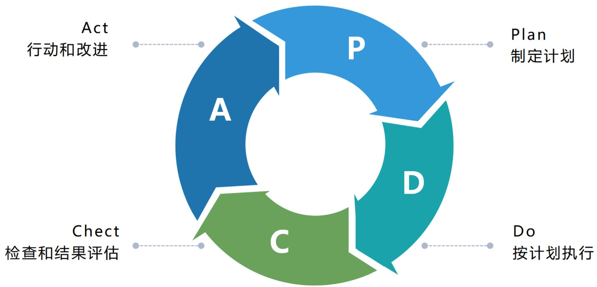

# 三西格玛品质等于

- 每年至少54,000次用药错误处方。  
- 每周电视频道出现27分钟的播出故障时间。  
- 每天芝加哥国际机场发生五次过短或过长着陆。

# 六西格玛品质等于

- 二十五年才有一次用药错误处方。  
- 每周电视频道出现2秒钟的播出故障时间。  
- 全美所有机场十年才发生一次过短或过长着陆。

# 12.2.1 过程概述(背诵)

<table><tr><td>过程</td><td>过程定义</td><td>主要作用</td></tr><tr><td>1.规划质量管理</td><td>识别项目及其可交付成果的质量要求、标准，并书面描述项目将如何证明符合质量要求、标准的过程</td><td>为在整个项目期间如何管理和核实质量提供指南和方向【仅开展一次或仅在项目的预定义点开展】</td></tr><tr><td>2.管理质量</td><td>把组织的质量政策用于项目，并将质量管理计划转化为可执行的质量活动的过程</td><td>①提高实现质量目标的可能性；②识别无效过程和导致质量低劣的原因；③使用控制质量过程的数据和结果向干系人展示项目的总体质量状态【在整个项目期间开展】</td></tr><tr><td>3.控制质量</td><td>为了评估绩效，确保项目输出完整、正确且满足客户期望，而监督和记录质量管理活动执行结果的过程</td><td>①核实项目可交付成果和工作已经达到主要干系人的质量要求，可供最终验收；②确定项目输出是否达到预期目的，这些输出需要满足所有适用标准、要求、法规和规范【在整个项目期间开展】</td></tr></table>

# 5大过程组与质量管理(掌握)

<table><tr><td>10大管理</td><td>启动过程组</td><td>规划过程组</td><td>执行过程组</td><td>监控过程组</td><td>收尾过程组</td></tr><tr><td>项目质量管理</td><td></td><td>①规划质量管理</td><td>②管理质量</td><td>③控制质量</td><td></td></tr></table>

# 12.2.2 裁剪考虑因素(了解)

# 裁剪考虑:

政策合规与审计  
- 标准与法规合规性  
- 持续改进  
- 干系人参与

# 12.2.3 敏捷与适应方法(了解)

为引导变更，敏捷或适应型方法要求多个质量与审核步骤贯穿整个项目，而不是在面临项目结束时才执行。

首先，循环回顾、定期检查质量过程的效果；其次，寻找问题的根本原因；然后，建议实施新的质量改进方法；最后，回顾会议评估试验过程，确定是否可行，是否应继续，做出调整或者直接弃用。

为促进频繁的增量交付，敏捷或适应型方法关注于小批量工作，纳入尽可能多的项目可交付成果的要素，小批量系统的目的是在项目生命周期早期（整体变更成本较低）就能发现不一致和质量问题。

# 12.3 规划质量管理(掌握)

规划质量管理是识别项目及其可交付成果的质量要求、标准，并书面描述项目将如何证明符合质量要求、标准的过程。主要作用是为在整个项目期间如何管理和核实质量提供指南和方向。

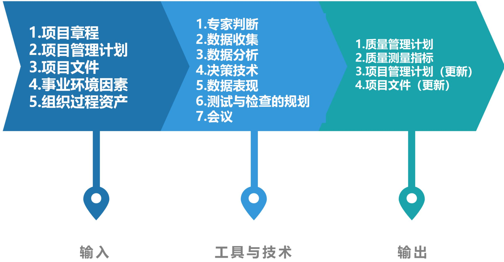

# 12.3.1 输入(了解)

1. 项目章程  
2.项目管理计划  
3.项目文件  
4. 事业环境因素  
5.组织过程资产

# 12.3.2 工具与技术(掌握)

# 1. 专家判断

# 2.数据收集

- 标杆对照：将实际或计划的项目实践或项目的质量标准与可比项目的实践进行比较，以便识别最佳实践，形成改进意见，并为绩效考核提供依据。  
- 头脑风暴：可以向团队成员或主题专家收集数据，以制订最适合新项目的质量管理计划  
- 访谈：有经验的项目参与者、干系人和主题专家有助于了解他们对项目和产品质量的隐性和显性、正式和非正式的需求和期望。应在信任和保密的环境下开展访谈，以获得真实可信、不带偏见的反馈

# 12.3.2 工具与技术(掌握)

# 3.数据分析

<table><tr><td colspan="2">●成本效益分析：用来估算备选方案优势和劣势的财务分析工具，以确定可以创造最佳效益的备选方案。</td></tr><tr><td rowspan="3">●质量成本：</td><td>预防成本：预防特定项目的产品、可交付成果或服务质量低劣所带来的成本。</td></tr><tr><td>评估成本：评估、测量、审计和测试特定项目的产品、可交付成果或服务所带来的成本。</td></tr><tr><td>失败成本(内/外部)：因产品、可交付成果或服务与干系人需求或期望不一致而导致的成本。</td></tr></table>

# 一致性成本

# 预防成本

（打造某种高质量产品）

·培训  
·文件过程  
·设备  
·完成时间

# 评估成本

（评估质量）

- 测试  
- 破坏性试验损失  
·检查

项目花费资金规避失败

# 不一致成本

# 内部失败成本

（项目中发现的失败）

·返工  
·报废

# 外部失败成本

（客户发现的失败）

·债务  
·保修工作  
- 失去业务

项目前后花费的资金（由于失败）

# 12.3.2 工具与技术(掌握)

4.决策技术：多标准决策分析是适用于规划质量管理过程的一种决策技术，多标准决策分析工具（如优先矩阵）可用于识别关键事项和合适的备选方案。先对标准排序和加权，再应用于所有备选方案，计算出各个备选方案的数学得分，然后根据得分对备选方案排序。

# 12.3.2 工具与技术(掌握)

# 5.数据表现

- 流程图：也称过程图，用来显示将一个或多个输入转化成一个或多个输出的过程中，所需步骤顺序和可能分支。它通过映射水平价值链的过程细节来显示活动、决策点分支循环、并行路径及整体处理顺序。图展示了其中一个版本的价值链，即SIPOC（供应商、输入、过程、输出和客户）模型。流程图有助于了解和估算一个过程的质量成本，可帮助改进过程并识别可能出现质量缺陷或可以纳入质量检查的地方。  
- 逻辑数据模型：把组织数据可视化，用业务语言加以描述，不依赖任何特定技术。可用于识别会出现数据完整性或其他问题的地方。  
- 矩阵图：在行列交叉的位置展示因素、原因和目标之间的强弱关系。如L型、T型、Y型、X型、C型和屋顶型矩阵。在规划质量管理过程中，矩阵图有助于识别对项目成功至关重要的质量测量指标。  
- 思维导图：是一种用于可视化组织信息的绘图法。通常是基于单个质量概念创建的，是绘制在空白页面中央的图像，之后再增加以图像、词汇或词条形式表现的想法。可以有助于快速收集项目质量要求、制约因素、依赖关系和联系。

# 流程图

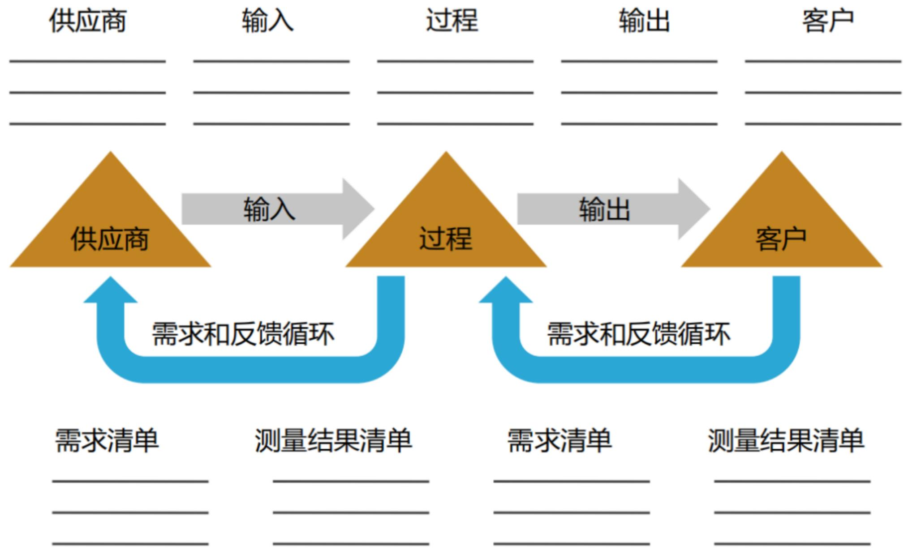

# 12.3.2 工具与技术(掌握)

6. 测试与检查的规划：在规划阶段，项目经理和项目团队决定如何测试或检查产品、可交付成果或服务，以满足干系人的需求和期望，以及如何满足产品的绩效和可靠性目标。不同行业有不同的测试与检查，可能包括软件项目的  $\alpha$  测试和  $\beta$  测试、建筑项目的强度测试、制造和实地测试的检查，以及工程的无损伤测试。  
7.会议

# 1.质量管理计划

质量管理计划是项目管理计划的组成部分，描述如何实施适用的政策、程序和指南以实现质量目标。它描述了项目管理团队为实现一系列项目质量目标所需的活动和资源。

质量管理计划可以是正式或非正式的，非常详细或高度概括的，其风格与详细程度取决于项目的具体需要。

应该在项目早期就对质量管理计划进行评审，以降低因返工而造成的成本超支金额和进度延误次数。

质量管理计划内容一般包括:①项目采用的质量标准;②项目的质量目标;③质量角色与职责;④需要质量审查的项目可交付成果和过程;⑤为项目规划的质量控制和质量管理活动;⑥项目使用的质量工具;⑦与项目有关的主要程序,例如处理不符合要求的情况、纠正措施程序以及持续改进程序等。

# 12.3.3 输出(掌握)

2. 质量测量指标：专用于描述项目或产品属性，以及控制质量过程将如何验证符合程度。例子包括按时完成的任务的百分比、以CPI测量的成本绩效、故障率、识别的日缺陷数量、每月总停机时间、每个代码行的错误、客户满意度分数，以及测试计划所涵盖的需求百分比（即测试覆盖度）。

<table><tr><td>指标项目</td><td>测量方法</td><td>测量指标</td></tr><tr><td>缺陷率</td><td>外部缺陷数/功能点总数</td><td>≤0.01 5%</td></tr><tr><td>测试覆盖率</td><td>实际执行的测试用例数/按覆盖需求要执行的测试用例数</td><td>≥96%</td></tr><tr><td>故障密度</td><td>检测到的故障数目/功能点总数</td><td>≤0.08%</td></tr><tr><td>可用性</td><td>平均无故障时间(平均无故障时间+平均维修时间)</td><td>≥99.9%</td></tr><tr><td>修复性有效性</td><td>满足目标修复时间成功修复的用例数/执行的用例数</td><td>≥96%</td></tr><tr><td>功能的易理解性</td><td>用户能正确描述的界面功能数/可用功能总数</td><td>≥80%</td></tr><tr><td>帮助机制有效性</td><td>用户访问在线帮助后成功完成任务数/测试任务总数</td><td>≥90%</td></tr></table>

# 12.3.3 输出(掌握)

# 3.项目管理计划 (更新)

·风险管理计划  
- 范围基准

# 4.项目文件 (更新)

- 经验教训登记册  
- 需求跟踪矩阵  
·风险登记册  
- 干系人登记册

# 12.4 管理质量(掌握)

管理质量是把组织的质量政策用于项目，并将质量管理计划转化为可执行的质量活动的过程。主要作用：①提高实现质量目标的可能性；②识别无效过程和导致质量低劣的原因；③使用控制质量过程的数据和结果向干系人展示项目的总体质量状态。管理质量过程需要在整个项目期间开展。

管理质量也称为“质量保证”，但“管理质量”的定义比“质量保证”更广，因其可用于非项目工作。

管理质量包括所有质量保证活动，还与产品设计和过程改进有关。管理质量的工作属于质量成本框架中的一致性工作。

管理质量过程执行在项目质量管理计划中所定义的一系列有计划、有系统的行动和过程，有助于:①通过执行有关产品特定方面的设计准则，设计出最优的成熟产品;②建立信心，相信通过质量保证工具和技术（如质量审计和故障分析）可以使未来输出在完工时满足特定的需求和期望;③确保使用质量过程并确保其使用能够满足项目的质量目标;④提高过程和活动的效率与效果,获得更好的成果和绩效并提高干系人的满意度。

# 12.4 管理质量(掌握)

管理质量是所有人的共同职责，包括项目经理、项目团队、项目发起人、执行组织的管理层，甚至是客户。

敏捷项目中，整个项目期间的质量管理由所有团队成员执行；

传统项目中，质量管理通常是特定团队成员的职责。

# 12.4 管理质量(掌握)

<table><tr><td colspan="10">过程和工作产品检查记录表</td></tr><tr><td>项目过程或阶段</td><td>序号</td><td>主要检查项</td><td>归属阶段</td><td>是否执行</td><td>检查标准</td><td>检查结果</td><td>检查说明</td><td>验证日期及结果</td><td>状态</td></tr><tr><td rowspan="3">项目启动</td><td>1</td><td>售前售后交际是否完成?</td><td>项目启动</td><td>是</td><td>C:有售前售后交接单或实际完成项目招标方案NA:项目经理任售前、先行实施项目</td><td></td><td></td><td></td><td></td></tr><tr><td>2</td><td>项目是否在PMIS平台立项?</td><td>项目启动</td><td>是</td><td>C:项目在PMIS平台立项</td><td></td><td></td><td></td><td></td></tr><tr><td>3</td><td>是否对项目实施工作进行规划,并编制项目实施任务书?</td><td>项目启动</td><td>是</td><td>C:有项目实施任务书NA:年度维护项目</td><td></td><td></td><td></td><td></td></tr><tr><td rowspan="3">需求开发</td><td>1</td><td>是否根据需求调研结果,并形成相应的调研记录?</td><td>需求开发</td><td>是</td><td>C:调研报告、调查问卷、原型页面等</td><td></td><td></td><td></td><td></td></tr><tr><td>2</td><td>是否根据需求调研结果导出完整的用户需求</td><td>需求开发</td><td>是</td><td>C:用户需求说明书</td><td></td><td></td><td></td><td></td></tr><tr><td>3</td><td>是否经过用户评审?</td><td>需求开发</td><td>是</td><td>C:有需求评审记录,评审人员主要包括需求主要干系人</td><td></td><td></td><td></td><td></td></tr></table>

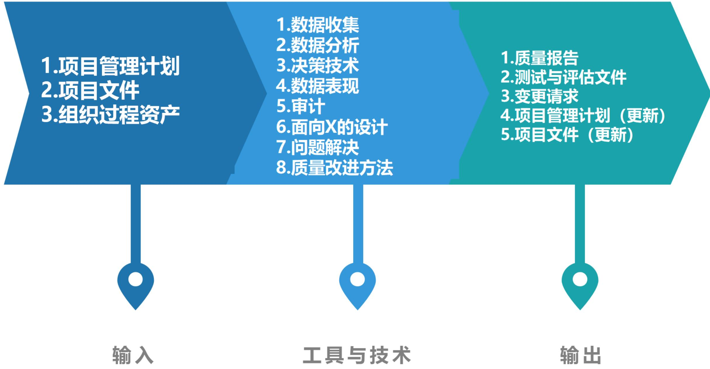

# 1.项目管理计划

# 2.项目文件

经验教训登记册：项目早期与质量管理有关的经验教训，可以运用到项目后期阶段，以提高质量管理的效率与效果。

质量控制测量结果：用于分析和评估项目过程和可交付成果的质量是否符合执行组织的标准或特定要求；也有助于分析这些测量结果的产生过程，以确定实际测量结果的正确程度。

质量测量指标：依据这些质量测量指标设定项目的测试场景和可交付成果，用作改进举措的依据。

风险报告：使用风险报告识别整体项目风险的来源以及整体风险敞口的最重要的驱动因素，这些因素能够影响项目的质量目标。

# 3.组织过程资产

# 12.4.2 工具与技术(掌握)

1. 数据收集：核对单是一种结构化工具，通常列出特定组成部分，用来核实所要求的一系列步骤是否已得到执行或检查需求列表是否已得到满足。基于项目需求和实践，核对单可简可繁。

# 2. 数据分析

<table><tr><td>●备选方案分析：用于评估已识别的可选方案，以选择那些最合适的质量方案或方法</td></tr><tr><td>●文件分析：分析项目控制过程所输出的不同文件，如质量报告、测试报告、绩效报告和偏差分析，可以重点指出可能超出控制范围之外并阻碍项目团队满足特定要求或干系人期望的过程</td></tr><tr><td>●过程分析：可以识别过程改进机会，同时检查在过程期间遇到的问题、制约因素以及非增值活动</td></tr><tr><td>●根本原因分析：确定引起偏差、缺陷或风险的根本原因的一种分析技术，用于识别问题的根本原因并解决问题。消除所有根本原因可以杜绝问题再次发生</td></tr></table>

# 12.4.2 工具与技术(掌握)

3.决策技术：适用于本过程的决策技术包括但不限于多标准决策分析。在讨论影响项目或产品质量的备选方案时，可以使用多标准决策评估多个标准。

“项目”决策可以包括在不同执行情景或供应商中加以选择，“产品”决策可以包括评估生命周期成本、进度、干系人的满意程度，以及与解决产品缺陷有关的风险。

# 4.数据表现

<table><tr><td>亲和图：可以对潜在缺陷成因进行分类，展示最应关注的领域</td></tr><tr><td>因果图：又称“鱼骨图”“why-why分析图”和“石川图”，将问题陈述的原因分解为离散的分支，有助于识别问题的主要原因或根本原因</td></tr><tr><td>流程图：展示了引发缺陷的一系列步骤</td></tr><tr><td>直方图：是一种展示数字数据的条形图，可展示每个可交付成果的缺陷数量、缺陷成因排列、各个过程的不合规次数，或项目或产品缺陷的其他表现形式</td></tr><tr><td>矩阵图：在行列交叉的位置展示因素、原因和目标之间的关系强弱</td></tr><tr><td>散点图：是一种展示两个变量之间关系的图形，它能够展示两支轴的关系，一支轴表示过程、环境或活动的任何要素，另一支轴表示质量缺陷</td></tr></table>

# 人的因素

新人无经验

没有培训

薪资太低

人员疲劳

# 物料因素

特采品过多

原料未检验

物料存放超期

# 环境因素

车间温度太高

车间灯光昏暗

产品对人体有害

物料摆放凌乱

# 方法因素

作业无标准

检验无标准

标准不统一

# 机器因素

没有操作标准

设备老化

未做日常保养

操作不当

# 其他因素

管理混乱

干部不负责

领导不重视

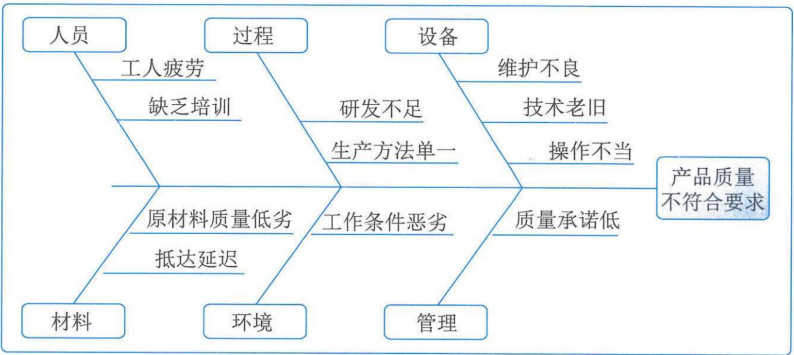

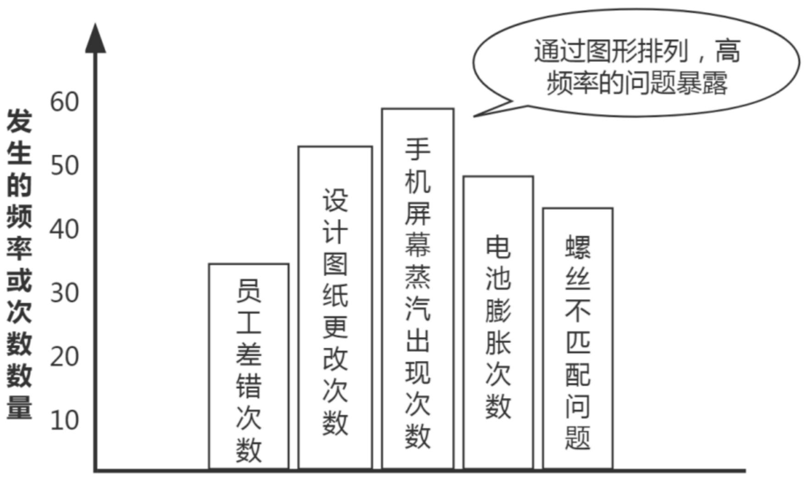

性能原因分析矩阵图  

<table><tr><td>性能原因</td><td>绝缘强度低</td><td>耐压击穿</td><td>功率大</td><td>转速低</td><td>启动性能差</td></tr><tr><td>绝缘漆浓度低</td><td>◎</td><td>○</td><td></td><td></td><td></td></tr><tr><td>预烘时间短</td><td>◎</td><td>○</td><td></td><td></td><td></td></tr><tr><td>定子性能差</td><td></td><td></td><td>◎</td><td>◎</td><td>◎</td></tr><tr><td>转子缺陷</td><td></td><td></td><td>◎</td><td>◎</td><td>○</td></tr><tr><td>风叶不配套</td><td></td><td></td><td>○</td><td>◎</td><td>○</td></tr><tr><td>风叶角度与电机不匹配</td><td></td><td></td><td>◎</td><td>○</td><td></td></tr><tr><td>轴承不合格</td><td></td><td></td><td></td><td>○</td><td></td></tr><tr><td>精加工精度差</td><td></td><td></td><td>◎</td><td>○</td><td>◎</td></tr></table>

$\odot$  ——表示有强相关（或密切相关）关系  $\bigcirc$  ——表示有关系（或弱相关）

主要问题是“功率大”、“转速低”，主要原因是“定子性能差”。

进一步分析定子性能差的影响因素，通过试验，找到解决办法。

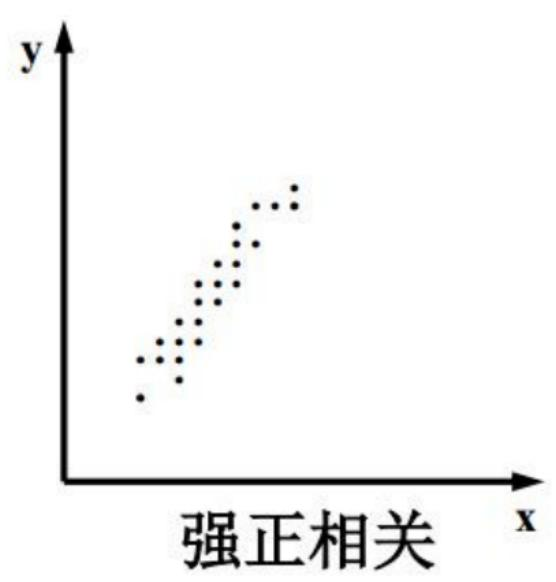

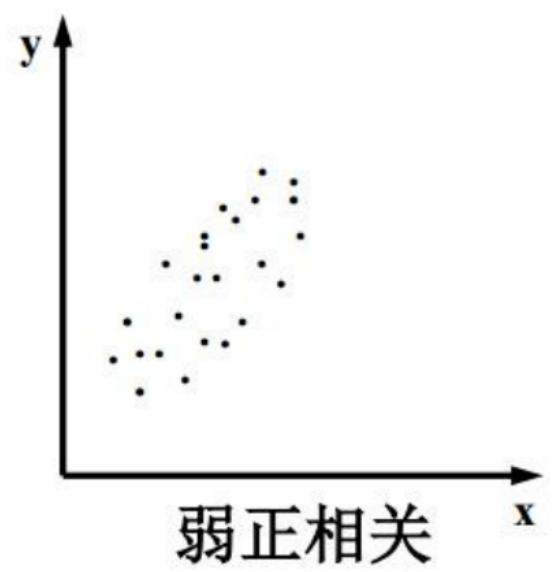

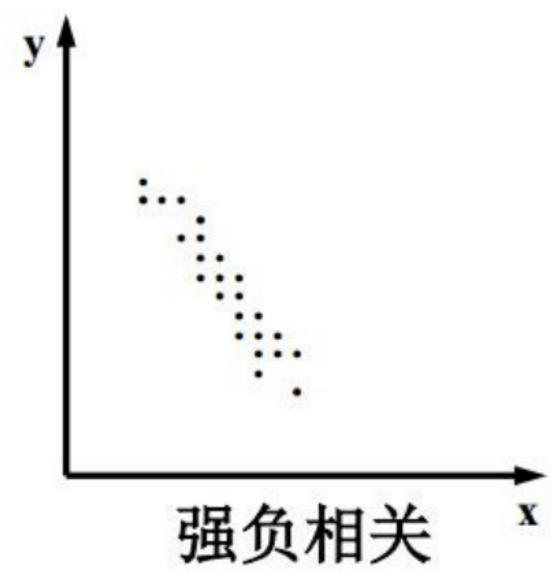

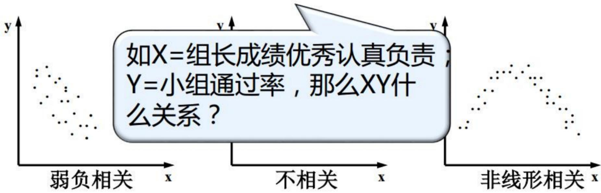

# 12.4.2 工具与技术(掌握)

# 5.审计

审计是用于确定项目活动是否遵循了组织和项目的政策、过程与程序的一种结构化且独立的过程。质量审计通常由项目外部的团队开展，如组织内部审计部门、项目管理办公室（PMO）或组织外部的审计师。

质量审计目标一般包括:①识别全部正在实施的良好及最佳实践;②识别所有违规做法、差距及不足;③分享所在组织和/或行业中类似项目的良好实践;④积极、主动地提供协助,以改进过程的执行,从而帮助团队提高生产效率;⑤强调每次审计都应对组织经验教训知识库的积累做出贡献等。

采取后续措施纠正问题可以降低质量成本，并提高发起人或客户对项目产品的接受度。质量审计可事先安排，也可随机进行；可由内部或外部审计师进行。

质量审计还可确认已批准的变更请求（包括更新、纠正措施、缺陷补救和预防措施）的实施情况。

# 12.4.2 工具与技术(掌握)

6.面向X的设计：是产品设计期间可采用的一系列技术指南，旨在优化设计的特定方面，可以控制或提高产品最终特性。DfX中的X可以是产品开发的不同方面，例如可靠性、调配、装配、制造、成本、服务、可用性、安全性和质量。使用DfX可以降低成本、改进质量、提高绩效和客户满意度。  
7. 问题解决：发现解决问题或应对挑战的解决方案。它包括收集其他信息、具有批判性思维的、创造性的、量化的和/或逻辑性的解决方法。有效和系统化地解决问题是质量保证和质量改进的基本要素。问题可能在控制质量过程或质量审计中发现，也可能与过程或可交付成果有关。使用结构化的问题解决方法有助于消除问题和制定长久有效的解决方案。问题解决方法通常包括以下要素:定义问题，识别根本原因，生成可能的解决方案，选择最佳解决方案，执行解决方案，验证解决方案的有效性等。  
8. 质量改进方法：质量改进的开展，可基于质量控制过程的发现和建议、质量审计的发现或管理质量过程的问题解决。PDCA和六西格玛是最常用于分析和评估改进机会的两种质量改进工具。

# 12.4.3 输出(掌握)

1. 质量报告：可能是图形、数据或定性文件。质量报告的信息可以包含团队上报的质量管理问题，针对过程、项目和产品的改善建议，纠正措施建议，以及在控制质量过程中发现的情况的概述。  
2. 测试与评估文件：可基于行业需求和组织模板创建测试与评估文件。它们是控制质量过程的输入，用于评估质量目标的实现情况。可能包括：专门的核对单、详尽的需求跟踪矩阵。  
3.变更请求：如果管理质量过程期间出现了可能影响项目管理计划任何组成部分、项目文件或项目/产品管理过程的变更，项目经理应提交变更请求并遵循实施整体变更控制过程。

# 12.4.3 输出(掌握)

# 4.项目管理计划 (更新)

- 质量管理计划  
- 范围基准  
- 进度基准  
成本基准

# 5.项目文件 (更新)

- 问题日志  
- 经验教训登记册  
·风险登记册

# 12.5 控制质量(掌握)

控制质量是为了评估绩效，确保项目输出完整、正确且满足客户期望，而监督和记录质量管理活动执行结果的过程。本过程的主要作用：①核实项目可交付成果和工作已经达到主要干系人的质量要求，可供最终验收；②确定项目输出是否达到预期目的，这些输出需要满足所有适用标准、要求、法规和规范。【控制质量过程需要在整个项目期间开展】

控制质量过程的目的是在用户验收和最终交付之前测量产品或服务的完整性、合规性和适用性。通过测量所有步骤、属性和变量，来核实与规划阶段所描述规范的一致性和合规性。

在敏捷或适应型项目中，控制质量活动可能由所有团队成员在整个项目生命周期中执行；

在瀑布或预测型项目中，控制质量活动由特定团队成员在特定时间点或者项目或阶段快结束时执行。

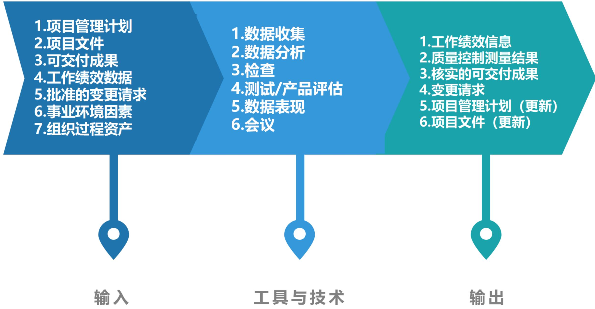

# 1.项目管理计划

# 2.项目文件

- 测试与评估文件：用于评估质量目标的实现程度。  
- 质量测量指标：专用于描述项目或产品属性，以及控制质量过程将如何验证符合程度。  
- 经验教训登记册：在项目早期的经验教训可以运用到后期阶段，以改进质量控制。

# 3.可交付成果

在某一过程、阶段或项目完成时，必须产出的任何独特并可核实的产品、成果或服务能力

作为指导与管理项目工作过程的输出的可交付成果将得到检查，并与项目范围说明书定义的验收标准作比较。

# 12.5.1 输入(掌握)

# 4.工作绩效数据

5. 批准的变更请求：完成局部变更时，如果步骤不完整或不正确，可能会导致不一致和延迟。批准的变更请求的实施须核实，并需要确认完整性、正确性以及是否重新测试。  
6.事业环境因素  
7.组织过程资产

# 12.5.2 工具与技术(掌握)

# 1.数据收集

<table><tr><td>●核对单：有助于以结构化的方式管理控制质量活动</td></tr><tr><td>●核查表：计数表，用于合理排列各种事项，以便有效地收集关于潜在质量问题的有用数据。在开展检查以识别缺陷时，用核查表收集属性数据就特别方便</td></tr><tr><td>●统计抽样：从目标总体中选取部分样本用于检查。抽样的频率和规模应在规划质量管理过程中确定</td></tr><tr><td>●问卷调查：可用于在部署产品或服务之后收集关于客户满意度的数据</td></tr></table>

# 质量核对单

<table><tr><td colspan="2">软件编码核对单</td><td>实施情况</td><td>评价(10分制)</td><td colspan="2">产品验收和发布核对单</td><td>实施情况</td><td>评价(10分制)</td></tr><tr><td rowspan="3">是否进行代码走查?</td><td>☐是</td><td rowspan="3">☐频率和形式:☐走查问题被跟踪和解决☐重大缺陷和问题被记录</td><td rowspan="3"></td><td rowspan="3">是否进行测试验收</td><td>☐是</td><td rowspan="3">☐测试分析报告☐项目验收评审☐产品批准表中签字</td><td rowspan="3"></td></tr><tr><td>☐否(说明原因):</td><td rowspan="2">☐否(说明原因):</td></tr><tr><td>☐其他情况:</td></tr><tr><td rowspan="3">编码是否按形成文档的准则执行?</td><td rowspan="2">☐是</td><td rowspan="3">☐编码方法经过批准☐采用文档和编程规范☐自定义规范</td><td rowspan="3"></td><td rowspan="3">是否进行配置验收</td><td>☐是</td><td rowspan="3">☐产品批准表中签字☐对照配置计划验收</td><td rowspan="3"></td></tr><tr><td rowspan="2">☐否(说明原因):</td></tr><tr><td>☐否(说明原因):</td></tr><tr><td rowspan="2">源代码是否进行配置管理?</td><td>☐是</td><td rowspan="2">☐采用配置工具:☐配置库管理:</td><td rowspan="2"></td><td rowspan="2">项目验收是否按计划完成?</td><td rowspan="2">☐是</td><td rowspan="2">☐按计划完成:☐提前完成并评审☐按计划完成并评审☐采取纠正措施</td><td rowspan="2"></td></tr><tr><td>☐否(说明原因):</td></tr><tr><td rowspan="4">代码的变更是否被标识,检查和关闭?</td><td rowspan="2">☐是</td><td rowspan="4">☐变更记录☐变更批准☐修改说明☐修改人和修改时间记录☐变更被检查和关闭</td><td rowspan="4"></td><td rowspan="2">是否经过公司内部验收评审</td><td>☐是</td><td rowspan="2">☐项目验收评审☐项目评审表☐评审人员签字</td><td rowspan="2"></td></tr><tr><td>☐否(说明原因):</td></tr><tr><td rowspan="2">☐否(说明原因):</td><td rowspan="2">是否对项目进行评分?</td><td>☐是</td><td rowspan="2">☐项目验收考核表</td><td rowspan="2"></td></tr><tr><td>☐否(说明原因):</td></tr><tr><td rowspan="3">单元测试是否进行?</td><td rowspan="2">☐是</td><td rowspan="3">☐和规程要求一致☐单元测试用例☐单元测试分析报告☐BUG统计☐无记录要求;</td><td rowspan="3"></td><td rowspan="2">对合同项目,是否由顾客进行验收?</td><td>☐是</td><td rowspan="2">☐用户验收报告☐系统验收清单☐验收人签字</td><td rowspan="2"></td></tr><tr><td>☐否(说明原因):</td></tr><tr><td>☐否(说明原因):</td><td>是否进行产品封版?</td><td>☐是</td><td>☐封版内容正确☐进行封版标识☐清除开发库</td><td></td></tr><tr><td rowspan="3">是否定期检查项目的编码过程活动</td><td rowspan="2">☐是</td><td rowspan="3">☐软件过程审计报告☐审计报告分发给相关人员</td><td rowspan="3"></td><td rowspan="3">是否对验收通过产品进行内部发布?</td><td>☐是</td><td rowspan="3">☐产品批准表☐ SCM产品发布清单</td><td rowspan="3"></td></tr><tr><td rowspan="2">☐否(说明原因):</td></tr><tr><td>☐否(说明原因):</td></tr></table>

# 核查表

<table><tr><td>缺陷/日期</td><td>日期1</td><td>日期2</td><td>日期3</td><td>日期4</td><td>合计</td></tr><tr><td>小划痕</td><td>1</td><td>2</td><td>2</td><td>2</td><td>7</td></tr><tr><td>大划痕</td><td>0</td><td>1</td><td>0</td><td>0</td><td>1</td></tr><tr><td>弯曲</td><td>3</td><td>3</td><td>1</td><td>2</td><td>9</td></tr><tr><td>缺少组件</td><td>5</td><td>0</td><td>2</td><td>1</td><td>8</td></tr><tr><td>颜色配错</td><td>2</td><td>0</td><td>1</td><td>3</td><td>6</td></tr><tr><td>标签错误</td><td>1</td><td>2</td><td>1</td><td>2</td><td>6</td></tr></table>

# 12.5.2 工具与技术(掌握)

# 2.数据分析

绩效审查：针对实际结果测量、比较和分析规划质量管理过程中定义的质量测量指标  
- 根本原因分析（RAC）：用于识别缺陷成因

3. 检查：是指检验工作产品，以确定是否符合书面标准。检查可在任何层面上进行。可以检查单个活动的成果，也可以检查项目的最终产品。检查也可称为审查、同行审查、审计或巡检等，检查也可用于确认缺陷补救。

# 12.5.2 工具与技术(掌握)

# 4.测试/产品评估

测试是一种有组织的、结构化的调查，旨在根据项目需求提供有关被测产品或服务质量的客观信息。测试的目的是找出产品或服务中存在的错误、缺陷、漏洞或其他不合规问题。用于评估各项需求的测试的类型、数量和程度是项目质量计划的一部分。

测试可以贯穿于整个项目。早期测试有助于识别不合规问题，帮助减少修补不合规组件的成本。

软件测试可能包括单元测试、集成测试、黑盒测试、白盒测试、接口测试、回归测试、 $\alpha$ 测试等;

硬件开发中，测试可能包括环境应力筛选、老化测试、系统测试等。

建筑项目中测试可能包括水泥强度测试、混凝土和易性测试，在建筑工地进行的旨在测试硬化混凝土结构的质量无损伤测试，以及土壤试验；

# 12.5.2 工具与技术(掌握)

# 5.数据表现

- 因果图：用于识别质量缺陷和错误可能造成的结果  
- 控制图：用于确定一个过程是否稳定，或者是否具有可预测的绩效。规格上限和下限是根据要求制定的，反映了可允许的最大值和最小值。项目经理和干系人可基于计算出的控制界限，识别须采取纠正措施的检查点，以预防不在控制界限内的绩效。控制图可用于监测各种类型的输出变量。虽然控制图最常用来跟踪批量生产中的重复性活动，但也可用来监测成本与进度偏差、产量、范围变更频率或其他管理工作成果，以便帮助确定项目管理过程是否受控。  
- 直方图：可按来源或组成部分展示缺陷数量  
- 散点图：可在一支轴上展示计划的绩效，在另一支轴上展示实际绩效

# 6.会议

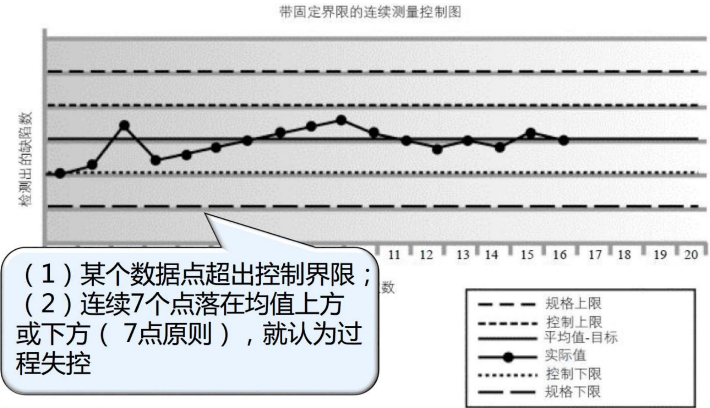

# 12.5.3 输出(掌握)

# 1. 工作绩效信息

2. 质量控制测量结果：是对质量控制活动结果的书面记录，应以质量管理计划所确定的格式加以记录。  
3. 核实的可交付成果：开展控制质量过程的结果是核实的可交付成果，后者又是确认范围过程的一项输入，以便正式验收。

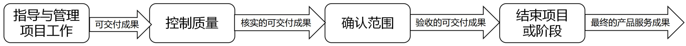

# 4.变更请求

# 5.项目管理计划 (更新)

# 6.项目文件 (更新)

- 问题日志：多次不符合质量要求的可交付成果通常被记录为问题。  
- 测试与评估文件：本过程可能导致测试与评估文件修改，使未来的测试更加有效。  
- 风险登记册：记录在本过程中识别的新风险，并通过风险管理过程进行管理。  
- 经验教训登记册：记录质量缺陷的来源、本应可以规避它们的方法以及有效的处理方式。

# 本章练习

(1) 以下质量管理水平有效性最高的是 ( )。

A.在整个组织内创建一种关注并致力于实现过程和产品质量的文化  
B.将质量融入项目和产品的规划和设计中  
c.通过质量保证检查并纠正过程本身，而不仅仅是特殊缺陷  
D.控制质量过程包括先检测和纠正缺陷，再将可交付成果发送给客户

【答案】A

(2) “为了评估绩效，确保项目输出完整、正确，并满足客户期望，而监督和记录质量管理活动执行结果的过程”是项目质量管理过程中的（）。

A.规划质量管理

B. 管理质量

C.控制质量

D.改进质量

【答案】C

# 本章练习

(3) 项目有关的质量成本中, 属于不一致成本的是 ( )。

A.预防成本

B.评估成本

C.破坏性试验损失成本

D.外部失败成本

【答案】D

(4) 数据表现技术中，“可以对潜在缺陷成因进行分类，展示最应关注领域”的技术称为（）。

A.因果图

B.亲和图

C.直方图

D.散点图

【答案】B

(5) ( ) 不属于“控制质量”过程的输出。

A.质量控制测量结果

B.质量报告

c.工作绩效信息

D.变更请求

【答案】B

# 本章练习

判断下列表述正误，正确的选v错误的选×。

(1) 工作质量是指产品的使用价值及其属性，而产品质量则是工作质量的保证。  
(2) 为引导变更，敏捷方法要求多个质量与审核步骤贯穿整个项目，而不是在面临项目结束时才执行。  
(3) 对管理质量负有责任的岗位与团队，包括项目经理、项目团队、项目发起人、执行组织的管理层，甚至是客户。  
(4) 在问卷调查中识别的缺陷相关成本可被视为COQ模型中的内部失败成本,给组织带来的影响会超出成本本身。

【答案】 (1)  $\times$  (2)  $\vee$  (3)  $\vee$  (4)  $\times$

# 历年真题练习

# 【2023年上半年-第36题】

关于质量的描述，正确的是（）。

A.功能、性能、价格可作为衡量质量的指标  
B.质量与等级相关，等级的高低决定了质量的好坏  
C.预防错误的成本通常高于检查并纠正错误的成本  
D.项目合同通常是进行项目质量管理的主要依据

【答案】D

# 历年真题练习

【2023年上半年-第37题】

(1) 过程的作用之一是识别无效过程和导致质量低劣的原因。

A.规划质量

B. 管理质量

C.检查质量

D.控制质量

【答案】B

# 历年真题练习

# 【2023年上半年-第38题】

关于控制质量的描述，不正确的是（）。

A.控制质量的目的是在用户验收和最终交付之前，测量产品或服务的完整性、合规性和适用性  
B.控制质量时，控制图可用于确定一个过程是否稳定  
C.在瀑布模型或预测型项目中，控制质量活动通常由特定团队成员在整个项目生命周期中持续执行  
D.质量检查既可以针对单个活动的成果，也可以针对项目的最终产品

【答案】C

# 历年真题练习

# 【2023年下半年-第4批次】

与项目有关的质量成本（COQ）包含以下一种或多种成本：（）、评估成本、失败成本（内部/外部）。

A.纠错成本

B. 开发成本

C.测试成本

D.预防成本

【答案】D

# 历年真题练习

# 【2024年上半年-第1批次】

在执行质量管理相关过程时，质量经理对提交的成果进行了审查，将发现的问题记录并给出了纠正措施建议，该质量经理正在执行（）过程。

A.规划质量管理

B.持续改进

C. 管理质量

D.控制质量

【答案】D

# Thank You!

微信公众号：野人老师 淘宝店铺：yeren.taobao.com