# 项目资源管理

# 信息系统项目管理师

# 本章学习建议

根据历年的考试情况来看，由于本章内容属于10大管理的内容，上午、案例分析、论文写作都会进行考查。资源管理一般上午考察3分左右，项目资源包括实物资源和团队资源，实物资源着眼于以有效和高效的方式，分配和使用完成项目所需的实物资源，团队资源指的是人力资源，团队资源管理相对于实物资源管理，包含了技能和能力要求。项目目标的实现，无疑需要资源的保证。所以，资源管理对于项目的成败起着至关重要的作用，在案例分析中出现的次数也很多。

# 本章考情分析

<table><tr><td>年份</td><td>上午选择题</td><td>案例分析题</td><td>论文写作</td><td>合计</td></tr><tr><td>2023年05月</td><td>4</td><td>16</td><td>0</td><td>20</td></tr><tr><td>2023年11月</td><td>机考4分左右</td><td>0</td><td>75（第4批）</td><td>79</td></tr><tr><td>2024年05月</td><td>机考2分左右</td><td>0</td><td>0</td><td>2</td></tr></table>

# 十大知识领域(背诵)

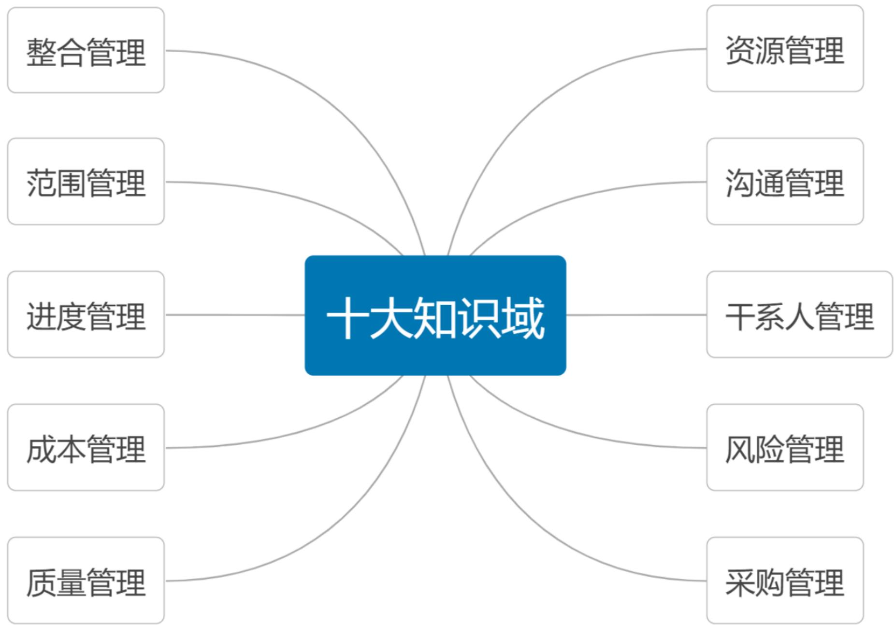

# 资源管理ITO(掌握)

<table><tr><td colspan="5">资源管理</td></tr><tr><td>组</td><td>过程</td><td>输入</td><td>工具和技术</td><td>输出</td></tr><tr><td>规划</td><td>1.规划资源管理</td><td>1.项目章程2.项目管理计划 ·质量管理计划 ·范围基准3.项目文件 ·需求文件 ·项目进度计划 ·风险登记册 ·干系人登记册4.事业环境因素5.组织过程资产</td><td>1.专家判断2.数据表现 ·层级型 ·矩阵型(责任分配矩阵) ·文本型3.组织理论4.会议</td><td>1.资源管理计划2.团队章程3.项目文件(更新) ·假设日志 ·风险登记册</td></tr></table>

# 资源管理ITO(掌握)

<table><tr><td>组</td><td>过程</td><td>输入</td><td>工具和技术</td><td>输出</td></tr><tr><td>规划</td><td>2.估算活动资源</td><td>1.项目管理计划
•范围基准
•资源管理计划
2.项目文件
•假设日志
•风险登记册
•活动属性
•活动清单
•成本估算
•资源日历
3.事业环境因素
4.组织过程资产</td><td>1.专家判断
2.自下而上估算
3.类比估算
4.参数估算
5.数据分析
•备选方案分析
6.项目管理信息系统
7.会议</td><td>1.资源需求
2.估算依据
3.资源分解结构
4.项目文件(更新)
•假设日志
•活动属性
•经验教训登记册</td></tr></table>

# 资源管理ITO(掌握)

<table><tr><td>组</td><td>过程</td><td>输入</td><td>工具和技术</td><td>输出</td></tr><tr><td>执行</td><td>3.获取资源</td><td>1.项目管理计划
·资源管理计划
·成本基准
·采购管理计划
2.项目文件
·项目进度计划
·资源日历
·资源需求
·干系人登记册
3.事业环境因素
4.组织过程资产</td><td>1.决策
·多标准决策分析
2.人际关系与团队技能
·谈判
3.预分派
4.虚拟团队</td><td>1.物质资源分配单
2.项目团队派工单
3.资源日历
4.变更请求
5.项目管理计划(更新)
·资源管理计划
·成本基准
6.项目文件(更新)
·经验教训登记册
·项目进度计划
·资源分解结构
·资源需求
·风险登记册
·干系人登记册
7.事业环境因素(更新)
8.组织过程资产(更新)</td></tr></table>

# 资源管理ITO(掌握)

<table><tr><td>组</td><td>过程</td><td>输入</td><td>工具和技术</td><td>输出</td></tr><tr><td>执行</td><td>4.建设团队</td><td>1.项目管理计划
•资源管理计划
2.项目文件
•团队章程
•项目进度计划
•项目团队派工单
•资源日历
•经验教训登记册
3.事业环境因素
4.组织过程资产</td><td>1.集中办公
2.虚拟团队
3.沟通技术
4.人际关系与团队技能
•冲突管理
•影响力
•激励
•谈判
•团队建设
5.认可与奖励
6.培训
7.个人和团队评估
8.会议</td><td>1.团队绩效评价
2.变更请求
3.项目管理计划(更新)
•资源管理计划
4.项目文件(更新)
•项目进度计划
•项目团队派工单
•资源日历
•经验教训登记册
•团队章程
5.事业环境因素(更新)
6.组织过程资产(更新)</td></tr></table>

# 资源管理ITO(掌握)

<table><tr><td>组</td><td>过程</td><td>输入</td><td>工具和技术</td><td>输出</td></tr><tr><td>执行</td><td>5.管理团队</td><td>1.项目管理计划
·资源管理计划
2.项目文件
·团队章程
·问题日志
·项目团队派工单
·经验教训登记册
3.工作绩效报告
4.团队绩效评价
5.事业环境因素
6.组织过程资产</td><td>1.人际关系与团队技能
·冲突管理
·制定决策
·情商
·影响力
·领导力
2.项目管理信息系统</td><td>1.变更请求
2.项目管理计划(更新)
·资源管理计划
·进度基准
·成本基准
3.项目文件(更新)
·问题日志
·经验教训登记册
·项目团队派工单
4.事业环境因素(更新)</td></tr></table>

# 资源管理ITO(掌握)

<table><tr><td>组</td><td>过程</td><td>输入</td><td>工具和技术</td><td>输出</td></tr><tr><td>监控</td><td>6.控制资源</td><td>1.项目管理计划
·资源管理计划
2.项目文件
·项目进度计划
·问题日志
·资源需求
·资源分解结构
·经验教训登记册
·物质资源分配单
·风险登记册
3.工作绩效数据
4.协议
5.组织过程资产</td><td>1.数据分析
·备选方案分析
·成本效益分析
·绩效审查
·趋势分析
2.问题解决
3.人际关系与团队技能
·谈判
·影响力
4.项目管理信息系统</td><td>1.工作绩效信息
2.变更请求
3.项目管理计划(更新)
·资源管理计划
·进度基准
·成本基准
4.项目文件(更新)
·假设日志
·问题日志
·经验教训登记册
·物质资源分配单
·资源分解结构
·风险登记册</td></tr></table>

# 13 资源管理(掌握)

项目资源管理包括识别、获取和管理所需资源以成功完成项目的各个过程，项目资源管理是为了降低项目成本。

项目资源包括实物资源和团队资源。

实物资源包括设备、材料、设施和基础设施，团队资源指的是人力资源，项目团队成员可能是全职的或兼职的。

# 13.1 管理基础-13.1.1 相关术语和定义(掌握)

# 1.项目团队

项目团队：是执行项目工作，以实现项目目标的一组人员。尽管项目团队成员被分派了特定的角色和职责，让他们全员参与项目规划和决策仍是有益的。

# 2.项目管理团队

项目管理团队：是直接参与项目管理活动的项目团队成员，负责项目管理和领导活动，如各项目阶段的启动、规划、执行、监督、控制和收尾。

项目管理团队也称为核心团队或领导团队。对于小型项目，项目管理职责可由整个项目团队分担，或者由项目经理独自承担。

# 3.项目经理

项目经理：是由执行组织委派，领导项目团队实现项目目标的个人。

项目经理既是项目团队的领导者又是项目团队的管理者。除了项目管理活动，例如启动、规划、执行、监控和关闭等各个项目阶段，项目经理还负责建设高效的团队。

# 13.1 管理基础-13.1.1 相关术语和定义(掌握)

# 4.领导和管理

领导者(Leader)的工作主要涉及3个方面。

(1)确定方向：为团队设定目标，描绘愿景，制定战略；  
(2)统一思想：协调人员，团结尽可能多的力量来实现愿景和项目目标；  
③激励和鼓舞：在向项目目标努力的过程中不可避免地要遇到艰难险阻，领导者要激励和鼓舞大家克服困难奋勇前进。

管理者(Manager)负责某件事情的管理或实现某个目标。

领导者设定目标，管理者率众实现目标。

领导力(Leadership)是让一个群体为了一个共同的目标而努力的能力。领导力是一种影响力，在项目的开始阶段特别需要。

# 13.1 管理基础-13.1.1 相关术语和定义(掌握)

# 5. 权力(Power)

项目经理的权力有5种来源。

(1) 职位权力(Legitimate Power)。来源于管理者在组织中的职位和职权。在高级管理层对项目经理正式授权的基础上，项目经理让员工进行工作的权力。  
(2) 惩罚权力(Coercive Power)。使用降职、扣薪、惩罚、批评、威胁等负面手段的能力。惩罚权力很有力，但会对团队气氛造成破坏。滥用惩罚权力会导致项目失败，应谨慎使用。  
(3) 奖励权力(Reward Power)。给予下属奖励的能力。奖励包括加薪、升职、福利、休假、礼物、口头表扬、认可度、特殊的任务以及其他的奖励员工满意行为的手段。优秀的管理者擅长使用奖励权力激励员工高水平完成工作。  
(4)专家权力(Expert Power)。来源于个人的专业技能。如果项目经理让员工感到他是某些领域的专业权威，那么员工就会在这些领域内遵从项目经理的意见。来自一线的中层管理者经常具有很大的专家权力。  
(5)参照权力(Referent Power)。由于成为别人学习和参照榜样所拥有的力量。这是一种个人魅力。具有优秀品质的领导者的参照权力会很大。

职位权力、惩罚权力、奖励权力来自于组织的授权，专家权力和参照权力来自于管理者自身。

# 13.1 管理基础-13.1.1 相关术语和定义(掌握)

# 6.冲突(Conflict)和竞争(Competition)

冲突并不一定是有害的，“一团和气”的集体不一定是一个高效率的集体。项目经理对于有害的冲突要设法加以解决或减少；对有益的冲突要加以利用，要鼓励团队成员良性竞争。

# 13.1 管理基础-13.1.1 相关术语和定义(掌握)

# 7.团队发展阶段

优秀团队的建设5个阶段：

(1) 形成阶段(Forming)。一个个的个体转变为团队成员，逐渐相互认识并了解项目情况及他们在项目中的角色与职责，开始形成共同目标。团队成员倾向于相互独立，不怎么开诚布公。在本阶段，团队往往对未来有美好的期待。  
(2) 震荡阶段(Storming)。团队成员开始执行分配的任务, 一般会遇到超出预想的困难, 希望被现实打破。个体之间开始争执, 互相指责, 并且怀疑项目经理的能力。  
(3) 规范阶段(Norming)。经过一定时间磨合, 团队成员开始协同工作, 并调整各自的工作习惯和行为来支持团队, 团队成员开始相互信任, 项目经理能得到团队的认可。  
(4) 发挥阶段(Performing)。随着相互之间的配合默契和对项目经理的信任加强, 团队就像一个组织有序的单位那样工作。团队成员之间相互依靠, 平稳高效地解决问题。这时团队成员的集体荣誉感会非常强。  
(5) 解散阶段(Adjourning)。所有工作完成后，项目结束，团队解散。

上述这些阶段通常按顺序进行，然而，团队停滞在某个阶段或退回到较早阶段的情况也并非罕见。如果团队成员曾经共事过，项目团队建设也可跳过某些阶段。

# 13.1 管理基础-13.1.1 相关术语和定义(掌握)

# 8.激励理论

现代项目管理在激励方面的理论基础主要是：马斯洛需求层次理论、赫茨伯格的双因素理论、麦格雷戈的X理论和Y理论、期望理论。

(1) 马斯洛需求层次理论。

(1)生理需求(Physiological needs): 对衣食住行等需求都是生理需求, 常见的激励措施: 员工宿舍、工作餐、工作服、班车、工资、补贴、奖金等。  
(2)安全需求(Safety needs): 包括对人身安全、生活稳定、不致失业以及免遭痛苦、威胁或疾病等的需求。常见的激励措施: 养老保险、医疗保障、长期劳动合同、意外保险、失业保险等。  
③社会交往的需求(Love and belonging needs)：包括对友谊、爱情以及隶属关系的需求。常见的激励措施：定期员工活动、聚会、比赛、俱乐部等。  
④受尊重的需求(Esteem needs):包括自尊心和荣誉感。荣誉来自别人，自尊来自己。常见的激励措施：荣誉性的奖励、形象、地位提升，颁发奖章，作为导师培训别人等。  
⑤自我实现的需求(Self-actualization)：实现自己的潜力，发挥个人能力到最大程度，使自己越来越成为自己所期望的人物。常见的激励措施是：给他更多的空间让他负责、让他成为智囊团、参与决策、参与组织的管理会议等。

# 13.1 管理基础-13.1.1 相关术语和定义(掌握)

马斯洛的需求层次理论  
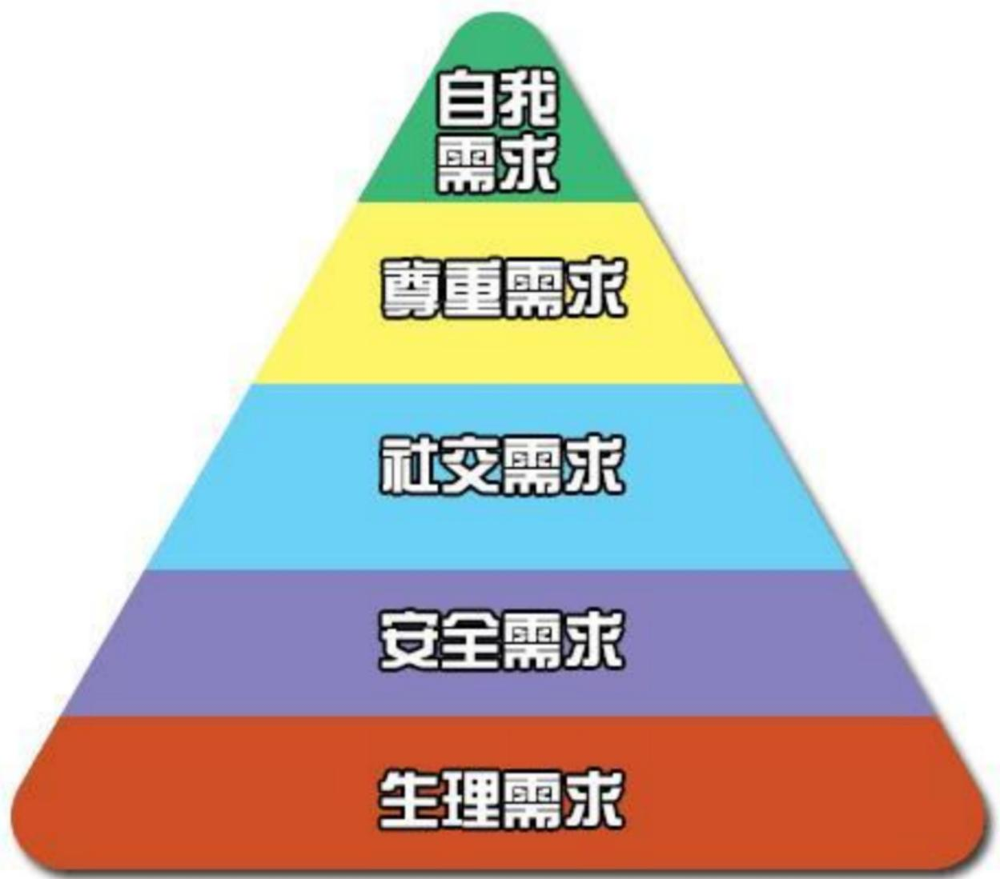  
注：已经满足的需求就不再是激励因素

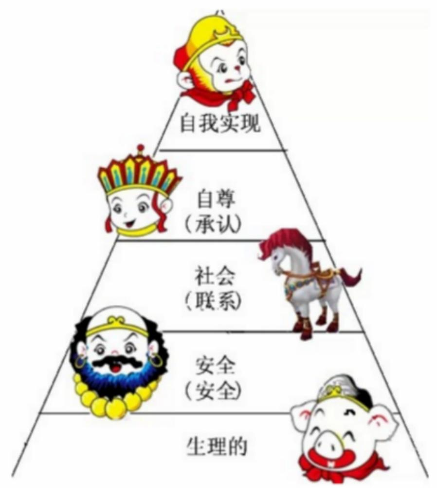

# 13.1 管理基础-13.1.1 相关术语和定义(掌握)

(2) 赫茨伯格双因素理论：

(1)保健因素(HygieneFactor): 工作环境、工资薪水、组织政策、个人生活、管理监督、人际关系等。  
(2)激励因素(Motivator):成就、承认、工作本身、责任、发展机会等。

当保健因素不健全时，人们就会对工作产生不满意感。但即使保健因素很好时，也仅仅可以消除工作中的不满意，却无法增加人们对工作的满意感，所以这些因素是无法起到激励作用的。没有必要过分地改善保健因素，因为这样做只能消除员工对工作的不满情绪，而不能直接提高工作积极性和工作效率。

当激励因素缺乏时，人们就会缺乏进取心，若想持久而高效地激励员工，必须使用激励因素来调动人的积极性。

# 13.1 管理基础-13.1.1 相关术语和定义(掌握)

# (3)麦格雷戈X理论和Y理论

X理论对人性有如下假设：①人天性好逸恶劳，只要有可能就会逃避工作；②人生来就以自我为中心，漠视组织的要求；③人缺乏进取心，逃避责任，甘愿听从指挥，安于现状，没有创造性；④人们通常容易受骗，易受人煽动；⑤人们天生反对改革；⑥人的工作动机就是为了获得经济报酬。

Y理论对人性的假设【与X理论完全相反】：①人天生并不是好逸恶劳，他们热爱工作，从工作得到满足感和成就感；②外来的控制和处罚对人们实现组织的目标不是一个有效的办法，下属能够自我确定目标、自我指挥和自我控制；③在适当的条件下，人们愿意主动承担责任；④大多数人具有一定的想象力和创造力；⑤在现代社会中，人们的智慧和潜能只是部分地得到了发挥，如果给予机会，人们喜欢工作，并渴望发挥其才能。

x理论注重满足员工的生理需求和安全需求，激励仅在生理和安全层次起作用，同时很注重惩罚，认为惩罚是有效的管理工具。

# 13.1 管理基础-13.1.1 相关术语和定义(掌握)

Y理论认为激励在需求的各个层次上都起作用，常用的激励办法是：将员工个人目标与组织目标融合，扩大员工的工作范围，尽可能把员工的工作安排得富有意义并具有挑战性，使其工作之后感到自豪，满足其自尊和自我实现的需要，使员工达到自我激励。

这两个理论各有自己的长处和不足。用X理论可以加强管理，但项目团队成员通常是比较被动地工作。用Y理论可以激发员工主动性，但对于员工把握工作而言可能又放任过度。

# 13.1 管理基础-13.1.1 相关术语和定义(掌握)

# (4) 期望理论

期望理论是一种通过考察人们的努力行为与其所获得的最终奖酬之间的因果关系，来说明激励过程，并以选择合适的行为达到最终的奖酬目标的理论。

期望理论认为，一个目标对人的激励程度受2个因素影响。

(1) 目标效价：指实现该目标对个人有多大价值的主观判断。如果实现该目标对个人来说很有价值，个人的积极性就高；反之，积极性则低。  
(2) 期望值: 指个人对实现该目标可能性大小的主观估计。只有个人认为实现该目标的可能性很大, 才会去努力争取实现, 从而在较高程度上发挥目标的激励作用;

如果个人认为实现该目标的可能性很小，甚至完全没有可能，目标激励作用则小，以至完全没有。期望理论认为，激励水平=目标效价和期望值的乘积，即：激发力量=目标效价×期望值。

# 13.1.2 管理新实践(了解)

项目资源管理的趋势和新实践包括：

(1) 资源管理方法。新的方法有精益管理、准时制（JIT）生产、Kaizen（持续改善）、全员生产维护（TPM）、约束理论  
(2) 情商 (El)。项目经理应提升内在和外在，从而提高个人情商。  
(3) 自组织团队。随着敏捷或适应型方法在IT项目中的应用越来越普遍，自组织团队（无须集中管控运作）越来越多。成功的自组织团队通常由通用的专业人才而不是主题专家组成。  
(4) 虚拟团队/分布式团队。沟通技术（如电子邮件、电话会议、社交媒体、网络会议和视频会议等）的使用，使虚拟团队变得可行。

优势：跨地域、可居家办公、方便行动不便者。

挑战：沟通、经验分享困难、进度和生产率难以跟进。

# 13.2.1 过程概述(背诵)

<table><tr><td>过程</td><td>过程定义</td><td>主要作用</td></tr><tr><td>1.规划资源管理</td><td>定义如何估算、获取、管理和利用实物以及团队项目资源</td><td>根据项目类型和复杂程度确定适用于项目资源的管理方法和管理程度
【仅开展一次或仅在项目的预定义点开展】</td></tr><tr><td>2.估算活动资源</td><td>估算执行项目所需的团队资源，材料、设备和用品的类型和数量</td><td>明确完成项目所需的资源种类、数量和特性
【整个项目期间定期开展】</td></tr><tr><td>3.获取资源</td><td>获取项目所需的团队成员、设施、设备、材料、用品和其他资源</td><td>①概述和指导资源的选择; ②将选择的资源分配给相应的活动【整个项目期间定期开展】</td></tr><tr><td>4.建设团队</td><td>提高工作能力，促进团队成员互动，改善团队整体氛围，提高绩效</td><td>改进团队协作、增强人际关系技能、激励员工、减少摩擦以及提升整体项目绩效
【整个项目期间开展】</td></tr><tr><td>5.管理团队</td><td>管理跟踪团队成员工作表现，提供反馈，解决问题并管理团队变更，以优化项目绩效</td><td>影响团队行为、管理冲突以及解决问题
【整个项目期间开展】</td></tr><tr><td>6.控制资源</td><td>确保按计划为项目分配实物资源，以及根据资源使用计划监督资源实际使用情况，并采取必要纠正措施</td><td>①确保所分配的资源适时、适地可用于项目; 
②资源在不再需要时被释放
【整个项目期间开展】</td></tr></table>

# 5大过程组与项目资源管理(掌握)

<table><tr><td>10大管理</td><td>启动过程组</td><td>规划过程组</td><td>执行过程组</td><td>监控过程组</td><td>收尾过程组</td></tr><tr><td>项目资源管理</td><td></td><td>①规划资源管理
②估算活动资源</td><td>③获取资源
④建设团队
⑤管理团队</td><td>⑥控制资源</td><td></td></tr></table>

# 13.2.2 裁剪考虑因素(了解)

# 裁剪考虑：

- 多元化  
$\bullet$  物理位置  
行业特定资源  
团队成员的获得  
团队管理  
- 生命周期方法

# 13.2.3 敏捷与适应方法(了解)

协作型团队可以促进不同工作活动的快速整合、改善沟通、增加知识分享，同时可以灵活地分配工作。更适合于易变性高且快速变化的项目。

# 13.3 规划资源管理(掌握)

资源规划用于识别和确定一种方法，以确保有足够的资源能够成功完成项目。项目资源可能包括团队成员、用品、材料、设备、服务和设施。

这些资源可以从组织内部资产获得，或者通过采购过程从组织外部获取。

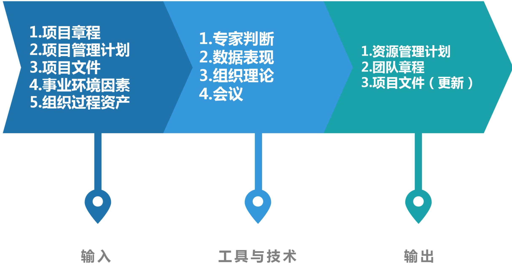

# 13.3.1 输入(掌握)

1. 项目章程  
2.项目管理计划

3.项目文件

- 需求文件：指出了项目所需的资源的类型和数量，并可能影响管理资源的方式。  
- 项目进度计划：提供了所需资源的时间轴。  
- 风险登记册：包含可能影响资源规划的各种威胁和机会的信息。  
- 干系人登记册：有助于识别对项目所需资源有特别兴趣或影响的那些干系人，以及会影响资源使用偏好的干系人。

4.事业环境因素  
5.组织过程资产

# 13.3.2 工具与技术(掌握)

1. 专家判断  
2.数据表现

图表适用于规划资源管理过程的数据表现，大多数格式属于层级型、矩阵型或文本型。所有方法都要确保每个工作包都有明确的责任人，确保全体团队成员都清楚地理解其角色和职责。

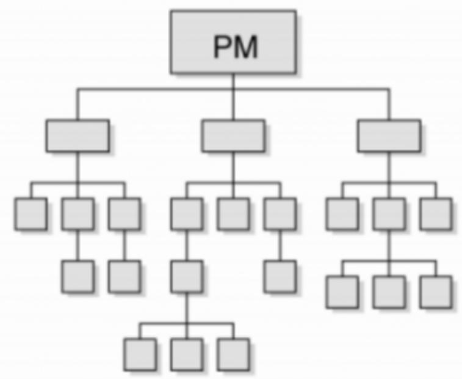  
组织图（层级型）

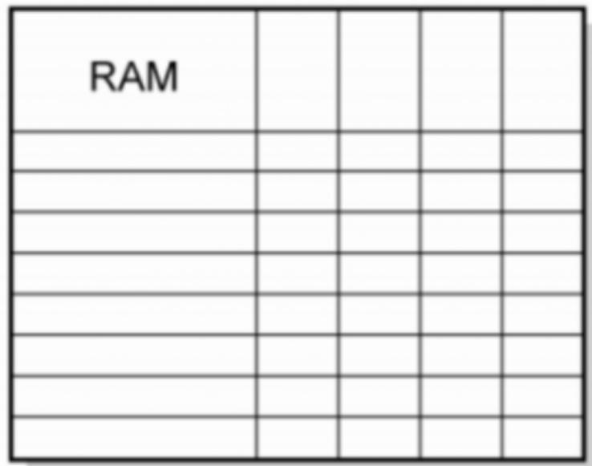  
职责图（矩阵型）

  
角色描述（文本型）

# 13.3.2 工具与技术(掌握)

一般来说，层级型可用于表示高层级角色，而文本型则更适用于记录详细职责。

(1) 层级型：可采用传统的组织结构图，自上而下地显示各种职位及其相互关系。

- 工作分解结构（WBS）：用来显示如何把项目可交付成果分解为工作包，有助于明确高层级的职责。  
- 组织分解结构（OBS）：按照组织现有的部门、单元或团队排列，并在每个部门下列出项目活动或工作包。  
- 资源分解结构：按资源类别和类型，对团队和实物资源的层级列表，用于规划、管理和控制项目工作，每向下一个层级代表对资源的更详细描述，直到信息细到可以与工作分解结构（WBS）相结合。

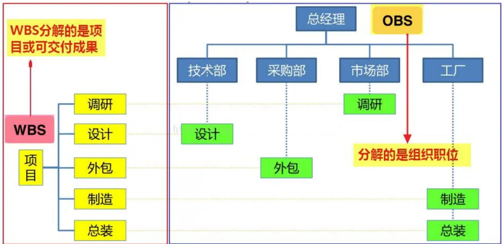

# 13.3.2 工具与技术(掌握)

(2) 矩阵型: 展示项目资源在各个工作包中的任务分配。矩阵型图表的一个例子是职责分配矩阵 (RAM), 它显示了分配给每个工作包的项目资源, 用于说明工作包或活动与项目团队成员之间的关系。在大型项目中, 可以制定多个层次的 RAM;

高层次的RAM可定义项目团队、小组或部门负责WBS中的哪部分工作低层次的RAM则可在各小组内为具体活动分配角色、职责和职权。

RAM的一个例子是RACI（执行、负责、咨询和知情）矩阵。

# 13.3.2 工具与技术(掌握)

<table><tr><td>RACI矩阵</td><td colspan="5">人员</td></tr><tr><td>活动</td><td>张美丽</td><td>李致远</td><td>王智慧</td><td>赵先修</td><td>刘工</td></tr><tr><td>创建章程</td><td>A</td><td>R</td><td>I</td><td>I</td><td>I</td></tr><tr><td>收集需求</td><td>I</td><td>A</td><td>R</td><td>C</td><td>C</td></tr><tr><td>提交变更请求</td><td>I</td><td>A</td><td>R</td><td>R</td><td>C</td></tr><tr><td>制订测试计划</td><td>A</td><td>C</td><td>I</td><td>I</td><td>R</td></tr></table>

注：R执行；A负责；C咨询；I知情。

图13-3 RACI矩阵示例

如图所示，其中最左边的一列表示有待完成的工作（活动）；分配给每项工作的资源可以是个人或小组，项目经理也可根据项目需要，选择“领导”或“资源”等适用词汇，来分配项目责任。如果团队由内部和外部人员组成，则RACI矩阵对明确划分角色和职责特别有用。

# 13.3.2 工具与技术(掌握)

(3) 文本型:如果需要详细描述团队成员的职责, 就可以采用文本型。这种文件有多种名称, 如职位描述、角色 - 职责 - 职权表。这类文件可作为未来项目的模板。  
3.组织理论：阐述个人、团队和组织部门的行为方式。  
4.会议

# 13.3.3 输出(掌握)

1. 资源管理计划。作为项目管理计划的一部分，资源管理计划提供了关于如何分类、分配、管理和释放项目资源的指南。

主要包括：

- 识别资源：用于识别和量化项目所需的团队和实物资源的方法。  
- 获取资源：关于如何获取项目所需的团队和实物资源的指南。  
- 角色与职责：

(1)角色是指在项目中某人承担的职务或分配给某人的职务。  
②职权是指使用项目资源、做出决策、签字批准、验收可交付成果并影响他人开展项目工作的权力。  
③职责是指为完成项目活动，项目团队成员必须履行的职责和工作。  
④能力是指为完成项目活动，项目团队成员须具备的技能和才干。

# 13.3.3 输出(掌握)

- 项目组织图：以图形方式展示项目团队成员及其报告关系。【可以是正式或非正式的，非常详细或高度概括的】  
- 项目团队资源管理：关于如何定义、配备、管理和最终遣散项目团队资源的指南。  
- 培训：针对项目成员的培训策略。  
·团队建设：建设项目团队的方法。  
- 资源控制：依据需要确保实物资源充足可用，并为项目需求优化实物资源采购而采用的方法。包括有关整个项目生命周期期间的库存、设备和用品管理的信息。  
- 认可计划：将给予团队成员哪些认可和奖励，以及何时给予。

# 13.3.3 输出(掌握)

# 2.团队章程

团队章程是为团队创建团队价值观、共识和工作指南的文件。团队章程包括：团队价值观、沟通指南、决策标准和过程、冲突处理过程、会议指南和团队共识。

团队章程对项目团队成员的可接受行为确定了明确的期望，尽早认可并遵守明确的规则，有助于减少误解，提高生产力。

# 3.项目文件（更新）

# 13.4 估算活动资源(掌握)

估算活动资源过程与其他过程紧密相关，例如估算成本过程。例如，设计团队需要熟悉最新的系统设计技术，这些必要的知识可以通过聘请顾问、派设计人员参加技术研讨会等方式来获取。

# 估算活动资源ITO(掌握)

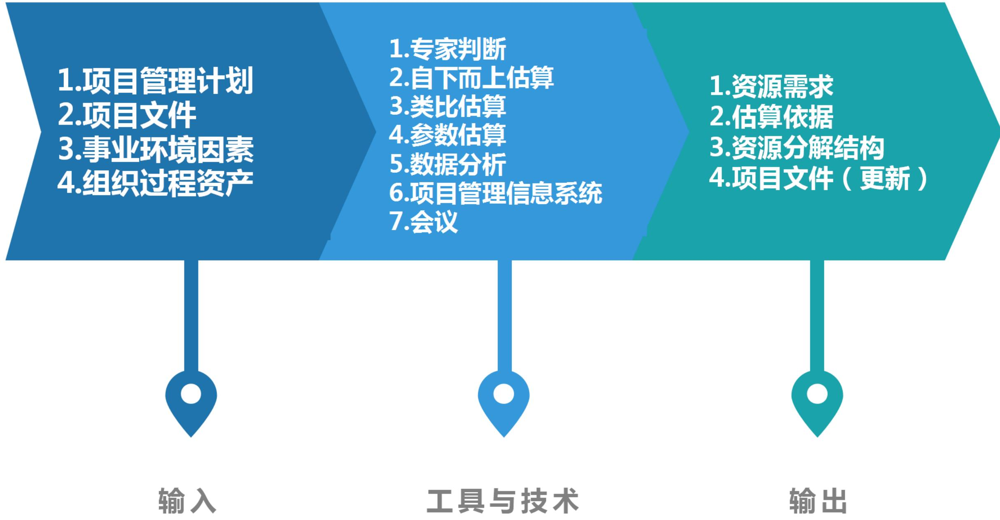

# 13.4.1 输入(掌握)

# 1.项目管理计划

# 2.项目文件

- 假设日志：可能包含有关生产力因素、可用性、成本估算以及工作方法的信息  
- 风险登记册：描述了可能影响资源选择和可用性的各个风险。  
- 活动属性：为估算活动清单中每项活动所需的团队和实物资源提供了数据来源，包括资源需求、强制日期、活动地点、假设条件和制约因素。  
- 活动清单：识别了需要资源的活动。  
- 成本估算：资源成本从数量和技能水平方面会影响资源选择。  
- 资源日历：识别了每种具体资源可用时的工作日、班次、正常营业的上下班时间、周末和公共假期。在规划活动期间，潜在的可用资源信息（如团队资源、设备和材料）用于估算资源可用性。资源日历还规定了在项目期间确定的团队和实物资源何时可用、可用多久。

# 3. 事业环境因素

# 4.组织过程资产

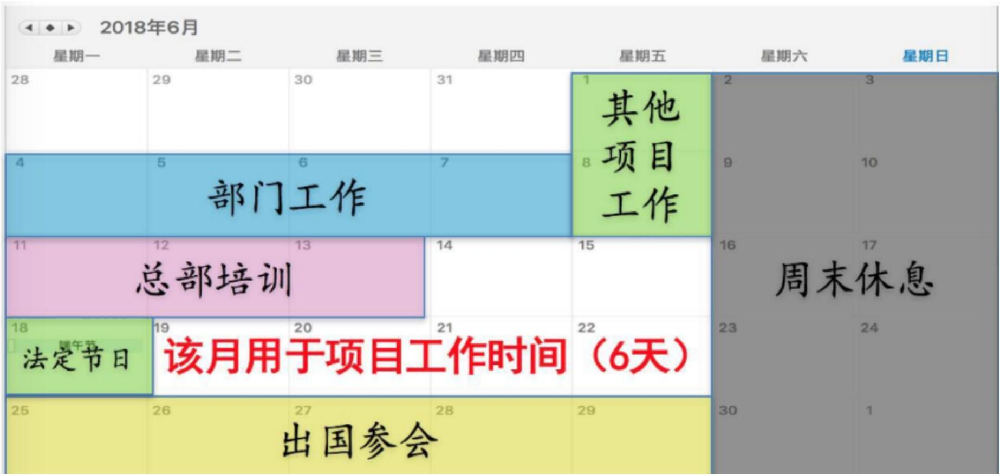

# 13.4.2 工具与技术(掌握)

1. 专家判断  
2. 自下而上估算：首先对团队和实物资源在活动级别上进行估算，然后汇总成工作包、控制账户和总体项目层级上的估算。  
3. 类比估算：将以往类似项目的资源相关信息作为估算未来项目的基础。这是一种快速估算方法，适用于项目经理只能识别WBS的几个高层级的情况。  
4. 参数估算：基于历史数据和项目参数，使用某种算法或历史数据与其他变量之间的统计关系，来计算活动所需的资源数量。例如，一项活动需要4000小时的编码时间，1年之内完成，则需要2人编码（每人每年付出2000小时）。参数估算的准确性取决于参数模型的成熟度和基础数据的可靠性。  
5.数据分析：适用于估算活动资源过程的数据分析技术是备选方案分析，备选方案分析是一种对已识别的可选方案进行评估的技术，用来决定选择哪种方案或使用何种方法来执行项目工作。  
6.项目管理信息系统  
7.会议

# 13.4.3 输出(掌握)

1. 资源需求：识别了各个工作包或工作包中每项活动所需的资源类型和数量，可以汇总这些需求，以估算每个工作包、每个WBS分支以及整个项目所需的资源。  
2. 估算依据：资源估算所需的支持信息的数量和种类，因应用领域而异。但不论其详细程度如何，支持性文件都应该清晰完整地说明资源估算是如何得出的。

# 13.4.3 输出(掌握)

3. 资源分解结构：是资源依类别和类型的层级展现。资源类别包括（但不限于）人力、材料、设备和用品。资源类型则包括技能水平、要求证书、等级水平或适用于项目的其他类型。

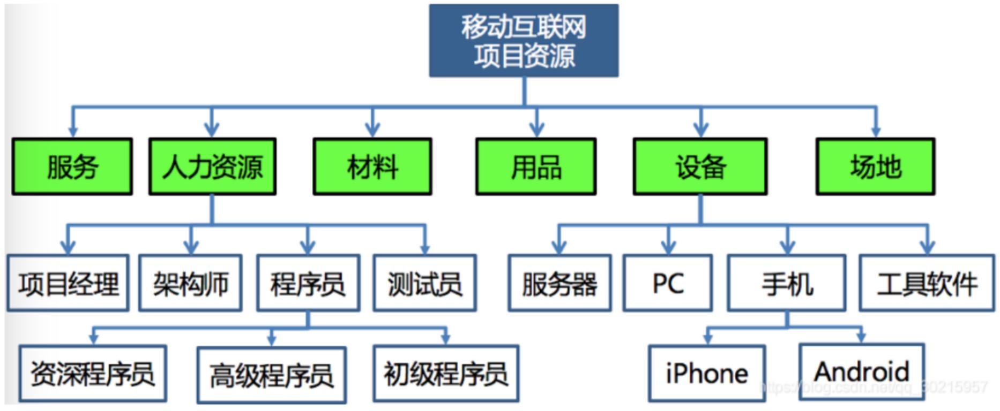

4.项目文件（更新）

# 13.5 获取资源(掌握)

项目所需资源可能来自项目执行组织的内部或外部。内部资源由职能经理或资源经理负责获取（分配），外部资源则通过采购过程获得。

因为集体劳资协议、分包商人员使用、矩阵型项目环境、内外部报告关系或其他原因，项目管理团队有可能没有对资源选择的直接控制权。

获取项目资源过程中的注意事项:

①项目经理或项目团队应该进行有效谈判，并影响那些能为项目提供所需团队和实物资源的人员；  
②不能获得项目所需的资源时，可能会影响项目进度、预算、客户满意度、质量和风险，资源或人员能力不足会降低项目成功的概率，最坏情况下可能导致项目被取消；  
(3)因制约因素（如经济因素或其他项目对资源的占用）而无法获得所需团队资源时，项目经理或项目团队可能不得不使用也许能力和成本不同的替代资源，在不违反法律、规章、强制性规定或其他具体标准的前提下可以使用替代资源等。

# 获取资源ITO(掌握)

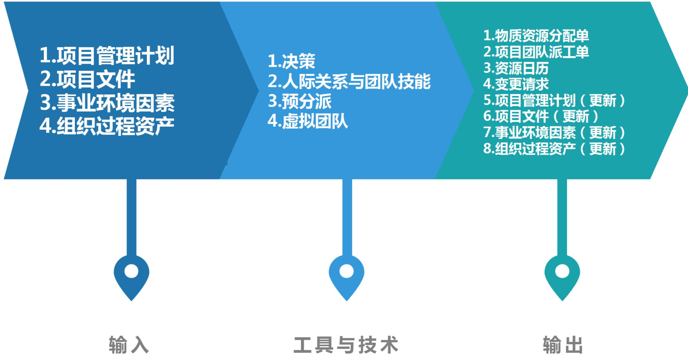

# 13.5.1 输入(掌握)

1.项目管理计划  
2.项目文件  
3.事业环境因素  
4.组织过程资产

# 13.5.2 工具与技术(掌握)

1.决策：适用于获取资源过程的决策技术是多标准决策分析。选择标准包括：可用性、成本、能力、经验、知识、技能、态度、国际因素。  
2.人际关系与团队技能：适用于获取资源过程的人际关系与团队技能是谈判。谈判对象：

- 职能经理：确保项目在要求的时限内获得最佳资源，直到完成职责。  
- 执行组织中的其他项目管理团队：合理分配稀缺或特殊资源。  
- 外部组织和供应商：提供合适的、稀缺的、特殊的、合格的、经认证的或其他特殊的团队或实物资源。特别需要注意与外部谈判有关的政策、惯例、流程、指南、法律及其他标准。

3.预分派：指事先确定项目的实物或团队资源；在如下情况时可采用预分派：

①在竞标过程中承诺分派特定人员进行项目工作；②项目取决于特定人员的专有技能；③在完成资源管理计划的前期工作之前，制定项目章程过程或其他过程已经指定某些团队成员的工作。

# 13.5.2 工具与技术(掌握)

4. 虚拟团队。可定义为具有共同目标，在完成角色任务的过程中很少或没有时间面对面工作的一群人。现代沟通技术（如电子邮件、电话会议、社交媒体、网络会议和视频会议等）使虚拟团队成为可行。

虚拟团队模式使人们有优势：

(1)在组织内部地处不同地理位置的员工之间组建团队;  
(2)为项目团队增加特殊技能，即使相应的专家不在同一地理区域;  
(3)将在家办公的员工纳入团队;  
(4)在工作班次、工作小时或工作日不同的员工之间组建团队;  
(5)将行动不便者或残疾人纳入团队;  
(6)执行那些原本会因差旅费用过高而被搁置或取消的项目;  
(7)节省员工所需的办公室和所有实物设备的开支等。

劣势：需要花更多时间来设定明确的期望、促进沟通、制定冲突解决方法、召集人员参与决策、理解文化差异，以及共享成功喜悦。

# 13.5.3 输出(掌握)

1. 物质资源分配单：记录了项目将使用的材料、设备、用品、地点和其他实物资源。  
2.项目团队派工单：记录了团队成员及其在项目中的角色和职责，可包括项目团队名录，还需要把人员姓名插入项目管理计划的其他部分，如项目组织图和进度计划。  
3.资源日历：识别了每种具体资源可用时的工作日、班次、正常营业的上下班时间、周末和公共假期。  
4.变更请求  
5.项目管理计划（更新）  
6.项目文件（更新）  
7. 事业环境因素（更新）：组织内资源的可用性；组织已使用的消耗资源数量。  
8.组织过程资产（更新）

# 13.6 建设团队(掌握)

可实现团队的高效运行的行为有：①使用开放与有效的沟通；②创造团队建设机遇；③建立团队成员间的信任；④以建设性方式管理冲突；⑤鼓励合作型的问题解决方法；⑥鼓励合作型的决策方法等。

建设项目团队的目标包括:

(1) 提高团队成员的知识和技能：以提高他们完成项目可交付成果的能力，并降低成本、缩短工期和提高质量；  
(2) 提高团队成员之间的信任和认同感：以提高士气、减少冲突和增进团队协作；  
③ 创建富有生气、凝聚力和协作性的团队文化：一是可帮助提高个人和团队生产率，振奋团队精神，促进团队合作；二是促进团队成员之间的交叉培训和辅导，以分享知识和经验；  
(4) 提高团队参与决策的能力：使他们承担起对解决方案的责任，从而提高团队的生产效率，获得更有效和高效的成果等。

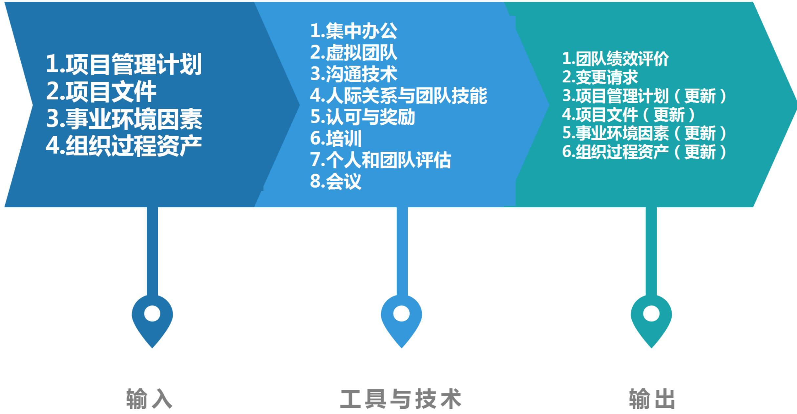

# 13.6.1 输入(掌握)

1.项目管理计划  
2.项目文件  
3.事业环境因素  
4.组织过程资产

# 13.6.2 工具与技术(掌握)

1. 集中办公。指把团队成员安排在同一个地点工作，以增强团队工作能力。既可以是临时的，也可以贯穿整个项目。  
2. 虚拟团队。使用更多技术熟练的资源、降低成本、减少出差及搬迁费用，以及拉近团队成员与供应商和客户或其他重要干系人的距离。  
3. 沟通技术。有助于为集中办公团队营造一个融洽的环境；促进虚拟团队（团队成员分散在不同时区的团队）更好地相互理解。

沟通技术包括:

- 共享门户：共享信息库（如网站、协作软件或内部网）对虚拟项目团队很有帮助。  
- 视频会议：一种可有效地与虚拟团队进行沟通的重要技术。  
- 音频会议：有助于与虚拟团队建立融洽的相互信任的关系。  
- 电子邮件/聊天软件：使用电子邮件和聊天软件定期沟通也是一种有效的方式。

# 13.6.2 工具与技术(掌握)

# 4.人际关系与团队技能

- 冲突管理：项目经理应及时地以建设性方式解决冲突，从而创建高绩效团队  
- 影响力：收集相关的关键信息，在维护相互信任的关系时，用来解决重要问题并达成一致意见。  
- 激励：为采取行动提供了理由。提高团队参与决策的能力并鼓励独立工作  
- 谈判：团队成员之间的谈判旨在就项目需求达成共识。  
- 团队建设：通过举办各种活动，强化团队的社交关系，打造积极合作的工作环境。

# 5.认可与奖励

需要对成员的优良行为给予认可与奖励。最初的奖励计划是在规划资源管理过程中编制的。可以正式或非正式的。

项目经理应该在整个项目生命周期中尽可能地给予表彰，而不是等到项目完成时才给予。

# 13.6.2 工具与技术(掌握)

# 6. 培训

培训包括旨在提高项目团队成员能力的全部活动，可以是正式的或非正式的，方式包括课堂培训、在线培训、计算机辅助培训、在岗培训（由其他项目团队成员提供）、辅导及训练。

如果项目团队成员缺乏必要的管理或技术技能，可以把对这种技能的培养作为项目工作的一部分。

# 7.个人和团队评估

个人和团队评估工具能让项目经理和项目团队洞察成员的优势和劣势。

这些工具可帮助项目经理评估团队成员的偏好和愿望、团队成员如何处理和整理信息、如何制定决策，以及团队成员如何与他人打交道。评估工具有：态度调查、专项评估、结构化访谈、能力测试及焦点小组。这些工具有利于增进团队成员间的理解、信任、承诺和沟通，在整个项目期间不断提高团队成效。

# 8.会议

# 13.6.3 输出(掌握)

# 1.团队绩效评价。

评价团队有效性的指标可包括:

(1)个人技能的改进  
(2)团队能力的改进  
(3)团队成员离职率的降低  
(4)团队凝聚力的加强

以上指标的提升都可以促进团队成员更好的工作，提高项目绩效。

# 2. 变更请求

3.项目管理计划（更新）  
4.项目文件（更新）  
5. 事业环境因素（更新）：员工发展计划的记录，技能评估等。  
6.组织过程资产（更新）

# 13.7 管理团队(掌握)

进行团队管理，需要综合运用各种技能，特别是沟通、冲突管理、谈判和领导技能。

项目经理应留意团队成员是否有意愿和能力完成工作，然后相应地调整管理和领导力方式。相对于那些已展现出能力和有经验的团队成员，技术能力较低的团队成员更需要强化监督。

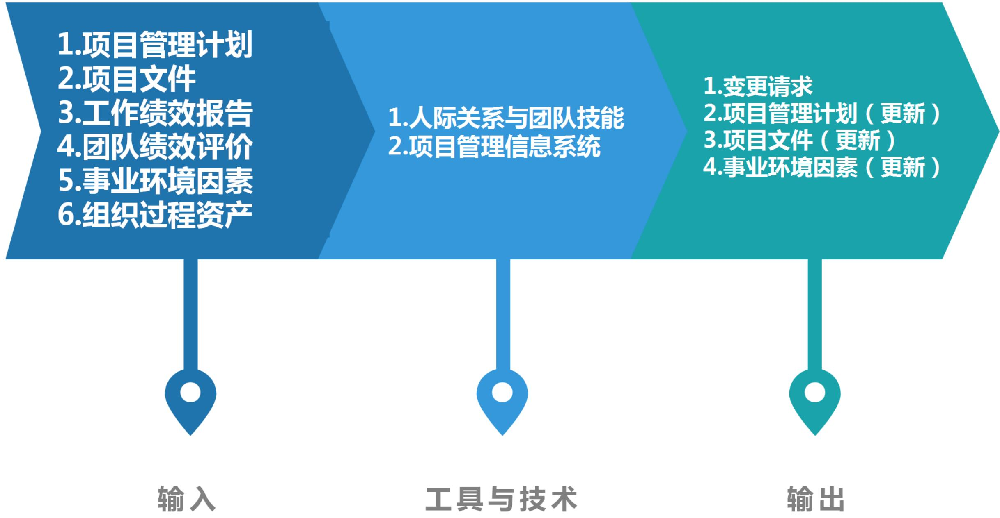

1.项目管理计划  
2.项目文件

- 团队章程：为团队应如何决策、举行会议和解决冲突提供指南。  
- 问题日志：在管理项目团队过程中，总会出现各种问题，此时可用问题日志记录由谁负责在目标日期内解决特定问题，并监督解决情况。  
- 项目团队派工单：识别了团队成员的角色与职责。  
- 经验教训登记册：项目早期的经验教训可以运用到项目后期阶段，以提高团队管理的效率与效果。

3.工作绩效报告  
4.团队绩效评价  
5. 事业环境因素  
6.组织过程资产

# 13.7.2 工具与技术(掌握)

# 1.人际关系与团队技能。

技能包括冲突管理、制定决策、情商、影响和领导力。

(1) 冲突管理。冲突不可避免。冲突的来源包括资源稀缺、进度优先级排序和个人工作风格差异等。采用团队基本规则、团队规范及成熟的项目管理实践（如沟通规划和角色定义），可以减少冲突的数量。

假如意见分歧成为负面因素，应该首先由项目团队成员负责解决；如果冲突升级，项目经理应提供协助，促成满意的解决方案，采用直接和合作的方式，尽早并且通常是在私下处理冲突。如果破坏性冲突继续存在，则可使用正式程序，包括采取惩戒措施。

影响冲突解决方法的因素包括：①冲突的重要性与激烈程度；②解决冲突的紧迫性；③涉及冲突的人员的相对权力；④维持良好关系的重要性；⑤永久或暂时解决冲突的动机等。

# 13.7.2 工具与技术(掌握)

5种常用的冲突解决方法：

- 撤退 / 回避：从实际或潜在冲突中退出，将问题推迟到准备充分的时候，或者将问题推给其他人员解决。  
- 缓和 / 包容：强调一致而非差异；为维持和谐与关系而退让一步，考虑其他方的需要。  
- 妥协 / 调解：为了暂时或部分解决冲突，寻找能让各方都在一定程度上满意的方案，但这种方法有时会导致“双输”局面。  
- 强迫 / 命令：以牺牲其他方为代价，推行某一方的观点；只提供赢 - 输方案。通常是利用权力来强行解决紧急问题，这种方法通常会导致“赢 - 输”局面。  
- 合作 / 解决问题：综合考虑不同的观点和意见，采用合作的态度和开放式对话引导各方达成共识和承诺，这种方法可以带来双赢局面。

# 13.7.2 工具与技术(掌握)

(2) 制定决策。是指谈判能力以及影响组织与项目管理团队的能力，而不是决策工具集所描述的一系列工具。  
(3) 情商。项目管理团队能通过情商来了解、评估及控制项目团队成员的情绪，预测团队成员的行为，确认团队成员的关注点及跟踪团队成员的问题，来达到减轻压力、加强合作的目的。  
(4) 影响。在矩阵环境中, 项目经理对团队成员通常没有或仅有很小的命令职权, 所以他们适时影响干系人的能力, 对保证项目成功非常关键。影响力主要体现在如下方面: 说服他人; 清晰表达观点和立场; 积极且有效的倾听; 了解并综合考虑各种观点; 收集相关信息, 在维护相互信任的关系下, 解决问题并达成一致意见等。  
(5)领导力。是领导团队、激励团队做好本职工作的能力。领导力在项目生命周期中的所有阶段都很重要。

# 2.项目管理信息系统

# 13.7.3 输出(掌握)

1. 变更请求：人员配备变更，无论是自主选择还是由不可控事件造成，都会干扰项目团队，这种干扰可能导致进度落后或预算超支。人员配备变更包括转派人员、外包部分工作和替换离职人员。  
2.项目管理计划（更新）  
3.项目文件（更新）  
4.事业环境因素（更新）

# 13.8 控制资源(掌握)

控制资源过程应在所有项目阶段和整个项目生命周期期间持续开展，且适时、适地和适量地分配和释放资源，使项目能够持续进行。控制资源过程重点关注实物资源。管理团队过程重点关注人力资源。

控制资源过程关注：①监督资源支出；②及时识别和处理资源缺乏/剩余情况；③确保根据计划和项目需求使用并释放资源；④出现资源相关问题时通知相应干系人；⑤影响可以导致资源使用变更的因素；⑥在变更实际发生时对其进行管理等。

进度基准或成本基准的任何变更，都必须经过实施整体变更控制过程的审批。

# 控制资源ITO(掌握)

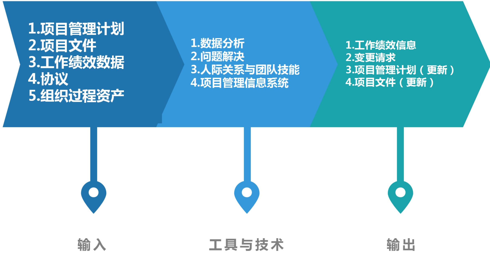

# 13.8.1 输入(掌握)

# 1.项目管理计划

# 2.项目文件

- 项目进度计划：展示了项目在何时何地需要哪些资源。  
- 问题日志：用于识别有关缺乏资源、原材料供应延迟和低等级原材料等问题。  
- 资源需求：识别了项目所需的材料、设备、用品和其他资源。  
- 资源分解结构：为项目过程中需要替换或重新获取资源的情况提供参考。  
- 经验教训登记册：在项目早期获得的经验教训可以运用到后期阶段，以改进实物资源控制。  
- 物质资源分配单：描述了资源的预期使用情况以及资源的详细信息，例如类型、数量、地点以及属于组织内部资源还是外购资源。  
- 风险登记册：识别了可能会影响设备、材料或用品的单个风险。

# 3.工作绩效数据

# 4.协议

# 5.组织过程资产

# 13.8.2 工具与技术(掌握)

# 1.数据分析

适用于控制资源过程的数据分析技术主要包括：

<table><tr><td>●备选方案分析：有助于选择最佳解决方案以纠正资源使用偏差，可将加班和增加团队资源等备选方案与延期交付或阶段性交付比较，以权衡利弊。</td></tr><tr><td>●成本效益分析：有助于项目成本出现差异时确定最佳的纠正措施。</td></tr><tr><td>●绩效审查：测量、比较和分析计划的资源使用和实际资源使用的不同。分析成本和进度工作绩效信息有助于指出可能影响资源使用的问题。</td></tr><tr><td>●趋势分析：基于当前绩效信息来确定未来项目阶段所需的资源。趋势分析检查项目绩效随时间的变化情况，可用于确定绩效是在改善还是在恶化。</td></tr></table>

2. 问题解决：可能会用到一系列工具，有助于项目经理解决控制资源过程中出现的问题。

# 13.8.2 工具与技术(掌握)

# 3.人际关系与团队技能（软技能，个人能力）

- 谈判：项目经理需要就增加实物资源、变更实物资源或资源相关成本进行谈判  
$\bullet$  影响力：有助于项目经理及时解决问题并获得所需资源

4.项目管理信息系统：可包括资源管理或进度计划软件，用于监督资源的使用情况，协助确保合适的资源适时、适地用于合适的活动。

# 13.8.3 输出(掌握)

1. 工作绩效信息  
2.变更请求  
3.项目管理计划（更新）  
4.项目文件（更新）

# 本章练习

(1) 项目经理对于 ( ) 的冲突要设法加以 ( ) ; 对 ( ) 的冲突要加以利用,要鼓励团队成员良性竞争。

A.有害，解决或减少，有益 
B.有益，解决或减少，有害  
B.有害，解决或增加，有益 
D.有益，鼓励或增加，有害

【答案】A

(2) 使用项目资源、做出决策、签字批准、验收可交付成果并影响他人开展项目工作的权力，称之为（）。

A.角色

B.职责

C. 职权

D.能力

【答案】C

# 本章练习

(3) 获取资源过程的输出中，（）识别了每种具体资源可用时的工作日、班次、正常营业的上下班时间、周末和公共假期。

A.组织过程资产更新 
B.物质资源分配单 
C.项目团队派工单 
D.资源日历【答案】D

(4) 虚拟团队的使用能带来很多好处, 不包括 ( )。

A. 减少出差及搬迁费用  
B. 减少信息分享带来的安全风险  
C.利用技术来营造在线团队环境  
D.拉近团队成员与供应商、客户或其他重要干系人的距离

【答案】B

# 本章练习

(5) 评价团队有效性的指标，不包括（）。

A.个人技能的改进

B.团队成员离职率的提升

B.团队能力的改进

D.团队凝聚力的加强

【答案】B

# 本章练习

判断下列表述正误，正确的选√，错误的选×。

(1) 缓和/包容是指, 为了暂时或部分解决冲突, 寻找能让各方都在一定程度上满意的方案, 但这种方法有时会导致 “双输” 局面。  
(2) 通俗地说, 领导者设定目标, 管理者率众实现目标。  
(3) 冲突并不一定是有害的，“一团和气”的集体不一定是一个高效率的集体。  
(4) 组织分解结构用来显示如何把项目可交付成果分解为工作包, 这有助于明确高层级的职责。

【答案】(1)  $\times (2) \vee (3) \vee (4) \times$

# 历年真题练习

【2023年上半年-第39题】

( )不属于团队章程的内容。

A.团队价值观

B.资源日历

C.沟通指南

D. 冲突处理过程

【答案】B

# 历年真题练习

# 【2023年上半年-第40题】

关于团队管理的描述，不正确的是（）。

A.滥用惩罚权力可能会导致项目失败，应谨慎使用  
B.在赫茨伯格双因素理论中，保健因素的满足可以消除不满，激励因素的满足可以产生满意感  
C.奖励权利来自于组织的授权，参照权利来自于管理者自身  
D.X理论可以激发员工主动性，Y理论注重加强管理与惩罚

【答案】D

# 历年真题练习

# 【2023年上半年-第41题】

（）不是虚拟团队的优势。

A.更好地利用不在同一地理区域的专家的专业技术  
B.提高沟通效率，便于分享知识和经验  
C.将在家办公的员工纳入团队  
D.节约差旅费用和办公场地费用

【答案】B

# 历年真题练习

【2023年上半年-第42题】

( ) 过程的主要作用是确保所分配的资源可适时、适地用于项目。

A.规划资源

B.获取资源

C.估算活动资源

D.控制资源

【答案】D

# 历年真题练习

【2023年下半年-第2批次自编】

（）是指事先确定项目的实物或团队资源

A.预分派

B. 虚拟团队

C.集中办公

D.冲突管理

【答案】A

# 历年真题练习

# 【2024年上半年-第1批次】

在获取资源过程中，（）情况下不需要采用预分派。

A.在完成资源管理计划的前期工作之前，制定项目章程过程或其他过程已经指定了某些团队成员的工作  
B.项目需要采购外部资源  
C.在竞标过程中承诺分派特定人员进行项目工作  
D.项目取决于特定人员的专有技能

【答案】B

