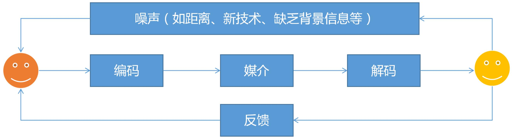
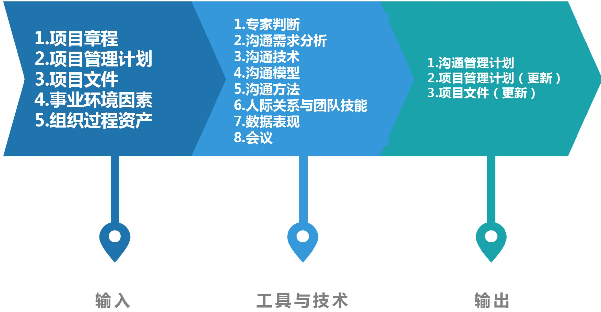
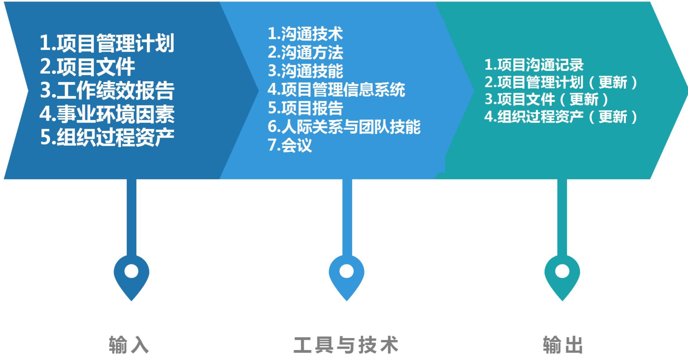
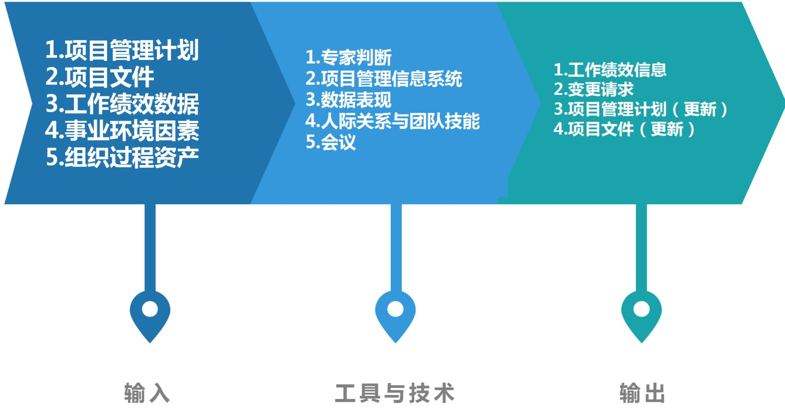

# 项目沟通管理

# 信息系统项目管理师

# 本章学习建议

根据历年的考试情况来看，由于本章内容属于10大管理的内容，上午、案例分析、论文写作都会进行考查。沟通管理和干系人一般上午考察4-6分左右，沟通部分上午大概2-3分左右，项目经理的大部分时间（ $80\% \sim 90\%$ ）都在进行各方面各类型沟通工作，而项目管理要求沟通是主动和受控的，沟通也涉及项目的各个阶段，出现问题绝大多数可能是沟通出现了问题，沟通管理也非常重要，在案例分析中出现的问题也较多。

# 本章考情分析

<table><tr><td>年份</td><td>上午选择题</td><td>案例分析题</td><td>论文写作</td><td>合计</td></tr><tr><td>2023年05月</td><td>3</td><td>6</td><td>0</td><td>9</td></tr><tr><td>2023年11月</td><td>机考3分左右</td><td>5分（第1批）
10分（第2批）</td><td>0</td><td>每个批次10分左右</td></tr><tr><td>2024年05月</td><td>机考3分左右</td><td>0</td><td>0</td><td>3</td></tr></table>

# 十大知识领域(背诵)

# 沟通管理ITO(掌握)

<table><tr><td colspan="5">沟通管理</td></tr><tr><td>组</td><td>过程</td><td>输入</td><td>工具和技术</td><td>输出</td></tr><tr><td>规划</td><td>1.规划沟通管理</td><td>1.项目章程2.项目管理计划·资源管理计划·干系人参与计划3.项目文件·需求文件·干系人登记册4.事业环境因素5.组织过程资产</td><td>1.专家判断2.沟通需求分析3.沟通技术4.沟通模型5.沟通方法6.人际关系与团队技能·沟通风格评估·政策意识·文化意识7.数据表现·干系人参与度评估矩阵8.会议</td><td>1.沟通管理计划2.项目管理计划(更新)·干系人参与计划3.项目文件(更新)·干系人登记册·项目进度计划</td></tr></table>

# 沟通管理ITO(掌握)

<table><tr><td>组</td><td>过程</td><td>输入</td><td>工具和技术</td><td>输出</td></tr><tr><td>执行</td><td>2.管理沟通</td><td>1.项目管理计划
·资源管理计划
·沟通管理计划
·干系人参与计划
2.项目文件
·变更日志
·问题日志
·经验教训登记册
·质量报告
·风险报告
·干系人登记册
3.工作绩效报告
4.事业环境因素
5.组织过程资产</td><td>1.沟通技术
2.沟通方法
3.沟通技能
·沟通胜任力
·反馈
·非口头技能
·演示
4.项目管理信息系统
5.项目报告
6.人际关系与团队技能
·积极倾听
·冲突管理
·文化意识
·会议管理
·人际交往
·政策意识
7.会议</td><td>1.项目沟通记录
2.项目管理计划(更新)
·沟通管理计划
·干系人参与计划
3.项目文件(更新)
·问题日志
·经验教训登记册
·项目进度计划
·风险登记册
·干系人登记册
4.组织过程资产(更新)</td></tr></table>

# 沟通管理ITO(掌握)

<table><tr><td>组</td><td>过程</td><td>输入</td><td>工具和技术</td><td>输出</td></tr><tr><td>监控</td><td>3.监督沟通</td><td>1.项目管理计划
·资源管理计划
·沟通管理计划
·干系人参与计划
2.项目文件
·问题日志
·经验教训登记册
·项目沟通记录
3.工作绩效数据
4.事业环境因素
5.组织过程资产</td><td>1.专家判断
2.项目管理信息系统
3.数据表现
·干系人参与度评估矩阵
4.人际关系与团队技能
·观察/交谈
5.会议</td><td>1.工作绩效信息
2.变更请求
3.项目管理计划(更新)
·沟通管理计划
·干系人参与计划
4.项目文件(更新)
·问题日志
·经验教训登记册
·干系人登记册</td></tr></table>

# 14.1 管理基础-14.1.1 沟通(掌握)

项目沟通管理由两部分组成：一是制定策略，确保沟通对干系人行之有效；二是执行必要活动以落实沟通策略。

沟通是指用各种可能的方式来发送或接收信息。具体形式包括：书面形式、口头形式、正式或非正式形式、手势动作、媒体形式、遣词造句。

# 沟通模型的关键要素包括：

- 编码：把思想或想法转化为他人能理解的语言。  
- 信息和反馈信息：编码过程所得到的结果。  
- 媒介：用来传递信息的方法。  
- 噪声：干扰信息传输和理解的一切因素。  
- 解码：把信息还原成有意义的思想或想法（最易发生误解的环节）。

# 14.1.2 沟通模型(了解)

沟通模型包含5个基本状态：已发送、已收到、已理解、已认可、已转化为积极的行动。

(1) 已发送：信息已发送。  
(2) 已收到：对方信息已收到。但这并不表示对方有意图去读取、理解或解决信息。  
(3) 已理解：正确地消化和理解信息中的内容是简单接收信息中关键的一环。  
(4) 已认可: 理解了传达的信息并不代表对方已同意这个观点。或许对方明白了发送者的意思, 但完全不同意。所以在两个聪明的、有主见的人之间达成一致既复杂又耗时, 尤其是两个人的观点不能清晰地向对方阐述的时候。因此, 达成一致仍然是做出项目决策和有效沟通的关键一环。  
(5) 已转化为积极的行动: 正确地理解和达成一致的认可比较难, 但更加困难的是让对方转化为实际的、积极的行动, 而且是方向正确无误的行动。这是整个过程中最难的一环, 通常需要反复地沟通, 在一定的监督或帮助下才能较好地完成。

# 14.1.3 沟通分类(了解)

<table><tr><td colspan="2">沟通分类</td></tr><tr><td>内部沟通：项目内部或组织内部的干系人</td><td>外部沟通：外部干系人，如客户、供应商、其他项目、组织、政府、公众和环保倡导者</td></tr><tr><td>正式沟通：报告、正式会议（定期或临时）、会议议程记录、干系人简报和演示</td><td>非正式沟通：电子邮件、社交媒体、网站和非正式临时讨论的一般沟通活动</td></tr><tr><td>层级沟通-垂直：采取向上（针对高层）、向下（针对团队成员）</td><td>层级沟通-水平：横向（针对同级项目经理或其他人员）等不同的沟通方式</td></tr><tr><td>官方沟通：年报、呈交监管机构或政府部门的报告</td><td>非官方沟通：用灵活（往往为非正式）的手段</td></tr><tr><td>书面：社交媒体和网站、媒体发布</td><td>口头沟通：口头（用词和音调变化）及非口头（肢体语言和行为）</td></tr></table>

# 14.1.4 沟通技巧(了解)

有效的沟通活动和成果创建具有如下3个基本属性：①沟通目的明确；②尽量了解沟通接收方，满足其需求及偏好；③监督并衡量沟通的效果。

书面沟通的5C原则：

(1) 正确的语法和拼写  
(2) 简洁的表述  
(3) 清晰的目的和表述  
(4) 连贯的思维逻辑  
(5) 善用控制语句和承接。

项目经理除了要掌握书面沟通的5C原则，还需配合下列沟通技巧：

(1)积极倾听；  
(2)理解文化和个人差异；  
(3)识别、设定并管理干系人期望；  
(4)强化技能。

# 14.1.5 管理新实践(了解)

(1) 将干系人纳入项目评审范围。有效的沟通策略要求定期且及时地评审干系人，以及管理成员及其态度的变化。  
(2) 让干系人参加项目会议。项目会议应邀请项目外部甚至组织外部的干系人参与。  
(3) 社交工具的使用日益增多。社交媒体工具不仅能支持信息交换，而且也有助于建立更深层次的信任和社群关系。  
(4) 多面性沟通方法。应考虑所有可用技术, 并从中做出选择; 同时也应尊重因文化、实践和个人背景而产生的对沟通语言、媒介、内容和方式的偏好。可以根据需要采用社交媒体和其他先进的电子技术。多面性方法能够提高与不同年代和文化背景的干系人沟通的效果。

# 14.2.1 过程概述(背诵)

<table><tr><td>过程</td><td>过程定义</td><td>主要作用</td></tr><tr><td>1.规划沟通管理</td><td>是基于每个干系人或干系人群体的信息需求、可用的组织资产，以及具体项目的需求，为项目沟通活动制定恰当的方法和计划的过程</td><td>①及时向干系人提供相关信息；②引导干系人有效参与项目；③编制书面沟通计划【整个项目期间定期开展】</td></tr><tr><td>2.管理沟通</td><td>确保项目信息及时且恰当地收集、生成、发布、存储、检索、管理、监督和最终处置的过程</td><td>促成项目团队与干系人之间的有效信息流动【整个项目期间开展】</td></tr><tr><td>3.监督沟通</td><td>确保满足项目及其干系人的信息需求的过程</td><td>按沟通管理计划和干系人参与计划的要求优化信息传递流程【整个项目期间开展】</td></tr></table>

# 5大过程组与沟通管理(掌握)

<table><tr><td>10大管理</td><td>启动过程组</td><td>规划过程组</td><td>执行过程组</td><td>监控过程组</td><td>收尾过程组</td></tr><tr><td>项目沟通管理</td><td></td><td>①规划沟通管理</td><td>②管理沟通</td><td>③监督沟通</td><td></td></tr></table>

# 14.2.2 裁剪考虑因素(了解)

# 裁剪考虑：

- 干系人  
$\bullet$  物理地点  
$\bullet$  沟通技术  
$\bullet$  语言  
知识管理

# 14.2.3 敏捷与适应方法(了解)

在模糊不定的项目环境中，必然需要对不断演变和出现的细节情况进行更频繁和快速地沟通。

因此，应该尽量简化团队成员获取信息的通道，要经常进行团队检查，并让团队成员集中办公。此外，为了促进与高级管理层和干系人的沟通，还需要以透明的方式发布项目成果，并定期邀请干系人评审项目成果。

# 14.3 规划沟通管理(掌握)

规划沟通管理是基于每个干系人或干系人群体的信息需求、可用的组织资产，以及具体项目的需求，为项目沟通活动制定恰当的方法和计划的过程。

项目经理需在项目生命周期的早期，针对项目干系人多样性的信息需求，制订有效的沟通管理计划。应该在整个项目期间，定期审查本过程的成果并做必要修改，以确保其持续适用。例如，在干系人发生变化或每个新项目阶段开始时。

# 14.3.1 输入(掌握)

1. 项目章程  
2.项目管理计划  
3.项目文件

- 需求文件：可能包含项目干系人对沟通的需求。  
- 干系人登记册：用于规划与干系人的沟通活动。

4.事业环境因素  
5.组织过程资产

# 14.3.2 工具与技术(掌握)

# 1. 专家判断

2. 沟通需求分析：分析沟通需求，确定项目干系人的信息需求，包括所需信息的类型和格式，以及信息对干系人的价值。

# 3.沟通技术

信息交换和协作的常见方法包括对话、会议、书面文件、数据库、社交媒体和网站。影响选择的因素包括：信息需求紧迫性、沟通技术可用性与可靠性、易用性、项目环境、敏感性和保密性。

# 4.沟通模型

沟通模型可以是最基本的线性（发送方和接收方）沟通过程，也可以是增加了反馈元素（发送方、接收方和反馈）更具互动性的沟通形式，甚至可以是融合了发送方或接收方的人性因素、试图考虑沟通复杂性的更加复杂的沟通模型。

# 14.3.2 工具与技术(掌握)

# 5.沟通方法

(1) 互动沟通。在两方或多方之间进行的实时多向信息交换。它使用诸如会议、电话、即时信息、社交媒体和视频会议等沟通方式。  
(2) 推式沟通。向需要接收信息的特定接收方发送或发布信息。这种方法可以确保信息的发送，但不能确保信息送达目标受众或被目标受众理解。在推式沟通中，可以用于沟通的有：信件、备忘录、报告、电子邮件、传真、语音邮件、博客和新闻稿。  
(3) 拉式沟通。适用于大量复杂信息或大量信息受众的情况。它要求接收方在遵守有关安全规定的前提之下自行访问相关内容。这种方法包括门户网站、组织内网、电子在线课程、经验教训数据库或知识库。

# 14.3.2 工具与技术(掌握)

可以采用如下方法来实现沟通管理计划所规定的主要的沟通需求：

- 人际沟通：个人之间交换信息，通常以面对面的方式进行。  
- 小组沟通：在  $3 \sim 6$  名人员的小组内部开展。  
- 公众沟通：单个演讲者面向一群人。  
- 大众传播：信息发送人员或小组与大量目标受众(有时为匿名)之间只有最低程度的联系。  
- 网络和社交工具沟通：借助社交工具和媒体，开展多对多的沟通。

# 14.3.2 工具与技术(掌握)

# 6.人际关系与团队技能

- 沟通风格评估：用于评估沟通风格并识别偏好的沟通方法、形式和内容的一种技术。常用于不支持项目的干系人。可以先开展干系人参与度评估，再开展沟通风格评估。  
- 政策意识：政策意识是指对正式和非正式权力关系的认知，以及在这些关系中工作的意愿。理解组织战略、了解谁能行使权力和施加影响，以及培养与这些干系人沟通的能力，都属于政策意识范畴。  
- 文化意识：指理解个人、群体和组织之间的差异，并据此调整项目的沟通策略。

7. 数据表现：干系人参与度评估矩阵显示了个体干系人当前和期望参与度之间的差距。  
8.会议

# 1.沟通管理计划

沟通管理计划主要包括：

(1)干系人的沟通需求;  
(2)需沟通的信息，包括语言、形式、内容和详细程度；  
(3) 上报步骤;  
(4) 发布信息的原因;  
(5) 发布所需信息、确认已收到或作出回应（若适用）的时限和频率；  
(6)负责沟通相关信息的人员;  
(7)负责授权保密信息发布的人员;  
(8)接收信息的人员或群体，包括他们的需要、需求和期望;  
(9)用于传递信息的方法或技术，如备忘录、电子邮件、新闻稿，或社交媒体;  
(10)为沟通活动分配的资源，包括时间和预算；  
①随着项目进展（如项目不同阶段干系人社区的变化）而更新与优化沟通管理计划的方法；  
(12)通用术语表;  
(3)项目信息流向图、工作流程（可能包含审批程序）、报告清单和会议计划等；  
(4)来自法律法规、技术、组织政策等的制约因素；  
⑤关于项目状态会议、项目团队会议、网络会议和电子邮件等的指南和模板；  
$⑥$  项目网站和项目管理软件。

# 14.3.3 输出(掌握)

2.项目管理计划（更新）  
3.项目文件（更新）

# 14.4 管理沟通(掌握)

本过程的主要作用是，促成项目团队与干系人之间的有效信息流动。

# 管理沟通ITO(掌握)

# 1.项目管理计划

# 2.项目文件

- 变更日志：用于向受影响的干系人传达变更，以及变更请求的批准、推迟和否决情况。  
- 问题日志：将与问题有关的信息传达给受影响的干系人。  
- 经验教训登记册：项目早期获取的与管理沟通有关的经验教训，可用于项目后期阶段改进沟通过程，提高沟通效率与效果。  
- 质量报告：包括与质量问题、项目和产品改进，以及过程改进的相关信息。这些信息应交给能够采取纠正措施的人员，以便达成项目的质量期望。  
- 风险报告：提供关于整体项目风险的来源的信息，以及关于已识别的单个项目风险的概述信息。这些信息应传达给风险责任人及其他受影响的干系人。  
- 干系人登记册：确定了需要各类信息的人员、群体或组织。

# 14.4.1 输入(掌握)

# 3.工作绩效报告

根据沟通管理计划的定义，工作绩效报告会通过本过程传递给项目干系人。典型示例包括状态报告和进展报告。工作绩效报告可以包含挣值图表和信息、趋势线和预测、储备燃尽图、缺陷直方图、合同绩效信息以及风险概述信息。  
4. 事业环境因素  
5.组织过程资产

# 14.4.2 工具与技术(掌握)

1.沟通技术  
2.沟通方法  
3.沟通技能

<table><tr><td>●沟通胜任力：经过裁剪的沟通技能的组合，有助于明确关键信息的目的、建立有效关系、实现信息共享和采取领导行为。</td></tr><tr><td>●反馈：是关于沟通、可交付成果或情况的反应信息。反馈支持项目经理和团队及所有其他项目干系人之间的互动沟通，例如指导、辅导和磋商。</td></tr><tr><td>●非口头技能：通过示意、语调和面部表情等适当的肢体语言来表达意思。镜像模仿和眼神交流也是重要的技能。</td></tr><tr><td>●演示：是信息和文档的正式交付。向干系人明确、有效地演示项目的信息，主要包括:①向干系人报告项目进度和信息更新;②提供背景信息以支持决策制定;③提供关于项目及其目标的通用信息，以提升项目工作和项目团队的形象;④提供具体信息，以提升对项目工作和目标的理解和支持力度等。</td></tr></table>

# 14.4.2 工具与技术(掌握)

# 4.项目管理信息系统

5.项目报告：发布是收集和发布项目信息的行为。虽然工作绩效报告是监控项目工作过程的输出，但是本过程会编制临时报告、项目演示、博客，以及其他类型的信息。

# 14.4.2 工具与技术(掌握)

# 6.人际关系与团队技能

<table><tr><td>●积极倾听：包括告知已收到、澄清与确认信息、理解，以及消除妨碍理解的障碍。</td></tr><tr><td>●冲突管理：采用特定方式对冲突进行管理。</td></tr><tr><td>●文化意识：理解个人、群体和组织之间的差异，并据此调整项目的沟通策略。</td></tr><tr><td>●会议管理：采取步骤确保会议有效并高效地达到预期目标。</td></tr><tr><td>●人际交往：通过与他人互动交流信息，建立联系。</td></tr><tr><td>●政策意识：有助于项目经理在项目期间引导干系人参与，以保持干系人的支持。</td></tr></table>

# 7.会议

# 14.4.3 输出(掌握)

1.项目沟通记录：包括：绩效报告、可交付成果的状态、进度进展、产生的成本、演示，以及干系人需要的其他信息。  
2.项目管理计划（更新）  
3.项目文件（更新）  
4.组织过程资产（更新）

# 14.5 监督沟通(掌握)

监督沟通是确保满足项目及其干系人的信息需求的过程。本过程的主要作用是，按沟通管理计划和干系人参与计划的要求优化信息传递流程。

监督沟通可能需要采取各种方法，例如，开展客户满意度调查、整理经验教训、开展团队观察、审查问题日志和评估变更。

# 1.项目管理计划

# 2.项目文件

- 问题日志：提供项目的历史信息、干系人参与问题的记录，以及它们如何得以解决。  
- 经验教训登记册：在项目早期的经验教训可用于项目后期阶段，以改进沟通效果。  
- 项目沟通记录：提供已开展的沟通的信息。

# 3.工作绩效数据

4. 事业环境因素  
5.组织过程资产

# 14.5.2 工具与技术(掌握)

1. 专家判断  
2.项目管理信息系统  
3. 数据表现：干系人参与度评估矩阵。它可以提供与沟通活动效果有关的信息。应该检查干系人的期望与当前参与度的变化情况，并对沟通进行必要调整。  
4.人际关系与团队技能

- 观察和交谈。通过观察和交谈，项目经理能够发现团队内的问题、人员间的冲突，或个人绩效问题。

5.会议

# 14.5.3 输出(掌握)

1. 工作绩效信息  
2.变更请求  
3.项目管理计划（更新）  
4.项目文件（更新）

# 本章练习

(1) 沟通的基本模型用于显示信息如何在双方之间被发送和接收, 日常与人交往过程中发生的误解, 通常在 ( ) 环节发生。

A.编码

B.解码

C.媒介

D.信息

【答案】B

(2) 书面沟通的5C原则不包括 ( )。

A.正确的语法和拼写 B.连贯的思维逻辑 C.详细的表述 D.善用控制语句和承接

【答案】C

# 本章练习

(3) 规划沟通管理的主要作用不包括 ( )。

A.及时向干系人提供相关信息 B.引导干系人有效参与项目  
C. 是编制书面沟通计划 D. 确保满足项目及其干系人的信息需求

【答案】D

(4) 你正在组织项目沟通协调会，参加会议的人数为12人，沟通渠道有（）条。

A.66

B.72

C.96

D.132

【答案】A

(5) 适用于管理沟通过程的沟通技能不包括 ( )。

A.反馈

B.非口头技能

C.演示

D.社交媒体管理

【答案】D

# 本章练习

判断下列表述正误，正确的选v，错误的选×。

(1) 解码是把思想或想法转化为他人能理解的语言。  
(2) 规划沟通管理的输出包括干系人登记册。  
(3) 监督沟通的输出不包括变更请求。

【答案】(1)  $\times$  (2)  $v(3) \times$

# 历年真题练习

# 【2023年上半年-第43题】

有效沟通活动具备的基本属性不包含（）。

A.沟通目的明确  
B.监督并衡量沟通的效果  
C.尽量了解沟通接收方，满足其需求和偏好  
D.频繁沟通，与沟通方进行全方位接触

【答案】D

# 历年真题练习

# 【2023年上半年-第44题】

关于规划沟通的描述，正确的是（）。

A.应根据需要在整个项目期间定期开展，持续保持其成果适用性  
B.确保所有沟通参与者之间的信息流动的最优化  
C.应尽量采用小组沟通方法来实现沟通管理计划所规定的沟通需求  
D.沟通管理计划基于项目范围管理计划制订和更新，与其同等重要

【答案】A

# 历年真题练习

# 【2023年上半年-第45题】

关于项目报告的描述，不正确的是（）。

A.项目报告发布是收集和发布项目信息的行为  
B.项目报告应尽量详尽，让所有干系人全面了解项目情况  
C.项目信息应发布给众多干系人  
D.可以定期或临时准备项目信息并编制项目报告

【答案】B

# 历年真题练习

# 【2023年下半年-第4批次】

项目经理需在项目生命周期的（），针对项目干系人多样性的信息需求，制订有效的沟通管理计划。应该在（）期间，定期审查本过程的成果并做必要修改，以确保其持续适用。

A.中期、项目后期

B.前期、项目后期

C.整个周期、项目中期

D.早期、整个项目

【答案】D

# 历年真题练习

【2024年上半年-第1批次】

“监督沟通”过程采用的措施不包括（）。

A.识别和确定沟通需求  
B.审查问题日志、评估变更  
C.整理经验教训、开展团队观察  
D.开展客户满意度调查

【答案】A

