# 项目风险管理

# 信息系统项目管理师

# 本章学习建议

根据历年的考试情况来看，由于本章内容属于10大管理的内容，上午、案例分析、论文写作都会进行考查。风险管理一般上午考察3分，比较重要，在案例分析中出现的次数也较多。另外，这一章非常喜欢考工具和技术，请大家认真看下面的考点。

# 本章考情分析

<table><tr><td>年份</td><td>上午选择题</td><td>案例分析题</td><td>论文写作</td><td>合计</td></tr><tr><td>2023年05月</td><td>3</td><td>10</td><td>75</td><td>88</td></tr><tr><td>2023年11月</td><td>机考3分左右</td><td>20分（第4批）</td><td>0</td><td>23</td></tr><tr><td>2024年05月</td><td>机考3分左右</td><td>0</td><td>0</td><td>3</td></tr></table>

# 十大知识领域(背诵)

# 风险管理ITO(掌握)

<table><tr><td colspan="5">风险管理</td></tr><tr><td>组</td><td>过程</td><td>输入</td><td>工具和技术</td><td>输出</td></tr><tr><td>规划</td><td>1.规划风险管理</td><td>1.项目章程2.项目管理计划 ·所有组件3.项目文件 ·干系人登记册4.事业环境因素5.组织过程资产</td><td>1.专家判断2.数据分析 ·干系人分析法3.会议</td><td>1.风险管理计划</td></tr></table>

# 风险管理ITO(堂据)

<table><tr><td>组</td><td>过程</td><td>输入</td><td>工具和技术</td><td>输出</td></tr><tr><td>规划</td><td>2.识别风险</td><td>1.项目管理计划
·需求管理计划
·进度管理计划
·成本管理计划
·质量管理计划
·资源管理计划
·风险管理计划
·范围基准
·进度基准
·成本基准
2.项目文件
·假设日志
·干系人登记册
·需求文件
·持续时间估算
·成本估算
·资源需求
·问题日志
·经验教训登记表
3.采购文档
4.协议
5.事业环境因素
6.组织过程资产</td><td>1.专家判断
2.数据收集
·头脑风暴
·核查单
·访谈
3.数据分析
·根本原因分析
·假设条件和制约因素分析
·SWOT分析
·文件分析
4.人际关系与团队技能
·引导
5.提示清单
6.会议</td><td>1.风险登记册
2.风险报告
3.项目文件(更新)
·假设日志
·问题日志
·经验教训登记册</td></tr></table>

# 风险管理ITO(掌握)

<table><tr><td>组</td><td>过程</td><td>输入</td><td>工具和技术</td><td>输出</td></tr><tr><td>规划</td><td>3.实施定性风险分析</td><td>1.项目管理计划·风险管理计划2.项目文件·假设日志·风险登记册·干系人登记册3.事业环境因素4.组织过程资产</td><td>1.专家判断2.数据收集·访谈3.数据分析·风险数据质量评估·风险概率和影响评估·其他风险参数评估4.人际关系与团队技能·引导5.风险分类6.数据表现·概率和影响矩阵·层级型7.会议</td><td>1.项目文件(更新)·假设日志·问题日志·风险登记册·风险报告</td></tr></table>

# 风险管理ITO(掌握)

<table><tr><td>组</td><td>过程</td><td>输入</td><td>工具和技术</td><td>输出</td></tr><tr><td>规划</td><td>4.实施定量风险分析</td><td>1.项目管理计划·风险管理计划·范围基准·进度基准·成本基准2.项目文件·假设日志·里程碑清单·估算依据·持续时间估算·成本估算·资源需求·成本预测·风险登记册·风险报告·进度预测3.事业环境因素4.组织过程资产</td><td>1.专家判断2.数据收集·访谈3.人际关系与团队技能·引导4.不确定性表现方式5.数据分析·模拟·敏感性分析·决策树分析·影响图</td><td>1.项目文件(更新)·风险报告</td></tr></table>

# 风险管理ITO(掌握)

<table><tr><td>组</td><td>过程</td><td>输入</td><td>工具和技术</td><td>输出</td></tr><tr><td>规划</td><td>5.规划风险应对</td><td>1.项目管理计划
·资源管理计划
·风险管理计划
·成本基准
2.项目文件
·干系人登记册
·风险登记册
·风险报告
·资源日历
·项目团队派工单
·项目进度计划
·经验教训登记册
3.事业环境因素
4.组织过程资产</td><td>1.专家判断
2.数据收集
·访谈
3.人际关系与团队技能
·引导
4.威胁应对策略
5.机会应对策略
6.应急应对策略
7.整体项目风险应对策略
8.数据分析
·备选方案分析
·成本效益分析
9.决策
·多标准决策分析</td><td>1.变更请求
2.项目管理计划(更新)
·进度管理计划
·成本管理计划
·质量管理计划
·资源管理计划
·采购管理计划
·范围基准
·进度基准
·成本基准
3.项目文件(更新)
·假设日志
·成本预测
·经验教训登记册
·项目进度计划
·项目团队派工单
·风险登记册
·风险报告</td></tr></table>

# 风险管理ITO(掌握)

<table><tr><td>组</td><td>过程</td><td>输入</td><td>工具和技术</td><td>输出</td></tr><tr><td>执行</td><td>6.实施风险应对</td><td>1.项目管理计划
·风险管理计划
2.项目文件
·经验教训登记册
·风险登记册
·风险报告
3.组织过程资产</td><td>1.专家判断
2.人际关系与团队技能影响力
3.项目管理信息系统</td><td>1.变更请求
2.项目文件(更新)
·经验教训登记册
·问题日志
·项目团队派工单
·风险登记册
·风险报告</td></tr></table>

# 风险管理ITO(掌握)

<table><tr><td>组</td><td>过程</td><td>输入</td><td>工具和技术</td><td>输出</td></tr><tr><td>监控</td><td>7.监督风险</td><td>1.项目管理计划·风险管理计划2.项目文件·问题日志·经验教训登记册·风险登记册·风险报告3.工作绩效数据4.工作绩效报告</td><td>1.数据分析·技术绩效分析·储备分析2.审计3.会议</td><td>1.工作绩效信息2.变更请求3.项目管理计划(更新)·任何组件4.项目文件(更新)·假设日志·问题日志·经验教训登记册·风险登记册·风险报告5.组织过程资产(更新)</td></tr></table>

# 15.1 管理基础-15.1.1 项目风险概述(了解)

项目风险是一种不确定的事件或条件，一旦发生，会对项目目标产生某种正面或负面的影响。项目风险既包括对项目目标的威胁，也包括促进项目目标的机会。

风险源于所有项目之中的不确定因素。项目在不同阶段会有不同的风险。风险会随着项目的进展而变化，不确定性也会着项目进展而逐渐减少。最大的不确定性存在于项目的早期。

# 15.1.2 风险的属性(掌握)

(1) 风险事件的随机性：风险事件的发生及其后果都具有偶然性。  
(2) 风险的相对性: 风险总是相对项目活动主体而言的。同样的风险对于不同的主体有不同的影响。人们对于风险事件都有一定的承受能力, 但是这种能力因活动、人和时间而异。

对于项目风险，影响人们的风险承受能力的因素主要包括：

- 收益的大小：收益越大，人们愿意承担的风险也就越大。  
- 投入的大小：投入越多，人们对成功所抱的希望也越大，愿意冒的风险也就越小。  
- 项目活动主体的地位和拥有的资源：个人或组织拥有的资源越多，其风险承受能力也越大。  
(3) 风险的可变性：风险性质的变化、风险后果的变化、出现新风险。

# 15.1.3 风险的分类(掌握)

# (1) 按风险后果划分

- 纯粹风险：不能带来机会、无获得利益可能的风险（没有人从中获得好处）。例：失火。【2种可能后果：损失、不损失】  
- 投机风险：既可能带来机会、获得利益，又隐含威胁、造成损失的风险。例：私人投资买房失败。【3种可能后果：损失、不损失、获得利益】

【纯粹风险和投机风险在一定条件下可以相互转化。必须避免投机风险转化为纯粹风险。风险不是零和游戏。很多情况下，涉及风险的各个方面都要蒙受损失，无一幸免。】

(2) 按风险来源划分：自然风险、人为风险（行为、经济、技术、政策、组织）

# 15.1.3 风险的分类(掌握)

(3) 按风险是否可管理划分：可管理风险（可预测并可控制的）、不可管理风险【随风险不确定性减少及管理水平提高，有些不可管理风险可以变为可管理风险】  
(4) 按风险影响范围划分：局部风险、整体风险。

局部风险影响范围小，如：非关键路径活动延误。整体风险影响范围大，如：关键路径活动延误。  
(5) 按风险后果承担者划分：项目业主风险、政府风险、承包商风险、投资方风险、设计单位风险、监理单位风险、供应商风险、担保方风险和保险公司风险。

# 15.1.3 风险的分类(掌握)

(6) 按风险可预测性划分：

- 已知风险：经常发生的，而且其后果亦可预见的风险。

例：项目目标不明确，过分乐观的进度计划，设计或施工变更和材料价格波动。

- 可预测风险：根据经验，可以预见其发生，但不可预见其后果的风险。

例：业主不能及时审查批准，分包商不能及时交工，施工机械出现故障，不可预见的地质条件。

- 不可预测风险：有可能发生，但其发生的可能性即使最有经验的人亦不能预见的风险，未知风险或未识别的风险。

例：地震、百年不遇的暴雨、通货膨胀和政策变化。

# 15.1.4 风险成本及其承担(掌握)

风险事件造成的损失或减少的收益以及为防止发生风险采取预防措施而支付的费用，都构成了风险成本。风险成本包括有形成本、无形成本以及预防与控制风险的成本。

(1) 有形成本

- 直接损失：例如，压缩空气机房在施工过程中失火，直接损失包括空气压缩机的重置成本、受伤人员的医疗费、休养费、工资等。  
- 间接损失：因灭火扑救、停工等发生的成本。

(2) 无形成本: 1. 风险损失减少了机会。2. 风险阻碍了生产率的提高。3. 风险造成资源分配不当。  
(3) 预防与控制风险的成本：向保险公司投保、向有关方面咨询、配备必要的人员、购置用于预防和减损的设备、对有关人员进行教育或训练以及人员和设备的维持和维护费用。

# 15.1.5 管理新实践(了解)

项目风险管理的关注面正在扩大，其发展趋势和新兴实践主要包括：  

<table><tr><td rowspan="4">非事件类风险分类</td><td rowspan="2">变异性风险</td><td>已规划事件、活动或决策的某些关键方面存在不确定性，就导致变异性风险。例如，生产率可能高于或低于目标值，测试发现的错误数量可能多于或少于预期。</td></tr><tr><td>可通过蒙特卡洛分析加以处理(用概率分布来表示)。</td></tr><tr><td rowspan="2">模糊性风险</td><td>对未来可能发生什么，存在不确定性。知识不足可能影响项目达成目标的能力，如，不太了解需求或技术解决方案的要素、法规框架的未来发展，或项目内在的系统复杂性。</td></tr><tr><td>可通过外部专家或标杆或增量开发、原型法或模拟来处理</td></tr><tr><td>项目韧性</td><td colspan="2">有一种风险只有在发生后才能被发现，这种风险称为突发性风险。可以通过加强项目韧性来应对这种风险。可以通过预留储备、强有力的变更管理、授权团队、留意预警信号、征求干系人意见等。</td></tr><tr><td>整合式风险管理</td><td colspan="2">应该在适当的层面上承担和管理风险。利用组织级的风险管理方法，来确保所有层面的风险管理工作的一致性和连贯性，这样就能使项目集和项目组合的结构具有风险控制的效率，有利于在给定的风险忍受程度下创造最大的整体价值。</td></tr></table>

# 15.2.1 过程概述(背诵)

<table><tr><td>过程</td><td>过程定义</td><td>主要作用</td></tr><tr><td>1.规划风险管理</td><td>定义如何实施项目风险管理活动的过程</td><td>确保风险管理的水平、方法和可见度与项目风险程度相匹配，与对组织和其他干系人的重要程度相匹配
【仅开展一次或仅在项目的预定义时开展】</td></tr><tr><td>2.识别风险</td><td>识别单个项目风险以及整体项目风险的来源，并记录风险特征的过程</td><td>①记录现有的单个项目风险，以及整体项目风险的来源；
②汇总相关信息，以便项目团队能够恰当地应对已识别的风险【整个项目期间开展】</td></tr><tr><td>3.实施定性风险分析</td><td>通过评估单个项目风险发生的概率和影响及其他特征，对风险进行优先级排序，从而为后续分析或行动提供基础的过程</td><td>重点关注高优先级的风险【整个项目期间开展】</td></tr><tr><td>4.实施定量风险分析</td><td>就已识别的单个项目风险和不确定性的其他来源对整体项目目标的影响进行定量分析的过程</td><td>①量化整体项目风险最大可能性；②提供额外的定量风险信息，以支持风险应对规划【整个项目期间开展】</td></tr><tr><td>5.规划风险应对</td><td>为了应对项目风险，而制定可选方案、选择应对策略并商定应对行动的过程</td><td>①制定应对整体项目风险和单个项目风险的适当方法；
②分配资源，并根据需要将相关活动添加进项目文件和项目管理计划中【整个项目期间开展】</td></tr><tr><td>6.实施风险应对</td><td>执行商定的风险应对计划的过程</td><td>①确保按计划执行商定的风险应对措施；②管理整体项目风险入口、最小化单个项目威胁，以及最大化单个项目机会【整个项目期间开展】</td></tr><tr><td>7.监督风险</td><td>在整个项目期间，监督风险应对计划的实施，并跟踪已识别风险、识别和分析新风险，以及评估风险管理有效性的过程</td><td>保证项目决策是在整体项目风险和单个项目风险当前信息的基础上进行【整个项目期间开展】</td></tr></table>

# 5大过程组与风险管理(掌握)

<table><tr><td>10大管理</td><td>启动过程组</td><td>规划过程组</td><td>执行过程组</td><td>监控过程组</td><td>收尾过程组</td></tr><tr><td>项目风险管理</td><td></td><td>①规划风险管理
②识别风险
③实施定性风险分析
④实施定量风险分析
⑤规划风险应对</td><td>⑥实施风险应对</td><td>⑦监督风险</td><td></td></tr></table>

# 15.2.2 裁剪考虑因素(了解)

# 裁剪考虑：

项目规模  
- 项目复杂性  
$\bullet$  项目重要性  
- 开发方法

# 15.2.3 敏捷与适应方法(了解)

要应对快速变化，就需要采用敏捷或适应型方法管理项目，如经常审查增量的工作产品，加快知识的分享，来确保对风险的认知和管理。在选择每个迭代期的工作内容时都要考虑风险；在每个迭代期间应该识别、分析和管理风险。

# 15.3 规划风险管理(掌握)

本过程的主要作用是，确保风险管理的水平、方法和可见度与项目风险程度相匹配，与对组织和其他干系人的重要程度相匹配。

规划风险管理过程在项目立项阶段就应开始，并在项目早期完成。在项目生命周期的后期，可能有必要重新开展本过程。

# 规划风险管理ITO(掌握)

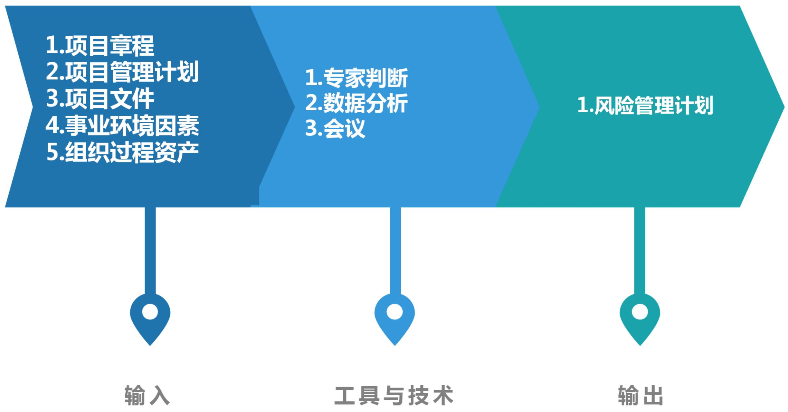

# 15.3.1 输入(掌握)

1. 项目章程  
2.项目管理计划  
3.项目文件  
4.事业环境因素  
5.组织过程资产

# 15.3.2 工具与技术(掌握)

1. 专家判断  
2.数据分析：干系人分析法，确定项目干系人的风险偏好。  
3.会议

# 1.风险管理计划内容：

(1)风险管理策略：描述用于管理本项目风险的一般方法。  
(2)方法论：确定用于开展本项目风险管理的具体方法、工具及数据来源。  
③角色与职责：确定每项风险管理活动的领导者、支持者和团队成员，并明确职责。  
④资金：确定开展项目风险管理活动所需资金，制定应急储备和管理储备使用方案。  
(5)时间安排：确定在项目生命周期中实施项目风险管理过程的时间和频率。  
(6)风险类别：借助风险分解结构（RBS）来构建风险类别。  
(7)干系人风险偏好：应该针对每个项目目标，把干系人的风险偏好表述成可测量的风险临界值。  
(8)风险概率和影响：根据具体的项目环境、组织和关键干系人的风险偏好和临界值，来制定风险概率和影响。可能自行制定关于概率和影响级别的具体定义，或用组织提供的通用定义作为基础来制定。  
(9)概率和影响矩阵：如果使用数值，就可以把两个数值相乘（概率  $\times$  影响），得出每个风险的概率- 影响分值，以便据此在每个优先级组别之内排列单个风险相对优先级。  
(10)报告格式：确定将如何记录、分析和沟通项目风险管理过程的结果。  
(1)跟踪：确定将如何记录风险活动，以及如何审计风险的管理过程。

# 15.3.3 输出(掌握)

表 15-3 概率和影响定义示例  

<table><tr><td rowspan="2">量表</td><td rowspan="2">概率</td><td colspan="3">+/- 对项目目标的影响</td></tr><tr><td>时间</td><td>成本</td><td>质量</td></tr><tr><td>很高</td><td>&gt;70%</td><td>&gt;6个月</td><td>&gt;500万元</td><td>对整体功能影响非常重大</td></tr><tr><td>高</td><td>51% ~ 70%</td><td>3 ~ 6个月</td><td>100 ~ 500万元</td><td>对整体功能影响重大</td></tr><tr><td>中</td><td>31% ~ 50%</td><td>1 ~ 3个月</td><td>50.1 ~ 100万元</td><td>对关键功能领域有一些影响</td></tr><tr><td>低</td><td>11% ~ 30%</td><td>1 ~ 4周</td><td>10 ~ 50万元</td><td>对整体功能有微小影响</td></tr><tr><td>很低</td><td>1% ~ 10%</td><td>1周</td><td>&lt;10万元</td><td>对辅助功能有微小影响</td></tr><tr><td>零</td><td>&lt;1%</td><td>不变</td><td>不变</td><td>功能不变</td></tr></table>

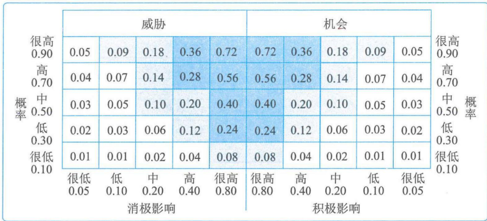  
图15-3 概率和影响矩阵示例（有评分方法）

表 15-2 风险分解结构(RBS)示例  

<table><tr><td>RBS0级</td><td>RBS1级</td><td>RBS2级</td></tr><tr><td rowspan="28">0项目风险所有来源</td><td rowspan="7">1技术风险</td><td>1.1 范围定义</td></tr><tr><td>1.2 需求定义</td></tr><tr><td>1.3 估算、假设和制约因素</td></tr><tr><td>1.4 技术过程</td></tr><tr><td>1.5 技术</td></tr><tr><td>1.6 技术联系</td></tr><tr><td>......</td></tr><tr><td rowspan="7">2管理风险</td><td>2.1 项目管理</td></tr><tr><td>2.2 项目集/项目组合管理</td></tr><tr><td>2.3 运营管理</td></tr><tr><td>2.4 组织</td></tr><tr><td>2.5 提供资源</td></tr><tr><td>2.6 沟通</td></tr><tr><td>......</td></tr><tr><td rowspan="7">3商业风险</td><td>3.1 合同条款和条件</td></tr><tr><td>3.2 内部采购</td></tr><tr><td>3.3 供应商与卖方</td></tr><tr><td>3.4 分包合同</td></tr><tr><td>3.5 客户稳定性</td></tr><tr><td>3.6 合伙企业和合资企业</td></tr><tr><td>......</td></tr><tr><td rowspan="7">4外部风险</td><td>4.1 法律</td></tr><tr><td>4.2 汇率</td></tr><tr><td>4.3 地点/设施</td></tr><tr><td>4.4 环境/天气</td></tr><tr><td>4.5 竞争</td></tr><tr><td>4.6 监督</td></tr><tr><td>......</td></tr></table>

# 15.4 识别风险(掌握)

识别风险时，要同时考虑单个项目风险以及整体项目风险的来源。

风险识别活动的参与者可能包括：项目经理、项目团队成员、项目风险专家（若已指定）、客户、项目团队外部的主题专家、最终用户、其他项目经理、运营经理、干系人和组织内的风险管理专家。应鼓励所有项目干系人参与项目风险的识别工作。

在整个项目生命周期中，单个项目风险可能随项目进展而不断变化，整体项目风险的级别也会发生变化。因此，识别风险是一个迭代的过程。

# 识别风险ITO(掌握)

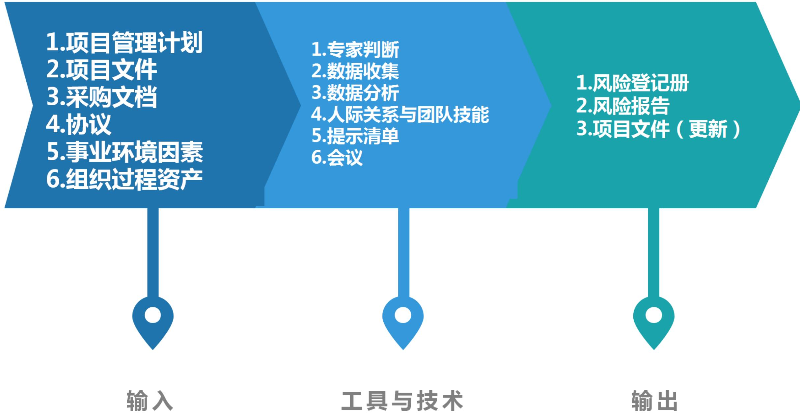

# 15.4.1 输入(掌握)

1.项目管理计划  
2.项目文件  
3. 采购文档  
4.协议  
5.事业环境因素  
6.组织过程资产

# 15.4.2 工具与技术(掌握)

1. 专家判断  
2.数据收集

- 头脑风暴：目标是获取一份全面的项目风险来源的清单。通常由项目团队开展头脑风暴，同时邀请团队以外的多学科专家参与。可以用风险类别（如风险分解结构）作为识别风险的框架。  
- 核查单：包括需要考虑的项目、行动或要点的清单。用作提醒。基于从类似项目和其他信息来源积累的历史信息和知识来编制核查单。虽然核查单简单易用，但它不可能穷尽所有风险。所以，必须确保不要用核查单来取代所需的风险识别工作；同时，项目团队也应该注意考察未在核查单中列出的事项。此外，还应该不时地审查核查单，增加新信息，删除或存档过时信息。  
- 访谈：可通过对资深项目参与者、干系人和主题专家的访谈，来识别项目风险的来源。

# 15.4.2 工具与技术(掌握)

# 3.数据分析

- 根本原因分析：发现导致问题的深层原因并制定预防措施。  
- 假设条件和制约因素分析：从假设条件的不准确、不稳定、不一致或不完整，可以识别出威胁；通过清除或放松会影响项目或过程执行的制约因素，可以创造出机会。  
- SWOT分析：对项目的优势、劣势、机会和威胁（简称SWOT）进行逐个检查。  
- 文件分析：通过对项目文件的结构化审查，可以识别出一些风险。项目文件中的不确定性或模糊性，以及同一文件内部或不同文件之间的不一致，都可能是项目风险的提示信号。

# 15.4.2 工具与技术(掌握)

4. 人际关系与团队技能：帮助参会者专注于风险识别任务、准确遵循与技术相关的方法，确保风险描述清晰、找到并克服偏见，以及解决任何可能出现的分歧。  
5. 提示清单：是关于可能引发项目风险来源的风险类别的预设清单。可以用风险分解结构底层的风险类别作为提示清单，来识别单个项目风险。  
6.会议

# 1.风险登记册

风险登记册内容主要包括：

已识别风险的清单  
- 潜在风险责任人：在识别风险过程中识别出潜在的风险责任人，随后将由实施定性风险分析过程进行确认。  
- 潜在风险应对措施清单：在识别风险过程中识别出某种潜在的风险应对措施，随后将由规划风险应对过程进行确认。

# 2.风险报告

风险报告内容主要包括：

- 整体项目风险的来源：说明哪些是整体项目风险的最重要因素。  
- 关于已识别单个项目风险的概述信息：例如，已识别的威胁与机会的数量、风险在风险类别中的分布情况、测量指标和发展趋势。

# 风险登记册实例

<table><tr><td>风险</td><td>潜在责任人</td><td>潜在应对</td></tr><tr><td>生病</td><td>自己</td><td>多喝热水</td></tr><tr><td>堵车</td><td>自己</td><td>早出门</td></tr><tr><td>忘带证件</td><td>老婆</td><td>提醒</td></tr><tr><td>有原题</td><td>机构</td><td>随缘</td></tr><tr><td>厕所有教程</td><td>某人</td><td>去放</td></tr></table>

3.项目文件（更新）

# 15.5 实施定性风险分析(掌握)

本过程的主要作用是重点关注高优先级的风险。

本过程会为每个风险识别出责任人，以便由他们负责规划风险应对措施，并确保应对措施的实施。如果需要开展实施定量风险分析过程，那么实施定性风险分析也能为其奠定基础。

在整个项目生命周期中要定期开展实施定性风险分析过程。在敏捷或适应型开发环境中，实施定性风险分析过程通常要在每次迭代开始前进行。

# 实施定性风险分析ITO(掌握)

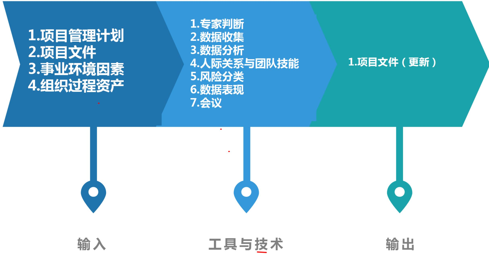

# 15.5.1 输入(掌握)

1.项目管理计划  
2.项目文件  
3.事业环境因素  
4.组织过程资产

# 15.5.2 工具与技术(掌握)

# 1. 专家判断

2.数据收集：适用于实施定性风险分析过程的数据收集技术是访谈。

# 3.数据分析

- 风险数据质量评估：风险数据是开展定性风险分析的基础。风险数据质量评估旨在评价关于单个项目风险的数据的准确性和可靠性。可以开展问卷调查，了解项目干系人对数据质量各方面的评价，包括数据的完整性、客观性、相关性和及时性。  
- 风险概率和影响评估：风险概率评估考虑的是特定风险发生的可能性；风险影响评估考虑的是风险对一项或多项项目目标的潜在影响，如进度、成本、质量或绩效。  
- 其他风险参数评估：紧迫性、邻近性、潜伏期、可管理性、可控性、可监测性、连通性、战略影响力、密切度等。考虑这些特征有助于进行更稳健的风险优先级排序。

# 15.5.2 工具与技术(掌握)

4.人际关系与团队技能：引导，能够提高对单个项目风险的定性分析的有效性。  
5.风险分类  
6.数据表现

- 概率和影响矩阵：把每个风险发生的概率和该风险一旦发生对项目目标的影响映射起来的表格。以便于把单个项目风险划分到不同的优先级组别。采用风险管理计划中规定的风险概率和影响定义，逐一对单个项目风险的发生概率及其对一项或多项项目目标的影响（若发生）进行评估。然后，基于所得到的概率和影响的组合，使用概率和影响矩阵，来为单个项目风险分配优先级别。  
- 层级图：如果使用了两个以上的参数对风险进行分类，那就不能使用概率和影响矩阵，而需要使用其他图形。其中，X轴代表可监测性，Y轴代表邻近性，影响值则以气泡大小表示。

很高  
0.90  
高  
0.70  
中  
0.50  
低  
0.30  
很低  
0.10

舞  

<table><tr><td colspan="5">威胁</td><td colspan="5">机会</td></tr><tr><td>0.05</td><td>0.09</td><td>0.18</td><td>0.36</td><td>0.72</td><td>0.72</td><td>0.36</td><td>0.18</td><td>0.09</td><td>0.05</td></tr><tr><td>0.04</td><td>0.07</td><td>0.14</td><td>0.28</td><td>0.56</td><td>0.56</td><td>0.28</td><td>0.14</td><td>0.07</td><td>0.04</td></tr><tr><td>0.03</td><td>0.05</td><td>0.10</td><td>0.20</td><td>0.40</td><td>0.40</td><td>0.20</td><td>0.10</td><td>0.05</td><td>0.03</td></tr><tr><td>0.02</td><td>0.03</td><td>0.06</td><td>0.12</td><td>0.24</td><td>0.24</td><td>0.12</td><td>0.06</td><td>0.03</td><td>0.02</td></tr><tr><td>0.01</td><td>0.01</td><td>0.02</td><td>0.04</td><td>0.08</td><td>0.08</td><td>0.04</td><td>0.02</td><td>0.01</td><td>0.01</td></tr><tr><td>很低 0.05</td><td>低 0.10</td><td>中 0.20</td><td>高 0.40</td><td>很高 0.80</td><td>很高 0.80</td><td>高 0.40</td><td>中 0.20</td><td>低 0.10</td><td>很低 0.05</td></tr><tr><td colspan="5">消极影响</td><td colspan="5">积极影响</td></tr></table>

很高  
0.90  
高  
0.70  
中  
0.50  
低  
0.30  
很低  
0.10

# 藕

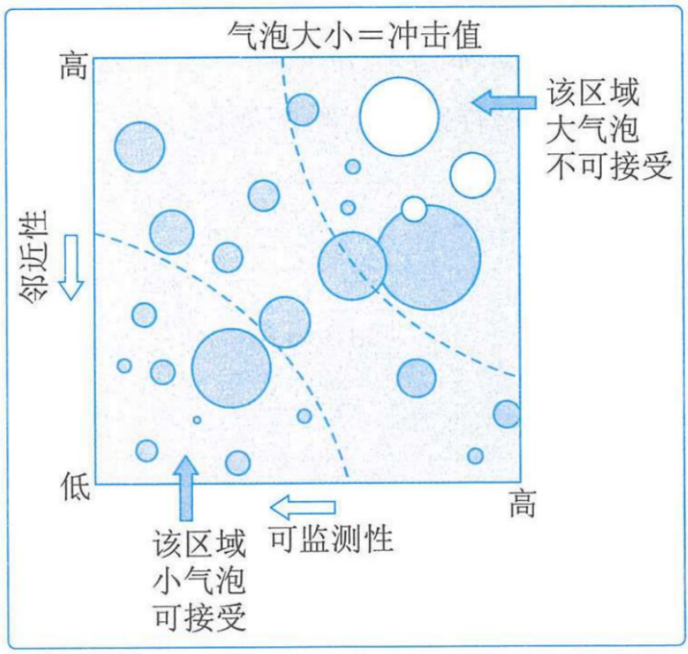  
图15-6 列出可监测性、邻近性和影响值的气泡图示例

# 7.会议

# 1.项目文件（更新）

- 假设日志  
- 问题日志  
- 风险登记册：更新内容可能包括：每项单个项目风险的概率和影响评估、优先级别或风险分值、指定风险责任人、风险紧迫性信息或风险类别，以及低优先级风险的观察清单和需要进一步分析的风险。  
- 风险报告：更新风险报告，以记录最重要的单个项目风险（通常为概率和影响最高的风险）、所有已识别风险的优先级列表以及简要的结论。

# 风险登记册实例

<table><tr><td>风险</td><td>潜在责任人</td><td>潜在应对</td><td>概率</td><td>影响</td><td>分值</td><td>责任人</td></tr><tr><td>生病</td><td>自己</td><td>多喝热水</td><td>0.1</td><td>0.4</td><td>0.04</td><td>自己</td></tr><tr><td>堵车</td><td>自己</td><td>早出门</td><td>0.3</td><td>0.2</td><td>0.06</td><td>自己</td></tr><tr><td>忘带证件</td><td>老婆</td><td>提醒</td><td>0.1</td><td>0.8</td><td>0.08</td><td>老婆</td></tr><tr><td>有原题</td><td>机构</td><td>随缘</td><td>0.3</td><td>0.8</td><td>0.24</td><td>上帝</td></tr><tr><td>厕所有教程</td><td>某人</td><td>去放</td><td>0.9</td><td>0.2</td><td>0.18</td><td>某人</td></tr></table>

# 15.6 实施定量风险分析(掌握)

并非所有项目都需要实施定量风险分析。

定量分析适用于大型或复杂的项目，具有战略重要性的项目，合同要求进行定量分析的项目和主要干系人要求进行定量分析的项目。

定量风险分析也可以在规划风险应对过程之后开展，以分析已规划的应对措施对降低整体项目风险最大可能的有效性。

# 实施定量风险分析ITO(掌握)

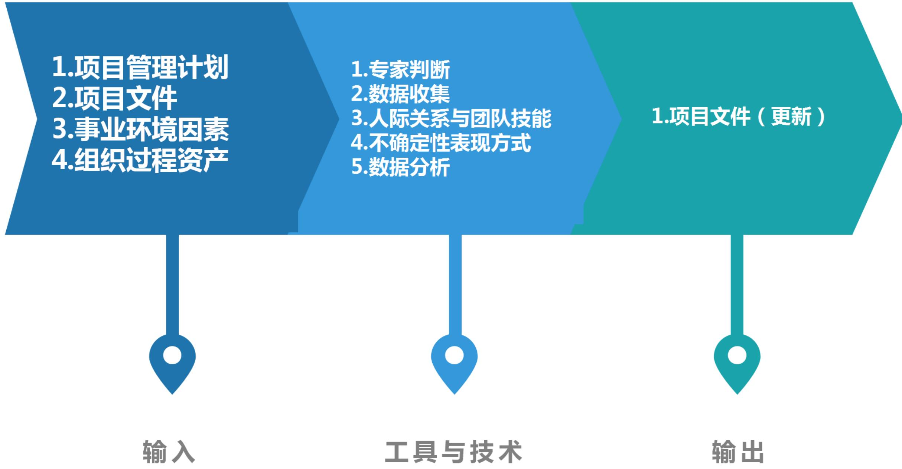

# 15.6.1 输入(掌握)

1.项目管理计划  
2.项目文件  
3.事业环境因素  
4.组织过程资产

# 15.6.2 工具与技术(掌握)

1. 专家判断  
2. 数据收集：访谈。  
3.人际关系与团队技能：引导。在由项目团队成员和其他干系人参加的专门风险研讨会中，配备一名熟练的引导者，有助于更好地收集输入数据。  
4. 不确定性表现方式：如果活动的持续时间、成本或资源需求是不确定的，就可以在模型中用概率分布来表示其数值的可能区间。概率分布可能有多种形式，最常用的有三角分布、正态分布、对数正态分布、贝塔分布、均匀分布或离散分布。

# 15.6.2 工具与技术(掌握)

# 5.数据分析。

- 模拟：使用模型来模拟单个项目风险和其他不确定性来源的综合影响，以评估它们对项目目标的潜在影响。模拟通常采用蒙特卡洛分析。

用计算机软件数千次迭代运行定量风险分析模型。每次运行，都要随机选择输入值(如成本估算、持续时间估算或概率分支发生频率)。这些运行的输出构成了项目可能结果(如项目结束日期、项目完工成本)的区间。

例如图15-8：相对于预期值235万美元来说，若要将成功概率提高到  $85\%$  ，则需要增加储备金10万美元（245-235）。

# 15.6.2 工具与技术(掌握)

- 敏感性分析：有助于确定哪些单个项目风险或不确定性来源对项目结果具有最大的潜在影响。它在项目结果变化与定量风险分析模型中的要素变化之间建立联系。敏感性分析的结果通常用龙卷风图来表示。  
- 决策树分析：用决策树在若干备选行动方案中选择一个最佳方案。在决策树中，用不同的分支代表不同的决策或事件，即项目的备选路径。通过计算每条分支的预期货币价值，就可以选出最优的路径。  
- 影响图：不确定条件下进行决策的图形辅助工具。它将一个项目或项目中的一种情境表现为一系列实体、结果和影响，以及它们之间的关系和相互影响。
借助模拟技术（如蒙特卡洛分析）来分析哪些要素对重要结果具有最大的影响。
影响图分析可以得出类似于其他定量风险分析的结果，如S曲线图和龙卷风图。

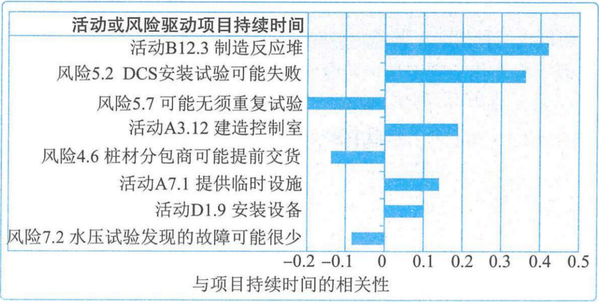  
图15-9 龙卷风图示例

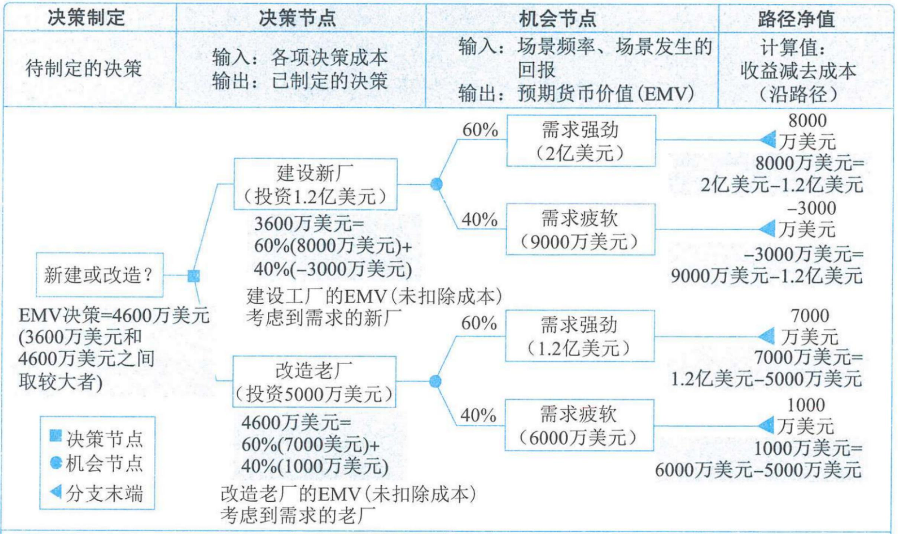

# 蒙特卡洛分析(补充掌握)

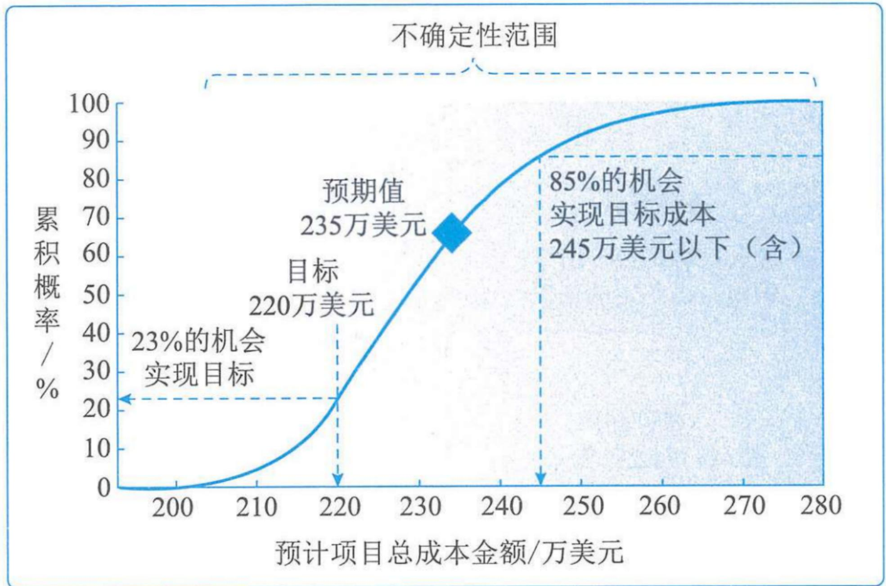  
图15-8 定量成本风险分析S曲线示例

# 1.项目文件（更新）

风险报告内容：

(1)对整体项目风险最大可能性的评估结果；  
(2)项目详细概率分析的结果；  
(3) 单个项目风险优先级清单；  
(4)定量风险分析结果的趋势；  
(5)风险应对建议。

# 15.7 规划风险应对(掌握)

风险应对方案应该与风险的重要性相匹配，并且能够经济有效地应对挑战，同时在当前项目背景下现实可行，获得全体干系人的同意，并由一名责任人具体负责。

如果选定的策略并不完全有效，或者发生了已接受的风险，就需要制订应急计划。同时，也需要识别次生风险。次生风险是实施风险应对措施直接导致的风险。

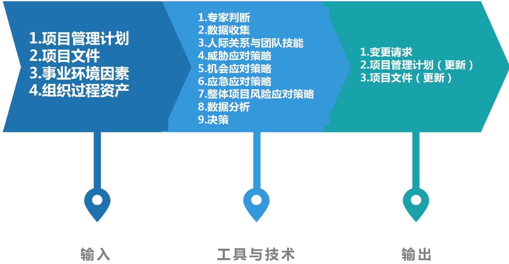

# 15.7.1 输入(掌握)

1.项目管理计划  
2.项目文件  
3.事业环境因素  
4.组织过程资产

# 15.7.2 工具与技术(掌握)

# 1. 专家判断

# 4.威胁应对策略

2. 数据收集：访谈。项目风险的应对措施可以在与风险责任人的结构化或半结构化的访谈中制定。访谈者应该营造信任和保密的访谈环境，以鼓励被访者提出诚实和无偏见的意见。  
3. 人际关系与团队技能：引导，能够提高项目风险应对策略制定的有效性。熟练的引导者可以帮助风险责任人理解风险、识别并比较备选的风险应对策略、选择适当的应对策略，并克服偏见。

# 15.7.2 工具与技术(掌握)

<table><tr><td colspan="2">威胁应对策略</td></tr><tr><td>策略</td><td>解释说明</td></tr><tr><td>上报</td><td>如果项目团队或项目发起人认为某威胁不在项目范围内，或提议的应对措施超出了项目经理的权限，就应该采用上报策略，如上报项目集或项目组合层面。对于被上报的威胁，组织中的相关人员必须愿意承担应对责任。威胁一旦上报，就不再由项目团队做进一步监督，虽然仍可出现在风险登记册中供参考。</td></tr><tr><td>规避</td><td>采取行动，消除威胁，或保护项目免受威胁的影响（将发生概率降低到零）。它可能适用于发生概率较高，且具有严重负面影响的高优先级的威胁。规避措施包括消除威胁的原因改变计划、延长进度、改变策略、缩小范围；澄清需求、获取信息、改善沟通或取得专有技能来加以规避。</td></tr><tr><td>转移</td><td>将应对威胁的责任转移给第三方，让第三方管理风险并承担威胁发生的影响，通常需要支付风险转移费用。转移风险是把风险管理责任简单地推给另一方，而并非消除风险。包括购买保险、使用履约保函、使用担保书、使用保证书等，或通过签订协议，把具体的风险转移给第三方。</td></tr><tr><td>减轻</td><td>采取行动，降低风险概率或降低影响，提前采取减轻措施通常比威胁出现后尝试进行弥补更加有效。减轻措施包括采用较简单的流程，进行更多次测试，或者选用更可靠的卖方，原型开发等（降低概率）；或加入冗余部件（减轻影响）。</td></tr><tr><td>接受</td><td>风险接受是指承认威胁的存在，但不主动采取措施，适用于低优先级威胁，或无法以任何其他方式加以经济有效地应对的威胁。主动接受：建立应急储备，预留一定的资金、时间或资源被动接受：记录策略，无需任何其他行动，需要定期复查一下</td></tr></table>

# 15.7.2 工具与技术(掌握)

5.机会应对策略  

<table><tr><td colspan="2">机会应对策略</td></tr><tr><td>策略</td><td>解释说明</td></tr><tr><td>上报</td><td>如果项目团队或项目发起人认为某机会不在项目范围内，或提议的应对措施超出了项目经理的权限，就应该采用上报策略，如上报项目集或项目组合层面。对于被上报的威胁，组织中的相关人员必须愿意承担应对责任。机会一旦上报，就不再由项目团队做进一步监督，虽然仍可出现在风险登记册中供参考。</td></tr><tr><td>开拓</td><td>适用于高优先级机会，此策略将特定机会的出现概率提高到100%，确保其肯定出现。开拓措施可能包括：把组织中最有能力的资源分配给项目来缩短完工时间，或采用全新技术或技术升级来节约项目成本并缩短项目持续时间。</td></tr><tr><td>分享</td><td>将应对机会的责任转移给第三方，使其享有机会所带来的部分收益。让那些最有能力为项目抓住机会的人担任新的风险责任人（最有能力为项目抓住机会的人）。通常需要支付费用（其实就是分享利益）。分享措施包括建立合伙关系、合作团队、特殊公司和合资企业来分享机会。</td></tr><tr><td>提高</td><td>提高机会出现的概率和（或）影响。机会提高措施包括为早日完成活动而增加资源（普通人）。</td></tr><tr><td>接受</td><td>接受机会是指承认机会的存在。适用于低优先级机会，或无法以任何其他方式加以经济有效地应对的机会。主动接受：建立应急储备，预留一定的资金、时间或资源被动接受：记录策略，无需任何其他行动，需要定期复查一下</td></tr></table>

# 15.7.2 工具与技术(掌握)

# 6.应急应对策略

可设计一些仅在特定事件发生时才采用的应对措施。对于某些风险，如果项目团队相信其发生会有充分的预警信号，那么就应该制订仅在某些预定条件出现时才执行的应对计划。应该定义并跟踪应急应对策略的触发条件。

# 15.7.2 工具与技术(掌握)

7.整体项目风险应对策略  

<table><tr><td colspan="2">整体风险应对策略</td></tr><tr><td>策略</td><td>解释说明</td></tr><tr><td>规避</td><td>适用于整体项目风险有严重负面影响的，并已超出商定的项目风险临界值。采取集中行动，弱化不确定性对项目整体的负面影响，并将项目拉回到临界值以内。例如：取消项目范围中的高风险工作，取消项目（最极端）。</td></tr><tr><td>开拓</td><td>适用于整体项目风险有显著正面影响的，并已超出商定的项目风险临界值。采取集中行动，去获得不确定性对整体项目的正面影响。例如：项目范围中增加高收益的工作与关键干系人协商修改项目风险临界值。</td></tr><tr><td>转移或分享</td><td>适用于整体项目风险的级别很高，组织无法有效加以应对。让第三方代表组织对风险进行管理。
负面风险：转移策略，支付费用；
正面风险：多方分享，获得利益；
例如：建立协作式业务结构、成立合资企业或特殊目的公司、分包关键工作。</td></tr><tr><td>减轻或提高</td><td>变更整体项目风险的级别，以优化实现项目目标的可能性。
减轻策略：适用于负面的整体风险
提高策略：适用于正面的整体风险
例如：重新规划项目、改变项目范围和边界、调整项目优先级、改变资源配置、调整交付时间。</td></tr><tr><td>接受</td><td>适用于无法针对整体项目风险采取主动的应对策略。不主动采取措施，继续按当前的定义推动项目进展。
主动接受：建立应急储备；
被动接受：记录策略，无需任何其他行动，需要定期复查。</td></tr></table>

# 15.7.2 工具与技术(掌握)

# 8.数据分析

- 备选方案分析：对备选风险应对方案的特征和要求进行简单比较，进而确定哪个应对方案最为适用。  
成本收益分析：如果能够把单个项目风险的影响进行货币量化，那么就可以通过成本收益分析来确定备选风险应对策略的成本有效性。策略的有效性=应对的结果/应对花费的成本。比率越高，有效性就越高。

9.决策：多标准决策分析，有助于对多种风险应对策略进行优先级排序。

# 15.7.3 输出(掌握)

1. 变更请求  
2.项目管理计划（更新）

# 3.项目文件（更新）

- 风险登记册：需要更新以记录选择和商定的风险应对措施。更新可能包括：

(1)商定的应对策略;  
(2)实施所选应对策略所需要的具体行动；  
(3)风险发生的触发条件、征兆和预警信号；  
(4)实施所选应对策略所需要的预算和进度活动；  
(5)应急计划及启动该计划所需的风险触发条件；  
⑥回退计划，供风险发生且主要应对措施不足以应对时使用；  
(7)采取预定应对措施之后仍存在的残余风险，以及被有意接受的风险；  
(8)由实施风险应对措施而直接导致的次生风险。(如软件的补丁增量，可能引发新的错误)。

- 风险报告：更新以记录针对当前整体项目风险敞口和高优先级风险的经商定的应对措施，以及实施这些措施之后的预期变化。

# 风险登记册实例

<table><tr><td>风险</td><td>潜在责任人</td><td>潜在应对</td><td>概率</td><td>影响</td><td>分值</td><td>责任人</td><td>定量</td><td>策略</td><td>应对计划</td></tr><tr><td>生病</td><td>自己</td><td>多喝热水</td><td>0.1</td><td>0.4</td><td>0.04</td><td>自己</td><td></td><td>减轻</td><td>吃清淡一点</td></tr><tr><td>堵车</td><td>自己</td><td>早出门</td><td>0.3</td><td>0.2</td><td>0.06</td><td>自己</td><td></td><td>规避</td><td>附近定个酒店</td></tr><tr><td>忘带证件</td><td>老婆</td><td>提醒</td><td>0.1</td><td>0.8</td><td>0.08</td><td>老婆</td><td></td><td>减轻</td><td>自己带身份证让老婆提醒带驾照</td></tr><tr><td>有原题</td><td>机构</td><td>随缘</td><td>0.3</td><td>0.8</td><td>0.24</td><td>上帝</td><td></td><td></td><td>多花点时间看看真题</td></tr><tr><td>厕所有教程</td><td>某人</td><td>去放</td><td>0.9</td><td>0.2</td><td>0.18</td><td>某人</td><td></td><td></td><td>骗个人去放一本</td></tr></table>

# 15.8 实施风险应对(掌握)

只有风险责任人以必要的努力去实施商定的应对措施，项目的整体风险入口和单个威胁及机会才能得到主动管理。

# 实施风险应对ITO(掌握)

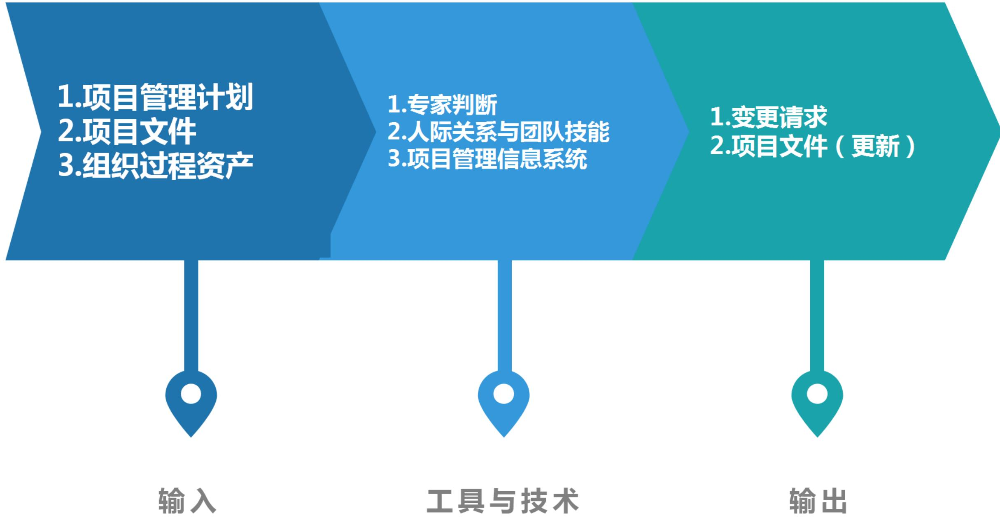

# 15.8.1 输入(掌握)

1.项目管理计划  
2.项目文件  
3.组织过程资产

# 15.8.2 工具与技术(掌握)

# 1. 专家判断

2. 人际关系与团队技能：影响力。有些风险应对措施可能由项目团队以外的人员执行，或由存在其他竞争性需求的人员执行。这种情况下，负责引导风险管理过程的项目经理或人员就需要施展影响力，去鼓励指定的风险责任人采取所需的行动。

# 3.项目管理信息系统

# 15.8.3 输出(掌握)

1.变更请求  
2.项目文件（更新）

# 15.9 监督风险(掌握)

监督风险过程采用项目执行期间生成的绩效信息，以确定：

(1)实施的风险应对是否有效；  
(2)整体项目风险级别是否已改变；  
(3)已识别单个项目风险的状态是否已改变；  
(4)是否出现新的单个项目风险；  
(5)风险管理方法是否依然适用；  
(6)项目假设条件是否仍然成立；  
(7)风险管理政策和程序是否已得到遵守；  
(8)成本或进度应急储备是否需要修改；  
(9)项目策略是否仍然有效等。

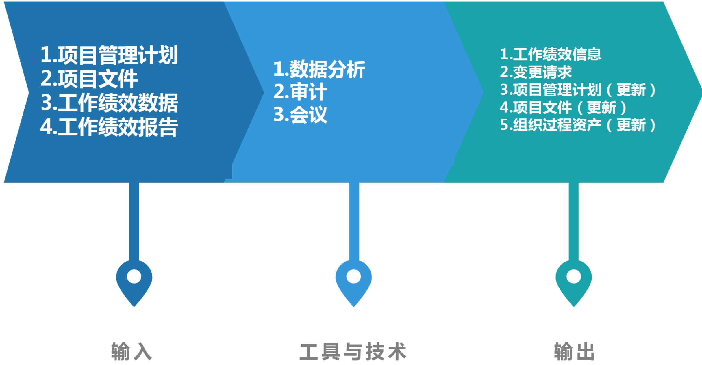

# 15.9.1 输入(掌握)

1.项目管理计划  
2.项目文件

- 问题日志：用于检查未决问题是否更新，并对风险登记册进行必要更新。  
- 经验教训登记册  
$\bullet$  风险登记册  
风险报告

3.工作绩效数据  
4.工作绩效报告

# 15.9.2 工具与技术(掌握)

# 1. 数据分析

- 技术绩效分析：把项目执行期间所取得的技术成果与取得相关技术成果的计划进行比较。它要求定义关于技术绩效的客观的、量化的测量指标，以便据此比较实际结果与计划要求。技术绩效测量指标可能包括处理时间、缺陷数量和储存容量等。  
- 储备分析：在项目的任一时点比较剩余应急储备与剩余风险量，从而确定剩余储备是否仍然合理。可以用各种图形（如燃尽图）来显示应急储备的消耗情况

# 15.9.2 工具与技术(掌握)

2.审计：风险审计是一种审计类型，可用于评估风险管理过程的有效性。项目经理负责确保按项目风险管理计划所规定的频率开展风险审计。风险审计可以在日常项目审查会和风险审查会上开展，团队也可以召开专门的风险审计会。在实施审计前，应明确定义风险审计的程序和目标。  
3.会议：应该定期安排风险审查，来检查和记录风险应对在处理整体项目风险和已识别单个项目风险方面的有效性。

# 15.9.3 输出(掌握)

1. 工作绩效信息  
2.变更请求  
3.项目管理计划（更新）  
4.项目文件（更新）  
5.组织过程资产（更新）

风险管理的顺序如下：1.识别2.定性3.定量(可以不做)4.规划应对5.实施应对

风险

潜在应对

概率

影响

风险值

量化

策略

应对计划

实施应对

潜在责任人

优先级、紧迫性

应急应对计划

风险责任人

回退计划

次生风险和残余风险

监督风险（跟踪、监督、识别等等）

# 本章练习

(1) 风险可从不同角度，根据不同标准来进行分类。百年不遇的暴雨属于 ( )。

A.不可预测风险

B.可预测风险

C.已知风险

D. 技术风险

【答案】A

(2) ( )不属于风险识别的依据。

A.成本管理计划

B. 范围基准

C.采购文件

D.风险报告

【答案】D

(3) 某项目有  $40\%$  的概率获利 10 万元,  $30\%$  的概率会亏损 8 万元,  $30\%$  的概率既不获利也不亏损。该项目的预期货币价值（EMV）是 ( )。

A.0.4万元

B.1.6万元

C.2万元

D.6.4万元

【答案】B

# 本章练习

(4) 通过概率和影响级别定义以及专家访谈, 有助于纠正该过程所使用的数据中的偏差属于 ( )。

A.定性风险分析

B.识别风险

C.定量风险分析

D.风险监控

【答案】A

(5) 关于项目风险管理的描述，不正确的是 ( )。

A. 纯粹风险和人为风险在一定条件下可以相互转化  
B.项目风险既包括对项目目标的威胁，也包括促进项目目标的机会  
C.风险大多数随着项目的进展而不断变化，不确定性会逐渐减小  
D.风险后果包括后果发生的频率、收益或损失大小

【答案】A

# 本章练习

(6) A公司中标一个大型系统集成项目，其中一台关键设备计划从国外采购，由于近期汇率波动明显，A公司准备与客户协商使用国产设备，这是采用了（）风险应对策略。

A.回避

B.转移

C.减轻

D. 接受

【答案】A

(7) ( )不属于定性风险分析的技术。

A.风险数据质量评估值分析

B.概率和影响矩阵

C.风险紧迫性评估

D.预期货币价

【答案】D

# 本章练习

判断下列表述正误，正确的选v错误的选×。

(1) 项目风险都会对项目目标产生负面影响。  
(2) 项目活动投入得越多，愿意冒的风险越小。  
(3) 实施风险应对过程，即执行商定的风险应对计划的过程。

【答案】(1)  $\times (2) \vee (3) \vee$

# 历年真题练习

# 【2023年上半年-第46题】

关于识别风险的描述，不正确的是（）。

A.可使用类似项目信息的核查单替代所需的风险识别  
B.在风险管理计划中应规定识别风险的迭代频率和迭代参与程度  
C.从组织外部采购商品和服务可能引发新的项目风险  
D.使用SWOT分析法可以拓宽项目识别风险的范围

【答案】A

# 历年真题练习

# 【2023年上半年-第47题】

关于风险分析的技术，不正确的是（）。

A.概率影响矩阵适用于两个以上的参数对风险进行分类的情况  
B.蒙特卡洛分析，是使用模型模拟大量单个项目风险和其他不确定性来源的综合影响，以评估它们对项目目标的潜在影响  
C.敏感性分析，是将项目结果变化与定量风险分析模型中的要素变化之间建立联系的方法  
D.影响图是不确定条件下进行决策的图形辅助工具

【答案】A

# 历年真题练习

【2023年下半年-第4批次】

整体项目风险应对策略不包括（）。

A.开拓

B. 接受

C.上报

D.转移或分享

【答案】C

# 历年真题练习

# 【2024年上半年-第1批次】

在一个大型项目实施过程中，项目经理发现项目风险已经发生，并且对项目进度和成本产生了显著影响。为了准确评估风险对项目目标的影响程度，项目经理应该采取的定量风险分析技术是（）。

A.风险分类评估

B.风险概率和影响评估

C.敏感性分析

D.风险数据质量

【答案】C

# Thank You!

微信公众号：野人老师 淘宝店铺：yeren.taobao.com