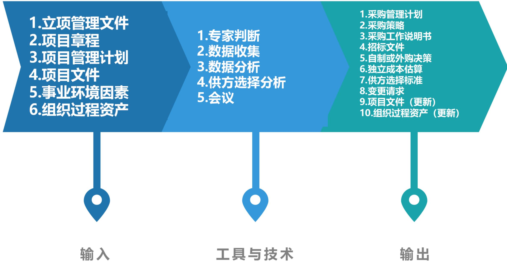
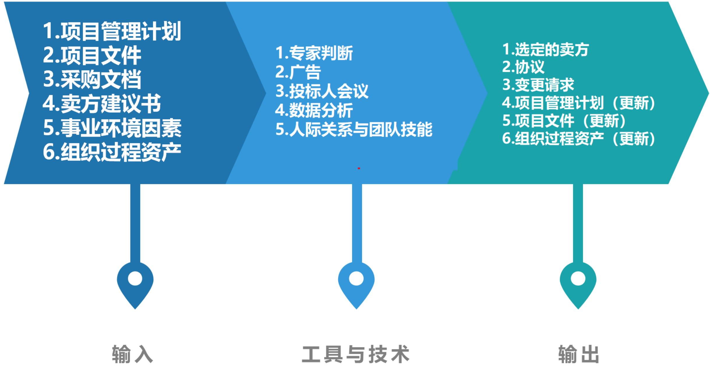
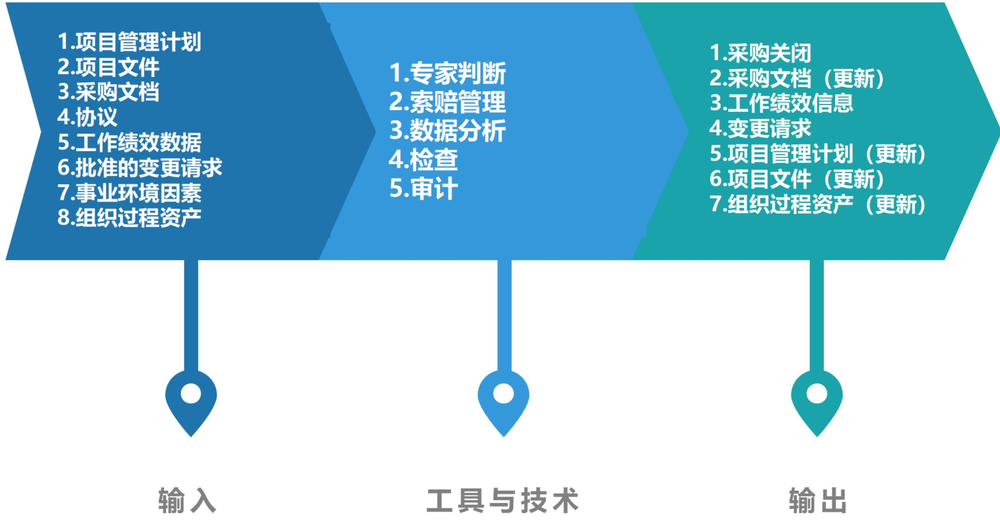

# 项目采购管理

# 信息系统项目管理师

# 本章学习建议

根据历年的考试情况来看，由于本章内容属于10大管理的内容，项目采购管理是为完成项目工作，从项目团队外部购买或获取所需产品、服务或成果的过程。上午、案例分析、论文写作都会进行考查，在上午考试中一般会考2分，在下午考试中可能会涉及，本章节对很多人来说，是难点，一些名词搞不清楚，希望通过本资料和我的讲课，帮助大家掌握以下的知识点。合同管理一般上午考察1分，案例和论文出题的概率也很小，2021年上半年考了合同管理的论文，是属于比较偏的。

# 本章考情分析

<table><tr><td>年份</td><td>上午选择题</td><td>案例分析题</td><td>论文写作</td><td>合计</td></tr><tr><td>2023年05月</td><td>3</td><td>0</td><td>0</td><td>3</td></tr><tr><td>2023年11月</td><td>机考3分左右</td><td>25 (第1批)25 (第2批)25 (第3批)</td><td>75 (第3批)</td><td>每个批次大概25分左右</td></tr><tr><td>2024年05月</td><td>机考3分左右</td><td>0</td><td>0</td><td>3</td></tr></table>

# 十大知识领域(背诵)

# 采购管理ITO(掌握)

<table><tr><td colspan="5">采购管理</td></tr><tr><td>组</td><td>过程</td><td>输入</td><td>工具和技术</td><td>输出</td></tr><tr><td>规划</td><td>1.规划采购</td><td>1.立项管理文件
•商业论证
•效益管理计划
2.项目章程
3.项目管理计划
•范围管理计划
•质量管理计划
•资源管理计划
•范围基准
4.项目文件
•风险登记册
•干系人登记册
•需求文件
•需求跟踪矩阵
•里程碑清单
•资源需求
•项目团队派工单
5.事业环境因素
6.组织过程资产</td><td>1.专家判断
2.数据收集
•市场调研
3.数据分析
•自制或外购分析
4.供方选择分析
5.会议</td><td>1.采购管理计划
2.采购策略
3.采购工作说明书
4.招标文件
5.自制或外购决策
6.独立成本估算
7.供方选择标准
8.变更请求
9.项目文件(更新)
•经验教训登记册
•里程碑清单
•需求文件
•需求跟踪矩阵
•风险登记册
•干系人登记册
10.组织过程资产(更新)</td></tr></table>

# 采购管理ITO(掌握)

<table><tr><td>组</td><td>过程</td><td>输入</td><td>工具和技术</td><td>输出</td></tr><tr><td>执行</td><td>2.实施采购</td><td>1.项目管理计划
·范围管理计划
·需求管理计划
·沟通管理计划
·风险管理计划
·采购管理计划
·配置管理计划
·成本基准
2.项目文件
·需求文件
·项目进度计划
·风险登记册
·干系人登记册
·经验教训登记册
3.采购文档
4.卖方建议书
5.事业环境因素
6.组织过程资产</td><td>1.专家判断
2.广告
3.投标人会议
4.数据分析
·建议书评价
2.人际关系与团队技能
·谈判</td><td>1.选定的卖方
2.协议
3.变更请求
4.项目管理计划(更新)
·需求管理计划
·质量管理计划
·沟通管理计划
·风险管理计划
·采购管理计划
·范围基准
·进度基准
·成本基准
5.项目文件(更新)
·经验教训登记册
·需求文件
·需求跟踪矩阵
·资源日历
·风险登记册
·干系人登记册
6.组织过程资产(更新)</td></tr></table>

# 采购管理ITO(掌握)

<table><tr><td>组</td><td>过程</td><td>输入</td><td>工具和技术</td><td>输出</td></tr><tr><td>监控</td><td>3.控制采购</td><td>1.项目管理计划
·需求管理计划
·风险管理计划
·采购管理计划
·变更管理计划
·进度基准
2.项目文件
·假设日志
·需求文件
·需求跟踪矩阵
·里程碑清单
·风险登记册
·干系人登记册
·质量报告
·经验教训登记册
3.采购文档
4.协议
5.工作绩效数据
6.批准的变更请求
7.事业环境因素
8.组织过程资产</td><td>1.专家判断
2.索赔管理
3.数据分析
·绩效审查
·净值分析
·趋势分析
4.检查
5.审计</td><td>1.采购关闭
2.采购文档（更新）
3.工作绩效信息
4.变更请求
5.项目管理计划(更新)
·风险管理计划
·采购管理计划
·进度基准
·成本基准
6.项目文件(更新)
·经验教训登记册
·资源需求
·需求跟踪矩阵
·风险登记册
·干系人登记册
7.组织过程资产(更新)</td></tr></table>

# 16.1 管理基础-16.1.1 协议/采购合同(掌握)

项目采购管理包括从项目团队外部采购或获取所需产品、服务或成果的各个过程。例如合同、订购单、协议备忘录（MOA）和服务水平协议（SLA）。被授权采购项目所需货物、服务的人员可以是项目团队、管理层或组织采购部的成员。

因应用领域不同，协议可以是合同、服务水平协议（SLA）、谅解备忘录、协议备忘录（MOA）或订购单。

合同中未规定的任何事项则不具法律强制力。开展国际合作的项目经理应牢记，无论合同规定如何详尽，文化和当地法律对合同及其可执行性均有影响。

因应用领域不同，卖方可以是承包商、供货商、服务提供商或供应商；买方可能为最终产品的所有人、分包商、收购机构、服务需求者或购买方。

# 16.1.2 管理新实践(了解)

- 工具的改进：在线工具（发布采购广告、在线查找采购文件、在线填写）；建筑信息模型（BIM）  
- 更先进的风险管理：编制合同时准确地将具体风险分配给最有能力对其加以管理的一方，合同中可以明确规定风险管理是合同工作的一部分。  
- 变化中的合同签署实践：承包商越来越重视在采购过程中与客户开展密切合作，以便对批量采购或有其他特殊关系的客户给予折扣优惠。为了减少执行过程中的问题和索赔，采用国际公认的标准合同范本也日益普遍。  
- 物流和供应链管理：供应链管理也是承包商的项目团队日益重视的一个领域。在项目早期，不仅要明确主要的采购渠道，通常还需要明确次要和备选渠道。  
- 技术和干系人关系：采用包括网络摄像在内的技术，以改善与干系人的沟通和关系。使用网络摄像机记录现场情况，能够避免对事实的分歧，从而能够把与现场施工有关的争议降到最低程度。  
- 试用采购：在决定大批量采购之前，有些项目会试用多个候选卖方，向他们采购少量的可交付成果和工作产品。

# 16.2.1 项目采购管理过程概述(背诵)

<table><tr><td>过程</td><td>过程定义</td><td>主要作用</td></tr><tr><td>1.规划采购管理</td><td>记录项目采购决策、明确采购方法，及识别潜在卖方的过程</td><td>确定是否从项目外部获取货物和服务，如果是，则还要确定将在什么时间、以什么方式获取什么货物和服务
【仅开展一次或仅在项目的预定义点开展】</td></tr><tr><td>2.实施采购</td><td>获取卖方应答、选择卖方并授予合同的过程</td><td>选定合格卖方并签署关于货物或服务交付的法律协议。本过程的最后成果是签订的协议，包括正式合同。
【在整个项目期间定期开展】</td></tr><tr><td>3.控制采购</td><td>管理采购关系、监督合同绩效、实施必要的变更和纠偏，以及关闭合同的过程</td><td>确保买卖双方履行法律协议，满足项目需求【在整个项目期间开展】</td></tr></table>

# 5大过程组与项目采购管理(掌握)

<table><tr><td>10大管理</td><td>启动过程组</td><td>规划过程组</td><td>执行过程组</td><td>监控过程组</td><td>收尾过程组</td></tr><tr><td>项目采购管理</td><td></td><td>①规划采购管理</td><td>②实施采购</td><td>③控制采购</td><td></td></tr></table>

# 16.2.2 裁剪考虑因素(了解)

# 裁剪考虑:

$\bullet$  采购的复杂性  
- 物理地点  
- 治理和法规环境  
承包商的可用性

# 16.2.3 敏捷与适应方法(了解)

在敏捷或适应型环境中，可能需要与特定卖方进行协作来扩充团队。这种协作关系能够营造风险共担式采购模型，让买方和卖方共担项目风险和共享项目收益。

在大型项目上，可能针对某些可交付成果采用敏捷或适应型方法，而对其他部分则采用更稳定的方法。在这种情况下，可以通过主体协议，如主要服务协议（MSA）来管理整体协作关系，而将敏捷或适应型工作写入附录或补充文件。这样一来，变更只针对敏捷或适应型工作，而不会对主体协议造成影响。

# 16.3 规划采购管理(掌握)

# 一般的采购步骤为：

(1)准备采购工作说明书（SOW）或工作大纲（TOR）；  
(2)准备高层级的成本估算，制定预算；  
(3)发布招标广告;  
(4)确定合格卖方的名单;  
(5)准备并发布招标文件;  
(6)由卖方准备并提交建议书;  
(7)对建议书开展技术（包括质量）评估；  
(8)对建议书开展成本评估;  
(9)准备最终的综合评估报告（包括质量及成本），选出中标建议书；  
⑩结束谈判，买方和卖方签署合同。

# 16.3 规划采购管理(掌握)

项目进度计划对规划采购管理过程中的采购策略制定有重要影响。在制订采购管理计划时所做出的决定也会影响项目进度计划。在开展制定进度计划过程、估算活动资源过程以及自制或外购决策制定时，都需要考虑这些决定。

# 16.3.1 输入(掌握)

1. 立项管理文件：立项管理阶段经批准的结果或相关的文件可用于规划采购管理的依据。

# 2. 项目章程

# 3.项目管理计划

- 范围管理计划：说明如何在项目实施阶段管理承包商的工作范围。  
- 质量管理计划：包含项目需要遵循的行业标准与准则。这些标准与准则应写入招标文件。这些标准与准则也可用于供应商资格预审，或作为供应商甄选标准的一部分。  
- 资源管理计划：包括关于哪些资源需要采购或租赁的信息，以及任何可能影响采购的假设条件或制约因素。  
- 范围基准：应该针对项目范围中已知的工作编制工作说明书（SOW）和工作大纲（TOR）。

# 4.项目文件

- 风险登记册：列明风险清单，以及风险分析和风险应对规划的结果。有些风险应通过采购协议转移给第三方。  
- 干系人登记册：提供有关项目参与者及其项目利益的详细信息，包括监管机构、合同签署人员和法务人员。  
- 需求文件：一是卖方需要满足的技术要求;二是具有合同和法律意义的需求。  
- 需求跟踪矩阵：将产品需求从来源连接到满足需求的可交付成果。  
- 里程碑清单：重要里程碑清单说明卖方需要在何时交付成果。  
- 资源需求：包含关于某些特定需求的信息，例如，可能需要采购的团队及实物资源。  
- 项目团队派工单：包含关于项目团队技能和能力的信息，以及他们可用于支持采购活动的时间。如果项目团队不具备开展采购活动的能力，则需要外聘人员或对现有人员进行培训，或者二者同时进行。

# 16.3.1 输入(掌握)

5.事业环境因素  
6.组织过程资产

合同类型，看16.6.1

# 16.3.2 工具与技术(掌握)

# 1. 专家判断

2. 数据收集：市场调研包括考察行业情况和具体卖方的能力。

# 3.数据分析：

- 自制或外购分析用于确定某项工作或可交付成果最好是由项目团队自行完成，还是应该从外部采购。制定自制或外购决策时应考虑的因素包括：组织当前的资源配置及其技能和能力，对专业技术的需求，不愿承担永久雇用的义务，以及对独特技术专长的需求;还要评估与每个自制或外购决策相关的风险。

# 16.3.2 工具与技术(掌握)

# 4.供方选择分析：常用的选择方法包括:

- 最低成本：适用于标准化或常规采购。  
- 仅凭资质：采购价值小，不值得开展完整选择过程。  
- 基于质量或技术方案：先打技术分，按技术谈价格。  
- 基于质量和成本：同时考虑质量和成本。当风险大时，质量更关键。  
- 唯一来源：仅在有适当理由，特殊情况时。  
- 固定预算：在建议邀请书中向受邀的卖方披露可用预算，然后在此预算内选择技术建议书得分最高的卖方。因为有成本限制，所以卖方会在建议书中调整工作的范围和质量，以适应该预算。买方应该确保固定预算与工作说明书相符，且卖方能够在该预算内完成相关任务。

# 5.会议

# 1. 采购管理计划

- 采购管理计划包含要在采购过程中开展的各种活动。  
- 采购管理计划的内容：

(1)如何协调采购与项目的其他工作，例如项目进度计划制订和控制；  
(2)开展重要采购活动的时间表;  
(3)用于管理合同的采购测量指标;  
(4)与采购有关的干系人角色和职责，如果执行组织有采购部，项目团队拥有的职权和受到的限制;  
(5)可能影响采购工作的制约因素和假设条件;  
(6)司法管辖权和付款货币;  
(7)是否需要编制独立估算，以及是否应将其作为评价标准;  
⑧风险管理事项，包括对履约保函或保险合同的要求，以减轻某些项目风险；  
(9)拟使用的预审合格的卖方等。

- 采购管理计划可以是正式或非正式的，也可以是非常详细或高度概括的。

# 16.3.3 输出(掌握)

2. 采购策略：如果决定从项目外部渠道采购，就应制定一套采购策略，包括项目交付方法、具有法律约束力的协议类型、如何在采购阶段推动采购进展。

(1) 交付方法  
(2) 合同支付类型  
(3) 采购阶段

# 3.采购工作说明书

依据项目范围基准，为每次采购编制工作说明书（SOW）。工作说明书的内容包括：规格、所需数量、质量水平、绩效数据、履约期间、工作地点和其他要求。对于服务采购，可能会用“工作大纲（TOR）”这个术语。

# 16.3.3 输出(掌握)

# 4.招标文件

招标文件用于向潜在卖方征求建议书。招标文件可以是信息邀请书、报价邀请书、建议邀请书，或其他适当的采购文件。使用不同文件的条件如下：

- 信息邀请书（RFI）：如果需要卖方提供关于拟采购货物和服务的更多信息，就使用信息邀请书。  
- 报价邀请书（RFQ）：如果需要供应商提供关于将如何满足需求和（或）将需要多少成本的更多信息，就使用报价邀请书。  
- 建议邀请书（RFP）：如果项目中出现问题且解决办法难以确定，就使用建议邀请书。采购文件会包括规定的应答格式、相关的采购工作说明书，以及所需的合同条款。

# 5.自制或外购决策

6. 独立成本估算：对于大型的采购，采购组织可自行准备独立估算，或聘用外部专业估算师做出成本估算，并将其作为评价卖方报价的对照基准。如果二者之间存在明显差异，则可能表明采购工作说明书存在缺陷或模糊，或者潜在卖方误解了或未能完全响应采购工作说明书。

7. 供方选择标准：在确定评估标准时，买方要努力确保选出的建议书提供最佳质量的所需服务。

# 8. 变更请求

9.项目文件（更新）  
10.组织过程资产 (更新)

# 采购文件内容比较(了解)

<table><tr><td>采购管理计划</td><td>采购策略</td><td>工作说明书</td><td>招标文件</td></tr><tr><td>采购工作将与其他项目工作协调和整合，特别是资源、进度计划和预算工作</td><td>采购交付方法</td><td>采购项目描述</td><td>信息邀请书（RFI）
报价邀请书（RFQ）
建议邀请书（RFP）</td></tr><tr><td>关键采购活动的时间表</td><td>协议类型</td><td>规格、质量要求和绩效指标</td><td></td></tr><tr><td>用于管理合同的采购指标</td><td>采购阶段</td><td>所需附加服务描述</td><td></td></tr><tr><td>所有干系人的职责</td><td></td><td>验收方法和验收标准</td><td></td></tr><tr><td>采购假设和制约因素</td><td></td><td>绩效数据和其他所需报告质量</td><td></td></tr><tr><td>法律管辖和支付货币</td><td></td><td>履约时间和地点</td><td></td></tr><tr><td>独立估算信息</td><td></td><td>货币;支付进度计划</td><td></td></tr><tr><td>风险管理事项</td><td></td><td>担保</td><td></td></tr></table>

# 16.4 实施采购(掌握)

实施采购是获取卖方应答、选择卖方并授予合同的过程。本过程的主要作用是，选定合格卖方并签署关于货物或服务交付的法律协议。本过程的最后成果是签订的协议，包括正式合同。本过程应根据需要在整个项目期间定期开展。

# 实施采购ITO(掌握)

# 1.项目管理计划

# 2.项目文件

3. 采购文档，是用于达成法律协议的各种书面文件，可包括：

- 招标文件：包括发给卖方的信息邀请书、建议邀请书、报价邀请书，或其他文件，以便卖方编制应答文件。  
- 采购工作说明书：向卖方清晰地说明目标、需求及成果，以便卖方据此做出量化应答。  
- 独立成本估算：可由内部或外部人员编制，用于评价投标人提交的建议书的合理性。  
- 供方选择标准：描述如何评估投标人的建议书，包括评估标准和权重。为了减轻风险，买方可能决定与多个卖方签署协议，以便在单个卖方出问题并影响整体项目时，降低由此导致的损失。

# 16.4.1 输入(掌握)

4. 卖方建议书：卖方为响应采购文件包而编制的建议书。如果卖方将提交价格建议书，最好要求他们将价格建议书与技术建议书分开。  
5.事业环境因素  
6.组织过程资产

# 16.4.2 工具与技术(掌握)

# 1. 专家判断

# 2.广告

3. 投标人会议：又称承包商会议、供应商会议或投标前会议，是在卖方提交建议书之前，在买方和潜在卖方之间召开的会议，其目的是确保所有潜在投标人对采购要求都有清楚且一致的理解，并确保没有任何投标人会得到特别优待。  
4.数据分析：建议书评估，对建议书进行评估，确定它们是否对包含在招标文件包中的招标文件、采购工作说明书、供方选择标准和其他文件，都做出了完整且充分的响应。

# 16.4.2 工具与技术(掌握)

# 5.人际关系与团队技能：谈判

谈判应由采购团队中拥有合同签署职权的成员主导。项目经理和项目管理团队的其他成员可以参加谈判并提供必要的协助。

# 16.4.3 输出(掌握)

# 1. 选定的卖方

# 2.协议

合同是对双方都有约束力的协议。它强制卖方提供规定的产品、服务或成果，强制买方向卖方支付相应的报酬。

协议文本的主要内容主要包括：①采购工作说明书或主要的可交付成果；②进度计划、里程碑，或进度计划中规定的日期；③绩效报告；④定价和支付条款；⑤检查、质量和验收标准；⑥担保和后续产品支持；⑦激励和惩罚；⑧保险和履约保函；⑨下属分包商批准；⑩一般条款和条件；⑪变更请求处理；⑫终止条款和替代争议解决方法等。

# 3.变更请求

4.项目管理计划 (更新)  
5.项目文件 (更新)  
6.组织过程资产 (更新)

# 16.5 控制采购(掌握)

对于有多个供应商的较大项目，合同管理的一个重要方面就是管理各个供应商之间的沟通。鉴于其法律意义，很多组织都将合同管理视为独立于项目的一种组织职能。虽然采购管理员可以是项目团队成员，但通常还应向另一部门的合同管理经理报告。

控制采购的质量，包括采购审计的独立性和可信度，是采购系统可靠性的关键决定因素。组织的道德规范、内部法律顾问和外部法律咨询，包括持续的反腐计划，都有助于实现适当的采购控制。在控制采购过程中，需要开展财务管理工作，包括监督向卖方付款。

在合同收尾前，若双方达成共识，可以根据协议中的变更控制条款，随时对协议进行修改。通常要书面记录对协议的修改。

# 16.5.1 输入(掌握)

1.项目管理计划  
2.项目文件  
3. 采购文档：包含用于管理采购过程的完整支持性记录，包括工作说明书、支付信息、承包商工作绩效信息、计划、图纸和其他往来函件。  
4.协议  
5.工作绩效数据  
6. 批准的变更请求：可能包括对合同条款和条件的修改  
7.事业环境因素  
8.组织过程资产

# 16.5.2 工具与技术(掌握)

# 1. 专家判断

2. 索赔管理：在整个合同生命周期中，通常会按照合同条款对索赔进行记录、处理、监督和管理。如果合同双方无法自行解决索赔问题，则可能不得不按合同中规定的程序，用替代争议解决方法（ADR）去处理。谈判是解决所有索赔和争议的首选方法。

# 3.数据分析

- 绩效审查：对照协议，对质量、资源、进度和成本绩效进行测量、比较和分析，以审查合同工作的绩效。  
- 挣值分析：计算进度和成本偏差，以及进度和成本绩效指数，以确定偏离目标的程度  
- 趋势分析：可用于编制关于成本绩效的完工估算（EAC），以确定绩效是正在改善还是恶化

# 16.5.2 工具与技术(掌握)

4. 检查：是指对承包商正在执行的工作进行结构化审查，可能涉及对可交付成果的简单审查或对工作本身的实地审查。【是甲方对乙方可交付成果的检查】  
5.审计：是对采购过程的结构化审查。应该在采购合同中明确规定与审计有关的权利和义务。买卖双方的项目经理都应该关注审计结果，以便对项目进行必要的调整。【甲方对自己整个采购过程的审计】

# 16.5.3 输出(掌握)

1. 采购关闭：买方通常通过其授权的采购管理员，向卖方发出合同已经完成的正式书面通知。关于正式关闭采购的要求，通常已在合同条款和条件中规定，包括在采购管理计划中。一般而言，这些要求包括：

- 已按时按质按技术要求交付全部可交付成果;  
没有未决索赔或发票，全部最终款项已付清。  
- 项目管理团队应该在关闭采购之前批准所有的可交付成果。

2.采购文档 (更新)  
3.工作绩效信息  
4.变更请求  
5.项目管理计划 (更新)  
6.项目文件 (更新)  
7.组织过程资产 (更新)

# 16.6 项目合同管理(掌握)

项目采购管理过程围绕合同进行，采购管理过程所涉及的各种活动构成了合同生命周期。

# 16.6.1 合同的类型(掌握)

<table><tr><td></td><td>合同类型</td><td colspan="4">描述</td></tr><tr><td rowspan="3">按项目范围划分</td><td>总承包合同</td><td colspan="3">●要求只与同一个卖方订立承包合同，但不意味着只订立一个总合同。●采取总承包合同的方式一般适用于经验丰富、技术实力雄厚且组织管理协调能力强的卖方，这样有利于发挥卖方的专业优势，保证项目的质量和进度，提高投资效益。</td><td>业主承包商</td></tr><tr><td>单项承包合同</td><td colspan="3">●一个卖方只承包某一项或某几项内容，买方分别与不同卖方订立的合同。●此方式对买方的组织管理协调能力提出了较高的要求。</td><td>业主承包商1承包商2承包商3</td></tr><tr><td>分包合同</td><td colspan="4">●经合同约定和买方认可，卖方将其承包项目的某一部分或某几部分（非项目的主体结构）再发包给具有相应资质条件的分包方，与分包方订立的合同称为项目分包合同。●订立项目分包合同必须同时满足5个条件：①经过买方认可；②分包的部分必须是项目非主体工作；③只能分包部分项目，而不能转包整个项目；④分包方必须具备相应的资质条件；⑤分包方不能再次分包。如果分包的项目出现问题，买方既可以要求卖方承担责任，也可以直接要求分包方承担责任。</td></tr></table>

# 按项目付款方式划分

# 类型

# 描述

# 总价合同

固定总价合同：最常用的合同类型，价格在一开始就被确定，并且不允许改变（除非工作范围发生变更），成本增加都由卖方承担。（买方喜欢）

总价加激励费用合同：允许一定的绩效偏离，并对实现既定目标给予相关的财务奖励。要设置价格上限，卖方必须完成工作并且要承担高于上限的全部成本。

总价加经济价格调整合同：若卖方履约要跨越相当长的周期时（是一种特殊的总价合同，允许根据条件变化，以事先确定的方式对合同价格进行最终调整）

订购单：当非大量采购标准化产品时，可由买方直接填写卖方提供的订购单，卖方照此供货。又称之为“单边合同”

# 成本补偿合同

成本加固定费用合同：为卖方报销履行合同工作所发生的一切合法成本（即成本实报实销），并向卖方支付一笔固定费用作为利润。

成本加激励费用：为卖方报销履行合同工作所发生的一切合法成本（即成本实报实销），并在卖方达到合同规定的绩效目标时，向卖方支付预先确定的激励费用。在本合同下：

- 如果实际成本大于目标成本，卖方可以得到的付款总数为“目标成本 + 目标费用 + 买方应负担的成本超支”；  
- 如果实际成本小于目标成本，卖方可以得到的付款总数为“目标成本 + 目标费用 - 买方应享受的成本节约”。

# 工料合同

成本加奖励费用：成本加奖励费用合同为卖方报销履行合同工作所发生的一切合法成本（即成本实报实销），买方再凭自己的主观感觉给卖方支付一笔利润，完全由买方根据自己对卖方绩效的主观判断来决定奖励费用，并且卖方通常无权申诉。  
- 工料合同是指按项目工作所花费的实际工时数和材料数，按事先确定的单位工时费用标准和单位材料费用标准进行付款。  
- 这类合同适用于工作性质清楚、工作范围比较明确，但具体的工作量无法确定的项目。  
- 在这种合同下，买方承担中等程度的成本风险，即承担工作量变动的风险；而卖方则承担单价风险。  
- 因此，工料合同在金额小、工期短、不复杂的项目上可以有效使用，但在金额大、工期长的复杂项目上不适用。  
- 工料合同是兼具成本补偿合同和总价合同的某些特点的混合型合同。在不能很快编写出准确工作说明书的情况下，经常使用工料合同来增加人员、聘请专家以及寻求其他外部支持。

# 16.6.1 合同的类型(掌握)

# 合同类型的选择

(1)如果工作范围很明确，且项目的设计已具备详细的细节，则使用总价合同；  
(2)如果工作性质清楚，但范围不是很清楚，而且工作不复杂，又需要快速签订合同，则使用工料合同；  
(3)如果工作范围尚不清楚，则使用成本补偿合同；  
(4)如果双方分担风险，则使用工料合同；如果买方承担成本风险，则使用成本补偿合同；如果卖方承担成本风险，则使用总价合同；  
(5)如果是购买标准产品，且数量不大，则使用单边合同等。

【野人老师说明：范围明确，通常选择总价类，但具体工作量无法确定时，也可以选择“工料合同”，范围不明确，且工作不复杂，有需要快速签订合同，则使用“工料合同”】

# 16.6.2 合同的内容(了解)

(1)项目名称  
(2)标的内容和范围  
(3)项目的质量要求  
(4)项目的计划、进度、地点、地域和方式  
(5)项目建设过程中的各种期限  
(6)技术情报和资料的保密  
(7)风险责任的承担  
(8)技术成果的归属  
⑨验收的标准和方法  
(10)价款、报酬（或使用费）及其支付方式  
(1)违约金或者损失赔偿的计算方法  
(2)解决争议的方法、  
(13)名词术语解释

# 16.6.3 合同管理过程(掌握)

合同管理包括：合同的签订管理、合同的履行管理、合同的变更管理、合同的档案管理、合同违约索赔管理。

# 1.合同的签订管理

为了使签约各方对合同有一致理解，建议如下：

(1) 使用国家或行业标准的合同格式。  
(2) 在达成交易和签订合同前, 有必要使双方进一步对他们所同意的条款有一致的认识。对合同标的的描述务必要达到准确、简练、清晰的标准要求, 切忌含混不清。例如: 对合同标的为设备买卖的, 一定要写明设备的名称、品牌、计量单位和价格, 切忌只写 “购买计算机一台” 之类的描述。  
(3) 对合同中质量条款应具体写清规格、型号、适用的标准等。  
(4) 对于合同中需要变更、转让、解除等内容也应详细说明。  
(5) 如果合同有附件，对于附件的内容也应精心准备，注意保持与主合同一致，不要相互之间产生矛盾。

# 16.6.3 合同管理过程(掌握)

(6) 对于既有投标书，又有正式合同书、附件等包含多项内容的合同，要在条款中列明适用顺序。  
(7) 保证合同订立的合法性和有效性, 当事人可以执签订的合同到公证机关进行公证;  
(8) 避免方案变更导致工程变更，从而引发新的误解；  
(9) 注意合同内容的前后一致性。

# 16.6.3 合同管理过程(掌握)

# 2.合同的履行管理

合同的履行管理包括对合同的履情况进行跟踪管理，主要指对合同当事人按合同规定履行应尽的义务和应尽的职责进行检查，及时、合理地处理和解决合同履行过程中出现的问题，包括合同争议、合同违约和合同索赔等事宜。

合同当事人之间无法就某一事项协商达成一致意见，该事项就成为一个争议事项。解决争议的方法主要有替代争议解决方法（包括调解、仲裁等）和诉讼。其优先顺序为谈判（协商）、调解、仲裁、诉讼。

# 3.合同的变更管理

项目合同的变更给另一方当事方造成损失的，除依法可以免责的以外，应由责任方负责赔偿。当事人一方要求修改合同时，应当首先向另一方用书面的形式提出。另一方当事人在接到有关变更项目合同的申请后，应及时做出书面答复。如果同意变更，即表明合同的变更发生法律效力。

# 16.6.3 合同管理过程(掌握)

# 4.合同的档案管理

合同档案管理（文本管理）是整个合同管理的基础。合同档案管理还包括正本和副本管理、合同文件格式等内容。在文本格式上，为了限制执行人员随意修改合同，一般要求采用电脑打印文本，手写的旁注和修改等不具有法律效力。

# 16.6.3 合同管理过程(掌握)

# 5.合同违约索赔管理

按索赔的目的分类，可分为工期索赔和费用索赔。

合同索赔的重要前提条件是合同一方或双方存在违约行为和事实，并且由此造成了损失，责任应由对方承担。对提出的合同索赔，凡属于客观原因造成的延期、属于买方也无法预见到的情况，例如，特殊反常天气达到合同中特殊反常天气的约定条件，卖方可能得到延长工期，但得不到费用补偿。对于属于买方的原因造成拖延工期，不仅应给卖方延长工期，还应给予费用补偿。

项目发生索赔事件后，一般先由监理工程师调解，若调解不成，由政府建设主管机构进行调解，若仍调解不成，由经济合同仲裁委员会进行调解或仲裁。

合同索赔遵循的原则包括：索赔的有理性、索赔依据的有效性、索赔计算的正确性

# 16.6.3 合同管理过程(掌握)

# 索赔的流程:

(1)提出索赔要求  
(2)报送索赔资料  
(3)监理工程师答复  
④监理工程师逾期答复后果  
(5)持续索赔  
(6)仲裁与诉讼

(时间都是28天)

# 16.6.3 合同管理过程(掌握)

<table><tr><td>序</td><td>合同解释原则</td><td>解释说明</td></tr><tr><td>1</td><td>主导语言原则</td><td>当两者不一致时，应该以主导语言文本为准</td></tr><tr><td>2</td><td>适用法律原则</td><td>合同中应该规定以哪个国家的法律作为合同的适用法律，合同的解释必须根据适用法律进行</td></tr><tr><td>3</td><td>整体解释原则</td><td>特殊条件优先于一般条件，具体规定优先于笼统规定，手写条文优先于印刷条文，单价优先于总价，价格的文字表达优先于阿拉伯数字表达，技术规范优先于图纸</td></tr><tr><td>4</td><td>公平诚信原则</td><td>如果按整体解释原则进行解释后仍含糊不清，则可按不利于合同起草一方(一般为买方)的原则进行解释</td></tr></table>

# 本章练习

(1) 在采购规划过程中，需要考虑组织过程资产等一系列因素，（）不是采购规划时需要考虑的。

A.项目管理计划

B.风险登记册

C.采购工作说明书

D.干系人登记册

【答案】C

(2) 在确定项目合同类型时, 如果项目工作范围很明确且风险不大, 建议使用 ( )。

A.总价合同

B.工料合同

C.成本补偿合同

D.成本加激励费用合同

【答案】A

(3) (1) 不属于规划采购阶段的工具与技术。

A.专家判断

B.会议

C.广告

D.数据分析

【答案】C

# 本章练习

(4) 在CPIF合同下，A公司是卖方，B公司是买方，合同的实际成本大于目标成本时，A公司得到的付款总数是（）。

A.目标成本 + 目标费用-B公司应担负的成本超支  
B.目标成本 + 目标费用+A公司应担负的成本超支  
c.目标成本 + 目标费用-A公司应担负的成本超支  
D.目标成本 + 目标费用+B公司应担负的成本超支

【答案】D

(5) 根据供方选择标准，选择最合适的供方属于（）阶段的工作。

A.规划采购

B.实施采购

C.控制采购

D. 结束采购

【答案】B

# 本章练习

判断下列表述正误，正确的选v错误的选×。

(1) 规划采购管理过程仅开展一次或仅在项目的预定义点开展。  
(2) 采购货物、服务或资源的决策，不会导致变更请求。  
(3) 实施采购过程的最后成果是签订的协议。  
(4) 控制采购过程需要参照项目管理计划，无须考虑需求文件。  
(5) 固定总价合同因合同履行不好而导致的任何成本增加都由买方承担。

【答案】(1)  $v(2) \times (3) v(4) \times (5) x$

# 历年真题练习

【2023年下半年-第4批次】

(1) 是解决所有索赔和争议的首选方法。

A.申诉

B.谈判

C.起诉

D.替代争议解决方法 (ADR)

【答案】B

# 历年真题练习

# 【2024年上半年-第1批次】

采购文档是采购时用于达成法律协议的各种书面文书，不包括（）。

A.招标文件

B.供方选择标准

C.采购工作说明书

D.资金筹措方案

【答案】D

# Thank You!

微信公众号：野人老师 淘宝店铺：yeren.taobao.com