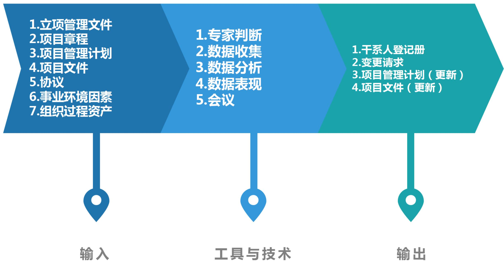
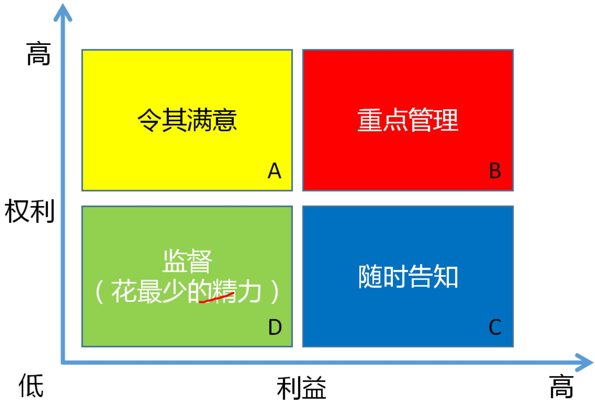
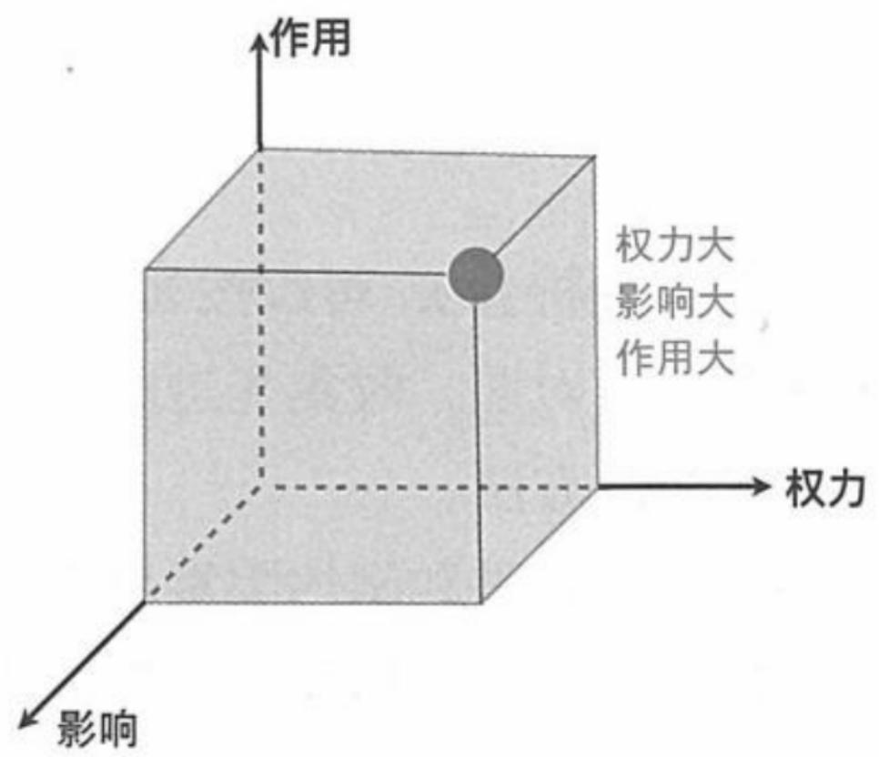
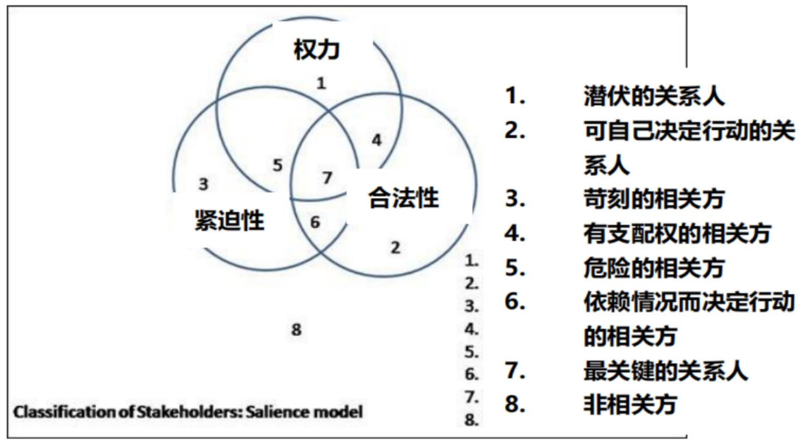
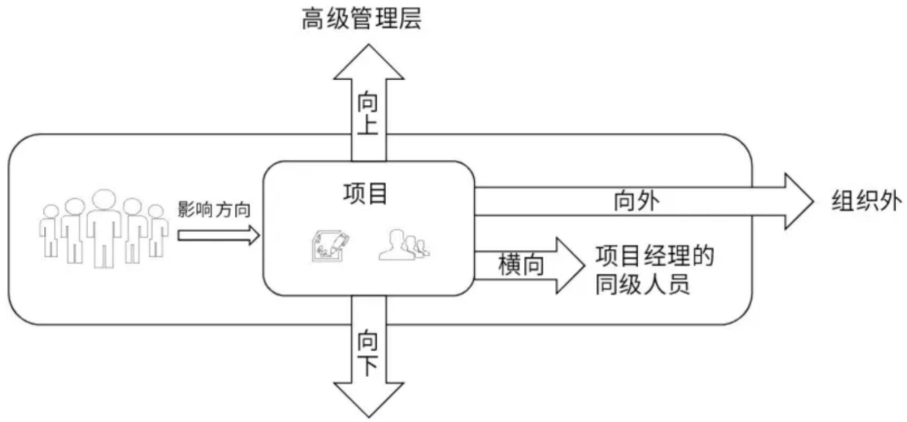
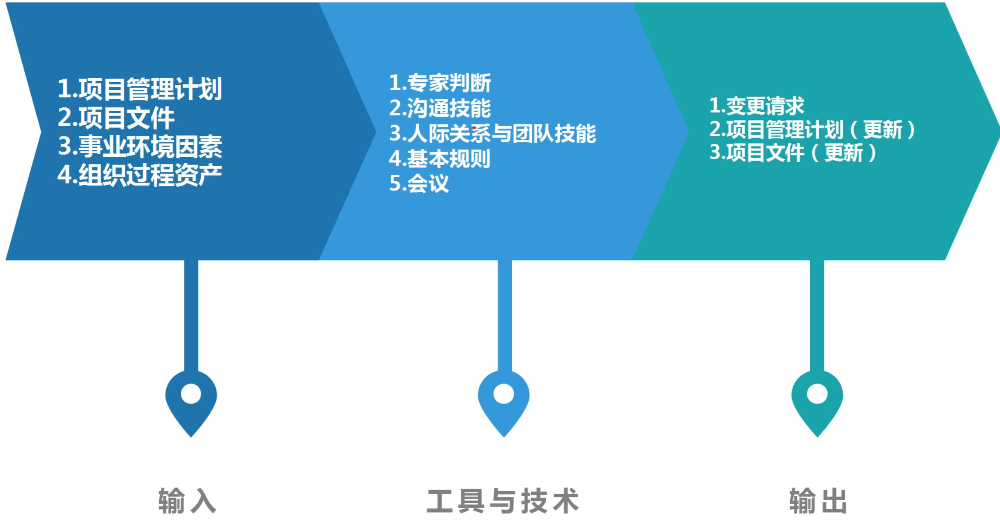
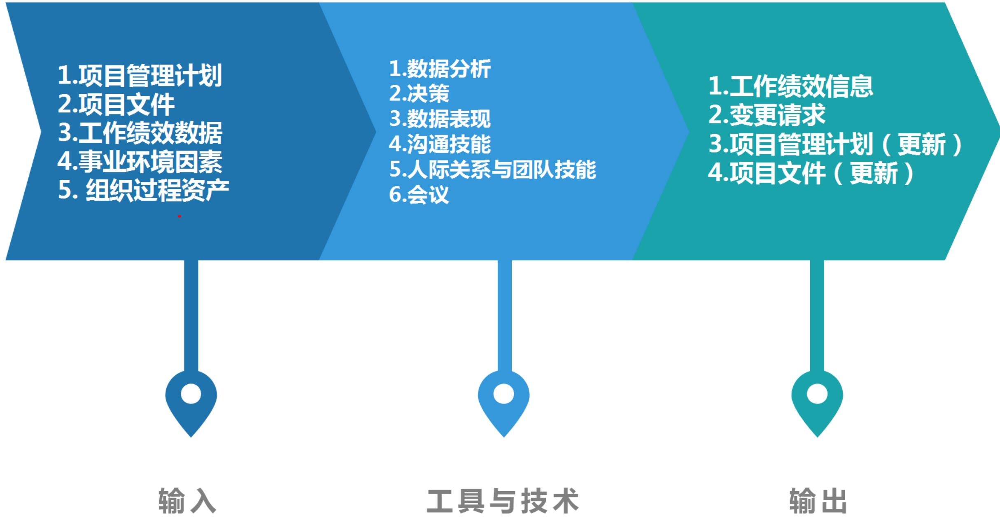

# 项目干系人管理

# 信息系统项目管理师

# 本章学习建议

根据历年的考试情况来看，由于本章内容属于10大管理的内容，通俗地讲，与项目有直接或间接关系的任何个人、群体或组织，都是项目干系人，项目干系人管理的重要性不言而喻。一方面，项目要取得成功，离不开项目干系人的支持与参与。另一方面，做项目最终是要满足项目干系人的利益追求，让干系人满意。上午选择、案例分析、论文写作都会进行考查。干系人一般上午考察2-3分左右。下午案例论文多与沟通结合在一起来考。

# 本章考情分析

<table><tr><td>年份</td><td>上午选择题</td><td>案例分析题</td><td>论文写作</td><td>合计</td></tr><tr><td>2023年05月</td><td>3</td><td>3</td><td>0</td><td>6</td></tr><tr><td rowspan="3">2023年11月</td><td rowspan="3">机考3分左右</td><td>15分(第1批)</td><td rowspan="3">75(第1批)</td><td rowspan="3">每个批次15-20分左右</td></tr><tr><td>15分(第2批)</td></tr><tr><td>20分(第4批)</td></tr><tr><td>2024年05月</td><td>机考3分左右</td><td>0</td><td>0</td><td>3</td></tr></table>

# 十大知识领域(背诵)

# 干系人管理ITO(掌握)

<table><tr><td colspan="5">干系人管理</td></tr><tr><td>组</td><td>过程</td><td>输入</td><td>工具和技术</td><td>输出</td></tr><tr><td>启动</td><td>1.识别干系人</td><td>1.立项管理文件
•商业论证
•效益管理计划
2.项目章程
3.项目管理计划
•沟通管理计划
•干系人参与计划
4.项目文件
•需求文件
•问题日志
•变更日志
5.协议
6.事业环境因素
7.组织过程资产</td><td>1.专家判断
2.数据收集
•问卷调查
•头脑风暴
3.数据分析
•干系人分析
•文件分析
4.数据表现
•干系人映射分析和表现
5.会议</td><td>1.干系人登记册
2.变更请求
3.项目管理计划(更新)
•需求管理计划
•沟通管理计划
•风险管理计划
•干系人参与计划
4.项目文件(更新)
•假设日志
•问题日志
•风险登记册</td></tr></table>

# 干系人管理ITO(掌握)

<table><tr><td>组</td><td>过程</td><td>输入</td><td>工具和技术</td><td>输出</td></tr><tr><td>规划</td><td>2.规划干系人参与</td><td>1.项目章程2.项目管理计划·资源管理计划·沟通管理计划·风险管理计划3.项目文件·假设日志·风险登记册·干系人登记册·项目进度计划·问题日志·变更日志4.协议5.事业环境因素6.组织过程资产</td><td>1.专家判断2.数据收集·标杆对照3.数据分析·假设条件和制约因素分析·根本原因分析4.决策·优先级排序/分级3.数据表现·思维导图·干系人参与度评估矩阵6.会议</td><td>1.干系人参与计划</td></tr></table>

# 干系人管理ITO(掌握)

<table><tr><td>组</td><td>过程</td><td>输入</td><td>工具和技术</td><td>输出</td></tr><tr><td>执行</td><td>3.管理干系人参与</td><td>1.项目管理计划
·沟通管理计划
·风险管理计划
·干系人参与计划
·变更管理计划
2.项目文件
·问题日志
·干系人登记册
·变更日志
·经验教训登记册
3.事业环境因素
4.组织过程资产</td><td>1.专家判断
2.沟通技能
·反馈
3.人际关系与团队技能
·冲突管理
·文化意识
·谈判
·观察/交谈
·政策意识
4.基本规则
5.会议</td><td>1.变更请求
2.项目管理计划(更新)
·沟通管理计划
·干系人参与计划
3.项目文件(更新)
·变更日志
·问题日志
·经验教训登记册
·干系人登记册</td></tr></table>

# 干系人管理ITO(掌握)

<table><tr><td>组</td><td>过程</td><td>输入</td><td>工具和技术</td><td>输出</td></tr><tr><td>监控</td><td>4.监督干系人参与</td><td>1.项目管理计划
·资源管理计划
·沟通管理计划
·干系人参与计划
2.项目文件
·风险登记册
·干系人登记册
·问题日志
·项目沟通记录
·经验教训登记册
3.工作绩效数据
4.事业环境因素
5.组织过程资产</td><td>1.数据分析
·备选方案分析
·根本原因分析
·干系人分析
2.决策
·多标准决策分析
·投票
3.数据表现
·干系人参与评估矩阵
4.沟通技能
·反馈
·演示
5.人际关系与团队技能
·积极倾听
·文化意识
·领导力
·人际交往
·政策意识
6.会议</td><td>1.工作绩效信息
2.变更请求
3.项目管理计划(更新)
·资源管理计划
·沟通管理计划
·干系人参与计划
4.项目文件(更新)
·问题日志
·经验教训登记册
·风险登记册
·干系人登记册</td></tr></table>

# 17.1 管理基础-17.1.1 管理的重要性(掌握)

每个项目都有干系人，他们会受到项目积极或消极的影响，或者能对项目施加积极或消极的影响。项目经理和团队管理干系人的能力决定着项目的成败。为提高项目成功的概率，尽早开始识别干系人并引导干系人参与。

干系人满意度应作为项目目标加以识别和管理。有效引导干系人参与的关键是重视所有干系人并保持持续沟通（包括团队成员），理解他们的需求和期望、处理所发生的问题、管理利益冲突，并促进干系人参与项目决策和活动。

为了实现项目收益，识别干系人和引导干系人参与的过程需要迭代开展。至少要在以下时点开展这些活动：①项目进入其生命周期的不同阶段；②当前干系人不再与项目工作有关，或者在项目的干系人群体中出现了新的干系人成员；③组织内部或更大领域的干系人群体发生重大变化。

# 17.1.2 管理新实践(了解)

项目干系人管理的发展趋势和新兴实践主要包括：

(1)识别所有干系人，而非在限定范围内。  
(2) 确保所有团队成员都涉及引导干系人参与的活动。  
(3) 定期审查干系人群体，可与单个项目风险的审查工作并行开展。  
(4) 应用 “共创” 概念, 咨询受项目工作或成果影响最大的干系人, 视其为合作伙伴。  
(5) 关注干系人有效参与程度的正面与负面价值。

# 17.2.1 过程概述(背诵)

<table><tr><td>过程</td><td>过程定义</td><td>主要作用</td></tr><tr><td>1.识别干系人</td><td>定期识别项目干系人，分析和记录他们的利益、参与度、相互依赖性、影响力和对项目成功的潜在影响的过程</td><td>使项目团队能够建立对每个干系人或干系人群体的适度关注【在整个项目期间定期开展】</td></tr><tr><td>2.规划干系人参与</td><td>根据干系人的需求、期望、利益和对项目的潜在影响，制定项目干系人参与项目的方法的过程</td><td>提供与干系人进行有效互动的可行计划
【在整个项目期间定期开展】</td></tr><tr><td>3.管理干系人参与</td><td>通过与干系人进行沟通协作，以满足其需求与期望、处理问题，并促进干系人合理参与的过程</td><td>尽可能提高干系人的支持度，并降低干系统的抵制程度【在整个项目期间开展】</td></tr><tr><td>4.监督干系人参与</td><td>监督项目干系人的关系，并通过修订参与策略和计划来引导干系人合理参与项目的过程</td><td>随着项目进展和环境变化，维持或提升干系人参与活动的效率和效果【在整个项目期间开展】</td></tr></table>

# 5大过程组与项目干系人管理(掌握)

<table><tr><td>10大管理</td><td>启动过程组</td><td>规划过程组</td><td>执行过程组</td><td>监控过程组</td><td>收尾过程组</td></tr><tr><td>项目干系人管理</td><td>①识别干系人</td><td>②规划干系人参与</td><td>③管理干系人参与</td><td>④监督干系人参与</td><td></td></tr></table>

# 17.2.2 裁剪考虑因素(了解)

# 裁剪考虑：

- 干系人多样性  
- 干系人关系的复杂性  
$\bullet$  沟通技术

# 17.2.3 敏捷与适应方法(了解)

敏捷型方法提倡高度透明。例如，邀请所有干系人参与项目会议和审查，或将项目工件发布到公共空间，其目的在于让各方之间的不一致和依赖关系，或者与项目有关的其他变化问题，都尽快浮现。

# 17.3 识别干系人(掌握)

识别干系人管理过程通常在编制和批准项目章程之前或同时首次开展，之后在项目生命周期过程中必要时重复开展，至少应在每个阶段开始时，以及项目或组织出现重大变化时重复开展。

# 识别干系人ITO(掌握)

1. 立项管理文件  
2. 项目章程  
3. 项目管理计划：在首次识别干系人时，项目管理计划并不存在；不过，一旦编制完成，可作为识别干系人输入的项目管理计划组件包括：

- 沟通管理计划：沟通管理计划中的信息是了解项目干系人的主要依据。  
- 干系人参与计划：确定有效引导干系人参与的管理策略和措施。

4.项目文件

- 需求文件：可以提供关于潜在干系人的信息。  
- 问题日志：所记录的问题可能为项目带来新的干系人，或改变现有干系人的参与类型。  
- 变更日志：可能引入新干系人，或改变干系人与项目的现有关系的性质。

5.协议

6.事业环境因素  
7.组织过程资产

# 17.3.2 工具与技术(掌握)

# 1. 专家判断

# 2.数据收集

- 问卷和调查：可以包括一对一调查、焦点小组讨论，或其他大规模信息收集技术  
头脑风暴：

头脑风暴是一种通用的数据收集和创意技术，用于向小组征求意见，如团队成员或主题专家。

头脑写作是头脑风暴的改良形式，让个人参与者有时间在小组创意讨论开始前单独思考问题。信息可通过面对面小组会议收集，或在由技术支持的虚拟环境中收集。

# 17.3.2 工具与技术(掌握)

# 3. 数据分析

# - 干系人分析：

会产生干系人清单和关于干系人的各种信息，例如，在组织内的岗位、在项目中的角色、与项目的利害关系、期望、态度（如对项目的支持程度），以及对项目信息的兴趣。干系人的利害关系组合主要包括：①兴趣；②权利（合法权利或道德权利）；③所有权；④知识；⑤贡献

- 文件分析：评估现有项目文件及以往项目的经验教训，以识别干系人和其他支持性信息

# 17.3.2 工具与技术(掌握)

# 4. 数据表现：干系人映射分析和表现

- 权力利益方格、权力影响方格、作用影响方格：

基于干系人的职权级别（权力）、对项目成果的关心程度（利益）、对项目成果的影响能力（影响），或改变项目计划或执行的能力

权力：有合法资格对项目施加影响（合法资格）

影响：对项目施加影响的主观愿望大小（乐意参与）

作用：施加影响后能在多大程度上导致项目做出变更（所提建议适用性）

- 干系人立方体：方格模型的改良形式。立方体把上述方格中的要素组合成三维模型，作为一个多维模型，它将干系人视为一个多维实体，便于分析，从而有助于沟通策略的制定。  
- 凸显模型：

通过评估干系人的权力（职权级别或对项目成果的影响能力）、紧迫性（因时间约束或干系人对项目成果有重大利益诉求而导致需立即加以关注）和合法性（参与的适当性），对干系人进行分类。在凸显模型中，也可以用邻近性取代合法性，以便考察干系人参与项目工作的程度。这种凸显模型适用于复杂的干系人大型群体，或在干系人群体内部存在复杂的关系网络。凸显模型可用于确定已识别干系人的相对重要性。

# 权力 / 利益方格(掌握)

B区（重点管理、及时汇报--项目的客户和项目经理的主管领导）；

C区（随时告知）；  
A区（令其满意）；  
D区（花最少的精力来监督他们）

- 权高利低—让他爽  
·权低利高一常告知  
·权高利高一重管理  
·权低利低—仅监督

# 17.3.2 工具与技术(掌握)

  
干系人立方体

  
凸显模型

# 17.3.2 工具与技术(掌握)

# 干系人映射分析和表现

# $\bullet$  影响方向：

可以根据干系人对项目工作或项目团队本身的影响方向，对干系人进行分类。可以把干系人分类为：

(1)向上：执行组织或客户组织、发起人和指导委员会的高级管理层。  
(2)向下：临时贡献知识或技能的团队或专家。  
(3)向外：项目团队外的干系人群体及其代表，如供应商、政府机构、公众、最终用户和监管部门。  
(4)横向：项目经理的同级人员，如其他项目经理或中层管理人员。

# 优先级排序：

适用于：如果项目有大量干系人、干系人群体的成员频繁变化、干系人和项目团队之间或干系人群体内部的关系复杂。

# 5.会议

影响方向

# 17.3.2 工具与技术(掌握)

  
临时贡献知识或技能的团队或专家

# 17.3.3 输出(掌握)

1.干系人登记册：记录已识别干系人的信息，主要包括：

- 身份信息：姓名、组织职位、地点、联系方式，以及在项目中扮演的角色。  
- 评估信息：主要需求、期望、影响项目成果的潜力，以及干系人最能影响或冲击的项目生命周期阶段。  
- 干系人分类：用内部或外部，作用、影响、权力或利益，上级、下级、外围或横向，或者项目经理选择的其他分类模型进行分类的结果等。

# 2. 变更请求

3.项目管理计划（更新）  
4.项目文件（更新）

# 干系人登记册(掌握)

<table><tr><td colspan="3">基本信息</td><td rowspan="2">评估信息-主要影响</td><td rowspan="2">分类(内/外)</td><td rowspan="2">关键程度 (1-10分)</td></tr><tr><td>编号</td><td>干系人</td><td>职能角色</td></tr><tr><td>NB01</td><td>CEO</td><td>发起人</td><td>项目总体投入、全局走向</td><td>内部</td><td>10</td></tr><tr><td>NB02</td><td>研发中心总经理</td><td>发起人</td><td>项目总体技术实现</td><td>内部</td><td>10</td></tr><tr><td>NB03</td><td>PMO负责人</td><td>项目支持</td><td>总体项目运作支持</td><td>内部</td><td>6</td></tr><tr><td>NB04</td><td>平台技术负责人</td><td>技术负责人</td><td>云开放平台和监控后台设计与开发</td><td>内部</td><td>8</td></tr><tr><td>NB05</td><td>产品经理</td><td>需求及产品负责人</td><td>产品设计与需求,确定需求优先级</td><td>内部</td><td>8</td></tr><tr><td>WB01</td><td>市局信息中心主任</td><td>客户主管领导</td><td>业务需求确认、总体业务方案确定</td><td>外部</td><td>10</td></tr><tr><td>WB02</td><td>信息中心专家</td><td>客户代表</td><td>用户功能需求确认,各业务部门协调</td><td>外部</td><td>8</td></tr></table>

# 17.4 规划干系人参与(掌握)

应在项目生命周期的早期制订一份有效的计划;然后，随着干系人群体的变化，定期审查和更新该计划。在通过识别干系人过程明确最初的干系人群体之后，就应该编制第一版的干系人参与计划，然后定期更新干系人参与计划，以反映干系人群体的变化。

会触发该计划更新的情况主要包括：

(1)项目新阶段开始;  
(2)组织结构或行业内部发生变化;  
③新的个人或群体成为干系人，现有干系人不再是干系人群体的成员，或特定干系人对项目成功的重要性发生变化；  
(4)当其他项目过程（如变更管理、风险管理或问题管理）的输出导致需要重新审查干系人参与策略等。

# 规划干系人参与ITO(掌握)

# 17.4.1 输入(掌握)

# 1. 项目章程

# 2.项目管理计划

- 资源管理计划：包含团队成员及其他干系人角色和职责的信息。  
- 沟通管理计划：用于干系人管理的沟通策略以及用于实施策略的计划，既是项目干系人管理中的各个过程的输入，又会收录来自这些过程的相关信息。  
- 风险管理计划：可能包含风险临界值或风险态度，有助于选择最佳的干系人参与策略组合。

# 3.项目文件

- 干系人登记册:提供项目干系人的清单、分类情况和其他信息。

# 4.协议

5.事业环境因素  
6.组织过程资产

# 17.4.2 工具与技术(掌握)

1. 专家判断  
2. 数据收集：标杆对照。将干系人分析的结果与其他被视为具备引领级的组织或项目的信息进行比较。  
3.数据分析

- 假设条件和制约因素分析：可能需要分析当前的假设条件和制约因素，以合理剪裁干系人参与策略  
- 根本原因分析：识别是什么根本原因导致了干系人对项目的某种支持水平，以便选择适当策略来改进其参与水平。

4.决策：优先级排序或分级。应该对干系人需求以及干系人本身进行优先级排序或分级。具有最大利益和最高影响的干系人，通常应该排在优先级清单的最前面。

# 17.4.2 工具与技术(掌握)

# 5.数据表现

- 思维导图：用于对干系人信息、相互关系以及他们与组织的关系进行可视化整理  
- 干系人参与度评估矩阵：用于将干系人当前参与水平与期望参与水平进行比较。

干系人参与水平可分为如下:

(1)不了解型：不知道项目及其潜在影响。  
(2) 抵制型：知道项目及其潜在影响，但抵制项目工作或成果可能引发的任何变更。此类干系人不会支持项目工作或项目成果。  
(3)中立型：了解项目，但既不支持，也不反对。  
(4) 支持型：了解项目及其潜在影响，并且会支持项目工作及其成果。  
(5)领导型：了解项目及其潜在影响，而且积极参与以确保项目取得成功。

# 17.4.2 工具与技术(掌握)

<table><tr><td>干系人</td><td>不知晓</td><td>抵制</td><td>中立</td><td>支持</td><td>领导</td></tr><tr><td>干系人1</td><td>C</td><td></td><td></td><td>D</td><td></td></tr><tr><td>干系人2</td><td></td><td></td><td>C</td><td>D</td><td></td></tr><tr><td>干系人3</td><td></td><td></td><td></td><td>D C</td><td></td></tr></table>

C 表示当前参与程度  
D 表示所需参与程度

C代表每个干系人的当前参与水平，而D是项目团队评估出来的、为确保项目成功所必不可少的参与水平（期望的）。  
- 应根据每个干系人的当前与期望参与水平的差距，开展必要的沟通，有效引导干系人参与项目。

# 6.会议

# 17.4.3 输出(掌握)

# 1.干系人参与计划

干系人参与计划主要包括调动干系人个人或群体参与的特定策略或方法。干系人参与计划可以是正式的或非正式的，非常详细的或高度概括的。

# 17.5 管理干系人参与(掌握)

在管理干系人参与过程中需要活动包括:

(1)在适当的项目阶段引导干系人参与，以便获取、确认或维持他们对项目成功的持续承诺;  
(2)通过谈判和沟通的方式管理干系人期望;  
(3)处理与干系人管理有关的任何风险或潜在关注点，预测干系人可能在未来引发的问题；  
(4)澄清和解决已识别的问题等。

# 管理干系人参与ITO(掌握)

# 1.项目管理计划

- 沟通管理计划  
- 风险管理计划：描述了风险类别、风险偏好和报告格式。  
干系人参与计划  
- 变更管理计划

# 2.项目文件

- 问题日志：记录项目或干系人关注点，以及关于处理问题的行动方案。  
- 干系人登记册  
- 变更日志：记录变更请求及其状态，并将其传递给适当的干系人。  
- 经验教训登记册

# 3. 事业环境因素

# 4.组织过程资产

# 17.5.2 工具与技术(掌握)

1. 专家判断  
2. 沟通技能：包括正式与非正式对话、问题识别和讨论、会议、进展报告和调查。  
3.人际关系与团队技能

<table><tr><td>• 冲突管理：项目经理应确保及时解决冲突</td></tr><tr><td>• 文化意识：有助于项目经理和团队通过考虑文化差异和干系人需求，来实现有效沟通</td></tr><tr><td>• 谈判：用于获得支持或达成关于支持项目工作或成果的协议，并解决团队内部或团队与其他干系人之间的冲突</td></tr><tr><td>• 观察和交谈：及时了解项目团队成员和其他干系人的工作和态度</td></tr><tr><td>• 政策意识：通过了解项目内外的权力关系，建立政策意识</td></tr></table>

4. 基本规则：根据团队章程中定义的基本规则，明确项目团队成员和其他干系人引导干系人参与的行为。  
5.会议

# 17.5.3 输出(掌握)

1.变更请求  
2.项目管理计划（更新）  
3.项目文件（更新）

# 17.6 监督干系人参与(掌握)

监督干系人参与是监督项目干系人的关系，并通过修订参与策略和计划来引导干系人合理参与项目的过程。本过程的主要作用是，随着项目进展和环境变化，维持或提升干系人参与活动的效率和效果。本过程需要在整个项目期间开展。监督干系人参与过程的数据流向。

# 监督干系人参与ITO(掌握)

# 1.项目管理计划

- 资源管理计划：确定了对团队成员的管理方法。  
- 沟通管理计划：描述了适用于项目干系人的沟通计划和策略。  
- 干系人参与计划：定义了管理干系人需求和期望的计划。

# 2.项目文件

风险登记册  
- 干系人登记册  
- 问题日志  
- 项目沟通记录：根据沟通管理计划和干系人参与计划与干系人开展的项目沟通记录。  
- 经验教训登记册

3.工作绩效数据  
4. 事业环境因素  
5. 组织过程资产

# 17.6.2 工具与技术(掌握)

# 1. 数据分析

- 备选方案分析：在干系人参与效果没有达到期望要求时，应该开展备选方案分析，评估应对偏差的各种备选方案  
- 根本原因分析：开展根本原因分析，确定干系人参与未达预期效果的根本原因  
- 干系人分析：确定干系人群体和个人在项目任何特定时间的状态

# 2.决策

- 多标准决策分析：考察干系人成功参与项目的标准，并根据其优先级排序和加权，识别出最适当的选项  
- 投票：通过投票选出应对干系人参与水平偏差的最佳方案。

3. 数据表现：干系人参与度评估矩阵。跟踪每个干系人参与水平的变化，对干系人参与加以监督。

# 17.6.2 工具与技术(掌握)

# 4.沟通技能

- 反馈：用于确保发送给干系人的信息被接收和理解  
- 演示：为干系人提供清晰的信息

# 5.人际关系与团队技能

- 积极倾听：通过积极倾听，减少理解错误和沟通错误  
- 文化意识：文化意识和文化敏感性有助于项目经理分析干系人和团队成员的文化差异和文化需求，并对沟通进行规划  
- 领导力：成功的干系人参与，需要强有力的领导技能，以传递愿景并激励干系人支持项目工作和成果  
- 人际交往：通过人际交往了解关于干系人参与水平  
- 政策意识：有助于理解组织战略，理解谁能行使权力和施加影响，以及培养与这些干系人沟通的能力

# 6.会议

# 17.6.3 输出(掌握)

1. 工作绩效信息  
2.变更请求  
3.项目管理计划（更新）  
4.项目文件（更新）

# 本章练习

(1) ( )不属于项目干系人管理的输入。

A.干系人管理计划

B.干系人沟通需求

C. 变更日志

D.变更请求

【答案】D

(2) 识别干系人的依据不包括 ( )。

A.可行性研究报告

B. 项目章程

C.风险登记册

D.问题日志

【答案】C

# 本章练习

(3) 监督干系人参与过程的作用是 ( )。

A.维持或提升干系人参与活动的效率和效果  
B.提高干系人对项目的支持度，并尽可能降低干系人对项目的抵制  
c.提供与干系人进行有效互动的可行计划  
D.项目团队能够建立对每个干系人或干系人群体的适度关注

【答案】A

# 本章练习

判断下列表述正误，正确的选v，错误的选×。

(1) 干系人管理过程即识别干系人、规划干系人参与和管理干系人参与的过程。  
(2) 干系人包括项目团队成员。  
(3) 识别干系人应在项目初期开展且仅开展一次，尽可能识别所有干系人。

【答案】  $(1) \times (2) \vee (3) \times$

# 历年真题练习

# 【2023年上半年-第52题】

在以下干系人参与度矩阵中，需要授权管理职责并引导其积极参与项目执行的干系人是（）。

<table><tr><td>干系人</td><td>不知晓</td><td>抵制</td><td>中立</td><td>支持</td><td>领导</td></tr><tr><td>干系人1</td><td></td><td></td><td>○●</td><td></td><td></td></tr><tr><td>干系人2</td><td></td><td></td><td>●</td><td>○</td><td></td></tr><tr><td>干系人3</td><td></td><td></td><td>●</td><td></td><td>○</td></tr></table>

注：○表示期望参与水平，●表示实际参与水平

A.干系人1

B.干系人2

C.干系人3

D.干系人2和干系人3

【答案】C

# 历年真题练习

【2023年上半年-第53题】

（）不属于识别干系人的输入。

A.立项管理文件

B.变更日志和问题日志

C.沟通管理计划

D.项目干系人登记册

【答案】D

# 历年真题练习

# 【2023年上半年-第54题】

“通过与干系人进行沟通协作以满足其需求与期望，处理问题促进其合理参与”属于（）过程的工作。

A.识别干系人

B.规划干系人参与

C.管理干系人参与

D.监督干系人参与

【答案】C

# 历年真题练习

# 【2023年下半年-第4批次】

识别项目干系人管理过程在（）可以重复开展。

①每个阶段开始时②项目出现重大变化时③进行可行性研究时④组织出现重大变化时⑤编制项目章程时

A.③④⑤

B.①②③

C.②③④

D.①②④

【答案】D

# 历年真题练习

# 【2024年上半年-第1批次】

项目经理根据干系人的需求、期望、利益和对项目的潜在影响，制定项目干系人参与项目的方法，则该项目经理正在执行（）过程。

A.监督干系人参与参与

B.识别干系人

C.规划干系人参与

D.管理干系人

【答案】C

# Thank You!

微信公众号：野人老师 淘宝店铺：yeren.taobao.com