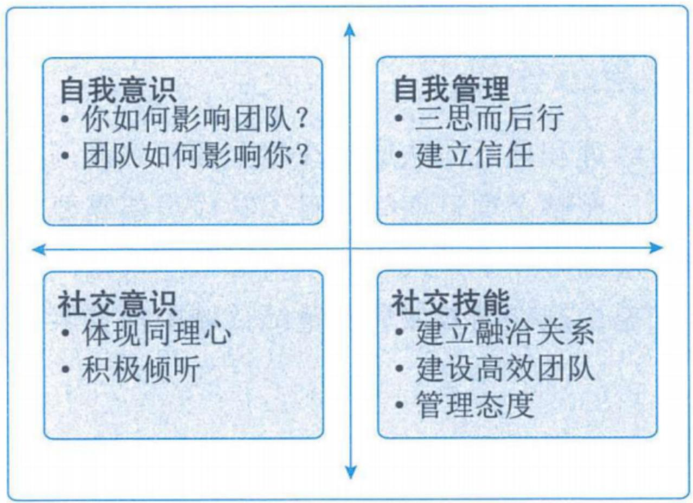
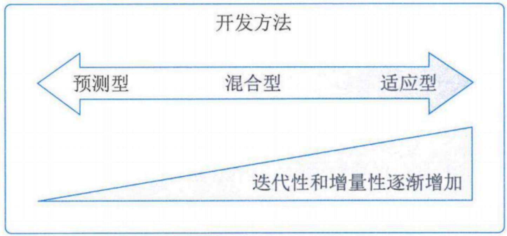
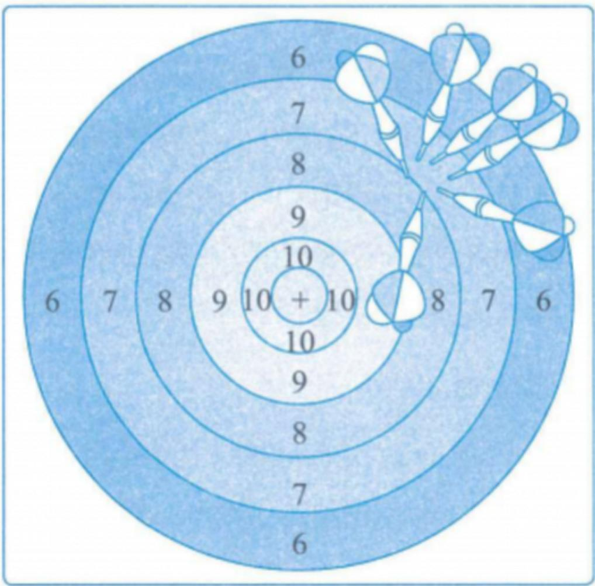
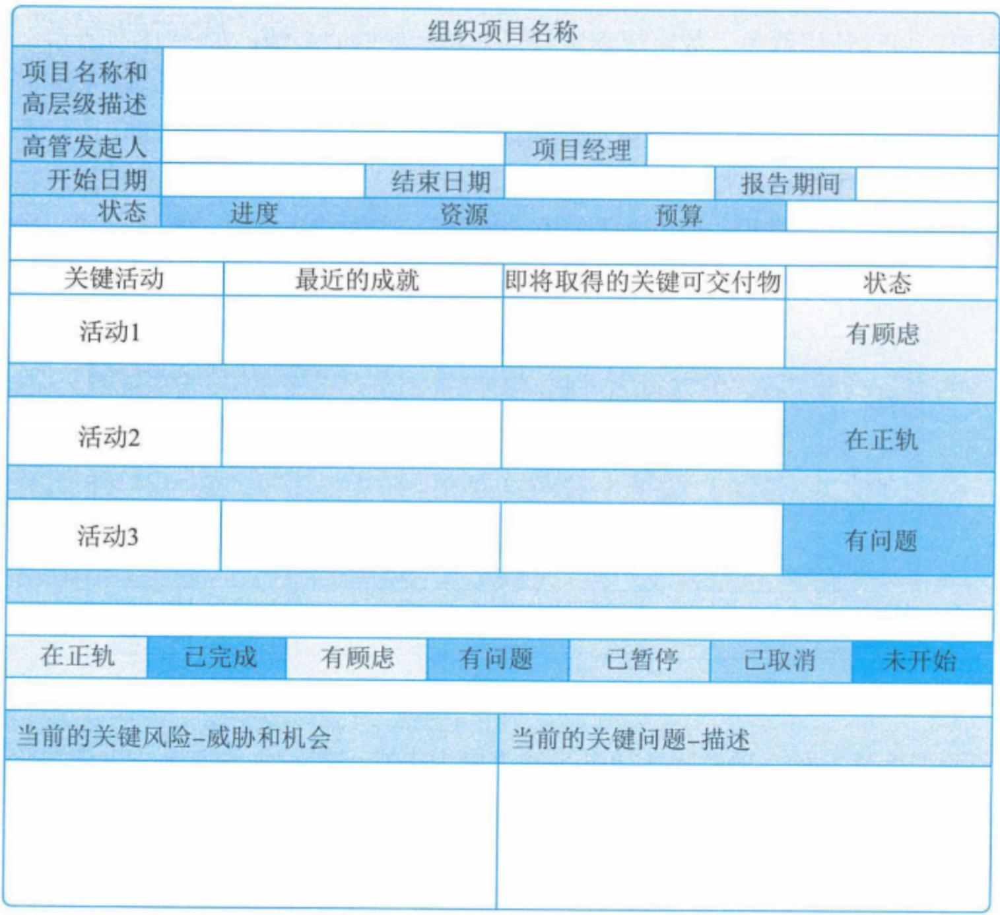
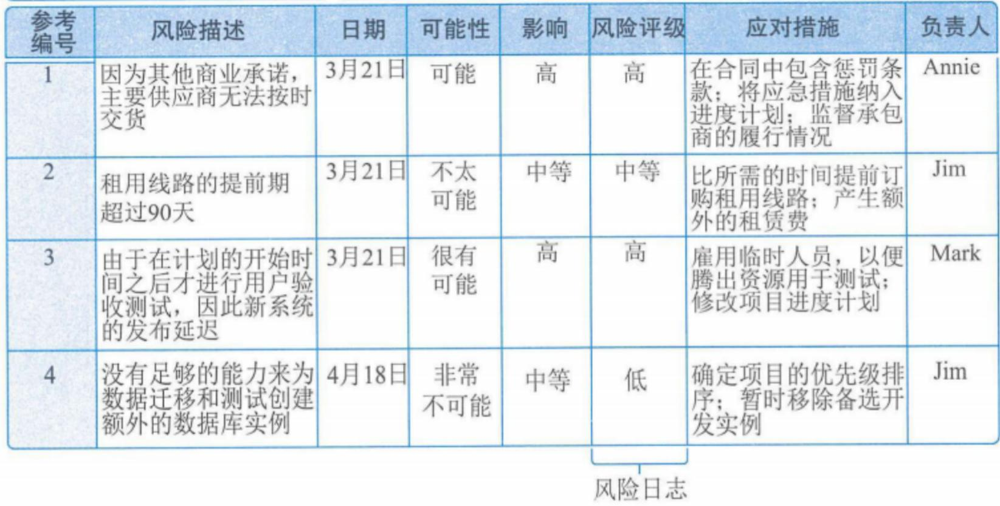
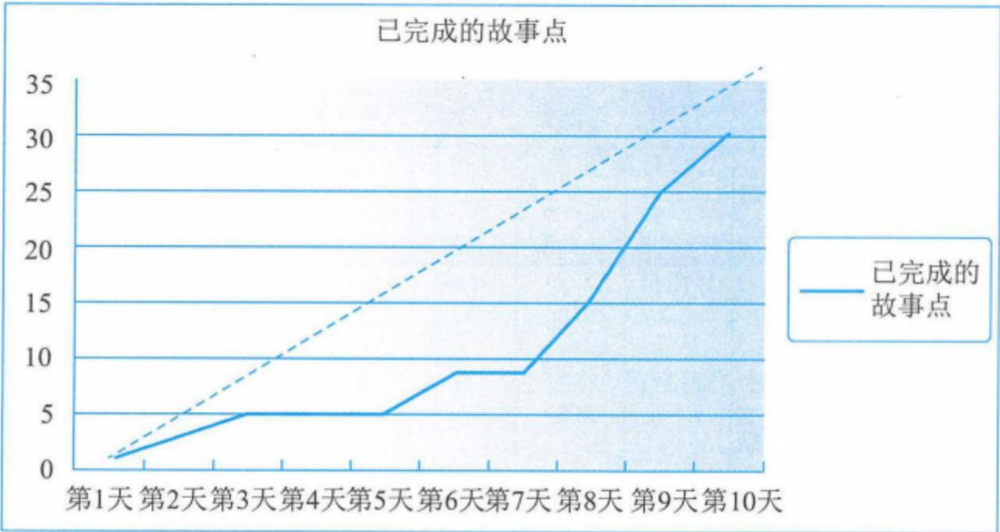

# 项目绩效域

# 信息系统项目管理师

# 本章学习建议

PMBOK一直是基于过程的项目管理标准的重要代表，项目管理从业者一直坚持基于过程的项目管理方法。随着信息技术和项目管理的快速发展，单独的基于过程的项目管理思想已经无法反映业务及项目管理的需要。从2021年开始，第7版 PMBOK 采用了基于原则的标准，其中包含了12个项目管理基本原则，这些基本原则为有效的项目管理提供支持，并更多地关注项目的预期成果。然而，很多项目管理从业人员认为过去基于过程的方法依然非常有用，在指导项目管理能力、调整方法论并评估项目管理能力方面起到非常重要的作用，因此，基于过程的方法是项目管理的基石。人们今天在关注项目管理原则，关注实现项目最终的价值交付的同时，依然离不开过程的方法，依然需要考虑10大项目管理知识领域的支撑。本章预计会考2-3分的选择题。案例分析、论文也会考。

# 本章考情分析

<table><tr><td>年份</td><td>上午选择题</td><td>案例分析题</td><td>论文写作</td><td>合计</td></tr><tr><td>2023年05月</td><td>3</td><td>0</td><td>0</td><td>3</td></tr><tr><td>2023年11月</td><td>机考3分左右</td><td>5分（第1批）
15分（第3批）
5分（第4批）</td><td>75（第2批）</td><td>每个批次8-15分左
右</td></tr><tr><td>2024年05月</td><td>机考3分左右</td><td>0</td><td>0</td><td>3</td></tr></table>

价值驱动的项目管理知识体系关注价值的实现，包含了项目管理原则、绩效域、项目生命周期、过程组、10大知识领域和价值交付系统。在整个生命周期过程中，项目管理者需要始终坚持项目管理原则，通过涵盖10大知识领域的项目管理过程组对项目进行管理，同时需要密切关注干系人、团队、开发方法和生命周期、规划、项目工作、交付、测量、不确定性这8个与绩效密切相关的因素，我们称之为绩效域。通过这8个绩效域帮助项目在系统内运作，实现价值交付系统的功能，为组织及其干系人创造价值，从而实现组织的战略和目标。

# 18.1 干系人绩效域(掌握)

干系人绩效域涉及与干系人相关的活动和职能。在项目整个生命周期过程中，有效执行本绩效域可以实现的预期目标主要包含：

(1)与干系人建立高效的工作关系；  
(2)干系人认同项目目标；  
(3)支持项目的干系人提高了满意度，并从中收益；  
(4)反对项目的干系人没有对项目产生负面影响。

在项目整个生命周期过程中，为了有效执行干系人绩效域，项目经理需要重点促进干系人的参与。

# 18.1.1 绩效要点(掌握)

为了有效地让干系人参与，项目经理可带领项目团队按下面的步骤开展工作。

(1)识别。在组建项目团队之前，可以先识别高层级的干系人，再逐步逐层识别详细的干系人。识别过程中需要注意：有些干系人很容易识别，如客户、发起人、项目团队、最终用户等，但有些干系人很难识别，需要综合考虑项目所处的内外部环境再进行详细挖掘。在项目进展期间，如果出现新的干系人或者干系人环境发生了变化，项目团队需要重复进行干系人识别活动。  
(2) 理解和分析。一旦识别了干系人, 项目经理和项目团队就需要尽力去了解干系人的感受、情绪、信念和价值观, 分析每个干系人对项目的立场和持有的观点。随着时间推移和环境的变化, 干系人对项目的立场和持有的观点会发生变化, 因此, 理解和分析干系人是项目生命周期中一项持续进行的工作。

对干系人进行分析时，需要考虑的因素包括：权力、作用、态度、信念、期望、影响程度、与项目的邻近性、在项目中的利益、与干系人和项目互动相关的其他方面，这些信息有助于项目团队考虑干系人的动机和行为。此外，如果超出分析的背景范围，可能会被误解，因此需要对干系人的分析工作进行保密。

在实际项目中，干系人通常会结成联盟，因此除了需要针对干系人进行独立分析外，项目经理和项目团队还需要考虑并分析干系人之间的互动关系。

# 18.1.1 绩效要点(掌握)

(3) 优先级排序。项目会涉及很多干系人, 有些干系人可能无法全部直接或有效地参与, 项目经理和项目团队需要对干系人进行优先级排序, 将管理焦点聚焦于权力和利益大的干系人。在项目进展期间, 如果出现新的干系人或者干系人环境发生了变化, 项目团队需要重新进行优先级排序。  
(4) 参与。项目执行过程中, 项目经理和项目团队需要促进干系人参与到项目中, 以启发他们的需求, 并和干系人一起管理需求、进行谈判、解决问题, 并做出决策。促进干系人参与时需要运用一些软技能, 如积极倾听、人际关系技能和冲突管理, 以及创建愿景和批判性思维等领导技能

与干系人的沟通可以通过各种形式，结合第14章项目沟通管理过程中的方法和技术，采用多种沟通方法与干系人进行沟通。

# 18.1.1 绩效要点(掌握)

(5) 监督。在整个项目期间, 随着项目的进展, 一些新的干系人会被识别,也有一些其他干系人会退出, 干系人以及干系人的态度或权力将发生变化。因此,在整个项目期间需要对干系人参与的数量和有效性进行监督, 除了不断识别和分析新的干系人外, 还要评估当前的参与策略是否有效或是否需要调整。

可以通过干系人满意度指标来评估干系人绩效域的有效性。通常可以通过与干系人的对话来确定干系人满意度，也可以通过项目或迭代审查会、产品审查会和其他方法获得定期反馈。如果有大量的干系人，还可以使用问卷调查来评估满意度，必要时，甚至可以通过更新干系人参与方法来提高干系人的满意度。

# 18.1.2 与其他绩效域的相互作用(掌握)

很多项目工作都是围绕着促进干系人参与、与干系人进行沟通而展开的，干系人会参与到。项目的很多方面，某些干系人可以帮助减少项目的不确定性，而有些干系人则可能导致不确定性的增加。干系人主要参与的项目工作包括：

(1)为项目团队定义需求和范围，并对其进行优先级排序；  
(2)参与并制定规划；  
(3)确定项目可交付物和项目成果的验收和质量标准；  
④客户、高层管理人员、项目管理办公室领导或项目集经理等干系人将重点关注项目及其可交付物绩效的测量。

# 18.1.3 执行效果检查(掌握)

在项目整个生命周期过程中，项目经理和项目团队需要对干系人绩效域的执行效果进行检查，确保其有效执行并实现预期目标。执行效果检查的方法如表所示。

<table><tr><td>预期目标</td><td>指标及检查方法</td></tr><tr><td>建立高效的工作关系</td><td>干系人参与的连续性：通过观察、记录方式，对干系人参与的连续性进行衡量</td></tr><tr><td>干系人认同项目目标</td><td>变更的频率：对项目范围、产品需求的大量变更或修改可能表明干系人没有参与进来或与项目目标不一致</td></tr><tr><td>支持项目的干系人提高了满意度，并从中收益；反对项目的干系人没有对项目产生负面影响</td><td>·干系人行为：干系人的行为可表明项目受益人是否对项目感到满意和表示支持，或者他们是否反对项目
·干系人满意度：可通过调研、访谈和焦点小组方式，确定干系人满意度，判断干系人是否感到满意和表示支持，或者他们对项目及其可交付物是否表示反对
·干系人相关问题和风险：对项目问题日志和风险登记册的审查可以识别与单个干系人有关的问题和风险</td></tr></table>

# 18.2 团队绩效域(掌握)

团队绩效域涉及项目团队人员有关的活动和职能。在项目整个生命周期过程中，有效执行本绩效域可以实现预期目标，主要包含：

(1)共享责任；  
②建立高绩效团队；  
(3)所有团队成员都展现出相应的领导力和人际关系技能。

在项目整个生命周期过程中，为了有效执行团队绩效域，项目经理需要重点关注：项目团队文化、高绩效项目团队和领导力技能。

# 18.2.1 绩效要点(掌握)

# 1.项目团队文化

项目团队文化反映了项目团队中个体的工作和互动方式。每个项目团队都会发展出自己的团队文化。项目团队文化可以通过制定项目团队规范这种方式有意识地形成，也可以通过项目团队成员的行为非正式地形成。项目经理可以通过如下方法，确保形成和维护一个安全、尊重、无偏见的团队文化，支持团队成员坦诚沟通：

- 透明：保持透明有助于识别和分享。同时对偏见也要保持透明。  
- 诚信：由职业道德行为和诚实组成。  
- 尊重：指尊重每个人及其思维方式、技能以及他们为项目团队的贡献。  
- 积极的讨论：在整个项目期间，通过对话或辩论等方式进行积极的讨论，处理各种意见、不同的见解或观点，消除误解。  
- 支持：通过解决问题和消除障碍因素来向项目团队成员提供支持，可以建立一种支持性的文化，并形成一个信任和协作的环境。支持也可以通过提供鼓励、体现同理心和参与积极倾听来加以展现。  
- 勇气：勇于提出建议、表达异议或尝试新事物有助于形成一种文化。  
- 庆祝成功：在项目进行过程中，当项目达到小阶段目标时，或者团队成员做出创新、适应并服务他人和学习等贡献时，要实时庆祝并认可，这样可以激励项目团队和个人朝着项目整体目标稳步前进。

# 2. 高绩效项目团队

项目经理和项目团队通过以下方式打造高绩效项目团队：

- 开诚布公的沟通：达成共识、信任和协作的基石。在开诚布公、安全的沟通环境中，可以有效开展会议、解决问题和开展头脑风暴等活动。  
- 共识：共享项目的目的及其将带来的收益。  
- 共享责任：项目团队成员对成果的主人翁意识越强，表现得就越好。  
·信任：成员相互信任的项目团队愿意付出额外的努力来取得成功。  
- 协作：项目团队相互协作与合作，有助于产生多样化的想法，获得更好的成果。  
- 适应性：项目团队能够根据环境和情况调整工作方式，使工作更加有效。  
- 韧性：出现问题或故障时，高绩效项目团队可以快速恢复。  
- 赋能：给项目团队成员赋能，有助于其有权就所采取的工作方式做出决策。  
- 认可：获得认可更有可能继续取得出色绩效，即使是表达赞赏这样的简单举动也能强化积极的团队行为。

# 18.2.1 绩效要点(掌握)

# 3.领导力技能

与领导力相关的特征和活动包括：

(1) 建立和维护愿景。项目愿景简明扼要地总结了项目的目的，描述了项目未来的预期成果。除了简要描述项目的未来状态之外，愿景还可以作为激励工具，当项目团队成员专注于日常工作的琐碎细节时，共同的愿景有助于让大家朝着相同的方向努力。  
(2) 批判性思维。批判性思维是训练有素、合乎理性、遵从逻辑、基于证据的思维, 包括概念想象力、洞察力、直觉、反思性思维和元认知 (“思考之上的思考” 和 “认知之上的认知”), 它需要项目团队成员具备开放思维和客观分析问题的能力。  
(3) 激励。激励项目团队成员涉及两个方面：一是了解哪些因素可以激励项目团队成员实现出色绩效；二是与项目团队成员合作，致力于开展项目活动并取得预期成果。

# 18.2.1 绩效要点(掌握)

(4) 人际关系技能。项目中经常使用的人际关系技能包括：

- 情商：情商是识别自己的和他人的情绪的能力，是对个人感受的认可、对他人的感受体现同理心以及采取适当行动的能力，可用于指导思维和行为。情商一般集中在4个层次：

(1)自我意识：是进行现实的自我评估的能力，它包括了解自己的情绪、目标、动机、优势和劣势；  
(2)自我管理：也称为“自我调节”，是控制破坏性感受和冲动并使它们改变方向的能力，它是在采取行动之前进行思考以及暂缓仓促判断和冲动决策的能力；  
(3)社交意识：涉及体现同理心以及理解并考虑他人的感受的能力，包括读懂非语言暗示和肢体语言的能力；  
④社交技能：是情商的高阶境界，它涉及管理项目团队、建立社交网络、寻找与干系人的共同基础以及建立融洽的关系。

# 18.2.1 绩效要点(掌握)

图中，上半部分与自我相关，下半部分与社交相关;左半部分与意识相关，右半部分与管理和技能相关。某些情商模型还包括第5个方面，即动机。动机是理解驱动和激励人的因素。

  
图18-2 情商的组成部分

# 18.2.1 绩效要点(掌握)

- 决策：项目经理和项目团队每天都要做出许多决策，决策可由项目经理和项目团队成员单方面做出。单方面决策速度快，但容易出错，也会因为未考虑受决策影响的人的感受而降低他们的积极性。

群体决策具有包容性的特点，包容性可增加对决策的承诺，可以利用群体广泛的知识，让人们参与决策，使他们对成果更加认同。群体决策的缺点是需要参与者从工作中停下来，所以耗时较长，而且团队合作可能会被中断。

为了充分发挥单方面决策和整体决策的优势，项目团队进行决策时通常遵循发散 / 汇聚的模式：首先由干系人分别参与（避免资深的或有魅力的干系人对其他干系人产生不当影响），制定一套广泛的备选解决方案；然后项目团队再将方案汇聚一起，确定一个首选的解决方案。发散 / 汇聚的模式可以快速做出决策，同时以包容和尊重的方式吸收团队多样化的知识。

- 冲突管理：解决冲突的方法包括：①尊重、开诚布公地进行沟通 ②聚焦于问题 ③聚焦于当前和未来 ④共同寻找备选方案

# 18.2.2 与其他绩效域的相互作用(掌握)

团队绩效域聚焦于项目经理和项目团队成员在整个项目生命周期过程中的技能，这些技能已融入项目的其他各个方面，在整个项目期间项目团队成员都需要全程展现团队相关的领导力素质和技能。例如，在进行规划时和干系人沟通项目愿景和收益；在参与项目工作时运用批判性思维解决问题和决策；在整个规划绩效域和测最绩效域中都要聚焦于团队绩效；应用团队相关技能。

# 18.2.3 执行效果检查(掌握)

在项目整个生命周期过程中，项目经理和项目团队需要对团队绩效域的执行效果进行检查，确保其有效执行并实现预期目标。具体检查方法如表所示。

<table><tr><td>预期目标</td><td>指标及检查方法</td></tr><tr><td>共享责任</td><td>目标和责任心：所有项目团队成员都了解愿景和目标。项目团队对项目的可交付物和项目成果承担责任</td></tr><tr><td>建立高绩效团队</td><td>·信任与协作程度：项目团队彼此信任，相互协作
·适应变化的能力：项目团队适应不断变化的情况，并在面对挑战时有韧性
·彼此赋能：项目团队感到被赋能，同时项目团队对其成员赋能并认可</td></tr><tr><td>所有团队成员都展现出相应的领导力和人际关系技能</td><td>管理和领导力风格适宜性：项目团队成员运用批判性思维和人际关系技能；项目团队成员的管理和领导力风格适合项目的背景和环境</td></tr></table>

# 18.3 开发方法和生命周期绩效域(掌握)

开发方法和生命周期绩效域涉及与项目的开发方法、节奏和生命周期相关的活动和职能。在项目整个生命周期过程中，有效执行本绩效域可以实现预期目标，主要包含：

(1) 开发方法与项目可交付物相符合；  
(2)将项目交付与干系人价值紧密关联；  
(3)项目生命周期由促进交付节奏的项目阶段和产生项目交付物所需的开发方法组成。

为了有效执行此绩效域，项目经理需要重点关注：交付节奏、开发方法及其选择、协调交付节奏和开发方法及生命周期。

# 18.3.1 绩效要点(掌握)

# 1. 交付节奏

交付节奏是指项目可交付物的时间安排和频率，项目可以一次性交付、多次交付、定期交付和持续交付。

(1) 一次性交付：一次性交付的项目只在项目结束时交付。例如，对于流程再造项目只在项目结束时进行交付，在项目接近收尾、新过程推出之前，可能不会进行任何交付。  
(2) 多次交付：一个项目可能包含多个组件，这些组件会在整个项目期间的不同时间交付  
(3) 定期交付。定期交付与多次交付非常相似，但定期交付是按固定的交付计划进行，例如每月或每两个月交付一次。新的软件应用程序可能每两周进行一次内部交付，然后定期向市场发布。  
(4) 持续交付。持续交付是将项目特性增量交付给客户，通常通过使用小批量工作和自动化技术完成。持续交付可用于数字化产品，从产品管理的角度看，持续交付聚焦于在整个产品生命周期内产生的收益和价值。持续交付中可能存在许多开发周期和维护活动，这种交付类型更适合于人员稳定的项目团队。

# 18.3.1 绩效要点(掌握)

# 2.开发方法

当前行业普遍认同的三种开发方法是预测型方法、混合型方法和适应型方法。

  
图18-3 开发方法

# 18.3.1 绩效要点(掌握)

(1) 预测型方法。预测型方法又称为瀑布型方法。这种开发方法相对稳定,范围、进度、成本、资源和风险可以在项目生命周期的早期阶段进行明确定义;项目团队能够在项目早期降低很多不确定性因素并提前完成大部分规划工作。采用这种方法的项目可以借鉴以前类似项目的模板。在项目开始时可以定义、收集和分析项目和产品的需求, 此时适合于采用预测型方法。当涉及重大投资和高风险项目, 需要频繁审查、改变控制机制以及在开发阶段之间重新规划时, 也可以使用此方法。例如, 开发新社区中心的项目可以在建造场地和设施时使用预测型方法, 预先确定范围、进度、成本和资源, 整个建造过程中将遵循项目计划和蓝图, 很少发生变更。

# 18.3.1 绩效要点(掌握)

(2) 混合型方法。混合型开发方法是适应型方法和预测型方法的结合体, 该方法中预测型方法的要素和适应型方法的要素均会涉及。混合型方法的适应性比预测型方法强, 但比纯粹的适应型方法的适应性弱。当需求存在不确定性或风险时, 这种开发方法非常有用。当可交付物可以模块化时, 或者由不同项目团队开发可交付物时, 混合型方法也非常适用。

混合型方法通常使用迭代型方法或增量型方法。

- 迭代型方法适合于澄清需求和调查各种可选项，在最后一个迭代之前，迭代型方法可以完成可接受的全部功能；  
- 增量型方法是用于在一系列迭代过程中生成可交付物，每个迭代都会在预先确定的时间期限（时间盒）内增加功能，该可交付物包含的功能只有在最后一个迭代结束后才被完成。

# 18.3.1 绩效要点(掌握)

(3) 适应型方法。适应型方法在项目开始时确立了明确的愿景, 之后在项目进行过程中在最初已知需求基础上, 按照用户反馈、环境或意外事件来不断完善、说明、更改或替换。当需求面临高度的不确定性和易变性, 且在整个项目期间不断变化时, 适合采用适应型方法。适应型方法通常也会运用迭代型方法和增量型方法, 只不过相比混合型方法, 适应型方法的迭代周期会更短, 频率会更快, 产品会根据干系人反馈不断演变。

敏捷方法可以视为一种适应性方法。某些敏捷方法需要一至两周的短时迭代，而且在每个迭代结束时展示所取得的成果。项目团队积极参与每次迭代的规划，根据优先级确定的待办事项列表来决定可以实现的目标和范围，估算所涉及的工作，并在整个迭代期间进行协作，以不断确定范围并实现目标。

# 18.3.1 绩效要点(掌握)

# 3. 开发方法的选择

产品、服务或成果，项目和组织都会影响开发方法的选择。

(1) 产品、服务或成果。影响开发方法的产品、服务或成果的相关因素包括：  
- 创新程度：在充分了解范围和需求的情况下，项目团队以前完成的工作且能够提前规划的项目适合采用预测型方法；创新程度高或项目团队没有做过的项目更适合采用适应型方法。  
- 需求确定性：当需求易于定义时，适合采用预测型方法；而当需求不确定、易变或复杂，且在整个项目期间会发生演变时，适应性方法更适合。  
- 范围稳定性：可交付物的范围稳定且变化小时，适合采用预测型方法；如果范围会有许多变更，则适应型方法会更适合。  
- 变更的难易程度：与需求确定性和范围稳定性相关，如果可交付物的性质使得管理和合并等变更较为困难，则适合采用预测型方法；对于容易适应变更的可交付物，则更适合采用适应型的方法。  
- 交付物的性质：可交付物的性质以及能否以组件形式交付会影响开发方法。可以分组件开发和/或交付的产品、服务或成果，适宜采用增量型方法、迭代型方法或适应型方法。有些大型项目一般采用预测型方法进行规划，但其中一些组件则可以增量型方法开发和交付。  
·风险：高风险的产品需要在选择开发方法之前进行分析。某些高风险产品需要大量的前期规划和严格的流程来降低风险，可适当采用预测型方法，通过模块化构建、调整设计和开发，从而降低风险。  
·安全需求：具有严格安全需求的产品通常采用预测型方法，需要进行大量的预先规划，以确保所有安全需求都得到识别、规划、创建、整合和测试。  
- 法规：具有重大监管监督的环境可能更适合采用预测型方法。

# 18.3.1 绩效要点(掌握)

(2) 项目。影响开发方法的项目相关的因素包括：

- 干系人：在项目整个生命周期过程中，采用适应型方法时需要干系人大量参与，某些干系人（例如产品负责人）在确定工作及其优先级方面发挥着重要作用。  
- 进度制约因素：如需要尽早交付，即使不是成品，迭代型或适应型方法也有益。  
·资金可用情况：在资金不确定的环境中运行的项目可以从适应型方法或迭代型方法中受益。发布最小范围的产品所需投资较少，有益于利用最小的投资进行市场测试或占领市场，并可灵活根据市场对产品或服务的反馈效果追加进一步投资。

# 18.3.1 绩效要点(掌握)

(3) 组织。影响开发方法的组织相关的因素包括：  
- 组织结构：对于有多层级、严格汇报结构、官僚作风浓厚的组织常适合采用预测型方法。采用适应型方法的项目往往具有扁平式结构，更有利于与自组织的项目团队一起开展工作。  
- 文化：预测型方法更适合具有指导文化的组织，这种组织会制订周密的工作计划，并根据相关基准测量进展情况；适应型方法更适合项目团队自管理的组织。  
- 组织能力：从预测型方法过渡到适应型方法，然后再过渡到敏捷方法，不仅需要组织具有敏捷性，也需要整个组织的高层管理者转变思维模式。此外，组织政策、工作方式、汇报结构和态度都应保持一致，这样才能成功有效地运用适应型方法。  
- 项目团队的规模和所处位置：适应型方法（尤其是敏捷方法）通常更适用于处于同一物理空间的、团队规模不大（建议7±2名成员）的团队。对于大型项目团队和主要通过虚拟方式工作的项目团队，则更适合采用靠近开发方法频谱上预测型一端的方法。

# 18.3.2 与其他绩效域的相互作用(掌握)

开发方法和生命周期绩效域与干系人绩效域、规划绩效域、不确定性绩效域、交付绩效域、项目工作绩效域和团队绩效域相互作用：

①如果一个可交付物存在要与干系人验收相关的大量风险，则可能会选择迭代方法，向市场发布最小可行产品，以便在开发其他特性和功能之前获得反馈；  
(2)所选的生命周期会影响进行规划的方式，预测型生命周期会提前进行大部分规划工作，项目进展中使用滚动式规划和渐进明细来重新规划，随着威胁和机会的发生，计划也会得到更新；  
③开发方法和交付节奏是减少项目不确定性的方法，如果一个可交付物存在与监管要求相关的大量风险，则可能会选择预测型方法进行额外测试、文档编写，并采用健全的流程和程序；  
(4)在考虑交付节奏和开发方法时，开发方法和生命周期绩效域与交付绩效域的关注点会有很多重叠，交付节奏是确保实际项目的价值交付和可行性规划保持一致的主要因素之一；  
⑤在项目团队能力和项目团队领导力技能方面，项目工作绩效域、团队绩效域与开发方法和生命周期绩效域会相互作用，项目团队的工作方式和项目经理的风格会因开发方法的不同而存在很大差异。采用预测型方法时，通常需要更加重视预先规划、测量和控制，适应型方法（特别是在使用敏捷方法时）需要更多的服务型领导风格，而且可能会形成自我管理的项目团队。

# 18.3.3 执行效果检查(掌握)

在项目整个生命周期过程中，项目经理和项目团队需要对开发方法和生命周期绩效域的执行效果进行检查，确保其有效执行并实现预期目标。具体检查方法如表所示。

<table><tr><td>预期目标</td><td>指标及检查方法</td></tr><tr><td>开发方法与项目可交付物相符合</td><td>产品质量和变更成本：采用适宜的开发方法（预测型、混合型或适应型），可交付物的产品变量比较高，变更成本相对较小</td></tr><tr><td>将项目交付与干系人价值紧密联系</td><td>价值导向型项目阶段：按照价值导向将项目工作从启动到收尾划分为多个项目阶段，项目阶段中包括适当的退出标准</td></tr><tr><td>项目生命周期由促进交付节奏的项目阶段和产生项目交付物所需的开发方法组成</td><td>适宜的交付节奏和开发方法：如果项目具有多个可交付物，且交付节奏和开发方法不同，可将生命周期阶段进行重叠或重复</td></tr></table>

# 18.4 规划绩效域(掌握)

规划绩效域涉及整个项目期间组织与协调相关的活动与职能，这些活动和职能是最终交付项目和成果所必须的。在项目整个生命周期过程中，有效执行本绩效域可以实现预期目标，主要包含：

(1)项目以有条理、协调一致的方式推进；  
(2)应用系统的方法交付项目成果；  
(3)对演变情况进行详细说明；  
(4)规划投入的时间成本是适当的；  
(5)规划的内容对管理干系人的需求而言是充分的；  
(6)可以根据新出现的和不断变化的需求进行调整。

在项目整个生命周期过程中，为了有效执行规划绩效域，项目经理需要重点关注：规划的影响因素、项目估算、项目团队组成和结构规划、沟通规划、实物资源规划、采购规划、变更规划、度量指标和一致性。

# 18.4.1 绩效要点(掌握)

# 1.规划的影响因素

每个项目都是独特的，不同项目规划的数量、时间安排和频率也各不相同。影响项目规划的因素包括：

(1) 开发方法。开发方法会影响如何规划、规划多少及何时实施规划。

- 采用预测型开发方法，在项目生命周期早期进行规划或组织，这种情况下，大部分规划都是预先进行的。在整个项目期间，最初的计划会渐进明细地制订，但基本并不改变原来的范围。  
- 预先进行高层级规划，随后使用原型方法进行设计，在项目团队和干系人对设计表示同意后，项目团队再完成更详细的规划。  
- 项目团队实施迭代的适应型方法，一些规划会提前进行，以便制订发布计划，而进一步的规划会在每个迭代开始时进行。

# 18.4.1 绩效要点(掌握)

（2）项目可交付物。建筑项目需要进行大量的前期规划，以便对设计、审批、材料采购、物流和交付做出说明。产品开发或高技术项目可以采用持续性和适应性的规划，以便根据干系人的反馈和技术进步进行演变和变更。  
(3) 组织需求。组织治理、政策、流程和文化会要求项目经理提供特定的规划成果。  
（4）市场条件。产品开发项目可能会在竞争激烈的市场环境中进行，在这种情况下，项目团队可以进行最低限度的前期规划，以加快产品投入市场的速度。过量的规划会增加成本，造成延迟、成本超支、返工等风险。  
（5）法律或法规限制。监管机构或法规有时要求必须先提供特定的规划文件，然后才能得到授权实施，或者获得批准向市场发布项目可交付成果。

# 18.4.1 绩效要点(掌握)

# 2.项目估算

影响估算的4个方面的因素包括：

(1) 区间。项目开始时，与项目和产品范围、干系人、需求、风险和其他情况相关的信息较少，估算往往有较大的区间，随着项目进展，估算区间会逐步缩小，开始寻找项目机会时估算区间为  $-25\% \sim +75\%$ ；在项目生命周期进展中估算区间会逐步缩小，进展良好的项目估算区间一般为  $-5\% \sim +10\%$ 。  
(2) 准确度。准确度是指估算的正确性。准确度与区间相关，准确度越低，估算值的潜在区间就越大。项目开始时的估算准确度将低于项目进展中的估算准确度。  
(3) 精确度。精确度与准确度不同。精确度指与估算相关的精准度，“2天”比“本周某个时间”精确，估算精确度应与所需的准确度相匹配。  
(4) 信心。信心会随经验的增长而增加, 处理以前的类似项目的经验有助于提高信心, 面对新的和不断演变的技术, 估算的信心会降低。

# 18.4.1 绩效要点(掌握)

  
图18-6 估算区间随时间的推移而缩小

  
图18-7 准确度低但精确度高

# 18.4.1 绩效要点(掌握)

估算时，可采用的估算方法包括：

(1) 确定性估算和概率估算。确定性估算，也称为点估算，表示为一个数字或金额，如36个月。概率估算包括一定区间内的估算以及该区间内的相关概率，确定估算值的方法是：①根据多个可能的结果计算加权平均值；②进行模拟，对特定结果进行概率分析。

从计算机模拟中得出的概率估算有3个相关因素：

- 具有一定区间（例如，36个月+3个月/-1个月）的点估算。  
- 置信程度，例如95%置信水平。  
- 概率分布，描述特定区间内和周围的数据分布情况。

这3个因素共同构成了一个可描述概率估算的完整的度量指标。

(2) 绝对估算和相对估算。绝对估算是具体信息，相对估算一般会基于某一个特定基准进行，比如开展工作的项目团队会对所需的人力投入达成共识，并使用故事点来估算工作。  
(3) 基于工作流的估算。基于工作流的估算是通过确定周期和产量来制定的。  
(4) 对不确定性的调整估算。估算本身具有不确定性, 不确定性与风险有关, 可根据不确定性模拟的结果, 通过增加应急储备的方式, 调整关键可交付物的交付日期或成本估算值。

# 18.4.1 绩效要点(掌握)

# 3.项目团队组成和结构规划

规划项目团队的组成和结构时，首先要确定完成项目工作所需的技能组合，包括技能、熟练程度和类似项目的经验。

在针对项目团队进行规划时，项目经理需要考虑项目团队在同一地点开展工作的优势和必要性。如果需要聘请组织外部的人员，项目经理需要对比收益和成本，在所需技能给项目带来的收益和产生的成本之间进行权衡。

# 4.沟通规划

沟通是争取干系人有效参与的最重要的因素，对沟通进行规划时，需要与干系人绩效域进行关联，包括干系人识别、分析、优先级排序和参与的内容。

可能存在不同类别的沟通信息，例如，内部信息和外部信息，敏感信息和公开信息，或者一般信息和详细信息。

# 18.4.1 绩效要点(掌握)

# 5. 实物资源规划

实物资源指人力资源以外的任何资源，包括材料、设备、软件、测试环境、许可证等。拥有大量实物资源的项目（例如工程和建筑项目）将需要为采购活动制订计划，以获取资源。规划实物资源需要对资源的交付、移动、存储和处置进行规划，包括对实物资源的流动轨迹进行跟踪。需要大量实物材料的项目，会从战略角度思考和规划实物资源从订单到交付再到使用全过程的时间安排，同时需要考虑批量订购的存储成本、全球物流、可持续性，将实物资产与项目的其余部分进行整合管理。

# 6. 采购规划

采购可以在项目期间的任何时候进行，预先规划有助于明确目标，确保采购过程顺利进行。合同签订人员需要事先了解所需采购货物或服务的类型，何时需要以及所采购货物或服务所需的技术规范。一旦了解了高层目标和范围，项目团队就可以进行自制或外购分析，这些分析会影响项目团队进度计划和后续工作。

# 18.4.1 绩效要点(掌握)

# 7. 变更规划

项目团队应对变更进行规划，并制定相关变更管理流程，以便在整个项目期间可以按照变更控制流程、重新确定待办事项列表的优先级排序，或者重新确定项目基准，签订合同的项目还需要遵循已定义的合同变更流程。

# 8.度量指标和一致性

(1) 度量指标。项目进行过程中，规划、交付和度量工作之间存在自然的联系，这种联系就是度量指标。确定度量指标、基准和临界值，以及确定测试和评估方法及流程是规划绩效域的重要工作。规划绩效域通过度量指标、基准和测试流程与度量绩效域相关联，这些都被作为评估实际绩效是否存在偏差的依据。制定度量指标包括设定临界值，确定度量目标和度量频率，指明工作绩效是否符合预期、与预期绩效正向或负向偏离的趋势、是否不可接受，度量目标的原则是“只测量重要的东西”。

(2) 一致性。在整个项目生命周期过程中，要保证规划和实际的一致性。无论规划的时间安排、频率和程度如何，项目的各个方面都需要保持一致且为一个完整整体。

# 18.4.2 与其他绩效域的相互作用(掌握)

规划会在整个项目生命周期过程中进行，并与其他各个绩效域相互整合：

(1)在项目开始时,会确定预期成果,并制订实现这些成果的高层级计划。根据选定的开发方法和生命周期,可以提前进行详细的规划,在项目进行中可根据实际情况对计划做出调整;  
(2)在项目团队规划如何应对不确定性和风险时，不确定性绩效域和规划绩效域会相互作用；  
③在整个项目执行过程中，规划将指导项目工作、成果和价值的交付。项目团队和干系人将制定度量指标，并将绩效与计划进行比较，需要时可能会修订计划或制订新计划。

# 18.4.3 执行效果检查(掌握)

在项目整个生命周期过程中，项目经理和项目团队需要对规划绩效域的执行效果进行检查，确保其有效执行并实现预期目标，具体检查方法如表所示。

<table><tr><td>预期目标</td><td>指标及检查方法</td></tr><tr><td>项目以有条理、协调一致
的方式推进</td><td>绩效偏差：对照项目基准和其他度量指标对项目结果进行绩效审查表明项
目正在按计划进行，绩效偏差处于临界值范围内</td></tr><tr><td>应用系统的方法交付项目
成果</td><td>规划的整体性：交付进度、资金提供、资源可用性、采购等表明项目是以
整体方式进行规划的，没有差距或不一致之处</td></tr><tr><td>对演变情况进行详细说明</td><td>规划的详尽程度：与当前信息相比，可交付物和需求的初步信息是适当的、
详尽的；与可行性研究与评估相比，当前信息表明项目可以生成预期的可交
付物和成果</td></tr><tr><td>规划投入的时间成本是适
当的</td><td>规划适宜性：项目计划和文件表明规划水平适合于项目</td></tr><tr><td>规划的内容对管理干系人
的需求而言是充分的</td><td>规划的充分性：沟通管理计划和干系人信息表明沟通足以满足干系人的期
望</td></tr><tr><td>可以根据新出现的和不断
变化的需求进行调整</td><td>可适应变化：采用待办事项列表的项目，在整个项目期间会对各个计划做
出调整。采用变更控制过程的项目具有变更控制委员会，会议的变更志日
志和文档表明变更控制过程正在得到应用</td></tr></table>

# 18.5 项目工作绩效域(掌握)

项目工作绩效域涉及项目工作相关的活动和职能。项目工作可使项目团队保持专注，并使项目活动顺利进行。在项目整个生命周期过程中，有效执行本绩效域可以实现预期目标，主要包含：

(1) 高效且有效的项目绩效；  
(2)适合项目和环境的项目过程；  
(3)干系人适当的沟通和参与;  
(4)对实物资源进行了有效管理；  
(5)对采购进行了有效管理；  
(6)有效处理了变更；  
(7)通过持续学习和过程改进提高了团队能力。

在项目整个生命周期过程中，为了有效执行项目工作绩效域，项目经理需要重点关注：项目过程、项目制约因素、专注于工作过程和能力、管理沟通和参与、管理实物资源、处理采购事宜、监督新工作和变更、学习与持续改进。

# 18.5.1 绩效要点(掌握)

# 1.项目过程

项目经理和项目团队应建立项目过程，并对过程进行定期审查，检查该过程是否高效、是否存在瓶颈、工作是否按照预期进行、是否存在阻碍等。

除了有效率之外，过程还应该有效果。这意味着，除了产生预期成果外，它们还需要遵守质量要求、法规、标准和组织政策。过程评估可以包括过程审计和质量保证活动。

可按照项目需要，使用如下方法来优化过程：

- 精益生产法：通过价值流图来测量增值活动和非增值活动之间的比率，用以识别是否存在非增值的冗余活动。  
- 召开回顾会议：召开回顾会议或经验教训相关的会议可以使项目团队审查自己的工作方式，并在必要时提出改进建议，以改善流程和效率。  
- 价值导向审查：以价值为导向，审视“下一笔资金应该花在哪里”，帮助项目团队确定他们应该继续执行当前任务还是进入下一项活动，以便优化价值交付。

# 18.5.1 绩效要点(掌握)

# 2. 项目制约因素

制约因素包括最后交付日期、法律法规、固定预算和质量政策等，在整个项目生命周期过程中，制约因素可能会发生变化。例如，新的干系人需求可能是需要推迟进度和增加预算，而削减预算可能需要放宽质量要求或缩小范围等。

平衡不断变化的制约因素，同时维护干系人的满意度是一项持续进行的项目工作，需要在整个项目生命周期过程中持续开展。

# 3. 专注于工作过程和能力

为了使项目交付和干系人价值最大化，项目工作要聚焦在工作过程（交付价值）和保护项目团队的工作能力（项目团队的高效性和满意度）两个方面，从而使项目团队专注于交付价值，并始终了解项目的进展情况，包括何时发生潜在问题、进度是否延迟和成本是否超支等。因此，在整个项目生命周期过程中，项目经理需要持续根据交付目标对项目进展情况进行评估和预测，同时持续评估和平衡项目团队的专注点和注意力，使他们保持被激励状态。

# 18.5.1 绩效要点(掌握)

# 4. 管理沟通和参与

在整个项目生命周期过程中，大部分项目工作都需要与干系人进行沟通，此时需要按照第14章项目沟通管理过程执行，并关联干系人绩效域。信息通过会议、对话、电子资料库等方式收集完成后，按照项目沟通计划进行分发。

在项目进行过程中，如有大量的新的沟通请求提出，说明沟通规划不足以满足干系人的需要，此时需要干系人进一步参与，对沟通计划进行变更。

# 5. 管理实物资源

如果待管理的实物资源比较多，可以通过一个集成化的组织层级的物流计划进行管理。

管理实物资源的目标主要包括：①减少或消除现场的材料搬运和储存；②消除材料等待时间；③最小化报废和浪费；④促进安全的工作环境等。

# 18.5.1 绩效要点(掌握)

# 6. 处理采购事宜

可以根据项目特点选择合同方式。例如，项目中有的交付物采用适应型方法，有的交付物需要采用预测型方法，则总体合同可以使用主协议，将适应多变的工作放入附录或增补条款中，这样可以灵活应对变更，而不会对总体合同造成影响。

一旦选定供应商，就需要对项目管理计划和相关文件进行更新，更新包括供应商日期、资源、成本、质量要求和风险等内容。并将该供应商纳入项目干系人统一管理。采购在项目生命周期过程中的任何阶段都可进行。

# 7. 监督新工作和变更

敏捷或适应型项目中，项目工作会不断演变和调整。因此，可以根据需要将新工作增加到待办事项列表中，项目经理持续对项目待办事项列表进行优先级排序，并在进度或预算受到限制的条件下，保证始终完成优先级高的事项。

在预测型项目中，项目经理和项目团队与变更控制委员会和变更的请求者一起协作，通过变更控制流程积极管理变更，确保范围基准中只包含已批准的变更。

# 18.5.1 绩效要点(掌握)

# 8. 学习和持续改进

项目团队需要定期召开会议，确定未来在哪些方面可以做得更好（经验教训），以及如何在下一次迭代或下一阶段工作中对过程做出改进（回顾），在不断学习中优化工作方式，持续改进过程，支持项目完成最优成果。

项目具有临时性特点，项目完成后大部分知识可能会丢失，因此项目完成后的知识转移对组织非常重要。知识转移可以充分展现项目已实现的价值，同时可以将已完成项目的经验扩充到组织的知识库中，丰富组织过程资产，为组织其他项目使用，提升组织整体能力。

# 18.5.2 与其他绩效域的相互作用(掌握)

项目工作绩效域与项目的其他绩效域相互作用，而且对其他绩效域具有促进作用：

(1)项目工作可促进并支持有效率且有效果的规划、交付和度量；  
(2)项目工作可为项目团队互动和干系人参与提供有效的环境；  
(3)项目工作可为驾驭不确定性、模糊性和复杂性提供支持，平衡其他项目制约因素。

# 18.5.3 执行效果检查(掌握)

在项目整个生命周期过程中，项目经理和项目团队需要对项目工作绩效域的执行效果进行检查，确保其有效执行并实现预期目标，具体检查方法如表所示。

<table><tr><td>预期目标</td><td>指标及检查方法</td></tr><tr><td>高效且有效的项目绩效</td><td>状态报告：通过状态报告可以表明项目工作有效率且有效果</td></tr><tr><td>适合项目和环境的项
目过程</td><td>过程的适宜性：证据表明，项目过程是为满足项目和环境的需要而裁剪的
过程相关性和有效性：过程审计和质量保证活动表明，过程具有相关性且正得到有效使用</td></tr><tr><td>干系人适当的沟通和
参与</td><td>沟通有效性：项目沟通管理计划和沟通文件表明，所计划的信息与干系人进行了沟通
如有新的信息沟通需求或误解，可能表明干系人的沟通和参与活动缺乏成效</td></tr><tr><td>对实物资源进行了有
效管理</td><td>资源利用率：所用材料的数量、抛弃的废料和返工量表明，资源正得到高效利用</td></tr><tr><td>对采购进行了有效管
理</td><td>采购过程适宜：采购审计表明，所采用的适当流程足以开展采购工作，而且承包商正在按计划开展工作</td></tr><tr><td>有效处理了变更</td><td>变更处理情况：使用预测型方法的项目已建立变更日志，该日志表明，正在对变更做出全面评估，同时考虑了范围、进度、预算、资源、干系人和风险的影响；采用适应型方法的项目已建立待办事项列表，该列表显示完成范围的比率和增加新范围的比率</td></tr><tr><td>通过持续学习和过程
改进提高了团队能力</td><td>团队绩效：团队状态报告表明，错误和返工减少，而效率提高</td></tr></table>

# 18.6 交付绩效域(掌握)

交付绩效域涉及与交付项目相关的活动和职能。在项目整个生命周期过程中，有效执行本绩效域可以实现预期目标，主要包含：

(1)项目有助于实现业务目标和战略；  
(2)项目实现了预期成果；  
(3)在预定时间内实现了项目收益；  
(4)项目团队对需求有清晰的理解；  
(5)干系人接受项目可交付物和成果，并对其满意。

在项目整个生命周期过程中，为了有效执行交付绩效域，项目经理需要重点关注价值的交付、可交付物、质量。

# 18.6.1 绩效要点(掌握)

# 1. 价值的交付

如果项目所使用的开发方法支持在整个项目生命周期内发布可交付物，在项目进展过程中就可以向干系人交付价值；而在项目生命周期结束时才发布可交付物的项目，则会在项目完成后产生价值。有的项目在项目结束后的一段时间内，还可以继续获得价值。

# 18.6.1 绩效要点(掌握)

# 2. 可交付物

范围明确且相对稳定的项目，通常会在项目初期与干系人合作，启发并记录需求；而有些项目，开始时只有高层级的粗略的需求，详细需求会在项目进展过程中逐步细化和明确；还有一些项目会在项目工作进行期间不断提出新的需求。不管是什么类型的项目，需求都有可能会随着时间的推移而发生演变，都需要对其进行管理。

(1) 需求启发：是指引导说出、产生或唤起干系人的需求，包括记录相关需求并征得干系人同意。记录需求的要求包括：清晰、可核实、一致性、完整、可跟踪。  
(2) 不断演变和发现的需求：在采用迭代型、增量型或适应型开发方法的项目中，需求一般不能预先明确定义，可以使用原型、演示、故事板和模型等方法，通过需求的演变，让干系人“眼见为实”地制定需求。  
(3) 管理需求：需求管理人员使用专用软件、待办事项列表、索引卡、需求跟踪矩阵等方法，确保需求相对稳定，并确保新的和不断变化的需求获得干系人的认同。  
(4) 定义范围和管理变更。随着需求被识别, 需要定义范围来满足需求。随着范围被定义, 还需要识别更多的需求, 因此, 与需求一样, 范围可以预先被定义好, 也可以随着时间的推移而演变, 或可以新发现。项目经理和团队可结合范围管理过程的相关要求对范围进行定义和管理。

# 18.6.1 绩效要点(掌握)

# 3. 质量

质量聚焦于需要达到的绩效水平。与质量相关的成本由项目所在的组织承担。在项目管理中，需要在质量和满足质量所付出的成本二者之间寻找平衡。

# 18.6.2 与其他绩效域的相互作用(掌握)

交付绩效域是在规划绩效域中所执行所有工作的终点。交付节奏基于开发方法和生命周期绩效域中工作的结构方式。项目工作绩效域通过建立各种过程、管理实物资源、管理采购等促使交付工作。项目团队成员在此绩效域中执行工作，工作性质会影响项目团队驾驭不确定性的方式。

# 18.6.3 执行效果检查(掌握)

在项目整个生命周期过程中，项目经理和项目团队需要对交付绩效域的执行效果进行检查，确保其有效执行并实现预期目标。执行效果检查的方法，如表所

<table><tr><td>预期目标</td><td>指标及检查方法</td></tr><tr><td>项目有助于实现业务目标和战略</td><td>目标一致性：组织的战略计划、可行性研究报告以及项目授权文件表明，项目可交付物和业务目标保持一致</td></tr><tr><td>项目实现了预期成果</td><td>项目完成度：项目基础数据表明，项目仍处于正轨，可实现预期成果</td></tr><tr><td>在预定时间内实现了项目收益</td><td>项目收益：进度表明财务指标和所规划的交付正在按计划实现</td></tr><tr><td>项目团队对需求有清晰地理解</td><td>需求稳定性：在预测型项目中，初始需求的变更很少，表明对需求的真正理解度较高。在需求不断演变的适应型项目中，项目进展中阶段性需求确认反映了干系人对需求的理解</td></tr><tr><td>干系人接受项目可交付物和成果，并对其满意</td><td>干系人满意度：访谈、观察和最终用户反馈可表明干系人对可交付物的满意
质量问题：投诉或退货等质量相关问题的数量也可用于表示满意度</td></tr></table>

# 18.7 度量绩效域(掌握)

度量绩效域涉及评估项目绩效和采取应对措施相关的活动和职能。度量是评估项目绩效，并采取适当的应对措施，以保持最佳项目绩效的过程。在项目整个生命周期过程中，有效执行本绩效域可以实现预期目标，主要包含：

(1)对项目状况充分理解；  
(2)数据充分，可支持决策；  
(3)及时采取行动，确保项目最佳绩效；  
(4)能够基于预测和评估作出决策，实现目标并产生价值。

在项目整个生命周期过程中，为了有效执行度量绩效域，项目经理需要重点关注：制定有效的度量指标、度量内容及相应指标、展示度量信息和结果、度量陷阱、基于度量进行诊断、持续改进。

# 18.7.1 绩效要点(掌握)

# 1. 制定有效的度量指标

(1) 关键绩效指标。项目的关键绩效指标（KPI）是用于评估项目成功与否的量化的指标，KPI有提前指标和滞后指标两种类型。  
- 提前指标：提前指标用于预测项目的变化或趋势，如果变化或趋势不利，项目团队将评估根本原因，并采取行动扭转不利趋势，它可以降低项目的绩效风险。提前指标可以量化，例如项目规模或待办事项列表中正在进展的事项的数量。有的提前指标难以量化，但它们能够为潜在问题提供预警信号，例如风险管理过程缺乏、干系人未到位或没有参与，或者项目成功标准定义不明确等。  
- 滞后指标：滞后指标用于测量项目可交付物或重大项目事件（event），它们在事后提供信息，滞后指标反映的是过去的绩效或状况。滞后指标比提前指标更容易测量，例如已完成的可交付物的数量、进度偏差或成本偏差，以及所消耗资源的数量等。

# 18.7.1 绩效要点(掌握)

(2) 有效度量指标。度量需要投入的时间和精力，因此项目团队应该只测量相关的必要内容，并确保度量指标有用。有效的度量指标具有 SMART 特征如下：  
- S=Specific（具体的）：针对要度量的内容，度量指标是具体的。例如缺陷数量、已修复的缺陷和修复缺陷平均花费的时间等。  
- M=Measurable（有意义的）：度量指标应与基准或需求相关。  
- A=Attainable（可实现的）：在人员、技术和环境既定的情况下，目标是可以实现的。  
- R=Relevant（具有相关性）：度量指标应具有相关性，度量结果应能带来价值，并且可付诸行动。  
-  $T = \text{Time - bound}$ （具有及时性）：有用的度量指标具有及时性，新信息比旧信息有用，前瞻性信息（例如新趋势）可以帮助项目团队改变方向并更好地决策。

# 18.7.1 绩效要点(掌握)

# 2.度量内容及相应指标

常见的度量指标类别包括可交付物、交付、基准绩效、资源、价值、干系人和预测型度量指标。

(1) 可交付物的度量指标。度量指标的实用性是由所交付的产品、服务或结果来决定的，针对可交付物，常用的度量指标包括：

- 有关错误或缺陷的信息：包括缺陷来源、识别的缺陷数量和已解决的缺陷数量等。  
- 绩效度量指标：描述与系统运行相关的物理或功能属性，例如尺寸、重量、容量、准确度、可靠性和效率等。  
- 技术绩效度量指标：用于度量系统组件是否符合技术要求。可帮助项目团队及时了解技术解决方案的实现进展情况。

# 18.7.1 绩效要点(掌握)

(2) 交付的度量指标。交付度量指标与正在进行中的工作相关。如下针对交付的度量指标经常在采用适应型方法的项目中使用：

- 在制品：任何特定时间正在处理的工作事项的数量。该指标可以帮助项目团队将正在进行的工作事项的数量限制到可管理的规模和范围。  
- 提前期：进入待办事项列表到迭代或发布结束的实际消耗时间。提前期越短，表明过程越有效，项目团队工作越高效。  
- 周期时间：与提前期相关，指项目团队完成任务所需的时间。周期时间越短，表明项目团队工作越高效，如果工作时间相对稳定，则可以据此更好地预测未来的工作进展速度。  
- 队列大小：用于跟踪队列中事项的数量。可以将此度量指标与在制品限值进行比较。利特尔法则说明，队列大小与事项进入队列的比率和队列中工作事项的完成率成正比。可以通过测量在制品并预测未来的工作完成情况来了解完成时间。  
- 批量大小：可度量预期一次迭代中完成的工作（人力投入量、故事点等）。  
- 过程效率：通常应用在精益系统中，用于优化工作流程的比率，可通过计算增值时间和非增值活动时间二者的比率进行衡量。正在等待的任务会增加非增值时间，正在开发或正在核实的任务代表着增值时间。这一比率越高，表明过程效率越高。

# 18.7.1 绩效要点(掌握)

(3) 基准绩效的度量指标。项目中最常见的基准是进度基准和成本基准，对于范围基准或技术基准的度量可应用可交付物的度量指标。

- 针对进度基准，常见的度量指标包括：①开始日期和完成日期。②人力投入和持续时间。③进度偏差（SV）④进度绩效指数（SPI）。  
- 针对成本基准，常见的度量指标包括：①与计划成本相比的实际成本。此指标也可称为燃烧率。②成本偏差（CV）。③成本绩效指数（CPI）。  
（4）资源的度量指标。包括：①与实际资源利用率相比的计划资源利用率。②与实际资源成本相比的计划资源成本。

# 18.7.1 绩效要点(掌握)

(5) 价值的度量指标。包括：

(1)成本效益比。成本效益比用于确定项目的成本是否超过其收益。如果成本高于收益，结果将大于 1.0，在这种情况下，除非有监管、社会利益或其他原因，否则不应考虑该项目。一个类似的度量指标是效益成本比，效益成本比使用相同的度量指标，但分子是收益，分母是成本，如果比率大于 1.0，则应考虑该项目。  
(2)计划收益交付与实际收益交付的对比：组织可以把价值确定为项目实施后将带来的收益。对于预期在项目生命周期内交付收益的项目，度量项目进展中交付的收益和价值，并与预期收益进行比较，以决定继续开展项目还是取消项目。  
③投资回报率（ROI）。ROI是一种将财务回报金额与成本进行比较的度量指标  
(4)净现值（NPV）。NPV是一段时间内资本流入的现值与资本流出的现值之差

# 18.7.1 绩效要点(掌握)

(6) 干系人的度量指标。针对干系人常见的度量指标包括：

①净推荐值（NPS）。净推荐值用于度量干系人（通常是客户）愿意向他人推荐产品或服务的程度，它的测量范围为  $-100 \sim 100$  。高净推荐值不仅可以度量干系人（通常是客户）对品牌、产品或服务的满意度，也是干系人（通常是客户）忠诚度的指标。  
②情绪图。情绪图用于跟踪重要的干系人（包括项目团队成员）的情绪或反应。在每天结束时，可以使用颜色、数字或表情符号来表示他们的心情。跟踪项目团队的情绪或单个团队成员的情绪有助于确定潜在问题和需要改进的领域。  
③士气。情绪图具有主观性，还可以通过问卷调查来度量项目团队的士气  
(4) 离职率。跟踪士气的另一种方法是查看意料之外的项目团队成员的离职率, 离职率高可能表明士气低落。

  
图18-9 情绪图示例

# 18.7.1 绩效要点(掌握)

(7) 预测型度量指标。可用于预测的度量指标包括：

(1) 完工尚需估算 (ETC)。  
(2) 完工估算 (EAC)。  
(3) 完工偏差 (VAC)。  
(4) 完工尚需绩效指数 (TCPI)。  
⑤回归分析。回归分析通过考察一系列输入变量及其对应的输出结果建立数学或统计关系，可以用来推断未来的绩效。  
⑥产量分析。这种分析方法可评估在固定时间范围内已完成事项的数量。采用适应型方法的项目使用产量度量指标来评估项目进展情况，并估算可能的完成日期。项目团队稳定情况下的持续时间估算和燃烧率有助于核实和更新成本估算。

# 18.7.1 绩效要点(掌握)

# 3. 展示度量信息和结果

以图表的方式可视化地展示度量信息或结果，可以帮助干系人理解。常用的图表类型包括：

(1) 仪表盘。仪表盘是以电子方式收集信息并生成描述状态的图表，允许对数据进行深入分析，用于提供高层级的概要信息，对于超出既定临界值的任何度量指标，辅助使用文本进行解释，如图18-10所示。

仪表盘包括信号灯图（也称为RAG图，其中RAG是红、黄、绿的英文缩写）、横道图、饼状图和控制图。

(2) 大型可见图表。大型可见图表 (BVC) 也称为信息发射源, 是一种可见的实物展示工具, 可向组织内成员提供度量信息和结果, 支持及时的知识共享。BVC不局限在进度工具或报告工具中发布信息, 更多时候会在人们很容易看到的地方发布信息, BVC应该易于更新且经常更新。一般而言, BVC不是电子生成的,而是手动维护的, 因此通常是 “低科技高触感”。图18-11 显示了与已完成工作、剩余工作和风险相关的BVC。

# 18.7.1 绩效要点(掌握)

  
图18-10 仪表盘示例

  
图18-11 信息发射源示例

# 18.7.1 绩效要点(掌握)

（3）任务板。任务板通过直观看板方式，显示已准备就绪并可以开始（待办）的工作、正在进行和已完成的工作，是对计划工作的可视化表示，可以帮助项目成员随时了解各项任务的状态。可以用不同颜色的便利贴代表不同类型的工作，如图18-12所示。  
(4) 燃烧图。燃烧图（包括燃起图或燃尽图）用于显示项目团队的“速度”，此“速度”可度量项目的生产率。燃起图可以对照计划，跟踪已完成的工作量，如图18-13所示，燃尽图可以显示剩余工作（例如采用适应型方法的项目中的故事点）的数量或已减少的风险的数量。

# 18.7.1 绩效要点(掌握)

  
图18-12 任务板

  
图18-13 燃起图示例

# 18.7.1 绩效要点(掌握)

# 4.度量陷阱

项目度量指标有助于项目团队实现项目目标，但在实际度量过程中，存在一些与度量有关的陷阱。我们不仅要防止使用不适当的度量指标，还要避免常见的度量陷阱：

①霍桑效应。霍桑效应指出，对某一事物进行度量时会对其行为产生影响，因此需要谨慎制定度量指标。例如，仅度量项目团队可交付物的输出，会鼓励项目团队专注于创建更多数量的可交付物，而不是仅仅专注于度量客户更满意的那些可交付物。  
②虚荣指标。对决策没有帮助的度量指标一般属于虚荣指标。例如，新访问者的数量比网站的页面访问量更加有用。  
③士气低落。如果设定了无法实现的度量指标和目标，项目团队的士气可能会下降，因此需要设定拓展性目标和激励人心的度量指标。人们都渴望辛勤工作得到认可，不现实或无法实现的目标会适得其反。

# 18.7.1 绩效要点(掌握)

(4) 误用度量指标。尽量避免度量指标的误用。例如: 专注于不太重要的度量指标; 以牺牲长期度量指标为代价, 专注于做好短期度量工作; 为了改进绩效指标, 开展易于完成的无序活动。  
⑤确认偏见：度量过程中应尽量摆脱偏见。人们倾向于寻找并看到支持原有观点的信息，可能会导致对数据作出错误解释；  
⑥相关性与因果关系混淆。解释度量数据的一个常见错误是将两个变量之间的相关性与一个变量导致了另一个变量的因果性混淆。例如，项目经理看到项目进度落后且预算超支，可能会错误地推断是由于预算超支导致了进度落后，而事实上二者可能没有因果关联关系（有可能是因为缺乏估算技能和管理变更的能力，或者没有积极地管理风险等其他相关因素导致了项目进度落后且预算超支）。

# 18.7.1 绩效要点(掌握)

# 5. 基于度量进行诊断

可以针对各种度量指标（如进度、预算、速度和项目特有的其他度量指标）制定临界值，偏差程度将取决于干系人的风险承受力。项目经理需要对于超出临界值的度量进行策划并制订诊断计划，基于度量数据进行故障诊断。

项目团队不应等到突破临界值才采取行动，如果可以通过趋势或新信息进行预测，则项目团队能主动提前解决偏差。诊断计划是在超过临界值或预测时采取的一组行动。诊断计划不需要注重形式，它可以像召集干系人开会讨论问题一样简单，诊断计划的重要性在于讨论问题并针对需要做的事情制订计划，然后持续跟进，确保计划得到实施并确定计划是否有效。

# 6.持续改进

度量、展示度量信息和度量结果的目的是为了持续改进，为了优化项目绩效和效率。度量结果和相关报告有助于：①避免问题或缺陷；②防止绩效下降；③促使项目团队学习，提高能力；④改进产品或项目绩效；⑤推动决策；⑥更好地创造价值等。

# 18.7.2 与其他绩效域的相互作用(掌握)

度量绩效域与规划绩效域、项目工作绩效域和交付绩效域相互作用：

(1)规划构成了交付和规划比较的基础；  
(2)度量绩效域通过提供最新信息来支持规划绩效域的活动；  
③在项目团队成员制订计划并创建可度量的可交付物时，团队绩效域和干系人绩效域会相互作用；  
(4)当不可预测的事件发生时（无论是积极事件还是消极事件），它们会影响项目绩效，从而影响项目的度量指标。应对不确定事件带来的变更时，要同时更新受此变更影响的度量。可以根据绩效度量结果启动不确定性绩效域中的活动，例如识别风险和机会；  
⑤作为项目工作的一部分，应与项目团队和其他干系人合作，以便制定度量指标、收集数据、分析数据、做出决策并报告项目状态。

# 18.7.3 执行效果检查(掌握)

在项目整个生命周期过程中，项目经理和项目团队需要对度量绩效域的执行效果进行检查，确保其有效执行并实现预期目标。具体检查方法如表所示。

<table><tr><td>预期目标</td><td>指标及检查方法</td></tr><tr><td>对项目状况充分理解</td><td>度量结果和报告：通过审计度量结果和报告，可表明数据是否可靠</td></tr><tr><td>数据充分，可支持决策</td><td>度量结果：度量结果可表明项目是否按预期进行，或者是否存在偏差</td></tr><tr><td>及时采取行动，确保项目最佳绩效</td><td>度量结果：度量结果提供了提前指标以及当前状态，可导致及时的决策和行动</td></tr><tr><td>能够基于预测和评估作出决策，实现目标并产生价值</td><td>工作绩效数据：回顾过去的预测和当前的工作绩效数据可发现，以前的预测是否准确地反映了目前的情况。将实际绩效与计划绩效进行比较，并评估业务文档，可表明项目实现预期价值的可能性</td></tr></table>

# 18.8 不确定性绩效域(掌握)

广义的不确定性是一种不可知或不可预测的状态，不确定性包含以下意义：

·风险：与不可知未来事件相关的风险。  
- 模糊性：与不了解当前或未来状况相关的模糊性。  
- 复杂性：与具有不可预测结果的动态系统相关的复杂性。

# 18.8 不确定性绩效域(掌握)

造成项目不确定性的环境因素主要包括：

①经济因素，例如价格波动、资源可用性、借款能力，以及通货膨胀／通货紧缩；  
(2)技术考虑因素，例如新技术、与系统相关的复杂性以及接口；  
(3)法律的或者立法的约束或要求；  
(4)与安全、天气和工作条件相关的物理环境；  
(5)与当前或未来条件相关的模糊性；  
(6)由舆论和媒体塑造的社会和市场影响；  
(7)组织外部或内部的政策和职权结构影响等。

# 18.8 不确定性绩效域(掌握)

不确定性绩效域涉及与不确定性相关的活动和职能。在项目整个生命周期过程中，有效执行本绩效域可以实现预期目标，主要包含：

(1)了解项目的运行环境，包括技术、社会、政治、市场和经济环境等；  
(2)积极识别、分析和应对不确定性；  
(3)了解项目中多个因素之间的相互依赖关系；  
(4)能够对威胁和机会进行预测，了解问题的后果；  
(5)最小化不确定性对项目交付的负面影响；  
(6)能够利用机会改进项目的绩效和成果；  
(7)有效利用成本和进度储备，与项目目标保持一致等。

在项目整个生命周期过程中，为了有效执行不确定性绩效域，项目经理需要重点关注风险、模糊性、复杂性、不确定性的应对方法。

# 18.8.1 绩效要点(掌握)

# 1.风险

为有效驾驭风险，项目团队需要在追求项目目标的过程中确定风险临界值，即风险可接受的范围。

# 2.模糊性

模糊性有两类，概念模糊性和情景模糊性。概念模糊性，即缺乏有效的理解。通过正式地确立共同的规则并定义术语，可以减少概念模糊性。

当可能出现多个结果时，就会出现情景模糊性。有多种解决方案可以解决情景模糊性的问题，包括：①渐进明细。②实验。③原型法。

# 3. 复杂性

处理复杂性的方法主要有：

(1) 基于系统的复杂性。处理基于系统的复杂性的方法主要包括：①解耦 ②模拟。  
(2) 重新构建的复杂性。处理需要重新构建的复杂性的方法主要包括：① 多样性。② 平衡。  
(3) 基于过程的复杂性。处理基于过程的复杂性的方法主要包括：①迭代。②参与。③故障保护。

# 18.8.1 绩效要点(掌握)

# 4. 不确定性的应对方法

针对不确定性的应对方法主要包括：

(1) 收集信息。可以对信息收集和分析工作进行规划，以便发现更多信息来减少不确定性。  
(2) 为多种结果做好准备。制定可用的解决方案，包括备份或应急计划，为每一个不确定性做好准备。  
(3) 集合设计。探索各种选项，来权衡包括时间与成本、质量与成本、风险与进度、进度与质量等多种因素，在整个过程中，舍弃无效或次优的替代方案，以便项目团队能够从各种备选方案中选择最佳方案。  
(4) 增加韧性。韧性是对意外变化快速适应和应对的能力，韧性既适用于项目团队成员，也适用于组织过程。

# 18.8.2 与其他绩效域的相互作用(掌握)

从产品或可交付物角度看，不确定性绩效域与其他7个绩效域都相互作用：

①随着规划的进行，可将减少不确定性和风险的活动纳入计划。这些活动是在交付绩效域中执行的，度量可以表明随着时间的推移风险级别是否会有所变化。  
(2)项目团队成员和其他干系人是不确定性的主要信息来源，在应对各种形式的不确定性方面，他们可以提供信息、建议和协助。  
(3)生命周期和开发方法的选择将影响不确定性的应对方式。在范围相对稳定的采用预测型方法的项目中，可以使用进度和预算储备来应对风险；在采用适应型方法的项目中，在系统如何互动或干系人如何反应方面可能存在不确定性，项目团队可以调整计划，以反映对不断演变情况的理解，还可以使用储备来应对不确定性的影响。

# 18.8.3 执行效果检查(掌握)

在项目整个生命周期过程中，项目经理和项目团队需要对不确定性绩效域的执行效果进行检查，确保其有效执行并实现预期目标。具体检查方法如表所示。

<table><tr><td>预期目标</td><td>指标及检查方法</td></tr><tr><td>了解项目的运行环境，包括技术、社会、政治、市场和经济环境等</td><td>环境因素：团队在评估不确定性、风险和应对措施时考虑了环境因素</td></tr><tr><td>积极识别、分析和应对不确定性</td><td>风险应对措施：与项目制约因素（例如，预算、进度和绩效）的优先级排序保持一致</td></tr><tr><td>了解项目中多个因素之间的相互依赖关系</td><td>应对措施适宜性：应对风险、复杂性和模糊性的措施适合于项目</td></tr><tr><td>能够对威胁和机会进行预测，了解问题的后果</td><td>风险管理机制或系统：用于识别、分析和应对风险的系统非常强大</td></tr><tr><td>最小化不确定性对项目交付的负面影响</td><td>项目绩效处于临界值内：满足计划的交付日期，预算执行情况处于偏差临界值内</td></tr><tr><td>能够利用机会改进项目的绩效和成果</td><td>利用机会的机制：团队使用既定机制来识别和利用机会</td></tr><tr><td>有效利用成本和进度储备，与项目目标保持一致</td><td>储备使用：团队采取步骤主动预防威胁，有效使用成本或进度储备</td></tr></table>

# 本章练习

(1) 促进干系人参与的步骤包括识别、理解、（）、优先级排序、参与和（）。

A.分析变更

B.分析监督

C.效果评价 监督

D.效果评价 变更

# 【参考答案】B

(2) 有效执行团队绩效域可以实现的预期目标，不包括（）。

A.共享责任  
B.建立高绩效团队  
C.所有团队成员都展现出相应的领导力和人际关系技能  
D.项目以有条理、协调一致的方式推进

# 【参考答案】D

# 本章练习

(3) (1) 决策速度快, 但容易出错, 也会因为未考虑受决策影响的人的感受而降低他们的积极性。(2) 决策具有包容性的特点, 可增加对决策的承诺, 促使人们参与决策。

A.单方面 群体

B.群体 专家判断

C.单方面集中

D.群体 集中

# 【参考答案】A

(4) 评价项目以有条理、协调一致的方式推进，可以通过对照（）和其他度量指标，对项目结果进行绩效审查来判断。

A.项目需求

B.项目目标

C.项目计划

D.项目基准

# 【参考答案】D

# 本章练习

(5) 对某一事物进行度量会对其行为产生影响，因此需要谨慎制定度量指标，表明了度量具有（）

A.霍桑效应

B. 蝴蝶效应

C.木桶效应

D.青蛙效应

【参考答案】A

# 本章练习

判断下列表述正误，正确的选v，错误的选×。

(1) 绩效域共同构成了一个统一的整体，作为一个完整系统，在项目生命周期过程中运行，系统内的每个绩效域相互作用、相互关联和相互依赖，并协调一致、共同运作，支撑项目目标和价值的实现。

(2) 干系人绩效域涉及项目团队人员有关的活动和职能。  
(3) 项目团队文化需要通过制定项目团队规范通过正式方式形成和建立。

【参考答案】（1） $\mathrm{v}(2) \times (3) \times$

# 历年真题练习

# 【2023年上半年-第55题】

（）不属于规划绩效域的预期目标。

A.项目以有条理、协调一致的方式推进  
B.对项目状况充分了解，支持决策  
C.应用系统的方法交付项目成果  
D.可以根据新出现的和不断变化的需求进行调整

【答案】B

# 历年真题练习

# 【2023年上半年-第56题】

关于项目工作绩效域目标和工作内容的描述，不正确的是（）。

A.使干系人接受项目可交付物和成果，并对其满意  
B.使项目团队保持专注，并使项目活动顺利进行  
C.通过持续学习和过程改进，提高团队能力  
D.涉及大量的沟通工作，与干系人绩效域关联

【答案】A

# 【2023年上半年-第58题】

项目不确定性的应对方法包括（）。

(1)听取专家分析和专项市场分析  
(2) 提高组织和团队的适应性能力  
(3)建立项目关键绩效指标  
(4)权衡项目多种因素选择最佳方案  
(5)应用系统的方法交付项目成果  
(6)对潜在的不确定性估算发生概率

A.①②③⑤

B.①③④⑤

C.①③⑤⑥

D.①②④⑥

【答案】D

# 历年真题练习

# 【2023年下半年-第1批次自编】

( ) 指出, 对某一事物进行度量时会对其行为产生影响, 因此需要谨慎制定度量指标。

A.霍桑效应

B. 虚荣指标

C.士气低落

D.确认偏见

【答案】A

# 历年真题练习

# 【2024年上半年-第1批次】

有效执行规划绩效域，能够达到的目标不包括（）。

A.项目以有条理、协调一致的方式推进  
B.对实物资源进行了有效管理  
C.可以根据新出现的和不断变化的需求进行调整  
D.以系统的方法交付项目成果

【答案】B

