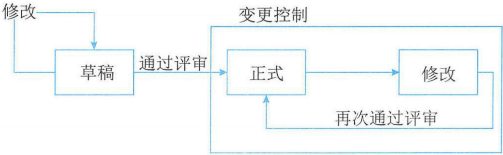
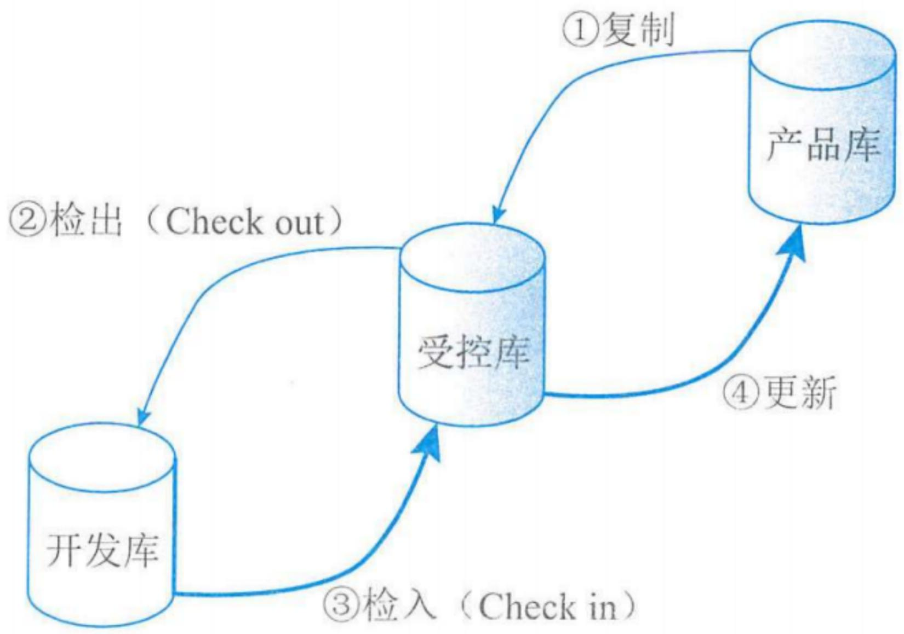

# 配置与变更管理

# 信息系统项目管理师

# 本章学习建议

根据历年的考试情况来看，配置管理不属于10大管理，但是从历年考试来看，上午一般会考2分，案例分析可能考到，属于考试的重点和难点。而且，对于绝大多数人来说，是个难点，为什么？因为它不像进度、成本、质量等我们天天在日常生活领域中遇到，对于配置，大家都觉得很陌生，对一些名词都不理解。希望大家可以尽力在此不丢分。变更管理也非常重要，上午一般会考1-2分，一般和其它管理领域进行结合来考。

# 本章考情分析

<table><tr><td>年份</td><td>上午选择题</td><td>案例分析题</td><td>论文写作</td><td>合计</td></tr><tr><td>2023年05月</td><td>3</td><td>0</td><td>0</td><td>3</td></tr><tr><td>2023年11月</td><td>机考3分左右</td><td>0</td><td>0</td><td>3</td></tr><tr><td>2024年05月</td><td>机考2分左右</td><td>11（第1批）</td><td>0</td><td>13</td></tr></table>

# 19.1 配置管理(掌握)

配置管理是为了系统地控制配置变更，在信息系统项目的整个生命周期中维持配置的完整性和可跟踪性，而标识信息系统建设在不同时间点上配置的学科。

# 1. 配置项

配置项是信息系统组件或与其有关的项目，包括软件、硬件和各种文档，如变更请求、服务、服务器、环境、设备、网络设施、台式机、移动设备、应用系统、协议、电信服务等。

典型的配置项包括项目计划书、技术解决方案、需求文档、设计文档、源代码、可执行代码、测试用例、运行软件所需的各种数据、设备型号及其关键部件等。

在信息系统的开发项目中需加以控制的配置项可以分为基线配置项和非基线配置项两类:

- 基线配置项可能包括所有的设计文档和源程序等；  
- 非基线配置项可能包括项目的各类计划和报告等。

所有配置项的操作权限应由配置管理员（CMO）严格管理，基本原则是：

- 基线配置项向开发人员开放读取的权限  
- 非基线配置项向项目经理、CCB及相关人员开放。

# 2.配置项状态

配置项的状态可分为“草稿”“正式”和“修改”三种。

- 配置项刚建立时，其状态为“草稿”  
- 配置项通过评审后，其状态变为“正式”  
- 若更改配置项，则其状态变为“修改”  
- 当配置项修改完毕并重新通过评审时，其状态又变为“正式”

  
图19-1 配置项状态变化

# 19.1.1 管理基础(掌握)

# 3. 配置项的版本号

(1)处于“草稿”状态的配置项的版本号格式为0.YZ，YZ的数字范围为  $01 \sim 99$ 。随着草稿的修正，YZ的取值应递增。YZ的初值和增幅由用户自己把握。(例如：0.5、0.91)  
(2)处于 “正式” 状态的配置项的版本号格式为X.Y, X为主版本号, 取值范围为  $1 \sim 9$  。Y为次版本号, 取值范围为  $0 \sim 9$  。配置项第一次成为 “正式” 文件时, 版本号为1.0。(例如: 正式V1.0, 升级幅度小变为: V1.1、V1.2, 升级幅度大变为: V2.0 )  
(3)处于“修改”状态的配置项的版本号格式为X.YZ。配置项正在修改时，一般只增大Z值，X.Y值保持不变。当配置项修改完毕，状态成为“正式”时，将Z值设置为0，增加X.Y值。(例如：1.13)

# 19.1.1 管理基础(掌握)

# 4.配置项版本管理

在项目开发过程中，绝大部分的配置项都要经过多次的修改才能最终确定下来。对配置项的任何修改都将产生新的版本。由于我们不能保证新版本一定比旧版本“好”，所以不能抛弃旧版本。版本管理的目的是按照一定的规则保存配置项的所有版本，避免发生版本丢失或混淆等现象，并且可以快速准确地查找到配置项的任何版本。

# 19.1.1 管理基础(掌握)

# 5.配置基线

配置基线由一组配置项组成，这些配置项构成一个相对稳定的逻辑实体。基线中的配置项被“冻结”了，不能再被任何人随意修改。对基线的变更必须遵循正式的变更控制程序。

产品的一个测试版本（可能包括需求分析说明书、概要设计说明书、详细设计说明书、已编译的可执行代码、测试大纲、测试用例、使用手册等）是基线的一个例子。

基线通常对应于开发过程中的里程碑，一个产品可以有多个基线，也可以只有一个基线。交付给外部顾客的基线一般称为发行基线，内部开发使用的基线一般称为构造基线。

对于每一个基线，要定义下列内容：建立基线的事件、受控的配置项、建立和变更基线的程序、批准变更基线所需的权限。

# 6.配置管理数据库

# 配置管理数据库主要内容包括:

(1) 发布内容，包括每个配置项及其版本号；  
(2)经批准的变更可能影响到的配置项;  
(3)与某个配置项有关的所有变更请求;  
(4)配置项变更轨迹;  
(5)特定的设备和软件;  
(6)计划升级、替换或弃用的配置项;  
(7)与配置项有关的变更和问题;  
(8)来自于特定时期特定供应商的配置项;  
(9)受问题影响的所有配置项。

# 19.1.1 管理基础(掌握)

# 7. 配置库

配置库可以分开发库、受控库、产品库3种：

<table><tr><td>(1) 开发库。开发库也称为动态库、程序员库或工作库，用于保存开发人员当前正在开发的配置实体，如新模块、文档、数据元素或进行修改的已有元素。动态中的配置项被置于版本管理之下。动态库是开发人员的个人工作区，由开发人员自行控制。无须对其进行配置控制。【可以任意的修改】</td></tr><tr><td>(2) 受控库。受控库也称为主库，包含当前的基线以及对基线的变更。受控库中的配置项被置于完全的配置管理之下。在信息系统开发的某个阶段工作结束时，将当前的工作产品存入受控库。【可以修改，需要走变更流程】</td></tr><tr><td>(3) 产品库。产品库也称为静态库、发行库、软件仓库，包含已发布使用的各种基线的存档，被置于完全的配置管理之下。在开发的信息系统产品完成系统测试之后，作为最终产品存入产品库内，等待交付用户或现场安装。【一般不再修改，真要修改的话需要走变更流程】</td></tr></table>

# 19.1.1 管理基础(掌握)

# 配置库的建库模式有两种：按配置项类型建库和按开发任务建库

(1) 按配置项的类型分类建库。这种模式适用于通用软件的开发组织。在这样的组织内，往往产品的继承性较强，工具比较统一，对并行开发有一定的需求。使用这样的库结构有利于对配置项的统一管理和控制，同时也能提高编译和发布的效率。但由于这样的库结构并不是面向各个开发团队的开发任务的，所以可能会造成开发人员的工作目录结构过于复杂，带来一些不必要的麻烦。  
【如：通用产品】  
(2) 按开发任务建立相应的配置库。这种模式适用于专业软件的开发组织。在这样的组织内，使用的开发工具种类繁多，开发模式以线性发展为主，所以没必要把配置项严格分类存储，人为增加目录的复杂性。对于研发性的软件组织来说，采用这种设置策略比较灵活。  
【如：定制产品】

# 19.1.2 角色与职责(掌握)

配置管理相关角色常包括：变更控制委员会(CCB)、配置管理负责人、配置管理员和配置项负责人等。

# 1.配置管理负责人

配置管理负责人也称配置经理，负责管理和决策整个项目生命周期中的配置活动，具体有：

(1)管理所有活动，包括计划、识别、控制、审计和回顾；  
(2)负责配置管理过程;  
(3)通过审计过程确保配置管理数据库的准确和真实;  
(4) 审批配置库或配置管理数据库的结构性变更;  
(5) 定义配置项责任人;  
(6)指派配置审计员;  
(7) 定义配置管理数据库范围、配置项属性、配置项之间关系和配置项状态;  
(8)评估配置管理过程并持续改进;  
(9)参与变更管理过程评估;  
(10)对项目成员进行配置管理培训

# 19.1.2 角色与职责(掌握)

# 2.配置管理员

配置管理员负责在整个项目生命周期中进行配置管理的主要实施活动，具体有：

(1)建立和维护配置管理系统;  
(2)建立和维护配置库或配置管理数据库;  
②配置项识别  
(5)配置项识别,  
(4)建立和管理基线;  
(5)版本管理和配置控制;  
(6)配置状态报告;  
(7)配置审计;  
(8) 发布管理和交付。

# 19.1.2 角色与职责(掌握)

# 3. 配置项负责人

配置项负责人确保所负责的配置项的准确和真实:

(1)记录所负责配置项的所有变更;  
(2) 维护配置项之间的关系;  
(3) 调查审计中发现的配置项差异，完成差异报告；  
(4)遵从配置管理过程;  
(5)参与配置管理过程评估。

# 19.1.3 目标与方针(了解)

针对信息系统开发项目，常需要通过实施软件配置管理达到配置管理的目标，即在整个软件生命周期中建立和维护项目产品的完整性。

# 19.1.4 管理活动(掌握)

# 配置管理的日常管理活动主要包括6个主要活动

(1) 制订配置管理计划（写一个文档，叫做配置管理计划，规定如何做好配置管理）  
(2) 配置项标识（识别出需要把哪些东西作为配置项来管理）  
(3) 配置项控制（配置项有一些变更，需要做好配置变更的控制）  
(4) 配置状态报告（需要报告配置项的状态是什么样的）  
(5) 配置审计（做好审计，看有哪些好的，哪些不好的经验教训，效果怎么样）  
(6) 配置管理回顾与改进（定期回顾配置管理活动的实施情况，发现在配置管理执行过程中有无问题，找到改进点，继而优化配置管理过程）

# 19.1.4 管理活动(掌握)

# 1.制定配置管理计划

配置管理计划是对如何开展项目配置管理工作的规划，是配置管理过程的基础，应该形成文件并在整个项目生命周期内处于受控状态。CCB负责审批该计划。

# 2.配置项标识

配置项识别是识别所有信息系统组件的关键配置，以及各配置项间的关系和配置文档等结构识别。它包括为配置项分配标识和版本号等。配置项识别是配置管理的一项基础性工作，要确定配置项的范围、属性、标识符、基准线以及配置结构和命名规则等。

# 3.配置项控制

配置项控制即对配置项和基线的变更控制，包括：标识和记录变更申请、分析和评价变更、批准或否决申请、实现、验证和发布已修改的配置项等任务。

# 19.1.4 管理活动(掌握)

(1) 变更申请。相关人员（如项目经理）填写变更申请表，说明要变更的内容、变更原因、受变更影响的关联配置项和有关基线、变更实施方案、工作量和变更实施人等，提交给CCB。  
(2) 变更评估。CCB负责组织对变更申请进行评估并确定：

(1)变更对项目的影响;  
(2)变更的内容是否必要;  
(3)变更的范围是否考虑周全;  
(4)变更的实施方案是否可行;  
(5)变更工作量估计是否合理。

CCB决定是否接受变更，并将决定通知相关人员。

(3) 通告评估结果。CCB把关于每个变更申请的批准、否决或推迟的决定通知受此处置意见影响的每个干系人。  
(4) 变更实施: 项目经理组织修改相关的配置项, 并在相应的文档、程序代码或配置管理数据中记录变更信息  
(5) 变更验证与确认：项目经理指定人员对变更后的配置项进行测试或验证。项目经理应将变更与验证的结果提交给CCB，由其确认变更是否已经按要求完成。

# 19.1.4 管理活动(掌握)

(6) 变更的发布：配置管理员将变更后的配置项纳入基线。配置管理员将变更内容和结果通知相关人员并做好记录。  
(7) 基于配置库的变更控制:

现以某软件产品升级为例，其过程简述为：

(1)将待升级的基线（假设版本号为V2.1）从产品库中取出，放入受控库。  
②程序员将欲修改的代码段从受控库中检出（Check out），放入自己的开发库中进行修改。代码被检出后即被“锁定”，以保证同一段代码只能同时被一个程序员修改，如果甲正对其修改，乙就无法Check out。  
(3)程序员将开发库中修改好的代码段检入（Check in）受控库。检入后，代码的“锁定”被解除，其他程序员可以Check out该段代码了。  
④软件产品的升级修改工作全部完成后，将受控库中的新基线存入产品库中（软件产品的版本号更新为V2.2，旧的V2.1版并不删除，继续在产品库中保存）。

# 基于配置库的变更控制(掌握)

  
图19-2 基于配置库的变更控制

# 19.1.4 管理活动(掌握)

# 4.配置状态报告

配置状态报告应该包含以下内容:

(1)每个受控配置项的标识和状态  
(2)每个变更申请的状态和已批准的修改的实施状态。  
(3)每个基线的当前和过去版本的状态以及各版本的比较。  
(4)其他配置管理过程活动的记录。

# 5. 配置审计

配置审计也称配置审核或配置评价，包括功能配置审计和物理配置审计，分别用以验证当前配置项的一致性和完整性。

配置审计的实施是为了确保项目配置管理的有效性，不允许出现任何混乱现象，包括：

①防止向用户提交不适合的产品，如交付了用户手册的不正确版本。  
(2)发现不完善的实现，如开发出不符合初始规格说明或未按变更请求实施变更。  
(3)找出各配置项间不匹配或不相容的现象。  
④确认配置项已在所要求的质量控制审核之后纳入基线并入库保存。  
(5)确认记录和文档保持着可追溯性。

# 19.1.4 管理活动(掌握)

功能配置审计是审计配置项的一致性（配置项的实际功效是否与其需求一致），验证：

(1)配置项的开发已圆满完成;  
(2)配置项已达到配置标识中规定的性能和功能特征;  
(3)配置项的操作和支持文档已完成并且是符合要求的。

物理配置审计是审计配置项的完整性（配置项的物理存在是否与预期一致），验证：

(1)要交付的配置项是否存在;  
(2)配置项中是否包含了所有必需的项目。

# 19.1.4 管理活动(掌握)

应当进行配置审计的场景包括:

(1)实施新的配置库或配置管理数据库之后;  
(2)对信息系统实施重大变更前后;  
(3)在一项软件发布和安装被导入实际运作环境之前;  
(4)灾难恢复之后或事件恢复正常之后;  
(5) 发现未经授权的配置项后;  
(6)任何其他必要的时候等。

# 6.配置管理回顾及改进

配置管理回顾与改进即定期回顾配置管理活动的实施情况，发现在配置管理执行过程中有无问题，找到改进点，继而优化配置管理过程。

配置管理回顾及改进活动包括:

(1)对本次配置管理回顾进行准备，设定日期和主题，通知相关人等参加会议。根据配置管理绩效衡量指标，要求配置项责任人提供配置项统计信息；  
②召开配置管理回顾会议，在设定日期召开回顾会议，对配置管理报告进行汇报，听取各方意见，回顾上次过程改进计划执行情况；  
(3)根据会议结论，制订并提交服务改进计划；  
(4)根据过程改进计划，协调、落实改进。

# 19.2 变更管理-19.2.1 管理基础(掌握)

变更管理的实质，是根据项目推进过程中越来越丰富的项目认知，不断调整项目努力方向和资源配置，最大程度地满足项目需求，提升项目价值。

# 1.变更管理与配置管理

如果把项目整体的交付物视作项目的配置项，配置管理可视为对项目完整性管理的一套系统，当用于项目基准调整时，变更管理可视为其一部分。

# 2. 变更产生的原因

变更的常见原因：

(1)产品范围（成果）定义的过失或者疏忽。  
(2)项目范围（工作）定义的过失或者疏忽。  
(3) 增值变更。  
(4)应对风险的紧急计划或回避计划。  
(5)项目执行过程与基准要求不一致带来的被动调整。  
(6)外部事件。

# 19.2.1 管理基础(掌握)

# 3. 变更的分类

(1) 根据变更性质可分为: 重大变更、重要变更和一般变更。通过不同审批权限控制。  
(2) 根据变更的迫切性可分为: 紧急变更、非紧急变更。通过不同变更处理流程进行。

# 4.项目变更的含义

变更管理，即是为使得项目基准与项目实际执行情况相一致，应对项目变化的一套管理方法

# 19.2.2 管理原则(掌握)

变更管理的原则是项目基准化、变更管理过程规范化。包括：

(1) 基准管理：基准是变更的依据。  
(2) 变更控制流程化：所有变更都必须遵循这个控制流程进行控制。  
(3) 明确组织分工: 至少应明确变更相关工作的评估、评审、执行的职能。  
(4) 评估变更的可能影响：变更的来源是多样的，既需要完成对客户可视的成果、交付期等变更操作，还需要完成对客户不可视的项目内部工作的变更。  
(5) 妥善保存变更产生的相关文档，确保其完整、及时、准确、清晰，适当时可以引入配置管理工具。

# 19.2.3 角色与职责(掌握)

信息系统项目中，除项目经理和CCB外，通常还会定义变更管理负责人、变更请求者、变更实施者和变更顾问委员会等。

(1) 项目经理：项目经理在变更中的作用是：

- 响应变更提出者的需求；  
评估变更对项目的影响及应对方案；  
将需求由技术要求转化为资源需求，供授权人决策；  
- 并据评审结果实施（即调整基准），确保项目基准反映项目实施情况。

(2) 变更管理负责人：也称变更经理，通常是变更管理过程解决方案的负责人，其主要职责包括:

(1)负责整个变更过程方案的结果;  
(2)负责变更管理过程的监控;  
(3)负责协调相关的资源，保障所有变更按照预定过程顺利运作；  
(4)确定变更类型，组织变更计划和日程安排；  
(5)管理变更的日程安排;  
(6)变更实施完成之后的回顾和关闭;  
(7)承担变更相关责任，并且具有相应权限；  
(8)可能以逐级审批形式或团队会议的形式参与变更的风险评估和审批等。

# 19.2.3 角色与职责(掌握)

(3) 变更请求者：负责记录与提交变更请求单，具体为：

(1) 提交初步的变更方案和计划;  
②初步评价变更的风险和影响，给变更请求设定适当的变更类型；  
(3)对理解变更过程有能力要求等。

(4) 变更实施者: 需要拥有有执行变更方案的内容的技术能力, 负责按照实施计划实施具体的变更任务。  
(5) 变更顾问委员会：负责对重大变更行使审批，提供专业意见和辅助审批，具体为：

(1)在紧急变更时，其中被授权者行使审批权限;  
(2)定期听取变更经理汇报，评估变更管理执行情况，必要时提出改进建议等。

# 19.2.4 工作程序(掌握)

# 变更的流程:

(1)变更申请  
(2)对变更的初审  
(3)变更方案论证  
(4)变更审查  
(5)发出通知并实施  
(6)实施监控  
(7) 效果评估  
(8)变更收尾;

# 19.2.4 工作程序(掌握)

(1) 变更申请。变更提出应当及时以正式方式进行，并留下书面记录。变更的提出可以是各种形式，但在评估前应以书面形式提出。项目的干系人都可以提出变更申请，一般项目经理或者项目配置管理员负责该相关信息的收集，以及对变更申请的初审。

# (2) 对变更的初审

变更初审的目的主要包括:

(1)对变更提出方施加影响，确认变更的必要性，确保变更是有价值的；  
(2) 格式校验，完整性校验，确保评估所需信息准备充分；  
(3)在干系人间就提出供评估的变更信息达成共识等。

变更初审的常见方式为变更申请文档的审核流转。

# (3) 变更方案论证。

变更方案的主要作用，首先是对变更请求是否可实现进行论证，如果可能实现，则将变更请求由技术要求转化为资源需求，以供CCB决策。

对于一些大型的变更，可以召开相关的变更方案论证会议，通常需要由变更顾问委员会（相关技术和经济方面的专家组成）进行相关论证，并将相关专家意见作为项目变更方案的一部分，报项目CCB作为决策参考。

# 19.2.4 工作程序(掌握)

(4) 变更审查: 评审过程通常包括客户、相关领域的专业人士等。审查通常采用文档、会签形式, 重大的变更审查可以采用正式会议形式。应当在评审过程中将专业评审、经济评审分开, 对于涉及项目目标和交付成果的变更, 客户和服务对象的意见应放在核心位置。

# (5) 发出通知并实施

变更评审通过后，意味着基准的调整，同时确保变更方案中的资源需求及时到位。如果变更造成交付期调整，应在变更确认时发布，而非在交付前公布。  
(6) 实施监控：变更实施的过程监控，通常由项目经理负责基准的监控。CCB监控变更明确的主要成果、进度里程碑等，也可以通过监理单位完成监控。  
(7) 效果评估：变更评估的关注内容主要包括：

(1)评估依据是项目的基准;  
(2)结合变更的目标，评估变更所要达到的目的是否已达成；  
(3)评估变更方案中的技术论证、经济论证内容与实施过程的差距，并促使解决。

(8) 变更收尾：变更收尾是判断发生变更后的项目是否已纳入正常轨道。配置基准调整后，需要确认的是资源配置是否及时到位，若涉及人员的调整，则需要更加关注。变更完成后对项目的整体监控应按新的基准进行。

# 19.2.5 变更控制(掌握)

项目规模小、与其他项目的关联度小时，变更的提出与处理过程可在操作上力求简便、高效。但小项目的变更仍应注意对变更产生的因素施加影响（如防止不必要的变更，减少无谓的评估，提高必要变更的通过效率等），对变更的确认应当正式化，变更的操作过程应当规范化。

# 19.2.6 版本发布和回退计划(掌握)

版本发布前的准备工作包括：

(1)进行相关的回退分析;  
(2) 备份版本发布所涉及的存储过程、函数等其他数据的存储及回退管理;  
(3)备份配置数据，包括数据备份的方式；  
(4)备份在线生产平台接口、应用、工作流等版本;  
(5)启动回退机制的触发条件;  
(6)对变更回退的机制职责的说明，如通知相关部门，确定需要回退的关联系统和回退时间点等。

# 19.2.6 版本发布和回退计划(掌握)

# 回退步骤通常包括:

(1)通知相关用户系统开始回退;  
(2)通知各关联系统进行版本回退;  
(3)回退存储过程等数据对象;  
(4)配置数据回退;  
(5)应用程序、接口程序、工作流等版本回退;  
(6)回退完成通知各周边关联系统;  
(7)回退后进行相关测试, 保证回退系统能够正常运行;  
(8)通知用户回退完成等

# 19.3 项目文档管理(掌握)

信息系统相关信息（文档）是指某种数据媒体和其中所记录的数据。它具有永久性，并可以由人或机器阅读，通常仅用于描述入工可读的东西。在软件工程中，文档常常用来表示对活动、需求、过程或结果进行描述，定义，规定，报告或认证的任何书面或图示的信息（包括纸质文档和电子文档）。

# 19.3.1 管理基础(掌握)

软件文档分为三类：开发文档、产品文档、管理文档  

<table><tr><td>类型</td><td>作用</td><td>文档种类</td></tr><tr><td>开发文档</td><td>描述开发过程本身</td><td>可行性研究报告和项目任务书；需求规格说明；功能规格说明；设计规格说明（包括程序和数据规格说明、开发计划、软件集成和测试计划、质量保证计划、安全和测试信息等）</td></tr><tr><td>产品文档</td><td>描述开发过程的产物</td><td>培训手册；参考手册和用户指南；软件支持手册；产品手册和信息广告</td></tr><tr><td>管理文档</td><td>记录项目管理的信息</td><td>开发过程的每个阶段的进度和进度变更的记录；软件变更情况的记录；开发团队的职责定义、项目计划、项目阶段报告；配置管理计划</td></tr></table>

# 19.3.1 管理基础(掌握)

文档的质量可以分为四级  

<table><tr><td>文档的分级</td><td>适用范围</td></tr><tr><td>最低限度文档(1级文档)</td><td>适合开发工作量低于一个人月的开发者自用程序。该文档应包含程序清单、开发记录、测试数据和程序简介</td></tr><tr><td>内部文档(2级文档)</td><td>可用于没有与其他用户共享资源的专用程序。2级文档还包括程序清单内足够的注释以帮助用户安装和使用程序</td></tr><tr><td>工作文档(3级文档)</td><td>适合于由同一单位内若干人联合开发的程序，或可被其他单位使用的程序。</td></tr><tr><td>正式文档(4级文档)</td><td>适合那些要正式发行供普遍使用的软件产品</td></tr></table>

# 19.3.2 规则和方法(掌握)

文档的规范化管理主要体现在：

(1) 文档书写规范。管理信息系统的文档资料涉及文本、图形和表格等多种类型, 无论是哪种类型的文档都应该遵循统一的书写规范, 包括符号的使用、图标的含义、程序中注释行的使用、注明文档书写人及书写日期等。  
(2) 图表编号规则。在管理信息系统的开发过程中用到很多的图表, 对这些图表进行有规则地编号, 可以方便图表的查找。  
(3) 文档目录编写标准。为了存档及未来使用的方便，应该编写文档目录。管理信息系统的文档目录中应包含文档编号、文档名称、格式或载体、份数、每份页数或件数、存储地点、存档时间、保管人等。  
(4) 文档管理制度。文档的管理制度须根据组织实体的具体情况而定，主要包括建立文档的相关规范、文档借阅记录的登记制度、文档使用权限控制规则等。

# 本章练习

1. 选择题

(1)配置管理是为了系统地控制配置变更，在信息系统项目的整个生命周期中维持配置的（）和（）。

A.完整性可跟踪性 
B.完整性真实性 
C.高效性可跟踪性 
D.高效性真实性 
【答案】A

(2) ( ) 负责在整个项目生命周期中进行配置管理的主要实施活动。

A. 配置管理负责人 
B. 配置项负责人 
C. 项目经理 
D. 配置管理员【答案】D

(3)若对配置项进行更改，配置项状态为（）。当配置项修改完毕并重新通过评审时，其状态变为（）。

A.修改 正式 B.草稿 正式 C.草稿 修改 D.正式 草稿【答案】A

# 本章练习

(4)配置管理的日常管理活动主要包括：制订配置管理计划、配置项识别、配置项控制、配置状态报告、（）、配置管理回顾与改进等。

A.配置审计

B.配置变更

C.配置项重新定义

D.配置管理

【答案】A

(5)对于大型的变更，可以召开相关的变更方案论证会议，通常需要由（）（相关技术和经济方面的专家组成）进行相关论证。

A.变更控制委员会CCB 员会

B.变更实施委员会

C.变更顾问委员会

D.配置管理委

【答案】C

# 本章练习

(6)对于信息系统开发项目来说，其文档一般分为开发文档、产品文档和（）。

A.管理文档

B. 应用文档

C.指南文档

D.规范文档

【答案】A

(7)对于信息系统开发项目来说，参考手册和用户指南属于（）。

A.规划文档

B. 开发文档

C.配置文档

D.产品文档

【答案】D

# 本章练习

2. 判断题

判断下列表述正误，正确的选v错误的选×。

(1) 配置项是信息系统组件或与其有关的项目，包括软件和各种文档，不包括硬件。  
(2) 合同变更控制是规定合同修改的过程，合同变更控制应当单独执行，不要与整体变更控制结合起来。  
(3) 变更管理虽然遵循一致的工作过程，但需要针对不同类型的变更，明确其不同的控制要求。

【答案】 (1)  $\times$  (2)  $\times$  (3)  $\mathrm{v}$

# 历年真题练习

# 【2023年上半年-第59题】

在配置审计的工作中，（）不属于功能配置审计验证的内容。

A.要交付的配置项是否存在  
B. 配置项的开发已圆满完成  
C.配置项已达到配置标识中规定的性能和功能特征  
D.配置项的操作和支持文档已完成并且是符合要求的

【答案】A

# 历年真题练习

# 【2023年上半年-第60题】

关于项目变更管理的描述，不正确的是（）。

A.项目范围（工作）和产品范围（工作）定义的过失或者疏忽不属于变更  
B.项目规模小、与其他项目的关联度越小时，变更的提出和处理过程可在的原因操作上力求简便、高效  
C.变更管理的实质是根据项目情况不断调整项目方向和资源配置，最大程度满足项目需求  
D.在项目变更过程控制中，需要对进度变更控制、成本变更控制和合同变更控制等进行重点关注

【答案】A

# 历年真题练习

# 【2023年上半年-第61题】

文档的规范化管理主要体现在（）方面。

①文档书写规范 ②文档质量级别 ③图表编号规则 ④文档目录编写标准 ⑤文档管理制度 ⑥文档安全标准

A.①②③④

B.②③④⑤

C.③④⑤⑥

D.①③④⑤

【答案】D

# 历年真题练习

# 【2023年下半年-第4批次】

功能配置审计内容包含：（）。

(1)交付配置项是否存在  
(2)配置项已达到配置标识中规定的性能和功能特征  
(3)配置项中是否包含了所有必须的项目  
(4)配置项的开发已圆满完成  
(5)配置项的操作和支持文档已完成并且是符合要求的

A.②④⑤

B.①③④

C.①②④⑤

D.②③④

【答案】A

# 历年真题练习

# 【2024年上半年-第1批次】

关于配置审计的描述，不正确的是（）。

A.配置审计也称配置审核或配置评价，包括功能配置审计和物理配置审计  
B.验证配置项的开发已圆满完成属于功能配置审计  
C.功能配置审计是审计配置项的完整性，物理配置审计是审计配置项的一致性  
D.审计软件即使发现不一致的情况，也不允许自动更新配置库或配置管理数据库，必须由有关负责人调查后再进行更新

【答案】C

# Thank You!

微信公众号：野人老师 淘宝店铺：yeren.taobao.com