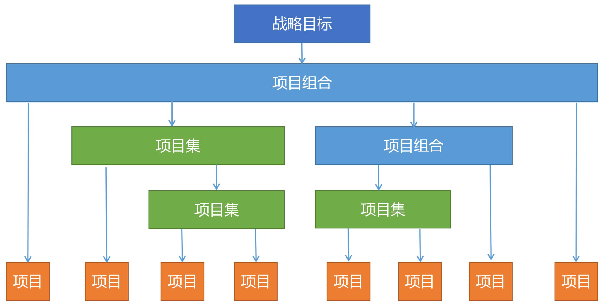
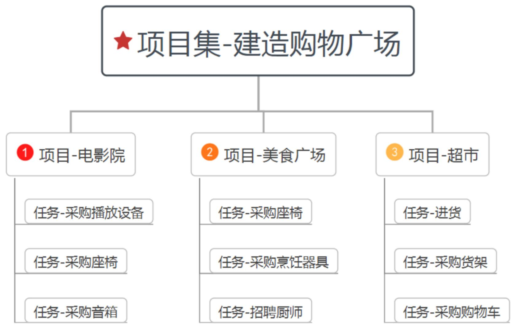
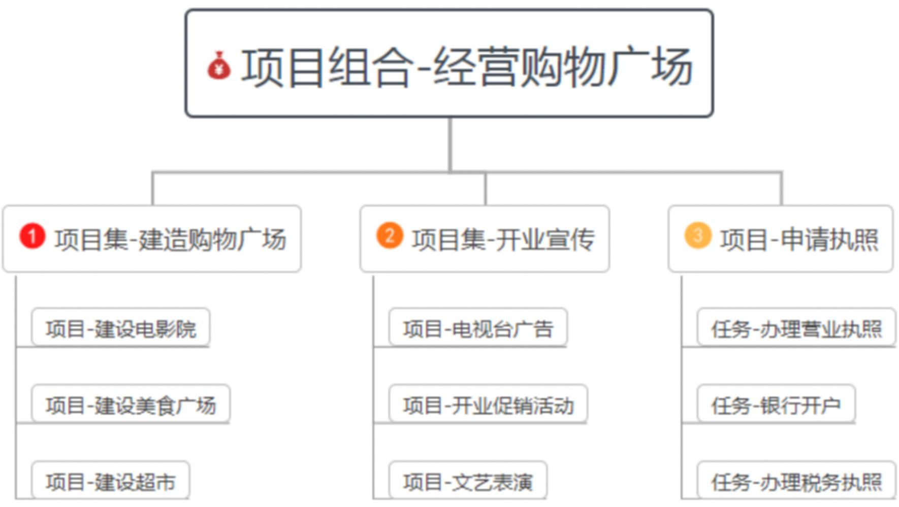

# 高级项目管理

# 信息系统项目管理师

# 本章学习建议

根据历年的考试情况来看，本章上午可能会出3-4分左右的选择题，一般来说，在案例分析和论文写作里考查概率很低。大家可以把教材大致过一遍，但是建议把我在本资料中整理的知识点认真掌握。

# 本章考情分析

<table><tr><td>年份</td><td>上午选择题</td><td>案例分析题</td><td>论文写作</td><td>合计</td></tr><tr><td>2023年05月</td><td>4</td><td>0</td><td>0</td><td>4</td></tr><tr><td>2023年11月</td><td>机考4分左右</td><td>0</td><td>0</td><td>4</td></tr><tr><td>2024年05月</td><td>机考3分左右</td><td>0</td><td>0</td><td>3</td></tr></table>

# 项目集和项目组合(掌握)

给大家举一个例子，比如野人老师要去建造一个购物广场，要包含电影院，美食广场，超市三个基本活动场所。那么在野人老师的眼里，这个任务就是一个项目集，其项目集结构如下图所示：

大家可以发现建造电影院、美食广场、超市三个场地，都可以看做独立的项目，这三个项目如果分开进行，不是说不行，但是统一进行，会更有利于管理，更有利于资源的调解分配。所以将这三个项目整合成一个项目集会更加合理。

# 什么是项目组合(补充)

再大家举一个例子，野人老师又接到一个任务，这个任务是要经营一家购物广场，战略目标当然是多多赚钱啦，很显然，这个任务就不再仅仅只是一个项目集了，而是一个项目组合，因为这个任务在野人老师眼里，是下面这个样子的：

经营购物广场过程中，建造购物广场与开业宣传，这是两个相关性不大的活动，可以先后进行，也可以同时开展。但目的都是为了一个多赚钱。建造购物广场从硬件上保证了赚钱的前提，开业宣传从客源上保证了赚钱的基础。这就叫做为了实现战略目标，而将项目组合，项目集及项目整合在一起。

# 项目集和项目组合(掌握)

项目组合主要是为实现战略目标而进行的多个项目。

项目集中的项目之间存在着关联关系，要统一考虑以实现更大利益。

项目，可以单独存在，也可以存在于项目组合和项目集中。

无重点略。

# 20.1.1 项目集管理标准(了解)

# 20.1.2 项目集管理角色和职责(掌握)

在项目集管理中涉及的相关角色主要包括：项目集发起人、项目集指导委员会、项目集经理、其他影响项目集的干系人。

# 20.1.2 项目集管理角色和职责(掌握)

(1) 项目集发起人。职责包括:

- 为项目集提供资金，确保项目集目标与战略愿景保持一致；  
- 使效益实现交付;  
消除项目集管理与交付的困难和障碍。

(2) 项目集指导委员会。职责包括:

- 为项目集提供治理支持，包括监督、控制、整合和决策职能；  
提供有能力的治理资源，监督与效益交付相关的项目集的不确定性和复杂性；  
- 确保项目集目标和规划的效益符合组织战略和运营目标;  
- 举行计划会议，确认项目集，并对项目集进行优先级排序和提供资金；  
- 支持或批准项目集的建议和变更;  
- 解决并补救上报的项目集问题和风险;  
提供监督，使项目集效益得以规划、衡量并最终达成；  
管理决策的制定、施行、执行和沟通;  
- 定义要传达给干系人的关键信息，并确保其保持一致、透明；  
- 审查预期效益和效益交付;  
- 批准项目集收尾和终止。

# 20.1.2 项目集管理角色和职责(掌握)

(3) 项目集经理。职责包括:

在项目集管理绩效域内开展工作;  
- 与项目经理和其他项目集经理交互，为支持项目集各项计划提供支持和指导；  
- 与项目组合经理进行交互，以确保提供适当的资源和优先级；  
- 与治理机构、发起人及（适用时）项目集管理办公室合作，以确保项目集持续与组织战略和持续的组织支持保持一致；  
- 与运营负责人和干系人进行交互，以确保项目集能够获得适当的运营支持，并有效地维持项目集所带来的效益；  
- 确保各项目集组件的重要性能够被认可和理解;  
- 确保项目集整体结构和所应用的项目集管理流程能够使项目集及其组建的团队成功完成工作并交付预期的效益；  
- 为项目集团队提供有效和适当的管理决策

# 20.1.3 项目集管理绩效域(掌握)

项目集经理通过在不同的项目集管理绩效域实施的行动、指导和带领力来引入变更。项目集管理绩效域包括项目集战略一致性、项目集效益管理、项目集干系人参与、项目集治理和项目集生命周期管理。

# 20.1.3 项目集管理绩效域(掌握)

# 1.项目集战略一致性

项目集战略一致性是识别项目集输出和成果，以便与组织的目标和目的保持一致的绩效域。项目集经理应确保项目管理计划与项目集的目标和预期效益保持一致。

(1) 通过可行性研究和项目集评估，来验证项目集的交付效益；并做为章程和路线图的输入  
(2) 项目集章程被用来衡量项目集成功与否;  
(3) 项目集经理制订项目集路线图，用于与干系人沟通总体计划和效益，建立并维系支持。

# 2.项目集效益管理

主要活动包括效益识别、效益分析和规划、效益交付、效益移交和效益维持。

# 3.项目集干系人参与

项目集干系人参与是识别和分析干系人需求、管理期望和沟通，以促进干系人认同和支持的绩效域。主要活动包括项目集干系人识别、项目集干系人分析、项目集干系人参与规划、项目集干系人参与和项目集干系人沟通。

# 4.项目集治理

项目集治理是实现和执行项目集决策，为支持项目集而制定实践，并维护项目集监督的绩效域。项目集治理的重点是通过建立系统和方法，供发起组织定义、授权、监督和支持项目集及其战略，从而实现项目集效益的交付。项目集经理负有管理责任。

项目集治理是通过在授权范围内对项目集的建议做出签署或批准的评审与决策的活动来实现。

# 20.1.3 项目集管理绩效域(掌握)

# 5.项目集生命周期管理

项目集要分为3个主要阶段来实施，包括项目集定义阶段、项目集交付阶段和项目集收尾阶段。

(1) 项目集定义阶段。为达成预期成果构建和批准项目集，制定项目集线路图，制定项目评估和项目集章程。上述内容批准后，则要制订项目集管理计划。  
(2) 项目集交付阶段。为产生项目集管理计划各组件的预期成果而进行的项目集活动。各项目集组件的实施将包括以下项目集交付子阶段。

- 组件授权与规划；  
- 组件监督与整合；  
- 组件移交与收尾。  
(3) 项目集收尾阶段。将项目集效益移交给维护组织，并以可控的方式正式结束项目集活动。在项目集收尾阶段主要工作包括项目集移交和收尾或提前终止，或者将工作移交给另一个项目集。

无重点略。

# 20.1.1项目组合管理标准(了解)

# 1.项目组合管理经理

项目组合经理负责建立和实施项目组合管理。项目组合经理通常扮演许多重要角色，包括项目组合管理原则、过程和实践的架构师、促成者和引导者，以及担当项目组合分析师的角色。其主要职责包括：

(1) 向项目组合治理机构传达整套项目组合组件如何与战略目标一致或调整为一致;

(2) 依据战略指令获得项目组合的影响和创造的价值;  
(3) 提供适当的建议或行动方案;  
(4) 影响与管理资源分配过程;  
(5) 监管或与项目组合组件经理进行实施协调;  
(6) 接收项目组合组件绩效和进展方面的信息;  
(7) 向高级管理层汇报项目组合的进展。

# 20.2.2 项目组合管理角色和职责(掌握)

# 2.项目组合管理中的其他角色

(1) 发起人。为项目组合提供资源和支持，是整个项目组合的捍卫者，对资源分配和项目组合的成功负责。  
(2) 项目组合治理机构。用来指导和监督项目组合管理活动，评估项目组合绩效，并且对项目组合的投资和优先级做出决策，确保项目组合管理过程可控。适当的治理是履行职责、优化投资、向决策者升级问题和改善沟通的基础和关键。  
(3) 项目组合、项目集和项目管理办公室(PMO)。一个提供多种能力和流程、支持项目组合管理的组织实体，集中管理和协调其控制下的项目、项目集或项目组合。  
(4) 项目组合分析师。负责识别、分析和追踪项目组合组件间的依赖关系是否被解决和管理，对项目组合管理过程的差距，推荐改进方案并帮助实施。可以与其他角色相结合并进行相应的裁减，以满足组织需求。  
(5) 项目集经理。负责确保整个项目集结构和项目集管理过程与项目组合管理计划相一致。  
(6) 项目经理。负责根据相应的目标和规范，有效地启动、规划、执行、监控、收尾项目组合内的指定项目。项目经理直接或间接地向项目组合经理、PMO或治理机构提供项目绩效指标。  
(7) 变更控制委员会。负责审查变更请求，并做出批准、否决或其他决定。

# 20.2.3 项目组合管理绩效域(掌握)

项目组合管理绩效域包括项目组合生命周期、项目组合战略管理、项目组合理治、项目组合产能与能力管理、项目组合干系人参与、项目组合价值管理和项目组合风险管理。

# 20.2.3 项目组合管理绩效域(掌握)

# 1.项目组合生命周期

项目组合生命周期由启动、规划、执行与优化4个阶段组成。

(1) 启动阶段。启动阶段拉开了项目组合的序幕。此阶段的主要活动是验证业务和运营战略，识别项目组合组件，为项目组合及其组件定义长期路线图，包括财务目标、绩效标准、沟通、治理、干系人的定义与角色，以及持续管理计划。  
(2) 规划阶段。规划阶段制订并评审项目组合管理计划并就主要内容与干系人达成共识。

项目组合规划阶段的主要活动包括：

(1) 项目组合组件范围和管理；  
(2) 执行组件所需的预算；  
(3) 项目组合及组件间的依赖关系识别；  
(4) 风险和问题的识别与应对计划;  
(5) 资源需求;  
(6) 项目组合组件的优先排列顺序；  
(7) 治理机构、发起人和干系人责任的确认；  
(8) 用来衡量成功的项目组合标准；  
(9) 产品或服务的需求与规范。

# 20.2.3 项目组合管理绩效域(掌握)

(3) 执行阶段。执行阶段是通过其各个组件和运营来实施的，包括对项目组合的执行情况，以及各组件的绩效标准进行评审和汇报；对提出的变更基于持续的组织需要来进行评审，组织环境的变更可能迫使组件优先顺序要重新排列或者引入新组件。

其主要活动包括：

(1) 项目组合内所有组件的交付；  
(2) 管理和解决项目组合及其组件之间的风险与问题；  
(3) 引导项目组合和组件的沟通汇报；  
(4) 根据需要重新排序和变更子项目组合;  
(5) 以组件交付为基础监督收益实现的潜能;  
(6) 管理给项目组合的有限资产和资源。

(4) 优化阶段。通过最大化可用的条件、制约因素和资源，使项目组合尽可能高效的过程。组织通常会安排定期的优化，但在增加或关闭组件时，也会触发此活动。

# 20.2.3 项目组合管理绩效域(掌握)

# 2.项目组合战略管理

战略管理与项目组合管理保持一致，使组织的行动能够一贯地符合高级管理层和干系人的期望。

# 3.项目组合治理

项目组合治理是在某个框架内的一套实践、职能与过程，以一套引领项目组合管理活动的基本规范、规则或价值作为框架基础，优化投资并满足组织战略和运营目的。治理与管理不同，治理与决策制定、监管、控制和整合有关。管理则被描述为在治理框架所设定界限内工作，以达成组织目标。

决策制定职能包括一组过程与活动，提供整体的治理结构，为项目组合及其组件授予管理权力。

监管职能提供治理过程与活动来支持对项目组合及其组件的决策与导向；

控制职能提供过程与活动来对项目组合及其组件进行监控、测量和报告；

整合职能则提供过程和活动来支持项目组合及其组件间的战略一致性。

# 20.2.3 项目组合管理绩效域(掌握)

# 4.项目组合产能与能力管理

项目组合产能与能力管理是以一系列指导原则为基础建立的综合框架，包括以一系列的工真写实践来识别、分配和优化资源，以便在项目组合实施中最大化资源应用并最小化资源冲突。在项目组合管理中，产能与能力管理意味着涉及所有资源，如人员、资金、技术、设备等。

1）产能管理：主要涉及4个类别：人力资本、财务成本、资产、智力资本。

# 5.项目组合干系人参与

干系人参与和沟通的关键迭代步骤包括：干系人的定义和识别、项目组合干系人分析、规划干系人参与、识别沟通管理方法、管理项目组合沟通。

# 6.项目组合价值管理

高效的项目组合价值管理需要的关键活动主要包括：协商期望的价值、最大化价值、实现价值、测量价值和报告价值等。

# 7.项目组合风险管理

在项目组合风险管理中有4个关键要素：风险管理规划、风险识别、风险评估和风险应对。

# 20.3 组织级项目管理(掌握)

组织级项目管理（OPM）是通过整合项目组合、项目集和项目管理，连接其与组织驱动因素和组织流程来提升组织能力，从而实现战略目标。组织驱动因素是指可被执行组织用来实现战略目标的结构、文化、技术或人力资源实践。

无重点略。

# 20.3.1 组织级项目管理标准(了解)

# 20.3.2 业务价值与业务评估(掌握)

OPM是建立了一个动态的组织用来有效地应对变革，旨在为组织主动创造价值。组织从业务活动中获得可量化的净收益，通过采用可靠的、已建立的OPM流程，有效地利用项目组合、项目集和项目管理，提高创造价值的潜力来实现战略目标。

业务评估是建立OPM框架的必要组件。组织管理层或发起人需要说明实施OPM解决的业务问题、OPM特征和关键绩效指标的定义。尽可能通过财务量化的方式确定收益，确定OPM实施成本和投资回报，即实施或改进选定的OPM能力的成本，并将其转变为改进的组织成果，以及成果改进后的结果所带来的收益。

# 20.3.3 OPM框架要素(掌握)

OPM框架的关键要素包括：OPM治理、OPM方法论、知识管理和人才管理。

(1) OPM方法论

所有的OPM方法论都需要裁剪，裁剪在OPM方法论初始建立过程、维护过程和增强过程都可以进行。为了确保与组织背景和环境保持一致，更适用于不同类型项目需求，应允许项目组合、项目集和项目在各自的边界范围内，以最匹配项目特定需求的方式应用OPM方法论。可以对OPM方法进行裁剪，确定如何应用OPM方法，应在项目的规划阶段进行，过程中可以依据变化进行变更调整。

(2) 知识管理

在OPM框架内，知识管理通常侧重于实现绩效改进、创新、经验教训分享、记录最佳实践、流程整合和组织持续改进的组织目标。在OPM的知识管理中应关注：增加OPM知识所需的文档、需要获取知识所需资源、个人增强确保OPM成功所必需的知识。

# 20.3.3 OPM框架要素(掌握)

(3) 人才管理

大多数组织都有评估和提供个人绩效反馈的流程，由集中化的职能部门执行。

(4) OPM治理  
- 高管治理实体：由高级管理人员或董事会成员组成，与OPM治理机构建立开放的沟通渠道，以传达任何战略变化或项目组合、项目集和项目的优先级调整，在OPM方法无效时对其进行干预。  
- OPM治理实体：确保OPM的基础架构始终与组织战略保持一致并可实施。当OPM方法或无效的OPM架构使战略举措的实现面临风险或导致组织中出现低效时，进行干预。在较小的组织中，该实体可能与高管治理实体是同一实体。  
- 项目组合和项目集治理实体：遵循类似于OPM治理主体的模式。项目组合和项目集经理报告收益实现和需要关注的任何问题和冲突。  
- 项目管理治理实体：从战略层面传递所有的变更，识别受其影响的项目可能需要重新考虑的预算、进度、风险、制约因素或其他因素。这个角色可以由 OPM 来执行，也可以由项目组合或项目集负责人执行。

# 20.3.4 OPM成熟度模型(掌握)

OPM成熟度是指组织以可预测、可控制和可靠的方式交付期望战略成果的能力水平。

以下提供了OPM成熟度级别特征的一般描述，可应用于项目组合、项目集和项目。

# 20.3.4 OPM成熟度模型(掌握)

# OPM成熟度级别特征的一般描述，可应用于项目组合、项目集和项目。

(1) 级别 1。初始或临时的 OPM。项目绩效无法可靠预测。项目管理极不稳定，高度依赖于执行工作的人员的经验和能力。项目虽然完成，但经常出现推迟、超出预算、质量各异的情况。存在的 OPM 流程是临时的或无序的。  
(2) 级别2。项目层级采用OPM。根据行业最佳实践，在项目或职能层级上计划、执行、监督和控制项目。但是OPM流程和实践并非从组织角度统一应用或管理，并且可能存在项目差异。  
(3) 级别3。组织定义的OPM。项目管理是主动的，组织项目绩效是可预测的。项目团队遵循组织建立的OPM流程，这些流程根据项目的复杂性和从业者的能力加以裁剪。OPM流程在组织上是标准化的、可测量的、可控制的，并可由组织进行分析，以监控OPM流程绩效。  
(4) 级别 4。量化管理的 OPM。组织中的项目管理决策和流程管理是由数据驱动的。OPM流程绩效的管理方式能够实现量化改进目标。OPM流程绩效经过了系统性分析, 以提高为组织增加价值的改进机会。  
(5) 级别 5。持续优化的 OPM。组织稳定且专注于持续改进。OPM与组织战略的一致性, 以及定义好的和可测量的价值贡献为关注点的 OPM流程, 促进了组织的敏捷和创新。在优化的组织中, 已建立了有效的持续改进, 以及一系列测量和度量指标。项目集和项目的成功率很好, 项目组合经过优化以确保业务价值。

# 20.4 量化项目管理(掌握)

量化管理是指以数据为基础，用统计或其他量化的方法来分析和研究事物的运行状态和性能，对关键的决策点及操作流程进行管理监控，以求对事物存在和发展的规模、程度等做出精确的数字描述和科学控制，实施标准化操作的管理模式。

# 20.4.1 量化管理理论及应用(掌握)

统计过程控制（SPC）是指应用统计技术对工作过程中的各个阶段进行分析、监控和评估，建立并保持工作过程处于可接受的并且稳定的水平，从而确保产品与服务符合规格要求的一种管理技术。

统计过程控制是一种预防性方法，强调全员参与。并且统计过程控制强调整个过程，重点在于过程。

统计过程控制理论认为，过程的能力是存在波动性的：一种波动是正常的波动，任何组织或个人执行过程的能力都会有一定的波动性，这是正常的；另一种波动是异常的波动，可能有特殊成因造成了能力的异常波动，这是异常情况，需要识别并管理。

# 20.4.1 量化管理理论及应用(掌握)

六西格玛认为业务流程改进遵循5步循环改进法，即DMAIC模式：定义、度量、分析、改进、控制。

六西格玛的5步实施流程并不是单一的，而是各个管理流程实施改进时相互关联的统一体。六西格玛是一种基于数据统计分析的管理方法，强调用数据来客观体现管理流程的能力。其代表特征是管理流程、管理指标的量化。

CMMI 即能力成熟度模型集成。高成熟度组织的主要特征包括: ①建立量化的目标管理机制; ②建立过程能力量化监控机制; ③建立目标的量化预测能力; ④ 建立基于量化的持续优化机制。

# 20.4.2 组织级量化管理(了解)

组织开展量化管理工作的前提在于该组织已经定义了产品或项目管理的组织级标准过程，各个产品或项目团队能够遵循组织统一的管理流程、规程和产出要求开展工作，组织收集的度量数据才具备统计意义，可供开展量化管理建设。

# 20.4.2 组织级量化管理(了解)

建立组织级的量化管理体系的内容主要包括：定义组织量化过程性能目标、识别关键过程、建立度量体系及数据收集、建立过程性能基线和建立过程性能模型。

建立过程性能基线的步骤主要包括：获取所需数据、分析数据特征、建立过程性能基线、发布和维护过程性能基线。

建立过程性能模型的步骤主要包括：识别建模因子、建立过程性能模型、检验过程性能模型以及评审和发布过程性能模型。

# 20.4.2 组织级量化管理(了解)

依据组织的历史数据和已建立的过程性能基线，使用皮尔森(Person)相关系数判定各个因子数据与结果数据的相关性，每个因子记为x，输出记为y，x与y相关性系数r(x,y)，r(x,y)的计算结果在区间[-1,1]

# 20.4.2 组织级量化管理(了解)

根据计算结果，识别因子与目标结果相关性关系如下：

- 当  $0.8 \leq |r| \leq 1$  时，认为该因子与目标结果存在强相关关系；  
- 当  $0.5 \leq |r| < 0.8$  时，认为该因子与目标结果存在中度相关关系；  
- 当  $0.3 \leq |r| < 0.5$  时，认为该因子与目标结果存在弱相关关系；  
- 当  $0 \leq |r| < 0.3$  时，认为该因子与目标结果基本不相关。

根据相关性分析的结果，通常选择相关性相对较大的因子参与过程性能模型的建立。同时，考虑到多元回归分析建模的需要，各个因子之间不可存在较高相关性，否则会引起多重共线问题，导致所建立回归模型的逻辑混乱甚至失败。

# 20.4.3 项目级量化管理(了解)

项目级量化管理

<table><tr><td>1.项目过程性能目标定义
项目质量与过程性能目标设定后，项目管理者可使用过程性能基线和过程性能模型，采用蒙特卡洛模拟的方式预测项目质量与过程性能目标达成的概率。</td></tr><tr><td>2.过程优化组合
由于组织各个过程的基线分组较多，可使用蒙特卡洛模拟的方法遍历每一种过程组合，从而判定满足项目质量与过程性能目标的最优过程组合方案。</td></tr><tr><td>3.过程性能监控
过程性能的量化监控至少包含两个方面：
①监控过程性能是否稳定，可根据控制图的稳定性判定准则通过小概率事件判定来识别异常情况并解决；
②监控过程性能是否满足规格要求。</td></tr><tr><td>4.项目性能预测
在项目各过程性能的稳定性及符合性满足后，需要在每个阶段或里程碑处，对项目最终质量与过程性能目标的达成性进行量化预测。</td></tr></table>

# 20.5 项目管理实践模型-20.5.1 CMMI模型(掌握)

CMMI(能力成熟度模型集成）模型主要用于指导组织项目管理过程的改进，以及进行项目管理能力成熟度的评估，当前版本为CMMI 2.0。

CMMI将所有收集并论证过的最佳实践按逻辑归为4大能力域类别:

(1) 行动：用于生产和提供优秀解决方案的能力域。  
(2) 管理：用于策划和管理解决方案实施的能力域。  
(3) 使能：用于支持解决方案实施和交付的能力域。  
(4) 提高：用于维持和提高效率效能的能力域。

# 20.5.1 CMMI模型(掌握)

# CMMI 5个成熟度级别分别如下：

# 第1级-初始级

各个实践域的活动应该能够在组织中得到基本的执行，例如，在软件研发和管理方面组织能够执行需求开发、编码实现、系统测试及项目计划和监控这些工作。

其级别特征主要包括：

1.满足实践域意图的初步方法能够得到基本实现;  
2.没有一套完整的实践来满足实践域的全部意图;  
3.开始专注于能力问题。

# 第2级-管理级

所有第1级的要求都已经达到，另外，组织在项目实施上能够遵守项目团队既定的工作计划与流程，对需求、任务、产出物、度量数据、相关的实施人员能够实现相应的管理，对整个流程进行监测与控制。达到成熟度2级水平的组织对项目有一系列管理方式，避免了组织完成各个项目目标的随机性，保证了组织内项目实施的成功率。每个项目都可以使用自己的方式达到实践域的目标。

其级别特征主要包括：

1. 简单但完整的一组实践，能够满足实践域的全部目的；  
2.不需要使用组织资产或标准;  
3.对项目的各个方面实现了管理;  
4.实践的意图可以基于项目以各种方式得到满足。

# 20.5.1 CMMI模型(掌握)

# 第3级-定义级

所有第2级实践的意图和价值都已经达到，并且组织能够根据自身的情况定义适用于自身的标准过程，将这套管理体系与流程实现制度化。同时，要求组织能够建立过程资产，基于历史项目的可复用过程资产(包括管理资产和技术资产)得到有效的复用，从而提高项目的成功率。组织不仅能够在当前同类项目上取得成功，也能够在其他项目上成功。

其级别特征主要包括：

1.采用组织标准流程开展各项工作;  
2.能够依据项目特征对组织的标准流程进行裁剪以解决特定的项目和工作特征;  
3.项目能够使用和向组织贡献过程资产。

# 第4级-量化管理级

所有第3级实践的意图和价值都能够达成。另外，组织的管理实现了量化，实现了可预测。通过统计或其他量化技术来实现过程性能的稳定性监控和复合型监控，实现管理的精细化，降低项目在过程能力和质量上的波动。组织能够通过历史数据构建可预测模型，对组织和项目的质量和过程性能目标实现可预测。

其级别特征主要包括:

1. 使用统计和其他量化技术来监测，完善或预测关键过程领域，从而实现组织或项目的质量与过程性能目标；  
2.以统计和量化管理的方式了解组织或项目的效率效能变化，并根据质量和过程性能目标的情况管理组织和项目的效率效能。

# 第5级-优化级

所有第4级实践的意图和价值都能够达成。另外，组织能够充分利用其管理数据和量化的方法对组织在项目实施的过程中可能出现的不符合策划的内容进行预防。组织能够主动地改进标准过程，运用新技术和方法实现流程的持续优化。

其级别特征主要包括：

1. 使用统计和其他量化技术来优化效率效能并改善组织目标的实现，包括业务、度量和效率效能以及质量与过程性能目标；  
2.能够通过基于量化的持续优化来持续支持组织业务目标的达成

# 20.5.1 CMMI模型(掌握)

组织基于CMMI的改进工作主要包括:

(1)定义改进目标；  
(2)建立改进团队；  
(3)开展差距分析；  
(4)导入培训和过程定义；  
(5)过程部署；  
(6)CMMI评估：

# 20.5.2 PRINCE2模型(了解)

PRINCE2结构包括原则、主题、流程和项目环境。

PRINCE2原则：持续的业务验证、吸取经验教训、明确定义的角色和职责、按阶段管理、例外管理、关注产品、根据项目剪裁。

PRINCE2主题：立项评估、组织、质量、计划、风险、变更、进展

PRINCE2是一种基于流程的项目管理方法。

PRINCE2流程：项目准备流程、项目指导流程、项目启动流程、阶段控制流程、产品交付管理流程、阶段边界管控流程、项目收尾流程。

# 本章练习

(1) 关于项目集管理的理解, 不正确的是 ( )。

A.项目集经理是承诺将组织的资源应用于项目集，并致力于使项目集取得成功的人  
B. 组件项目或项目集不能促进共同目标或互补目标的实现时，则使用项目组合管理的效果更好  
C.项目集管理绩效域包括项目集战略一致性、项目集效益管理、项目集干系人参与、项目集治理、项目集生命周期管理  
D.项目集效益管理的主要活动包括效益识别、效益分析和规划、效益交付、效益移交、效益维持

【答案】A

# 本章练习

(2) 组织级项目管理(OPM)框架包括（）。

A. OPM方法论、知识管理、人才管理  
B. OPM方法论、流程管理、资源管理  
C. OPM治理、OPM方法论、流程管理、资源管理  
D. OPM治理、OPM方法论、知识管理、人才管理

【答案】D

# 本章练习

(3) 关于统计过程控制方法的描述，不正确的是 ( )。

A.统计过程控制是一种预防性方法，强调全员参与  
B. 统计过程控制技术可以判定工作过程运行的状态是否稳定，也可以判断过程能力是否满足规格要求  
c.统计过程控制方法认为任何组织或个人执行过程的能力都会有一定的波动性，这是正常的  
D.统计过程控制方法认为项目团队或人员的能力应该是恒定的，不应发生波动

【答案】D

# 本章练习

(4) 关于六西格玛的描述, 不正确的是 ( )。

A.五步循环改进法即DMAIC模式，包括：定义(Define)、度量(Measure)、分析(Analyze)、改进(Improve)、控制(Control)  
B.六西格玛是一种基于数据统计分析的管理方法，强调用数据来客观体现管理流程的能力  
C.六西格玛的代表特征是组织有了统一的管理流程、管理指标  
D.六西格玛的五步实施流程并不是单一的，而是各个管理流程实施改进时相互关联的统一体

【答案】C

# 本章练习

(5) 关于量化管理中建立过程性能模型的描述，正确的是 ( )。

A.建立过程性能模型的因子只能选择当前过程性能基线中已有的因子  
B.对于相关性系数达到强相关（  $|r| > 0.8$  ）的因子，方可纳入建模因子  
C.对于过程性能模型的校验，重点关注P值、R-sq值，通常无须关注残差值  
D.基于统计的量化技术主要包括：过程性能基线、过程性能模型、回归分析、蒙特卡洛模拟等

【答案】D

# 历年真题练习

# 【2023年上半年-第62题】

项目集效益管理的主要活动包括（）。

(1) 效益识别 (2) 效益分析和规划 (3) 效益交付 (4) 效益移交 (5) 效益维持 (6) 效益改进

A.①②③④⑥

B.②③④⑤⑥

C.①②④⑤⑥

D.①②③④⑤

【答案】D

# 历年真题练习

【2023年上半年-第63题】

在项目组合管理生命周期中，（）属于启动阶段的活动。

A.确定项目组合组建范围  
B.项目组合组建的优先排列顺序  
C.为项目组合及其组建定义长期路线图  
D.治理机构，发起人和干系人责任的确认

【答案】C

# 历年真题练习

# 【2023年上半年-第64题】

关于组织级项目管理（OPM）框架的描述，正确的是（）。

A. OPM框架的关键要素包括OPM方法论、人才管理，知识管理三个方面  
B.组织通过建立和整合被认为最有可能提供预期收益的项目组合、项目集合项目方法论的要素来开发和改进OPM方法论  
C.人才管理侧重于实现绩效改进、创新、经验教训分享、记录最佳实践、流程整合和组织持续改进的组织目标  
D.知识管理应与项目组合、项目集和项目经理的职业化发展保持一致

【答案】B

# 历年真题练习

# 【2023年上半年-第65题】

关于量化项目管理的描述，不正确的是（）。

A.六西格玛和CMMI模型高成熟度均提供了量化管理的方法和实践。  
B.组织建立的过程性能基线是通过历史数据刻画组织当前的过程能力，为管理决策提供数据化支持。  
C.识别模型因子时，如两个因子相关性系数为0.8，代表可同时使用这两个因子建立模型。  
D.项目量化目标的定义通常需参考组织的目标要求，客户或服务对象的管理要求，还需结合项目团队自身过程能力数据。

【答案】C

# 历年真题练习

# 【2023年下半年-第2批次自编】

在项目集生命周期中被执行的活动取决于项目集的具体类型，通常在资金获得批准和项目集经理被指定前开始。为成功向组织交付效益，项目集要分为3个主要阶段来实施，包括（）、项目集交付阶段和项目集收尾阶段。

A.项目集构建阶段

B.项目集启动阶段

C.项目集规划阶段

D.项目集定义阶段

【答案】D

# 历年真题练习

# 【2024年上半年-第1批次】

CMMI的4大能力域类别中，（）用于生产和提供优秀解决方案。

A.提高（Improving）

B.实现（Enabling）

C.管理（Managing）

D.行动（Doing）

【答案】D

# Thank You!

微信公众号：野人老师 淘宝店铺：yeren.taobao.com