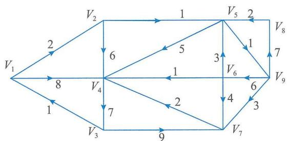
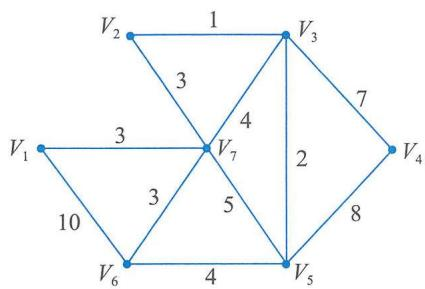
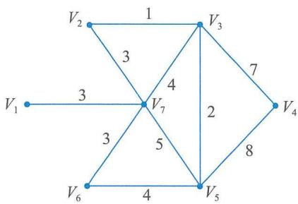
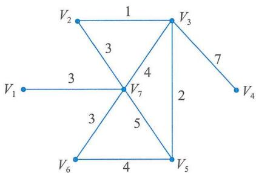
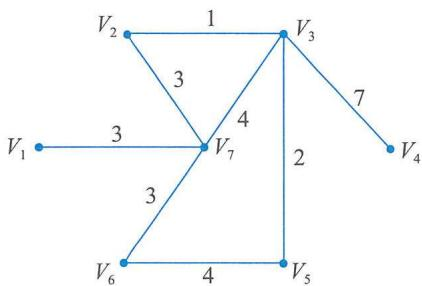
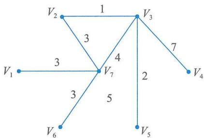
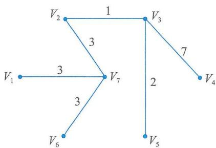

# 第21章 项目管理科学基础

科学管理的实质是反对凭经验、直觉、主观判断进行管理，主张用最好的方法、最少的时间和支出，达到最高的工作效率和最大的效果。其突破性进展是在第二次世界大战时期，为解决国防需要产生的“运筹学”，发展了新的数学分析和计算技术。例如：统计判断、线性规划、排队论、博弈论、统筹法、模拟法、系统分析等，特别是随着电子计算机技术突飞猛进的发展，为组织管理过程中运用数量方法和科学方法提供了广阔的空间，进一步成就了“管理科学理论”。

管理科学认为，解决复杂系统的管理决策问题，可以用电子计算机作为工具，寻求最佳计划方案，以达到组织的目标。管理科学其实就是管理中的一种数量分析方法，它主要用于解决能以数量表现的管理问题，其作用在于通过管理科学的方法，减少决策中的风险，提高决策的质量，保证投入的资源发挥最大的经济效益。从管理科学的名称来看，似乎它是关于管理的科学，其实，它不是主要探求有关管理的原理和原则，而是依据科学的方法和客观的事实来解决管理问题，并且要求按照最优化的标准为管理者提供决策方案，设法把科学的原理、方法和工具应用于管理过程，侧重于追求经济和技术上的合理性。

# 21.1 工程经济学

# 21.1.1 资金的时间价值与等值计算

# 1. 资金的时间价值与等值计算的概念

将资金投入使用后，经过一段时间，资金便产生了增值。资金的时间价值是指不同时间发生的等额资金在价值上的差别。把资金存入银行，经过一段时间后也会产生增值，这就是利息。客户按期得到的利息是银行将吸纳的众多款项集中投资于各类项目所获得的盈利的一部分，盈利的另一部分则是银行承担资金风险运作的收益。盈利和利息是资金时间价值的两种表现形式，都是资金时间因素的体现，是衡量资金时间价值的绝对尺度。在技术经济分析中，对资金时间价值的计算方法与银行利息的计算方法是相同的，银行利息就是一种资金时间价值的表现形式。

资金时间价值的大小取决于多方面因素，从投资角度看，主要取决于投资收益率、通货膨胀率和项目投资的风险。投资收益率反映该项目方案所能取得的盈利大小；通货膨胀率则反映投资者必须付出的因货币贬值所带来的损失；而投资风险往往又和投资回报相联系，通常投资回报越高，风险越大，投资风险的分析、判断、评估则会涉及政治、经济、金融、资源和市场等多方面的因素。

资金的时间价值表明，在不同的时间付出或得到同样数额的资金，其经济价值是不等的。也就是说，一笔数额确定的资金的经济价值随着时间的不同而不同；同样，根据资金时间价值的概念，数额不等的资金在不同的时间因素作用下可能会具有相同的经济价值。例如，在年利

率为  $5.22\%$  的条件下，当年的100元与下一年的105.22元是等值的，即

$$
100 \times (1 + 5.22 \%)\text{元} = 105.22\text{元}
$$

而当年的100元又与上一年的95.04元等值，即

$$
\frac{100}{(1 + 5.22\%)}\text{元} = 95.04\text{元}
$$

资金等值是指在时间因素的作用下，在不同的时期（时点），绝对值不等的资金具有相等的价值。如上所述，可以认为在年利率为  $5.22\%$  的情况下，当前的100元与一年后的105.22元是等值的，与一年前的95.04元也是等值的。

在比较项目方案时，应该对项目方案的各项投资与收益进行对比，由于这些投资或收益往往发生在不同的时期，所以就必须将其按照一定的利率折算至某一相同时点（等值计算），使之具有可比性。等值计算是工程经济学中的一个重要内容，在工程经济分析中，对资金时间价值的计算方法是根据银行计算利息的方法得到的。实质上，银行利息也是一种资金的时间价值。

# 2. 利息、利率及其计算

利息或利润是占用（利用）资金的代价（成本），或者是放弃资金的使用所获得的补偿。如果将一笔资金存入银行（相当于银行占用了这笔资金），经过一段时间以后，资金所有者就能在该笔资金之外再得到一些报酬，即利息。通常，存入银行的资金就叫作本金。本利和的计算公式为公式（21-1），式中， $F_{n}$  为本利和； $P$  为本金； $I_{n}$  为利息（ $n$  表示计算利息的周期数）；计息周期通常为“年”“季”“月”等。

$$
F _ {n} = P + I _ {n} \tag {21-1}
$$

利息通常由本金和利率计算得出，利率是指在1个计息周期内所应付出的利息额与本金之比，一般以百分数表示。利率的计算公式为公式（21-2），式中，  $i$  为利率；  $I_{1}$  为1个计息周期的利息。

$$
i = \frac {I _ {1}}{P} \times 100 \% \tag{21 - 2}
$$

利率是银行根据国家的政治、经济形势及政策方针确定的，它可以反映国家在一定经济发展时期的经济状况及特色。利率的经济含义是每单位本金经过1个计息周期后的增值额。利息的计算方法分为单利法和复利法两种。

# 1）单利法

单利法是每期均按原始本金计息，即不管计息周期为多少，每经过一期，按原始本金计息1次，利息不生利息。单利计息的计算公式为公式（21-3），式中，  $I_{n}$  为  $n$  个计息期的总利息；  $n$  为计息期数；  $i$  为利率。

$$
I _ {n} = P \times n \times i \tag {21-3}
$$

$n$  个计息周期后的本利和计算公式为公式（21-4）。

$$
F _ {n} = P + P \times n \times i = P (1 + i \times n) \tag {21-4}
$$

例如，存入银行1000元本金，年利率为  $6\%$  ，共存5年，每个计息周期的本金、当年利息及本利和，如表21-1所示。

（单位：元）

表 21-1 单利法的本金、当年利息及本利和  

<table><tr><td>年份</td><td>本金</td><td>当年利息</td><td>本利和</td></tr><tr><td>1</td><td>1000</td><td>1000×0.06=60</td><td>1000+60=1060</td></tr><tr><td>2</td><td>1000</td><td>1000×0.06=60</td><td>1000+60×2=1120</td></tr><tr><td>3</td><td>1000</td><td>1000×0.06=60</td><td>1000+60×3=1180</td></tr><tr><td>4</td><td>1000</td><td>1000×0.06=60</td><td>1000+60×4=1240</td></tr><tr><td>5</td><td>1000</td><td>1000×0.06=60</td><td>1000+60×5=1300</td></tr></table>

# 2）复利法

复利法按上一期的本利和计息，除本金计息外，利息也生利息，每一计息周期的利息都要并入下一期的本金，再计利息。复利计算公式为公式（21-5）。

$$
F _ {n} = P (1 + i) ^ {n} \tag {21-5}
$$

表 21-1 中的数据若按复利法计息,其本金、当年利息及本利和如表 21-2 所示。

（单位：元）

表 21-2 复利法的本金、当年利息及本利和  

<table><tr><td>年份</td><td>本金</td><td>当年利息</td><td>本利和</td></tr><tr><td>1</td><td>1000</td><td>1000×0.06=60</td><td>1000+60=1060</td></tr><tr><td>2</td><td>1000</td><td>1060×0.06=63.60</td><td>1060+63.60=1123.60</td></tr><tr><td>3</td><td>1000</td><td>1123.60×0.06≈67.42</td><td>1123.60+67.42=1191.02</td></tr><tr><td>4</td><td>1000</td><td>1191.02×0.06≈71.46</td><td>1191.02+71.46=1262.48</td></tr><tr><td>5</td><td>1000</td><td>1262.48×0.06≈75.75</td><td>1262.48+75.75=1338.23</td></tr></table>

从上面的例子可看出，同一笔本金，在  $i$  、  $n$  相同的情况下，用复利计息所得本利和比用单利计息所得本利和要多，而这二者之差会随着  $i$  、  $P$  或者  $n$  的增大变得越来越大。由于经济活动中实际占用资金的情况正是复利计算所表达的，复利计息更符合资金在社会再生产过程中运动的实际，因此，工程经济分析中一般采用复利计算。

# 3. 资金的等值计算

资金等值是指在考虑了时间因素之后，在不同时刻发生的数值不等的资金可能具有相等的价值。由于资金时间价值的存在，在不同时点发生的资金流入或流出，在计算时不能直接相加减求代数和，因为不同时点发生的资金流在时间上不可比。为了达到资金流入或流出满足时间可比性的要求，就必须进行资金的等值计算。

资金的等值计算是以资金时间价值原理为依据，以利率为杠杆，结合资金的使用时间及增值能力，对项目方案的现金流进行折算，以期找出共同时点上的等值资金额。未来某一时点的资金金额换算成现在时点的等值金额的过程称为“折现”或“贴现”。与现值等价的将来某时点的资金价值称为“终值”或“未来值”。现值是指资金现在的瞬时价值。将未来某时点发生的资

金折现到现在的某个时点，所得的等值资金就是未来那个时点上资金的现值。终值则是资金现值按照一定的利率，换算到未来某时点的等值资金金额。

注意：现值并非专指一笔资金现在的价值，这是一个相对的概念。一般地，将  $t + k$  时点上发生的资金，折现到第  $t$  个时点所得的等值金额就是第  $t + k$  个时点上资金金额的现值；  $t + k$  时点的资金金额是  $t$  时点的现值在  $t + k$  时点的终值。

资金的等值计算要借助于普通的复利利率进行，计算公式与复利公式相同。

# 21.1.2 项目经济评价

根据是否考虑资金的时间价值，投资项目经济评价方法可分为两类：静态评价和动态评价。

# 1.静态评价方法

静态评价是指在进行项目方案效益和费用的计算时，不考虑资金的时间价值，不计利息。因此，静态评价比较简单、直观，使用方便，但不够精确，常用于初步可行性研究，对方案进行粗略分析评价和初选。静态评价方法主要有静态投资回收期法、投资收益率法等。

# 1）静态投资回收期法

投资回收期法又叫投资返本期法或投资偿还期法，是指以项目的净收益（包括利润和折旧）抵偿全部投资（包括固定资产投资和流动资金投资）所需的时间，一般以年为计算单位，从项目投建之年算起。投资回收期有静态和动态之分，动态投资回收期将在动态评价中介绍。

静态投资回收期的计算公式为公式（21-6），式中，  $CI$  为现金流入量；  $CO$  为现金流出量；  $(CI - CO)_{t}$  为第  $t$  年的净现金流量；  $P_{t}$  为静态投资回收期（年）。

$$
\sum_ {t = 0} ^ {P _ {t}} \left(C I - C O\right) _ {t} = 0 \tag {21-6}
$$

静态投资回收期亦可根据全部投资的财务现金流量表中的累计净现金流量计算求得，其计算公式为公式（21-7）。

$$
P _ {t} = (\text {累 计 净 现 金 流 量 开 始 出 现 正 值 或 零 的 年 份 数} - 1) + \frac {\text {上 年 累 计 净 现 金 流 量 的 绝 对 值}}{\text {当 年 净 现 金 流 量}} \tag {21-7}
$$

用投资回收期评价投资项目时，需要与根据同类项目的历史数据和投资者意愿确定的基准投资回收期相比。设基准投资回收期为  $P_{c}$ ，判别准则为

若  $P_{t} \leqslant P_{c}$ ，则项目可以考虑接受；若  $P_{t} > P_{c}$ ，则项目应予以拒绝。

【例21-1】某项目现金流量如表21-3所示，基准投资回收期为5年，试用静态投资回收期法评价方案是否可行。

表 21-3 某项目现金流量表  
（单位：万元）  

<table><tr><td>年末</td><td>0</td><td>1</td><td>2</td><td>3</td><td>4</td><td>5</td><td>6</td></tr><tr><td>现金流出</td><td>900</td><td>0</td><td>0</td><td>0</td><td>0</td><td>0</td><td>0</td></tr><tr><td>现金流入</td><td>0</td><td>200</td><td>300</td><td>400</td><td>400</td><td>400</td><td>400</td></tr></table>

用公式（21-6）求解，过程如下：

$$
\sum_ {t = 0} ^ {P _ {t}} \left(C I - C O\right) _ {t} = - 9 0 0 + 2 0 0 + 3 0 0 + 4 0 0 \text {万 元} = 0 \text {元}
$$

则  $P_{t} = 3$  ，  $P_{t} < P_{c}$  ，所以方案可行。

静态投资回收期指标的优点包括：①概念清晰，反映问题直观，计算方法简单；②该指标不仅在一定程度上反映项目的经济性，而且能反映项目的风险大小。项目决策面临着未来不确定性因素的挑战，这种不确定性所带来的风险随着时间的延长而增加，因为离现时越远，人们所能确知的东西就越少。为了减少这种风险，投资回收期越短越好。

静态投资回收期指标的缺点包括：①没有反映资金的时间价值；②舍弃了回收期以后的收入与支出数据，故不能全面反映项目在寿命期内的真实状态，难以对不同方案的比较选择提供有力支撑。

# 2）投资收益率法

投资收益率是指，项目达到设计生产能力后的一个正常年份的年息税前利润与项目总投资的比率。对生产期内各年的年息税前利润变化幅度较大的项目，则应计算生产期内平均年息税前利润与项目总投资的比率。投资收益率法适用于项目处在初期勘察阶段或者项目投资不大、生产比较稳定的财务营利性分析。

总投资收益率（Return on Investment，ROI）的计算公式为公式（21-8），式中，TI为投资总额，包括固定资产投资和流动资金投资等；EBIT为项目达产后正常年份的年息税前利润或平均年息税前利润，包括组织的利润总额和利息支出。

$$
R O I = \frac {E B I T}{T I} \times 100 \% \tag{21 - 8}
$$

投资收益率指标不考虑资金的时间价值，也不考虑项目建设期、寿命期等众多经济数据，故一般仅用于项目初步可行性研究阶段。

用投资收益率指标评价投资方案的经济效果，需要与同类项目的历史数据及投资者意愿等确定的基准投资收益率（ $R_{b}$ ）做比较，判别准则为：

若  $ROI \geqslant R_{b}$ ，则项目可以考虑接受；若  $ROI < R_{b}$ ，则项目应予以拒绝。

【例21-2】某项目的投资及收益如表21-4所示，现已知基准投资收益率为  $15\%$  ，达产年为第5年，试以总投资收益率指标判断项目的取舍。

（单位：万元）

表 21-4 某项目的投资及收益  

<table><tr><td rowspan="2">项目</td><td colspan="12">年末</td></tr><tr><td>0</td><td>1</td><td>2</td><td>3</td><td>4</td><td>5</td><td>6</td><td>7</td><td>8</td><td>9</td><td>10</td><td>合计</td></tr><tr><td>建设投资</td><td>180</td><td>240</td><td>80</td><td>0</td><td>0</td><td>0</td><td>0</td><td>0</td><td>0</td><td>0</td><td>0</td><td></td></tr><tr><td>营业收入</td><td>0</td><td>0</td><td>0</td><td>300</td><td>400</td><td>500</td><td>500</td><td>500</td><td>500</td><td>500</td><td>500</td><td>3700</td></tr><tr><td>总成本</td><td>0</td><td>0</td><td>0</td><td>250</td><td>300</td><td>350</td><td>350</td><td>350</td><td>350</td><td>350</td><td>350</td><td>2650</td></tr><tr><td>利息</td><td>0</td><td>0</td><td>0</td><td>50</td><td>50</td><td>50</td><td>50</td><td>50</td><td>50</td><td>50</td><td>50</td><td>400</td></tr><tr><td>年息税前利润</td><td>0</td><td>0</td><td>0</td><td>100</td><td>150</td><td>200</td><td>200</td><td>200</td><td>200</td><td>200</td><td>200</td><td>1450</td></tr><tr><td>累计净现金流量</td><td>-180</td><td>-420</td><td>-500</td><td>-400</td><td>-250</td><td>-50</td><td>150</td><td>350</td><td>550</td><td>790</td><td>950</td><td></td></tr></table>

解：由表21-4中数据可得

$$
R O I = 200 / 500 \times 100 \% = 0.4 \times 100 \% = 40 \%
$$

$ROI > R_{b}$  ，故项目可以考虑接受。

静态评价方法主要适用于方案的粗略评价。

静态评价方法也有一些缺点。例如，不能准确反映项目的总体盈利能力，因为它未计算偿还完投资以后的盈利情况；未考虑方案在经济寿命期内的费用和收益变化情况，未考虑各方案经济寿命的差异对经济效果的影响；没有引入资金的时间因素，当项目运行时间较长时，不宜用这种方法进行评价。

# 2.动态评价方法

动态评价是指，在进行项目方案的效益和费用计算时，考虑资金的时间价值，采用复利计算方法，把不同时点的效益和费用折算为同一时点的等值价值，为项目方案的经济比较确立相同的时间基础。动态评价主要用于项目详细可行性研究阶段，是项目经济评价的主要方法。常用的动态评价方法主要有净现值法、净现值率法、费用现值法、动态投资回收期法、内部收益率法等。

# 1）净现值法

净现值指标要求考虑项目寿命期内每年发生的现金流量。净现值是指按给定的折现率（也称基准收益率），将各年的净现金流量折现到同一时点的现值累加值。换句话说，用给定的折现率计算  $n = 0$  时的等值净现金流量。净现值的计算公式为公式（21-9），式中，  $i_0$  为基准折现率；  $NPV$  为净现值；  $n$  为计算期。

$$
N P V = \sum_ {t = 0} ^ {n} (C I - C O) _ {t} \left(1 + i _ {0}\right) ^ {- t} \tag {21-9}
$$

净现值的判别准则为：

对单一方案而言，若  $NPV \geq 0$  （残值为零），表示项目实施后的收益率不小于基准收益率，方案予以接受；若  $NPV < 0$  ，表示项目的收益率未达到基准收益率，应予以拒绝。寿命期相等的多方案比较时，以净现值大的方案为优。

【例21-3】某项目设计方案总投资2995万元，投产后年经营成本为500万元，年营业收入额为1500万元，第3年末工程项目配套追加投资1000万元，若计算期为5年，基准收益率为 $10\%$  ，残值等于零，试计算投资方案的净现值。

解：建立计算表如表21-5所示。

（单位：万元）

表 21-5 例题计算  

<table><tr><td>年份</td><td>第0年</td><td>第1年</td><td>第2年</td><td>第3年</td><td>第4年</td><td>第5年</td></tr><tr><td>投资</td><td>2995</td><td></td><td></td><td>1000</td><td></td><td></td></tr><tr><td>收入</td><td></td><td>1500</td><td>1500</td><td>1500</td><td>1500</td><td>1500</td></tr><tr><td>成本</td><td></td><td>500</td><td>500</td><td>500</td><td>500</td><td>500</td></tr><tr><td>净值</td><td>-2995</td><td>1000</td><td>1000</td><td>0</td><td>1000</td><td>1000</td></tr><tr><td>现值</td><td>-2995</td><td>909.1</td><td>826.4</td><td></td><td>683</td><td>620.9</td></tr></table>

$$
N P V = - 2 9 9 5 + 9 0 9. 1 + 8 2 6. 4 + 0 + 6 8 3 + 6 2 0. 9 \text {万 元} = 4 4. 4 \text {万 元}
$$

可知项目  $NPV$  为44.4万元，大于0，说明项目实施后的经济效益除达到  $10\%$  的收益率外，还有44.4万元的收益现值。

净现值法的优点是：反映了投资项目在整个项目寿命期的收益；考虑了投资项目在整个寿命期内更新或追加的投资；反映了纳税后的投资效果；既能对一个方案进行费用效益的可行性评价，也能对多个投资方案进行比较。

净现值法的缺点包括以下两方面：①需要预先确定基准折现率  $i_0$  ，基准折现率是评价项目方案经济性和选择方案的决策标准。  $i_0$  定得越高，  $NPV$  就越小，方案可行性就越小；  $i_0$  定得越低，方案可行性就越高。因此，科学合理地确定  $i_0$  非常重要，但有一定难度。②没有考虑各方案投资额的大小，不能反映资金的利用效率。例如，有A、B两个方案，A方案投资额  $K_{\mathrm{A}}$  为1000万元，  $NPV_{\mathrm{A}} = 10$  万元；B方案投资额  $K_{\mathrm{B}} = 50$  万元，  $NPV_{\mathrm{B}} = 5$  万元。若按净现值法进行方案选择，由于  $NPV_{\mathrm{A}} > NPV_{\mathrm{B}}$  ，就会认为方案A优于方案B；但这是错误的，考虑到  $K_{\mathrm{A}}$  是  $K_{\mathrm{B}}$  的20倍，而  $NPV_{\mathrm{A}}$  仅仅是  $NPV_{\mathrm{B}}$  的2倍，显然，方案B的资金利用率远高于方案A的资金利用率。

# 2）净现值率法

净现值率和净现值都是反映建设项目在计算期内获利能力的动态评价指标，但净现值不能直接反映资金的利用效率。为了考查资金的利用效率，可采用净现值率作为净现值的补充指标。净现值率是按基准折现率求得的，净现值率的计算公式为公式（21-10），式中， $NPVR$  为净现值率； $K_{P}$  为项目总投资现值。

$$
N P V R = \frac {N P V}{K _ {P}} \tag {21-10}
$$

净现值率表示单位投资现值所取得的净现值额，也就是单位投资现值所取得的超额净现值。净现值率的最大化，将有利于实现有限投资取得的净贡献的最大化。

用净现值率评价方案时，净现值率法的判别准则如下：

当  $NPVR \geq 0$  时，方案可行；当  $NPVR < 0$  时，方案不可行。用净现值率进行方案比较时，以净现值率较大的方案为优。净现值率一般作为净现值的辅助指标来使用。净现值率法主要适用于多方案的优劣排序。

【例21-4】某项目有A、B两种方案均可行，其现金流量如表21-6所示，当基准折现率为 $10\%$  时，试用净现值法和净现值率法比较评价方案优劣。

（单位：万元）

表 21-6 A 方案、B 方案现金流量表  

<table><tr><td colspan="2">年份</td><td>0</td><td>1</td><td>2</td><td>3</td><td>4</td><td>5</td></tr><tr><td rowspan="2">投资</td><td>方案A</td><td>2000</td><td></td><td></td><td></td><td></td><td></td></tr><tr><td>方案B</td><td>3000</td><td></td><td></td><td></td><td></td><td></td></tr><tr><td rowspan="2">现金流入</td><td>方案A</td><td></td><td>1000</td><td>1500</td><td>1500</td><td>1500</td><td>1500</td></tr><tr><td>方案B</td><td></td><td>1500</td><td>2500</td><td>2500</td><td>2500</td><td>2500</td></tr><tr><td rowspan="2">现金流出</td><td>方案A</td><td></td><td>400</td><td>500</td><td>500</td><td>500</td><td>500</td></tr><tr><td>方案B</td><td></td><td>1000</td><td>1000</td><td>1000</td><td>1000</td><td>1000</td></tr></table>

解：按净现值计算如下。

$$
\begin{array}{l} N P V _ {\mathrm {A}} = - 2 0 0 0 + (1 0 0 0 - 4 0 0) / (1 + 0. 1) + (1 5 0 0 - 5 0 0) / (1 + 0. 1) ^ {2} + (1 5 0 0 - 5 0 0) / (1 + 0. 1) ^ {3} + (1 5 0 0 - 5 0 0) \\ / (1 + 0. 1) ^ {4} + (1 5 0 0 - 5 0 0) / (1 + 0. 1) ^ {5} \text {万 元} \\ = - 2 0 0 0 + 5 4 5. 5 + 8 2 6. 4 + 7 5 1. 3 + 6 8 3 + 6 2 0. 9 \text {万 元} = 1 4 2 7. 1 \text {万 元} \\ \end{array}
$$

$$
\begin{array}{l} N P V _ {\mathrm {B}} = - 3 0 0 0 + (1 5 0 0 - 1 0 0 0) / (1 + 0. 1) + (2 5 0 0 - 1 0 0 0) / (1 + 0. 1) ^ {2} + (2 5 0 0 - 1 0 0 0) / (1 + 0. 1) ^ {3} + (2 5 0 0 - 1 0 0 0) \\ / (1 + 0. 1) ^ {4} + (2 5 0 0 - 1 0 0 0) / (1 + 0. 1) ^ {5} \text {万 元} \\ = - 3 0 0 0 + 4 5 4. 5 + 1 2 3 9. 7 + 1 1 2 7 + 1 0 2 4. 5 + 9 3 1. 4 \text {万 元} = 1 7 7 7. 1 \text {万 元} \\ \end{array}
$$

$NPV_{\mathrm{A}} < NPV_{\mathrm{B}}$  ，所以方案B为优选方案。

按净现值率计算如下：

$$
N P V R _ {\mathrm {A}} = 1 4 2 7. 1 / 2 0 0 0 = 0. 7 1 3 6
$$

$$
N P V R _ {\mathrm {B}} = 1 7 7 7. 1 / 3 0 0 0 = 0. 5 9 2 4
$$

可知，  $NPVR_{\mathrm{A}} > NPVR_{\mathrm{B}}$  ，所以方案A为优选方案，这与用净现值法评价的结论相反。

由此可见，当方案的投资额不相等时，除用净现值法外，往往需要用净现值率作为辅助评价指标，才能做出合理的评价。

本例中，方案A的净现值率为0.7136，其含义是方案A除了有  $10\%$  的基准收益率外，每万元投资现值尚可获得0.7136万元的收益现值。当净现值率与净现值得出不同结论时，应以净现值大的为准；如果是互斥项目决策，先看项目寿命期是否相同，寿命期相同，选净现值大的，寿命期不同，用共同年限法或等额年金法再做分析，可以选择共同年限法下净现值大的，或选择等额年金法下永续年金现值大的项目。

# 3）费用现值法

在对多个方案进行比较选优时，如果各方案产出价值相同，或者各方案能够满足同样需要，但其产出效益难以用价值形态（货币）计量时，可以通过对各方案费用现值或费用年值的比较进行选择。

费用现值是不同方案在计算期内的各年成本，按基准收益率换算到基准年的现值与方案的总投资现值的和。费用现值越小，其方案经济效益越好。

费用现值实际上为净现值的特例，其计算公式为公式（21-11），式中， $PC$  为费用现值或现值成本； $C$  为年经营成本； $W$  为计算期末回收的固定资产余值； $S_V$  为计算期末回收的流动资金。

$$
P C = \sum_ {t = 0} ^ {n} C O _ {t} (P / F, i _ {0}, t) = \sum_ {t = 0} ^ {n} (K + C - S _ {V} - W) _ {t} (P / F, i _ {0}, t) \tag {21-11}
$$

【例21-5】某项目有三个方案A、B、C均能满足同样的需要。其费用数据如表21-7所示。在基准折现率为  $10\%$  的情况下，使用费用现值法确定最优方案。

解：

$$
\begin{array}{l} P C _ {A} = 2 0 0 + 8 0 / (1 + 0. 1) + 8 0 / (1 + 0. 1) ^ {2} + 8 0 / (1 + 0. 1) ^ {3} + 8 0 / (1 + 0. 1) ^ {4} + 8 0 / (1 + 0. 1) ^ {5} + 8 0 / (1 + 0. 1) ^ {6} \\ + 8 0 / (1 + 0. 1) ^ {7} + 8 0 / (1 + 0. 1) ^ {8} + 8 0 / (1 + 0. 1) ^ {9} + 8 0 / (1 + 0. 1) ^ {1 0} \text {万 元} \\ = 2 0 0 + 7 2. 7 + 6 6. 1 + 6 0. 1 + 5 4. 6 + 4 9. 7 + 4 5. 2 + 4 1. 1 + 3 7. 3 + 3 3. 9 + 3 0. 8 \text {万 元} = 6 9 1. 6 \text {万 元} \\ \end{array}
$$

$$
\begin{array}{l} P C _ {B} = 3 0 0 + 5 0 / (1 + 0. 1) + 5 0 / (1 + 0. 1) ^ {2} + 5 0 / (1 + 0. 1) ^ {3} + 5 0 / (1 + 0. 1) ^ {4} + 5 0 / (1 + 0. 1) ^ {5} + 5 0 / (1 + 0. 1) ^ {6} \\ + 5 0 / (1 + 0. 1) ^ {7} + 5 0 / (1 + 0. 1) ^ {8} + 5 0 / (1 + 0. 1) ^ {9} + 5 0 / (1 + 0. 1) ^ {1 0} \text {万 元} \\ \end{array}
$$

$$
\begin{array}{l} = 3 0 0 + 4 5. 4 + 4 1. 3 + 3 7. 6 + 3 4. 1 + 3 1. 1 + 2 8. 3 + 2 5. 7 + 2 3. 3 + 2 1. 2 + 1 9. 3 \text {万 元} = 6 0 7. 3 \text {万 元} \\ P C _ {C} = 5 0 0 + 2 0 / (1 + 0. 1) + 2 0 / (1 + 0. 1) ^ {2} + 2 0 / (1 + 0. 1) ^ {3} + 2 0 / (1 + 0. 1) ^ {4} + 2 0 / (1 + 0. 1) ^ {5} + 2 0 / (1 + 0. 1) ^ {6} \\ + 2 0 / (1 + 0. 1) ^ {7} + 2 0 / (1 + 0. 1) ^ {8} + 2 0 / (1 + 0. 1) ^ {9} + 2 0 / (1 + 0. 1) ^ {1 0} \text {万 元} \\ = 5 0 0 + 1 8. 2 + 1 6. 5 + 1 5 + 1 3. 7 + 1 2. 4 + 1 1. 3 + 1 0. 3 + 9. 3 + 8. 5 + 7. 7 \text {万 元} = 6 2 2. 9 \text {万 元} \\ \end{array}
$$

表 21-7 三个方案的费用数据  
（单位：万元）  

<table><tr><td>方案</td><td>总投资（第1年初）</td><td>年运营费用（第1年到第10年）</td></tr><tr><td>A</td><td>200</td><td>80</td></tr><tr><td>B</td><td>300</td><td>50</td></tr><tr><td>C</td><td>500</td><td>20</td></tr></table>

根据费用现值最小的原则优选，方案B最优，方案C次之，方案A最差。

在运用费用现值法进行多方案比较时，应注意：各方案除费用指标外，其他指标和有关因素应基本相同，如产量、质量、收入，在此基础上比较费用现值的大小；被比较的各方案，特别是费用现值最小的方案，应是能够达到盈利目的的方案。因为费用现值只能反映费用的大小，不能反映净收益情况，所以这种方法只能比较方案的优劣，而不能用于判断方案是否可行。

# 4）动态投资回收期法

动态投资回收期是指，在考虑资金时间价值条件下，按设定的基准收益率收回全部投资所需的时间。动态投资回收期法主要是为了克服静态投资回收期法未考虑时间因素的缺点。动态投资回收期可由公式（21-12）求得，式中， $i_0$  为基准收益率； $P_D$  为动态投资回收期。

$$
\sum_ {t = 0} ^ {P _ {D}} \left(C I - C O\right) _ {t} \left(1 + i _ {0}\right) ^ {- t} = 0 \tag {21-12}
$$

公式（21-12）是指用基准收益率将投资与各期净收益折现为净现值，使净现值等于零时的计算期期数。  $P_{D}$  也可用项目财务现金流量表中的累计净现金流量计算求得，其计算公式为(21-13）。

$$
P _ {D} = (\text {累 计 折 现 值 开 始 出 现 正 值 或 零 的 年 份} - 1) + \frac {\text {上 年 累 计 折 现 值 的 绝 对 值}}{\text {当 年 折 现 值}} \tag {21-13}
$$

用动态投资回收期评价投资项目的可行性，需要与基准动态投资回收期相比较。设基准动态投资回收期为  $P_{b}$ ，判别准则为：若  $P_{D} \leqslant P_{b}$  项目可以被接受；否则应予以拒绝。

【例21-6】使用表21-8的数据计算动态投资回收期，并对项目可行性进行判断。基准折现率为  $10\%$  ，基准动态投资回收期为9年。

表 21-8 例题计算  

<table><tr><td rowspan="2">项目</td><td colspan="6">年末</td></tr><tr><td>0</td><td>1</td><td>2</td><td>3</td><td>4</td><td>5</td></tr><tr><td>净现金流量</td><td>-6000</td><td>0</td><td>0</td><td>800</td><td>1200</td><td>1600</td></tr><tr><td>累计净现金流量</td><td>-6000</td><td>-6000</td><td>-6000</td><td>-5200</td><td>-4000</td><td>-2400</td></tr><tr><td>折现值</td><td>-6000</td><td>0</td><td>0</td><td>601.05</td><td>819.62</td><td>993.47</td></tr><tr><td>累计折现值</td><td>-6000</td><td>-6000</td><td>-6000</td><td>-5398.95</td><td>-4579.33</td><td>-3585.86</td></tr></table>

（续表）  

<table><tr><td rowspan="2">项目</td><td colspan="6">年末</td></tr><tr><td>6</td><td>7</td><td>8</td><td>9</td><td></td><td></td></tr><tr><td>净现金流量</td><td>2000</td><td>2000</td><td>2000</td><td>2000</td><td></td><td></td></tr><tr><td>累计净现金流量</td><td>-400</td><td>1600</td><td>3600</td><td>5600</td><td></td><td></td></tr><tr><td>折现值</td><td>1128.95</td><td>1026.32</td><td>933.01</td><td>848.20</td><td></td><td></td></tr><tr><td>累计折现值</td><td>-2456.91</td><td>-1430.59</td><td>-497.58</td><td>350.62</td><td></td><td></td></tr></table>

解：从表21-8中不难看出，“累计折现值开始出现正值或零的年份数”是9，“上年累计折现值的绝对值”是  $-497.58$  ，“当年折现值”是848.20，则

$$
P _ {D} = 9 - 1 + \frac {\vert - 4 9 7 . 5 8 \vert}{8 4 8 . 2 0} \approx 8. 6 \text {年}
$$

按动态投资回收期评价，该方案小于9年，可以接受。

动态投资回收期没有考虑回收期以后的经济效果，因此不能全面地反映项目在寿命期内的真实效益，通常只宜进行辅助性评价。

# 5）内部收益率法

内部收益率又称内部报酬率，它是除净现值以外的另一个重要的动态经济评价指标。净现值是求所得与所费的绝对值，而内部收益率是求所得与所费的相对值。

内部收益率是指项目在计算期内各年净现金流量现值累计值（净现值）等于零时的折现率。内部收益率可用公式（21-14）来定义，式中，IRR为内部收益率。

$$
\sum_ {t = 0} ^ {n} \left(C I - C O\right) _ {t} (1 + I R R) ^ {- t} = 0 \tag {21-14}
$$

内部收益率的判别准则：求得的内部收益率  $IRR$  要与项目的基准收益率相比较，当  $IRR \geq i_0$  时，表明项目可行；当  $IRR < i_0$  时，表明项目不可行。

公式（21-14）是一个高次方程，直接用公式（21-14）求解  $IRR$  是比较复杂的，因此在实际应用中通常采用“线性插值法”求  $IRR$  的近似解。

# 3. 投资方案的选择

对项目方案进行经济评价，经常遇到两种情况：①单方案评价，即投资项目只有一种方案或虽有多个方案但相互独立；②多方案评价，即投资项目有几种可供选择的方案。对单方案的评价，采用前述的经济指标就可以判断项目是否可行。在实践中，由于决策结构的复杂性，往往只有对多方案进行比较评价，才能决策出技术上先进适用、经济上合理有利、社会效益大的最优方案。

多方案动态评价方法的选择与各可供选择项目方案的类型，即项目方案之间相互关系有关。按方案之间的经济关系，可分为干系人方案与非干系人方案。如果采纳或放弃某一方案并不显著地改变另一方案的现金流序列，或者不影响另一方案，则认为这两个方案在经济上是不相关的。如果采纳或放弃某一方案将显著地改变其他方案的现金流序列，或者会影响其他方案，则认为这两个（或多个）方案在经济上是相关的。

# 21.2 运筹学

运筹学是一门基础性的应用学科，主要是将社会经济建设实践中经济、军事、生产、管理、组织等事件中出现的一些带有普遍性的问题加以提炼，然后利用科学方法进行分析、求解等。前者提供模型，后者提供理论和方法。运筹学主要研究系统最优化的问题，通过对建立的模型进行求解，为决策者进行决策提供科学依据。

# 21.2.1 线性规划

# 1. 线性规划建模

线性规划是运筹学的一个重要分支，是现代管理决策的主要手段之一。线性规划主要研究和解决以下两类问题：一是在有限资源（人力、物力、财力）条件下，如何制订一个最优的经营方案，以取得最佳的经济效益；二是在任务确定的前提下，怎样合理安排，统筹规划，使完成该项任务所消耗的资源最少。就其实质而言，线性规划问题是一类特殊的极值问题，它是在一定的线性约束条件下，追求某一个目标函数的最大值或最小值。这个目标函数可以是产值、利润、成本、耗用的资源等，而约束条件可以是原料的限制、设备的限制、市场需求的限制等。

线性规划问题的数学模型包含三个要素，即决策变量、目标函数和约束条件。下面举例说明建立其数学模型的方法和步骤。

【例21-7】某工厂用甲、乙两种原料生产A，B，C，D四种产品，其现有原料数、单位产品所需原料数及单位产品可得利润如表21-9所示。

表 21-9 生产情况表  

<table><tr><td rowspan="2" colspan="2">项目</td><td colspan="4">产品/kg·件-1</td><td rowspan="2">现有原料/t</td></tr><tr><td>A</td><td>B</td><td>C</td><td>D</td></tr><tr><td rowspan="2">原料</td><td>甲</td><td>1</td><td>10</td><td>2</td><td>3</td><td>18</td></tr><tr><td>乙</td><td>3</td><td>2</td><td>5</td><td>4</td><td>13</td></tr><tr><td colspan="2">单位利润/元</td><td>8</td><td>20</td><td>12</td><td>15</td><td></td></tr></table>

问：如何组织生产，才能使利润最大？

解：

（1）确定决策变量。

设置决策变量，一般采取“问什么，设什么”的方法。本例问“如何组织生产”，也就是问如何安排这四种产品的产量。因此，可设  $x_{1}, x_{2}, x_{3}, x_{4}$  分别为产品A，B，C，D的产量。

（2）确定目标函数。

问题的目标是希望总的利益最大，根据每件产品可获得的利润和产品的产量，最大利润可按下式计算。

$$
S _ {\max } = 8 x _ {1} + 2 0 x _ {2} + 1 2 x _ {3} + 1 5 x _ {4}
$$

# （3）确定约束条件。

本例的约束条件体现在两种原料的供应有限量。因为原料甲的供应量最多为18t，而生产每件A，B，C，D的需要量分别为  $1\mathrm{kg}$  、  $10\mathrm{kg}$  、  $2\mathrm{kg}$  、  $3\mathrm{kg}$  ，于是有

$$
x _ {1} + 1 0 x _ {2} + 2 x _ {3} + 3 x _ {4} \leqslant 1 8 0 0 0
$$

同理，原料乙的约束条件为

$$
3 x _ {1} + 2 x _ {2} + 5 x _ {3} + 4 x _ {4} \leqslant 1 3 0 0 0
$$

并且，产量  $x_{1}, x_{2}, x_{3}, x_{4}$  只能取非负值，即

$$
x _ {1} \geqslant 0, x _ {2} \geqslant 0, x _ {3} \geqslant 0, x _ {4} \geqslant 0
$$

所以，该问题的线性规划模型为：

求一组变量  $x_{1}, x_{2}, x_{3}, x_{4}$  的值，使目标函数达到

$$
S _ {\max } = 8 x _ {1} + 2 0 x _ {2} + 1 2 x _ {3} + 1 5 x _ {4}
$$

且满足约束条件

$$
\left\{ \begin{array}{l} x _ {1} + 1 0 x _ {2} + 2 x _ {3} + 3 x _ {4} \leqslant 1 8 0 0 0 \\ 3 x _ {1} + 2 x _ {2} + 5 x _ {3} + 4 x _ {4} \leqslant 1 3 0 0 0 \\ x _ {1} \geqslant 0, x _ {2} \geqslant 0, x _ {3} \geqslant 0, x _ {4} \geqslant 0 \end{array} \right.
$$

# 2. 图解法求解

对于仅含2个变量的线性规划问题，可用图解法求解，此方法简单直观，有助于理解线性规划问题求解的基本原理。

【例21-8】求

$$
\begin{array}{l} S _ {\max } = x _ {1} + 3 x _ {2} \\ \left\{ \begin{array}{l} x _ {1} \leqslant 3 \\ x _ {2} \leqslant 4 \\ x _ {1} + x _ {2} \leqslant 5 \\ x _ {1} x _ {2} \geqslant 0 \end{array} \right. \\ \end{array}
$$

  
图21-1 例21-8用图

解：

首先建立一个平面直角坐标系，如图21-1所示，设  $x_{1}$  为横坐标，  $x_{2}$  为纵坐标，这样变量的一组值就对应了平面上的一个点。由于  $x_{1}, x_{2} \geqslant 0$  ，所以约束条件所允许的范围只可能在第一象限。即满足所有约束条件的点集为图21-1中凸多边形ABCDO所示范围。因为凸多边形上任一点的坐标都满足约束条件，因此，凸多边形ABCDO上的任意一点都是该线性规划问题的一个可行解，而整个凸多边形就是该线性规划问题的可行解集（可行域）。

下面我们来寻找最优解，即在凸多边形  $ABCDO$  中寻找使目标函数值最大的点。为此，令目标函数等于一个参数，即令  $x_{1} + 3x_{2} = S$ ，并让  $S$  取一些不同的值，如0，3，6，9，…，这样就在平面上得到一组平行线。由于位于同一直线上的点具有相同的目标函数值，因而称它为等值线。由图21-1可知，当  $S$  值越大，直线离开原点越远。于是，这一问题变为：在上列平行线中，找出一条，使之与凸多边形  $ABCDO$  相交，而又尽可能离原点最远。显然，经过  $B$  点的一条直线  $x_{1} + 3x_{2} = 13$  即符合要求。它同可行解集的交点（即最优解）是  $B(1,4)$ ，且使目标函数取得最大值13。即解

$$
\left\{ \begin{array}{l} x _ {2} = 4 \\ x _ {1} + x _ {2} = 5 \end{array} \right.
$$

得最优解为

$$
x _ {1} = 1, \quad x _ {2} = 4
$$

相应目标函数的最大值为

$$
S _ {\max } = 1 + 3 \times 4 = 1 3
$$

# 21.2.2 运输问题

一般的运输问题就是要解决以下问题：把某种产品从若干个产地调运到若干个销地，在每个产地的供应量与每个销地的需求量已知，并知道各地之间的运输单价的前提下，如何确定一个使得总运输费用最低的方案。

【例21-9】假设某产品有三个产地  $\mathrm{A}_1$  ，  $\mathrm{A}_2$  ，  $\mathrm{A}_3$  ，四个销地  $\mathrm{B}_1$  ，  $\mathrm{B}_2$  ，  $\mathrm{B}_3$  ，  $\mathrm{B}_4$  ，其供应量、需求量和单位产品运价如表21-10所示。试求使总运费最低的运输方案。

表 21-10 单位运价表  

<table><tr><td rowspan="2">产地</td><td colspan="4">销地</td><td rowspan="2">供应量</td></tr><tr><td>B1</td><td>B2</td><td>B3</td><td>B4</td></tr><tr><td>A1</td><td>2</td><td>3</td><td>2</td><td>1</td><td>3</td></tr><tr><td>A2</td><td>10</td><td>8</td><td>5</td><td>4</td><td>7</td></tr><tr><td>A3</td><td>7</td><td>6</td><td>6</td><td>8</td><td>5</td></tr><tr><td>需求量</td><td>4</td><td>3</td><td>4</td><td>4</td><td></td></tr></table>

表上作业法是一种求解运输问题的特殊方法，其计算过程如下。

# 1. 确定初始解

（1）从运价表中找出最低运价为1（从  $\mathrm{A}_1$  运到  $\mathbf{B}_4$  的单位产品运价），首先将  $\mathrm{A}_{1}$  的产品供给  $\mathbf{B}_4$  。因为供应量3小于需求量4，在表的  $\mathrm{A}_1$  行  $\mathbf{B}_4$  列的交叉格内填上3。由于  $\mathrm{A}_1$  的产品供应完毕，将  $\mathrm{A}_1$  行的运价划掉，同时在  $\mathbf{B}_4$  的需求量中减去3。  
（2）从运价表中未划去的运价中再找出最低运价4，确定  $\mathrm{A}_2$  能供应  $\mathrm{B}_4$  地1个单位产品，使 $\mathrm{B_4}$  的需要得到满足，并将  $\mathbf{B}_4$  列所对应的运价划去，同时需求量减去1。

（3）在运价表中再从未划去的运价中找出最小运价5，这样一步一步地进行下去，直到运价表中所有元素划去为止。最后在产销平衡表上得到一个调运方案，如表21-11所示，这个方案的总运费为：  $S = 1 \times 3 + 4 \times 1 + 5 \times 4 + 10 \times 2 + 6 \times 3 + 7 \times 2 = 79$

表 21-11 最小元素法求解  

<table><tr><td rowspan="2">产地</td><td colspan="4">销地</td><td rowspan="2">供应量</td><td colspan="4">运价</td></tr><tr><td>B1</td><td>B2</td><td>B3</td><td>B4</td><td>B1</td><td>B2</td><td>B3</td><td>B4</td></tr><tr><td>A1</td><td></td><td></td><td></td><td>3</td><td>3</td><td>2</td><td>3</td><td>2</td><td>1</td></tr><tr><td>A2</td><td>2</td><td></td><td>4</td><td>1</td><td>7</td><td>10</td><td>8</td><td>5</td><td>4</td></tr><tr><td>A3</td><td>2</td><td>3</td><td></td><td></td><td>5</td><td>7</td><td>6</td><td>6</td><td>8</td></tr><tr><td>需求量</td><td>4</td><td>3</td><td>4</td><td>4</td><td colspan="5"></td></tr></table>

注意：①在产销平衡表上每填入一个数，在运价表上就划去一行或一列，表中共有  $m$  行  $n$  列，总共可划  $m + n$  条直线，如运价表中只剩一个元素时，在产销平衡表上填此数时，应在运价表上同时划去一行和一列。这时把运价表上所有元素都划去了，相应地在产销平衡表上填了  $(m + n - 1)$  个数字，即给出了  $(m + n - 1)$  个基变量。未填数的格内的变量的值均为零，它们表示非基变量。本例中  $m = 3$  ，  $n = 4$  ，  $m + n - 1 = 6$  ，作为初始方案要求填写数字的格也恰有6个。②当有几个格子的运价相等，又都成为最小运价时，可任选其中一个运价，并在对应格子中填写数字。③当选定一个最小元素后，若出现该元素所在行的产量等于其所在列的销量，这时在产销平衡表上填一个数，运价表就要划去一行和一列。为了使调运方案中的填数格仍为  $(m + n - 1)$  个，这时要在产销平衡表的相应行或列的任一空格上填写一个“0”，这个填写“0”的格当作有数格看待。

# 2. 方案检验

在运价表中，把有调运数的那些运费加上圈，如表21-12所示。再把同一行（或同一列）的各数加上或减去一个相等的数，这称为位势，使圈中数字逐步都变成0，这时表中其他各数便是检验数的相反数。具体做法是：

表 21-12 位势法检验  

<table><tr><td rowspan="2">产地</td><td colspan="4">销地</td><td rowspan="2"></td></tr><tr><td>B1</td><td>B2</td><td>B3</td><td>B4</td></tr><tr><td>A1</td><td>2</td><td>3</td><td>2</td><td>①</td><td>-1</td></tr><tr><td>A2</td><td>⑩</td><td>8</td><td>⑤</td><td>④</td><td>-4</td></tr><tr><td>A3</td><td>⑦</td><td>⑥</td><td>6</td><td>8</td><td></td></tr><tr><td></td><td>-6</td><td>-6</td><td>-1</td><td colspan="2"></td></tr></table>

（1）把运价的第  $\mathrm{A}_1$  行各数减1，第  $\mathrm{A}_2$  行各数减4。  
（2）把运价的第  $\mathrm{B}_1$  、  $\mathbf{B}_2$  、  $\mathbf{B}_3$  列分别减去6、6、1。  
（3）把运价的第  $\mathrm{A}_3$  行减1，第  $\mathbf{B}_2$  列加1，得到表21-13。

表 21-13 位势法结果  

<table><tr><td></td><td>B1</td><td>B2</td><td>B3</td><td>B4</td></tr><tr><td>A1</td><td>-5</td><td>-3</td><td>0</td><td>①</td></tr><tr><td>A2</td><td>①</td><td>-1</td><td>①</td><td>①</td></tr><tr><td>A3</td><td>①</td><td>①</td><td>4</td><td>7</td></tr></table>

于是各空格的检验数为：  $\lambda_{11} = 5$  ，  $\lambda_{12} = 3$  ，  $\lambda_{13} = 0$  ，  $\lambda_{22} = 1$  ，  $\lambda_{33} = -4$  ，  $\lambda_{34} = -7$  。

# 3. 方案的调整

如果所得到的初始调运方案经判别不是最优方案，像单纯形法一样，需要迭代，求出新的基本可行解，其步骤如下。

首先，在所有正的检验数中找出一个值最大的检验数，以它对应的非基变量为换入基变量；其次，以此空格为出发点，做一个闭回路；然后，在闭回路上，我们称奇数次转弯处的最小调运量为调整数。在奇数次转弯处减去调整数，在偶数次转弯处加上调整数，便得到新的调运方案。

现将用最小元素法得到的初始方案列表调整如表21-14所示。

表 21-14 方案调整  

<table><tr><td></td><td>B1</td><td>B2</td><td>B3</td><td>B4</td><td>B1</td><td>B2</td><td>B3</td><td>B4</td><td>供应量</td></tr><tr><td>A1</td><td>+2</td><td></td><td></td><td>3-2</td><td>+12</td><td></td><td></td><td>1-1</td><td>3</td></tr><tr><td>A2</td><td>-2</td><td></td><td>4</td><td>1+2</td><td></td><td></td><td>4-1</td><td>3+1</td><td>7</td></tr><tr><td>A3</td><td>2</td><td>3</td><td></td><td></td><td>-2</td><td>3</td><td>+1</td><td></td><td>5</td></tr><tr><td>需求量</td><td>4</td><td>3</td><td>4</td><td>4</td><td>4</td><td>3</td><td>4</td><td>4</td><td></td></tr></table>

最后得表21-15。

表 21-15 调整结果  

<table><tr><td></td><td>B1</td><td>B2</td><td>B3</td><td>B4</td><td>供应量</td></tr><tr><td>A1</td><td>3</td><td></td><td></td><td></td><td>3</td></tr><tr><td>A2</td><td></td><td></td><td>3</td><td>4</td><td>7</td></tr><tr><td>A3</td><td>1</td><td>3</td><td>1</td><td></td><td>5</td></tr><tr><td>需求量</td><td>4</td><td>3</td><td>4</td><td>4</td><td></td></tr></table>

表21-15即为最优调运方案。注意每次调整后，必须重新计算检验数。

# 21.2.3 指派问题

所谓指派问题是指这样一类问题：有  $n$  项任务，恰好有  $n$  个人可以分别去完成其中任何一项，由于任务的性质和个人的技术专长各不相同，因此，各人去完成不同任务的效率也不一样。于是提出如下问题：应当指派哪个人去完成哪项任务，才能使总的效率最高？

类似的指派问题还有：  $n$  台机床加工  $n$  项任务；  $n$  条航线安排  $n$  艘船或  $n$  架客机去航行等。

先看一个具体例子。

【例21-10】某公司有  $\mathrm{B}_1$  ，  $\mathrm{B}_2$  ，  $\mathrm{B}_3$  ，  $\mathrm{B}_4$  四项不同的任务，恰有  $\mathrm{A}_1$  ，  $\mathrm{A}_2$  ，  $\mathrm{A}_3$  ，  $\mathrm{A}_4$  四个人去完成各项不同的任务。由于任务性质及每个人的技术水平不同，他们完成各项任务所需的时间如表21-16所示。

表 21-16 工作时间表  

<table><tr><td rowspan="2">人员</td><td colspan="4">时间</td></tr><tr><td>任务B1</td><td>任务B2</td><td>任务B3</td><td>任务B4</td></tr><tr><td>A1</td><td>2</td><td>15</td><td>13</td><td>4</td></tr><tr><td>A2</td><td>10</td><td>4</td><td>14</td><td>15</td></tr><tr><td>A3</td><td>9</td><td>14</td><td>16</td><td>13</td></tr><tr><td>A4</td><td>7</td><td>8</td><td>11</td><td>9</td></tr></table>

问：怎样指派任务才能使这项工程花费的总时数最少？

解：

第一步：从效益矩阵的每行减去各行中的最小元素，再从每列中减去各列的最小元素，得

$$
\begin{array}{l} \left(C _ {i j}\right) = \left(\begin{array}{l l l l}2&1 5&1 3&4\\1 0&4&1 4&1 5\\9&1 4&1 6&1 3\\7&8&1 1&9\end{array}\right) - 2 \rightarrow \left(C _ {i j} ^ {\prime}\right) = \left(\begin{array}{l l l l}0&1 3&7&0\\6&0&6&9\\0&5&3&2\\0&1&0&0\end{array}\right) \\ \begin{array}{c c} - 4 & - 2 \end{array} \\ \end{array}
$$

这里  $(C_{ij}^{\prime})$  称为初始缩减矩阵。各行各列所减去的数之总和称为缩减量。本题的缩减量为  $S = 2 + 4 + 9 + 7 + 4 + 2 = 28$

注意：如果某行（或列）有0元素，就不必再减。

第二步：找出一个指派方案，以寻求最优解。

经过第一步变换后，初始缩减矩阵中每行每列都已有了0元素，还需要找出  $n$  个独立的0元素，即找出  $n$  个位于不同行不同列的0元素来。若能找出，则以这些0元素对应的元素位置为1，其余为0，便得到一个解矩阵，从而得到最优解。

寻找  $n$  个独立0元素的方法如下。

（1）从第1行开始检查。若某一行只有一个0元素，就对这个0元素打上  $\Delta$  号，然后划去 $\Delta$ 所在列的其他0元素，记作  $\phi$  。  
（2）从第1列开始检查，若某列只有1个0元素，就对这个0元素打上  $\Delta$  号，（不考虑已划去的0元素）。然后再划去  $\Delta$  所在行的其他0元素，记作  $\phi$  。  
（3）重复（1）（2）两步，直到所有0元素打上  $\Delta$  号或被划去。

现用前面得到的  $(C_{ij}^{\prime})$  矩阵按上述步骤运算，最后得

$$
\left( \begin{array}{c c c c} \phi & 1 3 & 7 & \Delta \\ 6 & \Delta & 6 & 9 \\ \Delta & 5 & 3 & 2 \\ \phi & 1 & \Delta & \phi \end{array} \right)
$$

从而得最优解为

$$
\left(x _ {i j}\right) = \left( \begin{array}{l l l l} 0 & 0 & 0 & 1 \\ 0 & 1 & 0 & 0 \\ 1 & 0 & 0 & 0 \\ 0 & 0 & 1 & 0 \end{array} \right)
$$

这表示  $\mathrm{A}_1$  去完成任务  $\mathrm{B}_4$ ， $\mathrm{A}_2$  去完成任务  $\mathrm{B}_2$ ， $\mathrm{A}_3$  去完成任务  $\mathrm{B}_1$ ， $\mathrm{A}_4$  去完成任务  $\mathrm{B}_3$  所需总时间最少，这时：

$$
S _ {\min } = C _ {1 4} + C _ {2 2} + C _ {3 1} + C _ {4 3} = 2 8
$$

注意：（1）如果在矩阵中能得到位于不同行不同列的  $n$  （ $n = 4$ ）个  $\Delta$ ，那么就完成了求最优解的过程；

（2）如果矩阵中的所有0元素打上  $\Delta$  号，或被划去  $(\phi)$ ，而不是每一行都有打  $\Delta$  号的0元素，那么解题过程还没有完成。这时应进行第三步，如例21-11。

【例21-11】求缩减矩阵（  $C_{ij}^{\prime}$  ）的分配问题的最优解。

$$
\left(C _ {i j} ^ {\prime}\right) = \left(\begin{array}{l l l l}0&8&2&5\\1 1&0&5&4\\2&3&0&0\\0&1 1&4&5\end{array}\right)\rightarrow C ^ {\prime} = \left(\begin{array}{l l l l}\Delta&8&2&5\\1 1&\Delta&5&4\\2&3&\Delta&\phi\\\phi&1 1&4&5\end{array}\right)
$$

第三步：做覆盖所有0元素的最少数量的直线，以确定系数矩阵中最多的独立元素数。具体步骤如下。

（1）对没有  $\Delta$  的行打√号；  
（2）在已打√号的行上，对有0元素的列打√号；  
（3）再对打  $\sqrt{}$  号的列上有  $\Delta$  的行打  $\sqrt{}$  号；  
（4）重复步骤（2）（3）直到得不出新的打√的行、列为止。  
（5）对没有打  $\sqrt{}$  的行画横线，对所有打  $\sqrt{}$  的列画纵线，这就得到覆盖所有0元素的最少直线数。

在矩阵  $C^{\prime}$  中依次进行上列各项工作：按步骤（1），在第4行打√号；按步骤（2）在第1列打√号；按步骤（3），在第1行打√号。然后按步骤（5），在第2、3行画横线，在第1列画纵线，得到覆盖所有零元素的最少直线。

$$
\xrightarrow {\text {第 三 步}} \left( \begin{array}{c c c c} \Delta & 8 & 2 & 5 \\ 1 1 & \Delta & 5 & 4 \\ 2 & 3 & \Delta & \phi \\ \phi & 1 1 & 4 & 5 \end{array} \right) \quad \sqrt {}
$$

第四步：修改缩减矩阵，使每行每列都至少有1个  $\Delta$  元素，具体方法如下。

（1）在第三步得到的矩阵中，对没有被直线覆盖的部分找出最小元素；  
（2）在打√号行的各元素中都减去这个最小元素；  
（3）在打√号列的各元素中都加上这个最小元素。

从而得到一个新的缩减矩阵。如果它已有  $n$  个不同行不同列的0元素，则求解过程已完成，如果还没有得到  $n$  个0元素，则返回第三步重新进行。

在上述第三步结果中，没有被直线覆盖的部分最小元素是2；在打√号行的各元素都减去2；在打√号列的各元素都加上2，便得

$$
\xrightarrow {\text {第 四 步}} \left(\begin{array}{c c c c}0&6&0&3\\1 3&0&5&4\\4&3&0&0\\0&9&2&3\end{array}\right)\rightarrow \left(\begin{array}{c c c c}\phi&6&\Delta&3\\1 3&\Delta&5&4\\4&3&\phi&\Delta\\\Delta&9&2&3\end{array}\right)
$$

至此，已经出现  $n(n = 4)$  个不同行不同列的  $\Delta$  元素，解题过程完成。最优解的矩阵形式如下。

$$
(x _ {i j}) = \left( \begin{array}{c c c c} 0 & 0 & 1 & 0 \\ 0 & 1 & 0 & 0 \\ 0 & 0 & 0 & 1 \\ 1 & 0 & 0 & 0 \end{array} \right)
$$

# 21.2.4 动态规划

  
图21-2 最短路径问题例图

# 1. 最短路径问题

【例21-12】计划从  $A$  地铺设一条输油管道到  $E$  地，中间须经过三个中间站。第一个中间站可设在  $B_{1}$  或  $B_{2}$ ，第二个中间站可以有  $C_{1}, C_{2}, C_{3}$  三种选择，第三个中间站可取  $D_{1}$  或  $D_{2}$ 。各地之间的距离（单位为  $\mathrm{km}$ ）标在箭线旁边，如图21-2所示。要求确定一个方案，使得从  $A$  到  $E$  的距离最短。

从图21-2可知，从  $A$  到  $E$  可分为四个阶段。在第一阶段以  $A$  为起点，终点有  $B_{1}$  和  $B_{2}$ ，这时有2

种选择，即可取  $B_{1}$  或  $B_{2}$  。若选择  $B_{1}$  为中间站，则  $B_{1}$  就是在第一阶段决策的结果，它既是第一阶段的终点，又是第二阶段的起点。在第二阶段，从  $B_{1}$  出发，又有3种选择，即  $C_{1}、C_{2}$  或  $C_{3}$  。

若选择  $B_{1}$  到  $C_1$  为第二阶段的决策，则  $C_1$  既是第二阶段的终点，又是第三阶段的起点。在第三阶段，从  $C_1$  出发又有2种选择，即  $D_{1}$  或  $D_{2}$  。若选择  $C_1$  到  $D_{1}$  为第三阶段的决策，则  $D_{1}$  既是第三阶段的终点，又是第四阶段的起点。在第四阶段，从  $D_{1}$  出发只有1种选择，即从  $D_{1}$  到  $E$  。

可以看出，这类问题有多种方案可供选择，其基本特点是：一个方案（又称策略）的确定，可以分阶段进行，各个阶段的决策不同，可得到不同的铺管方案。由组合方法可知，从  $A$  到  $E$  共有12条不同的铺管路径。现在的问题是：怎样从这些路径中，找出一条距离最短的路径？一个很自然的想法是使用穷举法，把12条路径的距离全算出来，从中取一条最短路线。显然，这样计算是相当烦琐的，特别当路径比较复杂时，其计算会变得无法实现。

动态规划是解决这类问题最有效的方法之一。它的基本思路是：从终点  $E$  出发，反向求出倒数第一阶段，倒数第二阶段……直到起点  $A$  的各最短子路径。最终求出从起点到终点的最短路径，这种算法称为逆序法。具体步骤如下。

（1）先考虑最后一个阶段的最短子路径。

从  $D_{1}$  或  $D_{2}$  到  $E$  各有一条路径，因此，如果在本阶段的起点站为  $D_{1}$ ，则在本阶段的决策必然为  $D_{1} \rightarrow E$ 。其距离为  $d(D_{1}, E) = 3$ ，并记作  $f_{4}(D_{1}) = 3$ ；如果在本阶段起点站为  $D_{2}$ ，则在本阶段的决策必然为  $D_{2} \rightarrow E$ ，这时  $d(D_{2}, E) = 4$ ，记作  $f_{4}(D_{2}) = 4$ 。

注意：本例约定用  $f_{k}(X)$  表示从第  $k$  阶段的起点  $X$  到终点  $E$  的最短距离。

（2）综合考虑后两个阶段的最短子路径。

从  $C_1$  、  $C_2$  或  $C_3$  出发到  $E$  ，要经过中间站  $D_{j}$  ，而  $C_i$  到  $D_{j}$  的距离为  $d(C_i,D_j)$  ，所以有：

$$
f _ {3} \left(C _ {1}\right) = \min  \left\{ \begin{array}{l} d \left(C _ {1}, D _ {1}\right) + f _ {4} \left(D _ {1}\right) \\ d \left(C _ {1}, D _ {2}\right) + f _ {4} \left(D _ {2}\right) \end{array} \right\} = \min  \left\{ \begin{array}{l} 5 + 3 \\ 6 + 4 \end{array} \right\} = 8
$$

$$
f _ {3} \left(C _ {2}\right) = \min  \left\{ \begin{array}{l} d \left(C _ {2}, D _ {1}\right) + f _ {4} \left(D _ {1}\right) \\ d \left(C _ {2}, D _ {2}\right) + f _ {4} \left(D _ {2}\right) \end{array} \right\} = \min  \left\{ \begin{array}{l} 4 + 3 \\ 4 + 4 \end{array} \right\} = 7
$$

$$
f _ {3} \left(C _ {3}\right) = \min  \left\{ \begin{array}{l} d \left(C _ {3}, D _ {1}\right) + f _ {4} \left(D _ {1}\right) \\ d \left(C _ {3}, D _ {2}\right) + f _ {4} \left(D _ {2}\right) \end{array} \right\} = \min  \left\{ \begin{array}{l} 7 + 3 \\ 3 + 4 \end{array} \right\} = 7
$$

因此，从  $C_1$  、  $C_2$  或  $C_3$  到  $E$  的最短子路径分别为

$$
C _ {1} \rightarrow D _ {1} \rightarrow E, \text {且} f _ {3} (C _ {1}) = 8
$$

$$
C _ {2} \rightarrow D _ {1} \rightarrow E, \text {且} f _ {3} (C _ {2}) = 7
$$

$$
C _ {3} \rightarrow D _ {2} \rightarrow E, \text {且} f _ {3} (C _ {3}) = 7
$$

（3）考虑后三个阶段综合起来的最短子路径。

仿照步骤（2），可求得

$$
f _ {2} \left(B _ {1}\right) = \min  \left\{ \begin{array}{l} d \left(B _ {1}, C _ {1}\right) + f _ {3} \left(C _ {1}\right) \\ d \left(B _ {1}, C _ {2}\right) + f _ {3} \left(C _ {2}\right) \\ d \left(B _ {1}, C _ {3}\right) + f _ {3} \left(C _ {3}\right) \end{array} \right\} = \min  \left\{ \begin{array}{l} 6 + 8 \\ 6 + 7 \\ 7 + 7 \end{array} \right\} = 1 3
$$

$$
f _ {2} (B _ {2}) = \min  \left\{ \begin{array}{l} d (B _ {2}, C _ {1}) + f _ {3} (C _ {1}) \\ d (B _ {2}, C _ {2}) + f _ {3} (C _ {2}) \\ d (B _ {2}, C _ {3}) + f _ {3} (C _ {3}) \end{array} \right\} = \min  \left\{ \begin{array}{l} 5 + 8 \\ 3 + 7 \\ 4 + 7 \end{array} \right\} = 1 0
$$

于是，从  $B_{1}$  或  $B_{2}$  到  $E$  的最短子路径分别为

$$
B _ {1} \rightarrow C _ {2} \rightarrow D _ {1} \rightarrow E, \text {且} f _ {2} (B _ {1}) = 1 3
$$

$$
B _ {2} \rightarrow C _ {2} \rightarrow D _ {1} \rightarrow E, \text {且} f _ {2} (B _ {2}) = 1 0
$$

（4）四个阶段综合考虑时，从  $A$  到  $E$  的最优选择为

$$
f _ {1} (A) = \min  \left\{ \begin{array}{l} d (A, B _ {1}) + f _ {2} (B _ {1}) \\ d (A, B _ {2}) + f _ {2} (B _ {2}) \end{array} \right\} = \min  \left\{ \begin{array}{l} 3 + 1 3 \\ 4 + 1 0 \end{array} \right\} = 1 4
$$

即从  $A$  到  $E$  的最短路径为  $A \rightarrow B_2 \rightarrow C_2 \rightarrow D_1 \rightarrow E$ ，距离为 14。

从上面的解题过程可以看出，如果最短路径在第  $k$  阶段经过点  $X_{k}$ ，则在这一路径中，由  $X_{k}$  出发到达终点的那一部分子路径，必然是从  $X_{k}$  出发到达终点的所有可能子路径中的最短路径。这就是说，用动态规划来求解最短路径问题，除了得到从起点至终点的最短路径以外，还得到了从其他各点到终点的最短子路径及距离。这些结果有时非常有用。

# 2. 资源分配问题

设有某种资源（如煤、电、资金、机器设备、劳力等），总数量为  $a$  ，可用于  $n$  种产品的生产，若以数量  $x_{i}$  用于第  $i$  种产品的生产，其相应的收益为  $g_{i}(x_{i}), (i = 1,2,\dots ,n)$  ，问应如何分配，才能使生产  $n$  种产品的总收益最大？

【例21-13】某公司现有400万元用于投资甲、乙、丙三个项目，限制投资以百万元计，已知甲、乙、丙三项投资的可能方案及相应增加的收益如表21-17所示，试确定使总收益最大的投资方案。

表 21-17 项目投资收益值  
（单位：万元）  

<table><tr><td rowspan="2">项目</td><td colspan="5">收益</td></tr><tr><td>投资0万元</td><td>投资100万元</td><td>投资200万元</td><td>投资300万元</td><td>投资400万元</td></tr><tr><td>甲 (k=1)</td><td>0</td><td>300</td><td>600</td><td>1000</td><td>-</td></tr><tr><td>乙 (k=2)</td><td>0</td><td>500</td><td>1000</td><td>1200</td><td>-</td></tr><tr><td>丙 (k=3)</td><td>-</td><td>400</td><td>800</td><td>1100</td><td>1500</td></tr></table>

表21-17中“一”表示不允许该项投资，即丙项目不能不投资，甲、乙项目都不能投资400万元。

本例表面看来不是多阶段决策问题，但为了应用动态规划方法处理这类问题，通常把资源分配给一个或几个使用单位的过程作为阶段。比如在此问题中，规定对甲项目投资为第一阶段，对乙、丙项目投资依次为第二、第三阶段，于是项目阶段取值  $k = 1,2,3$  。

取状态变量  $S_{k}$  为投入第  $k$  阶段至第  $n$  阶段的总投资额；决策变量  $x_{k}$  为第  $k$  阶段的投资额，

则状态转移方程为

$$
S _ {k + 1} = S _ {k} - x _ {k}
$$

设  $v_{k}(x_{k})$  表示分配给第  $k$  个项目投资为  $x_{k}$  时的收益； $f_{k}(S_{k})$  表示从第  $k$  个项目到第  $n$  个项目投资额为  $S_{k}$  时获得的最大收益。

由此得该问题递推公式为

$$
\left\{ \begin{array}{l} f _ {k} (S _ {k}) = \max  \left\{\nu_ {k} \left(x _ {k}\right) + f _ {k + 1} \left(S _ {k} - x _ {k}\right) \right\} (k = 1, 2, 3) \\ f _ {4} (S _ {4}) = 0 \end{array} \right.
$$

其中， $f_{4}(S_{4}) = 0$  是假定有一个第四阶段，这时  $S_{4} = 0$  是一个边界条件，使得递推关系式对  $k = 3$  时仍然成立。

下面是求解过程，从  $k = 3$  逆推计算。

第三阶段：

在状态转移方程中，取  $k = 3$  ，由  $S_{4} = S_{3} - x_{3} = 0$  ，得  $S_{3} = x_{3}$  ，这时有

$$
f _ {3} \left(S _ {3}\right) = \max  \left\{\nu_ {3} \left(x _ {3}\right) + f _ {4} \left(S _ {3} - x _ {3}\right) \right\}
$$

即

$$
f _ {3} \left(S _ {3}\right) = \max  v _ {3} \left(x _ {3}\right) 0
$$

依题设条件  $S_{3} = x_{3} = 100$  ，200，300，400，而此时只有一个项目丙，有多少资金就全部分配给丙，因此，它的收益值就是该阶段的最大收益值，于是

$$
\begin{array}{l} f _ {3} (1 0 0) = v _ {3} (1 0 0) = 4 0 0 \\ f _ {3} (2 0 0) = v _ {3} (2 0 0) = 8 0 0 \\ f _ {3} (3 0 0) = v _ {3} (3 0 0) = 1 1 0 0 \\ f _ {3} (4 0 0) = v _ {3} (4 0 0) = 1 5 0 0 \\ \end{array}
$$

第二阶段：

取  $k = 2$  ，由于对丙项目至少要投资100万元，故  $S_{2} \neq 0$  ，  $S_{2} = 100$  ，200，300，400。当把  $S_{2}$  分配给项目乙和丙时，对每个  $S_{2}$  的最大收益为

$$
f _ {2} \left(S _ {2}\right) = \max  \left\{\nu_ {2} \left(x _ {2}\right) + f _ {3} \left(S _ {2} - x _ {2}\right) \right\}
$$

其中，  $x_{2} = 0$  ，100，200，300。于是有

$$
f _ {2} (1 0 0) = \max  \left\{\nu_ {2} (0) + f _ {3} (1 0 0) \right\} = 0 + 4 0 0 = 4 0 0
$$

$$
f _ {2} (2 0 0) = \max  \left\{ \begin{array}{l} v _ {2} (1 0 0) + f _ {3} (2 0 0 - 1 0 0) \\ v _ {2} (0) + f _ {3} (2 0 0 - 0) \end{array} \right\} = \max  \left\{ \begin{array}{l} 5 0 0 + 4 0 0 \\ 0 + 8 0 0 \end{array} \right\} = 9 0 0
$$

$$
f _ {2} (3 0 0) = \max  \left\{ \begin{array}{l} v _ {2} (2 0 0) + f _ {3} (3 0 0 - 2 0 0) \\ v _ {2} (1 0 0) + f _ {3} (3 0 0 - 1 0 0) \\ v _ {2} (0) + f _ {3} (3 0 0 - 0) \end{array} \right\} = \max  \left\{ \begin{array}{l} 1 0 0 0 + 4 0 0 \\ 5 0 0 + 8 0 0 \\ 0 + 1 1 0 0 \end{array} \right\} = 1 4 0 0
$$

$$
f _ {2} (4 0 0) = \max  \left\{ \begin{array}{l} v _ {2} (3 0 0) + f _ {3} (4 0 0 - 3 0 0) \\ v _ {2} (2 0 0) + f _ {3} (4 0 0 - 2 0 0) \\ v _ {2} (1 0 0) + f _ {3} (4 0 0 - 1 0 0) \\ v _ {2} (0) + f _ {3} (4 0 0 - 0) \end{array} \right\} = \max  \left\{ \begin{array}{l} 1 2 0 0 + 4 0 0 \\ 1 0 0 0 + 8 0 0 \\ 5 0 0 + 1 1 0 0 \\ 0 + 1 5 0 0 \end{array} \right\} = 1 8 0 0
$$

第一阶段：

取  $k = 1, S_{1}$  表示尚未投资的所余金额，故  $S_{1} = 4$  （这里只有  $S_{1} = 400$  的一种情况）。而  $x_{1} = 0, 100, 200, 300$  ，于是有

$$
f _ {1} (4 0 0) = \max  \left\{ \begin{array}{l} v _ {1} (3 0 0) + f _ {2} (4 0 0 - 3 0 0) \\ v _ {1} (2 0 0) + f _ {2} (4 0 0 - 2 0 0) \\ v _ {1} (1 0 0) + f _ {2} (4 0 0 - 1 0 0) \\ v _ {1} (0) + f _ {2} (4 0 0 - 0) \end{array} \right\} = \max  \left\{ \begin{array}{l} 1 0 0 0 + 4 0 0 \\ 6 0 0 + 9 0 0 \\ 3 0 0 + 1 4 0 0 \\ 0 + 1 8 0 0 \end{array} \right\} = 1 8 0 0
$$

由此不难看出，当  $S_{1} = 400$  时得  $x_{1} = 0$ ，于是  $S_{2} = S_{1} - x_{1} = 400 - 0 = 400$ ，从而查得  $x_{2} = 200$ ， $x_{3} = 200$ 。即得最优策略为（0,200,200），总收益为1800万元。

# 21.2.5 图与网络

# 1. 最短路径问题

最短路径问题采用的算法是标号法，利用标号算法不仅可以求出从  $V_{s}$  到  $V_{t}$  的最短路径及它的长度，而且可以同时求出从  $D$  中  $V_{s}$  到所有顶点  $V_{j}$  的最短路及其长度，或者指出不存在从  $V_{s}$  到  $V_{j}$  的有向路径。这种标号算法仅适用于每条弧的长度都是非负数的情况。

一个顶点在什么时候将会得到标号呢？规定：当从起点  $V_{1}$  （为了方便起见，将起点记为  $V_{1}$ ，终点记为  $V_{n}$ ， $n$  是  $D$  的顶点个数）到顶点  $V_{j}$  的最短路径及它的长度已求出时， $V_{j}$  就将得到标号。每个顶点  $V_{j}$  的标号将由两个数字组成  $(\alpha_{j}, \beta_{j})$ ，其中  $\alpha_{j}$  是个实数，代表从起点  $V_{1}$  到顶点  $V_{j}$  的最短路径的长度，而  $\beta_{j}$  是一个非负整数，指明  $V_{j}$  的标号是从哪一个顶点得来的。例如，如果  $V_{j}$  的标号是（3.5,2），则从  $V_{1}$  到  $V_{j}$  的最短路径的长度是 3.5，而  $V_{j}$  是从  $V_{2}$  得到标号的。整个计算将分成若干“轮”来进行，每一轮中将求出  $V_{1}$  到一个顶点  $V_{j}$  的最短路径及其长度，从而使得一个顶点  $V_{j}$  得到标号，因此，整个计算最多包含  $n$  轮。

在第一轮计算中，给顶点  $V_{1}$  以标号（0,0），按上面讲的标号中的第一个数  $\alpha_{1}$  应代表  $V_{1}$  到 $V_{1}$  的最短路径的长度，当然应该是0，第二个数字  $\beta_{1}$  本来应该用来说明  $V_{1}$  的标号是从哪一个顶点得到，但是  $V_{1}$  不是从任何其他的顶点得到标号的，所以在这里令  $\beta_{1} = 0$  。以后的每一轮计算可以分成下面几个步骤。

第一步：求出弧集合

$$
(X, \overline {{{X}}}) = \{(V _ {i}, V _ {j}) | V _ {i} \text {已 标 号}, \text {而} V _ {j} \text {未 标 号} \}
$$

这里  $X$  与  $\overline{X}$  分别表示已标号点与未标号点的集合。如果  $(X, \overline{X})$  是空集，计算结束。

第二步：对于  $(X, \overline{X})$  中的每一条弧  $(V_i, V_j)$  计算  $K_{ij} = a_i + C_{ij}$ ，式中， $C_{ij}$  表示弧  $(V_i, V_j)$  的长度（或权）； $K_{ij}$  表示弧  $(V_i, V_j)$  的起点  $V_i$  的标号  $(\alpha_i, \beta_i)$  中的第一个数  $\alpha_i$  加上弧  $(V_i, V_j)$  的长

度。即找出一条使  $K_{ij}$  达到最小的弧  $(V_c, V_d)$  （如果有多于一条弧使  $K_{ij}$  达到最小，可以任取其中一条）。

第三步：给弧  $(V_{c}, V_{d})$  的终点以标号  $(\alpha_{d}, \beta_{d})$  ，其中， $\alpha_{d} = K_{cd}, \beta_{d} = C_{cd}$ 。

在一轮计算结束后，应该检查一下是不是所有顶点都得到标号了。如果是，那么整个计算就结束了。具体地说， $V_{1}$  到  $V_{j}$  的最短路径的长度就是  $V_{j}$  的标号的第一个数  $\alpha_{j}$ ，而最短路径则应利用标号中的第二个数，经过“逆向追踪”而求得。

如果在某一轮计算的第一步中， $(X, \overline{X})$  是空集，那么应结束计算。这时，若一个顶点  $V_{j}$  是已标号的，那么  $V_{1}$  到  $V_{j}$  的最短路径及其长度仍可以用上面讲的方法来求得。若一个顶点  $V_{j}$  是未标号点，那么就可以肯定不存在从  $V_{1}$  到  $V_{j}$  的有向路径。

【例21-14】求图21-3中从  $V_{1}$  到各个顶点的最短路径的长度。

  
图21-3 例21-14用图

首先给  $V_{1}$  以标号（0,0），然后进行第二轮计算。在第一步中，  $(X,\overline{X})$  包含2条弧  $(V_{1},V_{2})$ $(V_{1},V_{4})$  ，对应的  $K_{ij}$  为：

$$
K _ {1 2} = 0 + 2 = 2, K _ {1 4} = 0 + 8 = 8
$$

值最小的是  $K_{12} = 2$  ，按第三步应给  $V_{2}$  以标号（2，1)，然后进入第三轮计算，这时已标号顶点有  $V_{1}$  和  $V_{2}$  ，故  $(X,\overline{X})$  包含下述3条弧

$$
\left(V _ {1}, V _ {4}\right), \left(V _ {2}, V _ {4}\right), \left(V _ {2}, V _ {5}\right)
$$

由于  $K_{14} = 8$  上面已算过，不必再算（可以把  $K_{14}$  记在弧旁边，并在外面画一个方框），而

$$
K _ {2 4} = 2 + 6 = 8, K _ {2 5} = 2 + 1 = 3
$$

值最小的是  $K_{25} = 3$  ，故应给  $V_{5}$  以标号（3，2）。然后进入第四轮计算，这时已标号的顶点为  $V_{1}$ ， $V_{2}$  和  $V_{5}$ ，故  $(X, \overline{X})$  包含下述4条弧

$$
\left(V _ {1}, V _ {4}\right), \left(V _ {2}, V _ {4}\right), \left(V _ {5}, V _ {4}\right), \left(V _ {5}, V _ {9}\right)
$$

$K_{ij}$  中值最小的是  $K_{59} = 3 + 1 = 4$  ，故应给  $V_{9}$  以标号（4,5）。继续做下去，最后可得到图21-4。从图21-4中可以看出，从  $V_{1}$  到各个顶点  $V_{j}$  都存在有向路径（因为所有顶点都得到了标号），而且很容易具体地把  $V_{1}$  到每个  $V_{j}$  的最短路径及它的长度求出来。

  
图21-4 例21-13求解过程

例如看  $V_{8}$  ，从  $V_{8}$  的标号（11，9）立即可知，  $V_{1}$  到  $V_{8}$  的最短路径长度是11，而最短路径则可由“逆向追踪”的办法求得为：

$$
\left\{V _ {1}, V _ {2}, V _ {5}, V _ {9}, V _ {8} \right\}
$$

# 2. 最小生成树

树是图论中的一个重要概念，所谓树就是无圈的连通图，图21-5中两个图即为树。

  
图21-5 树的示意图

给定一个无向图  $G = (V, E)$ ，保留 G 的所有点，而删掉部分 G 的边或者保留一部分 G 的边，所获得的图就称之为生成子图。

如果图G的一个生成子图还是一个树，则称这个生成子图为生成树。所谓最小生成树的问题就是在一个赋权的、连通的无向图G中找出一个生成树，并使得这个生成树的所有边的权数之和为最小。最小生成树的求取方法有两种，分别是破圈法和避圈法，本文只介绍破圈法。

破圈法求最小生成树的具体步骤如下。

（1）在给定的赋权的连通图上任找一个圈；

  
图21-6 最小生成树

（2）在所找的圈中去掉一条权数最大的边（如果有两条或两条以上的边都是权数最大的边，则任意去掉其中一条）；  
（3）如果所余下的图已不含圈，则计算结束，所余下的图即为最小生成树，否则返回步骤（1）。

【例21-15】某大学准备对其所属的7个学院办公室的计算机联网，这个网络的可能联通途径如图21-6所示。图中  $V_{1} \sim V_{7}$  表示7个学院办公室，图中的边为可能联网

的途径，边上的数值为路线长度。请设计一个网络能联通7个学院办公室，并使总的线路长度最短。

解：如图21-7所示。

  
(1)

  
(2)

  
(3)

  
(4)

  
(5)  
图21-7 例21-14图解

  
(6)

# 21.2.6 博弈论

在日常生活中，人们经常可以看到诸如下棋、打麻将、打桥牌等具有竞争性质的活动。在经济生活中，则存在着各国之间的贸易谈判、金融市场参与者与监管者之间围绕规范与违规的一系列矛盾、各企业之间相互争夺国际或国内市场等具有竞争性质的现象。

纵观上述商界及日常生活中的各种策略竞争现象都具有以下特点：

（1）具有竞争性。胜者获得一定的收益（物质或荣誉）；败者则受到一定损失（物质或荣誉）。

（2）竞争的各方都各有长处和特点。在竞争过程中，各方都设法发挥自己的长处，避免自己的短处，都想以自己优势战胜对方，获得竞争的胜利。这些带有竞争性质的行为称为博弈行为，简称为博弈或者对策（Game）。

博弈论（Game Theory），也称对策论，是研究利益冲突情况下决策主体理性行为的选择和决策分析的理论，即是研究理性的决策者之间冲突与合作的理论，是“交互的决策论”。博弈论是一门研究竞争局势的数学理论。以该理论为基础可以进一步分析和研究各种竞争现象，为决策奠定理论基础和方法依据。

每个对策模型都有三个基本要素。对于矩阵对策模型来说，只要确定了甲方赢得矩阵，也就确定了其矩阵对策模型。赢得矩阵中的每一行代表了局中人甲的一个策略，每一列代表了局中人乙的一个策略；行的数目表示了甲的策略集的策略数目，列的数目表示了乙的策略集的策略数目；赢得矩阵的第  $i$  行第  $j$  列的数值表示了甲出第  $i$  个策略，乙出第  $j$  个策略时，甲所得的益损值（乙所得的益损值应为该数值的相反数）。

【例21-16】甲乙乒乓球队进行团体对抗赛，每队由三名球员组成，双方都可排成三种不同的阵容，每一种阵容可以看成一种策略，双方各选一种策略参赛。比赛共赛三局，规定每局胜者得1分，输者得-1分，可知三赛三胜得3分，三赛二胜得1分，三赛一胜得-1分，三赛三负得-3分，甲队的策略集为  $S_{1} = \{\alpha_{1},\alpha_{2},\alpha_{3}\}$  ，乙队的策略集为  $S_{2} = \{\beta_{1},\beta_{2},\beta_{3}\}$  ，根据以往比赛得分资料，可得甲队的赢得矩阵为  $A$  ，如下所示。

$$
A = \left( \begin{array}{c c c} 1 & 1 & 1 \\ 1 & - 1 & - 3 \\ 3 & - 1 & 3 \end{array} \right)
$$

试问这次比赛各队采用哪种阵容上场最为稳妥。

解：

由赢得矩阵  $A$  可看出，局中人甲队的最大赢得为3，要得到这个赢得，就应该选择策略  $\alpha_{3}$  由于假定局中人乙队也是理智的，考虑到甲队打算出策略  $\alpha_{3}$  的心理，于是准备用策略  $\beta_{2}$  来对付甲队，这样使得甲队反而失掉1分……双方都考虑到对方为使自己尽可能地少得分而所做的努力，所以双方都不存在侥幸心理，而是从各自可能出现的最不利的情形中选择一种最为有利的情况作为决策的依据，这就是所谓“理智行为”，也就是对策双方实际上都能接受的一种稳妥方法。

甲队（局中人甲方）的  $\alpha_{1}$  、  $\alpha_{2}$  、  $\alpha_{3}$  三种策略可能带来的最少赢得，即矩阵  $A$  中每行的最小元素分别为1、-3、-1。

在这些最少赢得中最好的结果是1，即甲队应采取策略  $\alpha_{1}$ ，无论对手采用什么策略，甲队至少得1分，而出其他策略，都有可能使甲队的赢得少于1甚至输给乙方；同理，对乙队来说，策略  $\beta_{1}$ 、 $\beta_{2}$ 、 $\beta_{3}$  可能带来的最少赢得，即矩阵  $A$  中每列的最大元素（因为甲队得分越多，就使得乙队得分越少），分别为3、1、3。

其中，乙队最好的结果为甲队得1分，这时乙队采取  $\beta_{2}$  策略，不管甲队采用什么策略甲队的得分不会超过1分（即乙队的失分不会超过1）。上述分析表明，双方的理智行为分别是甲队

应采用  $\alpha_{1}$  策略，乙队应采用  $\beta_{2}$  策略，这时甲队的赢得值和乙队的损失值都是1，相互的竞争使对策出现了一个最稳妥的结果，我们把  $\alpha_{1}$  和  $\beta_{2}$  分别称为局中人甲队和乙队的最优策略。由于甲队无论乙队采用什么策略都采用一种策略  $\alpha_{1}$ ，而乙队也无论甲队采用什么策略都采用一种策略  $\beta_{2}$ ，我们把这种最优策略  $\alpha_{1}$  和  $\beta_{2}$  分别称为局中人甲队和乙队的最优纯策略。只有当赢得矩阵  $A = (a_{ij})$  中等式

$$
\max  _ {i} \min  _ {j} a _ {i j} = \min  _ {j} \max  _ {i} a _ {i j}
$$

成立时，局中人甲、乙两方才有最优纯策略， $(\alpha_{1}, \beta_{2})$  称为对策  $G$  在纯策略下的解，又称  $(\alpha_{1}, \beta_{2})$  为对策  $G$  的鞍点，其值  $V$  称为对策  $G = \{S_{1}, S_{2}, A\}$  的值，在此例中  $V = 1$ 。

上面例子是有实际背景支撑的以世界乒乓球锦标赛的男子团体赛斯韦思林杯赛为例。比赛赛制为五局三胜，赛前各队伍先要抽签确定主队、客队，然后双方各派3名选手参赛，并确定第1、2、3号队员的名单。对战场次分别是：第1场，主队1号对战客队2号；第2场，主队2号对战客队1号；第3场，主队3号对战客队3号；第4场，主队1号对战客队1号；第5场，主队2号对战客队2号，如图21-8所示。要想取胜对方，除了自身队员需要具有很强的实力，还要考虑对手排兵布阵的可能，以避其锋芒，择优安排。

  
图21-8 五局三胜制图示

【例21-17】某单位采购员在秋天要决定冬季取暖用煤的储备问题。已知在正常的冬季气温条件下要消耗  $15\mathrm{t}$  煤，而在较暖与较冷的气温条件下分别要消耗  $10\mathrm{t}$  和  $20\mathrm{t}$  。假定冬季的煤价随天气寒冷程度而有所变化，在较暖、正常、较冷的气候条件下每吨煤价分别为10元、15元和20元，又设秋季时煤价为10元/t。在没有关于当年冬季准确的气象预报的条件下，秋季储煤多少吨能使单位的支出最小？

解：可以把这一储备问题看成是一个对策问题。局中人I为采购员，局中人Ⅱ为大自然。采购员有三个策略，在秋季买  $10\mathrm{t}$  、  $15\mathrm{t}$  与  $20\mathrm{t}$  ，分别记为  $\alpha_{1},\alpha_{2},\alpha_{3}$  ；大自然也有三个策略，分别为冬季气候较暖、正常与较冷，分别记为  $\beta_{1},\beta_{2},\beta_{3}$  。

将冬季取暖用煤实际费用（为秋季购煤费用和冬季不够时再补购的费用总和），作为局中人I采购员的赢得，得赢得矩阵如表21-18所示。

表 21-18 赢得矩阵数据  

<table><tr><td>策略</td><td>β1(较暖)</td><td>β2(正常)</td><td>β3(较冷)</td></tr><tr><td>α1(10t)</td><td>-100</td><td>-175</td><td>-300</td></tr><tr><td>α2(15t)</td><td>-150</td><td>-150</td><td>-250</td></tr><tr><td>α3(20t)</td><td>-200</td><td>-200</td><td>-200</td></tr></table>

在表21-18中赢得矩阵数据基础上计算，有

$$
\begin{array}{c c c c} \beta_ {1} & \beta_ {2} & \beta_ {3} & \min  \\ \alpha_ {1} & - 1 0 0 & - 1 7 5 & - 3 0 0 \\ \alpha_ {2} & - 1 5 0 & - 1 5 0 & - 2 5 0 \\ \alpha_ {3} & - 2 0 0 & - 2 0 0 & - 2 0 0 \\ \max  - 1 0 0 & - 1 5 0 & - 2 0 0 \end{array}
$$

得

$$
\max  _ {i} \min  _ {j} a _ {i j} = \min  _ {j} \max  _ {i} a _ {i j} = a _ {3 3} = - 2 0 0
$$

故  $(\alpha_{3},\beta_{3})$  为对策  $G$  的解，  $V_{G} = -200$  ，即秋季储煤  $20\mathrm{t}$  为最优纯策略，这时支付冬季取暖用煤实际费用为200元。

# 21.2.7 决策分析

决策是人们日常生活和工作中普遍存在的一种活动。决策分析主要研究在各种可供选择的行动方案中依照某个准则选择最优（或满意）方案的问题，它属于一门研究决策一般规律性的方法论。决策是否正确，是否合理，小则关系到决策者日常某项选择能否达到预期目的，大则关系到一个企业的盈亏，关系到一个部门、地区乃至整个国民经济的兴衰。因此，管理决策者应当更好、更有效、更合理地做出决策。

# 1. 不确定型决策

不确定型决策的特点是，不仅不知道所处理的未来状态在各种特定条件下的确切结果，而且连可能的结果发生的概率也不知道。它的决策方法都带有很大的主观性，下面具体讨论各种方法。

# 1）乐观决策法

乐观决策法也称最大收益值法，是基于“大中取大、优中选优”准则的一种决策法。它表明，在决策时，即使情况不明，也仍不放弃任何一个可能获得最优结果的机会。决策者对客观自然状态抱最乐观的态度，从最好的自然状态出发，首先从各方案中选出最优的结果，然后再在这些最优结果中选出最优的结果，而以此结果对应的方案为最佳方案。此法的应用带有很大的风险性。

【例21-18】某商店打算经销一种商品，其进货单价为20元，销售价为25元。如果每周进货商品本周内售不完，则每件损失5元。根据以往的销售情况，每周的销售量可能是10件、20件、30件、40件4种状态。问：商店的经理怎样进货才能使利润最大（进货方案也分进货10件、20件、30件、40件4种）。

解：设这个问题的未来状态  $\theta_{j}(j = 1,2,3,4)$  是销售量，其值分别为10，20，30，40，经理的方案，即每周进货量，也是10，20，30，40。对于每种方案可以得出在不同状态下的结果值，即利润。例如，当选择每周进货量为30件，而销量为20件时

$$
V _ {3 2} = 2 0 (2 5 - 2 0) - 5 (3 0 - 2 0) = 5 0
$$

可列决策表如表21-19所示。

（单位：元）

表 21-19 决策表 (乐观决策法)  

<table><tr><td rowspan="2">进货量</td><td colspan="4">利润</td><td rowspan="2">max</td></tr><tr><td>结果状态 θ1(销10件)</td><td>结果状态 θ2(销20件)</td><td>结果状态 θ3(销30件)</td><td>结果状态 θ4(销40件)</td></tr><tr><td>方案a1(进10件)</td><td>50</td><td>50</td><td>50</td><td>50</td><td>50</td></tr><tr><td>方案a2(进20件)</td><td>0</td><td>100</td><td>100</td><td>100</td><td>100</td></tr><tr><td>方案a3(进30件)</td><td>-50</td><td>50</td><td>150</td><td>150</td><td>150</td></tr><tr><td>方案a4(进40件)</td><td>-100</td><td>0</td><td>100</td><td>200</td><td>200</td></tr></table>

通过比较可知，最优策略是每周进货40件。

从决策表中可判断出200是结果值中最大者，并在此数据上打上方框。这是决策时常用的方法。

# 2）悲观决策法

悲观决策法也称最大最小收益法，是基于“小中取大”准则的一种决策方法。它是决策者对客观自然状态抱最悲观态度，从最坏的自然状态出发，首先从各方案中把最差的结果值选出，然后再从这些结果值中挑选出一个最好的结果值，把这个结果值打上方框，其对应的方案为最佳方案。此法应用比较保守。

【例21-19】试用悲观决策法对例21-18问题进行决策。

解：列决策表如表21-20所示。

（单位：元）

表 21-20 决策表 (悲观决策法)  

<table><tr><td rowspan="2">进货量</td><td colspan="4">利润</td><td rowspan="2">max</td></tr><tr><td>结果状态 θ1(销10件)</td><td>结果状态 θ2(销20件)</td><td>结果状态 θ3(销30件)</td><td>结果状态 θ4(销40件)</td></tr><tr><td>方案a1(进10件)</td><td>50</td><td>50</td><td>50</td><td>50</td><td>50</td></tr><tr><td>方案a2(进20件)</td><td>0</td><td>100</td><td>100</td><td>100</td><td>0</td></tr><tr><td>方案a3(进30件)</td><td>-50</td><td>50</td><td>150</td><td>150</td><td>-50</td></tr><tr><td>方案a4(进40件)</td><td>-100</td><td>0</td><td>100</td><td>200</td><td>-100</td></tr></table>

利用悲观决策法决策，从决策表中可知最佳方案为每周进货10件。

# 3）平均值决策法

平均值决策法也称等可能决策法。当决策者认为各种未来事件的发生为等可能的，可采用等概率计算各个方案的期望结果值，然后选择期望结果值最优的方案作为最优方案。

【例21-20】试用平均值决策法对例21-18问题进行决策。

解：列决策表如表21-21所示。

（单位：元）

表 21-21 决策表 (平均值决策法)  

<table><tr><td rowspan="2">进货量</td><td colspan="4">利润</td><td rowspan="2">\( E\left( {a}_{i}\right)  = \frac{1}{n}\mathop{\sum }\limits_{{j = 1}}^{n}{V}_{ij} \)</td></tr><tr><td>结果状态 \( {\theta }_{1} \) (销 10 件)</td><td>结果状态 \( {\theta }_{2} \) (销 20 件)</td><td>结果状态 \( {\theta }_{3} \) (销 30 件)</td><td>结果状态 \( {\theta }_{4} \) (销 40 件)</td></tr><tr><td>方案 \( {a}_{1} \) (进 10 件)</td><td>50</td><td>50</td><td>50</td><td>50</td><td>50</td></tr><tr><td>方案 \( {a}_{2} \) (进 20 件)</td><td>0</td><td>100</td><td>100</td><td>100</td><td>75</td></tr><tr><td>方案 \( {a}_{3} \) (进 30 件)</td><td>-50</td><td>50</td><td>150</td><td>150</td><td>75</td></tr><tr><td>方案 \( {a}_{4} \) (进 40 件)</td><td>-100</td><td>0</td><td>100</td><td>200</td><td>50</td></tr></table>

因此，由平均值决策法可知每周进货20件或30件为最优方案。

# 4）悔值决策法

悔值决策法是对悲观决策法的一种修正，目的是使得保守程度少一些。

所谓悔值是指：若当某一状态出现时，对应这一状态的最优策略就可知。如果决策者当初没有采取这一方案，而是采取其他方案，这时会觉得后悔，因此对某状态  $\theta_{j}$  的最优方案的结果值与各方案的结果值  $V_{ij}$  有一个差额。这个差额被称为悔值，而悔值决策法就是计算在各种自然状态下的悔值，经过比较，从最大的悔值中选出最小的悔值。

【例21-21】试用悔值决策法对例21-18问题进行决策。

解：根据题设条件制作决策表，如表21-22所示。

（单位：元）

表 21-22 决策表 (悔值决策法)  

<table><tr><td rowspan="2">进货量</td><td colspan="8">利润</td><td rowspan="2">max</td></tr><tr><td>结果状态 θ1(销10件)</td><td>结果状态 θ2(销20件)</td><td>结果状态 θ3(销30件)</td><td>结果状态 θ4(销40件)</td><td>悔值 θ1(销10件)</td><td>悔值 θ2(销20件)</td><td>悔值 θ3(销30件)</td><td>悔值 θ4(销40件)</td></tr><tr><td>方案a1(进10件)</td><td>50</td><td>50</td><td>50</td><td>50</td><td>0</td><td>50</td><td>100</td><td>150</td><td>150</td></tr><tr><td>方案a2(进20件)</td><td>0</td><td>100</td><td>100</td><td>100</td><td>50</td><td>0</td><td>50</td><td>100</td><td>100</td></tr><tr><td>方案a3(进30件)</td><td>-50</td><td>50</td><td>150</td><td>150</td><td>100</td><td>50</td><td>0</td><td>50</td><td>100</td></tr><tr><td>方案a4(进40件)</td><td>-100</td><td>0</td><td>100</td><td>200</td><td>150</td><td>100</td><td>50</td><td>0</td><td>150</td></tr></table>

因此，由悔值决策法可知最优方案为每周进货20件或30件。

通过以上五种决策方法的介绍，可以看出，不同的决策方法会导致不同的最优方案，在解决非确定型决策问题时，理论上还不能证明哪一种决策法更合理。它们之间没有一个统一的评价标准。在实际应用中究竟以何种方法作为衡量标准，采用哪种决策方法，都带有相当程度的主观随意性，要根据决策者对各种自然状态的看法而定。

# 2.风险型决策

风险型决策是指在决策问题中，决策者除了要知道未来可能出现哪些状态外，还应知道出现这些状态的概率分布，决策者要根据几种不同自然状态下可能发生的概率进行决策。由于在决策中引入了概率，所以根据不同概率拟定的不同的决策方案，不论选择哪一种，都要承担一定程度的风险。

# 1）期望值决策法

期望值决策法是把每个方案的期望值求出来，然后根据期望值的大小确定最优策略。

对于有  $m$  种方案、 $n$  种状态的决策问题，设第  $j$  种状态发生的概率为  $P(\theta = \theta_j) = P_j$ ，则可求出每种方案的期望值

$$
E \left(a _ {i}\right) = \sum_ {j = 1} ^ {n} P _ {j} V _ {i j}
$$

【例21-22】在例21-18中，假定根据已往的统计资料估计，每周销售10件、20件、30件、40件的概率分别为0.1、0.3、0.5、0.1，试给出决策。

解：由题设条件可列决策表如表21-23所示。

（单位：元）

表 21-23 决策表 (期望值决策法)  

<table><tr><td rowspan="3">进货量</td><td colspan="4">利润</td><td rowspan="3">E(ai)</td></tr><tr><td>结果状态 θ1(销10件)概率</td><td>结果状态 θ2(销20件)概率</td><td>结果状态 θ3(销30件)概率</td><td>结果状态 θ4(销40件)概率</td></tr><tr><td>0.1</td><td>0.3</td><td>0.5</td><td>0.1</td></tr><tr><td>方案a1(进10件)</td><td>50</td><td>50</td><td>50</td><td>50</td><td>50</td></tr><tr><td>方案a2(进20件)</td><td>0</td><td>100</td><td>100</td><td>100</td><td>90</td></tr><tr><td>方案a3(进30件)</td><td>-50</td><td>50</td><td>150</td><td>150</td><td>100</td></tr><tr><td>方案a4(进40件)</td><td>-100</td><td>0</td><td>100</td><td>200</td><td>60</td></tr></table>

因此，由期望值决策法可知最优方案为每周进货30件。

# 2）期望值与标准差决策法

应用期望值决策法，首先要求状态出现的概率估计或预测要符合实际，而这必然需要对决策系统进行较长时间的观测以获得大量的统计资料，也就是说，必须使决策系统处于“长期运行”之中，才能较准确地估计出状态的概率。由于决策系统因各种因素的限制，只能或暂时处于短期运行之下，所以对状态发生的概率估计的不准确性，会导致决策失误，期望值决策法就不能使用。为了减少决策失误的可能性，人们不仅要求期望值达到最优，而且要求结果值偏离期望值的程度也小。这时可用标准差

$$
\sigma \left(a _ {i}\right) = \sqrt {\sum_ {j = 1} ^ {n} P _ {j} \left(V _ {i j} - E \left(a _ {i}\right)\right) ^ {2}}
$$

来度量，从而确定最优方案。这种方法称为期望值与标准差决策法。

【例21-23】使用期望值与标准差决策法对例21-22中问题进行决策，可取  $K = 1$

解：根据题设条件列决策表如表21-24所示。

（单位：元）

表 21-24 决策表 (期望值与标准差决策法)  

<table><tr><td rowspan="3">进货量</td><td colspan="6">利润</td><td rowspan="3">ED(ai)</td></tr><tr><td>结果状态 θ1(销10件)概率</td><td>结果状态 θ2(销20件)概率</td><td>结果状态 θ3(销30件)概率</td><td>结果状态 θ4(销40件)概率</td><td rowspan="2">E(ai)</td><td rowspan="2">σ(ai)</td></tr><tr><td>0.1</td><td>0.3</td><td>0.5</td><td>0.1</td></tr><tr><td>方案a1(进10件)</td><td>50</td><td>50</td><td>50</td><td>50</td><td>50</td><td>0</td><td>50</td></tr><tr><td>方案a2(进20件)</td><td>0</td><td>100</td><td>100</td><td>100</td><td>90</td><td>30</td><td>60</td></tr><tr><td>方案a3(进30件)</td><td>-50</td><td>50</td><td>150</td><td>150</td><td>100</td><td>67</td><td>33</td></tr><tr><td>方案a4(进40件)</td><td>-100</td><td>0</td><td>100</td><td>200</td><td>60</td><td>80</td><td>-20</td></tr></table>

由期望值和标准差决策法可知，最优方案为每周进货20件。

# 3）最小悔值与期望值决策法

在非确定型决策中可计算出某种状态下的悔值  $r_{ij}$ ，如果考虑到各种状态发生的概率，可以计算出每一种方案的悔值与期望值，在这些悔值期望值中选出最小的，它对应的方案就是最优方案，这就是最小悔值期望值决策法。

【例21-24】使用最小悔值与期望值决策法对例21-21中问题进行决策。

解：根据题设条件制作决策表如表21-25所示。

（单位：元）

表 21-25 决策表 (最小悔值与期望值决策法)  

<table><tr><td rowspan="3">进货量</td><td colspan="8">利润</td><td rowspan="3">ER(ai)</td></tr><tr><td>结果状态 θ1 (销10件)概率</td><td>结果状态 θ2 (销20件)概率</td><td>结果状态 θ3 (销30件)概率</td><td>结果状态 θ4 (销40件)概率</td><td>悔值 θ1 (销10件)</td><td>悔值 θ2 (销20件)</td><td>悔值 θ3 (销30件)</td><td>悔值 θ4 (销40件)</td></tr><tr><td>0.1</td><td>0.3</td><td>0.5</td><td>0.1</td><td>0.1</td><td>0.3</td><td>0.5</td><td>0.1</td></tr><tr><td>方案a1 (进10件)</td><td>50</td><td>50</td><td>50</td><td>50</td><td>0</td><td>50</td><td>100</td><td>150</td><td>80</td></tr><tr><td>方案a2 (进20件)</td><td>0</td><td>100</td><td>100</td><td>100</td><td>50</td><td>0</td><td>50</td><td>100</td><td>40</td></tr><tr><td>方案a3 (进30件)</td><td>-50</td><td>50</td><td>150</td><td>150</td><td>100</td><td>50</td><td>0</td><td>50</td><td>30</td></tr><tr><td>方案a4 (进40件)</td><td>-100</td><td>0</td><td>100</td><td>200</td><td>150</td><td>100</td><td>50</td><td>0</td><td>70</td></tr></table>

由此可知最优策略为每周进货30件。

# 21.3 本章练习

# 选择题

（1）甲、乙、丙为三个独立项目，NPV 甲为 12 万元、乙为 15 万元、丙为 18 万元，三个项目的初始投资额相同，并且回收期相同，则应优先选择____项目进行投资。

A.甲

B. 乙

C. 丙

D. 甲或乙

参考答案：C

（2）基于下表数据计算，项目的净现值为（1），内部收益率为（2），基准折现率为 $10\%$ 。

<table><tr><td>年末</td><td>0</td><td>1</td><td>2</td><td>3</td><td>4</td><td>5</td><td>6</td></tr><tr><td>净现金流量/万元</td><td>-50</td><td>-80</td><td>40</td><td>60</td><td>60</td><td>60</td><td>60</td></tr></table>

（1）A.150

B. 67.5

C. 80

D. 125.5

（2）A.  $25.87\%$

B.  $15\%$

C.  $27.58\%$

D.  $23.26\%$

参考答案：（1）B （2）A

（3）购买一台设备，已知该设备的制造成本为6000元，售价为8000元，预计运输费需200元，安装费用为200元。该设备运行投产后，每年可加工工件2万件，每件净收入为0.2元。该设备的初始投资____年可回收。

A. 1.8

B. 1.9

C. 2

D. 2.1

参考答案：D

（4）某工厂生产甲、乙两种产品，生产  $1\mathrm{kg}$  甲产品需要煤  $9\mathrm{kg}$  、电  $4\mathrm{kW}\cdot \mathrm{h}$  、油  $3\mathrm{kg}$ ，生产  $1\mathrm{kg}$  乙产品需要煤  $4\mathrm{kg}$  、电  $5\mathrm{kW}\cdot \mathrm{h}$  、油  $10\mathrm{kg}$  。该工厂现有煤  $360\mathrm{kg}$  、电  $200\mathrm{kW}\cdot \mathrm{h}$  、油  $300\mathrm{kg}$  。已知甲产品利润为7000元  $/ \mathrm{kg}$ ，乙产品利润为12000元  $/ \mathrm{kg}$ ，为了获取最大利润，应该生产甲产品①  $\mathrm{kg}$ ，乙产品②  $\mathrm{kg}$ 。

$①$  A.20

B. 21

C. 22

D. 23

$②$  A.22

B. 23

C. 24

D. 25

参考答案：  $①$  A  $②$  C

（5）图21-9是某城市八个小区的通信线路图，图中标注的数字代表通信线路的长度（单位为  $\mathrm{km}$ ），那么现在至少要架设________km的线路，才能保持八个小区的通信联通。

  
图21-9 练习（5）用图

A. 19

B. 20

C. 21

D. 22

参考答案：B

（6）某企业开发了一种新产品，拟定的价格方案有三种：较高价、中等价和较低价。估计这种产品的销售状态也有三种：销路较好、销路一般和销路较差。根据以往的销售经验，他们算出，这三种价格方案在三种销路状态下的收益值如表所示。

<table><tr><td rowspan="2">价格方案</td><td colspan="3">收益值/万元</td></tr><tr><td>销路较好</td><td>销路一般</td><td>销路较差</td></tr><tr><td>较高价</td><td>20</td><td>11</td><td>8</td></tr><tr><td>中等价</td><td>16</td><td>16</td><td>10</td></tr><tr><td>较低价</td><td>12</td><td>12</td><td>12</td></tr></table>

企业一旦选择了某种决策方案，在同样的销路状态下，可能会产生后悔值（即所选决策方案产生的收益与最佳决策收益值的差值）。例如，如果选择较低价决策，在销路较好时，后悔值就为8万元。因此，可以根据上述收益值表制作后悔值表如下（空缺部分自行计算）。

<table><tr><td rowspan="2">价格方案</td><td colspan="3">后悔值/万元</td></tr><tr><td>销路较好</td><td>销路一般</td><td>销路较差</td></tr><tr><td>较高价</td><td>0</td><td></td><td></td></tr><tr><td>中等价</td><td></td><td>0</td><td></td></tr><tr><td>较低价</td><td>8</td><td></td><td>0</td></tr></table>

企业做定价决策前，首先需要选择决策标准。该企业决定采用最小一最大后悔值决策标准（坏中求好的保守策略），为此，该企业应选择______决策方案。

A. 较高价

B. 中等价

C.较低价

D. 中等价或较低价

参考答案：B