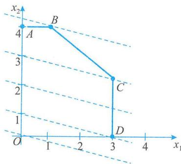
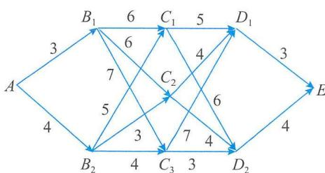
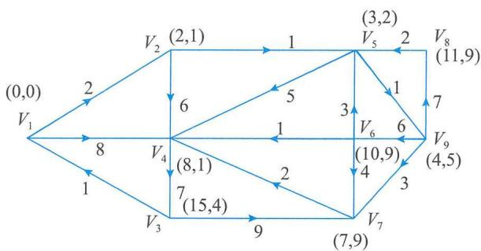
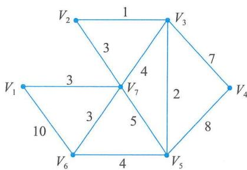
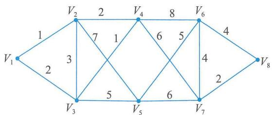

# 第21章 项目管理科学基础

科学管理的实质是反对凭经验、直觉、主观判断进行管理，主张用最好的方法、最少的时间和支出，达到最高的工作效率和最大的效果。其突破性进展是在第二次世界大战时期，为解决国防需要产生的“运筹学”，发展了新的数学分析和计算技术。例如：统计判断、线性规划、排队论、博弈论、统筹法、模拟法、系统分析等。

管理科学其实就是管理中的一种数量分析方法，它主要用于解决能以数量表现的管理问题，其作用在于通过管理科学的方法，减少决策中的风险，提高决策的质量，保证投入的资源发挥最大的经济效益。

---

## 21.1 工程经济学

### 21.1.1 资金的时间价值与等值计算

#### 1. 资金的时间价值与等值计算的概念

资金的时间价值是指不同时间发生的等额资金在价值上的差别。
*   **表现形式**：盈利和利息是资金时间价值的两种表现形式。
*   **影响因素**：主要取决于投资收益率、通货膨胀率和项目投资的风险。

**资金等值**是指在时间因素的作用下，在不同的时期（时点），绝对值不等的资金具有相等的价值。例如，在年利率为 $5.22\%$ 的条件下：
*   当年的 100 元与下一年的 $100 \times (1 + 5.22\%) = 105.22$ 元是等值的。
*   当年的 100 元与上一年的 $100 / (1 + 5.22\%) = 95.04$ 元是等值的。

在工程经济分析中，对资金时间价值的计算方法与银行利息的计算方法是相同的。

#### 2. 利息、利率及其计算

*   **利息 ($I$)**：占用资金的代价或放弃资金使用的补偿。
*   **本金 ($P$)**：存入银行的原始资金。
*   **本利和 ($F$)**：本金与利息之和。公式为：
    $$ F_n = P + I_n $$
*   **利率 ($i$)**：在 1 个计息周期内所应付出的利息额与本金之比。公式为：
    $$ i = \frac{I_1}{P} \times 100\% $$

**(1) 单利法**
每期均按原始本金计息，利息不生利息。
*   **利息计算公式**：
    $$ I_n = P \times n \times i $$
*   **本利和计算公式**：
    $$ F_n = P(1 + i \times n) $$

**(2) 复利法**
利息也生利息，每一计息周期的利息都要并入下一期的本金。工程经济分析中一般采用复利计算。
*   **复利计算公式**：
    $$ F_n = P(1 + i)^n $$

**表 21-1 单利与复利计算对比 (本金1000元，年利率6%)**

| 年份 | 单利法本利和 (元) | 复利法本利和 (元) |
| :---: | :--- | :--- |
| 1 | $1000 + 60 = 1060$ | $1000 + 60 = 1060$ |
| 2 | $1000 + 120 = 1120$ | $1060 + 63.60 = 1123.60$ |
| 3 | $1000 + 180 = 1180$ | $1123.60 + 67.42 \approx 1191.02$ |
| 4 | $1000 + 240 = 1240$ | $1191.02 + 71.46 \approx 1262.48$ |
| 5 | $1000 + 300 = 1300$ | $1262.48 + 75.75 \approx 1338.23$ |

#### 3. 资金的等值计算
*   **折现 (贴现)**：将未来某一时点的资金金额换算成现在时点的等值金额。
*   **现值 ($P$)**：资金现在的瞬时价值。
*   **终值 ($F$)**：资金现值按照一定的利率，换算到未来某时点的等值资金金额。

---

### 21.1.2 项目经济评价

#### 1. 静态评价方法
不考虑资金的时间价值，适用于初步可行性研究。

**(1) 静态投资回收期法 ($P_t$)**
指以项目的净收益抵偿全部投资所需的时间。
*   **计算公式**（根据累计净现金流量）：
    $$ P_t = (\text{累计净现金流量开始出现正值或零的年份数} - 1) + \frac{|\text{上年累计净现金流量}|}{\text{当年净现金流量}} $$
*   **判别准则**：若 $P_t \le P_c$ (基准回收期)，则项目可行。
*   **优缺点**：概念清晰，能反映风险；但未考虑时间价值，舍弃了回收期后的收入。

**(2) 投资收益率法 ($ROI$)**
$$ ROI = \frac{EBIT}{TI} \times 100\% $$
*   $EBIT$：年息税前利润。
*   $TI$：项目总投资。
*   **判别准则**：若 $ROI \ge R_b$ (基准收益率)，则项目可行。

#### 2. 动态评价方法
考虑资金的时间价值，用于详细可行性研究。

**(1) 净现值法 ($NPV$)**
按基准收益率将各年的净现金流量折现到建设起点 ($t=0$) 的现值累加值。
$$ NPV = \sum_{t=0}^{n} (CI - CO)_t (1 + i_0)^{-t} $$
*   **判别准则**：
    *   单一方案：$NPV \ge 0$，方案可行。
    *   多方案比选：$NPV$ 越大越好。
*   **缺点**：不能反映资金的利用效率 (投资额不同时难以直接比较)。

**(2) 净现值率法 ($NPVR$)**
$$ NPVR = \frac{NPV}{K_P} $$
*   $K_P$：项目总投资现值。
*   **判别准则**：$NPVR \ge 0$ 方案可行。主要作为 $NPV$ 的辅助指标，用于多方案优劣排序。

**(3) 费用现值法 ($PC$)**
用于产出价值相同但效益难以货币化的多方案比选。
$$ PC = \sum_{t=0}^{n} (K + C - S_V - W)_t (P/F, i_0, t) $$
*   **判别准则**：费用现值越小，方案越优。

**(4) 动态投资回收期法 ($P_D$)**
考虑时间价值，使净现值等于零时的计算期期数。
$$ P_D = (\text{累计折现值开始出现正值或零的年份} - 1) + \frac{|\text{上年累计折现值}|}{\text{当年折现值}} $$
*   **判别准则**：$P_D \le P_b$ (基准动态回收期)，项目可行。

**(5) 内部收益率法 ($IRR$)**
项目在计算期内各年净现金流量现值累计值等于零时的折现率。
$$ \sum_{t=0}^{n} (CI - CO)_t (1 + IRR)^{-t} = 0 $$
*   **判别准则**：$IRR \ge i_0$ (基准收益率)，项目可行。

---

## 21.2 运筹学

### 21.2.1 线性规划

线性规划主要研究在有限资源条件下如何取得最佳经济效益，或在任务确定下如何使消耗资源最少。

#### 1. 线性规划建模
包含三个要素：决策变量、目标函数、约束条件。

**【案例模型】** 某工厂生产 A、B、C、D 四种产品，追求利润最大化。
*   **决策变量**：设 $x_1, x_2, x_3, x_4$ 分别为产品 A, B, C, D 的产量。
*   **目标函数**：$S_{\max} = 8x_1 + 20x_2 + 12x_3 + 15x_4$
*   **约束条件**：
    $$
    \begin{cases}
    x_1 + 10x_2 + 2x_3 + 3x_4 \le 18000 & (\text{原料甲限制}) \\
    3x_1 + 2x_2 + 5x_3 + 4x_4 \le 13000 & (\text{原料乙限制}) \\
    x_1, x_2, x_3, x_4 \ge 0
    \end{cases}
    $$

#### 2. 图解法求解
适用于仅含 2 个变量的线性规划问题。通过在坐标系中画出约束条件的公共区域（可行域），然后移动目标函数等值线寻找最优解。

---

### 21.2.2 运输问题

解决将产品从产地运到销地，使总运费最低的问题。

**求解方法：表上作业法**
1.  **确定初始解 (最小元素法)**：优先满足运价最小的路径。
2.  **方案检验 (位势法)**：计算检验数，若所有检验数非正 (针对最小化问题)，则为最优解。
3.  **方案调整 (闭回路法)**：在检验数为正的空格中找最大值作为换入变量，构建闭回路进行调整。

**【例题数据演示】**
某产品有 3 个产地 ($A_1..A_3$) 和 4 个销地 ($B_1..B_4$)。通过迭代计算，最终得到最优调运方案。

---

### 21.2.3 指派问题

$n$ 项任务指派给 $n$ 个人，要求总效率最高或耗时最少。

**求解方法：匈牙利法**
1.  **变换系数矩阵**：每行减去该行最小元素，每列减去该列最小元素，得到初始缩减矩阵。
2.  **寻找独立零元素**：试指派，若能找到 $n$ 个位于不同行不同列的 0 元素，则找到最优解。
3.  **画盖零线**：若未找到，用最少的直线覆盖所有 0 元素。
4.  **调整矩阵**：未被覆盖的元素减去其中最小值，交叉点元素加上该最小值。重复步骤直至找到最优解。

---

### 21.2.4 动态规划

解决多阶段决策过程的最优化问题。基本思路是**逆序法**：从终点出发，反向求出各阶段的最短子路径。

#### 1. 最短路径问题
在多阶段的网络图中，利用递推公式 $f_k(X) = \min \{ d(X, Y) + f_{k+1}(Y) \}$ 求解。

#### 2. 资源分配问题
将资源分配给多个项目以获得最大总收益。
*   **状态变量 $S_k$**：投入第 $k$ 阶段至第 $n$ 阶段的总资源。
*   **决策变量 $x_k$**：第 $k$ 阶段的投入量。
*   **状态转移方程**：$S_{k+1} = S_k - x_k$。

---

### 21.2.5 图与网络

#### 1. 最短路径问题 (标号法)
适用于求起点到网络中所有其他顶点的最短路径（如 Dijkstra 算法思想）。
*   **标号 $(\alpha_j, \beta_j)$**：$\alpha_j$ 代表从起点到 $V_j$ 的最短距离，$\beta_j$ 代表前驱节点。
*   通过不断更新未标号点的距离值，直到所有点都被标号。

#### 2. 最小生成树
在一个赋权连通图中找出权值之和最小的生成树。
*   **破圈法**：任找一个圈，去掉圈中权数最大的边，直到图中不含圈。
*   **避圈法 (Kruskal/Prim)**：按权值从小到大选边，只要不构成圈。

---

### 21.2.6 博弈论

研究利益冲突情况下决策主体理性行为的选择。

*   **基本要素**：局中人、策略集、赢得矩阵。
*   **鞍点**：当 $\max_i \min_j a_{ij} = \min_j \max_i a_{ij}$ 时，存在最优纯策略，该点即为鞍点。
*   **实例**：田忌赛马、乒乓球团体赛排阵、商战定价等。

---

### 21.2.7 决策分析

#### 1. 不确定型决策
不知道未来状态发生的概率。

1.  **乐观决策法 (大中取大)**：选择最好状态下收益最大的方案。
2.  **悲观决策法 (小中取大)**：选择最差状态下收益最大的方案 (保守策略)。
3.  **平均值决策法**：假设各状态概率相等。
4.  **悔值决策法 (大中取小)**：
    *   计算后悔值 = 该状态下最大收益 - 当前方案收益。
    *   找出每种方案的最大后悔值。
    *   选择最大后悔值最小的方案。

#### 2. 风险型决策
知道未来状态发生的概率。

1.  **期望值决策法**：计算各方案的期望收益 $E(a_i) = \sum P_j V_{ij}$，选择期望值最大的方案。
2.  **期望值与标准差决策法**：当期望值相近时，考虑风险（标准差），选择标准差较小（风险较小）的方案。
3.  **最小悔值与期望值决策法**：计算悔值的期望值，选择最小者。

---

## 21.3 本章练习

**选择题**

**(1)** 甲、乙、丙为三个独立项目，NPV 甲为 12 万元、乙为 15 万元、丙为 18 万元，三个项目的初始投资额相同，并且回收期相同，则应优先选择 ____ 项目进行投资。
A. 甲
B. 乙
C. 丙
D. 甲或乙
**【参考答案】C**
> 解析：互斥方案或独立方案比选，在投资额相同时，NPV 越大越好。

**(2)** 基于下表数据计算，项目的净现值为（1），内部收益率为（2），基准折现率为 $10\%$ 。

| 年末 | 0 | 1 | 2 | 3 | 4 | 5 | 6 |
|---|---|---|---|---|---|---|---|
| 净现金流量/万元 | -50 | -80 | 40 | 60 | 60 | 60 | 60 |

（1）A. 150 B. 67.5 C. 80 D. 125.5
（2）A. 25.87% B. 15% C. 27.58% D. 23.26%
**【参考答案】（1）B （2）A**
> 解析：利用 NPV 公式折现计算；IRR 为 NPV=0 时的折现率。

**(3)** 购买一台设备，已知该设备的制造成本为 6000 元，售价为 8000 元，预计运输费需 200 元，安装费用为 200 元。该设备运行投产后，每年可加工工件 2 万件，每件净收入为 0.2 元。该设备的初始投资 ____ 年可回收。
A. 1.8
B. 1.9
C. 2
D. 2.1
**【参考答案】D**
> 解析：初始投资 = 8000 + 200 + 200 = 8400 元。年净收益 = 20000 * 0.2 = 4000 元。回收期 = 8400 / 4000 = 2.1 年。

**(4)** 某工厂生产甲、乙两种产品，生产 $1\mathrm{kg}$ 甲产品需要煤 $9\mathrm{kg}$、电 $4\mathrm{kW}\cdot \mathrm{h}$、油 $3\mathrm{kg}$，生产 $1\mathrm{kg}$ 乙产品需要煤 $4\mathrm{kg}$、电 $5\mathrm{kW}\cdot \mathrm{h}$、油 $10\mathrm{kg}$。该工厂现有煤 $360\mathrm{kg}$、电 $200\mathrm{kW}\cdot \mathrm{h}$、油 $300\mathrm{kg}$。已知甲产品利润为 7000 元 $/ \mathrm{kg}$，乙产品利润为 12000 元 $/ \mathrm{kg}$，为了获取最大利润，应该生产甲产品① $\mathrm{kg}$，乙产品② $\mathrm{kg}$。
① A. 20 B. 21 C. 22 D. 23
② A. 22 B. 23 C. 24 D. 25
**【参考答案】① A ② C**
> 解析：建立线性规划模型求解。
> 目标：Max Z = 7000x + 12000y
> 约束：9x + 4y <= 360; 4x + 5y <= 200; 3x + 10y <= 300。
> 解得 x=20, y=24。

**(5)** 图 21-9 是某城市八个小区的通信线路图，图中标注的数字代表通信线路的长度（单位为 $\mathrm{km}$），那么现在至少要架设 ________ km 的线路，才能保持八个小区的通信联通。

A. 19
B. 20
C. 21
D. 22
**【参考答案】B**
> 解析：最小生成树问题。利用破圈法或避圈法计算，总长度为 20。

**(6)** 某企业开发了一种新产品...（略，见原文表格）。
企业做定价决策前，首先需要选择决策标准。该企业决定采用**最小—最大后悔值**决策标准（坏中求好的保守策略），为此，该企业应选择 ______ 决策方案。
A. 较高价
B. 中等价
C. 较低价
D. 中等价或较低价
**【参考答案】B**
> 解析：
> 1. 计算后悔值矩阵：
>    - 销路好：最高20。较高价悔0，中等价悔4，较低价悔8。
>    - 销路一般：最高16。较高价悔5，中等价悔0，较低价悔4。
>    - 销路差：最高12。较高价悔4，中等价悔2，较低价悔0。
> 2. 各种方案的最大后悔值：
>    - 较高价：Max(0, 5, 4) = 5
>    - 中等价：Max(4, 0, 2) = 4
>    - 较低价：Max(8, 4, 0) = 8
> 3. 选择最大后悔值最小的方案：Min(5, 4, 8) = 4，对应“中等价”。

