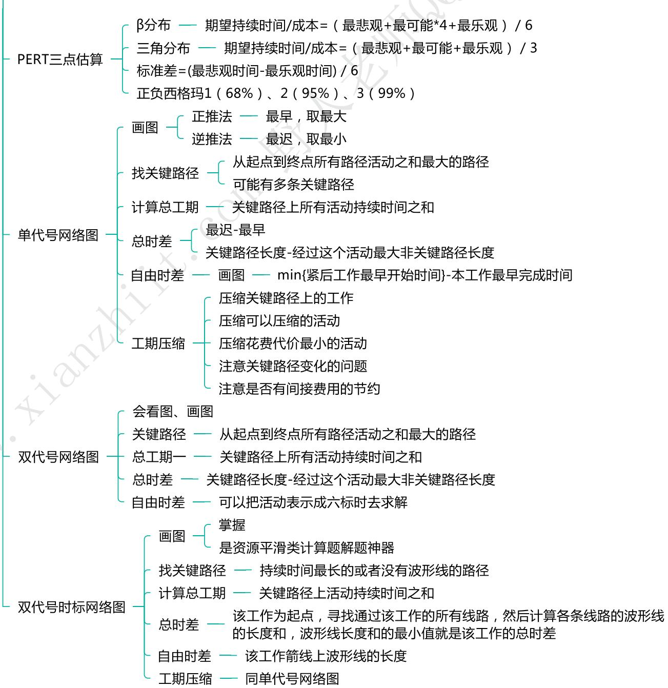
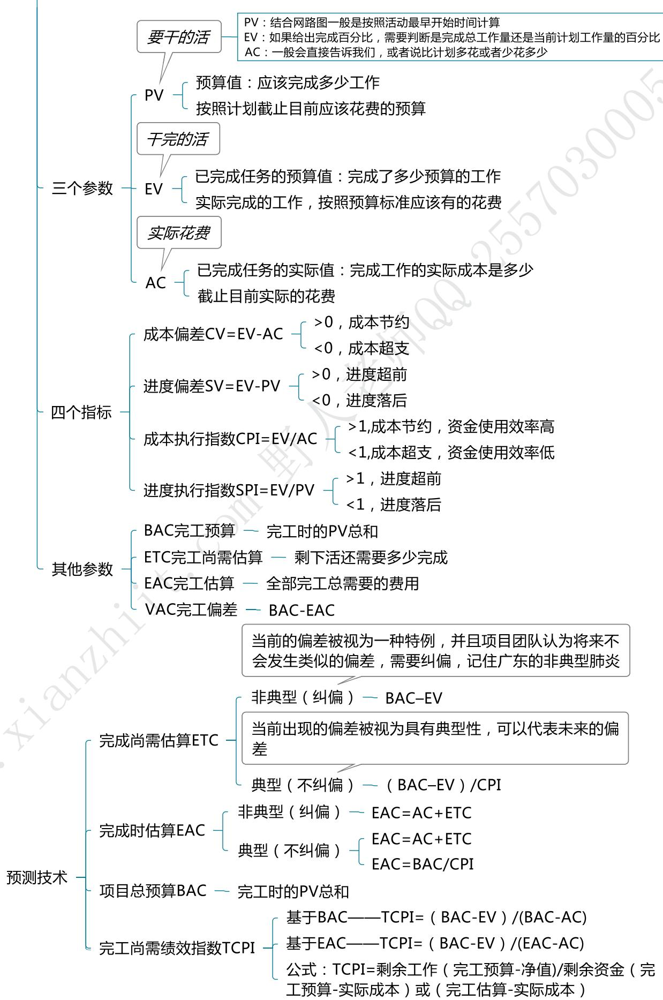
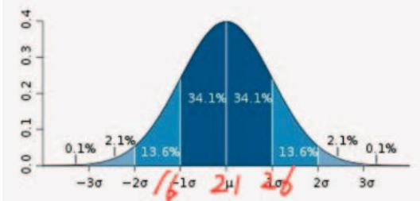
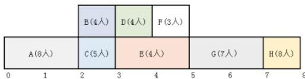

# 计算题进度类考点总结

# 其他类

# 进度类

# 计算题成本类考点总结

成本类

  
净值管理

1、沟通渠道里，N是几个人？  
2、EMV里，看求的是成本还是收益？如果是成本，选小的方案，如果是收益，选大的方案。求EMV的时候，各分支的影响到底是多少？比如成本是100元，失败的概率是  $20\%$  。失败了赔偿20元。则应该是  $20\%$ *（-120）。  
3、PERT里，是求XX天以内完成的概率，还是XX天以后才可以完成的概率。下图里，16天之内完成的概率就是  $16\%$  ，16天之后的概率就是  $84\%$  ；另外需要看看是E角还是贝塔，默认是贝塔

4、某某工作从几月几号开始，请记得拿出手指数。如果手指也不够了，则用笔1个1个去加。  
5、如果题目说了50/50原则，请一定要知道开始了就算  $50\%$  ，全部完成了才算  $100\%$  ，要么  $50\%$  ，要么  $100\%$  。如果没有说则按照正常的网络图或者计划去计算就好  
6、完成了总工作量的多少，完成了计划工作量的多少是不一样的。

(1)题目明确说了完成了总工作量的多少（EV=总预算*百分比）  
(2)题目明确说了完成了计划应该完成的多少（EV=PV*百分比）  
(3)如果2个数据都给了，题目没明确说，建议用总的算  $EV =$  总预算*百分比  
(4)只给了一个数字或者表格、可能就那那个算

7、管理储备和管理成本是不一样的。管理储备不需要算在BAC里，如果是汉字的总预算则计入。  
8、记得看看题目里的表，最下面一行有没写到：间接成本  
9、资源平滑的题目如果真的算不出人数来了，大概率就是各关键活动需要的人数的最大值，或者最大值+1，比蒙1个的概率还是大点点!此类题目可以按照上课教的画类似下图解题或者用双代号时标网络图解题

10、截止到检查点，按计划不需要做的工作，实际只要做了，算AC和EV的时候都需要算。  
11、压缩工期的时候，一定要注意关键路径是否发生改变了。  
12、注意题目给的单位。到底是:元/天，还是:元，还是:元/人天。举例:A活动需要2个人工作3天才完成。单位成本是500元/天，则A的总成本是1500元。如果是500元，则A就是500元。如果是500元/人天，则A的总成本是3000元。  
13、按原计划继续进行，是非典型(纠偏)。按原状态继续进行，是典型(不纠偏)。  
14、进度网络图结合成本的计算题，如果没特别说明。求PV按最早开始时间算，但是如果有特别说明，按照说明去算，但这种概率很小。