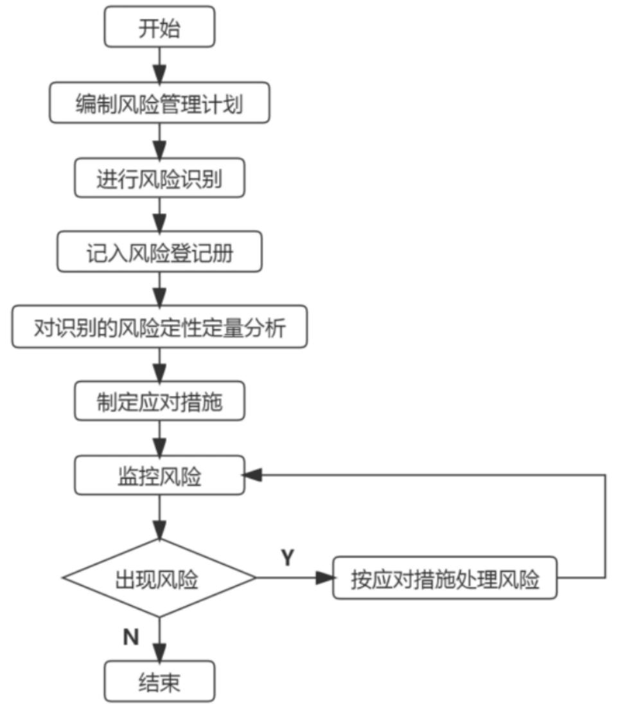

# 案例分析中常见找错问题2

# 信息系统项目管理师

# 案例分析常见找错问题

51、2013年年初，A公司通过竞标获得某市人口管理信息系统工程项目。A公司高层认为，尽管该项目的许多需求还没有完全确定下来，但是总体感觉上同以往曾经开发过的项目比较，还是比较简单，对完成这样的项目充满信心。

项目前期，A公司请王副总经理负责此项目的启动工作。王副总经理简单了解项目的概要情况后制定并发布了项目章程，任命小丁为项目经理。项目团队根据分工制定了相应的项目管理子计划。据此，项目经理小丁把各个子计划归并为项目管理计划。

为了保证项目按客户要求尽快完成，小丁基于自身的行业经验和对客户需求的初步了解，即安排项目团队开始进行项目实施，在系统开发过程中，建设方提出的建设需求不断变化，小丁本着客户至上的原则，总是安排项目组进行修改，从而导致开发工作多次反复。而因为项目计划的多次变化，导致项目团队的成员也经历过多次调整，实际进度与里程碑计划存在严重偏离，并且项目的质量指标也经常暴露出问题。

A公司项目管理办公室在对项目阶段审查时，感到很吃惊，并对发生这种情况觉得很不理解，认为即使是需求不完善也不至于导致项目存在这么多问题，觉得该项目在管理方面肯定存在很多问题。[高项15年5月试题三]

# 案例分析常见找错问题

52、鲜知软考教育信息系统集成公司决定采用项目管理办公室这样的组织形式来管理公司的所有项目，并任命了公司办公室主任王某来兼任项目管理办公室主任这一职务。鉴于目前公司项目管理制度混乱。各项目经理都是依照自己的经验来制定项目管理计划，存在计划制定不科学、不统一等情况，王某决定从培训入手来统一和改善公司项目管理计划的制定过程，并责成项目管理办公室的小张具体负责相关培训内容的组织。

小张接到任务后，仔细学习了项目管理的相关知识，并请教了专业人士。小张觉得项目管理体系结构中，主要由输入、工具和技术、以及输出组成。于是也按照项目管理编制计划的输入、项目管理编制计划的工具和技术，以及项目管理计划的输出内容三个方面来组织项目管理计划培训的相关课程内容。

但是在准备进一步的内容时，小张觉得目前公司的项目五花八门，有研发项目、系统集成项目、运维项目和纯粹的软件开发项目，还有部分弱电工程项目，既有规模大的项目，也有一些小项目，是不是能够用统一的标准来要求所有的项目管理计划规范制定过程？小张觉得很怀疑。[高项15年11月试题一]

# 案例分析常见找错问题

53、该项目属于定制型项目，涉及的用户方较多，小张根据自己的经验预测到项目可能会涉及频繁的需求变更，因此小张在将项目组分成了业务组、实施组、开发组后，定义了如下需求管理及控制流程：

(1) 指派专门的业务组进行需求分析，分析完成后马上与用户进行需求确认，确认后填写需求状态表（包括需求提交日期、需求状态、是否属于变更等）；  
(2) 实施组获得需求分析文档后，一周内进行技术方案设计；  
(3) 技术方案完成后，业务组视情况与用户进行二次沟通确认，确认后填写需求状态表（包括需求技术方案提交日期、需求技术方案状态）；  
(4) 需求分析、技术方案完成后，开发组每周对已确定需求进行工作量评估，形成月度开发计划；  
(5) 开发组根据开发计划进行定制开发工作;  
(6) 每周开发组根据需求状态库的需求、方案进行工作量重新评估，更新开发计划。项目进行过程中，发生了如下事件，导致项目延期半年才完成。[高项15年11月试题二]

# 案例分析常见找错问题

54、李工在项目执行过程中，发现项目章程中没有任何对于项目风险和开发模型的说明与规定,所以李工就根据自身的经验采用了瀑布模型来安排项目工作,当项目进行到2015年12月时,发现4G的普及率没有达到70%。公司决定暂停此项目。但是到此时为止,项目已经进展到了差不多一半,而且项目也不能够分阶段进行开发,否则将前功尽弃。而公司质量管理部门追究相关环节的错误时,李工觉得这样的风险不属于项目层面风险管理的内容,作为项目经理只要按照项目章程的规定执行项目就是尽责了。[高项16年5月试题二]

# 案例分析常见找错问题

55、小周担任过多个应用软件开发项目的项目经理，但没有负责过硬件集成项目，小周召开了项目启动会，对项目进行了分解，并给项目成员分配了任务，接下来，安排负责技术的小组长先编制项目技术方案，同时小周根据合同中规定的时间编制了项目的进度计划并发送给项目组成员，进度计划中确定了几个里程碑点：集成技术方案、设备到货、安装调试完成、应用系统迁移完成。由于该项目需要采购多种硬件设备，小周将进度计划发送给了采购部经理，并与采购经理进行了电话沟通。

技术方案完成后通过了项目组的内部评审，随后项目组按照技术方案开始进行设备调试的准备工作，小周找到采购部经理确认设备的到货时间，结果得到的答复是：服务器可以按时到场，但存储设备由于运输的原因，要晚一周到货。

由于存储设备晚到的原因，安装调试工作比计划延误了一周时间，在系统调试的过程中，项目组发现技术方案中存在一处错误，又重新改进了技术方案，造成实际进度比计划延误了两周，A企业得知系统迁移时间要延后，非常不满意，并到B公司高层领导投诉。[高项16年5月试题三]

# 案例分析常见找错问题

56、某涉密单位甲计划建设一套科研项目管理系统，因项目涉密，通过考察和比较，选择了具有涉密系统集成资质的单位乙来为其实施该项目。甲方要求所有开发工作必须在现场完成，项目所有资料归甲方所有。双方签订了合同和保密协议，合同中规定项目应在当年的年底前完成。乙公司派出项目经理小李带领项目组进驻甲单位现场，小李首先与客户沟通了需求，确定了大致的需求要点，形成了一份需求文件。经过客户确认后，小李就安排项目组成员开始进行开发工作，为了更好地把握需求的实现，小李在每天工作结束后，都将工作进度和成果汇报给甲方的客户代表，由客户提出意见，并形成一份备忘录。客户对软件的修改意见不断提出，小李也仔细地将修改意见记录在每天的备忘录中，并在第二天与项目组讨论之后，安排开发人员尽量实现。

随着软件的逐渐成型，小李发现此时客户提出一些需求实际上跟某些已实现的需求是矛盾的，对于有些新的需求，实现难度也越来越大。此时软件的实际功能与最初确定的需求文件中确定的功能已经相差很远，眼看时间越来越接近年底，小李不知道该怎么办才好。[高项16年11月试题二]

# 案例分析常见找错问题

57、某公司承接了某银行的信息系统集成项目，并任命王工为项目经理，这也是王工第一次担任项目经理。王工带领近20人的团队，历经近11个月的时间，终于完成了系统建设工作，并通过了试运行测试。王工在与甲方项目负责人简单地对接了项目交付清单之后，就报告公司项目已经结束，部分项目人员可以进行转移。王工组织剩下的项目团队成员召开了项目总结会议。随后公司的财务要求王工根据合同催甲方支付剩余  $30\%$  的项目款。

当王工打电话催促甲方支付项目尾款时，甲方的项目经理告诉他项目还没有结束，甲方还没有在验收报告上签字确认，项目的很多常规性文件还没有提交，而且需要在试运行的基础上，进一步修改程序和功能设置，现在根本没有达到项目收尾的条件。[高项16年11月试题三]

# 案例分析常见找错问题

58、小李制定了项目整体进度计划，将项目分为需求分析、设计、编码、试运行和验收五个阶段。为保证项目质量，小李请有着多年的编码、测试工作经历的测试组组长张工兼任项目的质量保证人员。在项目启动会上，小李对张工进行了口头授权，并要求张工在项目的重要阶段（如完成需求分析、完成总体设计、完成单元编码和测试等）必须对项目交付物进行质量检查。在检查时，张工可以根据自己的经验提出要求，对于不满足要求的工作，必须立即进行返工。项目在实施过程中，遇到一些问题，具体如下：

在项目组完成编码与单元测试工作，准备进行系统集成前，张工按照项目经理小李的要求进行了质量检查。在检查过程中，张工凭借多年开发经验，认为某位开发人员负责的一个模块代码存在响应时间长的问题，并对其开具了不符合项报告。但这位开发人员认为自己是严格按照公司编码规范编写的，响应时间长不是自己的问题。经过争吵，张工未能说服该开发人员，同时考虑到该模块对整体项目影响不大，张工没有再追究此事，该代码也没有修改。在项目上线前，信息中心领导组织技术专家到项目现场进行调研和考察。专家组对已完成的编码进行了审查，发现很多模块不能满足甲方的质量要求。[高项17年5月试题二]

# 案例分析常见找错问题

59、项目经理小李负责了一个新的项目，该项目的内容是为某市开发一套智慧城市公共综合信息服务平台。项目启动阶段，甲方仔细查看了小李提交的项目实施方案，提出由于该项目的投资方构成复杂，项目需求不清晰，希望项目组能想办法解决这个问题。

小李向公司申请了几名经验丰富的系统分析师，加强需求分析阶段的工作。经过较为充分的需求调研，形成了初步的需求说明书。小李认为需求分析工作较为详细，按照公司常用的软件开发生命周期模型，选择了瀑布模型进行开发。

在编写概要设计和详细设计说明书的过程中，客户方提供了几处需求的修改要求。由于其工作量不大，小李直接安排系统分析师按客户的要求进行了修改。在编码阶段后期，由于客户的投资方发生了变化，新的投资方采用了新的运营模式，导致需求发生较大变化，由于前期甲方已经强调过项目需求特点和要求，小李只能接受客户新的变更要求。在执行变更的过程中，项目组发现新的需求将导致系统架构的更改，经过评估该变更将使项目延期。[高项17年5月试题三]

# 案例分析常见找错问题

60、在项目初期，小张制定了变更和配置管理规则：客户需求发生变化时，应首先由工程师对需求变化造成的影响做评估，如果影响不大，工程师可以直接进行修改并更新版本，不需要上报项目经理；当工程师不能判断需求变化对项目的影响时，应上报给项目经理，由项目经理作出评估，并安排相关人员进行修改。

在项目实施过程中，用户针对软件的功能模块提出一些修改需求，工程师针对需求做了评估，发现修改工作量不大，对项目进度没有影响，因此，出于客户满意度的考虑，工程师直接接受了客户的要求，对软件进行修改。在软件测试联调阶段，测试人员发现部分功能模块与原先设计不符，造成很多接口问题。经调查发现，主要原因是客户针对这些功能模块提出过修改要求，项目经理要求查验，没有发现相关变更文件。[高项17年11月试题]

# 案例分析常见找错问题

61、甲公司中标一个城市轨道交通监控系统开发项目，公司领导决定启用新的技术骨干作为项目经理，任命研发部软件开发骨干小王为该项目的项目经理。

小王技术能力强，自己承担了该项目核心模块开发任务，自从项目管理计划发布以后，一直投身于自己的研发任务当中。除了项目阶段验收会之外，没有召开过任何项目例会，只是项目出现问题时才召开项目临时会议。经过项目团队共同努力，该项目进展到系统测试阶段。在系统测试前，发现该项目有一个指示灯显示模块开发进度严重滞后，小王立刻会同该模块负责人小李熬夜加班赶工，完成了该模块；

小王在项目绩效考核时，认为小李的工作态度不认真，给予较差评价并在项目团队内部公布考核结果。小李认为自己连续熬夜加班，任务也完成了，觉得考核结果不公平，两人就此问题发生了严重冲突，小李因此消极怠工，甚至影响到了项目验收。[高项17年11月试题三]

# 案例分析常见找错问题

62、项目启动初期，张伟任命项目成员李明担任项目的质量管理员，专职负责质量管理，考虑到李明是团队中最资深的工程师，有丰富的实践经验,张伟给予李明充分授权，让他全权负责项目的质量管理。得到授权后，李明制定了质量管理计划，内容包括每月进行质量抽查、每月进行质量指标分析、每半年进行一次内部审核等工作。

2017年7月份，在向客户进行半年度工作汇报时，客户表示对项目的不满，一是项目进度比预期滞后：二是项目的阶段交付物不能满足合同中的质量要求。

由于质量管理工作由李明全权负责，张伟并不清楚究竟发生了什么问题，因此，他找李明进行了沟通，得到两点反馈：

1. 在每月进行质量检查时，李明总能发现些不符合项。每次都口头通知了当事人，但当事人并没有当回事，同样的错误不断重复出现：  
2. 李明认为质量管理工作太得罪人，自己不想继续负责这项工作。接着，张伟与项目组其他成员也进行了沟通，也得到两点反馈：  
1. 李明月度检查工作的颗粒度不一致。针对他熟悉的领域，会检查得很仔细：针对不熟悉的领域，则一带而过：  
2. 项目组成员普遍认为:在项目重要里程碑节点进行检查即可,没必要每月进行检查。[高项18年5月试题一]

# 案例分析常见找错问题

63、公司任命小陈为项目经理，并从各部门抽调了经验丰富的工程师组成了项目团队。小陈依据过去多年从事会议场所多媒体播控系统的经验，自己编写了项目范围说明书，并依此创建了WBS和WBS词典，形成项目范围基准。在项目实施过程中，由于与供应解码设备的厂商发生合同纠纷，项目组不得不断新寻找新的合作厂商，并针对新的解码设备，全新开发接口软件，致使项目工期拖延。客户针对播放控制软件，要求增加断点续传的功能，开发人员认为工作量不大就自行增加了该功能。项目测试时，小陈发现与之前做的项目不同，地铁运行时数据是通过车地无线网络传输，带宽优先，网络丢包现象严重，导致视频节目播放时，经常卡顿，马赛克现象严重，究其原因发现WBS中解决该问题的软件模块没有开发。验收时，客户对项目执行情况不满意，小陈觉得客户吹毛求疵与客户客户发生了争执，导致客户向公司高层投诉。[高项18年11月试题一]

# 案例分析常见找错问题

64、A公司中标某金融机构（甲方）位于北京的数据中心运行维护项目并签署了运维合同。合同明确了运维对象包括服务器、存储及网络等设备，并约定：核心系统备件4小时到场；非核心系统备件24小时到场；80%以上备件需满足上述时效承诺，否则视为违约。

A公司任命小张担任该项目的项目经理。为了确保满足服务承诺，小张在北京建立了备件库,招聘了专职备件管理员及库房管理员。考虑到备件成本较高,无法将服务器、存储和网络设备的所有备件都进行储备，备件管理员选择了一些价格较低的备件列入《备件采购清单》，并经小张批准后交给了采购部。随后，采购部通过网站搜索发现B公司能够提供项目所需全部备件且价格较低，于是确定B公司作为备件供应商并签署了备件采购合同。项目实施三个月后，甲方向公司投诉：一是部分核心系统备件未能按时到场；二是部分备件加电异常，虽然补发了备件，但是影响了系统正常运行针对备件未能按时到场的问题

# 案例分析常见找错问题

小张通过现场工程师了解到，一是部分核心系统备件没有储备，二是部分备件在库存信息中显示有库存，但调取时却找不到。为此需要临时从B公司采购，延误了备件到场时间。

针对备件加电异常的问题，小张召集采购部、库房管理员、B公司召开沟通会议库房管理员认为B公司提供的备件质量存在严重问题，但无法提供相应证据。B公司则认为供货没有问题，是库房环境问题导致备件异常，因为B公司人员送备件到库房时曾多次发现库房温度、湿度超标，采购部人员观点与库房管理员一致，原因是采购部通过查询政府采购网等多家网站发现，B公司去年存在多项失信行为记录大家各执一词，会议无法达成共识。[高项19年5月试题一]

# 案例分析常见找错问题

65、2018年7月某信息系统公司中标当地司法部门语音转写项目，任命小陈为项目经理。小陈组建了项目组，制定了项目范围说明书，并获得了客户确认。为了激励成员，小陈向公司申请了项目奖金，项目进行过程中，小陈发现人员紧张，请来在读研究生小张协助软件研发工作,并对其进行了培训。软件开发完成后，小陈找到公司办公室职员小侯帮助进行软件测试。小侯普通话不标准，测试发现语音识别率不高。小李认为原因是程序架构不合理，小胡则认为是算法存在问题，双方争论不休，小陈认为这是正常的工作状态，未做干预。项目组成员间气氛日趋紧张，士气低落。[高项19年5月试题三]

# 案例分析常见找错问题

66、王伟认为好的项目团队中绝对不能出现冲突现象，这次冲突与小张的个人素养有直接关系。为了避免冲突对团队产生不良影响，王伟宣布立即终止会议并请小张留下来单独谈话。

在沟通中，王伟批评小张缺乏团队合作意识。小张表示他对加班费、项目奖金等不在意，而且他技术经验丰富，很容易找到份收入不错的工作。他不加班的原因是最近家人、朋友等各种圈子应酬太多。王伟表明如果因为小张的原因导致项目工期延误，会影响小张在团队中的个人声誉，同时更会影响整个项目团队在客户和公司内部的声誉，小张虽不情愿，但最终选择了加班。[高项19年11月试题三]

# 案例分析常见找错问题

67、刘工和李工带领团队根据以往经验完成了需求调研和范围说明书。但由于该项目甲方负责人负责多个项目，时间紧张，导致需求评审会无法召开。张工考虑到双方已经有合作基础，李工和刘工对原系统非常熟悉，为了不影响进度，张工让项目组采用敏捷开发模式，直接进入了设计和编码阶段。

在客户验收测试时，甲方负责人提出APP的UI设计不符合公司风格、不兼容新燃气表的数据接口、数据传输加密算法不符合要求等多项问题，要求必须全部实现这些需求后才能验收。此时张工把公司新产品研发部正在研发的新产品给甲方负责人展示，双方口头约定可以采用新产品部分功能实现未完善的需求。经过增加人员和加班赶工，延期1个月完成。项目上线后用户又发现了若干问题。[高项20年11月试题一]

# 案例分析常见找错问题

68、A公司是提供SaaS平台服务业务的公司，小张作为研发流程优化经理，他抽查了核心产品的配置管理和测试过程，情况如下：项目组共10人，产品经理野人老师兼任项目经理和配置管理员，还要7名开发工程师和2名测试工程师，采用敏捷开发的方法，2周为一个迭代周期，目前刚刚完成一个3.01版本的上线。

小张要求看一下配置管理库，野人老师回复：“我正忙着，让测试工程师王工给你看吧，我们10个人都有管理员权限”。小张看到配置库分为了开发库和产品库，产品库包括上线的3个大版本的完整代码和文档资料，而且与实际运行版本有偏差。小版本只能在开发库中找到代码，但没有相关文档，而且因为新需求迭代太快，有些很细微的修改，开发人员随手进行了修改，文档和代码存在一些偏差。

小张策划对产品做一次3.01版本的系统测试，以便更好的解决研发流程和系统本身的问题。[高项20年11月试题三]

# 案例分析常见找错问题

69、公司没有智慧法院的相关项目经验，选择刚业两年的小王担任项目经理，由于项目时间较紧，小王主要围绕工作分解、人员分工、项目进度和预算，独自制定了项目管理计划，考虑到公司从未有过智能语音识别方面的相关开发经验，小王特意从某高校请来人工智能实验室的李教授，为项目组人员培训智能语音相关理论知识和常用算法，经过培训，对语音识别技术有了初步的了解，但还不具备自我研发能力，因此项目组决定将该功能外包。

项目实施过程中，甲方希望能在软件中增加一简单功能，小王认为增加功能并不复杂，直接让软件开发人员进行了修改，由于项目本身时间周期较短，又受疫情影响，时间更加紧迫，为了不耽误进度，小王要求项目组采取997工作模式，项目中后期，有核心人员提出离职。项目收尾时，小王发现交付的软件存在部分功能与设计文档不一致。[高项21年05月试题一]

# 案例分析常见找错问题

70、小王担任项目经理，项目交付期为60天。小王研究了总部提出的需求后，认为项目核心在于各子公司数据收集以及数据可视化及分析预测功能。各子公司数据收集可以以总部现有系统中的数据格式模板为基础，为各子公司建立数据上传接口。针对数据的分析预测功能，由于牵涉到人工智能等相关算法。目前项目组还不具备相关方面的知识储备，因此项目组对该模块功能直接外包。小王将数据收集与可视化工作进行了WBS分解，WBS的部分内容如下：

# 案例分析常见找错问题

<table><tr><td>工作编号</td><td>工作任务</td><td>工期</td><td>负责人</td></tr><tr><td>...</td><td>...</td><td>...</td><td>...</td></tr><tr><td>2</td><td>系统设计</td><td>20天</td><td>王工</td></tr><tr><td>3</td><td>程序编制</td><td>30天</td><td>任工</td></tr><tr><td>...</td><td>...</td><td>...</td><td></td></tr><tr><td>3.2.1</td><td>人力资源模块编码</td><td>25天</td><td>孙工</td></tr><tr><td>3.2.2</td><td>采购模块编码</td><td>20天</td><td>赵工</td></tr><tr><td>3.2.3</td><td>销售模块编码</td><td>20天</td><td>赵工</td></tr><tr><td>...</td><td>...</td><td>...</td><td></td></tr><tr><td>4</td><td>系统测试与验收</td><td>5天</td><td>张工、李工</td></tr><tr><td>...</td><td>...</td><td>...</td><td></td></tr></table>

# 案例分析常见找错问题

此外，虽然总部没有提出修改界面，但小王认为旧版的软件界面不够美观，让软件研发团队重新设计并更改了软件界面。

试运行阶段，总部人员试用后，认为已经熟悉旧版的操作模式，对新版界面的布局极其不适应；各子公司数据报送人员，认为数据上报的字段内容与自己公司的业务并不相关，填写困难。总部和各子公司的试用人员大部分认为新系统不是很好用。[高项21年11月试题一]

# 案例分析常见找错问题

71、某公司中标医院的信息管理系统。公司指派小王担任项目经理，并组建相应的项目团队。由于人手有限，小王让负责项目质量工作的小杨同时担当配置管理员。小杨编写并发布了质量管理计划和配置管理计划。

小杨利用配置管理软件对项目进行配置管理，为了项目管理方便，小杨给小王开放所有的配置权限，当有项目组成员提出配置变更需求时，小杨直接决定是否批准变更请求。小杨为项目创建了三个文件夹，分别作为存放开发、受控、产品文件的目录，对经过认定的文档或经过测试的代码等能够形成配置基线的文件，存放到受控库中，并对其编号。项目研发过程中，某软件人员打算对某段代码作一个简单修改，他从配置库检出待修改的代码段，修改完成并经测试没问题后，检入配置库，小杨认为代码改动不大，依然使用之前的版本号，并删除了旧的代码。公司在质量审计过程中，发现项目管理方面的诸多问题。

[高项21年11月试题三]

# 案例分析常见找错问题

72、A公司承接某市机关事业单位界老保险信息系统，项目覆盖个市、区、县的机关事业单位在编人员的养老保险信息，实现数据集中统一管理。公司成立了项目组，并任命小王担任项目经理。项目组对项目进行调研后，成立了风险管理小组，编写了项目管理计划和风险管理计划，明确项目风险管理流程如下图所示：

# 案例分析常见找错问题

项目组对风险登记册的各风险制定了相应措施，部分措施如下所示：  

<table><tr><td>风险类别</td><td>风险描述</td><td>措施</td></tr><tr><td>人员风险</td><td>人员情绪风险</td><td>调离项目组</td></tr><tr><td>技术风险</td><td>缺少数据库设计和相关技术储备</td><td>外包</td></tr><tr><td>技术风险</td><td>需要新的数据安全管理技术</td><td>培训</td></tr><tr><td>管理风险</td><td>非预期事件造成成本增加的风险</td><td>应急储备</td></tr><tr><td>管理风险</td><td>审批流程繁琐</td><td>加强部门沟通，建立协调配合机制</td></tr></table>

此外，在信息安全方面，养老保险数据信息涉及个人隐私，如果不法分子突破安全限制，会造成用户隐私泄露或信息篡改。因此项目组采用PKI技术为系统的安全运行提供了有效的保障。[高项22年05月试题三]

# 案例分析常见找错问题

73、小陈认为编制沟通管理计划是一件重复性的工作，于是参考过去的项目管理计划，简单进行了修改后放入了项目计划文件夹下作为公共信息供大家查阅，完成后的沟通管理计划表如下：[高项22年11月试题一]

<table><tr><td>沟通内容</td><td>沟通方法</td><td>沟通时间</td><td>参与人</td><td>沟通目的</td></tr><tr><td>每周工作例会</td><td>谈话</td><td>每周五 16:00</td><td>A公司项目组成员</td><td>汇报进度，解决遇到问题</td></tr><tr><td>方案评审</td><td>会议</td><td>阶段性</td><td>A公司项目组相关成员</td><td>确定方案</td></tr><tr><td>项目阶段性总结</td><td>电子邮件</td><td>里程碑点</td><td>A公司主管领导、项目</td><td>阶段性汇报</td></tr><tr><td>软件开发技能培训</td><td>在线课程</td><td>临时</td><td>A公司软件研发人员</td><td>提高软件研发技能</td></tr><tr><td>项目交流会</td><td>电话</td><td>项目启动、结束时</td><td>A公司项目组成员、客户、外包公司</td><td>各方了解项目情况</td></tr></table>

# 案例分析常见找错问题

74、A公司为提升市场竞争力，计划针对制造业数字化转型的需求，新开发一套数字化软件，实现在工业产品生产和制造过程中数据采集，分析和决策功能。公司让产品部前期对市场需求进行调研。产品部对软件预期能产生的经济效益和社会效益，进行了详细的分析，并针对这两部分，编制了《可行性分析报告》。公司高层领导看了报告后，认为该软件未来会为公司带来巨大的收益，当场拍板决定启动项目，要求产品部补充编剧《项目建议书》，并组建项目团队。

小王作为某名校计算机专业刚毕业的研究生，被公司委以重任，担任该项目的项目经理。研发负责人向小王建议为配置管理设置一名专职配置管理员，但小王认为有配置管理工具，对代码进行控制，大家只要对程序代码做好版本控制就可以了，考虑到项目组人员紧张，没必要再安排专人负责配置管理工作。

开发过程中，为避免多人同时修改代码导致冲突，研发人员要先将服务器上的代码下载，待编码完成后，使用文本对比工具将代码中修改的部分进行上传整合。

软件研发完成测试通过后，研发人员将最终版本软件和软件使用说明书提供给产品部，产品部人员发现说明书描述和内容与软件不完全一致，于是将问题反馈给小王，小王经检查发现提交的说明书并不是最新的说明书。[高项22年11月试题三]

# 案例分析常见找错问题

75. 为实现空气质量的精细化治理，某市规划了智慧环保项目。该项目涉及网格化监测、应急管理、执法系统等多个子系统。作为总集成商，A公司非常重视，委派李经理任项目经理，对公司内研发部门与项目相关的各产品线研发人员及十余家供应商进行统筹管理。李经理明确了关键时间节点，识别出项目干系人为客户和供应商后，开始了项目建设工作。

项目开始建设5个月后，公司高层希望了解项目情况，要求李经理进行阶段性汇报。李经理对各方面工作进展进行汇总，发现三个问题：一是原本该到位的服务器、交换机，采购部门迟迟没有采购到位，部分研发完成的功能无法部署到客户现场与客户进行演示确认；二是S公司作为A公司的供应商，承担空气质量监测核心算法工作，一直与客户方直接对接，其进度已经不受李经理掌控，且S公司作为核心算法国内唯一权威团队，可以确保算法工作按期交付，因此其认为不需要向李经理汇报工作进展；三是公司研发部门负责人因其他项目交付紧迫性更高，从该项目抽调走了2名研发人员张工、王工，项目目前研发人员的空缺需要后续补充。

# 案例分析常见找错问题

李经理忧心忡忡，向公司汇报完项目进展情况后，公司政策研究院相关领导表示国家在环境执法方面的法律法规本月初已经进行了较大改版，项目相关子系统会有关联；营销副总裁听完项目汇报后表达不满：该项目作为公司的重点项目，希望作为全国性的标杆项目进行展示和推广，但当前各子系统的研发成果基本照搬了公司现有产品，没有任何创新性的体现，不利于公司后期的宣传推广，PMO提醒李经理依据财务部门推送的数据，公司对部分供应商已经根据进度完成了第二节点款项支付，但当前A公司作为总集成商，与客户的第二个合同付款节点还未到，项目的成本支出和收益方面将面临较大的压力。人力资源负责人提醒李经理，项目成员张工和王工的本月绩效评价还未提交，截止日期为2天以后。[高项23年05月试题一]

# 案例分析常见找错问题

76. 数字化城市管理通过信息化手段和移动通信技术手段来处理、分析和管理整个城市的所有部件和事件信息，促进城市人流、物流、信息流、交通流的通畅与协调。

2023年，某县为提升该县的运营效率，利用已有的海量数据，实现数字化城市管理，启动了数学化城市管理项目，项目建设期8年。作为政府重点项目，为扶持当地民营企业，将项目建设工作交给A公司牵头负责。

A公司过去一直做银行信息管理系统，为了完成好项目，他们仔细研究了数字化城市管理的相关文档，参考了其他城市的数字化城市管理建设项目，发现城市管理的建设要牵涉到多个政府部门。调研中还发现，尽管目前县政府已经汇集了来自各部门关于城市运营的海量数据，但没有统一的数据标准，导致出现数据不规范、难以融合、利用率不高等问题。尤其是交通数据，来源于多个系统，各系统建设时间先后不一、标准不同、数据多而散乱、数据多源异构现象明显，导致海量交通数据一直未得到有效利用。因此，为了满足不同系统间的数据整合和共享需求，A公司打算建立统一的数据元标准，指导与规范城市数字化建设。[高项23年05月试题三]

# Thank You!

微信公众号：野人老师 淘宝店铺：yerenlaoshi.taobao.com