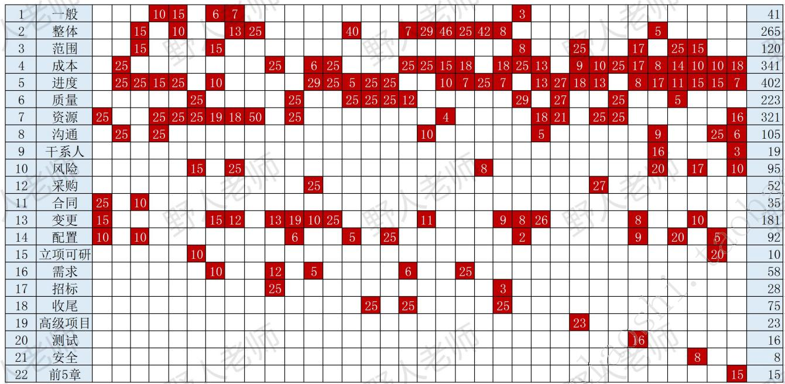
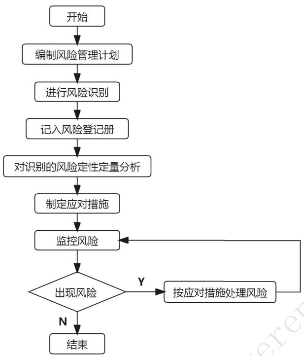
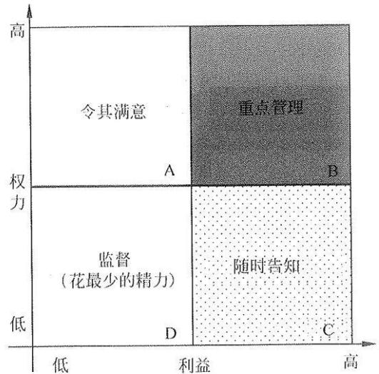
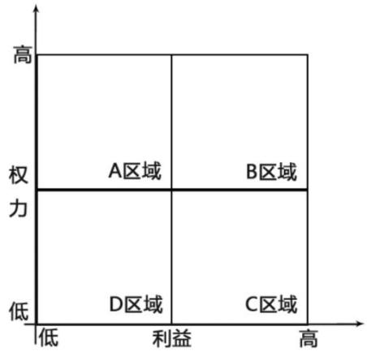

# 前言

此文档根据高级和中级历年案例考试重点总结而成，对高级考试有很大的参考价值，特别适合备考时间较短的考生。题目中涉及的考点一定要掌握。此文档分为无答案版本和有答案解析版本，可以先做无答案版，之后对照解析检查知识点的掌握情况。

案例分析考查的知识点为：整合、范围、成本、进度、质量、资源、沟通、风险、采购、变更、合同、招标、配置、立项可研、项目集。还是优先准备十大管理相关的，其它领域考察的概率可能性，比较低。

<table><tr><td>年份</td><td>试题一</td><td>试题二</td><td>试题三</td></tr><tr><td>05上</td><td>人力资源</td><td>变更</td><td>合同、沟通</td></tr><tr><td>05下</td><td>进度</td><td>成本</td><td>沟通</td></tr><tr><td>06下</td><td>整体、配置</td><td>合同、范围</td><td>进度</td></tr><tr><td>07下</td><td>整体</td><td>沟通</td><td>人力资源</td></tr><tr><td>08上</td><td>整体</td><td>人力资源</td><td>进度</td></tr><tr><td>08下</td><td>人力资源</td><td>质量</td><td>风险、可研</td></tr><tr><td>09上</td><td>范围、进度</td><td>人力资源</td><td>需求、变更</td></tr><tr><td>09下</td><td>风险</td><td>进度</td><td>需求、变更</td></tr><tr><td>10上</td><td>变更、需求</td><td>人力资源</td><td>整体</td></tr><tr><td>10下</td><td>招投标</td><td>需求、变更</td><td>成本</td></tr><tr><td>11上</td><td>质量</td><td>人力资源</td><td>需求、变更</td></tr><tr><td>11下</td><td>进度</td><td>需求、变更</td><td>采购</td></tr><tr><td>12上</td><td>进度</td><td>成本</td><td>需求、变更</td></tr><tr><td>12下</td><td>整体、配置</td><td>进度</td><td>质量</td></tr><tr><td>13上</td><td>质量</td><td>进度</td><td>收尾</td></tr><tr><td>13下</td><td>成本、进度</td><td>成本</td><td>配置</td></tr><tr><td>14上</td><td>需求、质量</td><td>成本、进度</td><td>收尾</td></tr><tr><td>14下</td><td>成本</td><td>综合(沟通、变更)</td><td>综合(立项、范围、整体)</td></tr><tr><td>15上</td><td>成本、进度</td><td>整体、人力</td><td>整体</td></tr><tr><td>15下</td><td>整体</td><td>成本、进度</td><td>需求</td></tr><tr><td>16上</td><td>进度</td><td>整体、风险</td><td>整体</td></tr><tr><td>16下</td><td>成本、进度</td><td>整体、变更</td><td>收尾</td></tr><tr><td>17上</td><td>成本</td><td>质量</td><td>综合(范围、变更、配置)</td></tr><tr><td>17下</td><td>变更</td><td>成本、进度</td><td>人力资源、沟通</td></tr><tr><td>18上</td><td>质量</td><td>进度</td><td>人力</td></tr><tr><td>18下</td><td>范围</td><td>进度、成本</td><td>项目集、项目组合</td></tr><tr><td>19上</td><td>采购</td><td>进度、成本</td><td>人力</td></tr><tr><td>19下</td><td>质量</td><td>成本</td><td>人力</td></tr><tr><td>20下</td><td>范围、变更管理</td><td>进度、成本</td><td>配置、测试管理</td></tr><tr><td>21上</td><td>风险、整体管理</td><td>进度、成本</td><td>沟通干系人管理</td></tr><tr><td>21下</td><td>范围管理</td><td>进度、成本</td><td>配置、质量管理</td></tr><tr><td>22上</td><td>范围、变更管理</td><td>进度、成本</td><td>风险、安全管理</td></tr><tr><td>22下</td><td>沟通管理</td><td>进度、成本</td><td>立项、配置管理</td></tr><tr><td>23上</td><td>资源、沟通管理</td><td>进度、成本</td><td>风险管理、信息系统工程</td></tr></table>

# 考点1：资源管理

# 试题1-【2022年11月试题四】（出自中级）

阅读下列说明，回答问题1至问愿3，将解答填入答题纸的对应栏内。

【说明】

A公司承接了某信息系统运行维护项目，项目内容包括对客户数据中心的信息系统进行每周7天，每天24小时值班、监控、巡检及故障处理等。

为满足客户要求，项目经理张伟制定了详细的运维值班计划，要求项目团队严格按照计划执行。国庆节前，张伟通知小李国庆期间值班，并表示年轻人应该多承担值班工作，如果不服从工作安排，会影响年终考评结果。

某天凌晨2点，客户核心业务发生中断。张伟第一时间赶到现场，发现问题复杂，立即电话联系各领域技术人员。得知张伟已在现场后，大家也立刻赶往现场。张伟凭借自己多年运维经验，快速制定了一套解决方案。相关人员一致认可并马上着手实施，迅速恢复了业务。为此，客户高层向A公司发送了书面感谢信，对整个运维团队提出了表扬。

为了进一步激励团队，张伟制定了如下激励措施：

措施1：为参与项目的员工购买了附加商业保险。

措施2：工程师非工作时间值班，可以领取额外值班补贴和午餐补贴。

措施3：每季度评选出2位“季度服务之星”，颁发荣誉证书，并请获奖人员在部门季度会议上进行经验分享。

措施4：每月开展一次团建活动，如户外活动、拓展训练等。

【问题1】（8分）

项目经理具备5种基本的权力。请结合案例，补充完成下表。

<table><tr><td>项目经理的权力</td><td>张伟行使权力的具体活动</td></tr><tr><td>职务权力</td><td>制定运维值班计划，要求项目团队严格按照计划执行</td></tr><tr><td></td><td></td></tr><tr><td></td><td></td></tr><tr><td></td><td></td></tr><tr><td></td><td></td></tr></table>

【问题2】（6分）

请指出张伟提出的4项激励措施，分别针对马斯洛需要层次理论中的哪个层次。

措施1：（）

措施2：（）

措施3：（）

措施4：（）

【问题3】（4分）

判断下列选项的正误(填写在答题纸的对应栏内, 正确的选项填写“√”, 错误的选项填写“×”)

（1）经理带领团队管理项目的过程中，具有领导者和管理者的双重身份，案例中张伟制定了详细的运维值班计划是在执行领导职能。（）  
（2）张伟制定的运维值班计划需要在项目初期制定，项目后期进展过程中可以根据情况修改。  
(3) 张伟通知小李国庆期间值班，并表示年轻人应该多承担值班工作，如果不服从工作安排，会影响年终考评结果这种做法符合 Y 理论对人性的判断。（）  
(4) 张伟制定一系列激励措施是在建设团队管理过程的活动。( )

【参考答案】

【问题1】（8分）

<table><tr><td>项目经理的权力</td><td>张伟行使权力的具体活动</td></tr><tr><td>职务权力</td><td>制定运维值班计划，要求项目团队严格按照计划执行</td></tr><tr><td>惩罚权力</td><td>如果不服从工作安排，会影响年终考评结果</td></tr><tr><td>专家权力</td><td>张伟凭借自己多年运维经验，快速制定了一套解决方案</td></tr><tr><td>奖励权力</td><td>为了进一步激励团队，张伟制定了激励措施</td></tr><tr><td>参照权力</td><td>得知张伟已在现场后，大家也立刻赶往现场</td></tr></table>

【问题2】（6分）

措施1：（安全需要）

措施2：（生理需要）

措施3：（自尊的需求）

措施4：（社会交往的需求）

【问题3】（4分）

（1）×，计划是管理职能。  
(2)  
（3） $\times$ ，这个是消极的，X理论。  
(4)

# 试题2-【2019年11月试题三】（高级）

A公司中标某系统集成项目，正式任命王伟担任项目经理。王伟是资深的技术专家，在公司各部门具有较高的声望。

接到任命后，王伟组建了项目团队。除服务器工程师小张是通过评级打分获得的外，其余

项目组成员都是各个团队的老员工。项目中王伟经常身先士卒，亲自参与解决复杂问题，深受团队成员好评。

项目中期，服务器厂商供货比计划延迟了一周。为了保证项目进度，王伟与其他项目经理协商，借调了两名资深人员。随后召开项目会议，动员大家加班赶工。会议上王伟向大家承诺会向公司申请额外项目奖金。大家均同意加班，只有小张以家中有事、朋友聚会等理由拒绝加班。由于小张负责服务器基础平台，他的工作进度会影响整体进度，所以大家纷纷指责小张没有团队意识。

王伟认为好的项目团队中绝对不能出现冲突现象，这次冲突与小张的个人素养有直接关系。为了避免冲突对团队产生不良影响，王伟宣布立即终止会议并请小张留下来单独谈话。

在沟通中，王伟批评小张缺乏团队合作意识。小张表示他对加班费、项目奖金等不在意，而且他技术经验丰富，很容易找到一份收入不错的工作。他不加班的原因是最近家人、朋友等各种圈子应酬太多。王伟表明如果因为小张的原因导致项目工期延误，会影响小张在团队中的个人声誉，同时更会影响整个项目团队在客户和公司内部的声誉，小张虽不情愿，但最终选择了加班。

【问题1】（8分）

管理者的权力来源有5种，请指出这5种权力在王伟身上的具体体现（请将（1）～（4）处的答案及具体表现填写在答题纸的对应表格内）。

【问题2】（6分）

结合马斯洛需求理论，指出案例中小张已经满足的需求层次，并指出具体表现。如果要想有效激励小张，应该在哪些层次上采取措施？

【问题3】（8分）

（1）团队建设的5个阶段？  
(2) 解决冲突的方式有哪些? 王伟最终采用了哪种冲突解决方式?

【问题4】（3分）

结合案例中项目团队的人员构成，请指出该项目采用了哪些组建项目团队的方法？

【参考答案】

【问题1】（8分）

<table><tr><td>权力来源</td><td>具体表现</td></tr><tr><td>职位权力</td><td>来源于管理者在组织中的职位和职权，具体体现：王伟是正式任命的项目经理；</td></tr><tr><td>惩罚权力</td><td>使用降职、扣薪、惩罚、批评、威胁等负面手段的能力，具体体现：王伟批评小张缺乏团队合作意识；</td></tr><tr><td>奖励权力</td><td>给予下属奖励的能力，具体体现：王伟承诺会向公司申请额外项目奖金；</td></tr><tr><td>专家权力</td><td>来源于个人的专业技能，具体体现：是资深的技术专家，在公司各部门具有较高的声望；</td></tr><tr><td>参照权力</td><td>源于他人对你的认可和敬佩愿意模仿和服从你，希望成为你那样的人，这是一种个人魅力，具体体现：王伟身先士卒，亲自参与解决复杂问题，深受团队成员好评。</td></tr></table>

【问题2】（6分）

(1)

①生理需求已经满足，具体体现：他对加班费、项目奖金等不在意；  
②安全需求已经满足，具体体现：他技术经验丰富，很容易找到一份收入不错的工作；  
③社交需求已经满足，具体体现：家人、朋友等各种圈子应酬多

可以在尊重与自我实现这两层采取措施进行激励。

(2) 尊重的激励措施有: 荣誉性的奖励, 形象、地位的提升, 颁发奖章, 作为导师培训别人;

自我实现的激励措施有：让他负责、让他成为智囊团、参与决策、参与公司的管理会议等。

【问题3】（8分）

不妥的地方有：

(1) 形成  $\rightarrow$  震荡  $\rightarrow$  规范  $\rightarrow$  发挥  $\rightarrow$  解散  
(2) 解决冲突的方式:  
（1）合作/解决问题（2）强迫/命令（3）妥协/调解（4）缓和/包容（5）撤退/回避王伟最终采用了强迫/命令方式。

【问题4】（3分）

（1）预分派 （除小张外其他团队是预先分派的）  
(2) 决策（多标准决策分析）（小张是通过评级打分获得的）  
(3) 谈判 (找其他项目借调了两个人)

# 试题3-【2019年5月试题三】（高级）

2018年7月某信息系统公司中标当地司法部门语音转写项目，任命小陈为项目经理。小陈组建了项目组，制定了项目范围说明书，并获得了客户确认。为了激励成员，小陈向公司申请了项目奖金。项目进行过程中，小陈发现人员紧张，请来在读研究生小张协助软件研发工作，并对其进行了培训。项目组成员如下：

<table><tr><td>序号</td><td>姓名</td><td>职责</td><td>备注</td></tr><tr><td>1</td><td>小陈</td><td>项目经理</td><td>技术能力强，具有多年研发经验</td></tr><tr><td>2</td><td>小胡</td><td>软件架构设计</td><td>多年软件研发工作经验，责任心强，积极热情，希望承担更多工作</td></tr><tr><td>3</td><td>小万</td><td>软件工程师</td><td>多年软件研发工作经验，单身，需要更多认同感</td></tr><tr><td>4</td><td>小张</td><td>软件工程师</td><td>在读研究生，勤工俭学</td></tr><tr><td>5</td><td>小李</td><td>算法工程师</td><td>业内专家，收入高，喜欢享受生活</td></tr><tr><td>6</td><td>小王</td><td>界面美工设计</td><td>刚毕业大学生，希望多从项目中学到一些东西，并在公司立足</td></tr></table>

软件开发完成后，小陈找到公司办公室职员小侯帮助进行软件测试。小侯普通话不标准，测试发现语音识别率不高，小李认为原因是程序架构不合理，小胡则认为是算法存在问题，双方争论不休。小陈认为这是正常的工作状态，未做干预。项目组成员间气氛日趋紧张，士气低落。

【问题1】（6分）

请结合项目范围管理和人力资源管理知识，总结项目经理在该项目中做得恰当与不恰当的地方。

【问题2】（10分）

如果你是项目经理，请分析表中的其他项目成员处于马斯洛需求层次理论的哪一层，并给出相应的激励措施。

【问题3】（5分）

请简述团队成员发生冲突后，有哪些冲突解决办法？

【问题4】（4分）

在人力资源管理工具中，属于X理论的有（）（将选项编号填入答题纸对应栏内）。

A.人们天生反对改革  
B.在适当的条件下，人们愿意主动承担责任  
C.工作动机就是为了获得经济报酬

D.人生来就以自我为中心

E.人们能够做我确定目标、自我指挥、自我控制

F.注重满足员工的生理需求和安全需求

G. 大多数人具有一定的想象力和创造力

【参考答案】

【问题1】（6分）

恰当地方：

（1）制定项目范围说明书  
（2）并得到了客户的确认  
（3）申请项目奖金用于团队成员激励。  
（4）对团队成员进行了培训。  
（5）项目开发完成后进行了范围确认、项目测试。

不恰当地方：

（1）团队成员冲突没有进行处理。  
（2）没有进行项目团队建设，团队士气低落。  
（3）范围确认标准不清晰。  
（4）没有专职的测试人员

【问题2】（10分）

如果你是项目经理，请分析表中的其他项目成员处于马斯洛需求层次理论的哪一层，并给出相应的激励措施。

<table><tr><td>序号</td><td>姓名</td><td>需求层次</td><td>备注</td></tr><tr><td>1</td><td>小胡</td><td>受尊重</td><td>荣誉性的奖励，形象、地位的提升，颁发奖章，作为导师培训别人</td></tr><tr><td>2</td><td>小万</td><td>社交需求</td><td>定期员工活动、聚会、比赛、俱乐部等</td></tr><tr><td>3</td><td>小张</td><td>生理需求</td><td>员工宿舍、工作餐、工作服、班车、工资、补贴、奖金</td></tr><tr><td>4</td><td>小李</td><td>自我实现</td><td>让他负责、让他成为智囊团、参与决策、参与公司的管理会议等。</td></tr><tr><td>5</td><td>小王</td><td>安全需求</td><td>养老保险、医疗保障、长期劳动合同、意外保险、失业保险等。</td></tr></table>

【问题3】（5分）

（1）合作/解决问题 （2）强迫/命令 （3）妥协/调解 （4）缓和/包容 （5）撤退/回避

【问题4】（4分）

ACDF

# 试题4-【2022年05月试题三】（出自中级）

阅读下列说明，回答问题1至问题3，将解答填入答题纸的对应栏内。

【说明】

某公司开发一套信息管理系统，指定小王担任项目经理。由于项目工期紧张且数据库开发工作任务量大，小王紧急招聘了两名在校生兼职负责数据库开发工作，项目需求确定后，公司根据疫情防控要求采用居家方式办公。小王认为居家办公更强调团成员的个人责任，让团队成员自行决策相关事宜，原定的技术交流、项目例会暂时取消。

疫情好转，公司正常办公后，小王召集集团以成员召开项目会议，发现项目的实际执行情况远落后于预期进度，团队成员对需求的理解有许多不一致的地方，且数据库的设计不符合公司设计规范要求，团队成员反馈，需求文档中行业术语太多难以理解、相关规范性文件无处查询

且居家办公效率太低。

为赶进度，小王要求项目组全体人员加班赶工，引发部分员工不满。老张认为已经按时完成任务，加班对自己不公平，坚决不加班，引起项目组其他人员的不满，与老张在例会上直接发生了争执，因老张为核心人员，小王默许老张的这种行为。

【问题1】（6分）

结合案例，请指出小王在资源管理方面存在的问题。

【问题2】（7分）

（1）请写出常用的冲突管理解决方法。  
(2) 结合案例，当遇到案例中老张这种情况时，应采取以上哪些方法。

【问题3】（4分）

判断下列选项的正误(填写在答题纸的对应栏内，正确的选项填写“√”，错误的选项填写“×”)。

（1）虚拟团队模式使人们有可能使行动不便或残疾人纳入团队。（）  
(2) 冲突是不可避免的，是项目成员的个人问题。（）  
(3) 项目经理的权力来源与职位权力、惩罚权力、奖励权力、专家权力、参照权力。( )  
（4）项目团队的建设一般要经历形成、震荡、规范、发挥及解散阶段，即使团队成员共事过，项目团队建设也不能跳过某些阶段。（）

【参考答案】

【问题1】（6分）

1. 未制定资源管理计划  
2. 小王缺乏足够的项目管理能力和经验  
3.新人缺乏培训和辅导  
4. 项目团队的任务和职责分配不清楚  
5.项目未制定共认并应遵守的团队规则  
6. 没有对人员实行绩效考评或相应的激励机制  
7. 建设团队有问题，没有采取有效的团队建设措施  
8. 没有加强虚拟团队的有效管理和沟通，人员协作不好  
9. 团队管理存在问题，没有及时采取有效的冲突管理

(每条 1 分, 最高 6 分, 其它答案言之有理, 酌情给分)

【问题2】（7分）

（1）合作/解决问题 （2）强迫/命令 （3）妥协/调解 （4）缓和/包容 （5）撤退/回避  
（2）在这种情况下，应采用求同存异的方法来缓和大家的气氛，安抚大家的情绪，也就是让大家都冷静下来，先把工作做完。

【问题3】（4分）

(1)  $\sqrt{}$ ；(2)  $\times$ ；(3)  $\sqrt{}$ ；(4)  $\times$

# 考点2：质量管理

# 试题5-【2019年11月试题一】（高级）

2019年3月某公司中标当地轨道交通的车载广播系统项目，主要为地铁列车提供车载广播、报警、对讲及电子地图系统。公司任命具有丰富经验的老王担任项目经理。老王从各部门抽调人员成立了项目组，安排质量部的老杨负责质量工作。

根据甲方提出的技术要求，结合公司质量管理手册、程序文件和作业文件，老杨编制了《项

目质量计划书》《项目验收规范》等质量文件，组织人员对《项目质量计划书》等文件进行了评审，并对项目组成员进行了质量管理培训。项目实施过程中，按照《项目质量计划书》，老杨组织相关人员定期对项目进行检查并跟踪改进情况。

系统调试过程中，调试人员发现某电路板会导致系统运行出现严重的错误，立刻向项目经理进行汇报。老王找到负责该电路设计的人员，要求其对系统出现的Bug进行原因分析，找到问题根源，若需要修改设计，对电路的缺陷设计进行更正，填写设计更改单，并进行评审。

经过分析并评审通过后，相关人员实施更改并升级了电路图版本。经验证，系统运行正常。  
工程样机生产出来后，根据项目技术条件，对产品进行型式试验和例行试验。在产品进行电磁兼容试验时，某指标不符合要求，项目人员分析原因后进行了整改，重新试验并顺利通过。

验收前，老杨对照《项目验收规范》，对系统功能及性能进行确认，并由质量部门开具了合格证。系统最终上线，经过一个月的试运行，客户反馈以下问题：

<table><tr><td>序号</td><td>故障时间</td><td>位置</td><td>客户反馈问题</td><td>故障定位</td></tr><tr><td>1</td><td>2019.6.13</td><td>1客室</td><td>接通司机室没声音</td><td>报警器</td></tr><tr><td>2</td><td>2019.6.16</td><td>3客室</td><td>接通司机室没声音</td><td>报警器</td></tr><tr><td>3</td><td>2019.6.18</td><td>6客室</td><td>呼不通</td><td>报警器</td></tr><tr><td>4</td><td>2019.6.20</td><td>5客室</td><td>黑屏</td><td>电子地图</td></tr><tr><td>5</td><td>2019.6.24</td><td>5客室</td><td>呼叫灯不亮</td><td>报警器</td></tr><tr><td>6</td><td>2019.6.25</td><td>司机室</td><td>监听声音小</td><td>监听扬声器</td></tr><tr><td>7</td><td>2019.6.25</td><td>2客室</td><td>接通客室时没声音</td><td>报警器</td></tr><tr><td>8</td><td>2019.6.27</td><td>司机室</td><td>监听声音小</td><td>监听扬声器</td></tr><tr><td>9</td><td>2019.6.28</td><td>4客室</td><td>接通客室时没声音</td><td>报警器</td></tr><tr><td>10</td><td>2019.7.2</td><td>司机室</td><td>对讲机无声音</td><td>对讲装置</td></tr><tr><td>11</td><td>2019.7.4</td><td>司机室</td><td>监听声音小</td><td>监听扬声器</td></tr><tr><td>12</td><td>2019.7.4</td><td>2客室</td><td>接通司机室没声音</td><td>报警器</td></tr><tr><td>13</td><td>2019.7.6</td><td>1客室</td><td>广播声音小</td><td>广播主机</td></tr><tr><td>14</td><td>2019.7.10</td><td>2客室</td><td>黑屏</td><td>电子地图</td></tr><tr><td>15</td><td>2019.7.13</td><td>6客室</td><td>呼不通</td><td>报警器</td></tr></table>

项目组针对试运行出现的问题进行了更改。

【问题1】（8分）

将案例中实际应用的质量管理措施分类填入答题纸对应表格。

【问题2】（8分）

（1）请简述帕累托分析原理。  
（2）根据试运行期间用户反馈的问题记录，请应用帕累托原理分析造成系统故障的主要原因，并指出解决系统故障的优先级。

【问题3】（11分）

(1) 写出一致性成本和非一致性成本的定义。  
（2）请分析案例中发生的成本哪些属于一致性成本，哪些属于非一致性成本。

【参考答案】

【问题1】（8分）

<table><tr><td>质量管理过程</td><td>对应措施、内容</td></tr><tr><td>规划质量管理</td><td>编制了《项目质量计划书》《项目验收规范》等质量文件,文件进行了评审、对项目组成员进行质量管理培训</td></tr><tr><td>实施质量保证</td><td>过程分析,根本原因分析,评审,检查,组织相关人员定期对项目进行检查并跟踪改进情况</td></tr><tr><td>控制质量</td><td>测试检查、进行型式试验和例行试验、电磁兼容性试验、分析原因、变更</td></tr></table>

【问题2】（8分）

帕累托分析原理：帕累托图来自80/20定律，该定律认为大多数的问题或缺陷产生于相对有限的原因，即  $20\%$  的原因造成了  $80\%$  的问题。

造成故障的主要原因：报警器故障导致的故障最多，是主要因素。

解决故障的优先级：

（1）第一优先级：报警器；  
（2）第二优先级：监听扬声器；  
（3）第三优先级：电子地图；  
（4）第四优先级：对讲装置和广播主机

【问题3】（11分）

一致性成本：在项目期间用于防止失败的费用；

非一致性成本：项目期间和项目完成后用于处理失败的费用

属于一致性成本的有：

（1）文件过程（组织人员对《项目质量计划书》等文件进行了评审）  
(2) 培训（对项目组成员进行了质量培训）  
（3）检查（组织相关人员定期对项目进行检查并跟踪改进情况）  
（4）测试（进行型式试验和例行试验等）

属于非一致性成本

(1) 内部失败成本（电路的缺陷设计进行更正、修改等）  
(2) 外部失败成本（客户发现的问题及故障）

# 试题6-【2021年11月试题三】（出自中级）

A公司承接了某系统集成项目，任命小王为项目经理。在项目初期，小王制定并发布了项目管理计划。公司派小张作为质量保证工程师（QA）进入项目组，小张按照项目管理计划进行质量控制活动，当执行到测试阶段时，发现成本超预算  $10\%$  。小张和项目组统计分析出了五个成本超出预算的问题：

（1）新入职开发人员小王效率低，超支  $0.5\%$  
（2）测试时需求A实现存在设计问题，超支  $2\%$  
（3）用户增加新需求，超支  $2.5\%$  
（4）模块B返工问题，超支  $3.5\%$  
（5）其他问题超支  $1.5\%$

小张绘制了垂直条形图识别出了造成成本超预算的主要原因，并制定了改进措施，在剩余的2个月内利用质量管理工具，将改进措施按照有效性高低进行排序并严格执行，最终将成本偏差控制在了风险控制点的  $15\%$  以内。

【问题1】（5分）

请结合案例，小张按照项目管理计划进行质量控制，依据是否充分？如果不充分，请补充其他依据。

【问题2】（7分）

（1）请说明小张使用的是哪种质量管理工具，并写出其质量管理原理。  
（2）依据（1）中质量管理原理，请列出首要解决的问题。

【问题3】（5分）

判断下列选项的正误（填写在答题纸的对应栏内，正确的选项填写“√”，错误的选项填写“×”）  
（1）面向X的设计是产品设计期间可采用的一系列技术指南，旨在优化设计的所有方面。  
（2）一个高等级、低质量的软件产品，适合一般使用，可以被认可。  
（3）质量管理计划可以是正式的，也可以是非正式的，可以是非常详细的，也可以是高度概括的。  
（4）测试成本属于非一致性成本。  
（5）质量审计还可确认已批准的变更请求的实施情况。

【参考答案】

【问题1】

小张按照项目管理计划进行质量控制依据不够充分。

还应该依据：项目文件、可交付成果、工作绩效数据、批准的变更请求、事业环境因素、组织过程资产

【问题2】

（1）小张使用的是帕累托图。（2分）帕累托图是一种特殊的垂直条形图，用于识别造成大多数问题的少数重要原因。少数重要原因解决了，就可以解决大多数问题。（3分）  
(2) 首要解决的问题是: 模块 B 返工问题, 超支  $3.5\%$  (2 分)

【问题3】

（1）X,P372，面向X的设计是产品设计期间可采用的一系列技术指南，旨在优化设计的特定方面。  
(2) (2)  $\times$ , P358, 一个高等级、低质量的软件产品, 不能被认可。一个低等级、高质量的软件产品, 可以被认可。

(3)  $\checkmark$  
（4） $\times$ ，测试成本属于一致性成本中的评估成本。  
(5)

# 试题7-【2021年05月试题一】（出自中级）

某银行计划开发一套信息系统，为了保证交付质量，银行指派小张作为项目的质量保证工

程师。

项目开始后，小张开始对该项目质量管理进行规划，并依据该项目的需求文件、干系人登记册、事业环境因素和组织过程资产制定了项目质量管理计划，质量管理计划完成后直接发给了项目经理和质量部主管，并打算按照质量管理计划的安排对项目进行质量检查。

项目执行过程中，小张依据质量管理计划，利用质量工具，将组织的控制目标作为上下控制界限，监测项目的进度偏差、缺陷密度等度量指标，定期收集数据，以便帮助确定项目管理过程是否受控。

小张按照质量管理计划进行检查时，出现多次检查点和项目实际不一致的情况。例如：针对设计说明书进行检查时，设计团队反馈设计说明书应在两周后提交；针对编码完成情况进行检查时，开发团队反馈代码已经测试完成并正式发布。

【问题1】（6分）

结合案例，请简要分析小张在做质量规划时存在的问题。

【问题2】（7分）

请写出管理质量中数据表现中的质量管理工具，并指出在本案例中小张用的是哪种工具？

【问题3】（5分）

请将下面①⑤的答案填写在答题纸的对应栏内。

（1）①过程的主要作用是将质量计划转化为可执行的质量活动的过程。  
（2）测量指标的可允许变动范围称为②。  
（3）③是一种结构化工具，通常具体列出各项内容，用来核实所要求的一系列步骤是否已得到执行。  
(4) GB/T190001 对质量的定义为: 一组④满足要求的程度。  
（5）可能影响质量要求的各种威胁和机会的信息记录在⑤中。

【问题4】（3分）

请将下面①~③处的答案填写在答题纸的对应栏内，

（1）_①_用于描述项目或产品的质量属性，用于管理质量和控制质量过程。其常见的有：缺陷频率、可用性、可靠性等。  
（2）小张使用的质量核对单属于②_的工具与技术。  
（3）实际技术性能、实际进度绩效、实际成本绩效，这些都被称为③_。

【参考答案】

【问题1】（6分）

(1) 质量管理计划不应由小张一个人制定，需要团队的其他成员参与  
(2) 质量管理计划应经过评审, 再发给项目经理和质量部主管  
(3) 项目管理计划是总计划, 制定质量管理计划的依据没有结合项目管理计划  
（4）不能直接按照质量管理计划的安排对项目进行质量检查，质量管理是贯穿项目的全过程，而且不能不考虑项目后续计划的变动  
（5）质量管理计划制定没有结合项目实际情况  
(6) 质量管理计划制定不全面  
(7) 质量工具利用单一

【问题2】（7分）

亲和图、因果图、流程图、直方图、矩阵图、散点图。

本案例中小张利用的是控制图。

【问题3】（5分）

(1)管理质量 (2)公差 (3)核对单 (4)固有特性 (5)风险登记册

【答案4】（每个1分）

①质量测量指标 ②管理质量、控制质量 ③工作绩效数据

# 试题8-【2022年11月试题一】（出自中级）

某小家电生产厂家研发一款新设备，部分WBS如下表：

<table><tr><td>工作编号</td><td>工作任务</td><td>工期</td></tr><tr><td>0</td><td>研发新设备</td><td></td></tr><tr><td>1</td><td>硬件</td><td>7月</td></tr><tr><td>1.1</td><td>Early Sample 设计和生产</td><td>2月</td></tr><tr><td>1.2</td><td>Develop Sample 设计和生产</td><td>2月</td></tr><tr><td>1.3</td><td>Product Sample 设计和生产</td><td>3月</td></tr><tr><td>2</td><td>软件</td><td>6月</td></tr><tr><td>2.1</td><td>软件设计和基本功能实现</td><td>2.5月</td></tr><tr><td>2.2</td><td>新功能开发</td><td>2月</td></tr><tr><td>2.3</td><td>故障修复</td><td>3月</td></tr></table>

关键时间节点如下：

<table><tr><td rowspan="4">硬件</td><td>项目开始</td><td>2022.12.1</td></tr><tr><td>Early Sample 定版</td><td>2022.2.15</td></tr><tr><td>Develop Sample 定版</td><td>2022.4.10</td></tr><tr><td>Product Sample 定版</td><td>2022.5.15</td></tr><tr><td rowspan="4">软件</td><td>项目开始</td><td>2022.12.1</td></tr><tr><td>基线建立，设备点亮</td><td>2022.3.5</td></tr><tr><td>功能开发完成</td><td>2022.4.30</td></tr><tr><td>代码冻结</td><td>2022.5.31</td></tr><tr><td>整机</td><td>上市</td><td>2022.6.18</td></tr></table>

项目质量经理小张，依据项目WBS和关键时间节点，制定了项目质量管理计划，计划中明确了关键质量检查时间和检查方法。尤其是针对故障修复过程，给出了详细的BUG跟踪流程和关闭标准。随后安排QA小王按照质量管理计划进行检查，并安排测试人员小李进行相关的测试工作，强调不符合关闭标准的一定严格跟踪开发人员返工修改。

【问题1】（2分）

(1) 结合案例, 如果你是质量经理, 核查表可以帮助你检查案例中的哪些质量问题?

【问题2】（6分）

（1）请指出质量成本中一致性成本和不一致性成本都包含哪些成本；  
（2）案例中提到的质量活动涉及的成本都属于哪类质量成本。

【问题3】（4分）

判断下列选项的正误(填写在答题纸的对应栏内，正确的选项填写“√”，错误的选项填写“×”)。

（1）案例中的 WBS 采用了分级树形结构的表示形式。（）  
(2) 小王按照质量管理计划进行检查属于质量保证过程的工作。( )  
（3）小李进行相关的测试工作属于质量控制过程的工作。（）  
(4) 统计抽样的抽样频率和规模不需要预先在质量规划中规定, 可根据项目执行情况, 临时确定并调整。( )

# 【参考答案】

【问题1】（2分）

（1）核查表，又称计数表，用于收集数据的查对清单。它合理排列各种事项，以便有效地收集关于潜在质量问题的有用数据。

【问题2】（6分）

（1）一致性成本：预防成本、评估成本

不一致性成本：内部失败成本、外部失败成本

(2)

① 制定了项目质量管理计划，计划中明确了关键质量检查时间和检查方法，这个是一致性成本的预防成本；  
(2) 针对故障修复过程，给出了详细的 BUG 跟踪流程和关闭标准，一致性成本的预防成本  
③ 安排QA小王按照质量管理计划进行检查，这个是一致性成本的评价成本  
(4) 安排测试人员小李进行相关的测试工作, 这个是一致性成本的评价成本  
⑤ 不符合关闭标准的 BUG 一定严格跟踪开发人员返工修改，这个是非一致性成本内部失败成本。

【问题3】（4分）

（1） $\times$ ；这个是表格形式。  
(2)  $\sqrt{}$  
(3)  $\sqrt{}$  
（4） $\times$ ；需要在质量规划中预先设定。

# 考点3：采购管理

# 试题9-【2019年5月试题一】（高级）

A公司中标某金融机构甲方位于北京的数据中心运行维护项目，并签署了运维合同。合同明确了运维对象包括服务器，存储及网络等设备，并约定：核心系统备件四小时到场；非核心系统备件24小时到场；  $80\%$  以上备件需满足上述时效承诺，否则视为违约。

A公司任命小张担任该项目的项目经理，为了确保满足服务承诺，小张在北京建立了备件库，招聘了专职备件管理员及库房管理员，考虑到备件成本较高，无法将服务器、存储和网络设备的所有备件都进行储备，备件管理员选择了一些价格较低的备件列入《备件采购清单》，并经小张批准后交给了采购部。随后，采购部通过网站搜索发现B公司能够提供项目所需全部备件且价格较低，于是确定B公司作为备件供应商并签署了备件采购合同。

项目实施三个月后，甲方向公司投诉，一是部分核心系统备件未能按时到场，二是部分备件加电异常，虽然补发了备件，但是影响了系统正常运行。针对备件未能按时到场的问题，小张通过现场工程师了解到：一是部分核心系统备件没有储备；二是部分备件在库存信息中显示有库存，但调取时却找不到。为此需要临时从B公司采购，延误了备件到场时间。

针对备件加电异常的问题，小张召集采购部、库房管理员、B公司召开沟通会议，库房管理员认为B公司提供的备件质量存在严重问题，但无法提供相应证据。B公司则认为，供货没有问题，是库房环境问题导致备件异常，因为B公司人员送备件到库房时曾多次发现库房温度、湿度超标。采购部人员观点与库房管理员一致，原因是采购部通过查询政府采购网等多家网站发现，B公司去年存在多项失信行为记录，大家各执一词，会议无法达成共识。

【问题1】（5分）

请说明采购管理的主要步骤。

【问题2】（12分）

结合案例，请指出，该项目采购管理中存在的问题。

【问题3】（3分）

以项目的范围为标准划分，可以将合同分为（）、（）和（）合同3类。

以项目付款方式为标准进行划分，通常可将合同分为两大类，即（）和（）。

【问题4】（7分）

请将下面（1）~（7）处的答案填写在答题纸的对应栏内。

招标文件可以是（1）、（2）和（3）。实施采购的输出包括（4）、（5）（6）和项目管理计划更新、项目文件更新、组织过程资产更新。（7）是指对承包商正在执行的工作进行结构化审查，可能涉及对可交付成果的简单审查或对工作本身的实地审查

【参考答案】

【问题1】（5分）

（1）规划采购管理  
（2）实施采购  
（3）控制采购

【问题2】（12分）

（1）没有做好规划采购工作，未制定合理的采购管理计划、供方选择标准等。  
(2) 没有没有编写采购工作说明书，未提前列明采购货物的质量等级、标准要求等。  
（3）在实施采购过程中，仅凭价格低就选择卖方，未综合评价卖方综合情况，采购流程制度不规范。  
（4）采购过程项目经理未重视采购管理，未说明采购备件的要求和参与采购过程监管。  
（5）未将项目的进度与采购货物的时间进行综合考虑。  
(6) 库存规划不合理，未储备采购核心系统备件  
（7）库存管理混乱，库存信息未能反映真实情况。  
（8）仓库环境可能存在问题，这样会导致仓库中的备件被损毁。  
（9）未及时做好货物验收工作，进入现场才被甲方发现备件加电异常。  
（10）未做好控制采购工作，应及时监控卖方绩效，有问题要及时纠偏，而不是等到临近交货或交货时才发现问题。  
（11）未记录好采购过程中的相关采购文档和往来凭证，出问题难以找证据。  
（12）可能未在合同中规定交付验收标准、要求，或规定不合理，导致各种争议。  
(13) 合同中未规定索赔和违约条款, 无法进行有效合同管理  
（14）沟通存在问题，应充分做好会前准备工作，做好会议引导。

【问题3】（3分）

项目总承包合同、项目单项承包合同、项目分包合同。

总价类、成本补偿类

【问题4】（7分）

（1）信息邀请书、（2）报价邀请书、（3）建议邀请书  
（1）（4）选定的卖方 （5）协议 （6）变更请求 （7）检查

# 试题10-【2022年11月试题三】（出自中级）

阅读下列说明，回答问题1至问题3，将解答填入答题纸的对应栏内。

【说明】

某小区进行物业服务提升，拟上线物业管理系统。该系统包括门禁管理、停车管理、维修服务管理、收费管理等核心功能及业主论坛等其他功能，物业公司准备通过公开招标的方式采购该系统。并且发布了招标公告。

信息服务公司A得知招标信息后，找到物业公司的负责人，详细介绍了公司的业务背景。提出可以为物业公司定制系统，完全按照物业公司的需求范围和时间要求来完成。并承诺提供终身免费维护，物业公司与A公司提前签了意向合同。不过流程仍按照招投标来走，A公司和物业公司一起准备了一份投标书。

最终物业公司共收到三家公司的投标书。物业公司将开标和评审安排在同一天。评审工作由A公司协助物业公司来完成。物业公司和A公司一起针对其他两家公司投标材料进行了评审。计划借鉴其他两家公司方案，并宣布A公司中标，2个月后物业公司和A公司签订了合同。

项目实施的过程中，A公司将门禁管理系统和停车管理系统分包给另外一家专门做门禁和停车管理系统的公司来实施。

【问题1】（9分）

请指出本案例中招投标过程中存在的问题。

【问题2】（3分）

请写出“采购管理”包含的主要过程。

【问题3】（4分）

请将下面①一④处的答案填写在答题纸的对应栏内。

（1）采购管理中。“自制/外购分析”和“采购审计”分别是①、②过程使用的技术。  
(2) 一般来说, 合同分为总价合同、③和④、

# 【参考答案】

【问题1】（9分）

（1）既然是公开招标，A公司提前签了意向合同就存在问题。  
(2) A 公司与物业公司一起准备投标书存在问题, 这个是串通行为  
(3) 评审由 A 公司协助物业公司来完成这个是有问题的, A 公司是投标方, 不得参与评标  
（4）A公司借鉴其他两家公司方案存在问题，各投标方信息应该是在严格保密下进行。  
(5) 中标结果未公示, 未通知所有未中标人  
(6) 中标后 30 天内要签订合同, 而不是 2 个月  
（7）分包存在问题，A公司不得将主体工程进行分包  
（8）分包未经得物业公司同意

【问题2】（3分）

规划采购管理、实施采购、控制采购。

【问题3】（4分）

(1)①规划采购管理、②控制采购  
(2) ③成本补偿合同、④工料合同（单价合同）

# 考点4：整合管理

# 试题11-【2015年11月试题一】高级

某信息系统集成公司决定采用项目管理办公室这样的组织形式来管理公司的所有项目，并任命了公司办公室主任王某来兼任项目管理办公室主任这一职务。鉴于目前公司项目管理制度

混乱。各项目经理都是依照自己的经验来制定项目管理计划，存在计划制定不科学、不统一等情况，王某决定从培训入手来统一和改善公司项目管理计划的制定过程，并责成项目管理办公室的小张具体负责相关培训内容的组织。

小张接到任务后，仔细学习了项目管理的相关知识，并请教了专业人士。小张觉得项目管理体系结构中，主要由输入、工具和技术，以及输出组成。于是也按照项目管理编制计划的输入、项目管理编制计划的工具和技术，以及项目管理计划的输出内容三个方面来组织项目管理计划培训的相关课程内容。

但是在准备进一步的内容时，小张觉得目前公司的项目五花八门，有研发项目、系统集成项目、运维项目和纯粹的软件开发项目，还有部分弱电工程项目，既有规模大的项目，也有一些小项目，是不是能够用统一的标准来要求所有的项目管理计划规范制定过程？小张觉得很怀疑。

【问题1】（8分）

项目管理计划制定的作用是什么？在以上案例中，是否能够用一个统一的标准来规范公司内部各种不同项目计划的制定过程？为什么？

【问题2】（4分）

请指出项目管理计划组件包括哪些？

【问题3】（6分）

请指出项目管理计划的输出包括什么？

【问题4】（7分）

结合实际工作经验和案例，判断下列选项的正误：

(1) 项目经理不能由部门经理担任。( )  
(2) 项目管理计划应该由王某制定。( )  
(3) 有没有收到项目工作说明书对项目组人员完成项目任务没有影响。（）  
（4）小项目的管理也必须按照企业项目管理制度执行。（）  
（5）在小型项目的管理中责任分工表可以代替项目管理计划。（）  
(6) 在小型项目的管理中阶段评审可以忽略, 直接进行内部验收。( )  
（7）项目管理计划的辅助计划包括人员配备计划。（）

【参考答案】

【问题1】（8分）

项目管理计划的作用：项目管理计划明确了如何执行项目、监督和控制项目过程，以及如何收尾项目。

可以用统一的标准来规范各种不同项目计划的制定过程。因为虽然项目规格可能各有不同，但是站在项目管理的角度，都是分为五大过程组和10大知识领域。项目管理计划中包含的各子计划及基准，具体内容会因为项目有所不同，但是制定的过程和思路都是尊重项目管理知识体系。因为项目管理计划的内容是依据应用领域和项目复杂性不同而不同。作为这个过程结果的项目管理计划通过整体变更控制过程进行更新和修订。

【问题2】（4分）

项目管理计划组件主要包括：

- 子管理计划：范围管理计划、需求管理计划、进度管理计划、成本管理计划、质量管理计划、资源管理计划、沟通管理计划、风险管理计划、采购管理计划、干系人参与计划。  
基准：范围基准、进度基准和成本基准。  
- 其他组件：变更管理计划、配置管理计划、绩效测量基准、项目生命周期、开发方法、管理审查。

【问题3】（6分）

（1）项目管理计划

【问题4】（7分）

(1)  $\times$  (2)  $\times$  (3)  $\times$  (4)  $\checkmark$  (5)  $\times$  (6)  $\times$  (7)  $\checkmark$

# 试题12-【2019年11月试题一】（出自中级）

阅读下列说明，回答问题1至问题3，将解答填入答题纸的对应栏内。

【说明】

系统集成A公司中标某市智能交通系统建设项目。李总负责此项目的启动工作，任命小王为项目经理。小王制定并发布了项目章程，其中明确建设周期为1年，于2018年6月开始。

项目启动后，小王将团队分为了开发实施组与质量控制组，分工制定了范围管理计划、进度管理计划与质量管理计划。

为了与客户保持良好沟通，并保证项目按要求尽快完成，小王带领开发团队进驻甲方现场开发。小王与客户经过几次会议沟通后，根据自己的经验形成一份需求文件。然后安排开发人员先按照这份文档来展开工作，具体需求细节后续再完善。

开发过程中，客户不断提出新的需求，小王一边修改需求文件一边安排开发人员进行修改，开发工作多次反复。2019年2月，开发工作只完成了计划的  $50\%$  ，此时小王安排项目质量工程师进驻现场，发现很多质量问题。小王随即组织开发人员加班修改。由于项目组及各同事还承担其他项目的工作，工作时间没法得到保障，项目实施进度严重滞后。

小王将项目进展情况向李总进行了汇报，李总对项目现状不满意，抽调公司两名有多年项目实施经验的员工到现场支援。经过努力项目最终还是延期四个月才完成。小王认为项目延期与客户有一定关系，与客户发生了争执，导致项目至今无法验收。

【问题1】（7分）

结合案例，从项目管理角度，简要分析项目所存在的问题。

【问题2】（4分）

请简要叙述项目整合管理中管理项目知识过程的工具与技术。

【问题3】（4分）

请简要叙述项目整合管理中监控项目工作的输出。

【参考答案】

【问题1】（7分）

（1）项目经理缺乏项目管理经验；  
（2）项目章程的发布者有问题，不应是项目经理，应是项目以外的人，如发起人、PMO等；  
（3）制订项目管理计划时，仅制订了各自的分项计划，未整合成项目管理计划；  
（4）需求文件未经过评审就开展工作有问题，需要经过评审；  
（5）未形成统一的双方确认的范围确认书；  
（6）开发过程中对于客户提供的需求，项目经理未走变更控制流程不妥；  
（7）项目经理未在执行过程中对进度管理、范围管理和质量管理进行有效控制和管理；  
(8) 项目经理未对项干系人进行有效沟通

【问题2】（4分）

（1）专家判断（2）知识管理（3）信息管理 （4）人际关系与团队技能

【问题3】（4分）

（2）变更请求（2）工作绩效报告（3）项目管理计划更新 （4）项目文件更新

# 试题13-【2018年11月试题一】（出自中级）

某信息系统集成公司承接了一项信息系统集成项目，任命小王为项目经理。项目之初，根据合同中的相关条款，小王在计划阶段简单地描绘了项目的大致范围，列出了项目应当完成的工作。甲方的项目经理是该公司的信息中心主任，但该信息中心对其他部门的影响较弱。由于此项目涉及到甲方公司的很多业务部门，因此在项目的实施过程中，甲方的销售部门、人力资源部门、财务部门等都直接向小王提出了很多新的要求，而且很多要求彼此都存在一定的矛盾。

小王尝试地做了大量的解释工作，但是甲方的相关部门总是能够在合同的相关条款中找到变更的依据。小王明白是由于合同条款不明确导致了现在的困境，但他也不知道该怎样解决当前所面临的问题。

【问题1】（8分）

在本案例中，除了因合同条款不明确导致的频繁变更外，还有哪些因素造成了小王目前的困境？

【问题2】（4分）

结合案例，列举该项目的主要干系人。

【问题3】（4分）

简要说明变更控制的主要步骤。

【问题4】（4分）

基于案例，请判断以下描述是否正确（填写在答题纸的对应栏内，正确的选项填写“√”，不正确的选项填写“X”）：

(1) 变更控制委员会是项目的决策机构，不是作业机构。（）  
(2) 甲方的组织结构属于项目型。（）  
（3）需求变更申请可以由甲方多个部门分别提出。（）  
（4）信息中心主任对项目变更的实施负主要责任。（）

【答案】

【问题1】（8分）

- 没有制定范围管理计划  
- 没做好需求分析、调研等工作  
- 项目范围说明书内容不全面或者项目范围定义不充分  
·缺少范围确认等环节或项目需求、设计等没有得到用户的正式评审  
- 没有及时评估客户提出的变更要求对项目带来的影响并与客户及时沟通  
- 变更没有规范的变更流程  
- 项目变更实施前没有及时变更合同  
- 变更结果没有得到客户的确认  
·范围控制存在问题  
- 没有有效的范围管理，造成二次变更  
- 变更要求没有留下书面记录  
- 没有进行变更后的评审，对变更造成的影响没有进行分析。  
- 没有将变更可能造成的影响告诉变更提出方。应该对变更因素施加影响，积极沟通，确认变更的必要性  
- 变更结果没有进行正式验证，未得到客户的确认  
- 是否接受或拒绝变更，不应该由项目经理（或某个人）决定，应设置变更控制委员会。

【问题2】（4分）

主要干系人可能包括：项目经理小王及项目团队、小王的上级领导、甲方的项目经理信息中心

主任、甲方的销售部门、人力资源部门、财务部门领导及相关方。

【问题3】（4分）

变更控制的主要步骤

（1）变更申请  
（2）对变更的初审  
(3) 变更方案论证  
（4）变更审查  
（5）发出通知并实施  
（6）实施监控  
（7）效果评估  
（8）变更收尾

【问题4】（4分）

（1）正确，CCB是决策机构，不是作业机构。  
（2）不正确。甲方项目经理对其他部门影响很弱，肯定不是项目型。  
（3）正确。任何干系人都可以提出变更申请。  
（4）不正确。项目经理小王应对项目变更负责。

# 考点5：风险管理

# 试题14-【2023年05月试题四】（出自中级）

某安全监控设备生产商立项研发高清安全监控解决方案，方案中包括监控设备、配备大容量存储器的主机和配套监控软件，小安被任命为项目经理。

在需求分析阶段，项目需要提高监控录像的清晰度，并同步记录音频数据。项目组认为将标清摄像头更换为高清带收音的摄像头成本太高。为了节约成本，项目组准备在原有方案中增加麦克风，并且通过软件对视频数据进行算法处理的方式，提高清晰度。

小安将两种方案细化如下：

方案一：直接更换高清带收音摄像头。高清带收音摄像头价格为60元/个，自带处理数据软件，直接生成720P有声高清数据且夜视也非常清晰。该方案的客户满意度为  $80\%$

方案二：增加麦克风和视频处理算法。标清摄像头价格为23元/个，麦克风价格为1元/个，视频处理算法软件费用折算为2元/个，视频算法软件处理后原标清视频数据的清晰度可以提高，但暗光下的视频无法优化。由于视频数据与音频数据分别单独存储，只能分别查看，此方案的客户满意度仅为  $35\%$

【问题1】（8分）

请结合案例，请指出本项目的两个方案分别存在哪些风险。

【问题2】（5分）

请写出“监督风险”过程的概念和作用。

【参考答案】

【问题1】（8分）

方案一的风险：

(1) 存在成本风险，可能会导致成本超支  
（2）可能会跟原有方案不匹配的风险。  
（3）可能存在原存储器空间不足等风险  
(4) 包括能提高客户满意度的机会

(5) 技术先进，包括使用和维护成本低的机会

方案二的风险：

（1）存在客户无法接受结果的需求风险。  
（2）存在后期返工的进度风险。  
（3）存在质量方面的风险。  
（4）存在视频无法优化的技术风险。  
（5）视频数据与音频数据分别单独存储，分别查看，可能存在不匹配的风险可能存在后期维护复杂、困难的风险  
（6）客户满意度的风险

【问题2】（5分）

监督风险是在整个项目期间，监督风险应对计划的实施，并跟踪已识别风险、识别和分析新风险，以及评估风险管理有效性的过程。本过程的主要作用是，保证项目决策是在整体项目风险和单个项目风险当前信息的基础上进行。

# 试题15-【2021年11月试题一】（出自中级）

A公司承接了某信息系统建设项目，任命小张为项目经理。在项目启动阶段，小张编制了风险管理计划，组织召开项目成员会议对项目风险进行了识别并编制了项目风险清单。随后，小张根据自己多年的项目实施经验，将项目所有的风险按照时间先后顺序制定了风险应对计划，并亲自负责各项应对措施的执行。风险及应对措施的部分内容如下：

风险1：系统上线后运行不稳定或停机造成业务长时间中断。

应对措施1：系统试运行前开展全面测试。

应对措施2：成立应急管理小组，制定应急预案。

风险2：项目中期人手出现短期不足造成项目延期。

应对措施3：提前从公司其它部门协调人员。

风险3：设备到货发生损坏，影响项目进度。

应对措施4：购买高额保险。

风险4：人员技能不足。

应对措施5：提前安排人员参加原厂技术培训。

··

项目实施过程中，公司相关部门反馈，设备发生损坏的概率低，建议降低保额；原厂培训价格过高，建议改为非原厂培训。小张坚持原计划没有进行调整。系统上线后发生故障停机，由于缺少应急预案造成业务长时间中断，公司高层转达了客户的投诉，也表达了对项目成本管理的不满。

【问题1】（10分）

结合案例，请指出小张在项目风险管理各个过程中存在的问题。

【问题2】（5分）

请指出以上案例中提到的应对措施1-5分别采用了什么风险应对策略。

# 【参考答案】

【问题1】

（1）项目风险管理计划不应只由项目经理制定，应邀请团队成员、甲方相关人员、必要时还应邀请相关专家参与  
（2）风险识别不能邀请团队成员，风险识别活动的参与者可包括：项目经理、项目团队成员、风险管理团队、客户、项目团队之外的主题专家、最终用户、其他项目经理干系人和风险管理

# 专家

（3）风险定性分别不能凭经验，而是应结合项目实际，采用如风险概率与影响矩阵等工具评估并综合分析风险的概率和影响，然后才对风险进行优先排序  
（4）没有进行风险定量分析  
（5）风险应对措施不当，风险应对措施应在当前项目背景下现实可行，能获得全体相关方的同意，并由一名责任人具体负责  
(6) 缺乏对风险的监控，未根据风险变化调整风险应对措施

（7）小张缺乏项目管理经验  
(8) 未能与干系人进行良好沟通，导致客户投诉  
（9）项目风险识别不全面。  
（10）将项目所有的风险按照时间先后顺序制定不风险应对计划存在问题，应该按风险的概率与影响（风险评级）顺序制定应对策略。

# 【问题2】

应对措施1，采用的是减轻策略（解析：进行更多的测试）  
应对措施2，采用的是接受策略（解析：应急预案，建立应急储备）  
应对措施3，采用的是减轻策略（解析：协调人员，增加资源）  
应对措施4，采用的是转移策略（解析：购买高额保险）  
应对措施5，采用的是减轻策略（解析：参加原厂技术培训）

# 试题16-【2022年05月试题四】（出自中级）

阅读下列说明，回答问题1至问题3，将解答填入答题纸的对应栏内。

# 【说明】

A公司承接某智能会议信息系统项目，公司成立了项目组并任命小王担任项目经理。项目组从业务需求、技术、人员等方面对项目风险源进行了分析，并结合过去同行的同类项目积累的经验及专家建议将风险分为需求风险、技术风险、管理风险、外部风险四类。为界定不同层次的风险概率和影响，制定了如下表1表3：

表 1 项目风险发生概率表  

<table><tr><td>发生的可能性</td><td>描述</td><td>取值</td></tr><tr><td>极高</td><td>发生的概率&gt;50%</td><td>5</td></tr><tr><td>高</td><td>发生的概率在30%-50%</td><td>4</td></tr><tr><td>中</td><td>发生的概率在10%-30%</td><td>3</td></tr><tr><td>低</td><td>发生的概率在2%-10%</td><td>2</td></tr><tr><td>极低</td><td>发生的概率&lt;2%</td><td>1</td></tr></table>

表 2 项目风险影响程度表  

<table><tr><td>影响程度</td><td>描述</td><td>取值</td></tr><tr><td>极高</td><td>对进度，成本、质量均产生重大的影响</td><td>5</td></tr><tr><td>高</td><td>对进度，成本、质量中的一项或两项产生重大的影响</td><td>4</td></tr><tr><td>中</td><td>对进度，成本、质量均产生一般的影响</td><td>3</td></tr><tr><td>低</td><td>对进度，成本、质量中一项或两项产生一般影响，其他项至多产生轻微影响</td><td>2</td></tr><tr><td>极低</td><td>对进度，成本、质量至多仅产生轻微的影响</td><td>1</td></tr></table>

表 3 风险和影响概率矩阵  

<table><tr><td>影响值
概率值</td><td>1</td><td>2</td><td>3</td><td>4</td><td>5</td></tr><tr><td>1</td><td>低风险</td><td>低风险</td><td>中风险</td><td>中风险</td><td>中风险</td></tr><tr><td>2</td><td>低风险</td><td>低风险</td><td>中风险</td><td>中风险</td><td>高风险</td></tr><tr><td>3</td><td>低风险</td><td>中风险</td><td>中风险</td><td>高风险</td><td>高风险</td></tr><tr><td>4</td><td>中风险</td><td>中风险</td><td>中风险</td><td>高风险</td><td>高风险</td></tr><tr><td>5</td><td>中风险</td><td>中风险</td><td>高风险</td><td>高风险</td><td>高风险</td></tr></table>

风险识别时，小王组织项目组成员召开会议，项目组成员畅所欲言，将自己认为过程中可能遇到的所有风险列出来，按照风险类别对风险进行整理并汇总，形成风险清单初稿。随后，小王召集10位各领域专家，每位专家以独立匿名方式对风险清单初稿进行分析筛选，小王汇总结果并反馈回各专家，专家再次进行分析筛选，最终确定风险清单终稿。

【试题1】（8分）

结合案例：

（1）在风险识别过程中，小王制订风险清单的初稿和终稿时，各自用了哪种方法。  
（2）制订终稿时所用方法的优点是什么？

【问题2】（8分）

结合案例：

（1）分析下表列出的风险，并补充完成每个风险的风险等级。

<table><tr><td>风险类别</td><td>风险</td><td>发生概率</td><td>影响程度</td><td>风险等级</td></tr><tr><td>需求风险</td><td>对需求理解不清</td><td>15.3%</td><td>对进度和质量产生一般影响，成本产生轻微影响</td><td></td></tr><tr><td>需求风险</td><td>需求随时改动</td><td>11.2%</td><td>对进度产生重大影响，质量成本产生一般影响</td><td></td></tr><tr><td>技术风险</td><td>技术水平不够</td><td>1.3%</td><td>对质量和成本产生重大影响，进度产生一般影响</td><td></td></tr><tr><td>管理风险</td><td>核心人员离职</td><td>0.7%</td><td>对进度、质量和成本均产生重大影响</td><td></td></tr><tr><td>管理风险</td><td>项目协调困难</td><td>8.2%</td><td>对进度产生一般影响，对质量和成本产生轻微影响</td><td></td></tr><tr><td>外部风险</td><td>供货商未按时供货</td><td>16.3%</td><td>对进度产生重大影响，对质量和成本产生一般影响</td><td></td></tr></table>

（2）请指出项目组最应该关注的上表中的哪些风险。

【问题3】（4分）

请将下面（1）～（4）的答案填写在答题纸的对应栏内。

风险登记册的编制始于（1）过程，在项目实施过程中供（2）过程和项目管理过程使用。最初的风险登记册包括如下信息：（3）和（4）、（5）。

【参考答案】

【问题1】（8分）

（1）分别用到了头脑风暴和德尔菲技术；  
（2）德尔菲技术有助于减轻数据的偏倚，防止任何个人对结果产生不恰当的影响。

【问题2】（8分）

<table><tr><td>风险类别</td><td>风险</td><td>发生概率</td><td>影响程度</td><td>风险等级（概率*影响）</td></tr><tr><td>需求风险</td><td>对需求理解不清</td><td>15.3%</td><td>对进度和质量产生一般影响，成本产生轻微影响</td><td>3*2=6</td></tr><tr><td>需求风险</td><td>需求随时改动</td><td>11.2%</td><td>对进度产生重大影响，质量成本产生一般影响</td><td>3*4=12</td></tr><tr><td>技术风险</td><td>技术水平不够</td><td>1.3%</td><td>对质量和成本产生重大影响，进度产生一般影响</td><td>1*4=4</td></tr><tr><td>管理风险</td><td>核心人员离职</td><td>0.7%</td><td>对进度、质量和成本均产生重大影响</td><td>1*5=5</td></tr><tr><td>管理风险</td><td>项目协调困难</td><td>8.2%</td><td>对进度产生一般影响，对质量和成本产生轻微影响</td><td>2*2=4</td></tr><tr><td>外部风险</td><td>供货商未按时供货</td><td>16.3%</td><td>对进度产生重大影响，对质量和成本产生一般影响</td><td>3*4=12</td></tr></table>

(上表用于帮助分析用, 答题卡上不用写)  

<table><tr><td>风险类别</td><td>风险</td><td>发生概率</td><td>影响程度</td><td>风险等级(概率*影响)</td></tr><tr><td>需求风险</td><td>对需求理解不清</td><td>15.3%</td><td>对进度和质量产生一般影响,成本产生轻微影响</td><td>中风险</td></tr><tr><td>需求风险</td><td>需求随时改动</td><td>11.2%</td><td>对进度产生重大影响,质量成本产生一般影响</td><td>高风险</td></tr><tr><td>技术风险</td><td>技术水平不够</td><td>1.3%</td><td>对质量和成本产生重大影响,进度产生一般影响</td><td>中风险</td></tr><tr><td>管理风险</td><td>核心人员离职</td><td>0.7%</td><td>对进度、质量和成本均产生重大影响</td><td>中风险</td></tr><tr><td>管理风险</td><td>项目协调困难</td><td>8.2%</td><td>对进度产生一般影响,对质量和成本产生轻微影响</td><td>低风险</td></tr><tr><td>外部风险</td><td>供货商未按时供货</td><td>16.3%</td><td>对进度产生重大影响,对质量和成本产生一般影响</td><td>高风险</td></tr></table>

(1) 按列表从上到下分别填：中风险、高风险、中风险、中风险、低风险、高风险。  
（2）应最关注需求随时改动的需求风险和供应商未按时供货的外部风险。

# 【问题3】（4分）

（1）识别风险；  
（2）其他风险管理；  
（3）已识别风险清单；  
（4）潜在的风险责任人  
（5）潜在应对措施清单。

# 试题17-【2022年05月试题三】

A公司承接某市机关事业单位养老保险信息系统，项目覆盖各市、区、县的机关事业单位在编人员的养老保险信息，实现数据集中统一管理。公司成立了项目组，并任命小王担任项目经理。项目组对项目进行调研后，成立了风险管理小组，编写了项目管理计划和风险管理计划，明确项目风险管理流程如下图所示：

项目组对风险登记册的各风险制定了相应措施，部分措施如下所示：

<table><tr><td>风险类别</td><td>风险描述</td><td>措施</td></tr><tr><td>人员风险</td><td>人员情绪风险</td><td>调离项目组</td></tr><tr><td>技术风险</td><td>缺少数据库设计和相关技术储备</td><td>外包</td></tr><tr><td>技术风险</td><td>需要新的数据安全管理技术</td><td>培训</td></tr><tr><td>管理风险</td><td>非预期事件造成成本增加的风险</td><td>应急储备</td></tr><tr><td>管理风险</td><td>审批流程繁琐</td><td>加强部门沟通，建立协调配合机制</td></tr></table>

此外，在信息安全方面，养老保险数据信息涉及个人隐私，如果不法分子突破安全限制，会造成用户隐私泄露或信息篡改。因此项目组采用PKI技术为系统的安全运行提供了有效的保障。

【问题1】（4分）

请结合案例，指出该项目风险管理流程中存在的问题。

【问题2】（10分）

请指出案例中列出的风险措施分别采用的是哪种风险应对策略。

【问题3】（8分）

判断下列正误

（1）项目风险包括对项目目标的威胁，但不包括促进项目目标的机会。（）  
(2) 项目活动投入得越多, 愿意冒的风险越小。( )  
（3）实施风险应对过程，即执行商定的风险应对计划的过程。（）  
（4）项目管理人员必须避免纯粹风险转化为投机风险。（）  
（5）按风险的可预测性可以分为已知风险、可预测风险和不可预测风险。（）  
（6）定性分析适用于大型或复杂的项目，具有战略重要性的项目，合同要求进行定量分析的项目和主要干系人要求进行定量分析的项目。（）  
（7）如果项目团队或项目发起人认为某威胁不在项目范围内，或提议的应对措施超出了项目经理的权限，就应该采用规避策略。（）

(8) 风险事件的发生及其后果都具有必然性。( )

【问题4】（3分）

请将下面（1）~（3）处的答案填写在答题纸的对应栏内。

SWOT技术从项目的每个（1）、劣势、（2）和（3）出发，对项目进行考察，把产生于内部的风险都包括在内，从而更全面的考虑风险。

【参考答案】

【问题1】（4分）

存在问题：

1. 记入风险登记册不应该作为一个单独的步骤，应该是识别风险的输出，并在定性、定量和规划应对过程不断被更新  
2. 风险识别是一个贯穿项目始终、反复要进行的过程，这个流图里没有表现出来  
3. 风险定性、定量分析不应放在同一个步骤中，应分开，两者评估内容和细节不同  
4. 监控风险中，不能只是针对发生风险处理。要实施风险应对措施，跟踪已识别的风险、监督残余风险、识别新风险等

【问题2】（10分）

回避—将有情绪风险的人员调离项目组【2分】

转移一技术风险通过采用外包方式【2分】

减轻—通过培训学习新的安全管理技术【2分】

(说明：培训针对消极的风险应对措施一般属于减轻，针对积极的风险应对措施一般属于提高，不过也不是固定的。还要结合题目的具体说明来判断，也可能是开拓，不过本题，给出的信息太少，很难判断是针对积极风险的应对措施还是消极风险的应对措施，其它4个都是消极的风险，大概率这个应该也是属于消极的风险，所有推荐减轻吧，不用纠结。)

接受一对非预期事件造成的风险采用应急储备来进行应对【2分】

减轻一加强部门沟通，建立协调机制【2分】

【问题3】【8分】

(1)  $\times$  ，项目风险既包括对项目目标的威胁，也包括促进项目目标的机会。  
(2)  $\checkmark$  
(3)  $\checkmark$  
(4)  $\times$  ，项目管理人员必须避免投机风险转化为纯粹风险。  
(5)  $\checkmark$  
(6)  $\times$ , 是定量  
(7)  $\times$ , 是上报策略  
(8)  $\times$ , 是偶然性

【问题4】（3分）

1、优势【1分】2、机会【1分】3、威胁【1分】

# 考点6：范围

试题18-【2022年05月试题一】

阅读下列说明，回答问题1至问题4，将解答填入答题纸的对应栏内。

【说明】

A公司承接了某地方政府的智慧社区云平台的基础设施建设项目，客户方对安全性和系统性能要求较高，为了实现自身业务由硬件设备提供向软件开发转型。A公司承诺免费提供一个智慧社区APP小程序，并将其写入项目合同中，合同期为6个月。

项目经理小邱负责APP的开发，项目周期4个月，计划2019年12月上线。因合同中没有对APP给出明确的功能和性能要求，小邱首先借鉴其他项目的开发经验和成果确定了APP的主要便民服务功能，之后开发团队通过走访社区居民和在社区网发放调查问卷，搜集相关的需求。最终确定了APP的功能需求，编制了详细的功能需求说明书，并将业务目标、项目目标、范围、设计、开发、高层级需求、详细需求均纳入到需求跟踪矩阵中。

2019年7月项目组与客户共同召开了范围确认会，讨论了项目的文档交付物清单，各阶段里程碑及详细的工作进度和人员分工图表，形成会议纪要并双方签字。

后期，项目组审核了范围说明书，提交了项目代码和相关设计文档。2019年12月完成功能测试。在项目验收评审会上，与会外部专家认为该项目涉及个人隐私信息，建议第三方测评机构对该APP进行全面的测试。经第三方测评机构测试，发现多项严重的个人信息安全保护问题。经分析，漏洞修复比较困难，全面整改需要投入较大的工作量，但预算已超支，经与公司领导和客户反复协商，不得不提出项目变更。

【问题1】（10分）

（1）结合案例，请分析在7月召开的范围确认会上，范围确认工作是否有遗漏？请指出遗漏的内容。  
（2）请阐述范围确认和质量控制的不同点，完成以下表格。

<table><tr><td></td><td>范围确认和质量控制的不同之处</td></tr><tr><td>检查内容</td><td></td></tr><tr><td>检查的时间点</td><td></td></tr><tr><td>执行人员</td><td></td></tr></table>

【问题2】（5分）

请将下面（1）~（5）处的答案填写在答题纸的对应栏内。

在上述案例中，收集需求阶段项目团队采用了（1）、（2）和（3）的工具和技术，在需求跟踪矩阵设计过程中缺少对（4）和（5）的策划。

【问题3】（4分）

请指出项目变更的决策机构，并简述其成员和职责。

【问题4】（6分）

请阐述项目变更应开展哪些工作？

【参考答案】

【问题1】（10分）

有遗漏。【1分】

包括以下遗漏内容：【3分】

1. 只有文档交付物清单，遗漏了产品及功能交付清单；  
2. 遗漏了产品的验收标准的确认  
3. 遗漏了产品明确的质量标准的确认  
4. 遗漏了项目范围风险的确认  
5. 只有会议纪要，遗漏了客户正式的书面认可

<table><tr><td></td><td>范围确认和质量控制的不同之处</td></tr><tr><td>检查内容</td><td>确认范围强调可交付成果获得客户或发起人的接受；质量控制强调可交付成果的正确性，并符合为其制定的具体质量要求【2分】</td></tr><tr><td>检查的时间点</td><td>质量控制一般在确认范围前进行，也可同时进行；确认范围一般在阶段末尾进行，而质量控制并不一定在阶段未进行【2分】</td></tr><tr><td>执行人员</td><td>质量控制属内部检查，由执行组织的相应质量部门实施；确认范围则是有外部干系人对项目可交付成果进行检查【2分】</td></tr></table>

【问题2】（5分）

1. 访谈、2. 问卷调查、3. 标杆对照、4. 测试策略、5. 测试场景

【问题3】（4分）

决策机构是：CCB。【1分】

成员：CCB由项目所涉及的多方人员共同组成，通常包括客户和实施方的决策人员。

（或者回答成员通常包括甲方和乙方的决策人员，如客户方负责人、高层经理、项目经理等）

【2分，答对2个即可】

职责：CCB是决策机构，不是作业机构，通常CCB的工作是通过评审手段来决定项目基准是否能变更，但不提供变更方案。【1分】

【问题4】

（1）变更申请  
(2) 对变更的初审  
(3) 变更方案论证  
（4）变更审查  
（5）发出通知并实施  
（6）实施监控  
（7）效果评估  
（8）变更收尾

# 试题19-【2021年11月试题一】

某集团公司希望对总部现有信息系统进行升级改造，升级后的系统能收集整合子公司各类数据，实现总部对全集团人力资源、采购、销售信息的掌握、分析及预测。

小王担任项目经理，项目交付期为60天。小王研究了总部提出的需求后，认为项目核心在于各子公司数据收集以及数据可视化及分析预测功能。各子公司数据收集可以以总部现有系统中的数据格式模板为基础，为各子公司建立数据上传接口。针对数据的分析预测功能，由于牵涉到人工智能等相关算法。目前项目组还不具备相关方面的知识储备，因此项目组对该模块功能直接外包。小王将数据收集与可视化工作进行了WBS分解，WBS的部分内容如下：

<table><tr><td>工作编号</td><td>工作任务</td><td>工期</td><td>负责人</td></tr><tr><td>...</td><td>...</td><td>...</td><td>...</td></tr><tr><td>2</td><td>系统设计</td><td>20天</td><td>王工</td></tr><tr><td>3</td><td>程序编制</td><td>30天</td><td>任工</td></tr><tr><td>...</td><td>...</td><td>...</td><td></td></tr><tr><td>3.2.1</td><td>人力资源模块编码</td><td>25天</td><td>孙工</td></tr><tr><td>3.2.2</td><td>采购模块编码</td><td>20天</td><td>赵工</td></tr><tr><td>3.2.3</td><td>销售模块编码</td><td>20天</td><td>赵工</td></tr><tr><td>...</td><td>...</td><td>...</td><td></td></tr><tr><td>4</td><td>系统测试与验收</td><td>5天</td><td>张工、李工</td></tr><tr><td>...</td><td>...</td><td>...</td><td></td></tr></table>

此外，虽然总部没有提出修改界面，但小王认为旧版的软件界面不够美观，让软件研发团队重新设计并更改了软件界面。

试运行阶段，总部人员试用后，认为已经熟悉旧版的操作模式，对新版界面的布局极其不适应；各子公司数据报送人员，认为数据上报的字段内容与自己公司的业务并不相关，填写困难。总部和各子公司的试用人员大部分认为新系统不是很好用。

【问题1】（12分）

（1）请结合案例，简要分析该项目经理在WBS分解中存在的问题。  
（2）写出WBS分解时，需要注意的事项。

【问题2】（8分）

请结合案例，除WBS分解的问题外，项目在范围管理中还存在哪些问题。

【问题3】（3分）

请描述项目范围说明书的内容。

【问题4】（2分）

请将下面（1）～（4）处的答案填写在答题纸的对应栏内。

项目范围是否完成要以（1）来衡量，包括（2），（3），（4）。

【参考答案】

【问题1】

1）存在的问题：【4分，每条1分，写出4条得满分】

（1）小王独自分解存在问题，分解过程需要所有（主要）干系人参与。  
（2）WBS分解的工期不满足8/80原则，工作包粒度过粗。  
（3）分解后的工作单元不能区分开不同的责任者和不同工作内容。  
（4）WBS没有包括项目管理工作。  
（5）WBS没有包括外包工作数据分析预测功能

2）分解WBS的注意事项：【8分，每条1分，写出8条得满分】

（1）WBS必须是面向可交付成果的。  
（2）WBS必须符合项目的范围。  
（3）WBS的底层应该支持计划和控制。  
（4）WBS中的元素必须有人负责，而且只有一个人负责，尽管实际上可能需要多个人参与。  
（5）WBS的指导。作为指导而不是原则，WBS应控制在4-6层。  
（6）WBS应包括项目管理工作（因为管理是项目具体工作的一部分），也要包括分包出去的工作。  
（7）WBS的编制需要所有（主要）项目干系人的参与，需要项目团队成员的参与。  
（8）WBS并非是一成不变的。

【问题 2】【8 分, 每条 1 分, 写出 8 条得满分】

（1）没有制定范围管理计划和需求管理计划  
（2）没做好需求收集、分析、调研等工作  
（3）没有做好需求跟踪工作  
（4）项目范围说明书内容不全面或者项目范围定义不充分  
（5）WBS及范围基准应让项目团队和所有关键干系人一起来创建，而不是项目经理创建，导致工作遗漏  
（6）项目范围基准未经评审和审批

（7）缺少范围确认等环节，项目成果等没有得到用户的正式确认和接受  
（9）范围变更没有规范的变更控制流程  
（9）项目变更实施前没有及时变更合同  
（10）变更结果没有得到客户的确认  
（11）存在范围蔓延和镀金情况

【问题 3】【3 分, 每条 0.5 分, 写出 6 条得满分】

（1）产品范围描述  
（2）验收标准  
(3) 可交付成果  
（4）项目的除外责任  
（5）项目的制约因素  
（6）假设条件

【问题4】

（1）项目管理计划（范围基准）  
（2）批准的项目范围说明书  
（3）WBS（或工作分解结构）  
（4）WBS词典

# 试题20-【2020年11月试题一】

某集成公司和某地区的燃气公司签订了系统升级合同，将原有的终端抄表系统升级改造，实现远程自动抄表且提供APP终端应用服务。

公司指定系统的项目经理张工来负责该项目，目前张工已经升任新产品研发部经理，张工调派了原项目团队的核心骨干刘工和李工分别负责新项目的需求调研和开发工作。

刘工和李工带领团队根据以往经验完成了需求调研和范围说明书。但由于该项目甲方负责人负责多个项目，时间紧张，导致需求评审会无法召开。张工考虑到双方已经有合作基础，李工和刘工对原系统非常熟悉，为了不影响进度，张工让项目组采用敏捷开发模式，直接进入了设计和编码阶段。

在客户验收测试时，甲方负责人提出APP的UI设计不符合公司风格、不兼容新燃气表的数据接口、数据传输加密算法不符合要求等多项问题，要求必须全部实现这些需求后才能验收。此时张工把公司新产品研发部正在研发的新产品给甲方负责人展示，双方口头约定可以采用新产品部分功能实现未完善的需求。经过增加人员和加班赶工，延期1个月完成。项目上线后用户又发现了若干问题。

【问题1】（8分）

结合案例，请从项目范围管理的角度指出该项目实施过程中存在的问题。

【问题2】（6分）

请写出范围说明书的内容。

【问题3】（6分）

结合案例，请阐述张工在需求变更过程中需要完成的具体工作内容。

【问题4】（5分）

请将下面  $1 \sim 5$  处的答案填写在答题纸的对应栏内。

(1) 在每个项目任务的分解单元中都存在可交付成果和①，标志着某个可交付成果或阶段的正式完成。  
(2) 创建②是将项目的可交付成果和项目工作分解为较小的、更易管理的组件的过程，其主要

作用是对所要交付的内容提供一个结构化的视图。其最底层的可交付成果或项目工作组组成部分称为③。

(3)项目干系人提出变更申请后，一般由④或⑤进行初审。

# 【参考答案】

【问题 1】（每个 1 分，写 8 个即可得满分）

(1)没有制订科学、合理的项目范围管理计划与需求管理计划。  
(2)没有全面、充分地收集客户的需求，并通过正规的需求评审形成各方认可的需求规格说明书。  
(3) 闭门造车式的开展需求调研与项目范围说明书的编写工作，没让相关干系人参与进来。  
(4)没有编制WBS和WBS词典，以形成权威的范围基准。  
(5) 张工身兼多职，在项目上投入的时间太少，没有及时监控项目进展。  
(6)缺乏阶段性的评审，从而未能及时发现问题。  
(7)没有做好确认范围的工作，导致遗漏了部分工作与成果。  
(8)没有建立规范的范围变更控制流程，存在随意变更需求的现象。  
(9)没有做好控制范围的工作。  
(10)与甲方的沟通工作做的不好。  
(11)控制进度的工作做的不好。  
(12) 口头约定说明文档管理与配置管理工作也没有做好。

# 【问题2】

范围说明书包括的内容有哪些？（6分）

(1)产品范围描述 (2)验收标准 (3)可交付成果 (4)项目的除外责任 (5)制约因素 (6)假设条件。

# 【问题3】

张工在需求变更中需要完成的工作内容：（每个1分，写6个即可得满分）

（1）响应变更提出者的需求。  
（2）评估变更对项目的影响及应对方案  
（3）将需求由技术要求转化为资源需求  
（4）供授权人决策  
（5）据评审结果实施即调整基准  
（6）确保项目基准反映项目实施情况

# 【问题4】

①里程碑 ②工作分解结构或 WBS ③工作包 ④项目经理 ⑤配置管理员或 CMO

# 考点7：立项招投标管理

# 试题21-【2023年05月试题一】（出自中级）

# 【说明】

A公司跨国收购了B公司的主营业务，保留了B公司原有的人员组织结构和内部办公系统。为了解决B公司内部办公系统与A公司原有系统不兼容的问题，财务、人力和行政部门联合向公司高层申请尽快启动系统和业务的整合。

A公司领导指定HR总监王工担任项目经理，并要求整合工作3个月内完成。A公司原有的办公系统由IT部门自主开发维护，IT部门目前没有人员可以投入该项目。王工调研时发现B

公司的办公系统是由C公司成熟的商业办公系统裁剪形成，决定直接使用C公司的成熟系统，并由C公司承接此项目。

C公司依据A公司原有办公系统编写了需求说明书，报价500万并承诺了3个月内完工，项目经理审核需求说明书的内容后，申请了500万项目经费，并通知C公司按照需求说明书进行后续实施。  
3个月后，系统上线试运行。员工反馈新系统操作复杂繁琐，与原有办公系统流程不一致。即使简单的报销、请假都需要多次流转。另外系统的本地化也没有做好附带的页面说明，晦涩难懂，系统交互及翻译都是“直译”，没有考虑中外思维和文化差异，系统已经上线试运行，要想根本解决问题需要重新梳理和调整原有交互方式，同时大量员工反映，页面的访问和加载速度慢，严重影响办公效率。分析发现C公司没有国内网络服务资源和资质，无法保证国内访问的速度和稳定性，需要追加费用租用国内CDN服务。

【问题1】（8分）

结合案例，请指出项目在立项管理和需求管理方面存在的问题。

【问题2】（5分）

请简述需求文件包含的主要内容。

【问题3】（5分）

结合案例，判断下列说服法的正误（填写在答题纸对应栏内，正确“√”，错误“×”）

（1）项目建议书也可与可行性研究报告合并，报送项目审批部门（）。  
（2）初步可行性研究报告比较粗略，不对项目进行全面的描述分析（）。  
（3）作为系统集成供应商，需要在组织内为签署的设备采购类项目单独立项以确保对合同责任加以约束和规范（）。  
（4）只有通过初步可行性研究认为该项目基本可行后，才会开展详细的可行性研究工作（）。  
（5）项目评估是由第三方对拟建项目进行评价，分析和论证，目的是审查项目可行性研究的结论是否客观、真实、可靠（）。

【参考答案】

【问题1】（每条1分，共8分）

1. 立项管理方法存在的问题：

（1）没有正式、书面的产品研发项目建议书  
（2）产品研发的前期研究工作不充分，尤其缺少技术可行性分析和论证  
(3) 研发过程中对人才缺乏的风险缺乏充分的分析, 没有合理有效的应对方案  
（4）没有按招标等正式程序，直接使用C公司不妥  
（5）没有新产品的初步设计方案就进行开始研发工作  
(6) 项目缺少对项目成本的估算或成本估算的工作未到位

2.需求管理方面存在的问题：

（1）对需求获取不充分，直接依据A公司原有办公系统编写了需求说明书存在问题，应根据A公司的实际情况充分研  
(2) 没有按照规范的需求开发与需求管理的流程开展需求工作  
(3) 缺乏需求定义环节，没有定义出需求规格说明书  
（4）缺乏需求验证环节，没有请干系人一起对进行需求评审确认  
（5）没有制定需求管理计划  
（6）没有对需求实现进行跟踪管理  
(7) 需求监控不力，到系统上线试运行时才发现存在很多问题

【问题2】（5分）

（1）业务需求；  
（2）干系人需求；  
（3）解决方案需求；  
（4）过渡和就绪需求；  
（5）项目需求；  
（6）质量需求。

（每个1分，最多5分）

【问题3】（5分）

（1）√。项目建设单位可以规定对于规模较小的系统集成项目省略项目建议书环节，而将其与项目可行性分析阶段进行合并。  
（2） $\times$ 。经过初步可行性研究，可以形成初步可行性研究报告。该报告虽然比详细可行性研究报告粗略，但是对项目已经有了全面的描述、分析和论证。  
（3）×。针对包含软件开发任务的项目。通常需要进行内部立项，而那些单一的设备采购类项目则无需单独立项。  
（4）×。如果就投资可能性进行了项目机会研究，那么项目的初步可行性研究阶段往往可以省去。

(5)  $\sqrt{}$  。

# 试题22-【2022年11月试题三】

阅读下列说明，回答问题1至问题3，将解答填入答题纸的对应栏内。

某智能体质仪生产商A计划生产一款新的体质仪，由于缺乏软件开发人员，决定将应用程序的开发工作外包给B公司。A负责硬件及配套的固件开发，B负责对应安卓手机应用和苹果手机应用的开发。B作为A的合作伙伴，之前承担过A其他产品的软件开发，且此次软件不需要重新开发，只需要基于已有应用增加新体质仪的功能。

此项目以工作说明书（SOW）约定双方工作内容如下：

<table><tr><td colspan="2">新体质仪项目工作说明书</td></tr><tr><td>1、概述</td><td>B公司为A公司开发安卓手机应用和苹果手机应用，此应用于连接体质仪并提供体质仪相关功能。
    A公司联系人：张三
    B公司联系人：李四
此说明书生效期为：2022年7月1日，之后任何关于此项目的变更均需要提交变更申请表并由双方同意。本说明书的任何附件都被认定为此说明书的一部分。</td></tr><tr><td>2、工作量估计</td><td>*安卓应用设计（1人月）
*苹果应用设计（1人月）
*安卓应用开发（3.5人月）
*苹果应用开发（5人月）</td></tr><tr><td>3、交付和付款</td><td>安卓应用开发完成---RMB150,000
苹果应用开发完成---RMB150,000
后续维护-----------RMB50,000</td></tr><tr><td>4、承诺</td><td>双方承诺均已阅读，理解并同意上述说明书及其条款的约束，并承诺遵守相关的保密协议（附件）。</td></tr><tr><td>5、签章</td><td>A公司签章      B公司签章</td></tr></table>

【问题1】（5分）

请分析案例，指出案例中工作说明书缺少的哪些主要内容。

【问题2】（7分）

如果 A 公司用招标的方式寻找合作方，请写出招投标程序

【问题3】（5分）

请将①~⑤处的答案填写在答题纸的对应栏内

（1）按照采购管理过程，该项目处于①阶段。  
(2) 公司招标过程涉及多种采购文件, ②是用于征求潜在供应商建议的文件。

(3)是用来征求潜在供应商报价的文件。

（3）依据《中华人民共和国政府采购法》，政府采购方式分为公开招标、邀请招标、竞争性谈判、④、⑤和国务院政府采购监督管理部门认定的其它方式。

# 【参考答案】

【问题1】（5分）

缺少项目工作范围、项目工作方法、工作期限和工作量估计、双方角色和责任、交付件、完成以及验收标准、收费和付款方式、服务人员、变更管理。（P473）

【问题2】（7分）

（1）招标人采用公开招标方式的，应当发布招标公告；招标人采用邀请招标方式的，应当向三个以上具备承担招标项目能力的、资信良好的特定的法人或者其他组织发出投标邀请书。  
（2）招标人根据招标项目的具体情况，可以组织潜在投标人踏勘项目现场。  
（3）投标人投标。  
（4）开标。  
（5）评标。  
（6）确定中标人。  
（7）订立合同。（P481）

【问题3】（5分）

$①$  编制采购管理计划  
$②$  方案邀请书  
③报价邀请书  
④单一来源采购  
⑤询价采购

# 试题23-【2020年11月试题四】（出自中级）

阅读下列说明，针对项目的进度管理，回答问题1至问题3。将解答填入答题纸的对应栏内。

【说明】

A公司近期计划启动一个系统集成项目，合同额预计5000万左右。公司领导安排小张负责项目立项准备工作。小张组织相关技术人员对该项目进行可行性研究，认为该项目基本可行，并形成一份初步可行性研究报告，通过了公司内部评审。

一个月后，项目审批通过。A公司迅速组织召开项目招标会。共收到8家单位的投标书，评标委员会专家共有6人，其中经济和技术领域专家共3人。评标结束后，评标委员会公布了4个中标候选人。中标结果公示2天后，A公司选定施工经验丰富的B公司中标

【问题1】（7分）

结合案例，请指出A公司在项目立项及招投标阶段的工作不合理的地方。

【问题2】（5分）

请简述项目可行性研究的内容。

【问题3】（5分）

结合案例，判断下列选项的正误（填写在答题纸对应栏内，正确的选项填写“√”，错误的选项填写“×”）。

（1）项目立项一般包括项目建议书、项目可行性研究、项目评估与决策和项目章程制定五个阶段。（）  
（2）招标人有权自行选择招标代理机构，委托其办理招标事宜。（）  
（3）国有资金占控股或者占主导地位的依照国家有关规定必须进行招标的项目，必须公开招标。（）  
（4）投标人少于5个的，不得开标；招标人应当重新招标。（）  
（5）履约保证金不能超过中标合同金额  $10\%$  。（）

【解析】

【答案 1】（每个 1 分，写 7 个即拿满分 7 分）

（1）未编写项目建议书；  
（2）未进行详细可行性研究；  
（3）未进行项目评估；  
（4）招标未公示；  
（5）招标专家团队人员配置不合理；  
(6) 中标候选人超过 3 个  
（7）中标公示结果少于3天。

【答案 2】（每个 1 分，写 5 个即拿满分 5 分）

（1）技术可行性分析；  
（2）经济可行性分析；  
（3）社会效益可行性分析；  
（4）运行环境可行性分析；  
（5）其他方面的可行性分析；

【答案 3】(每个 1 分, 写 5 个即拿满分 5 分)

(1)  $X, P225$ , 缺少了立项申请、没有项目章程制定  
(2)  
(3)  $x$ , 是应当公开招标, 有特殊的情况下, 可以邀请招标  
(4)  $X$ , 不得少于 3 个  
(5)

# 试题24-【2018年11月试题二】（出自中级）

某大型央企A公司计划开展云数据中心建设项目，并将公司主要业务应用逐步迁移到云平台上。由于项目金额巨大，A公司决定委托当地某知名招标代理机构，通过公开招标方式选择系统集成商。

6月20日招标代理机构在网站发布了该项目的招标公告，招标公告要求投标人必须在6月30日上午10:00前提交投标文件，地点为黄河大厦五层第一会议室。  
6月28日B公司向招标代理机构发送了书面通知，称之前提交的投标材料有问题，希望用重新制作的投标文件替换原有的投标文件，招标代理机构拒绝了该投标人的要求。  
6月30日上午9:30，五家公司提交了投标材料。此时招标代理机构接到了C公司的电话，

对方称由于堵车原因，可能会迟到，希望开标时间推迟半个小时，招标代理机构与已递交材料的五家公司代表沟通后，大家一致同意将开标时间推迟到上午10:30。

6月30日上午10:30,C公司到场提交投标材料后开标工作开始，评标委员会对投标文件进行了评审和比较，向A公司推荐了中标候选人D公司和E公司，经过慎重考虑，A公司决定D公司中标。

7月10日A公司公布中标结果，并向D公司发出了中标通知书。

7月11日B公司向招标代理机构询问中标结果，招标代理机构以保密为由拒绝告知。

8月20日A公司与D公司签署了商务合同，并要求D公司尽快组织人员启动项目实施。

8月22日D公司项目团队正式进场，A公司发现D公司将项目的某重要工作分包给了另一家公司，通过查阅商务合同以及D公司投标文件发现，D公司未在这两份文件中提及任何分包事宜。

【问题1】（12分）

综合以上案例，请指出以上招投标及项目实施过程中存在的问题。

【问题2】（3分）

采购文件为实施采购、控制采购和结束采购等过程提供了依据，请列举常见的采购文件。

【问题3】（2分）

从候选答案中选择一个正确选项，将该选项编号填入答题纸对应栏内。

（）下的卖方  $100\%$  承担成本超支的风险。

（）允许根据条件变化（如通货膨胀，某些特殊商品的成本增加或降低），事先确定的方式对合同价格进行最终调整。

候选答案：

A. 固定总价合同  
B. 成本补偿合同  
C. 总价加奖励费用合同  
D. 总价加经济价格调整合同

【解析】

【答案1】（12分）

1、6月20日发布招标公告，要求6月30日上午10:00前提交投标文件存在问题，最短不得少于20日。  
2、招标代理机构拒绝了B公司用重新制作的投标文件的要求存在问题。投标人在投标文件要求提交投标文件的截止时间前，可以补充、修改或者撤回已提交的投标文件，并书面通知招标人。  
3、6月30日上午9:30招标代理机构同意将开标时间推迟存在问题。开标应当在招标文件确定的提交投标文件截止时间的同一时间公开进行。  
4、6月30日上午10:30，C公司到场提交投标材料后开标工作开始存在问题。应当拒收C公司材料。  
5、评标委员会向A公司推荐了中标候选人D公司和E公司存在问题。应根据评标情况予以排名。  
6、A公司公布中标结果，并向D公司发出了中标通知书存在问题。中标人确定后，招标人应当向中标人发出中标通知书，并同时将中标结果通知所有未中标的投标人。  
7、B公司向招标代理机构询问中标结果，招标代理机构以保密为由拒绝告知存在问题。这个不应保密，本应告诉B公司。  
8、7月10日中标，而在8月20，0A公司才与D公司签署了商务合同存在问题，应在30天内

签署合同。

9、D公司将项目的某重要工作分包给了另一家公司存在问题：1）在投标文件应说明分包；2）不能将重要工作分包，只能分包非关键、非主体部分；3）分包应经买方同意。

【答案2】（3分）

常见的采购文件有方案邀请书、报价邀请书、征求供应商意见书、投标邀请书、招标通知、洽谈邀请以及承包商初始建议征求书。前期签订的合同也是重要的采购文件。

列举三个就可以了。

【答案3】（2分）

A、D

# 考点8：沟通和干系人管理

# 试题25-【2017年11月试题四】（出自中级）

【说明】

A公司中标某客户数据中心建设项目，该项目涉及数据中心基础设施、网络、硬件、软件、信息安全建设等方面工作。经高层批准，任命小李担任项目经理。小李从相应的技术服务部门（网络服务部、硬件服务部、软件服务部、信息安全服务部）分别抽调了技术人员加入该项目。这些技术人员大部分时间投入本项目，小部分时间参与公司的其它项目。由于公司没有基础设施方面的技术能力，因此将本项目的基础设施建设工作外包给了B公司。

小李认为，该项目工作内容复杂，涉及人员较多，人员沟通很关键，作为项目经理，自己应投入较大精力在人员沟通管理上。

首先，小李经过分析，建立了干系人名册，主要人员包括客户方的4名技术人员、3名中层管理人员、2名高管和项目团队人员以及A公司的2名高管。

接着，小李制定了沟通管理计划。在选择沟通渠道时，考虑到干系人较多，召开会议不方便，小李决定采用电子邮件方式：在沟通频率方面，为了让干系人能及时、全面地了解项目进展，小李决定采用项目日报的方式每日沟通：在沟通内容方面，小李制作了项目日报的模板，主要内容包括三部分一是项目成员每日主要工作内容汇总：二是项目的进度、成本、质量等方面的情况、汇总：三是每日发现的主要问题、工作建议等。

项目实施过程中，项目成员严格按照要求，每天下班前发送日报给小李。第二天上午9点前，小李汇总所有成员的日报内容，发送给所有干系人。

随着项目的实施，小李发现B公司的技术人员的工作质量经常不能满足要求，工作进度也有所延迟，当问及B公司的相关负责人时，他们表示对此并不知情。同时，A公司各技术服务部门的负责人也抱怨说，他们抽调了大量技术人员参与该项目，但却无法掌控他们的工作安排，也不知道他们的工作绩效。另外，A公司高层领导也向小李表示，客户管理层对该项目也有些不满，他们认为每天浪费了大量时间看了一些无用的信息，他们希望小李能当面汇报。

【问题1】（4分）

下图为该项目干系人的权力/利益方格示意图：

结合案例中小李制定的干系人名册，请指出该项目需要“重点管理”的干系人有哪些？

【问题2】（4分）

请指出小李在项目沟通管理和干系人管理方面做的好的地方。

【问题3】（8分）

在项目沟通管理和干系人管理方面：

（1）小李的做法还存在哪些问题？  
（2）针对存在的问题，请给出你的具体改进建议。

【解析】

【答案1】（4分）

需要重点管理的干系人主要是项目的客户和项目经理的主管领导（见中级教材第二版P425）。在本项目中主要有：

客户方的4名技术人员、3名中层管理人员、2名高管以及A公司的2名高管。

【答案2】（4分）

请指出小李在项目沟通管理和干系人管理方面做的好的地方。

1、小李认识到沟通的关键性和自己应在沟通上投入较大精力，认识到位；  
2、小李制定了干系人登记册和沟通管理计划  
3、小李根据实际情况判断选择了沟通渠道  
4、小李制定了相应的沟通模板，并规定了内容和说明  
5、及时地将相关工作内容分发给各干系人

【答案3】（8分）

在项目沟通管理和干系人管理方面：

(1) 小李的做法还存在哪些问题?

1、干系人名册（登记册）不能只有小李一个识别和制定，这样很容易遗漏。比如外包的B公司及人员就被遗漏了；  
2、沟通管理计划也不能只小李一人制定，且制定后应进行评审  
3、没有针对不同的干系人提交相应的项目信息  
4、缺乏对项目干系人沟通需求和沟通风格的分析  
5、没有对沟通情况和问题进行记录  
6、控制沟通工作做得不好，没有对存在的沟通问题及时进行解决

7、缺乏对外包的B公司进行绩效跟踪和监控  
8、沟通计划中缺乏和 B 公司的沟通规划，实际沟通不足  
9、沟通技术和手段过于单一，除了电子邮件外，还应适当向关键干系人进行会议和面对面的沟通汇报等。

（2）针对存在的问题，请给出你的具体改进建议。

1、应尽量让关键和更多人参与干系人识别工作，可以通过已识别出的干系人进行再识别  
2、应将外包等所有项目干系人都纳入干系人登记册  
3、应组织相关干系人一起制定一个详细适合的沟通管理计划，并经干系人评审确认  
4、应将外包等干系人纳入沟通管理计划  
5、进行干系人沟通需求和沟通风格的分析，对不同的干系人要提交不同的项目信息  
6、进行沟通控制工作，通过项目例会等形式对沟通存在的问题及时进行解决。

# 试题26-【2021年11月试题四】（出自中级）

A公司承接了某金融行业用户（甲方）信息系统建设项目，服务内容涉及咨询、开发、集成、运维等。公司任命技术经验丰富的张伟担任项目经理，张伟协调咨询部、研发部、集成部、运维部等部门负责人抽调相关人员加入项目组。考虑到该项目涉及甲方单位多个部门，为使沟通简便、高效，张伟编制了干系人清单，包括甲方各层级管理人员及技术人员、公司高层人员以及项目组成员。同时，计划采用电子邮件方式，每周群发周报给所有项目干系人。周报内容涵盖每周工作内容、项目进度情况、质量情况、问题/困难、需要甲方单位配合及决策的各类事宜等。

在项目团队内部，采用项目例会的方式进行沟通。项目实施过程中，个别项目成员联系张伟，希望能单独沟通个人发展及工作安排问题，张伟建议将问题在月度例会上提出。在月度例会上，部分项目成员抱怨自己承担的项目工作经常与所在部门年初制定的培训工作及团队建设活动冲突，对个人发展不利。为了避免造成负面影响，张伟制止了这些项目成员的发言。之后，张伟向公司高层抱怨相关部门的培训团建等工作总与项目安排有冲突，建议相关部门作出调整。高层不认可张伟的说法，建议张伟加强项目的沟通管理。

【问题1】（12分）

(1) 结合案例，请补充干系人清单  
（2）请指出张伟沟通管理中存在的问题。

【问题2】（4分）

请列出项目干系人管理包括哪些内容。

【问题3】（4分）

在下图的权力/利益矩阵中，针对（1）区域的干系人，项目经理应该“重点管理，及时报告”，采取有力的行动让其满意；针对（2）区域的干系人，项目经理应该“随时告知”项目状况，以维持干系人的满意度；针对（3）区域的干系人，项目经理应该“令其满意”，争取支持；针对（4）区域的干系人，项目经理主要通过“花最少的精力来监督他们”即可。

请将区域代号（A、B、C、D）填写在答题纸(1)~(4)的对应栏内。

# 【参考答案】

# 【问题1】

(1) 补充的干系人清单: (4 分, 每条 1 分, 写出 4 条得满分)

(1) 咨询部、研发部、集成部、运维部的负责人；  
② 信息系统用户；  
(3) 项目经理张伟  
(4) 与本项目有影响的其他人员，如亲属、PMO、市场部人员。

(2) (8 分, 每条 1 分, 写出 8 条得满分)

(1)张伟没有规划沟通管理，没有制定沟通管理计划。  
(2)张伟独自编制干系人清单不妥，编制的干系人清单不全面，导致后续沟通可能存在遗漏。  
(3)计划采用电子邮件方式，每周群发周报给所有项目干系人存在问题。干系人沟通方式单一  
(4)周报内容不全面，存在问题。  
(5)个别项目成员联系张伟，希望能单独沟通个人发展及工作安排问题，张伟建议将问题在月度例会上提出存在问题。  
(6)张伟制止了月度例会上项目成员的抱怨存在问题。  
(7)张伟向公司高层抱怨相关部门的培训团建等工作总与项目安排有冲突存在问题。  
(8)张伟和公司内部相关部门沟通存在问题。  
(9)张伟控制沟通存在问题。与高层沟通不力，未得到高层领导的认同。  
(10)识别干系人不全面，部分人员未及时开展有效沟通

【问题 2】(4 分, 每条 1 分, 写出 4 条得满分)

识别干系人、规划干系人参与、管理干系人参与、监控干系人的参与

【问题3】（4分，每个1分）

（1）B（2）C（3）A（4）D

# 试题27-【2021年05月试题三】（高级）

某省交通运输厅信息中心对省内高速公路部分路段的监控系统进行升级改造，该项目是省重点项目，涉及5个系统集成商、1个软件供应商、3个运维服务厂商以及10个路段管理单位。项目工期仅为两个月，沟通管理的好坏决定了项目的成败。

小张作为项目经理，在项目建设全过程中建立了项目领导小组的周例会制度，制定了详细的沟通计划，并根据项目发展阶段，识别了不同阶段的关键干系人，形成了干系人登记册，根据沟通需求不同，设置不同的沟通方式，细化了相应的沟通管理策略（见下表），并完善了沟通管理计划。项目执行中周报告采用邮件方式发布，出现的问题采用短信的方式定制发送，使

项目如期完工并得到省交通运输厅的好评。

<table><tr><td>项目阶段</td><td>沟通管理策略</td></tr><tr><td>需求分析与设计</td><td>通过让集成商、软件商与路段管理单位面对面的沟通，尽快获取了系统建设的详细需求和设备的具体选型，项目需求和设备方案需得到路段管理单位的签字认可</td></tr><tr><td>集成</td><td>集成商、软件商、路段管理单位、省厅信息中心等需要密切配合，每一个变更都需要得到路段管理单位确认，并通知省厅信息中心</td></tr><tr><td>测试</td><td>系统集成商、软件供应商、设备维护服务商都需要参与，路段管理单位、省厅信息中心进行验收</td></tr></table>

# 【问题1】（8分）

（1）结合案例，请计算该项目的沟通渠道总数。  
（2）请指出项目经理的如下活动对应的管理过程（从候选答案中选择正确选项，将该选项的编号填入答题纸对应栏内）。

<table><tr><td>活动</td><td>所属过程</td></tr><tr><td>建立了项目领导小组的周例会制度</td><td></td></tr><tr><td>根据项目发展阶段，识别了不同阶段的关键干系人</td><td></td></tr><tr><td>项目执行中周报告采用邮件方式发布，出现的问题采用短信的方式定制发送</td><td></td></tr></table>

A. 规划沟通

B. 管理沟通

C. 监督沟通

D. 识别干系人

E. 规划干系人参与

F. 管理干系人参与

# 【问题2】（6分）

（1）结合案例中的以下干系人，请分别写出干系人影响/作用方格对应的项目阶段（将正确答案填入答题纸对应栏内）。

①省交通运输厅信息中心  
②系统集成商  
③软件供应商  
④运维服务商  
⑤路段管理单位

<table><tr><td>序号</td><td colspan="3">干系人影响/作用方格</td><td>项目阶段</td></tr><tr><td rowspan="3">(1)</td><td rowspan="3">高利益低</td><td>②③A</td><td>⑤B</td><td rowspan="3"></td></tr><tr><td>④D</td><td>①C</td></tr><tr><td>低</td><td>影响</td></tr></table>

<table><tr><td rowspan="3">(2)</td><td rowspan="3">高权力低</td><td>⑤A</td><td>①B</td></tr><tr><td>②③D</td><td>④C</td></tr><tr><td colspan="2">低 利益 高</td></tr><tr><td rowspan="3">(3)</td><td rowspan="3">高影响低</td><td>①⑤A</td><td>①⑤B</td></tr><tr><td>②③④D</td><td>②③④C</td></tr><tr><td colspan="2">低 作用 高</td></tr></table>

【问题3】（6分）

在试运行阶段，项目经理分析的干系人的参与程度见下表。此时，项目经理是否需要干预？如何干预？

<table><tr><td>干系人</td><td>不知晓</td><td>抵制</td><td>中立</td><td>支持</td><td>领导</td></tr><tr><td>省交通运输厅信息中心</td><td></td><td></td><td></td><td></td><td>CD</td></tr><tr><td>系统集成商</td><td></td><td></td><td></td><td>CD</td><td></td></tr><tr><td>软件供应商</td><td></td><td></td><td></td><td>CD</td><td></td></tr><tr><td>A运维服务厂商</td><td>C</td><td></td><td></td><td>D</td><td></td></tr><tr><td>B路段管理单位</td><td></td><td></td><td>C</td><td></td><td>D</td></tr></table>

注：C 表示当前参与程度，D 表示所需参与程度

【问题4】（5分）

从候选答案中选择正确选项，将该选项的编号填入答题纸对应栏内。

工作绩效报告是（1）的输入，工作绩效数据是（2）的输入，问题日志是（3）的输入，制定干系人管理计划活动属于（4）过程，分析绩效与干系人进行沟通，提出变更请求属于（5）过程。

A. 管理沟通

B. 监督沟通

C. 识别干系人

D. 管理干系人

E.规划干系人管理

F. 监督干系人参与

【参考答案】

【问题1】（8分）

省厅信息中心（项目经理）+5个系统集成商+1个软件供应商+3个运维服务厂商+10个路段管理单位，一共有20组，因此沟通渠道=n*(n-1)/2=20*19/2=190（2分）

A（2分）

D（2分）

B（2分）

# 【问题2】（6分）

（1）需求分析与设计【突出⑤路段管理单位】  
(2) 集成【突出①省交通运输厅信息中心】  
(3) 测试【①省交通运输厅信息中心、⑤路段管理单位】

# 【问题3】（6分）

因为A运维服务厂商和B路段管理单位未达到期望的参与程度，所以需要干预。

干预办法：

A运维服务厂商：了解和分析其不知晓的原因，及时向其更新信息，如有必要应更新沟通管理计划；  
B 路段管理单位：首先分析和评估其目前在中立状态的原因，然后分析其利益和影响，及时同其沟通，并说明情况，建立定期沟通机制，重点管理其期望和利益、处理其问题，使 B 路段管理单位能达到并保持领导的程度。

# 【问题4】（5分）

(1) A (1 分) 【管理沟通, 主要是发送绩效报告】  
（2）B、F（1分）  
(3) A、B、C、D、E、F（1 分）【问题日志按照第 4 版教材都有】  
（4）E（1分）  
（5）F（1分）